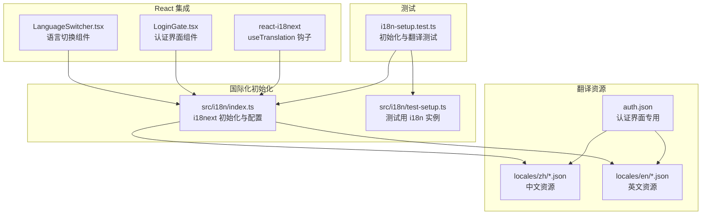
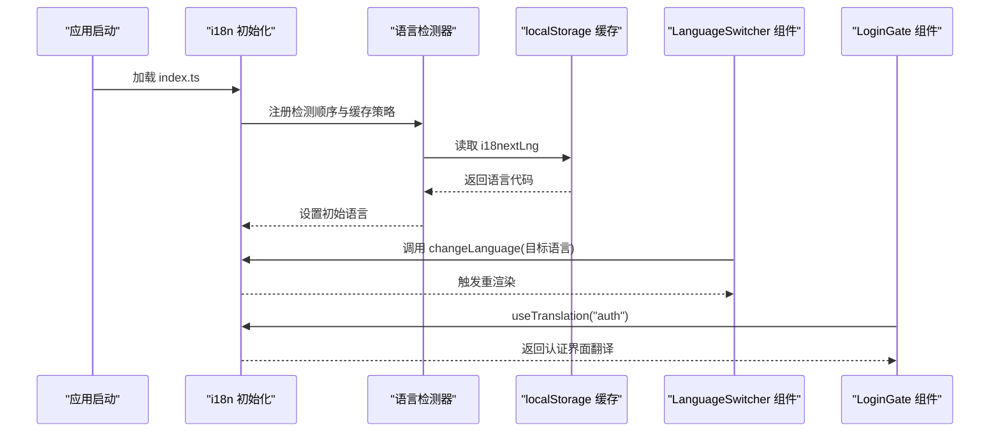
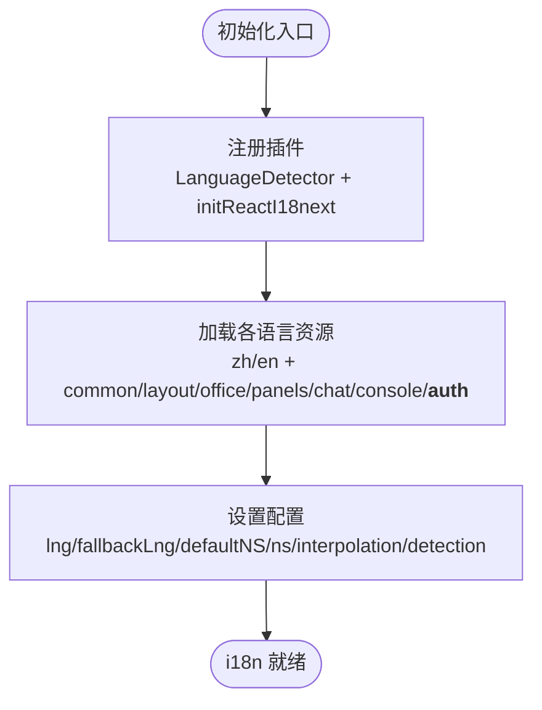
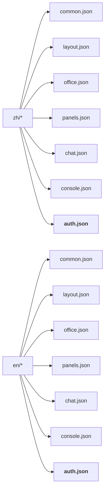
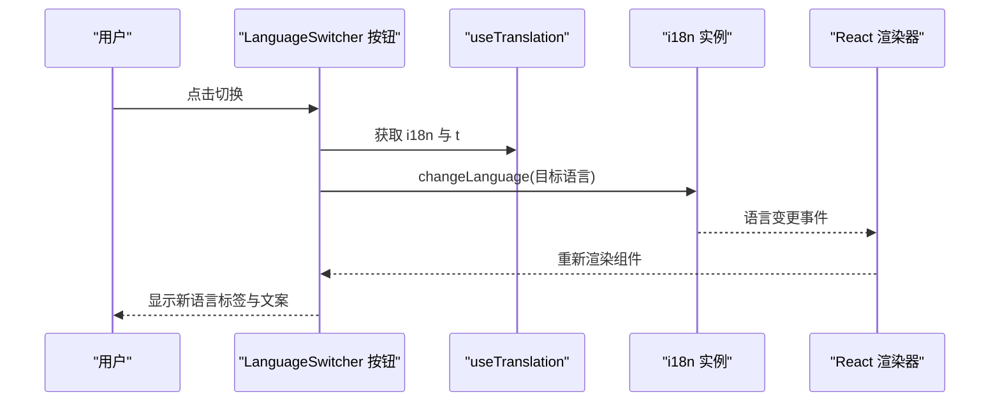
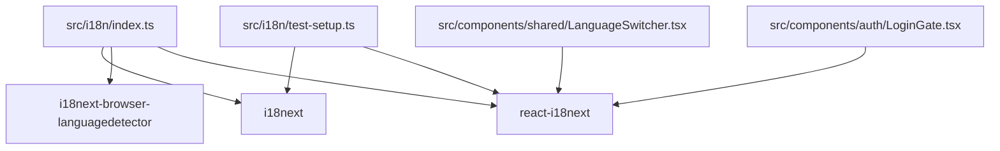

# 国际化系统

<cite>
**本文档引用的文件**
- [src/i18n/index.ts](file://src/i18n/index.ts)
- [src/i18n/test-setup.ts](file://src/i18n/test-setup.ts)
- [src/i18n/locales/en/chat.json](file://src/i18n/locales/en/chat.json)
- [src/i18n/locales/zh/chat.json](file://src/i18n/locales/zh/chat.json)
- [src/i18n/locales/en/common.json](file://src/i18n/locales/en/common.json)
- [src/i18n/locales/zh/common.json](file://src/i18n/locales/zh/common.json)
- [src/i18n/locales/en/layout.json](file://src/i18n/locales/en/layout.json)
- [src/i18n/locales/zh/layout.json](file://src/i18n/locales/zh/layout.json)
- [src/i18n/locales/en/console.json](file://src/i18n/locales/en/console.json)
- [src/i18n/locales/zh/console.json](file://src/i18n/locales/zh/console.json)
- [src/i18n/locales/en/office.json](file://src/i18n/locales/en/office.json)
- [src/i18n/locales/zh/office.json](file://src/i18n/locales/zh/office.json)
- [src/i18n/locales/en/panels.json](file://src/i18n/locales/en/panels.json)
- [src/i18n/locales/zh/panels.json](file://src/i18n/locales/zh/panels.json)
- [src/i18n/locales/en/auth.json](file://src/i18n/locales/en/auth.json)
- [src/i18n/locales/zh/auth.json](file://src/i18n/locales/zh/auth.json)
- [src/components/shared/LanguageSwitcher.tsx](file://src/components/shared/LanguageSwitcher.tsx)
- [src/components/auth/LoginGate.tsx](file://src/components/auth/LoginGate.tsx)
- [src/i18n/__tests__/i18n-setup.test.ts](file://src/i18n/__tests__/i18n-setup.test.ts)
</cite>

## 更新摘要
**变更内容**
- 新增认证界面国际化支持，添加 `auth` 命名空间
- 更新命名空间配置，将 `auth` 添加到支持的命名空间列表
- 完善认证组件的翻译键值，支持中英文界面
- 扩展翻译资源文件组织，包含完整的认证相关文案

## 目录
1. [简介](#简介)
2. [项目结构](#项目结构)
3. [核心组件](#核心组件)
4. [架构总览](#架构总览)
5. [详细组件分析](#详细组件分析)
6. [依赖分析](#依赖分析)
7. [性能考虑](#性能考虑)
8. [故障排除指南](#故障排除指南)
9. [结论](#结论)
10. [附录](#附录)

## 简介
本文件面向国际化系统的技术文档，围绕 i18next 初始化配置、资源加载与语言检测机制、多语言资源管理与动态加载策略、运行时语言切换与组件重新渲染、翻译文件结构与模块划分、LanguageSwitcher 组件设计与使用方法、认证界面国际化支持、最佳实践与性能优化等方面进行深入解析。文档旨在帮助开发者快速理解并高效维护该国际化体系。

## 项目结构
国际化系统主要由以下部分组成：
- 初始化入口：负责 i18next 实例化、命名空间注册、语言检测与回退策略配置
- 资源文件：按语言与命名空间组织的 JSON 翻译资源，包括新增的认证界面支持
- React 集成：通过 react-i18next 在组件中使用翻译
- 语言切换组件：提供运行时语言切换能力
- 认证界面：专门的登录页面国际化支持
- 测试与验证：单元测试覆盖初始化、命名空间加载、插值与回退逻辑

**图表来源**
- [src/i18n/index.ts:1-63](file://src/i18n/index.ts#L1-L63)
- [src/i18n/test-setup.ts:1-45](file://src/i18n/test-setup.ts#L1-L45)
- [src/components/shared/LanguageSwitcher.tsx:1-25](file://src/components/shared/LanguageSwitcher.tsx#L1-L25)
- [src/components/auth/LoginGate.tsx:1-186](file://src/components/auth/LoginGate.tsx#L1-L186)
- [src/i18n/__tests__/i18n-setup.test.ts:1-62](file://src/i18n/__tests__/i18n-setup.test.ts#L1-L62)

**章节来源**
- [src/i18n/index.ts:1-63](file://src/i18n/index.ts#L1-L63)
- [src/i18n/test-setup.ts:1-45](file://src/i18n/test-setup.ts#L1-L45)

## 核心组件
- i18next 初始化与配置
  - 支持语言：中文(zh)、英文(en)
  - 命名空间：common、layout、office、panels、chat、console、**auth**（新增）
  - 默认命名空间：common
  - 回退语言：zh
  - 插值：escapeValue=false，允许 HTML 内容
  - 语言检测：优先使用 localStorage 缓存，其次使用浏览器 navigator
- 翻译资源组织
  - 每个语言按命名空间拆分为独立 JSON 文件，包括新增的认证界面资源
  - 资源键采用层级结构，便于模块化管理
- LanguageSwitcher 组件
  - 使用 useTranslation 获取 t 与 i18n 实例
  - 通过 i18n.changeLanguage 实现运行时切换
  - 根据当前语言动态显示中/英标签与 aria-label
- **认证界面组件**
  - LoginGate 组件使用 `useTranslation("auth")` 获取认证相关翻译
  - 支持标题、字段、按钮、错误信息等完整认证界面文案
  - 包含令牌和密码输入的显示/隐藏功能文案

**章节来源**
- [src/i18n/index.ts:22-63](file://src/i18n/index.ts#L22-L63)
- [src/components/shared/LanguageSwitcher.tsx:3-24](file://src/components/shared/LanguageSwitcher.tsx#L3-L24)
- [src/components/auth/LoginGate.tsx:8,105-113](file://src/components/auth/LoginGate.tsx#L8,105-113)

## 架构总览
国际化系统采用"集中初始化 + 模块化资源"的架构：
- 初始化阶段：注册语言检测器、React 集成插件，构建资源映射，设置默认与回退语言
- 运行阶段：组件通过 useTranslation 访问翻译；语言切换通过 i18n.changeLanguage 触发
- 资源加载：静态导入各命名空间资源，便于打包与 Tree Shaking
- **认证界面集成**：专门的 auth 命名空间为登录页面提供完整的国际化支持

**图表来源**
- [src/i18n/index.ts:22-63](file://src/i18n/index.ts#L22-L63)
- [src/components/shared/LanguageSwitcher.tsx:10-12](file://src/components/shared/LanguageSwitcher.tsx#L10-L12)
- [src/components/auth/LoginGate.tsx:8](file://src/components/auth/LoginGate.tsx#L8)

## 详细组件分析

### i18n 初始化与配置
- 初始化流程
  - 引入 i18next、语言检测器与 react-i18next
  - 导入各语言各命名空间的 JSON 资源，包括新增的认证资源
  - 配置 resources、supportedLngs、fallbackLng、defaultNS、ns、interpolation
  - 配置 detection.order、detection.caches、lookupLocalStorage
- 关键点
  - supportedLngs 与 namespaces 作为常量导出，便于统一管理
  - **新增 auth 命名空间到 namespaces 数组**
  - detection.caches=["localStorage"] 保证用户选择持久化
  - escapeValue=false 允许在翻译中使用 HTML 标签

**图表来源**
- [src/i18n/index.ts:22-63](file://src/i18n/index.ts#L22-L63)

**章节来源**
- [src/i18n/index.ts:22-63](file://src/i18n/index.ts#L22-L63)

### 翻译资源管理与命名空间
- 命名空间划分
  - common：通用状态、动作、时间格式、空态文案、错误提示、事件标签
  - layout：顶部栏、侧边栏、控制台导航等布局相关文案
  - office：3D 办公室场景、区域、面板、网关状态等
  - panels：指标面板、事件时间轴、Token 图表等
  - chat：对话 Dock、消息、工具状态、会话切换、Slash 命令等
  - console：仪表盘、渠道、技能、定时任务、设置、代理管理等
  - **auth：认证界面专用，包括登录标题、字段、按钮、错误信息等**
- 资源文件组织
  - 每个语言一个目录，每个命名空间一个 JSON 文件
  - 键名采用层级结构，便于按模块检索与维护
- 插值与复数
  - 多处使用 {{count}} 插值，如时间、消息数量等
  - 英文资源包含复数形式键（如 relativeMinutes_one/other）

**图表来源**
- [src/i18n/locales/zh/common.json:1-99](file://src/i18n/locales/zh/common.json#L1-L99)
- [src/i18n/locales/zh/layout.json:1-61](file://src/i18n/locales/zh/layout.json#L1-L61)
- [src/i18n/locales/zh/office.json:1-105](file://src/i18n/locales/zh/office.json#L1-L105)
- [src/i18n/locales/zh/panels.json:1-31](file://src/i18n/locales/zh/panels.json#L1-L31)
- [src/i18n/locales/zh/chat.json:1-147](file://src/i18n/locales/zh/chat.json#L1-L147)
- [src/i18n/locales/zh/console.json:1-728](file://src/i18n/locales/zh/console.json#L1-L728)
- [src/i18n/locales/zh/auth.json:1-23](file://src/i18n/locales/zh/auth.json#L1-L23)

**章节来源**
- [src/i18n/locales/en/common.json:1-99](file://src/i18n/locales/en/common.json#L1-L99)
- [src/i18n/locales/zh/common.json:1-99](file://src/i18n/locales/zh/common.json#L1-L99)
- [src/i18n/locales/en/layout.json:1-61](file://src/i18n/locales/en/layout.json#L1-L61)
- [src/i18n/locales/zh/layout.json:1-61](file://src/i18n/locales/zh/layout.json#L1-L61)
- [src/i18n/locales/en/office.json:1-105](file://src/i18n/locales/en/office.json#L1-L105)
- [src/i18n/locales/zh/office.json:1-105](file://src/i18n/locales/zh/office.json#L1-L105)
- [src/i18n/locales/en/panels.json:1-31](file://src/i18n/locales/en/panels.json#L1-L31)
- [src/i18n/locales/zh/panels.json:1-31](file://src/i18n/locales/zh/panels.json#L1-L31)
- [src/i18n/locales/en/chat.json:1-150](file://src/i18n/locales/en/chat.json#L1-L150)
- [src/i18n/locales/zh/chat.json:1-147](file://src/i18n/locales/zh/chat.json#L1-L147)
- [src/i18n/locales/en/console.json:1-728](file://src/i18n/locales/en/console.json#L1-L728)
- [src/i18n/locales/zh/console.json:1-728](file://src/i18n/locales/zh/console.json#L1-L728)
- [src/i18n/locales/en/auth.json:1-23](file://src/i18n/locales/en/auth.json#L1-L23)
- [src/i18n/locales/zh/auth.json:1-23](file://src/i18n/locales/zh/auth.json#L1-L23)

### 语言切换机制与组件重新渲染
- LanguageSwitcher 组件
  - 通过 useTranslation 获取 i18n 与 t
  - 根据当前语言决定标签与 aria-label
  - 调用 i18n.changeLanguage 切换语言
- 运行时切换流程
  - changeLanguage 触发 i18n 内部状态更新
  - react-i18next 订阅语言变化并触发订阅组件重渲染
  - DOM 文案随命名空间与插值参数自动更新

**图表来源**
- [src/components/shared/LanguageSwitcher.tsx:4-12](file://src/components/shared/LanguageSwitcher.tsx#L4-L12)

**章节来源**
- [src/components/shared/LanguageSwitcher.tsx:3-24](file://src/components/shared/LanguageSwitcher.tsx#L3-L24)

### 认证界面国际化支持
- **新增功能**：专门的认证界面国际化支持
- **命名空间使用**：LoginGate 组件使用 `useTranslation("auth")` 获取认证相关翻译
- **翻译键值结构**：
  - 基础信息：title（标题）、subtitle（副标题）、hint（提示信息）
  - 表单字段：fields.gatewayUrl、fields.token、fields.password、fields.remember
  - 输入占位符：fields.tokenPlaceholder、fields.passwordPlaceholder
  - 显示切换：toggle.show、toggle.hide
  - 操作按钮：connect（连接）、connecting（连接中）
  - 错误信息：error.title（认证失败）
- **组件集成**：认证界面组件自动响应语言切换，无需额外配置

**章节来源**
- [src/components/auth/LoginGate.tsx:8,52-54,60,74-82,84-93,102,110,123,126,131](file://src/components/auth/LoginGate.tsx#L8,52-54,60,74-82,84-93,102,110,123,126,131)
- [src/i18n/locales/en/auth.json:1-23](file://src/i18n/locales/en/auth.json#L1-L23)
- [src/i18n/locales/zh/auth.json:1-23](file://src/i18n/locales/zh/auth.json#L1-L23)

### 翻译文件结构详解
- common.json
  - 通用状态、动作、时间格式、空态文案、错误提示、事件标签
  - 示例键：status.connected、actions.send、time.secondsAgo、empty.noEvents、errors.notConnected、events.startRunning
- layout.json
  - 顶部栏、侧边栏、控制台导航等布局相关文案
  - 示例键：topbar.console、sidebar.searchPlaceholder、consoleNav.dashboard
- office.json
  - 3D 办公室场景、区域、面板、网关状态等
  - 示例键：loading3D、zones.desk、livingOffice.hud.wsOnline、panels.gatewayHeader
- panels.json
  - 指标面板、事件时间轴、Token 图表等
  - 示例键：metrics.activeAgents、agentDetail.toolCallHistory、eventTimeline.newEvents
- chat.json
  - 对话 Dock、消息、工具状态、会话切换、Slash 命令等
  - 示例键：dock.placeholder、message.assistant、toolStatus.running、slash.commands.export、contextMenu.kill
- console.json
  - 仪表盘、渠道、技能、定时任务、设置、代理管理等
  - 示例键：dashboard.title、channels.types.telegram、skills.tabs.installed、cron.dialog.createTitle、settings.appearance.theme
- **auth.json（新增）**
  - 认证界面专用翻译，包括标题、字段、按钮、错误信息等
  - 示例键：title、subtitle、fields.gatewayUrl、fields.token、fields.password、fields.remember、toggle.show、toggle.hide、connect、connecting、error.title、hint

**章节来源**
- [src/i18n/locales/en/common.json:1-99](file://src/i18n/locales/en/common.json#L1-L99)
- [src/i18n/locales/zh/common.json:1-99](file://src/i18n/locales/zh/common.json#L1-L99)
- [src/i18n/locales/en/layout.json:1-61](file://src/i18n/locales/en/layout.json#L1-L61)
- [src/i18n/locales/zh/layout.json:1-61](file://src/i18n/locales/zh/layout.json#L1-L61)
- [src/i18n/locales/en/office.json:1-105](file://src/i18n/locales/en/office.json#L1-L105)
- [src/i18n/locales/zh/office.json:1-105](file://src/i18n/locales/zh/office.json#L1-L105)
- [src/i18n/locales/en/panels.json:1-31](file://src/i18n/locales/en/panels.json#L1-L31)
- [src/i18n/locales/zh/panels.json:1-31](file://src/i18n/locales/zh/panels.json#L1-L31)
- [src/i18n/locales/en/chat.json:1-150](file://src/i18n/locales/en/chat.json#L1-L150)
- [src/i18n/locales/zh/chat.json:1-147](file://src/i18n/locales/zh/chat.json#L1-L147)
- [src/i18n/locales/en/console.json:1-728](file://src/i18n/locales/en/console.json#L1-L728)
- [src/i18n/locales/zh/console.json:1-728](file://src/i18n/locales/zh/console.json#L1-L728)
- [src/i18n/locales/en/auth.json:1-23](file://src/i18n/locales/en/auth.json#L1-L23)
- [src/i18n/locales/zh/auth.json:1-23](file://src/i18n/locales/zh/auth.json#L1-L23)

### LanguageSwitcher 组件设计与使用
- 设计要点
  - 仅依赖 useTranslation，不引入外部状态管理
  - 标签与 aria-label 根据当前语言动态计算
  - 点击切换通过 i18n.changeLanguage 实现
- 使用方法
  - 在需要的语言切换入口（如顶部栏）直接引入并渲染组件
  - 组件内部自动响应语言变化并更新显示

**章节来源**
- [src/components/shared/LanguageSwitcher.tsx:3-24](file://src/components/shared/LanguageSwitcher.tsx#L3-L24)

## 依赖分析
- 外部依赖
  - i18next：核心国际化库
  - i18next-browser-languagedetector：浏览器语言检测
  - react-i18next：React 集成与 hooks
- 内部依赖
  - index.ts 导入各语言各命名空间 JSON 资源，包括新增的认证资源
  - LanguageSwitcher.tsx 依赖 useTranslation 与 i18n.changeLanguage
  - **LoginGate.tsx 依赖 useTranslation("auth") 获取认证界面翻译**
  - 测试文件依赖 test-setup.ts 构建测试用 i18n 实例

**图表来源**
- [src/i18n/index.ts:1-3](file://src/i18n/index.ts#L1-L3)
- [src/components/shared/LanguageSwitcher.tsx:1](file://src/components/shared/LanguageSwitcher.tsx#L1)
- [src/components/auth/LoginGate.tsx:3](file://src/components/auth/LoginGate.tsx#L3)
- [src/i18n/test-setup.ts:1-2](file://src/i18n/test-setup.ts#L1-L2)

**章节来源**
- [src/i18n/index.ts:1-3](file://src/i18n/index.ts#L1-L3)
- [src/components/shared/LanguageSwitcher.tsx:1](file://src/components/shared/LanguageSwitcher.tsx#L1)
- [src/components/auth/LoginGate.tsx:3](file://src/components/auth/LoginGate.tsx#L3)
- [src/i18n/test-setup.ts:1-2](file://src/i18n/test-setup.ts#L1-L2)

## 性能考虑
- 资源加载策略
  - 采用静态导入各命名空间资源，有利于打包器 Tree Shaking 与按需优化
  - 建议在大型应用中考虑按需动态加载（Dynamic Import），减少首屏体积
- 语言检测
  - 使用 localStorage 缓存用户选择，避免每次刷新重新检测
  - 语言检测顺序合理，优先缓存再浏览器，兼顾体验与准确性
- 渲染优化
  - react-i18next 通过订阅语言变化触发局部重渲染，避免全量刷新
  - 建议在高频切换场景下结合 React.memo 与 useMemo 优化组件重渲染
- **认证界面优化**
  - 认证界面使用独立的命名空间，避免影响其他组件的翻译性能
  - 登录表单组件按需渲染，减少不必要的翻译调用

## 故障排除指南
- 初始化问题
  - 确认 supportedLngs 与 namespaces 常量与实际资源一致
  - **检查 auth 命名空间是否正确添加到 namespaces 数组**
  - 检查 detection.caches 与 lookupLocalStorage 是否正确
- 翻译缺失
  - 使用 hasResourceBundle 检查命名空间是否加载
  - 确认键名拼写与层级结构
  - **验证认证界面的翻译键值是否完整**
- 插值与回退
  - 插值参数需与资源键对应
  - 非支持语言将回退到 fallbackLng
- 测试验证
  - 使用测试用 i18n 实例验证初始化、命名空间加载、插值与回退逻辑
  - **新增认证界面翻译的测试覆盖**

**章节来源**
- [src/i18n/__tests__/i18n-setup.test.ts:1-62](file://src/i18n/__tests__/i18n-setup.test.ts#L1-L62)
- [src/i18n/test-setup.ts:16-42](file://src/i18n/test-setup.ts#L16-L42)

## 结论
该国际化系统通过清晰的命名空间划分、稳定的初始化配置与简洁的语言切换组件，实现了中英文双语支持与良好的扩展性。**新增的认证界面国际化支持进一步完善了系统的国际化能力，为登录页面提供了完整的多语言支持**。配合测试用例与合理的资源组织，能够满足复杂业务场景下的多语言需求。建议在后续迭代中关注动态加载策略与渲染性能优化，以进一步提升用户体验。

## 附录
- 配置示例与使用方法
  - 初始化：参考 [src/i18n/index.ts:22-63](file://src/i18n/index.ts#L22-L63)
  - 测试：参考 [src/i18n/__tests__/i18n-setup.test.ts:1-62](file://src/i18n/__tests__/i18n-setup.test.ts#L1-L62)
  - 语言切换：参考 [src/components/shared/LanguageSwitcher.tsx:3-24](file://src/components/shared/LanguageSwitcher.tsx#L3-L24)
  - **认证界面：参考 [src/components/auth/LoginGate.tsx:8](file://src/components/auth/LoginGate.tsx#L8)**
- 最佳实践
  - 保持命名空间与资源文件的一致性
  - 合理使用插值与复数规则
  - 在组件中尽量使用 useTranslation，避免直接依赖全局状态
  - 对大型应用考虑动态加载策略以优化首屏性能
  - **为特殊界面（如认证页面）创建独立的命名空间，便于管理和维护**