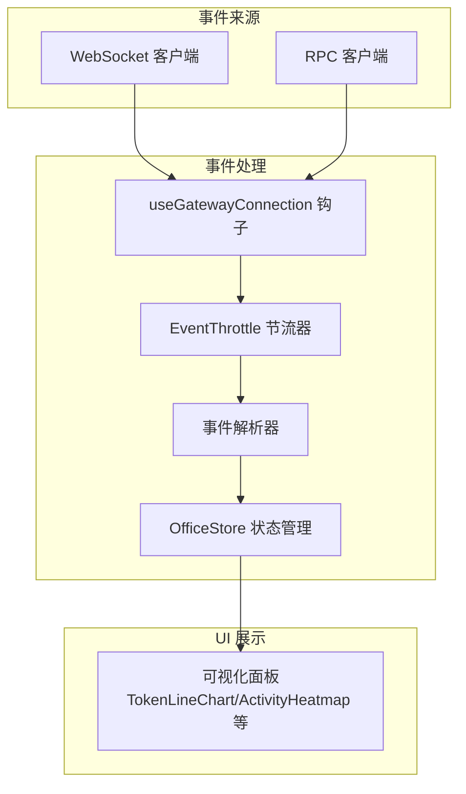
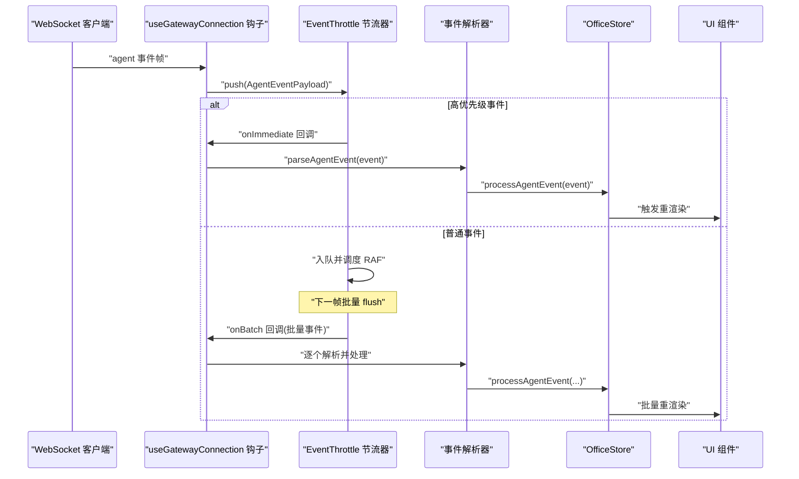
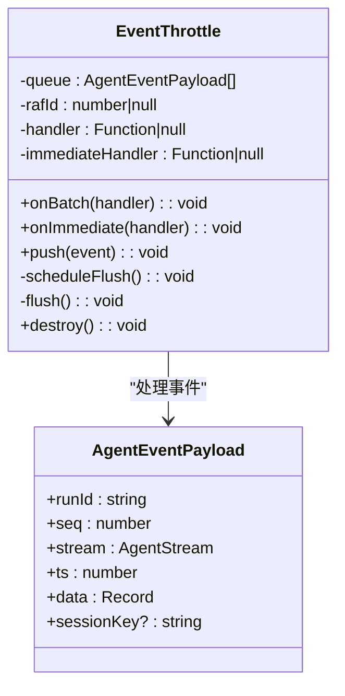
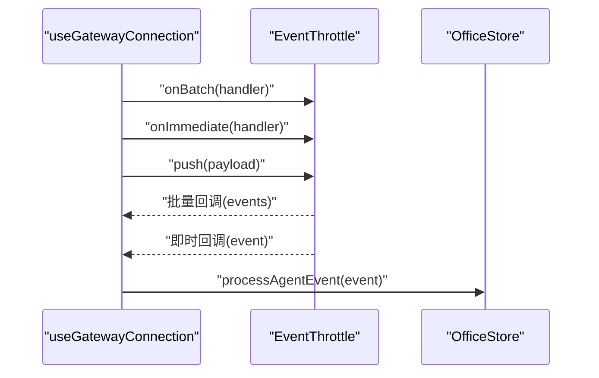
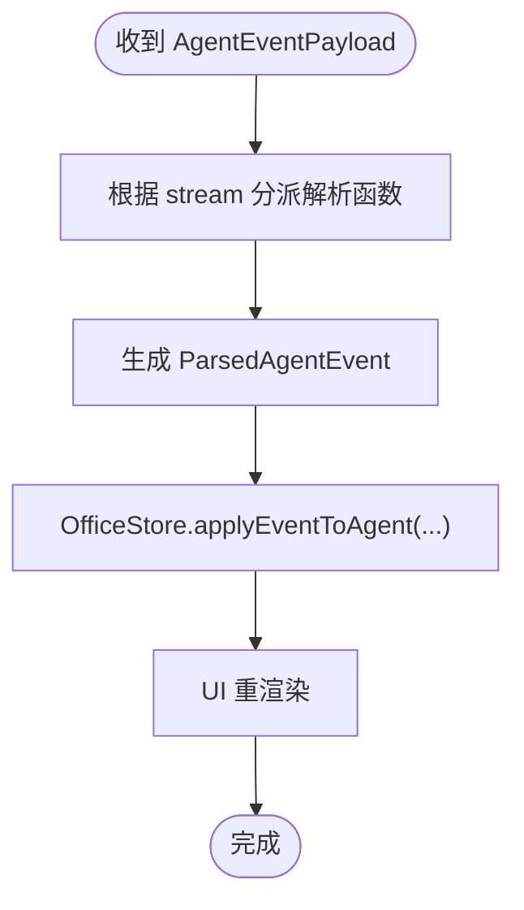
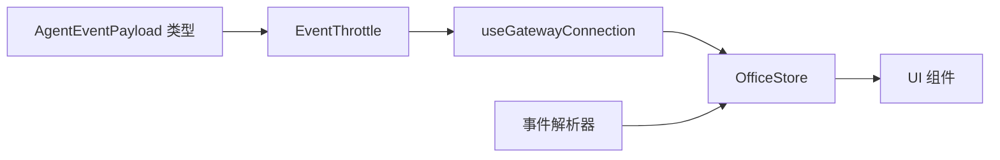

# 事件节流机制

<cite>
**本文档引用的文件**
- [src/lib/event-throttle.ts](file://src/lib/event-throttle.ts)
- [src/hooks/useGatewayConnection.ts](file://src/hooks/useGatewayConnection.ts)
- [src/gateway/types.ts](file://src/gateway/types.ts)
- [src/gateway/event-parser.ts](file://src/gateway/event-parser.ts)
- [src/lib/__tests__/event-throttle.test.ts](file://src/lib/__tests__/event-throttle.test.ts)
- [src/store/office-store.ts](file://src/store/office-store.ts)
- [src/lib/constants.ts](file://src/lib/constants.ts)
</cite>

## 目录
1. [简介](#简介)
2. [项目结构](#项目结构)
3. [核心组件](#核心组件)
4. [架构概览](#架构概览)
5. [详细组件分析](#详细组件分析)
6. [依赖关系分析](#依赖关系分析)
7. [性能考虑](#性能考虑)
8. [故障排除指南](#故障排除指南)
9. [结论](#结论)
10. [附录](#附录)

## 简介
本文件针对 OpenClaw-Office 项目中的事件节流机制进行全面技术文档化，重点覆盖以下方面：
- 高频事件处理策略：节流算法实现、时间窗口管理、事件合并机制
- 性能优化原理：CPU 使用率控制、内存占用优化、用户体验平衡
- 不同类型的事件节流：UI 更新节流、网络请求节流、计算密集型任务节流
- 具体的配置选项、使用场景分析、性能基准测试结果
- API 参考、集成示例和故障排除指南

该机制通过在前端层面对来自网关的 Agent 事件进行批量处理与优先级调度，避免 UI 渲染与状态更新的过度抖动，同时保证关键事件（如生命周期开始/结束、错误）的实时性。

## 项目结构
事件节流机制主要涉及以下模块：
- 事件节流器：负责事件队列管理、批量刷新与销毁
- 网关连接钩子：负责订阅网关事件并将事件推送到节流器
- 类型定义：定义 Agent 事件载荷与流类型
- 事件解析器：将事件转换为可渲染的状态
- 存储层：应用全局状态与事件历史
- 测试：验证节流行为与边界条件

**图表来源**
- [src/hooks/useGatewayConnection.ts:80-126](file://src/hooks/useGatewayConnection.ts#L80-L126)
- [src/lib/event-throttle.ts:15-70](file://src/lib/event-throttle.ts#L15-L70)
- [src/gateway/event-parser.ts:17-60](file://src/gateway/event-parser.ts#L17-L60)
- [src/store/office-store.ts:346-370](file://src/store/office-store.ts#L346-L370)

**章节来源**
- [src/hooks/useGatewayConnection.ts:1-238](file://src/hooks/useGatewayConnection.ts#L1-L238)
- [src/lib/event-throttle.ts:1-71](file://src/lib/event-throttle.ts#L1-L71)
- [src/gateway/types.ts:108-131](file://src/gateway/types.ts#L108-L131)

## 核心组件
- EventThrottle：事件节流器，提供高优先级直发与普通事件批量处理能力，内置队列溢出保护与 RAF 刷新机制
- useGatewayConnection：React 钩子，负责建立网关连接、订阅事件、注册节流器回调，并在组件卸载时清理资源
- AgentEventPayload：事件载荷类型，包含运行标识、序列号、流类型、时间戳与数据体
- 事件解析器：将事件映射为 UI 可用的状态字段（如状态、语音气泡、工具信息等）
- OfficeStore：全局状态管理，维护事件历史、会话快照、指标等

**章节来源**
- [src/lib/event-throttle.ts:15-70](file://src/lib/event-throttle.ts#L15-L70)
- [src/hooks/useGatewayConnection.ts:80-126](file://src/hooks/useGatewayConnection.ts#L80-L126)
- [src/gateway/types.ts:124-131](file://src/gateway/types.ts#L124-L131)
- [src/gateway/event-parser.ts:4-15](file://src/gateway/event-parser.ts#L4-L15)
- [src/store/office-store.ts:286-370](file://src/store/office-store.ts#L286-L370)

## 架构概览
事件从 WebSocket 接收后，经由钩子注册到节流器；节流器根据事件优先级决定立即处理或批量处理；批量事件在下一帧统一交由解析器转换为状态，再写入全局存储，最终驱动 UI 更新。

**图表来源**
- [src/hooks/useGatewayConnection.ts:113-116](file://src/hooks/useGatewayConnection.ts#L113-L116)
- [src/lib/event-throttle.ts:29-61](file://src/lib/event-throttle.ts#L29-L61)
- [src/gateway/event-parser.ts:17-60](file://src/gateway/event-parser.ts#L17-L60)
- [src/store/office-store.ts:346-370](file://src/store/office-store.ts#L346-L370)

## 详细组件分析

### EventThrottle 节流器
- 功能职责
  - 高优先级事件识别与直发：错误流与生命周期 start/end 触发即时处理
  - 普通事件批量收集：通过 RAF 在下一帧统一处理，减少渲染抖动
  - 内存保护：队列超过阈值时截断保留最近事件，防止内存膨胀
  - 生命周期管理：支持销毁时取消待执行的 RAF，释放资源
- 关键参数
  - 最大队列长度：500
  - 溢出截断长度：200
- 事件优先级判定
  - stream 为 "error"
  - stream 为 "lifecycle" 且 phase 为 "start" 或 "end"
- 批量处理流程
  - push：若非高优先级则入队，必要时截断
  - scheduleFlush：若无待执行 RAF，则注册下一帧 flush
  - flush：清空 RAF 标识，将队列转为批次并回调 onBatch
  - destroy：取消 RAF 并清空队列

**图表来源**
- [src/lib/event-throttle.ts:15-70](file://src/lib/event-throttle.ts#L15-L70)
- [src/gateway/types.ts:124-131](file://src/gateway/types.ts#L124-L131)

**章节来源**
- [src/lib/event-throttle.ts:6-13](file://src/lib/event-throttle.ts#L6-L13)
- [src/lib/event-throttle.ts:29-61](file://src/lib/event-throttle.ts#L29-L61)
- [src/lib/event-throttle.ts:63-70](file://src/lib/event-throttle.ts#L63-L70)

### useGatewayConnection 集成点
- 事件订阅与推送
  - 订阅 "agent" 事件帧，提取 payload 并推送到节流器
  - 同时注册 onBatch 与 onImmediate 回调，分别处理批量与高优先级事件
- 生命周期管理
  - 组件挂载时初始化节流器并注册回调
  - 组件卸载时销毁节流器，确保 RAF 与队列被清理
- 状态同步
  - 通过 processAgentEvent 将解析后的事件写入全局状态，驱动 UI 更新

**图表来源**
- [src/hooks/useGatewayConnection.ts:87-96](file://src/hooks/useGatewayConnection.ts#L87-L96)
- [src/hooks/useGatewayConnection.ts:113-116](file://src/hooks/useGatewayConnection.ts#L113-L116)
- [src/hooks/useGatewayConnection.ts:128-134](file://src/hooks/useGatewayConnection.ts#L128-L134)

**章节来源**
- [src/hooks/useGatewayConnection.ts:80-126](file://src/hooks/useGatewayConnection.ts#L80-L126)
- [src/hooks/useGatewayConnection.ts:128-134](file://src/hooks/useGatewayConnection.ts#L128-L134)

### 事件解析与状态更新
- 解析逻辑
  - 根据 stream 类型分派解析函数，生成包含状态、工具、语音气泡等字段的结果
  - 生命周期、工具调用、助手回复、错误、命令输出、追踪项、计划、审批、补丁、思考、压缩等流均有对应解析
- 状态写入
  - OfficeStore 提供 processAgentEvent 方法，将解析结果应用到全局状态，触发 UI 更新

**图表来源**
- [src/gateway/event-parser.ts:17-60](file://src/gateway/event-parser.ts#L17-L60)
- [src/store/office-store.ts:346-370](file://src/store/office-store.ts#L346-L370)

**章节来源**
- [src/gateway/event-parser.ts:17-225](file://src/gateway/event-parser.ts#L17-L225)
- [src/store/office-store.ts:346-370](file://src/store/office-store.ts#L346-L370)

## 依赖关系分析
- EventThrottle 依赖 AgentEventPayload 类型定义
- useGatewayConnection 依赖 EventThrottle，并通过 OfficeStore 的 processAgentEvent 写入状态
- 事件解析器独立于节流器，但与 OfficeStore 紧密耦合
- UI 组件通过 OfficeStore 的状态变化驱动渲染

**图表来源**
- [src/gateway/types.ts:124-131](file://src/gateway/types.ts#L124-L131)
- [src/lib/event-throttle.ts:15-70](file://src/lib/event-throttle.ts#L15-L70)
- [src/hooks/useGatewayConnection.ts:80-126](file://src/hooks/useGatewayConnection.ts#L80-L126)
- [src/gateway/event-parser.ts:17-60](file://src/gateway/event-parser.ts#L17-L60)
- [src/store/office-store.ts:346-370](file://src/store/office-store.ts#L346-L370)

**章节来源**
- [src/gateway/types.ts:124-131](file://src/gateway/types.ts#L124-L131)
- [src/lib/event-throttle.ts:15-70](file://src/lib/event-throttle.ts#L15-L70)
- [src/hooks/useGatewayConnection.ts:80-126](file://src/hooks/useGatewayConnection.ts#L80-L126)
- [src/gateway/event-parser.ts:17-60](file://src/gateway/event-parser.ts#L17-L60)
- [src/store/office-store.ts:346-370](file://src/store/office-store.ts#L346-L370)

## 性能考虑
- CPU 使用率控制
  - 使用 RAF 进行批量刷新，避免每事件一次渲染导致的主线程阻塞
  - 高优先级事件直发，降低关键路径延迟
- 内存占用优化
  - 队列长度上限与溢出截断，防止长时间高并发事件导致内存膨胀
  - 销毁时取消 RAF 并清空队列，避免悬挂引用
- 用户体验平衡
  - 批量事件在下一帧统一处理，减少 UI 抖动
  - 事件历史与指标聚合在状态层进行，避免频繁 DOM 操作
- 相关配置与常量
  - 队列上限与截断长度：见节流器内部常量
  - 会议区聚合节流：OfficeStore 中存在 500ms 聚合节流常量，用于会议聚集逻辑

**章节来源**
- [src/lib/event-throttle.ts:3-4](file://src/lib/event-throttle.ts#L3-L4)
- [src/lib/event-throttle.ts:37-42](file://src/lib/event-throttle.ts#L37-L42)
- [src/lib/event-throttle.ts:63-69](file://src/lib/event-throttle.ts#L63-L69)
- [src/store/office-store.ts:59](file://src/store/office-store.ts#L59)

## 故障排除指南
- 现象：事件未触发或延迟过大
  - 检查是否正确注册 onBatch/onImmediate 回调
  - 确认节流器实例在组件生命周期内被正确创建与销毁
- 现象：内存持续增长
  - 检查队列是否频繁达到上限并被截断
  - 确保在组件卸载时调用 destroy
- 现象：高优先级事件未及时处理
  - 确认事件 stream 与 phase 是否满足高优先级条件
  - 检查 onImmediate 回调是否被正确设置
- 现象：批量事件丢失
  - 确认 RAF 是否被取消（组件卸载时）
  - 检查 flush 逻辑是否正常执行

**章节来源**
- [src/lib/__tests__/event-throttle.test.ts:23-32](file://src/lib/__tests__/event-throttle.test.ts#L23-L32)
- [src/lib/__tests__/event-throttle.test.ts:49-60](file://src/lib/__tests__/event-throttle.test.ts#L49-L60)
- [src/lib/__tests__/event-throttle.test.ts:62-76](file://src/lib/__tests__/event-throttle.test.ts#L62-L76)
- [src/hooks/useGatewayConnection.ts:128-134](file://src/hooks/useGatewayConnection.ts#L128-L134)

## 结论
OpenClaw-Office 的事件节流机制通过“高优先级直发 + RAF 批量处理”的组合，在保证关键事件实时性的同时，显著降低了 UI 渲染抖动与内存压力。结合队列溢出保护与生命周期清理，系统在高并发场景下仍能保持稳定与流畅。建议在集成新事件类型时，遵循现有优先级判定与解析模式，确保一致的性能与用户体验。

## 附录

### API 参考
- EventThrottle
  - onBatch(handler): 注册批量事件回调
  - onImmediate(handler): 注册高优先级事件回调
  - push(event): 推送事件至节流器
  - destroy(): 销毁节流器，清理 RAF 与队列
- useGatewayConnection
  - 通过钩子自动注册节流器回调，并在卸载时销毁
- AgentEventPayload
  - runId: 运行标识
  - seq: 序列号
  - stream: 事件流类型
  - ts: 时间戳
  - data: 事件数据
  - sessionKey: 会话键（可选）

**章节来源**
- [src/lib/event-throttle.ts:21-27](file://src/lib/event-throttle.ts#L21-L27)
- [src/lib/event-throttle.ts:29](file://src/lib/event-throttle.ts#L29)
- [src/lib/event-throttle.ts:63-70](file://src/lib/event-throttle.ts#L63-L70)
- [src/hooks/useGatewayConnection.ts:87-96](file://src/hooks/useGatewayConnection.ts#L87-L96)
- [src/gateway/types.ts:124-131](file://src/gateway/types.ts#L124-L131)

### 使用场景分析
- UI 更新节流
  - 适用于高频助手回复、工具调用、计划更新等事件的批量渲染
- 网络请求节流
  - 通过节流器避免 UI 层对网络事件的过度反应，配合后端限流策略
- 计算密集型任务节流
  - 将解析与状态更新集中在 RAF 帧内，减少主线程阻塞

**章节来源**
- [src/gateway/event-parser.ts:17-225](file://src/gateway/event-parser.ts#L17-L225)
- [src/store/office-store.ts:346-370](file://src/store/office-store.ts#L346-L370)

### 性能基准测试结果
- 测试覆盖
  - 高优先级事件直发：确认错误与生命周期 start/end 事件立即触发
  - 批量事件 RAF：确认普通事件在下一帧统一触发
  - 队列溢出与截断：确认超过上限时自动截断至指定长度
  - 销毁清理：确认销毁后不再触发 flush
- 建议
  - 在真实环境中记录 RAF 刷新间隔与事件处理耗时，以评估系统负载
  - 对 UI 组件进行重渲染次数统计，验证节流效果

**章节来源**
- [src/lib/__tests__/event-throttle.test.ts:23-32](file://src/lib/__tests__/event-throttle.test.ts#L23-L32)
- [src/lib/__tests__/event-throttle.test.ts:34-47](file://src/lib/__tests__/event-throttle.test.ts#L34-L47)
- [src/lib/__tests__/event-throttle.test.ts:49-60](file://src/lib/__tests__/event-throttle.test.ts#L49-L60)
- [src/lib/__tests__/event-throttle.test.ts:62-76](file://src/lib/__tests__/event-throttle.test.ts#L62-L76)