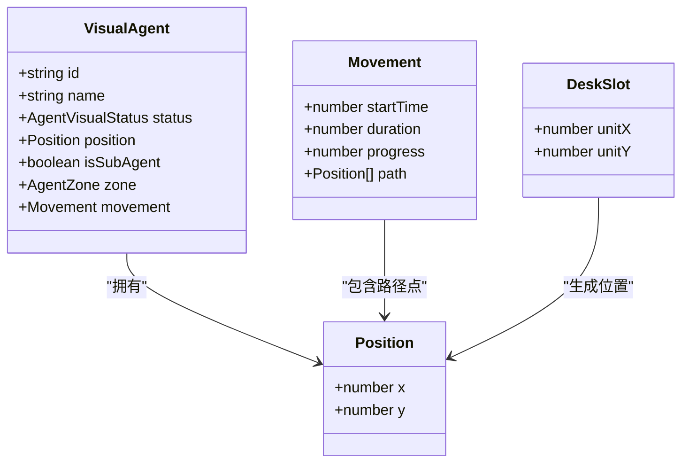
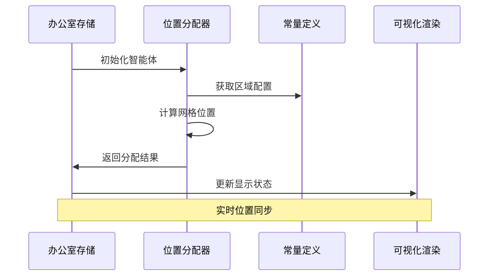
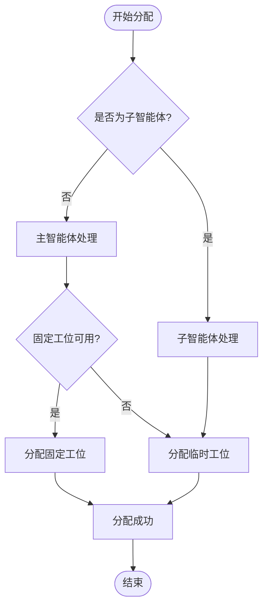
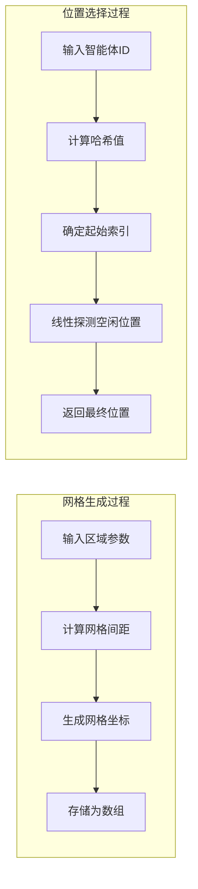
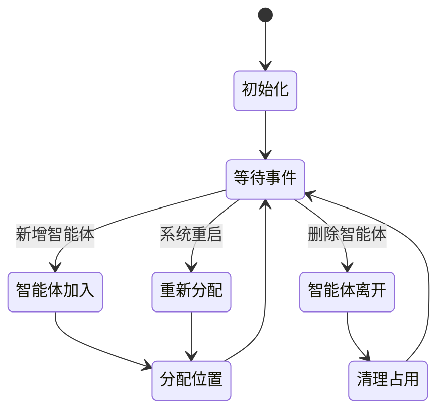
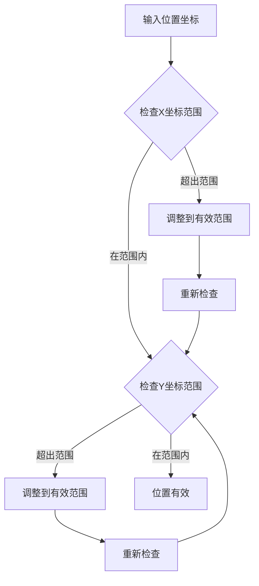
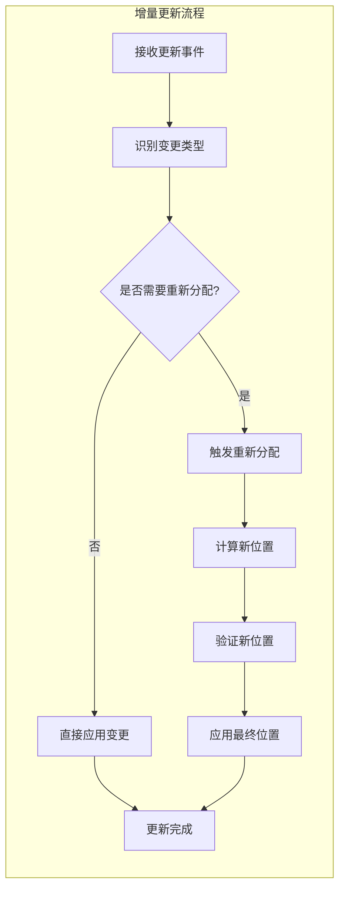
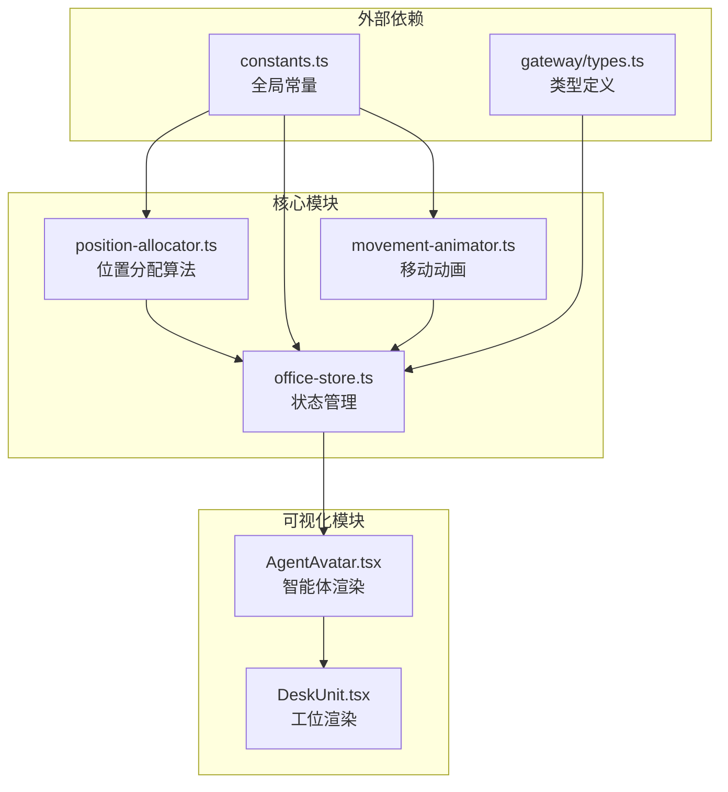

# 位置分配算法

<cite>
**本文档引用的文件**
- [position-allocator.ts](file://src/lib/position-allocator.ts)
- [constants.ts](file://src/lib/constants.ts)
- [office-store.ts](file://src/store/office-store.ts)
- [movement-animator.ts](file://src/lib/movement-animator.ts)
- [AgentAvatar.tsx](file://src/components/office-2d/AgentAvatar.tsx)
- [DeskUnit.tsx](file://src/components/office-2d/DeskUnit.tsx)
- [position-allocator.test.ts](file://src/lib/__tests__/position-allocator.test.ts)
- [movement-animator.test.ts](file://src/lib/__tests__/movement-animator.test.ts)
</cite>

## 目录
1. [简介](#简介)
2. [项目结构](#项目结构)
3. [核心组件](#核心组件)
4. [架构概览](#架构概览)
5. [详细组件分析](#详细组件分析)
6. [依赖关系分析](#依赖关系分析)
7. [性能考虑](#性能考虑)
8. [故障排除指南](#故障排除指南)
9. [结论](#结论)
10. [附录](#附录)

## 简介

位置分配算法是OpenClaw-Office虚拟办公室系统的核心组件之一，负责在2D办公室环境中为智能体（Agent）分配稳定且无冲突的位置。该算法实现了智能的空间划分策略、网格分配机制和动态调整逻辑，确保每个智能体都能获得合适的工作位置。

本算法主要解决以下关键问题：
- 固定工位与临时工位的智能分配
- 智能体之间的碰撞避免
- 动态环境下的位置更新
- 性能优化和可扩展性

## 项目结构

位置分配算法位于项目的`src/lib`目录下，与办公室存储管理、移动动画等模块协同工作：

```mermaid
graph TB
subgraph "位置分配模块"
PA[position-allocator.ts<br/>位置分配算法核心"]
CT[constants.ts<br/>常量定义]
end
subgraph "存储管理"
OS[office-store.ts<br/>办公室状态管理]
end
subgraph "可视化层"
AA[AgentAvatar.tsx<br/>智能体头像渲染]
DU[DeskUnit.tsx<br/>工位单元渲染]
end
subgraph "移动动画"
MA[movement-animator.ts<br/>移动路径规划]
end
PA --> CT
OS --> PA
AA --> OS
DU --> AA
MA --> OS
```

**图表来源**
- [position-allocator.ts:1-209](file://src/lib/position-allocator.ts#L1-L209)
- [constants.ts:1-141](file://src/lib/constants.ts#L1-L141)
- [office-store.ts:650-849](file://src/store/office-store.ts#L650-L849)

**章节来源**
- [position-allocator.ts:1-209](file://src/lib/position-allocator.ts#L1-L209)
- [constants.ts:1-141](file://src/lib/constants.ts#L1-L141)

## 核心组件

位置分配算法由多个核心组件构成，每个组件负责特定的功能：

### 主要算法函数

1. **allocatePosition**: 主要位置分配函数
2. **allocateMeetingPositions**: 会议座位分配
3. **calculateDeskSlots**: 工位槽位计算
4. **calculateLoungePositions**: 休息区位置计算

### 数据结构



**图表来源**
- [position-allocator.ts:105-108](file://src/lib/position-allocator.ts#L105-L108)
- [office-store.ts:86-144](file://src/store/office-store.ts#L86-L144)

**章节来源**
- [position-allocator.ts:105-190](file://src/lib/position-allocator.ts#L105-L190)
- [office-store.ts:86-144](file://src/store/office-store.ts#L86-L144)

## 架构概览

位置分配算法在整个系统中的架构位置如下：



**图表来源**
- [office-store.ts:706-726](file://src/store/office-store.ts#L706-L726)
- [position-allocator.ts:51-82](file://src/lib/position-allocator.ts#L51-L82)

## 详细组件分析

### 空间划分策略

位置分配算法采用基于区域的空间划分策略：



**图表来源**
- [position-allocator.ts:51-82](file://src/lib/position-allocator.ts#L51-L82)

#### 固定工位分配机制

固定工位采用网格化分配策略：

1. **网格生成**: 基于`DESK_GRID_COLS × DESK_GRID_ROWS`生成预定义网格
2. **哈希映射**: 使用字符串哈希函数确定起始位置
3. **冲突检测**: 通过`Set<string>`检查位置占用情况
4. **循环查找**: 从起始位置开始线性探测空闲位置

#### 临时工位分配机制

临时工位采用优先级分配策略：

1. **优先分配**: 子智能体优先分配到临时工位
2. **网格填充**: 使用`HOT_DESK_GRID_COLS × HOT_DESK_GRID_ROWS`网格
3. **溢出处理**: 当网格满载时采用随机偏移策略

**章节来源**
- [position-allocator.ts:51-82](file://src/lib/position-allocator.ts#L51-L82)
- [constants.ts:96-104](file://src/lib/constants.ts#L96-L104)

### 网格分配机制

网格分配机制是位置分配算法的核心组成部分：



**图表来源**
- [position-allocator.ts:24-42](file://src/lib/position-allocator.ts#L24-L42)
- [position-allocator.ts:51-82](file://src/lib/position-allocator.ts#L51-L82)

#### 网格生成算法

网格生成算法具有以下特点：

- **均匀分布**: 通过`(width/(cols+1), height/(rows+1))`确保均匀分布
- **边界处理**: 避免在区域边缘产生重叠
- **精度控制**: 使用`Math.round()`确保整数坐标

#### 冲突避免机制

算法采用多重冲突避免策略：

1. **确定性哈希**: 确保相同智能体ID始终获得相同位置
2. **占用集合**: 使用`Set<string>`实现O(1)查找效率
3. **线性探测**: 在冲突发生时寻找下一个可用位置
4. **回退策略**: 当所有位置都被占用时采用随机偏移

**章节来源**
- [position-allocator.ts:24-42](file://src/lib/position-allocator.ts#L24-L42)
- [position-allocator.ts:47-49](file://src/lib/position-allocator.ts#L47-L49)

### 动态调整逻辑

动态调整逻辑确保系统能够适应实时变化：



**图表来源**
- [office-store.ts:706-726](file://src/store/office-store.ts#L706-L726)
- [office-store.ts:728-760](file://src/store/office-store.ts#L728-L760)

#### 实时更新机制

系统支持实时智能体状态更新：

1. **批量初始化**: 支持一次性初始化多个智能体
2. **增量同步**: 仅更新发生变化的智能体
3. **状态维护**: 保持智能体历史状态信息

#### 边界情况处理

算法针对各种边界情况进行特殊处理：

- **空闲智能体**: 分配到休息区的锚点位置
- **超载情况**: 采用随机偏移避免完全冲突
- **区域限制**: 确保所有位置都在有效区域内

**章节来源**
- [office-store.ts:706-726](file://src/store/office-store.ts#L706-L726)
- [position-allocator.ts:173-190](file://src/lib/position-allocator.ts#L173-L190)

### 碰撞避免算法

碰撞避免算法确保智能体之间不会相互重叠：

#### 边界检测



**图表来源**
- [position-allocator.ts:76-81](file://src/lib/position-allocator.ts#L76-L81)

#### 重叠检测

算法通过以下方式实现重叠检测：

1. **坐标键生成**: 将(x,y)坐标转换为字符串键
2. **集合查找**: 使用`Set.has()`进行O(1)查找
3. **冲突处理**: 自动跳过已被占用的位置

#### 位置修正机制

当检测到潜在冲突时，系统采用以下修正策略：

1. **优先级排序**: 固定工位优先于临时工位
2. **区域选择**: 在可用区域内选择最优位置
3. **随机偏移**: 当所有位置都被占用时采用随机偏移

**章节来源**
- [position-allocator.ts:47-49](file://src/lib/position-allocator.ts#L47-L49)
- [position-allocator.ts:76-81](file://src/lib/position-allocator.ts#L76-L81)

### 性能优化策略

位置分配算法采用了多种性能优化策略：

#### 空间索引优化

1. **哈希表索引**: 使用`Set<string>`实现O(1)位置查找
2. **预计算网格**: 提前计算所有可能的网格位置
3. **确定性映射**: 基于智能体ID的确定性位置映射

#### 增量更新优化



**图表来源**
- [office-store.ts:728-760](file://src/store/office-store.ts#L728-L760)

#### 批量处理优化

系统支持批量处理以提高效率：

1. **批量初始化**: 一次性处理多个智能体的初始分配
2. **批量同步**: 同步多个智能体的状态更新
3. **延迟计算**: 延迟计算昂贵的操作直到必要时

**章节来源**
- [office-store.ts:706-726](file://src/store/office-store.ts#L706-L726)
- [office-store.ts:728-760](file://src/store/office-store.ts#L728-L760)

## 依赖关系分析

位置分配算法与其他模块的依赖关系如下：



**图表来源**
- [position-allocator.ts:1-13](file://src/lib/position-allocator.ts#L1-L13)
- [office-store.ts:146-148](file://src/store/office-store.ts#L146-L148)

### 关键依赖关系

1. **常量依赖**: 算法依赖全局常量定义区域大小和网格参数
2. **类型依赖**: 使用标准化的智能体类型定义
3. **状态依赖**: 与办公室存储状态紧密耦合
4. **渲染依赖**: 与React组件渲染系统集成

**章节来源**
- [position-allocator.ts:1-13](file://src/lib/position-allocator.ts#L1-L13)
- [office-store.ts:146-148](file://src/store/office-store.ts#L146-L148)

## 性能考虑

### 时间复杂度分析

位置分配算法的时间复杂度分析：

- **单次分配**: O(k)，其中k是网格位置数量或冲突探测次数
- **批量分配**: O(n×k)，其中n是智能体数量
- **查询操作**: O(1)，使用哈希表实现

### 空间复杂度评估

- **网格存储**: O(m)，其中m是网格位置总数
- **占用集合**: O(n)，其中n是当前已占用的位置数量
- **状态缓存**: O(n)，存储智能体状态信息

### 优化建议

1. **内存优化**: 考虑使用更紧凑的数据结构存储位置信息
2. **并发优化**: 在多线程环境下考虑位置分配的并发安全性
3. **缓存策略**: 实现位置分配结果的缓存以减少重复计算

## 故障排除指南

### 常见问题及解决方案

#### 问题1: 智能体位置重叠

**症状**: 多个智能体出现在同一位置

**原因分析**:
- 占用集合未正确更新
- 哈希函数冲突
- 并发访问导致的竞争条件

**解决方案**:
1. 确保在智能体状态更新后及时清理占用集合
2. 检查哈希函数的唯一性
3. 使用适当的锁机制防止并发冲突

#### 问题2: 分配失败

**症状**: 系统无法为新智能体分配位置

**原因分析**:
- 所有网格位置都被占用
- 区域配置不正确
- 内存泄漏导致集合异常

**解决方案**:
1. 检查区域配置参数
2. 实施回退策略（随机偏移）
3. 监控内存使用情况

#### 问题3: 性能下降

**症状**: 位置分配响应变慢

**原因分析**:
- 网格规模过大
- 占用集合增长过快
- 频繁的重新分配

**解决方案**:
1. 优化网格参数
2. 实施垃圾回收机制
3. 减少不必要的重新分配

**章节来源**
- [position-allocator.test.ts:5-54](file://src/lib/__tests__/position-allocator.test.ts#L5-L54)
- [movement-animator.test.ts:14-42](file://src/lib/__tests__/movement-animator.test.ts#L14-L42)

## 结论

位置分配算法为OpenClaw-Office虚拟办公室系统提供了稳定可靠的位置管理机制。通过智能的空间划分策略、高效的网格分配机制和完善的动态调整逻辑，该算法能够满足复杂办公环境下的位置分配需求。

算法的主要优势包括：
- **确定性分配**: 相同智能体ID始终获得相同位置
- **高效性能**: O(1)查找和O(k)分配复杂度
- **容错性强**: 完善的边界情况处理和回退机制
- **可扩展性**: 支持动态环境下的实时更新

未来可以考虑的改进方向：
- 实现更复杂的碰撞检测算法
- 优化大规模场景下的性能表现
- 增加位置分配的可视化调试功能

## 附录

### API参考

#### 主要函数

| 函数名 | 参数 | 返回值 | 描述 |
|--------|------|--------|------|
| `allocatePosition` | agentId: string, isSubAgent: boolean, occupied: Set<string> | `{x: number, y: number}` | 分配智能体位置 |
| `allocateMeetingPositions` | agentIds: string[], tableCenter: Position | Position[] | 分配会议座位 |
| `calculateDeskSlots` | zone: Zone, agentCount: number, slotCount?: number | DeskSlot[] | 计算工位槽位 |
| `calculateLoungePositions` | maxCount: number | Position[] | 计算休息区位置 |

#### 类型定义

| 类型名 | 字段 | 描述 |
|--------|------|------|
| `DeskSlot` | `unitX: number`, `unitY: number` | 工位槽位坐标 |
| `Position` | `x: number`, `y: number` | 位置坐标 |
| `VisualAgent` | 多个字段 | 智能体可视化状态 |

### 使用示例

#### 基本位置分配

```typescript
// 创建占用集合
const occupied = new Set<string>();

// 分配主智能体位置
const mainAgentPos = allocatePosition("agent-123", false, occupied);

// 分配子智能体位置
const subAgentPos = allocatePosition("sub-456", true, occupied);
```

#### 批量智能体初始化

```typescript
// 批量初始化多个智能体
const summaries = [
  {id: "agent-1", name: "Alice"},
  {id: "agent-2", name: "Bob"},
  {id: "agent-3", name: "Charlie"}
];

const occupied = new Set<string>();
const agents = summaries.map(summary => {
  const agent = createVisualAgent(summary.id, summary.name, false, occupied);
  occupied.add(positionKey(agent.position));
  return agent;
});
```

### 最佳实践

1. **状态管理**: 始终维护最新的占用集合状态
2. **错误处理**: 实施完善的边界情况处理
3. **性能监控**: 定期检查分配算法的性能表现
4. **测试覆盖**: 确保所有关键路径都有相应的测试用例