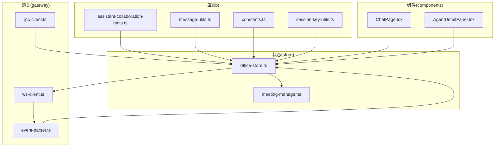
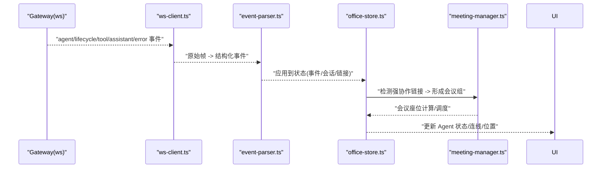
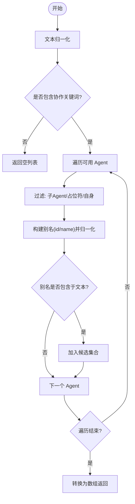
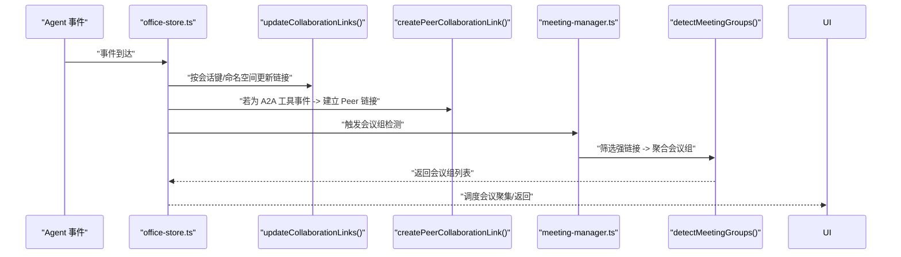
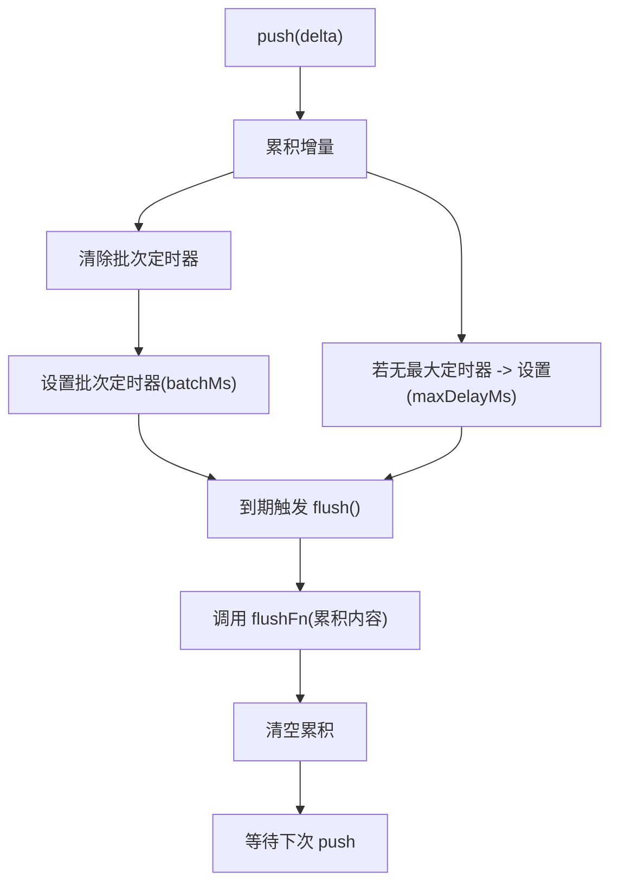
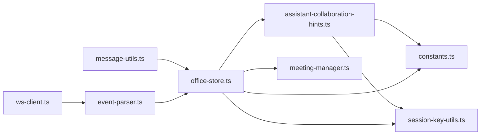

# 助手协作提示

<cite>
**本文引用的文件**
- [assistant-collaboration-hints.ts](file://src/lib/assistant-collaboration-hints.ts)
- [assistant-collaboration-hints.test.ts](file://src/lib/assistant-collaboration-hints.test.ts)
- [message-utils.ts](file://src/lib/message-utils.ts)
- [constants.ts](file://src/lib/constants.ts)
- [session-key-utils.ts](file://src/lib/session-key-utils.ts)
- [office-store.ts](file://src/store/office-store.ts)
- [meeting-manager.ts](file://src/store/meeting-manager.ts)
- [meeting-manager.test.ts](file://src/store/__tests__/meeting-manager.test.ts)
- [README.md](file://README.md)
- [AGENTS.md](file://AGENTS.md)
</cite>

## 目录
1. [简介](#简介)
2. [项目结构](#项目结构)
3. [核心组件](#核心组件)
4. [架构总览](#架构总览)
5. [详细组件分析](#详细组件分析)
6. [依赖关系分析](#依赖关系分析)
7. [性能考量](#性能考量)
8. [故障排查指南](#故障排查指南)
9. [结论](#结论)
10. [附录](#附录)

## 简介
本文件面向“助手协作提示系统”的技术文档，聚焦于多智能体系统中的协作提示生成与优化。内容涵盖：
- 智能体间协作的提示生成算法：上下文理解机制、协作模式识别、响应优化策略
- 提示模板系统：模板定义、变量替换、动态生成
- 协作场景分析：任务分解、资源协调、冲突解决
- 具体的提示生成流程、质量评估标准、性能优化策略
- API 参考、使用示例与最佳实践指南
- 与多智能体系统的集成方式与协作效果评估

本系统以“数字办公室”为隐喻，将 Agent 的协作、会话与工具调用在 2D/3D 场景中可视化呈现，并通过协作链接与会议调度实现高效的跨 Agent 协作。

## 项目结构
围绕协作提示与可视化办公的核心模块包括：
- lib：协作提示识别、消息工具、常量与会话键解析
- store：状态管理与协作链路、会议调度
- components/pages：聊天工作区、控制台页面与可视化组件
- gateway：WebSocket 与 RPC 通信层

图表来源
- [assistant-collaboration-hints.ts:1-49](file://src/lib/assistant-collaboration-hints.ts#L1-L49)
- [message-utils.ts:1-112](file://src/lib/message-utils.ts#L1-L112)
- [constants.ts:1-141](file://src/lib/constants.ts#L1-L141)
- [session-key-utils.ts:1-54](file://src/lib/session-key-utils.ts#L1-L54)
- [office-store.ts:1-200](file://src/store/office-store.ts#L1-L200)
- [meeting-manager.ts:1-136](file://src/store/meeting-manager.ts#L1-L136)
- [README.md:274-291](file://README.md#L274-L291)

章节来源
- [README.md:1-316](file://README.md#L1-L316)
- [AGENTS.md:57-89](file://AGENTS.md#L57-L89)

## 核心组件
- 协作提示识别器：从 Assistant 文本中识别协作关键词与目标 Agent，输出候选协作对象列表
- 协作链接与会议管理：根据事件强度与会话键建立协作链接，检测会议组并分配座位
- 消息与批处理工具：消息 ID 生成、增量合并、工具调用更新、文本截断与批量调度
- 常量与会话键工具：A2A 工具集、区域与颜色、会话命名空间提取、Agent ID 解析

章节来源
- [assistant-collaboration-hints.ts:1-49](file://src/lib/assistant-collaboration-hints.ts#L1-L49)
- [office-store.ts:1448-1594](file://src/store/office-store.ts#L1448-L1594)
- [meeting-manager.ts:1-136](file://src/store/meeting-manager.ts#L1-L136)
- [message-utils.ts:1-112](file://src/lib/message-utils.ts#L1-L112)
- [constants.ts:60-66](file://src/lib/constants.ts#L60-L66)
- [session-key-utils.ts:10-53](file://src/lib/session-key-utils.ts#L10-L53)

## 架构总览
系统通过 WebSocket 与 Gateway 交互，事件经解析后写入 Zustand Store，再驱动 UI 渲染与协作行为（如会议聚集）。

图表来源
- [README.md:274-291](file://README.md#L274-L291)
- [office-store.ts:1448-1594](file://src/store/office-store.ts#L1448-L1594)
- [meeting-manager.ts:32-77](file://src/store/meeting-manager.ts#L32-L77)

## 详细组件分析

### 协作提示识别器
- 上下文理解机制：将输入文本归一化为小写，匹配预设协作关键词集合
- 协作模式识别：当存在协作关键词时，遍历可用 Agent，构建其别名（id/name），判断是否包含于文本
- 排除规则：排除当前 Agent、子 Agent 与占位符 Agent
- 输出：去重后的候选 Peer Agent ID 列表

图表来源
- [assistant-collaboration-hints.ts:12-48](file://src/lib/assistant-collaboration-hints.ts#L12-L48)

章节来源
- [assistant-collaboration-hints.ts:1-49](file://src/lib/assistant-collaboration-hints.ts#L1-L49)
- [assistant-collaboration-hints.test.ts:32-94](file://src/lib/assistant-collaboration-hints.test.ts#L32-L94)

### 协作链接与会议管理
- 协作链接更新：基于 sessionKey 与命名空间聚合 Agent，计算链接强度并衰减过期链接
- 直连 Peer 链接：当检测到 A2A 工具事件（如 sessions_send）时，为两个主 Agent 建立直连链接
- 会议组检测：筛选强度高于阈值且双方均为非子 Agent 的链接，按 sessionKey 聚合形成会议组；限制并发会议数量
- 座位分配：为每个会议组分配不同会议桌中心，按人数均匀分布座位

图表来源
- [office-store.ts:1448-1594](file://src/store/office-store.ts#L1448-L1594)
- [meeting-manager.ts:32-96](file://src/store/meeting-manager.ts#L32-L96)

章节来源
- [office-store.ts:1448-1594](file://src/store/office-store.ts#L1448-L1594)
- [meeting-manager.ts:1-136](file://src/store/meeting-manager.ts#L1-L136)
- [meeting-manager.test.ts:36-279](file://src/store/__tests__/meeting-manager.test.ts#L36-L279)

### 消息与批处理工具
- 消息 ID 生成：基于时间戳与随机数，保证唯一性
- 增量合并：将流式增量文本追加至现有内容
- 工具调用更新：按 id 更新工具调用状态与结果
- 文本截断：超过长度上限时截断并追加省略号
- 批量调度：在最小批次间隔与最大延迟之间合并增量，定时 flush

图表来源
- [message-utils.ts:55-112](file://src/lib/message-utils.ts#L55-L112)

章节来源
- [message-utils.ts:1-112](file://src/lib/message-utils.ts#L1-L112)

### 提示模板系统（概念性说明）
提示模板系统用于在协作场景中动态生成高质量提示，包含以下能力：
- 模板定义：以占位符形式定义可替换字段（如参与者、任务、上下文）
- 变量替换：依据当前会话键、Agent 状态与协作强度进行变量注入
- 动态生成：结合 A2A 工具名称与会话命名空间，生成指向具体协作路径的提示
- 质量评估：通过关键词覆盖率、上下文完整性与响应一致性进行评分
- 性能优化：采用批量调度与链接强度衰减，减少重复计算与无效提示

（本节为概念性说明，未直接分析具体文件）

## 依赖关系分析
- 协作提示识别器依赖常量中的协作关键词集合与会话键工具
- 协作链接与会议管理依赖状态存储中的 Agent 与链接集合
- 消息工具为事件流与 UI 增量渲染提供基础能力
- 网关层负责事件广播与 RPC 方法，驱动前端状态更新

图表来源
- [assistant-collaboration-hints.ts:1-49](file://src/lib/assistant-collaboration-hints.ts#L1-L49)
- [constants.ts:60-66](file://src/lib/constants.ts#L60-L66)
- [session-key-utils.ts:10-53](file://src/lib/session-key-utils.ts#L10-L53)
- [office-store.ts:1-200](file://src/store/office-store.ts#L1-L200)
- [meeting-manager.ts:1-136](file://src/store/meeting-manager.ts#L1-L136)
- [message-utils.ts:1-112](file://src/lib/message-utils.ts#L1-L112)
- [README.md:274-291](file://README.md#L274-L291)

章节来源
- [constants.ts:60-66](file://src/lib/constants.ts#L60-L66)
- [session-key-utils.ts:10-53](file://src/lib/session-key-utils.ts#L10-L53)
- [office-store.ts:1-200](file://src/store/office-store.ts#L1-L200)
- [meeting-manager.ts:1-136](file://src/store/meeting-manager.ts#L1-L136)
- [message-utils.ts:1-112](file://src/lib/message-utils.ts#L1-L112)
- [README.md:274-291](file://README.md#L274-L291)

## 性能考量
- 链接强度衰减：定期清理过期链接，避免内存膨胀与误判
- 并发会议限制：最多 3 组会议，防止资源争用
- 批量调度：在小延迟与最大延迟之间平衡吞吐与实时性
- 会话键命名空间：优先按命名空间聚合，减少跨会话匹配开销
- 子 Agent 排除：会议组仅限主 Agent，降低无效协作

（本节提供通用指导，未直接分析具体文件）

## 故障排查指南
- 协作提示未生效
  - 检查输入文本是否包含协作关键词集合
  - 确认目标 Agent 名称/ID 是否存在于可用 Agent 列表
  - 排查是否为子 Agent 或当前 Agent
- 会议未触发
  - 检查协作链接强度是否超过阈值
  - 确认双方均为非子 Agent
  - 查看是否超过并发会议上限
- 流式消息异常
  - 检查增量合并逻辑与 flush 触发时机
  - 确认批处理定时器未被提前销毁

章节来源
- [assistant-collaboration-hints.test.ts:32-94](file://src/lib/assistant-collaboration-hints.test.ts#L32-L94)
- [meeting-manager.test.ts:36-279](file://src/store/__tests__/meeting-manager.test.ts#L36-L279)
- [message-utils.ts:55-112](file://src/lib/message-utils.ts#L55-L112)

## 结论
本系统通过“协作提示识别 + 协作链接 + 会议调度 + 流式消息处理”的组合，实现了多智能体间的高效协作提示生成与可视化呈现。建议在实际应用中：
- 明确协作关键词与模板变量，持续优化提示质量
- 结合会话键命名空间与 A2A 工具事件，提升协作路径准确性
- 使用批量调度与强度衰减策略，保障系统性能与稳定性
- 通过测试覆盖关键场景，确保协作行为符合预期

（本节为总结性内容，未直接分析具体文件）

## 附录

### API 参考
- 协作提示识别
  - 输入：assistant 文本、当前 Agent ID、Agent 列表
  - 输出：Peer Agent ID 列表
  - 关键实现：[detectPeerAgentHintsFromAssistantText:26-48](file://src/lib/assistant-collaboration-hints.ts#L26-L48)
- 协作链接更新
  - 输入：sessionKey、agentId、链接集合、会话键映射
  - 输出：更新后的链接集合
  - 关键实现：[updateCollaborationLinks:1448-1532](file://src/store/office-store.ts#L1448-L1532)
- 直连 Peer 链接
  - 输入：两个主 Agent ID
  - 输出：建立或增强直连链接
  - 关键实现：[createPeerCollaborationLink:1539-1577](file://src/store/office-store.ts#L1539-L1577)
- 会议组检测
  - 输入：链接集合、Agent 映射、可选允许列表
  - 输出：会议组列表
  - 关键实现：[detectMeetingGroups:32-77](file://src/store/meeting-manager.ts#L32-L77)
- 消息工具
  - 生成消息 ID：[generateMessageId:3-7](file://src/lib/message-utils.ts#L3-L7)
  - 增量合并：[mergeDelta:9-12](file://src/lib/message-utils.ts#L9-L12)
  - 工具调用更新：[updateToolCall:14-35](file://src/lib/message-utils.ts#L14-L35)
  - 文本截断：[truncateText:37-40](file://src/lib/message-utils.ts#L37-L40)
  - 批量调度：[createBatchScheduler:55-112](file://src/lib/message-utils.ts#L55-L112)

章节来源
- [assistant-collaboration-hints.ts:26-48](file://src/lib/assistant-collaboration-hints.ts#L26-L48)
- [office-store.ts:1448-1577](file://src/store/office-store.ts#L1448-L1577)
- [meeting-manager.ts:32-96](file://src/store/meeting-manager.ts#L32-L96)
- [message-utils.ts:1-112](file://src/lib/message-utils.ts#L1-L112)

### 使用示例与最佳实践
- 示例：在 assistant 文本中包含协作关键词与目标 Agent 名称，触发 Peer Agent 识别
  - 参考测试用例：[assistant-collaboration-hints.test.ts:32-94](file://src/lib/assistant-collaboration-hints.test.ts#L32-L94)
- 最佳实践：
  - 明确协作关键词集合，覆盖多语言与本地化名称
  - 使用会话键命名空间进行分组，避免跨会话误判
  - 限制并发会议数量，确保资源合理分配
  - 采用批量调度处理流式消息，兼顾实时性与性能

章节来源
- [assistant-collaboration-hints.test.ts:32-94](file://src/lib/assistant-collaboration-hints.test.ts#L32-L94)
- [meeting-manager.test.ts:128-147](file://src/store/__tests__/meeting-manager.test.ts#L128-L147)

### 与多智能体系统的集成方式
- 事件驱动：Gateway 广播 agent/lifecycle/tool/assistant/error 事件，前端解析并更新协作链接与会议状态
- RPC 能力：支持 agents.list、sessions.list、chat.send、chat.abort、chat.history 等方法
- 协作效果评估：通过链接强度、会议组规模与 Agent 状态变化评估协作效率

章节来源
- [AGENTS.md:143-170](file://AGENTS.md#L143-L170)
- [README.md:274-291](file://README.md#L274-L291)