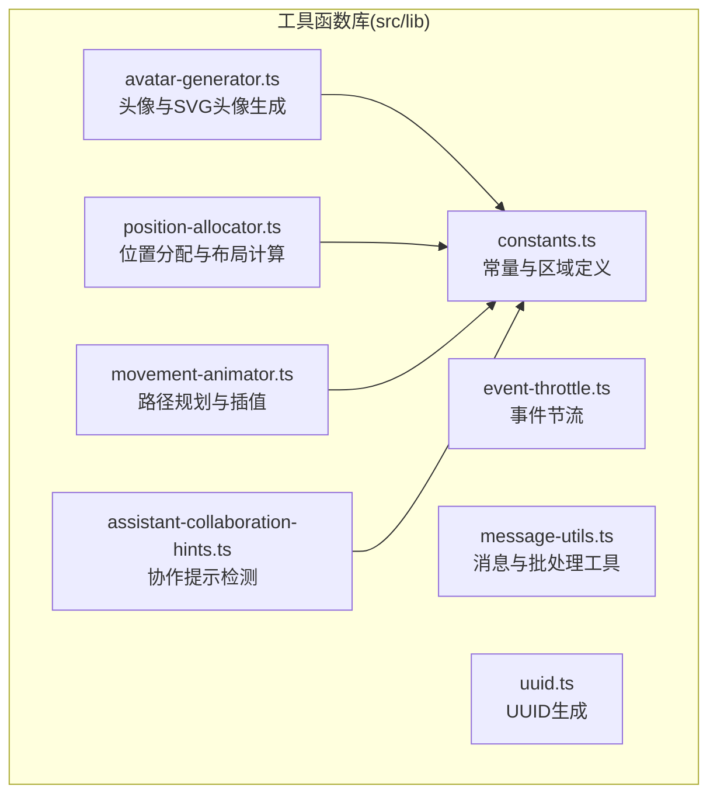
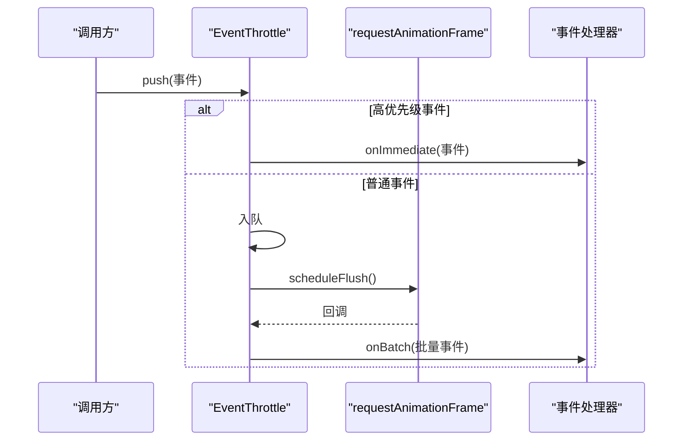
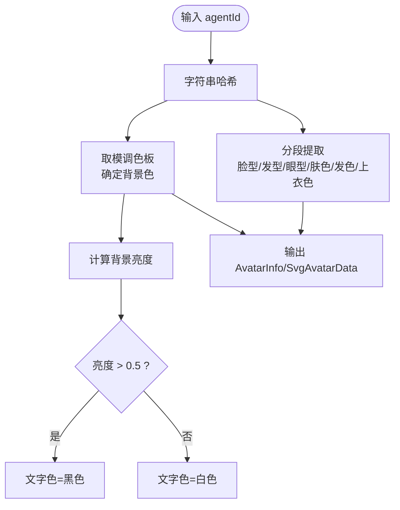
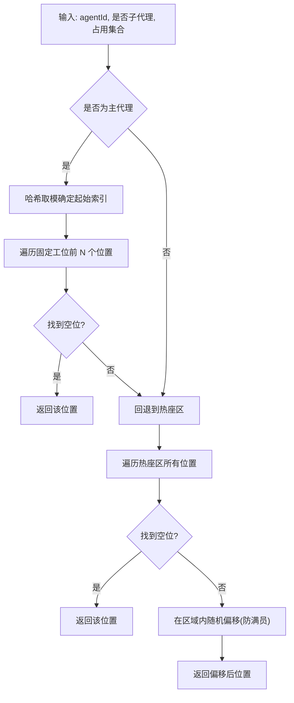
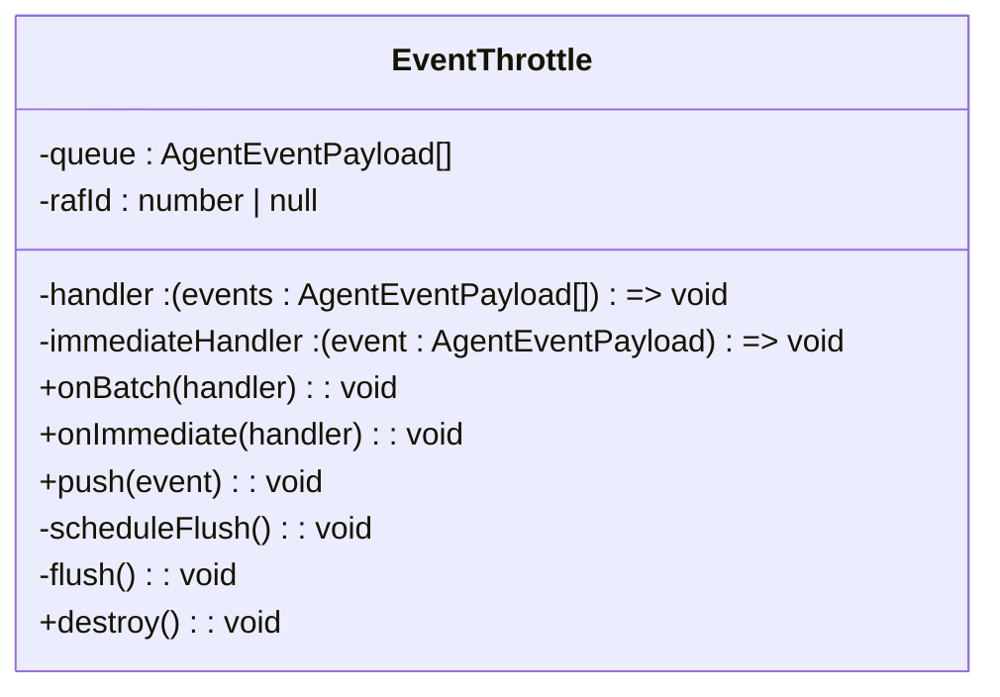
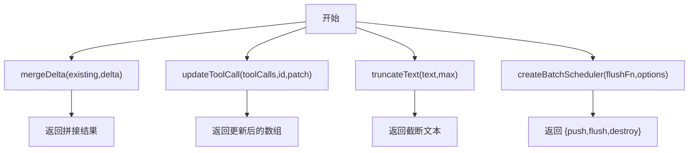
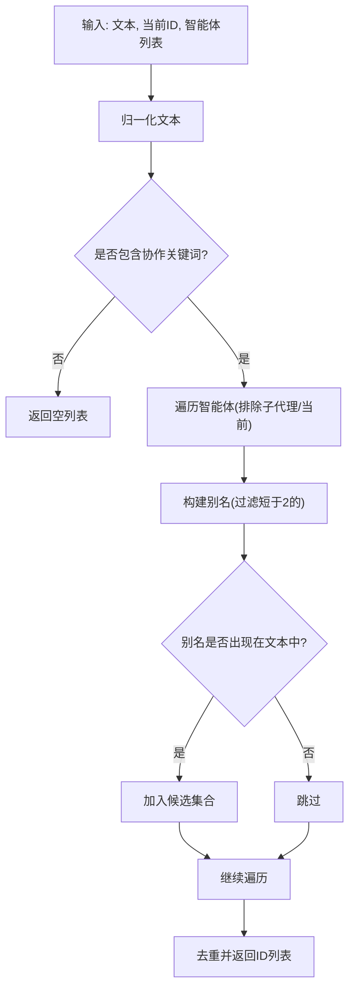
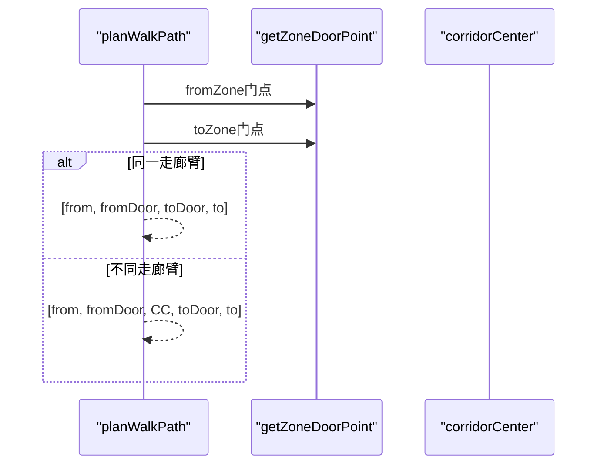
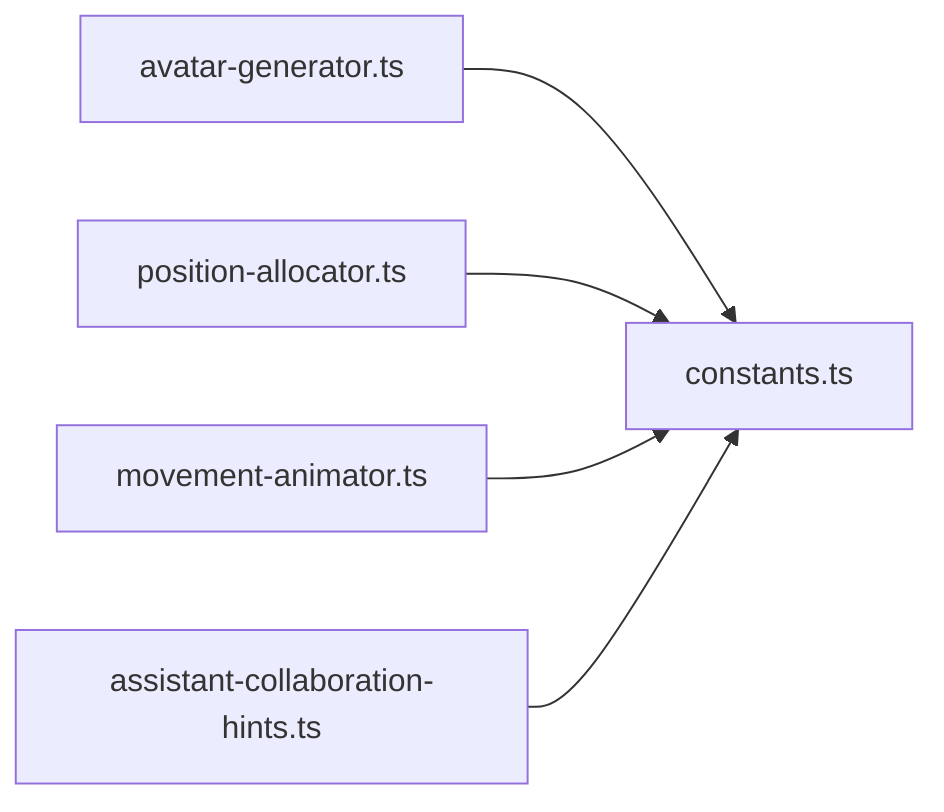

# 工具函数库

<cite>
**本文引用的文件**
- [src/lib/avatar-generator.ts](file://src/lib/avatar-generator.ts)
- [src/lib/position-allocator.ts](file://src/lib/position-allocator.ts)
- [src/lib/event-throttle.ts](file://src/lib/event-throttle.ts)
- [src/lib/message-utils.ts](file://src/lib/message-utils.ts)
- [src/lib/assistant-collaboration-hints.ts](file://src/lib/assistant-collaboration-hints.ts)
- [src/lib/constants.ts](file://src/lib/constants.ts)
- [src/lib/movement-animator.ts](file://src/lib/movement-animator.ts)
- [src/lib/uuid.ts](file://src/lib/uuid.ts)
- [src/lib/__tests__/avatar-generator.test.ts](file://src/lib/__tests__/avatar-generator.test.ts)
- [src/lib/__tests__/position-allocator.test.ts](file://src/lib/__tests__/position-allocator.test.ts)
- [src/lib/__tests__/event-throttle.test.ts](file://src/lib/__tests__/event-throttle.test.ts)
- [src/lib/assistant-collaboration-hints.test.ts](file://src/lib/assistant-collaboration-hints.test.ts)
</cite>

## 目录
1. [简介](#简介)
2. [项目结构](#项目结构)
3. [核心组件](#核心组件)
4. [架构总览](#架构总览)
5. [详细组件分析](#详细组件分析)
6. [依赖关系分析](#依赖关系分析)
7. [性能考量](#性能考量)
8. [故障排查指南](#故障排查指南)
9. [结论](#结论)
10. [附录：API 参考与使用示例](#附录api-参考与使用示例)

## 简介
本文件系统性梳理工具函数库，重点覆盖以下能力：
- SVG 头像生成器：基于 agentId 的确定性头像生成算法、颜色方案、形状组合逻辑
- 位置分配算法：智能体在 2D 办公室中的布局计算、碰撞避免、动态调整机制
- 事件节流机制：高频事件的处理策略、性能优化、用户体验考虑
- 消息工具函数：消息格式化、Markdown 处理、附件处理等辅助功能
- 助手协作提示：智能体间协作的提示生成、上下文理解、响应优化

文档以循序渐进的方式呈现，既包含算法原理与复杂度分析，也提供可操作的最佳实践与排错建议。

## 项目结构
工具函数库位于 src/lib 目录，围绕“确定性映射 + 批处理 + 视图模型转换”的设计原则组织，配合常量定义与动画路径规划，形成从数据到 UI 的完整工具链。

图表来源
- [src/lib/avatar-generator.ts:1-89](file://src/lib/avatar-generator.ts#L1-L89)
- [src/lib/position-allocator.ts:1-209](file://src/lib/position-allocator.ts#L1-L209)
- [src/lib/event-throttle.ts:1-71](file://src/lib/event-throttle.ts#L1-L71)
- [src/lib/message-utils.ts:1-112](file://src/lib/message-utils.ts#L1-L112)
- [src/lib/assistant-collaboration-hints.ts:1-49](file://src/lib/assistant-collaboration-hints.ts#L1-L49)
- [src/lib/constants.ts:1-141](file://src/lib/constants.ts#L1-L141)
- [src/lib/movement-animator.ts:1-163](file://src/lib/movement-animator.ts#L1-L163)
- [src/lib/uuid.ts:1-22](file://src/lib/uuid.ts#L1-L22)

章节来源
- [src/lib/constants.ts:1-141](file://src/lib/constants.ts#L1-L141)

## 核心组件
- 头像与 SVG 头像生成：提供确定性颜色与初始字符映射，以及基于 agentId 的 SVG 组合参数（脸型、发型、眼型、肤色、发色、上衣色）
- 位置分配与布局：支持固定工位、热座、会议室、休息区的确定性分配与碰撞避免；提供横向优先的工位槽位计算
- 事件节流：区分高优先级与普通事件，采用 RAF 批处理与队列溢出裁剪，保障渲染帧率与稳定性
- 消息工具：消息 ID 生成、增量拼接、工具调用更新、文本截断、可销毁的批处理调度器
- 协作提示：从助手文本中识别协作意图与对等智能体别名，返回候选列表
- 路径规划：基于区域门点与走廊臂的路径规划、距离与时长计算、沿折线插值

章节来源
- [src/lib/avatar-generator.ts:32-88](file://src/lib/avatar-generator.ts#L32-L88)
- [src/lib/position-allocator.ts:51-167](file://src/lib/position-allocator.ts#L51-L167)
- [src/lib/event-throttle.ts:15-70](file://src/lib/event-throttle.ts#L15-L70)
- [src/lib/message-utils.ts:3-111](file://src/lib/message-utils.ts#L3-L111)
- [src/lib/assistant-collaboration-hints.ts:26-48](file://src/lib/assistant-collaboration-hints.ts#L26-L48)
- [src/lib/movement-animator.ts:85-159](file://src/lib/movement-animator.ts#L85-L159)

## 架构总览
工具函数库以“确定性映射 + 批处理 + 视图模型”为核心架构，确保：
- 映射稳定：基于 agentId 的哈希映射保证同一智能体在不同时间获得一致的外观与位置
- 渲染友好：事件节流与批处理降低主线程压力，提升交互流畅度
- 可扩展：协作提示与消息工具为上层业务提供可组合的能力

图表来源
- [src/lib/event-throttle.ts:29-61](file://src/lib/event-throttle.ts#L29-L61)

## 详细组件分析

### 头像与 SVG 头像生成
- 确定性映射
  - 使用字符串哈希对 agentId 进行映射，确保相同 ID 总是得到相同的索引
  - 颜色方案：预设调色板，背景色由哈希决定；文字颜色根据背景亮度自动选择黑或白
  - 初始字符：优先使用名称首字母，否则回退到 ID 首字母
- SVG 参数组合
  - 脸型、发型、眼型、肤色、发色、上衣色均来自哈希分段提取，保证唯一性与可预测性
  - 提供 3D 材质颜色生成函数，便于在 3D 场景复用同一映射

图表来源
- [src/lib/avatar-generator.ts:16-88](file://src/lib/avatar-generator.ts#L16-L88)

章节来源
- [src/lib/avatar-generator.ts:32-88](file://src/lib/avatar-generator.ts#L32-L88)

### 位置分配与布局计算
- 固定工位分配
  - 以哈希起始索引在固定工位范围内循环查找空位；若满员则回退至热座区
  - 使用占用集合避免碰撞，必要时在区域内随机偏移
- 会议室座位
  - 等角分布围绕圆心布置，适配圆形会议桌的 2D/3D 坐标缩放
- 工位槽位（横向优先）
  - 自适应列数：基于可用宽度与最小工位宽度计算最大列数，至少 4 列
  - 横向优先填充，先填满列再增长行，保证视觉连续性
- 休息区锚点
  - 预置锚点集合，避免与装饰元素重叠，按需裁剪数量

图表来源
- [src/lib/position-allocator.ts:51-82](file://src/lib/position-allocator.ts#L51-L82)

章节来源
- [src/lib/position-allocator.ts:51-167](file://src/lib/position-allocator.ts#L51-L167)
- [src/lib/constants.ts:23-28](file://src/lib/constants.ts#L23-L28)
- [src/lib/constants.ts:96-104](file://src/lib/constants.ts#L96-L104)
- [src/lib/constants.ts:117-122](file://src/lib/constants.ts#L117-L122)

### 事件节流机制
- 高优先级判定
  - 错误流与生命周期 start/end 视为高优先级，立即触发即时处理器
- 批处理策略
  - 普通事件入队，超过阈值时警告并裁剪至安全大小
  - 使用 RAF 在下一帧统一触发批量处理器，减少渲染抖动
- 生命周期管理
  - 支持 destroy 取消待执行的 RAF 并清空队列，避免内存泄漏

图表来源
- [src/lib/event-throttle.ts:15-70](file://src/lib/event-throttle.ts#L15-L70)

章节来源
- [src/lib/event-throttle.ts:15-70](file://src/lib/event-throttle.ts#L15-L70)

### 消息工具函数
- 消息 ID 生成：结合时间戳与随机串，保证全局唯一性
- 增量拼接：将新片段追加到现有内容，支持流式输出
- 工具调用更新：按 id 查找并合并补丁，不存在则新增
- 文本截断：在长度超限时添加省略号
- 批处理调度器：支持批量延迟与最大延迟，提供可销毁接口，避免资源泄露

图表来源
- [src/lib/message-utils.ts:9-111](file://src/lib/message-utils.ts#L9-L111)

章节来源
- [src/lib/message-utils.ts:3-111](file://src/lib/message-utils.ts#L3-L111)

### 助手协作提示
- 协作关键词：内置英文与本地化关键词集合，用于识别协作意图
- 文本归一化：统一转小写，提高匹配鲁棒性
- 对等智能体识别：排除当前智能体与子代理，基于 id 与名称别名进行模糊匹配
- 返回候选：去重后返回对等智能体 ID 列表

图表来源
- [src/lib/assistant-collaboration-hints.ts:26-48](file://src/lib/assistant-collaboration-hints.ts#L26-L48)

章节来源
- [src/lib/assistant-collaboration-hints.ts:26-48](file://src/lib/assistant-collaboration-hints.ts#L26-L48)

### 路径规划与移动动画
- 区域门点：每个区域连接走廊的门点坐标，支持快速路径规划
- 同臂判断：判断起点与终点是否在同一走廊臂，决定是否需要经过中心
- 折线路径：从起点到门点、走廊中心、再到目标门点、终点，形成最短路径
- 插值定位：按距离比例在折线上插值，保证移动速度与时间的一致性

图表来源
- [src/lib/movement-animator.ts:85-104](file://src/lib/movement-animator.ts#L85-L104)

章节来源
- [src/lib/movement-animator.ts:85-159](file://src/lib/movement-animator.ts#L85-L159)

## 依赖关系分析
- 常量依赖：位置分配与布局计算依赖常量模块中的区域、网格、尺寸与缩放因子
- 头像依赖：头像生成依赖颜色与亮度计算，SVG 头像依赖确定性分段
- 协作提示：依赖类型定义与国际化标签，但不直接依赖 UI 层
- 路径规划：依赖常量模块的区域与走廊几何信息

图表来源
- [src/lib/avatar-generator.ts:1-14](file://src/lib/avatar-generator.ts#L1-L14)
- [src/lib/position-allocator.ts:1-13](file://src/lib/position-allocator.ts#L1-L13)
- [src/lib/movement-animator.ts:1-1](file://src/lib/movement-animator.ts#L1-L1)
- [src/lib/assistant-collaboration-hints.ts:1-1](file://src/lib/assistant-collaboration-hints.ts#L1-L1)

章节来源
- [src/lib/constants.ts:1-141](file://src/lib/constants.ts#L1-L141)

## 性能考量
- 哈希映射
  - 时间复杂度 O(1)，空间开销极低；适合大规模智能体的确定性映射
- 事件节流
  - RAF 批处理将多次微小更新合并为一次渲染，显著降低主线程压力
  - 队列溢出裁剪避免内存膨胀，保证系统稳定性
- 位置分配
  - 固定工位查找为线性探测，平均常数次尝试；热座区遍历有限，整体近似 O(1)
  - 工位槽位计算为纯数学运算，复杂度 O(n)
- 路径规划
  - 门点查询与同臂判断均为常数时间；路径长度与插值为线性于路径段数

[本节为通用性能讨论，无需具体文件分析]

## 故障排查指南
- 头像颜色异常
  - 检查背景亮度计算与文字色选择逻辑，确认调色板索引未越界
  - 参考：[src/lib/avatar-generator.ts:25-47](file://src/lib/avatar-generator.ts#L25-L47)
- 位置冲突或占满
  - 确认占用集合键值格式与 posKey 一致；检查 fallback 偏移范围
  - 参考：[src/lib/position-allocator.ts:47-82](file://src/lib/position-allocator.ts#L47-L82)
- 事件未及时显示
  - 验证高优先级判定与即时处理器绑定；检查 RAF 是否被取消
  - 参考：[src/lib/event-throttle.ts:6-45](file://src/lib/event-throttle.ts#L6-L45)
- 协作提示未命中
  - 核对关键词集合与文本归一化；确认排除了子代理与当前智能体
  - 参考：[src/lib/assistant-collaboration-hints.ts:12-48](file://src/lib/assistant-collaboration-hints.ts#L12-L48)
- 移动动画卡顿
  - 检查路径长度与速度常量；确认插值按距离比例而非段比例
  - 参考：[src/lib/movement-animator.ts:112-159](file://src/lib/movement-animator.ts#L112-L159)

章节来源
- [src/lib/avatar-generator.ts:25-47](file://src/lib/avatar-generator.ts#L25-L47)
- [src/lib/position-allocator.ts:47-82](file://src/lib/position-allocator.ts#L47-L82)
- [src/lib/event-throttle.ts:6-45](file://src/lib/event-throttle.ts#L6-L45)
- [src/lib/assistant-collaboration-hints.ts:12-48](file://src/lib/assistant-collaboration-hints.ts#L12-L48)
- [src/lib/movement-animator.ts:112-159](file://src/lib/movement-animator.ts#L112-L159)

## 结论
工具函数库通过确定性映射与批处理策略，实现了稳定、高效且可扩展的办公场景支撑能力。头像与位置分配保证了视觉一致性与空间合理性；事件节流提升了交互流畅度；消息工具与协作提示增强了上层业务的可组合性。建议在实际集成中遵循本文的最佳实践，并结合测试用例验证关键行为。

[本节为总结性内容，无需具体文件分析]

## 附录：API 参考与使用示例

### 头像与 SVG 头像
- 函数
  - generateAvatar(agentId, agentName?): 返回背景色、文字色与初始字符
  - generateAvatar3dColor(agentId): 返回 3D 材质颜色
  - generateSvgAvatar(agentId): 返回 SVG 组合参数对象
- 示例
  - 使用 agentId 获取确定性头像信息与颜色
  - 将 generateSvgAvatar 输出用于渲染 SVG 头像组件

章节来源
- [src/lib/avatar-generator.ts:32-88](file://src/lib/avatar-generator.ts#L32-L88)
- [src/lib/__tests__/avatar-generator.test.ts:4-37](file://src/lib/__tests__/avatar-generator.test.ts#L4-L37)

### 位置分配与布局
- 函数
  - allocatePosition(agentId, isSubAgent, occupied): 分配主/子代理位置
  - allocateMeetingPositions(agentIds, tableCenter): 会议室等角分布
  - calculateDeskSlots(zone, agentCount, slotCount?): 横向优先工位槽位
  - agentSlotIndex(agentId, totalSlots): 确定性槽位索引
  - calculateLoungePositions(maxCount): 休息区锚点
  - calculateMeetingSeatsSvg(agentCount, tableCenter, seatRadius): SVG 圆形座位
- 示例
  - 为一组智能体分配固定工位，自动回退到热座区
  - 计算横向优先的工位布局，用于渲染 DeskUnit

章节来源
- [src/lib/position-allocator.ts:51-209](file://src/lib/position-allocator.ts#L51-L209)
- [src/lib/constants.ts:96-122](file://src/lib/constants.ts#L96-L122)
- [src/lib/__tests__/position-allocator.test.ts:5-134](file://src/lib/__tests__/position-allocator.test.ts#L5-L134)

### 事件节流
- 类
  - EventThrottle
    - onBatch(handler): 注册批量处理器
    - onImmediate(handler): 注册即时处理器
    - push(event): 推送事件
    - destroy(): 销毁实例
- 示例
  - 将高频 assistant 流事件批量处理，错误与生命周期事件即时响应

章节来源
- [src/lib/event-throttle.ts:15-70](file://src/lib/event-throttle.ts#L15-L70)
- [src/lib/__tests__/event-throttle.test.ts:16-77](file://src/lib/__tests__/event-throttle.test.ts#L16-L77)

### 消息工具
- 函数
  - generateMessageId(): 生成消息 ID
  - mergeDelta(existingContent, deltaText): 增量拼接
  - updateToolCall(toolCalls, toolCallId, patch): 更新工具调用
  - truncateText(text, maxLength): 截断文本
  - createBatchScheduler(flushFn, options): 创建批处理调度器
- 示例
  - 流式渲染消息内容，合并增量文本
  - 管理工具调用状态变更

章节来源
- [src/lib/message-utils.ts:3-111](file://src/lib/message-utils.ts#L3-L111)

### 助手协作提示
- 函数
  - detectPeerAgentHintsFromAssistantText(text, currentAgentId, agents): 检测协作提示
- 示例
  - 从助手文本中识别对等智能体，用于发起直接会话或协作链路

章节来源
- [src/lib/assistant-collaboration-hints.ts:26-48](file://src/lib/assistant-collaboration-hints.ts#L26-L48)
- [src/lib/assistant-collaboration-hints.test.ts:32-94](file://src/lib/assistant-collaboration-hints.test.ts#L32-L94)

### 路径规划与移动动画
- 函数
  - planWalkPath(from, to, fromZone, toZone): 生成折线路径
  - pathLength(path): 计算路径总长度
  - calculateWalkDuration(path): 基于速度与最小持续时间计算时长
  - interpolatePathPosition(path, progress): 按距离比例插值
- 示例
  - 为智能体在不同区域间规划行走路径并插值移动

章节来源
- [src/lib/movement-animator.ts:85-159](file://src/lib/movement-animator.ts#L85-L159)

### UUID 生成
- 函数
  - uuid(): 生成 v4 UUID 字符串
- 示例
  - 作为消息或任务标识的基础生成器

章节来源
- [src/lib/uuid.ts:7-21](file://src/lib/uuid.ts#L7-L21)