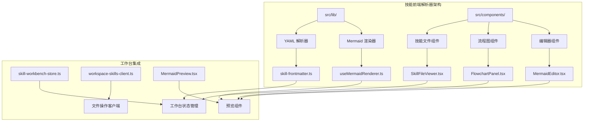
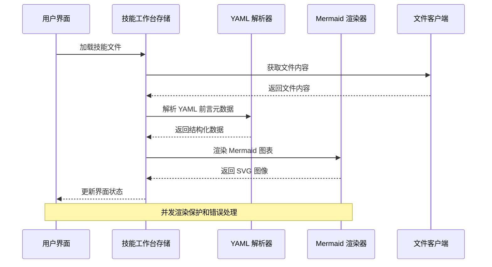
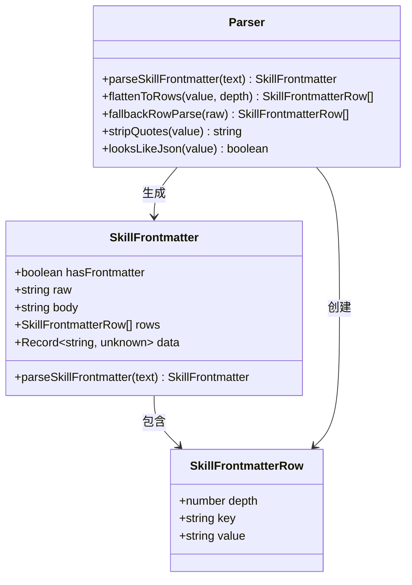
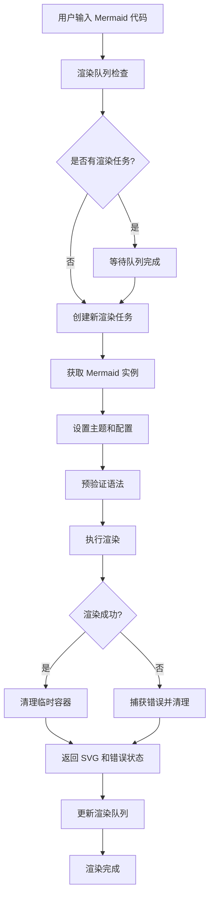
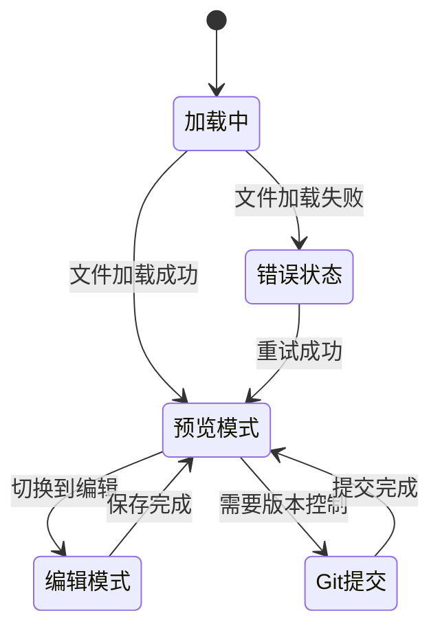
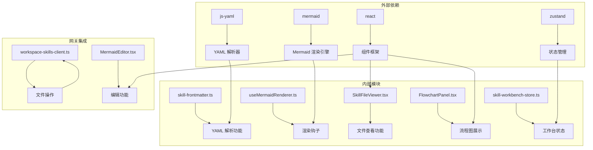

# 技能前端解析器

<cite>
**本文档引用的文件**
- [README.md](file://README.md)
- [package.json](file://package.json)
- [SKILL-WORKBENCH.md](file://SKILL-WORKBENCH.md)
- [skill-frontmatter.ts](file://src/lib/skill-frontmatter.ts)
- [useMermaidRenderer.ts](file://src/hooks/useMermaidRenderer.ts)
- [MermaidEditor.tsx](file://src/components/console/skills/MermaidEditor.tsx)
- [MermaidPreview.tsx](file://src/components/shared/MermaidPreview.tsx)
- [lobster-parser.ts](file://src/lib/lobster-parser.ts)
- [skill-workbench-store.ts](file://src/store/console-stores/skill-workbench-store.ts)
- [workspace-skills-client.ts](file://src/gateway/workspace-skills-client.ts)
- [FlowchartPanel.tsx](file://src/components/console/skills/FlowchartPanel.tsx)
- [SkillFileViewer.tsx](file://src/components/console/skills/SkillFileViewer.tsx)
- [WorkbenchLayout.tsx](file://src/components/console/skills/WorkbenchLayout.tsx)
- [skill-workbench-mermaid-guard/SKILL.md](file://bin/skills/skill-workbench-mermaid-guard/SKILL.md)
</cite>

## 目录
1. [简介](#简介)
2. [项目结构](#项目结构)
3. [核心组件](#核心组件)
4. [架构概览](#架构概览)
5. [详细组件分析](#详细组件分析)
6. [依赖分析](#依赖分析)
7. [性能考虑](#性能考虑)
8. [故障排除指南](#故障排除指南)
9. [结论](#结论)

## 简介

技能前端解析器是 OpenClaw Office 中用于处理和渲染技能文件的核心模块，特别是针对 SKILL.md 和 FLOWCHART.md 文件的解析、渲染和管理工作。该系统提供了完整的技能开发平台，支持 YAML 前言元数据解析、Mermaid 流程图渲染、技能文件编辑和预览等功能。

该解析器的核心功能包括：
- YAML 前言元数据的结构化解析和渲染
- Mermaid 流程图的实时预览和渲染
- 技能文件的编辑、保存和版本控制
- 复杂技能工作流的可视化展示

## 项目结构

OpenClaw Office 采用模块化的前端架构，技能前端解析器位于 `src/lib/` 和 `src/components/` 目录下，形成了完整的技能处理生态系统。



**图表来源**
- [skill-frontmatter.ts:1-232](file://src/lib/skill-frontmatter.ts#L1-L232)
- [useMermaidRenderer.ts:1-82](file://src/hooks/useMermaidRenderer.ts#L1-L82)
- [skill-workbench-store.ts:1-309](file://src/store/console-stores/skill-workbench-store.ts#L1-L309)

**章节来源**
- [README.md:1-331](file://README.md#L1-L331)
- [package.json:1-87](file://package.json#L1-L87)

## 核心组件

技能前端解析器由多个相互协作的组件构成，每个组件都有特定的职责和功能：

### YAML 前言元数据解析器
负责解析 SKILL.md 文件顶部的 YAML 元数据，提供结构化数据访问和兼容性处理。

### Mermaid 渲染引擎
提供并发安全的 Mermaid 图表渲染能力，支持多图表预览和错误处理。

### 技能文件查看器
实现技能文件的预览和编辑功能，支持 YAML 元数据的结构化展示。

### 流程图面板
专门用于展示和管理 FLOWCHART.md 文件，支持一键生成和多图预览。

**章节来源**
- [skill-frontmatter.ts:1-232](file://src/lib/skill-frontmatter.ts#L1-L232)
- [useMermaidRenderer.ts:1-82](file://src/hooks/useMermaidRenderer.ts#L1-L82)
- [SkillFileViewer.tsx:1-466](file://src/components/console/skills/SkillFileViewer.tsx#L1-L466)
- [FlowchartPanel.tsx:1-86](file://src/components/console/skills/FlowchartPanel.tsx#L1-L86)

## 架构概览

技能前端解析器采用分层架构设计，从底层的数据解析到顶层的用户界面展示，形成了清晰的职责分离。



**图表来源**
- [skill-workbench-store.ts:191-286](file://src/store/console-stores/skill-workbench-store.ts#L191-L286)
- [useMermaidRenderer.ts:31-78](file://src/hooks/useMermaidRenderer.ts#L31-L78)

系统的关键特性包括：

1. **并发渲染保护**：使用 Promise 队列确保 Mermaid 渲染的串行执行
2. **错误处理机制**：完善的异常捕获和错误状态管理
3. **状态同步**：Zustand 状态管理确保组件间的协调
4. **文件操作抽象**：统一的文件读写接口

## 详细组件分析

### YAML 前言元数据解析器

该解析器提供了强大的 YAML 解析能力，支持复杂的嵌套结构和多种数据类型。



**图表来源**
- [skill-frontmatter.ts:28-50](file://src/lib/skill-frontmatter.ts#L28-L50)
- [skill-frontmatter.ts:95-112](file://src/lib/skill-frontmatter.ts#L95-L112)

解析器的核心功能：
- **结构化解析**：使用 js-yaml 进行完整的 YAML 解析
- **降级处理**：当 YAML 解析失败时提供行级解析回退
- **深度扁平化**：将嵌套对象转换为平面键值对列表
- **类型安全**：提供类型检查和验证功能

**章节来源**
- [skill-frontmatter.ts:54-84](file://src/lib/skill-frontmatter.ts#L54-L84)
- [skill-frontmatter.ts:119-136](file://src/lib/skill-frontmatter.ts#L119-L136)

### Mermaid 渲染引擎

Mermaid 渲染引擎是系统的核心渲染组件，提供了高性能的图表渲染能力。



**图表来源**
- [useMermaidRenderer.ts:31-78](file://src/hooks/useMermaidRenderer.ts#L31-L78)

渲染引擎的关键特性：
- **并发控制**：使用 Promise 队列防止并发渲染冲突
- **主题适配**：动态切换明暗主题模式
- **错误恢复**：自动清理 DOM 污染和错误状态
- **性能优化**：懒加载和实例复用

**章节来源**
- [useMermaidRenderer.ts:17-25](file://src/hooks/useMermaidRenderer.ts#L17-L25)
- [useMermaidRenderer.ts:31-78](file://src/hooks/useMermaidRenderer.ts#L31-L78)

### 技能文件查看器

技能文件查看器提供了完整的文件浏览和编辑功能，支持多种文件类型的处理。



**图表来源**
- [SkillFileViewer.tsx:255-466](file://src/components/console/skills/SkillFileViewer.tsx#L255-L466)

查看器的主要功能：
- **双模式切换**：预览模式和编辑模式的无缝切换
- **智能解析**：根据文件类型选择合适的渲染方式
- **版本控制**：集成 Git 提交功能
- **状态反馈**：提供保存和提交的状态指示

**章节来源**
- [SkillFileViewer.tsx:264-274](file://src/components/console/skills/SkillFileViewer.tsx#L264-L274)
- [SkillFileViewer.tsx:314-340](file://src/components/console/skills/SkillFileViewer.tsx#L314-L340)

### 流程图面板

流程图面板专门用于展示和管理 FLOWCHART.md 文件，提供了直观的图表预览功能。

```mermaid
classDiagram
class FlowchartPanel {
+string flowchartDocument
+boolean hasDocument
+onGenerate() void
+isGenerating boolean
+render() JSX.Element
}
class MarkdownContent {
+string content
+render() JSX.Element
}
class MermaidPreview {
+string source
+render() Promise~{svg, error}~
}
FlowchartPanel --> MarkdownContent : 使用
MarkdownContent --> MermaidPreview : 渲染 Mermaid
```

**图表来源**
- [FlowchartPanel.tsx:31-86](file://src/components/console/skills/FlowchartPanel.tsx#L31-L86)
- [MermaidPreview.tsx:9-66](file://src/components/shared/MermaidPreview.tsx#L9-L66)

面板的核心特性：
- **纯 Markdown 渲染**：直接渲染整个 FLOWCHART.md 文件
- **多图支持**：支持一个文件内的多个 Mermaid 代码块
- **一键生成**：集成自动化流程图生成功能
- **状态管理**：提供生成中和空状态的视觉反馈

**章节来源**
- [FlowchartPanel.tsx:31-86](file://src/components/console/skills/FlowchartPanel.tsx#L31-L86)
- [MermaidPreview.tsx:9-66](file://src/components/shared/MermaidPreview.tsx#L9-L66)

## 依赖分析

技能前端解析器的依赖关系体现了清晰的分层架构和模块化设计。



**图表来源**
- [package.json:51-67](file://package.json#L51-L67)
- [skill-workbench-store.ts:1-309](file://src/store/console-stores/skill-workbench-store.ts#L1-L309)

依赖关系特点：
- **轻量级核心**：核心功能仅依赖必要的外部库
- **模块化设计**：各组件职责明确，耦合度低
- **状态集中管理**：通过 Zustand 统一管理应用状态
- **异步操作抽象**：文件操作通过客户端封装

**章节来源**
- [package.json:51-67](file://package.json#L51-L67)
- [workspace-skills-client.ts:1-97](file://src/gateway/workspace-skills-client.ts#L1-L97)

## 性能考虑

技能前端解析器在设计时充分考虑了性能优化，特别是在渲染和状态管理方面。

### 渲染性能优化
- **渲染队列**：使用 Promise 队列确保 Mermaid 渲染的串行执行，避免 DOM 污染
- **懒加载**：Mermaid 库按需加载，减少初始包体积
- **主题缓存**：主题切换时复用已初始化的实例

### 内存管理
- **DOM 清理**：每次渲染后自动清理临时容器元素
- **状态优化**：使用 React.memo 和 useMemo 避免不必要的重渲染
- **资源释放**：组件卸载时清理定时器和事件监听器

### 网络性能
- **文件缓存**：文件内容在内存中缓存，避免重复网络请求
- **批量操作**：多个文件操作合并执行，减少网络往返

## 故障排除指南

### 常见问题及解决方案

**Mermaid 渲染错误**
- **症状**：流程图无法渲染，出现错误提示
- **原因**：语法错误或并发渲染冲突
- **解决**：检查 Mermaid 语法，等待渲染队列完成

**YAML 解析失败**
- **症状**：技能元数据显示异常或为空
- **原因**：YAML 语法错误或格式不规范
- **解决**：使用降级解析器，检查 YAML 格式

**文件保存失败**
- **症状**：保存操作无响应或报错
- **原因**：网络问题或权限不足
- **解决**：检查网络连接，确认文件权限

**章节来源**
- [MermaidPreview.tsx:43-54](file://src/components/shared/MermaidPreview.tsx#L43-L54)
- [useMermaidRenderer.ts:63-70](file://src/hooks/useMermaidRenderer.ts#L63-L70)

## 结论

技能前端解析器是一个设计精良、功能完备的技能文件处理系统。它通过模块化的架构设计、完善的错误处理机制和性能优化策略，为 OpenClaw Office 提供了强大的技能开发和管理能力。

系统的主要优势包括：
- **高度模块化**：各组件职责明确，易于维护和扩展
- **强类型支持**：TypeScript 提供完整的类型安全保障
- **用户体验优秀**：直观的界面设计和流畅的交互体验
- **性能表现优异**：优化的渲染策略和状态管理

未来的发展方向可以包括：
- 增强语法高亮和智能提示功能
- 扩展更多图表类型的支持
- 集成更多的版本控制和协作功能
- 提供更丰富的自定义选项和主题