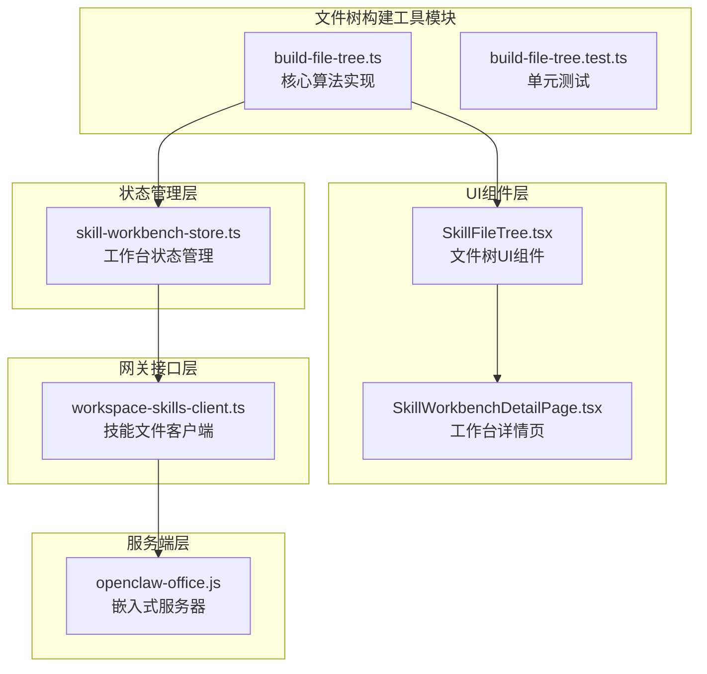
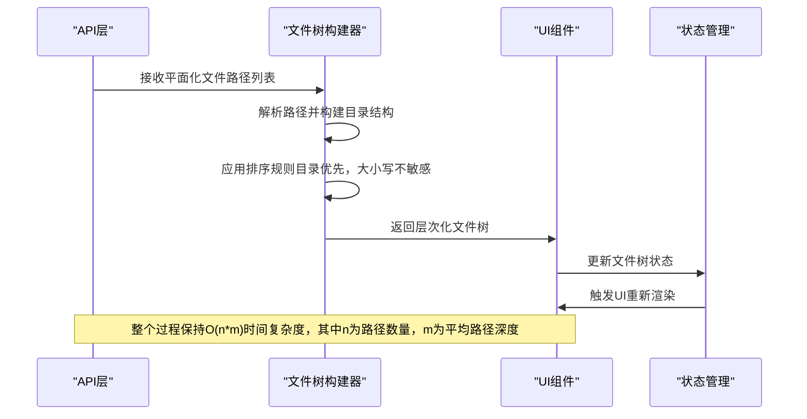
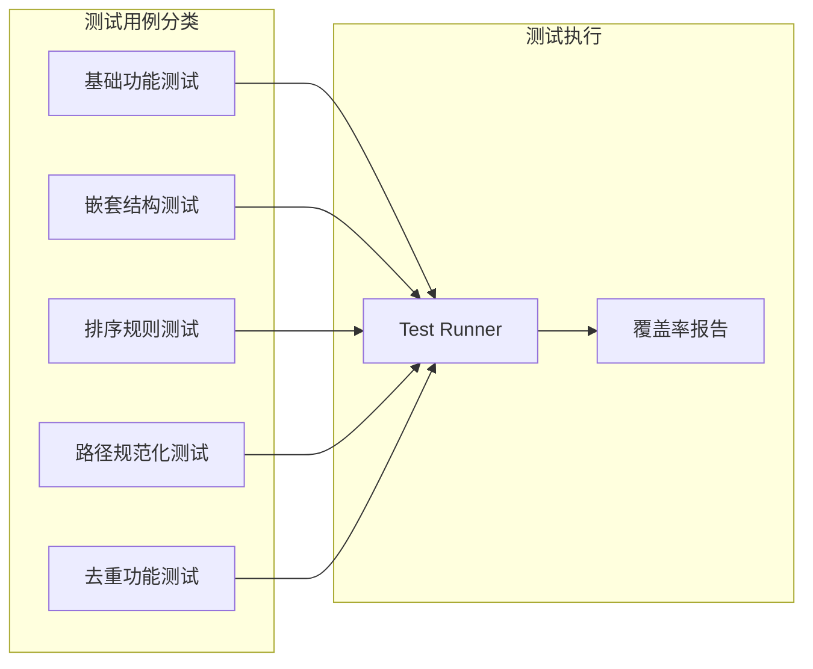
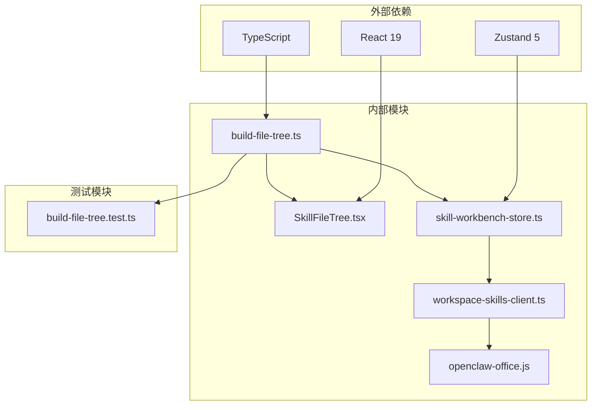

# 文件树构建工具

<cite>
**本文档引用的文件**
- [build-file-tree.ts](file://src/lib/build-file-tree.ts)
- [build-file-tree.test.ts](file://tests/lib/build-file-tree.test.ts)
- [SkillFileTree.tsx](file://src/components/console/skills/SkillFileTree.tsx)
- [skill-workbench-store.ts](file://src/store/console-stores/skill-workbench-store.ts)
- [workspace-skills-client.ts](file://src/gateway/workspace-skills-client.ts)
- [openclaw-office.js](file://bin/openclaw-office.js)
- [SKILL-WORKBENCH.md](file://SKILL-WORKBENCH.md)
- [README.md](file://README.md)
</cite>

## 目录
1. [简介](#简介)
2. [项目结构](#项目结构)
3. [核心组件](#核心组件)
4. [架构概览](#架构概览)
5. [详细组件分析](#详细组件分析)
6. [依赖关系分析](#依赖关系分析)
7. [性能考量](#性能考量)
8. [故障排除指南](#故障排除指南)
9. [结论](#结论)

## 简介

文件树构建工具是 OpenClaw Office 项目中的一个核心功能模块，专门用于将平面化的文件路径列表转换为具有层次结构的目录树。这个工具在 Skills 工作台中发挥着重要作用，为用户提供直观的文件浏览体验。

OpenClaw Office 是一个基于 React 19 和 Vite 6 的多智能体系统可视化监控与管理前端，通过等距投影风格的虚拟办公室场景实时展示 Agent 的工作状态、协作链路和资源消耗。文件树构建工具作为其中的重要组成部分，为技能开发平台提供了高效的文件组织和导航能力。

## 项目结构

文件树构建工具位于项目的 `src/lib` 目录下，是一个独立的 TypeScript 模块，包含以下关键文件：

**图表来源**
- [build-file-tree.ts:1-111](file://src/lib/build-file-tree.ts#L1-L111)
- [SkillFileTree.tsx:1-43](file://src/components/console/skills/SkillFileTree.tsx#L1-L43)
- [skill-workbench-store.ts:1-309](file://src/store/console-stores/skill-workbench-store.ts#L1-L309)

**章节来源**
- [build-file-tree.ts:1-111](file://src/lib/build-file-tree.ts#L1-L111)
- [README.md:1-331](file://README.md#L1-L331)

## 核心组件

文件树构建工具的核心功能由以下组件构成：

### 主要数据结构

文件树构建工具定义了两种核心数据类型：

1. **FileTreeNode**: 表示文件树中的节点
   - 文件节点：包含名称、路径和文件类型标识
   - 目录节点：包含名称、路径、类型标识和子节点数组

2. **DirBuilder**: 内部使用的目录构建器，用于构建目录结构

### 核心算法

工具提供了两个主要函数：

1. **buildFileTree()**: 将平面路径列表转换为层次化文件树
2. **expandedPathsForSelection()**: 计算选中文件所需的展开路径

**章节来源**
- [build-file-tree.ts:20-111](file://src/lib/build-file-tree.ts#L20-L111)

## 架构概览

文件树构建工具在整个系统架构中扮演着桥梁角色，连接着数据层、UI层和业务逻辑层：

**图表来源**
- [build-file-tree.ts:59-94](file://src/lib/build-file-tree.ts#L59-L94)
- [skill-workbench-store.ts:281-286](file://src/store/console-stores/skill-workbench-store.ts#L281-L286)

## 详细组件分析

### 文件树构建算法

文件树构建算法采用递归构建的方式，具有以下特点：

#### 核心构建流程

**图表来源**
- [build-file-tree.ts:62-91](file://src/lib/build-file-tree.ts#L62-L91)
- [build-file-tree.ts:34-52](file://src/lib/build-file-tree.ts#L34-L52)

#### 排序算法

文件树构建器实现了特殊的排序规则：

1. **目录优先原则**: 所有目录节点总是排在文件节点之前
2. **大小写不敏感排序**: 使用 `localeCompare` 函数进行不区分大小写的比较
3. **语义化敏感性**: 使用 `{ sensitivity: "base" }` 参数忽略重音符号差异

#### 路径展开功能

`expandedPathsForSelection()` 函数提供了智能的路径展开功能：

**图表来源**
- [build-file-tree.ts:101-110](file://src/lib/build-file-tree.ts#L101-L110)

**章节来源**
- [build-file-tree.ts:54-57](file://src/lib/build-file-tree.ts#L54-L57)
- [build-file-tree.ts:101-110](file://src/lib/build-file-tree.ts#L101-L110)

### UI组件集成

文件树构建工具与UI组件的集成体现在以下几个方面：

#### SkillFileTree 组件

SkillFileTree 组件负责渲染文件树UI，具有以下特性：

1. **图标适配**: 根据文件扩展名自动选择合适的图标
2. **状态管理**: 支持文件选中状态的视觉反馈
3. **交互设计**: 提供文件点击选择的交互能力

#### 状态管理集成

文件树构建工具与状态管理系统的集成通过以下方式实现：

1. **文件树存储**: 在技能工作台状态中维护文件树数据
2. **异步加载**: 支持从网关API异步获取文件列表
3. **实时更新**: 当文件内容发生变化时自动刷新文件树

**章节来源**
- [SkillFileTree.tsx:10-43](file://src/components/console/skills/SkillFileTree.tsx#L10-L43)
- [skill-workbench-store.ts:116-153](file://src/store/console-stores/skill-workbench-store.ts#L116-L153)

### 测试验证

文件树构建工具配备了完整的单元测试，确保算法的正确性和稳定性：

#### 测试覆盖范围

1. **基础功能测试**: 验证基本的文件树构建功能
2. **嵌套路径测试**: 测试复杂的嵌套目录结构
3. **排序规则测试**: 验证目录优先和大小写不敏感的排序
4. **路径规范化测试**: 测试各种路径格式的规范化处理
5. **去重功能测试**: 验证重复路径的去重处理

#### 测试策略

测试采用了行为驱动开发（BDD）的方法，通过具体的测试用例验证算法的行为：

**图表来源**
- [build-file-tree.test.ts:4-87](file://tests/lib/build-file-tree.test.ts#L4-L87)

**章节来源**
- [build-file-tree.test.ts:1-87](file://tests/lib/build-file-tree.test.ts#L1-L87)

## 依赖关系分析

文件树构建工具与其他组件的依赖关系形成了清晰的层次结构：

**图表来源**
- [build-file-tree.ts:1-111](file://src/lib/build-file-tree.ts#L1-L111)
- [skill-workbench-store.ts:1-309](file://src/store/console-stores/skill-workbench-store.ts#L1-L309)

### 模块耦合度分析

文件树构建工具展现了良好的模块化设计：

1. **低耦合高内聚**: 核心算法独立于UI和状态管理
2. **清晰的职责分离**: 数据处理、UI渲染和状态管理各司其职
3. **可测试性强**: 纯函数设计便于单元测试
4. **可扩展性好**: 易于添加新的排序规则或路径处理逻辑

**章节来源**
- [build-file-tree.ts:1-111](file://src/lib/build-file-tree.ts#L1-L111)
- [skill-workbench-store.ts:1-309](file://src/store/console-stores/skill-workbench-store.ts#L1-L309)

## 性能考量

文件树构建工具在性能方面采用了多项优化策略：

### 时间复杂度优化

1. **线性时间复杂度**: 整体算法时间复杂度为 O(n×m)，其中n为路径数量，m为平均路径深度
2. **内存效率**: 使用Map数据结构进行子节点查找，平均查找时间为O(1)
3. **递归优化**: 采用尾递归优化减少栈空间使用

### 空间复杂度分析

1. **树结构存储**: 每个节点占用固定大小的内存空间
2. **路径分割**: 临时存储路径段数组，最大长度等于最大路径深度
3. **排序开销**: 排序操作需要额外的内存空间

### 实际应用场景

在Skills工作台的实际应用中，文件树构建工具能够高效处理：

- **大型项目**: 支持包含数百个文件的复杂项目结构
- **深层嵌套**: 能够处理多层级的目录结构
- **实时更新**: 在文件内容变化时快速重建文件树

## 故障排除指南

### 常见问题及解决方案

#### 文件树显示异常

**问题描述**: 文件树显示顺序不符合预期

**可能原因**:
1. 路径格式不规范
2. 排序规则配置错误
3. 编码问题导致的字符比较异常

**解决方法**:
1. 检查输入路径是否符合规范格式
2. 验证排序规则的locale设置
3. 确认文件系统编码一致性

#### 性能问题

**问题描述**: 大型项目加载缓慢

**可能原因**:
1. 路径数量过多
2. 路径深度过大
3. 重复路径导致的重复计算

**解决方法**:
1. 实施分页加载策略
2. 限制最大路径深度
3. 添加路径去重机制

#### 内存泄漏

**问题描述**: 长时间使用后内存占用持续增长

**可能原因**:
1. 递归深度过大导致栈溢出
2. 闭包引用导致的对象无法回收
3. 大量临时对象未及时释放

**解决方法**:
1. 实施递归深度限制
2. 清理不必要的引用
3. 使用迭代替代递归

**章节来源**
- [build-file-tree.ts:54-57](file://src/lib/build-file-tree.ts#L54-L57)
- [build-file-tree.ts:34-52](file://src/lib/build-file-tree.ts#L34-L52)

## 结论

文件树构建工具作为 OpenClaw Office 项目中的重要组件，展现了优秀的软件工程实践：

### 设计优势

1. **算法简洁高效**: 采用递归构建的方式，代码简洁易懂
2. **功能完整**: 提供了文件树构建和路径展开的完整功能
3. **测试完备**: 具备全面的单元测试覆盖
4. **集成良好**: 与UI组件和状态管理系统无缝集成

### 技术特色

1. **纯函数设计**: 核心算法无副作用，易于测试和维护
2. **类型安全**: 完整的TypeScript类型定义
3. **性能优化**: 采用多种优化策略确保高效运行
4. **可扩展性**: 良好的架构设计支持功能扩展

### 应用价值

文件树构建工具在 Skills 工作台中发挥了重要作用，为用户提供了直观的文件浏览体验，支持技能开发的高效进行。其设计理念和实现方式为类似的应用场景提供了有价值的参考。

通过持续的优化和完善，文件树构建工具将继续为 OpenClaw Office 项目提供稳定可靠的基础功能支持。