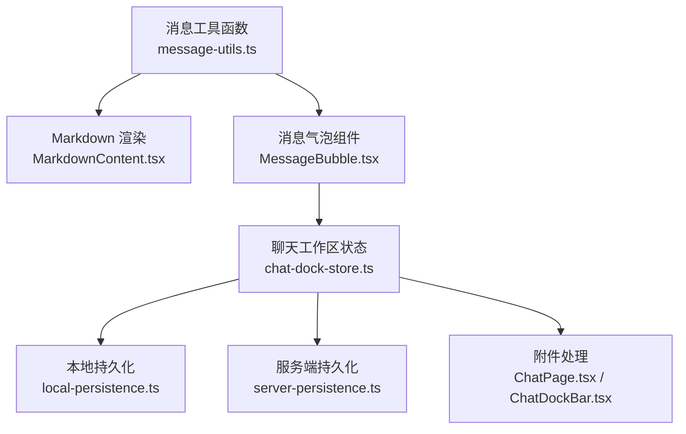
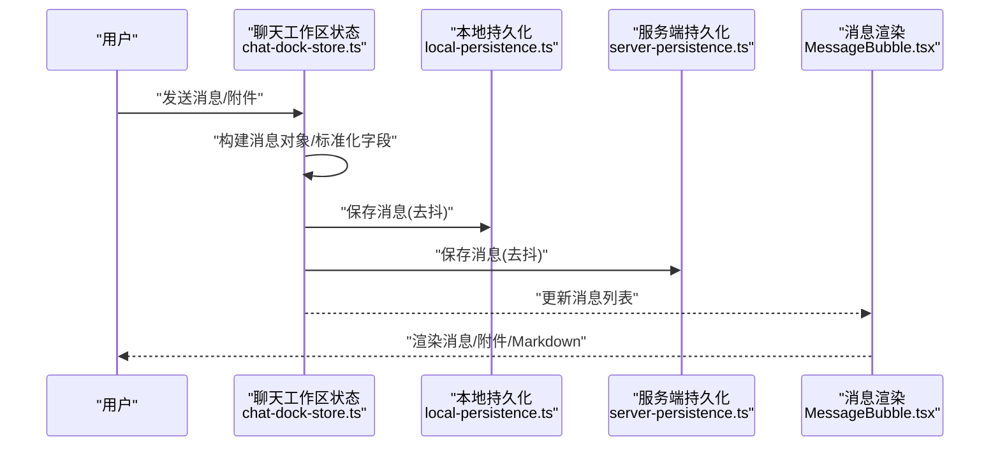
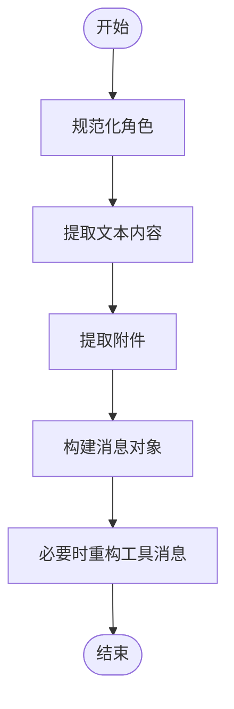
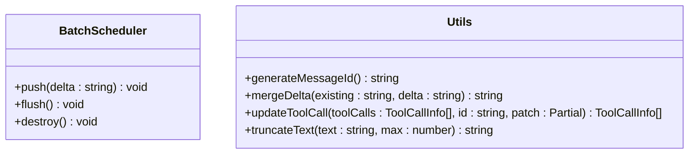
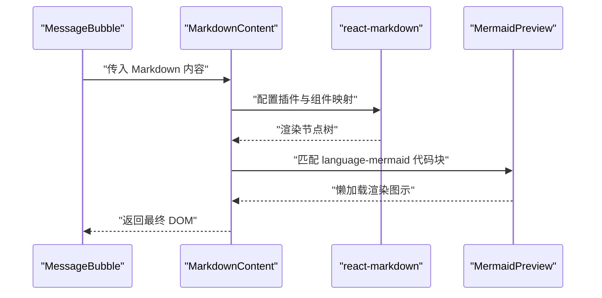
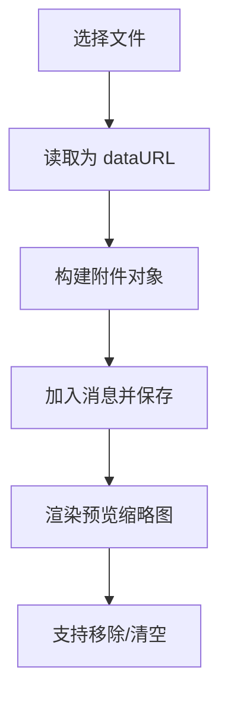
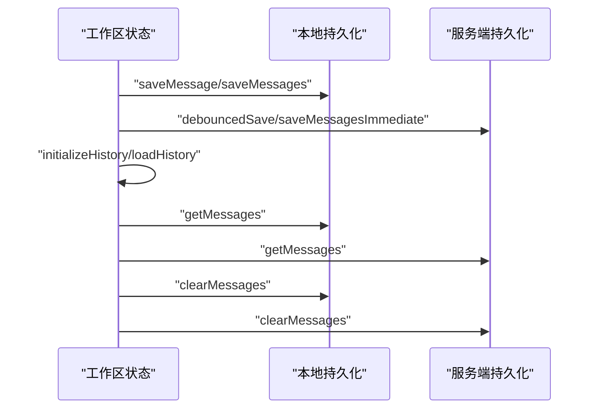
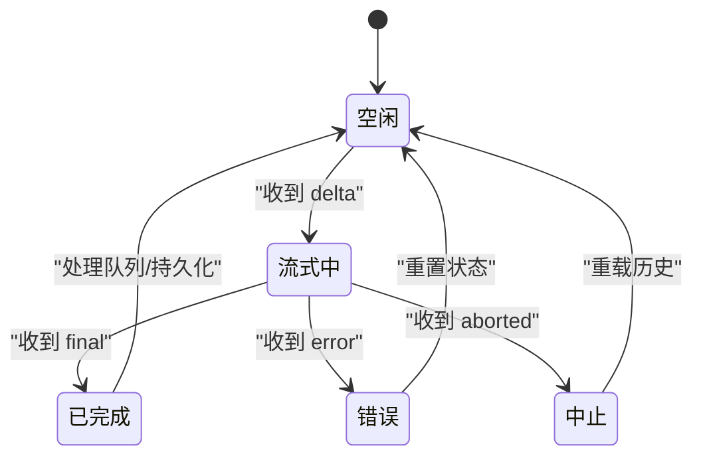
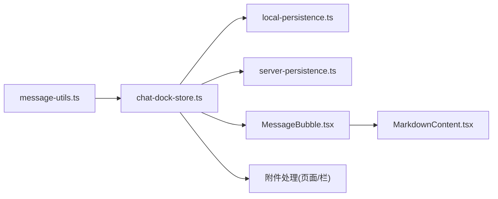

# 消息工具函数

<cite>
**本文引用的文件**
- [message-utils.ts](file://src/lib/message-utils.ts)
- [message-utils.test.ts](file://src/lib/__tests__/message-utils.test.ts)
- [MarkdownContent.tsx](file://src/components/chat/MarkdownContent.tsx)
- [MessageBubble.tsx](file://src/components/chat/MessageBubble.tsx)
- [chat-dock-store.ts](file://src/store/console-stores/chat-dock-store.ts)
- [server-persistence.ts](file://src/lib/server-persistence.ts)
- [local-persistence.ts](file://src/lib/local-persistence.ts)
- [ChatPage.tsx](file://src/components/pages/ChatPage.tsx)
- [ChatDockBar.tsx](file://src/components/chat/ChatDockBar.tsx)
</cite>

## 目录
1. [简介](#简介)
2. [项目结构](#项目结构)
3. [核心组件](#核心组件)
4. [架构总览](#架构总览)
5. [详细组件分析](#详细组件分析)
6. [依赖关系分析](#依赖关系分析)
7. [性能考量](#性能考量)
8. [故障排查指南](#故障排查指南)
9. [结论](#结论)
10. [附录](#附录)

## 简介
本文件聚焦于“消息工具函数”的技术文档，围绕以下主题展开：
- 消息格式化：消息结构定义、字段校验、格式转换
- Markdown 处理：语法解析、安全渲染、自定义扩展（Mermaid）
- 附件处理：文件类型识别、大小限制、预览生成
- 消息生命周期：创建、存储、检索、删除
- API 参考、使用示例与错误处理策略
- 与聊天工作区系统的集成与数据流

## 项目结构
与消息工具函数直接相关的核心模块分布如下：
- 工具函数层：消息 ID 生成、增量合并、工具调用更新、文本截断、批量调度器
- 渲染层：Markdown 内容渲染与 Mermaid 扩展、消息气泡展示
- 存储层：本地 IndexedDB 缓存、服务端缓存接口
- 工作区集成：聊天工作区状态管理、历史加载与事件应用

图表来源
- [message-utils.ts:1-112](file://src/lib/message-utils.ts#L1-L112)
- [MarkdownContent.tsx:1-133](file://src/components/chat/MarkdownContent.tsx#L1-L133)
- [MessageBubble.tsx:1-257](file://src/components/chat/MessageBubble.tsx#L1-L257)
- [chat-dock-store.ts:1-800](file://src/store/console-stores/chat-dock-store.ts#L1-L800)
- [local-persistence.ts:1-408](file://src/lib/local-persistence.ts#L1-L408)
- [server-persistence.ts:1-138](file://src/lib/server-persistence.ts#L1-L138)
- [ChatPage.tsx:412-457](file://src/components/pages/ChatPage.tsx#L412-L457)
- [ChatDockBar.tsx:154-186](file://src/components/chat/ChatDockBar.tsx#L154-L186)

章节来源
- [message-utils.ts:1-112](file://src/lib/message-utils.ts#L1-L112)
- [MarkdownContent.tsx:1-133](file://src/components/chat/MarkdownContent.tsx#L1-L133)
- [MessageBubble.tsx:1-257](file://src/components/chat/MessageBubble.tsx#L1-L257)
- [chat-dock-store.ts:1-800](file://src/store/console-stores/chat-dock-store.ts#L1-L800)
- [local-persistence.ts:1-408](file://src/lib/local-persistence.ts#L1-L408)
- [server-persistence.ts:1-138](file://src/lib/server-persistence.ts#L1-L138)
- [ChatPage.tsx:412-457](file://src/components/pages/ChatPage.tsx#L412-L457)
- [ChatDockBar.tsx:154-186](file://src/components/chat/ChatDockBar.tsx#L154-L186)

## 核心组件
- 消息工具函数：提供消息 ID 生成、增量内容合并、工具调用状态更新、文本截断、批量调度等能力
- Markdown 渲染：基于 react-markdown + remark-gfm，支持表格、代码块、行内代码、链接等；对 Mermaid 代码块进行懒加载渲染
- 消息气泡：负责消息 UI 呈现、工具活动气泡、思考态展示、流式指示器、图片附件预览
- 工作区集成：统一管理消息集合、流式状态、队列、会话切换、历史加载与事件应用
- 本地/服务端持久化：提供 IndexedDB 本地缓存与服务端缓存接口，支持消息与会话的增删改查

章节来源
- [message-utils.ts:1-112](file://src/lib/message-utils.ts#L1-L112)
- [MarkdownContent.tsx:1-133](file://src/components/chat/MarkdownContent.tsx#L1-L133)
- [MessageBubble.tsx:1-257](file://src/components/chat/MessageBubble.tsx#L1-L257)
- [chat-dock-store.ts:1-800](file://src/store/console-stores/chat-dock-store.ts#L1-L800)
- [local-persistence.ts:1-408](file://src/lib/local-persistence.ts#L1-L408)
- [server-persistence.ts:1-138](file://src/lib/server-persistence.ts#L1-L138)

## 架构总览
消息在系统中的流转路径：
- 用户输入或网关事件触发 -> 工作区状态更新 -> 本地/服务端持久化 -> UI 渲染

图表来源
- [chat-dock-store.ts:1-800](file://src/store/console-stores/chat-dock-store.ts#L1-L800)
- [local-persistence.ts:1-408](file://src/lib/local-persistence.ts#L1-L408)
- [server-persistence.ts:1-138](file://src/lib/server-persistence.ts#L1-L138)
- [MessageBubble.tsx:1-257](file://src/components/chat/MessageBubble.tsx#L1-L257)

## 详细组件分析

### 消息结构与字段校验
- 结构定义
  - 消息对象包含：标识符、角色（用户/助手/系统）、内容、时间戳、流式标记、附件、工具调用、消息类型、运行 ID、中止标记、作者代理 ID、折叠状态、思考内容等
  - 附件对象包含：唯一 ID、名称、MIME 类型、dataURL 或内容
- 字段校验与归一化
  - 角色规范化：非合法值时回退为默认角色
  - 文本提取：兼容数组形式的内容块，仅提取文本块
  - 附件提取：从内容块或附件数组中提取图像类附件并归一化
  - 工具消息重构：将嵌入工具调用的助手消息拆分为独立的“工具”系统消息，便于 UI 展示一致

图表来源
- [chat-dock-store.ts:542-674](file://src/store/console-stores/chat-dock-store.ts#L542-L674)

章节来源
- [chat-dock-store.ts:29-43](file://src/store/console-stores/chat-dock-store.ts#L29-L43)
- [chat-dock-store.ts:542-674](file://src/store/console-stores/chat-dock-store.ts#L542-L674)

### 消息格式化与工具函数
- 消息 ID 生成：基于时间戳与随机字符串，确保唯一性
- 增量合并：将新片段追加到现有内容末尾
- 工具调用更新：按 ID 查找并合并状态，不存在则新增
- 文本截断：超过长度限制时截断并添加省略号
- 批量调度器：在设定的时间窗口内合并增量，避免频繁刷新；支持最大延迟强制刷新；销毁时清空剩余增量

图表来源
- [message-utils.ts:3-112](file://src/lib/message-utils.ts#L3-L112)

章节来源
- [message-utils.ts:1-112](file://src/lib/message-utils.ts#L1-L112)
- [message-utils.test.ts:1-136](file://src/lib/__tests__/message-utils.test.ts#L1-L136)

### Markdown 处理机制
- 解析与渲染
  - 使用 remark-gfm 插件启用 GFM 语法（表格、任务列表等）
  - 自定义组件覆盖段落、标题、引用、表格、代码块、行内代码、链接等样式
- 安全渲染
  - 链接强制新开窗口并设置安全属性
  - 代码块与行内代码分别处理，保持语法高亮与可读性
- 自定义扩展
  - 对语言为 mermaid 的代码块进行懒加载渲染，提升首屏性能
  - 提供回退方案：在懒加载组件未就绪前显示原始文本

图表来源
- [MarkdownContent.tsx:1-133](file://src/components/chat/MarkdownContent.tsx#L1-L133)

章节来源
- [MarkdownContent.tsx:1-133](file://src/components/chat/MarkdownContent.tsx#L1-L133)

### 附件处理功能
- 文件类型识别
  - 通过 MIME 类型判断是否为图像；支持 dataURL 或 URL 形式
- 大小限制
  - 本地持久化层具备配额阈值检测与清理逻辑，防止存储溢出
- 预览生成
  - 图像类附件以缩略图形式在消息气泡下方网格展示
  - 支持移除与清空操作

图表来源
- [ChatPage.tsx:412-457](file://src/components/pages/ChatPage.tsx#L412-L457)
- [ChatDockBar.tsx:154-186](file://src/components/chat/ChatDockBar.tsx#L154-L186)
- [local-persistence.ts:326-338](file://src/lib/local-persistence.ts#L326-L338)

章节来源
- [ChatPage.tsx:412-457](file://src/components/pages/ChatPage.tsx#L412-L457)
- [ChatDockBar.tsx:154-186](file://src/components/chat/ChatDockBar.tsx#L154-L186)
- [local-persistence.ts:326-338](file://src/lib/local-persistence.ts#L326-L338)

### 消息生命周期管理
- 创建
  - 输入消息经工作区状态规范化后生成消息对象
  - 附件被提取并归一化，工具调用信息与思考内容被抽取
- 存储
  - 本地持久化：IndexedDB 存储，带索引与容量控制
  - 服务端持久化：REST 接口，带去抖动与立即保存两种模式
- 检索
  - 启动时优先从本地缓存加载，再异步拉取服务端缓存
  - 历史消息统一归一化，必要时重构工具消息
- 删除
  - 支持按会话清空消息或删除单条消息
  - 服务端删除接口与本地清理逻辑配合

图表来源
- [chat-dock-store.ts:53-84](file://src/store/console-stores/chat-dock-store.ts#L53-L84)
- [local-persistence.ts:97-169](file://src/lib/local-persistence.ts#L97-L169)
- [server-persistence.ts:53-100](file://src/lib/server-persistence.ts#L53-L100)

章节来源
- [chat-dock-store.ts:53-84](file://src/store/console-stores/chat-dock-store.ts#L53-L84)
- [local-persistence.ts:97-169](file://src/lib/local-persistence.ts#L97-L169)
- [server-persistence.ts:53-100](file://src/lib/server-persistence.ts#L53-L100)

### 与聊天工作区系统的集成
- 事件驱动
  - 网关事件通过工作区状态机应用，区分 delta/final/error/aborted 等状态
  - 流式消息在 UI 中逐步拼接，最终落盘
- 会话管理
  - 会话键命名规范与偏好选择逻辑，支持本地存储上次会话键
- 数据一致性
  - 本地与服务端双写，保证离线可用与跨设备同步

图表来源
- [chat-dock-store.ts:177-309](file://src/store/console-stores/chat-dock-store.ts#L177-L309)

章节来源
- [chat-dock-store.ts:177-309](file://src/store/console-stores/chat-dock-store.ts#L177-L309)

## 依赖关系分析
- 组件耦合
  - 消息工具函数与渲染组件解耦，通过标准化的消息对象传递
  - 工作区状态集中管理消息与事件，向 UI 与持久化层提供统一接口
- 外部依赖
  - react-markdown + remark-gfm：Markdown 解析与渲染
  - IndexedDB：本地持久化
  - Fetch：服务端缓存接口

图表来源
- [message-utils.ts:1-112](file://src/lib/message-utils.ts#L1-L112)
- [chat-dock-store.ts:1-800](file://src/store/console-stores/chat-dock-store.ts#L1-L800)
- [local-persistence.ts:1-408](file://src/lib/local-persistence.ts#L1-L408)
- [server-persistence.ts:1-138](file://src/lib/server-persistence.ts#L1-L138)
- [MessageBubble.tsx:1-257](file://src/components/chat/MessageBubble.tsx#L1-L257)
- [MarkdownContent.tsx:1-133](file://src/components/chat/MarkdownContent.tsx#L1-L133)

章节来源
- [message-utils.ts:1-112](file://src/lib/message-utils.ts#L1-L112)
- [chat-dock-store.ts:1-800](file://src/store/console-stores/chat-dock-store.ts#L1-L800)
- [local-persistence.ts:1-408](file://src/lib/local-persistence.ts#L1-L408)
- [server-persistence.ts:1-138](file://src/lib/server-persistence.ts#L1-L138)
- [MessageBubble.tsx:1-257](file://src/components/chat/MessageBubble.tsx#L1-L257)
- [MarkdownContent.tsx:1-133](file://src/components/chat/MarkdownContent.tsx#L1-L133)

## 性能考量
- 批量调度器
  - 合理设置批处理与最大延迟，平衡实时性与渲染成本
- 本地缓存
  - 使用索引加速查询；配额阈值触发清理，避免内存膨胀
- 懒加载渲染
  - Mermaid 图表懒加载，减少首屏负担
- 去抖动保存
  - 服务端保存采用去抖动策略，降低网络请求频率

## 故障排查指南
- 本地持久化不可用
  - IndexedDB 不可用或打开失败时，本地持久化会降级为不可用状态
  - 检查浏览器兼容性与存储配额
- 服务端缓存异常
  - 请求失败时会静默处理，检查网络与服务端接口状态码
- Markdown 渲染问题
  - 确认 remark-gfm 插件已启用；自定义组件映射正确
- 附件预览缺失
  - 确认 dataURL 正确生成且 MIME 类型为图像；检查渲染条件分支

章节来源
- [local-persistence.ts:53-86](file://src/lib/local-persistence.ts#L53-L86)
- [server-persistence.ts:28-37](file://src/lib/server-persistence.ts#L28-L37)
- [MarkdownContent.tsx:1-133](file://src/components/chat/MarkdownContent.tsx#L1-L133)
- [ChatPage.tsx:412-457](file://src/components/pages/ChatPage.tsx#L412-L457)

## 结论
消息工具函数提供了完整的消息生命周期支撑：从结构化建模、格式化处理、Markdown 渲染、附件管理到持久化与工作区集成。通过批量调度、懒加载与去抖动等策略，在保证用户体验的同时兼顾性能与可靠性。

## 附录

### API 参考（函数与类型）
- generateMessageId
  - 功能：生成唯一消息 ID
  - 返回：字符串
  - 典型用途：消息对象初始化、附件对象初始化
- mergeDelta
  - 功能：将增量文本追加到现有内容
  - 参数：现有内容、增量文本
  - 返回：合并后的字符串
- updateToolCall
  - 功能：按 ID 更新工具调用状态或参数
  - 参数：工具调用数组、工具调用 ID、补丁对象
  - 返回：更新后的数组（不修改原数组）
- truncateText
  - 功能：按最大长度截断文本并添加省略号
  - 参数：文本、最大长度
  - 返回：截断后的文本
- createBatchScheduler
  - 功能：创建批量调度器，合并增量并在定时器触发时统一刷新
  - 参数：刷新回调、选项（批处理毫秒、最大延迟毫秒）
  - 返回：包含 push/flush/destroy 方法的对象

章节来源
- [message-utils.ts:3-112](file://src/lib/message-utils.ts#L3-L112)

### 使用示例（路径指引）
- 在工作区状态中使用消息 ID 生成与工具调用更新
  - [chat-dock-store.ts:554-562](file://src/store/console-stores/chat-dock-store.ts#L554-L562)
  - [chat-dock-store.ts:320-395](file://src/store/console-stores/chat-dock-store.ts#L320-L395)
- 在渲染组件中使用 MarkdownContent
  - [MessageBubble.tsx:213-216](file://src/components/chat/MessageBubble.tsx#L213-L216)
  - [MarkdownContent.tsx:22-131](file://src/components/chat/MarkdownContent.tsx#L22-L131)
- 在页面中处理附件上传与预览
  - [ChatPage.tsx:412-457](file://src/components/pages/ChatPage.tsx#L412-L457)
  - [ChatDockBar.tsx:154-186](file://src/components/chat/ChatDockBar.tsx#L154-L186)

### 错误处理策略
- 本地持久化
  - 异常捕获与静默失败，避免阻塞主流程
- 服务端持久化
  - 去抖动保存失败时忽略错误；立即保存失败时记录并继续
- Markdown 渲染
  - 自定义组件映射确保安全属性与样式可控

章节来源
- [local-persistence.ts:111-123](file://src/lib/local-persistence.ts#L111-L123)
- [server-persistence.ts:65-84](file://src/lib/server-persistence.ts#L65-L84)
- [MarkdownContent.tsx:116-125](file://src/components/chat/MarkdownContent.tsx#L116-L125)