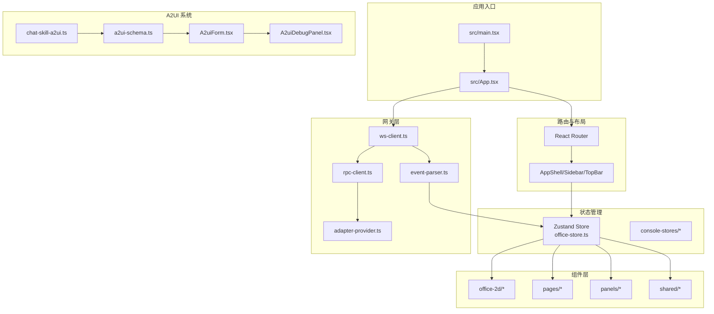
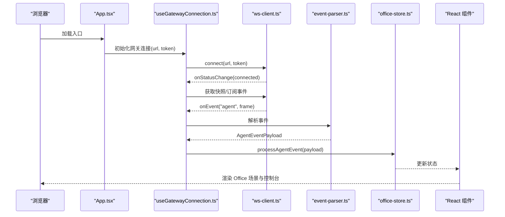
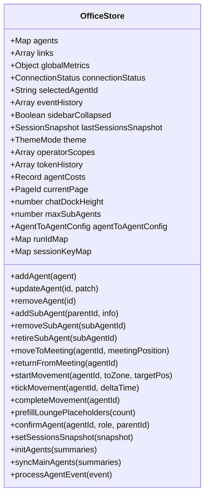
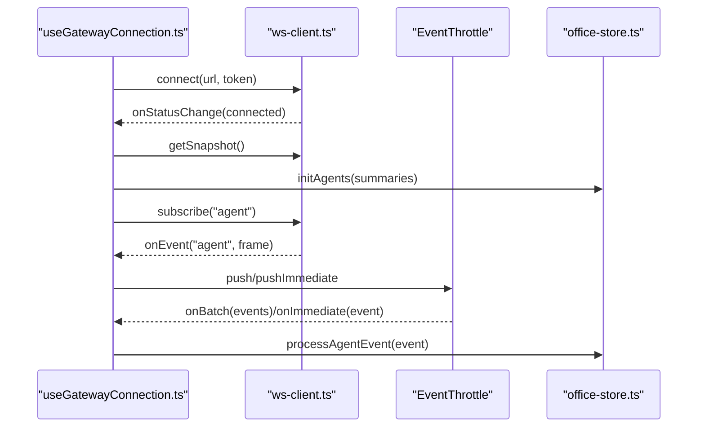
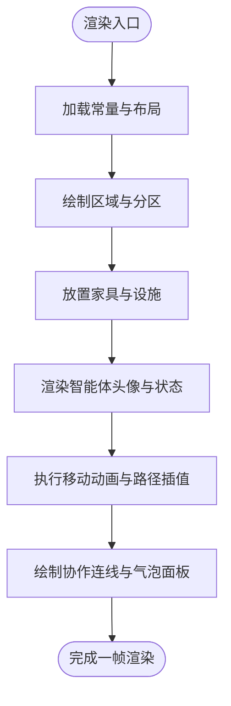
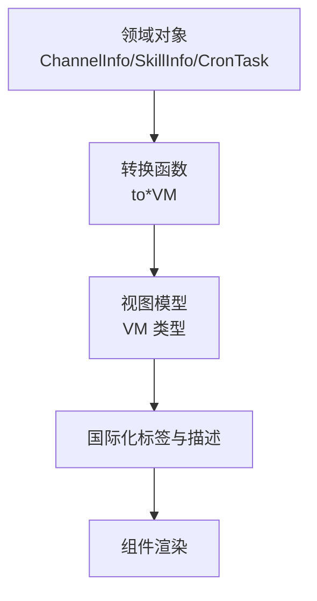
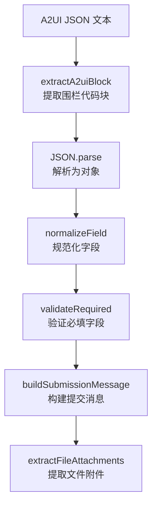
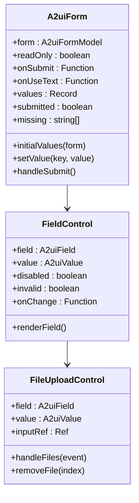
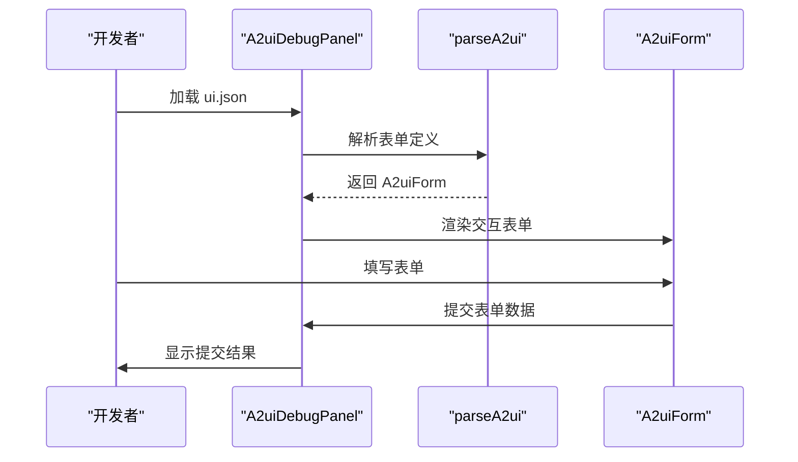
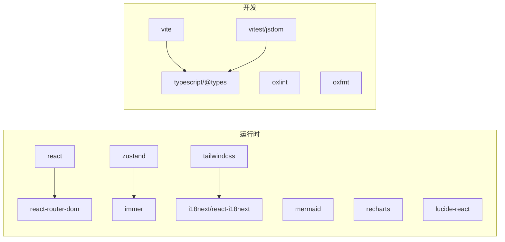

# 开发者指南

<cite>
**本文档引用的文件**
- [package.json](file://package.json)
- [README.md](file://README.md)
- [vite.config.ts](file://vite.config.ts)
- [src/main.tsx](file://src/main.tsx)
- [src/App.tsx](file://src/App.tsx)
- [src/store/office-store.ts](file://src/store/office-store.ts)
- [src/hooks/useGatewayConnection.ts](file://src/hooks/useGatewayConnection.ts)
- [src/gateway/ws-client.ts](file://src/gateway/ws-client.ts)
- [src/lib/constants.ts](file://src/lib/constants.ts)
- [tsconfig.json](file://tsconfig.json)
- [src/components/layout/AppShell.tsx](file://src/components/layout/AppShell.tsx)
- [src/lib/view-models.ts](file://src/lib/view-models.ts)
- [vitest.config.ts](file://vitest.config.ts)
- [src/lib/a2ui-schema.ts](file://src/lib/a2ui-schema.ts)
- [src/components/chat/A2uiForm.tsx](file://src/components/chat/A2uiForm.tsx)
- [src/components/console/skills/A2uiDebugPanel.tsx](file://src/components/console/skills/A2uiDebugPanel.tsx)
- [bin/skills/skill-workbench-mermaid-guard/references/a2ui-input-spec.md](file://bin/skills/skill-workbench-mermaid-guard/references/a2ui-input-spec.md)
- [src/lib/chat-skill-a2ui.ts](file://src/lib/chat-skill-a2ui.ts)
- [src/i18n/locales/zh/chat.json](file://src/i18n/locales/zh/chat.json)
- [src/i18n/locales/en/chat.json](file://src/i18n/locales/en/chat.json)
- [src/i18n/locales/zh/console.json](file://src/i18n/locales/zh/console.json)
- [src/i18n/locales/en/console.json](file://src/i18n/locales/en/console.json)
</cite>

## 目录
1. [简介](#简介)
2. [项目结构](#项目结构)
3. [核心组件](#核心组件)
4. [架构总览](#架构总览)
5. [详细组件分析](#详细组件分析)
6. [A2UI 开发规范](#a2ui-开发规范)
7. [依赖分析](#依赖分析)
8. [性能考虑](#性能考虑)
9. [故障排除指南](#故障排除指南)
10. [结论](#结论)
11. [附录](#附录)

## 简介
OpenClaw Office 是 OpenClaw 多智能体系统的可视化监控与管理前端。它通过等距投影的虚拟办公室场景，实时展示智能体的工作状态、协作链路、工具调用与资源消耗，并提供完整的控制台管理界面与 Chat 对话工作区。项目采用 React 19 + Vite 6 + Zustand 5 + Immer + Tailwind CSS 4 + React Router 7 + Mermaid + Recharts + i18next 技术栈，支持 Mock 模式与真实 Gateway 连接，具备响应式布局与国际化能力。

**新增** 项目现已集成 A2UI（Agent-to-UI）输入表单系统，提供结构化的用户交互体验，支持首次交互表单和运行期 HITL（Human-in-the-loop）确认流程。

## 项目结构
项目采用按功能域划分的目录组织方式，主要模块包括：
- src/components：UI 组件库，按页面与功能域细分（chat、console、dashboard、layout、office-2d、overlays、pages、panels、shared）
- src/gateway：网关适配层，封装 WebSocket 客户端、RPC 客户端、事件解析与适配器
- src/hooks：自定义 Hook，封装网关连接、轮询、响应式布局等
- src/i18n：国际化资源与初始化
- src/lib：通用工具库（常量、位置分配、事件节流、消息工具、视图模型转换、A2UI 表单解析等）
- src/store：状态管理，使用 Zustand + Immer，包含办公空间、控制台、日志、服务等多套 Store
- src/styles：全局样式
- tests：测试配置与组件测试
- 配置文件：package.json、tsconfig.json、vite.config.ts、vitest.config.ts



**图表来源**
- [src/main.tsx:1-15](file://src/main.tsx#L1-L15)
- [src/App.tsx:1-124](file://src/App.tsx#L1-L124)
- [src/store/office-store.ts:1-800](file://src/store/office-store.ts#L1-L800)
- [src/gateway/ws-client.ts:1-304](file://src/gateway/ws-client.ts#L1-L304)
- [src/lib/a2ui-schema.ts:1-321](file://src/lib/a2ui-schema.ts#L1-L321)
- [src/components/chat/A2uiForm.tsx:1-393](file://src/components/chat/A2uiForm.tsx#L1-L393)
- [src/components/console/skills/A2uiDebugPanel.tsx:1-103](file://src/components/console/skills/A2uiDebugPanel.tsx#L1-L103)
- [src/lib/chat-skill-a2ui.ts:1-117](file://src/lib/chat-skill-a2ui.ts#L1-L117)

**章节来源**
- [README.md:63-76](file://README.md#L63-L76)
- [package.json:49-82](file://package.json#L49-L82)

## 核心组件
- 应用入口与路由
  - 入口文件创建根节点并挂载 HashRouter 与 App；App 负责解析网关地址、注入主题与页面追踪、初始化聊天工作区与路由。
- 状态管理
  - 使用 Zustand + Immer 管理全局状态，包含智能体、链接、指标、会话快照、主题、聊天停靠高度、最大并发子智能体数等；提供事件历史、移动动画、会议调度、指标计算等方法。
- 网关连接
  - 通过 WebSocket 客户端与 RPC 客户端建立连接，支持重连、鉴权、快照同步、事件节流与批量处理；根据 Mock 模式选择不同适配器。
- 办公室 2D 渲染
  - 基于 SVG 的等距投影场景，包含区域划分、家具布置、智能体头像与移动动画、协作连线与气泡面板。
- 国际化与样式
  - i18next + react-i18next 提供中英双语支持；Tailwind CSS 提供原子化样式与暗色主题支持。
- **新增** A2UI 表单系统
  - 提供结构化表单解析、验证、渲染与提交功能，支持多种输入控件类型和文件上传。

**章节来源**
- [src/main.tsx:1-15](file://src/main.tsx#L1-L15)
- [src/App.tsx:76-124](file://src/App.tsx#L76-L124)
- [src/store/office-store.ts:217-244](file://src/store/office-store.ts#L217-L244)
- [src/hooks/useGatewayConnection.ts:23-151](file://src/hooks/useGatewayConnection.ts#L23-L151)
- [src/gateway/ws-client.ts:22-304](file://src/gateway/ws-client.ts#L22-L304)
- [src/lib/constants.ts:1-141](file://src/lib/constants.ts#L1-L141)

## 架构总览
应用通过 WebSocket 与 OpenClaw Gateway 交互，数据流如下：
- Gateway 广播实时事件（agent、presence、health、heartbeat）与响应 RPC 请求
- 前端使用 ws-client.ts 建立连接并处理认证、重连与事件分发
- event-parser.ts 解析事件并映射到 Zustand Store
- Store 更新后驱动 React 组件渲染，Office 场景实时反映智能体状态



**图表来源**
- [src/App.tsx:89-89](file://src/App.tsx#L89-L89)
- [src/hooks/useGatewayConnection.ts:36-135](file://src/hooks/useGatewayConnection.ts#L36-L135)
- [src/gateway/ws-client.ts:104-130](file://src/gateway/ws-client.ts#L104-L130)
- [src/store/office-store.ts:762-800](file://src/store/office-store.ts#L762-L800)

## 详细组件分析

### 状态管理组件分析
Zustand Store 通过 Immer 中间件实现不可变更新，集中管理智能体生命周期、移动动画、会议调度、指标计算与事件历史。关键能力包括：
- 智能体确认与子智能体管理：支持未确认智能体占位、子智能体激活与退休、会话键映射
- 移动动画：路径规划、插值计算、到达目标区域后的状态更新
- 会议管理：聚合并返回、手动会议触发、定时器清理
- 指标计算：全局指标、Token 历史、成本统计
- 事件历史：限制长度、持久化与回放



**图表来源**
- [src/store/office-store.ts:217-760](file://src/store/office-store.ts#L217-L760)

**章节来源**
- [src/store/office-store.ts:217-800](file://src/store/office-store.ts#L217-L800)

### 网关连接组件分析
useGatewayConnection 负责：
- 根据是否 Mock 模式选择适配器与事件源
- 初始化 WebSocket 与 RPC 客户端，注册事件处理器与状态变更回调
- 事件节流：即时事件与批次事件分别处理，降低渲染压力
- 连接成功后：获取快照、初始化智能体、同步主智能体列表、应用安全配置、拉取网关配置（最大并发子智能体数、A2A 工具开关）



**图表来源**
- [src/hooks/useGatewayConnection.ts:23-151](file://src/hooks/useGatewayConnection.ts#L23-L151)
- [src/gateway/ws-client.ts:104-181](file://src/gateway/ws-client.ts#L104-L181)

**章节来源**
- [src/hooks/useGatewayConnection.ts:23-238](file://src/hooks/useGatewayConnection.ts#L23-L238)
- [src/gateway/ws-client.ts:22-304](file://src/gateway/ws-client.ts#L22-L304)

### 办公室 2D 渲染组件分析
- 常量与布局：OFFICE、ZONES、CORRIDOR、颜色与家具尺寸常量统一管理
- 场景绘制：FloorPlan、DeskUnit、AgentAvatar、ConnectionLine、ZoneLabel
- 动画与交互：移动动画、状态指示、协作连线、气泡面板、侧边面板



**图表来源**
- [src/lib/constants.ts:1-141](file://src/lib/constants.ts#L1-L141)

**章节来源**
- [src/lib/constants.ts:1-141](file://src/lib/constants.ts#L1-L141)

### 视图模型转换分析
view-models.ts 将网关返回的领域对象转换为 UI 所需的视图模型，便于组件消费与国际化显示，涵盖：
- 仪表盘摘要：通道连接数、错误数、技能启用数、提供商用量
- 渠道卡片：类型图标、状态标签与颜色、配置/运行状态
- 技能卡片：启用状态、缺失依赖、安装选项、配置检查
- 定时任务卡片：计划表达式格式化、下次/上次运行时间、状态标签



**图表来源**
- [src/lib/view-models.ts:1-200](file://src/lib/view-models.ts#L1-L200)

**章节来源**
- [src/lib/view-models.ts:1-200](file://src/lib/view-models.ts#L1-L200)

### **新增** A2UI 表单系统分析

#### A2UI Schema 解析器
A2UI Schema 解析器提供完整的表单结构定义和解析功能：

- **表单类型定义**：支持 8 种字段类型（text、textarea、number、select、radio、checkbox、multiselect、file）
- **字段规范化**：自动处理选项类型字段的降级逻辑，确保数据完整性
- **文件处理**：支持单文件和多文件上传，包含 MIME 类型过滤
- **验证系统**：提供必填字段验证和值类型检查
- **消息构建**：将表单提交转换为结构化聊天消息



**图表来源**
- [src/lib/a2ui-schema.ts:158-199](file://src/lib/a2ui-schema.ts#L158-L199)
- [src/lib/a2ui-schema.ts:216-223](file://src/lib/a2ui-schema.ts#L216-L223)
- [src/lib/a2ui-schema.ts:254-284](file://src/lib/a2ui-schema.ts#L254-L284)
- [src/lib/a2ui-schema.ts:291-320](file://src/lib/a2ui-schema.ts#L291-L320)

#### A2UI 表单组件
A2UI 表单组件提供完整的用户交互体验：

- **多控件支持**：文本输入、下拉选择、单选按钮、复选框、多选框、文件上传
- **实时验证**：必填字段即时验证，错误状态高亮显示
- **文件处理**：拖拽上传、文件预览、批量删除
- **国际化支持**：完整的中英文翻译支持
- **无障碍设计**：键盘导航、屏幕阅读器支持



**图表来源**
- [src/components/chat/A2uiForm.tsx:14-22](file://src/components/chat/A2uiForm.tsx#L14-L22)
- [src/components/chat/A2uiForm.tsx:53-69](file://src/components/chat/A2uiForm.tsx#L53-L69)
- [src/components/chat/A2uiForm.tsx:191-205](file://src/components/chat/A2uiForm.tsx#L191-L205)

#### A2UI 调试面板
A2UI 调试面板为技能开发者提供表单预览和测试功能：

- **实时预览**：加载 ui.json 并实时渲染表单
- **一键生成**：基于 SKILL.md 自动生成 A2UI 表单
- **表单提交**：将收集的值转换为结构化消息
- **工作台集成**：与技能工作台无缝集成



**图表来源**
- [src/components/console/skills/A2uiDebugPanel.tsx:30-46](file://src/components/console/skills/A2uiDebugPanel.tsx#L30-L46)
- [src/components/console/skills/A2uiDebugPanel.tsx:75-99](file://src/components/console/skills/A2uiDebugPanel.tsx#L75-L99)

**章节来源**
- [src/lib/a2ui-schema.ts:1-321](file://src/lib/a2ui-schema.ts#L1-L321)
- [src/components/chat/A2uiForm.tsx:1-393](file://src/components/chat/A2uiForm.tsx#L1-L393)
- [src/components/console/skills/A2uiDebugPanel.tsx:1-103](file://src/components/console/skills/A2uiDebugPanel.tsx#L1-L103)
- [src/lib/chat-skill-a2ui.ts:1-117](file://src/lib/chat-skill-a2ui.ts#L1-L117)

## A2UI 开发规范

### 表单 Schema 规范
A2UI 表单采用声明式 JSON Schema 定义，支持以下字段：

| 字段 | 类型 | 必填 | 说明 |
|------|------|------|------|
| `version` | number | 否 | Schema 版本，固定为 `1` |
| `skill` | string | 否 | 目标 Skill 标识（slug） |
| `title` | string | 否 | 表单标题 |
| `description` | string | 否 | 表单说明 |
| `fields` | array | **是** | 字段列表，至少 1 项 |
| `submit` | object | 否 | `{ "label": "提交按钮文案" }` |

每个 `fields` 元素支持以下属性：

| 字段 | 类型 | 必填 | 说明 |
|------|------|------|------|
| `key` | string | **是** | 字段名，提交时作为键 |
| `label` | string | 否 | 显示标签（缺省回退为 `key`） |
| `type` | string | 否 | 控件类型，见下表 |
| `required` | boolean | 否 | 是否必填 |
| `value` | string/string[]/boolean/object/object[] | 否 | 预填值 |
| `placeholder` | string | 否 | 占位提示 |
| `options` | array | 选项类必填 | `[{ "label": "...", "value": "..." }]` |
| `accept` | string | 否 | 仅 `file` 类型；MIME 过滤 |
| `multiple` | boolean | 否 | 仅 `file` 类型；多文件选择 |

### 支持的字段类型

| type | 控件 | value 形态 | 选项要求 |
|------|------|-----------|----------|
| `text` | 单行文本 | string | 无 |
| `textarea` | 多行文本 | string | 无 |
| `number` | 数字输入 | string | 无 |
| `select` | 下拉单选 | string（option.value） | 必须提供 options |
| `radio` | 单选按钮组 | string（option.value） | 必须提供 options |
| `checkbox` | 单个勾选 | boolean | 无 |
| `multiselect` | 多选框组 | string[]（多个 option.value） | 必须提供 options |
| `file` | 文件上传 | `{ name, mimeType, dataUrl }` | 无 |

### 文件类型字段规范
对于包含数据来源、数据文件、数据集、上传、附件、导入等关键词的字段，必须使用 `type: "file"`：

- **必须设置 `accept`**：准确列出支持的扩展名或 MIME 类型
- **多文件场景**：设置 `multiple: true`
- **反例**：使用 `text` 或 `textarea` 让用户手填路径或粘贴内容

### 表单生成规则

#### 首次交互表单（ui.json）
当任务是"为目标 Skill 生成首次交互表单"时：

1. 通读目标 Skill 的 SKILL.md，识别真正需要用户提供的关键输入
2. 产出纯 A2UI Schema JSON，写入 `ui.json`
3. 设置合理的 `type`、`required`、`label` 与可用的 `value` 预填
4. 保持字段精简：只采集"不问就无法开始"的信息

#### 运行期表单（```a2ui 块）
当 Skill 执行过程中需要 HITL（用户补充/确认）时：

1. 在助手回复中直接输出 ` ```a2ui ` 围栏代码块
2. 只在真正需要用户输入时输出表单
3. 表单提交后用户会收到结构化文字消息 + 机器可读 JSON 载荷
4. 运行期表单不写入文件，随用随生成

### 国际化支持
A2UI 系统提供完整的中英文国际化支持：

**聊天界面翻译键**：
- `a2ui.submit`：提交按钮
- `a2ui.requiredHint`：必填字段提示
- `a2ui.requiredMark`：必填标记
- `a2ui.selectPlaceholder`：选择框占位符
- `a2ui.useText`：改用文字回答
- `a2ui.submittedNotice`：提交后提示
- `a2ui.uploadFile`：上传文件
- `a2ui.uploadFiles`：上传文件（多选）
- `a2ui.removeFile`：移除文件

**控制台界面翻译键**：
- `skillWorkbench.a2ui.title`：A2UI 调试标题
- `skillWorkbench.a2ui.empty`：空状态提示
- `skillWorkbench.a2ui.generate`：生成按钮
- `skillWorkbench.a2ui.regenerate`：重新生成按钮
- `skillWorkbench.a2ui.reload`：重新加载按钮

### 调试流程
A2UI 调试流程包括以下步骤：

1. **表单加载**：从 ui.json 加载表单定义
2. **实时预览**：渲染交互式表单
3. **数据收集**：用户填写表单字段
4. **验证检查**：必填字段验证
5. **提交处理**：构建结构化消息
6. **文件处理**：提取文件附件
7. **结果反馈**：显示提交结果

**章节来源**
- [bin/skills/skill-workbench-mermaid-guard/references/a2ui-input-spec.md:1-136](file://bin/skills/skill-workbench-mermaid-guard/references/a2ui-input-spec.md#L1-L136)
- [src/lib/a2ui-schema.ts:169-199](file://src/lib/a2ui-schema.ts#L169-L199)
- [src/components/chat/A2uiForm.tsx:298-393](file://src/components/chat/A2uiForm.tsx#L298-L393)
- [src/components/console/skills/A2uiDebugPanel.tsx:30-103](file://src/components/console/skills/A2uiDebugPanel.tsx#L30-L103)
- [src/i18n/locales/zh/chat.json:7-21](file://src/i18n/locales/zh/chat.json#L7-L21)
- [src/i18n/locales/en/chat.json:7-21](file://src/i18n/locales/en/chat.json#L7-L21)
- [src/i18n/locales/zh/console.json:764-769](file://src/i18n/locales/zh/console.json#L764-L769)
- [src/i18n/locales/en/console.json:764-769](file://src/i18n/locales/en/console.json#L764-L769)

## 依赖分析
- 运行时依赖
  - React 19、ReactDOM、React Router 7：应用框架与路由
  - Zustand 5 + Immer：轻量状态管理与不可变更新
  - Tailwind CSS 4：原子化样式与暗色主题
  - i18next + react-i18next：国际化
  - Mermaid、Recharts：可视化与图表
  - lucide-react：图标
- 开发依赖
  - Vite 6、@vitejs/plugin-react：构建与热重载
  - TypeScript、@types/react：类型安全
  - Vitest + jsdom：测试环境
  - Oxlint + Oxfmt：代码质量与格式化



**图表来源**
- [package.json:49-82](file://package.json#L49-L82)

**章节来源**
- [package.json:49-82](file://package.json#L49-L82)
- [tsconfig.json:1-29](file://tsconfig.json#L1-L29)

## 性能考虑
- 事件节流与批处理：通过事件节流中间件减少高频事件对渲染的影响，降低 Store 更新频率
- 移动动画优化：路径规划与插值计算在 Store 内部完成，避免重复计算；到达目标区域后才触发状态变更
- 会话同步策略：sessions.list 仅用于初始同步与低频一致性校验，避免高频全量扫描
- 资源缓存：聊天缓存按天分片存储，限制文件数量，提升读写效率
- 构建与打包：Vite 6 提供快速冷启动与热重载；TypeScript 严格模式与 noEmit 确保类型安全
- **新增** A2UI 性能优化：
  - 文件上传使用 DataURL 缓存，避免重复读取
  - 表单验证在客户端实时执行，减少服务器往返
  - 文件附件大小控制，防止消息过大

**章节来源**
- [src/hooks/useGatewayConnection.ts:88-96](file://src/hooks/useGatewayConnection.ts#L88-L96)
- [vite.config.ts:161-274](file://vite.config.ts#L161-L274)
- [README.md:286-291](file://README.md#L286-L291)
- [src/lib/a2ui-schema.ts:265-276](file://src/lib/a2ui-schema.ts#L265-L276)

## 故障排除指南
- 网关连接失败
  - 检查环境变量 VITE_GATEWAY_URL/VITE_GATEWAY_TOKEN 是否正确；确认 Gateway 服务运行与端口可达
  - 查看控制台输出的连接状态变化与错误信息
- Mock 模式无法渲染
  - 确认 VITE_MOCK=true 已生效；检查 Mock 适配器初始化与事件广播
- 事件丢失或延迟
  - 检查事件节流配置与批处理策略；关注连接状态与重连机制
- 性能问题
  - 减少不必要的 Store 更新；避免在渲染阶段进行重型计算；利用常量与缓存
- **新增** A2UI 故障排除
  - 表单解析失败：检查 JSON 格式和必填字段
  - 文件上传异常：确认 MIME 类型设置和文件大小限制
  - 表单验证错误：检查必填字段和数据类型匹配
  - 国际化缺失：确认翻译键是否存在对应的本地化文件

**章节来源**
- [src/hooks/useGatewayConnection.ts:98-111](file://src/hooks/useGatewayConnection.ts#L98-L111)
- [src/gateway/ws-client.ts:270-288](file://src/gateway/ws-client.ts#L270-L288)
- [vitest.config.ts:1-20](file://vitest.config.ts#L1-L20)

## 结论
本指南从代码规范、最佳实践、项目结构、开发工作流、调试技巧、故障排除与贡献指南七个维度，系统梳理了 OpenClaw Office 的技术实现与开发要点。**新增的 A2UI 系统**为项目增加了结构化表单交互能力，支持首次交互表单和运行期 HITL 流程，提供了完整的国际化支持和调试工具。建议新开发者优先掌握 Zustand 状态管理范式、网关连接与事件处理流程、Office 场景渲染与动画机制，以及 A2UI 表单开发规范，并结合测试与性能优化策略，快速上手项目开发。

## 附录

### 代码规范与最佳实践
- TypeScript 编码规范
  - 严格类型检查：开启 noUnusedLocals/noUnusedParameters/noFallthroughCasesInSwitch
  - 路径别名：通过 baseUrl 与 paths 统一模块导入路径
  - 禁止编译输出：noEmit，仅用于类型检查
- React 组件设计原则
  - 单一职责：每个组件聚焦单一功能，避免过度耦合
  - Hooks 抽象：将副作用与业务逻辑抽离至自定义 Hook
  - 不可变更新：使用 Immer 中间件简化状态更新
- **新增** A2UI 开发最佳实践
  - 表单设计：字段数量控制在 2-6 个之间，只采集真正必需的信息
  - 用户体验：提供清晰的占位符和帮助信息，实时验证用户输入
  - 文件处理：合理设置 MIME 类型过滤，提供文件大小限制
  - 国际化：确保所有用户可见文本都有对应的翻译键

**章节来源**
- [tsconfig.json:2-24](file://tsconfig.json#L2-L24)
- [src/store/office-store.ts:217-244](file://src/store/office-store.ts#L217-L244)
- [src/hooks/useGatewayConnection.ts:23-151](file://src/hooks/useGatewayConnection.ts#L23-L151)
- [bin/skills/skill-workbench-mermaid-guard/references/a2ui-input-spec.md:89-96](file://bin/skills/skill-workbench-mermaid-guard/references/a2ui-input-spec.md#L89-L96)

### 开发工作流
- 分支管理：遵循 Conventional Commits 规范
- 提交规范：使用约定式提交，清晰描述变更类型与范围
- 代码审查：PR 描述清晰、变更范围明确、包含测试与截图（如有）
- 测试：组件测试覆盖率与集成测试并重，使用 Vitest + jsdom
- **新增** A2UI 开发流程
  - 设计阶段：根据 SKILL.md 分析需要的输入字段
  - 实现阶段：编写 ui.json 表单定义，实现表单验证逻辑
  - 测试阶段：使用 A2uiDebugPanel 进行表单预览和功能测试
  - 集成阶段：将表单集成到技能执行流程中

**章节来源**
- [README.md:302-310](file://README.md#L302-L310)
- [vitest.config.ts:13-18](file://vitest.config.ts#L13-L18)

### 调试技巧
- 开发工具：Vite 热重载、React DevTools、浏览器网络面板
- 断点调试：在 ws-client.ts 与 event-parser.ts 设置断点，观察事件流转
- 性能分析：使用浏览器性能面板分析渲染与事件处理瓶颈
- 会议调试：通过浏览器控制台调用 __requestMeeting/__dismissMeeting
- **新增** A2UI 调试技巧
  - 使用 A2uiDebugPanel 预览表单效果
  - 通过浏览器控制台检查表单解析结果
  - 利用国际化键值验证翻译完整性
  - 模拟文件上传测试附件处理逻辑

**章节来源**
- [src/App.tsx:91-100](file://src/App.tsx#L91-L100)
- [src/gateway/ws-client.ts:132-147](file://src/gateway/ws-client.ts#L132-L147)

### 故障排除清单
- 网关连接
  - 确认 VITE_GATEWAY_URL 与 VITE_GATEWAY_TOKEN
  - 检查 WebSocket 重连与错误状态
- Mock 模式
  - 确认 VITE_MOCK=true
  - 检查 Mock 适配器事件广播
- 性能
  - 事件节流与批处理生效
  - Store 更新最小化
- **新增** A2UI 故障排除清单
  - 表单解析：检查 JSON 格式和必填字段
  - 文件上传：确认 MIME 类型和文件大小限制
  - 国际化：验证翻译键存在且值正确
  - 调试面板：确认 ui.json 加载和渲染正常

**章节来源**
- [src/hooks/useGatewayConnection.ts:98-111](file://src/hooks/useGatewayConnection.ts#L98-L111)
- [vite.config.ts:342-382](file://vite.config.ts#L342-L382)

### 贡献指南
- Fork 仓库并创建特性分支
- 提交符合 Conventional Commits 的变更
- 开启 Pull Request，等待代码审查与 CI 通过
- **新增** A2UI 贡献规范
  - 提交 A2UI 表单规范文档
  - 提供完整的测试用例
  - 更新相应的国际化文件
  - 包含调试工具的使用说明

**章节来源**
- [README.md:302-310](file://README.md#L302-L310)

### 开发环境配置与 IDE 设置
- Node.js 22+ 与 pnpm
- VS Code 推荐扩展：ESLint、Prettier、TypeScript Importer、Tailwind CSS IntelliSense
- 调试配置：Vite 开发服务器端口 5180；Mock 模式通过 VITE_MOCK=true 启用
- 环境变量：.env.local 中配置 VITE_GATEWAY_URL/VITE_GATEWAY_TOKEN/VITE_MOCK
- **新增** A2UI 开发环境
  - 安装必要的测试依赖
  - 配置国际化文件监控
  - 设置 A2UI 表单验证规则

**章节来源**
- [README.md:79-85](file://README.md#L79-L85)
- [README.md:237-245](file://README.md#L237-L245)
- [vite.config.ts:342-382](file://vite.config.ts#L342-L382)