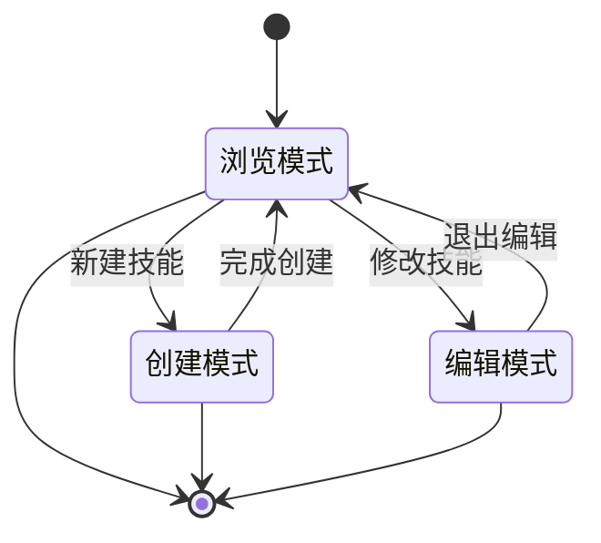
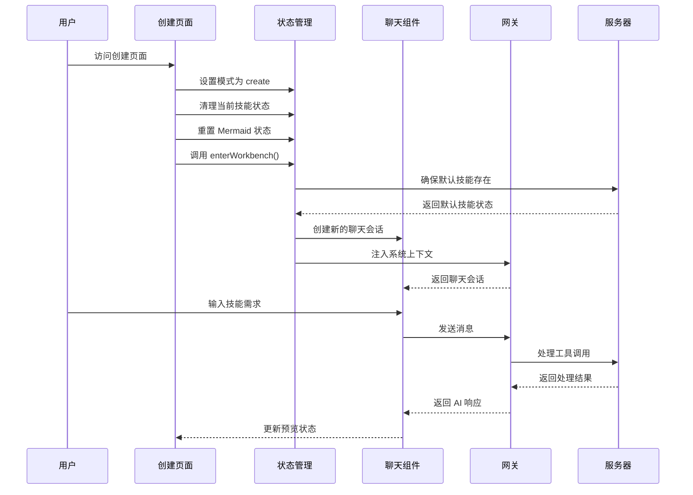
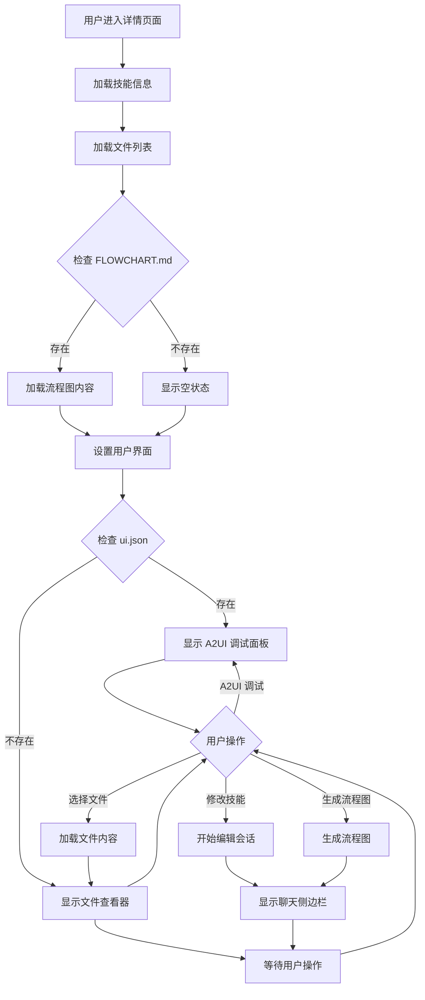
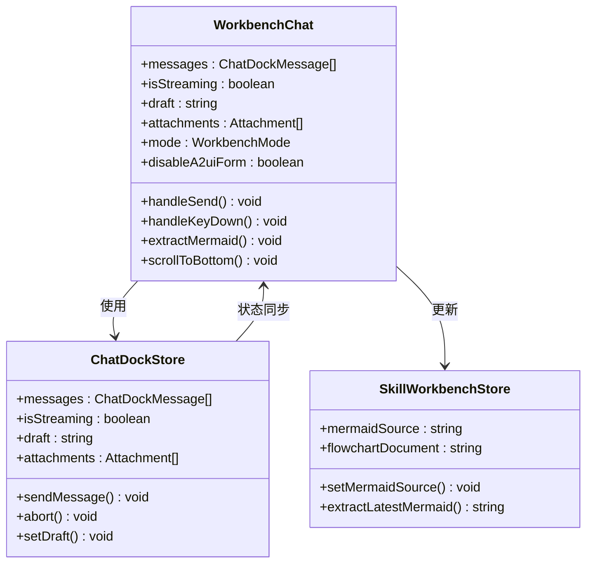
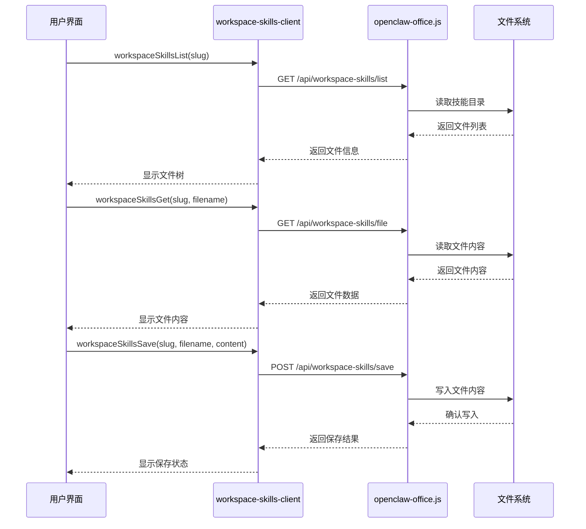
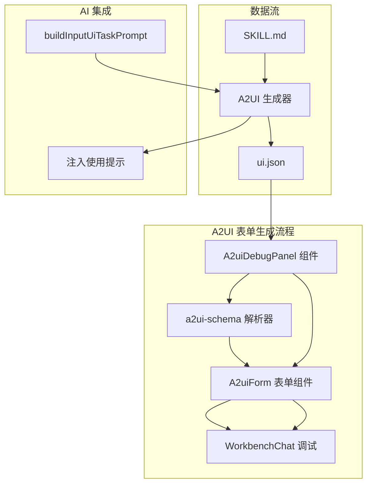
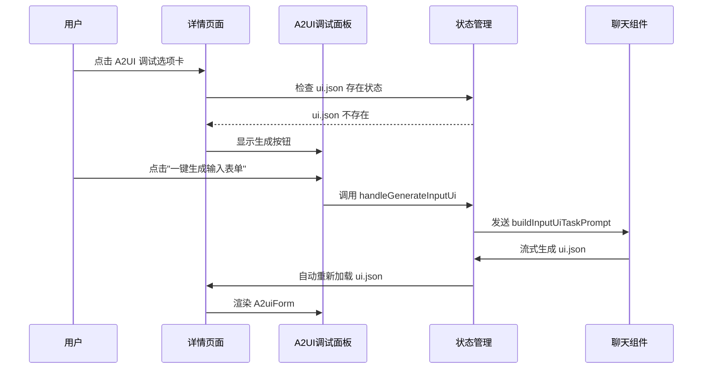
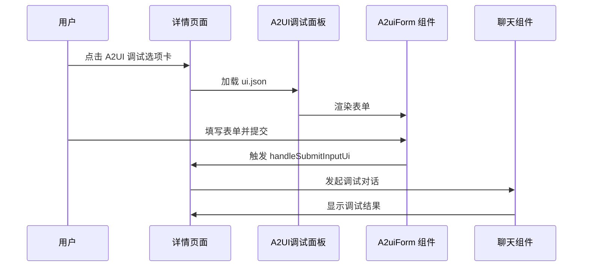
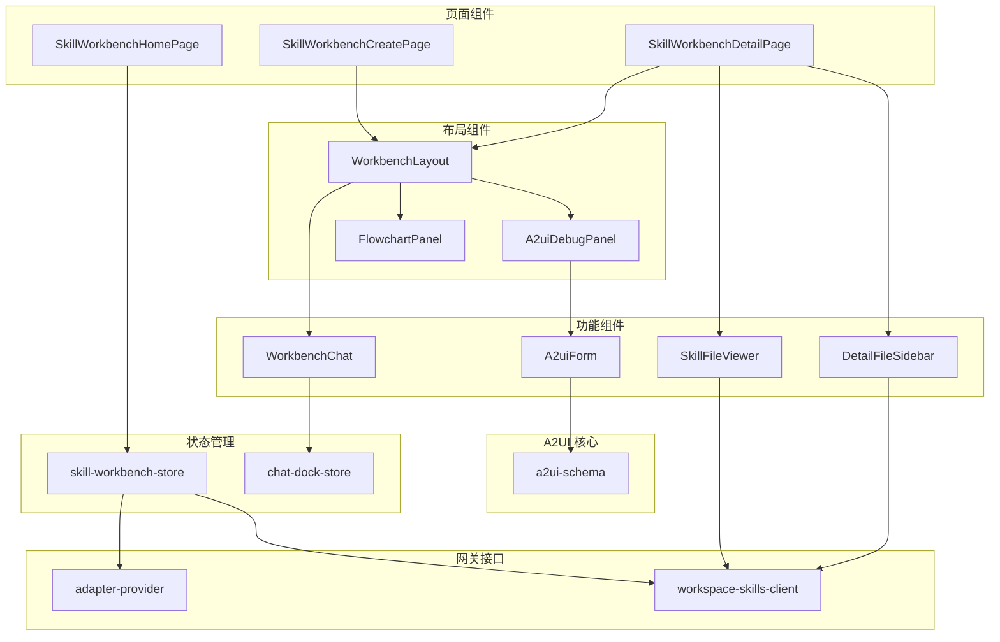

# 技能工作台使用指南

<cite>
**本文档引用的文件**
- [SKILL-WORKBENCH.md](file://SKILL-WORKBENCH.md)
- [skill-workbench-store.ts](file://src/store/console-stores/skill-workbench-store.ts)
- [SkillWorkbenchHomePage.tsx](file://src/components/pages/SkillWorkbenchHomePage.tsx)
- [SkillWorkbenchCreatePage.tsx](file://src/components/pages/SkillWorkbenchCreatePage.tsx)
- [SkillWorkbenchDetailPage.tsx](file://src/components/pages/SkillWorkbenchDetailPage.tsx)
- [workspace-skills-client.ts](file://src/gateway/workspace-skills-client.ts)
- [openclaw-office.js](file://bin/openclaw-office.js)
- [WorkbenchLayout.tsx](file://src/components/console/skills/WorkbenchLayout.tsx)
- [WorkbenchChat.tsx](file://src/components/console/skills/WorkbenchChat.tsx)
- [FlowchartPanel.tsx](file://src/components/console/skills/FlowchartPanel.tsx)
- [SkillFileViewer.tsx](file://src/components/console/skills/SkillFileViewer.tsx)
- [DetailFileSidebar.tsx](file://src/components/console/skills/DetailFileSidebar.tsx)
- [A2uiDebugPanel.tsx](file://src/components/console/skills/A2uiDebugPanel.tsx)
- [A2uiForm.tsx](file://src/components/chat/A2uiForm.tsx)
- [a2ui-schema.ts](file://src/lib/a2ui-schema.ts)
- [console.json](file://src/i18n/locales/zh/console.json)
- [chat.json](file://src/i18n/locales/zh/chat.json)
- [MarkdownContent.tsx](file://src/components/chat/MarkdownContent.tsx)
- [a2ui-schema.test.ts](file://src/lib/a2ui-schema.test.ts)
- [A2uiForm.test.tsx](file://src/components/chat/A2uiForm.test.tsx)
</cite>

## 更新摘要
**变更内容**
- 新增 A2UI 表单调试功能章节，详细介绍 A2UI 调试选项卡的使用方法
- 更新详情页面组件分析，增加 A2UI 调试面板的详细说明
- 新增 A2UI 表单架构设计，解释表单生成和预览机制
- 更新故障排除指南，增加 A2UI 相关的问题解决方案
- 新增 A2UI 表单类型支持和验证机制说明

## 目录
1. [简介](#简介)
2. [项目结构](#项目结构)
3. [核心组件](#核心组件)
4. [架构概览](#架构概览)
5. [详细组件分析](#详细组件分析)
6. [A2UI 表单调试功能](#a2ui-表单调试功能)
7. [依赖关系分析](#依赖关系分析)
8. [性能考虑](#性能考虑)
9. [故障排除指南](#故障排除指南)
10. [结论](#结论)

## 简介

技能工作台（Skill Workbench）是 OpenClaw Office 控制台中的一个可视化开发平台，专门用于开发和管理 OpenClaw Skills。这个平台将传统的 Markdown 文本工作流升级为一个"聊天驱动 + 可视预览 + 一键生成流程图"的现代化开发环境。

### 主要特性

- **聊天驱动开发**：通过与 OpenClaw Gateway 的 AI 集成，实现自然语言驱动的技能开发
- **可视化预览**：实时预览技能文件和流程图
- **一键生成流程图**：基于 Mermaid 语法自动生成流程图
- **即时落盘**：所有更改立即保存到本地文件系统
- **默认技能支持**：内置两个默认技能确保开发体验
- **A2UI 表单调试**：新增 A2UI 表单生成和预览功能，支持 ui.json 生成和表单调试

## 项目结构

技能工作台采用嵌套路由的三页面结构，提供完整的技能开发生命周期管理：

```mermaid
graph TB
subgraph "技能工作台路由结构"
Home[技能工作台首页<br/>"/skill-workbench"]
Create[创建向导页<br/>"/skill-workbench/create"]
Detail[详情页<br/>"/skill-workbench/:slug"]
end
subgraph "页面组件"
HomePage[SkillWorkbenchHomePage]
CreatePage[SkillWorkbenchCreatePage]
DetailPage[SkillWorkbenchDetailPage]
end
subgraph "核心功能模块"
Store[skill-workbench-store]
Layout[WorkbenchLayout]
Chat[WorkbenchChat]
Flowchart[FlowchartPanel]
FileViewer[SkillFileViewer]
Sidebar[DetailFileSidebar]
A2uiDebug[A2uiDebugPanel]
end
Home --> HomePage
Create --> CreatePage
Detail --> DetailPage
HomePage --> Store
CreatePage --> Layout
DetailPage --> Layout
Layout --> Chat
Layout --> Flowchart
Layout --> A2uiDebug
DetailPage --> FileViewer
DetailPage --> Sidebar
```

**图表来源**
- [SkillWorkbenchHomePage.tsx:1-19](file://src/components/pages/SkillWorkbenchHomePage.tsx#L1-L19)
- [SkillWorkbenchCreatePage.tsx:1-59](file://src/components/pages/SkillWorkbenchCreatePage.tsx#L1-L59)
- [SkillWorkbenchDetailPage.tsx:1-327](file://src/components/pages/SkillWorkbenchDetailPage.tsx#L1-L327)

**章节来源**
- [SKILL-WORKBENCH.md:21-32](file://SKILL-WORKBENCH.md#L21-L32)
- [SkillWorkbenchHomePage.tsx:5-18](file://src/components/pages/SkillWorkbenchHomePage.tsx#L5-L18)

## 核心组件

技能工作台的核心组件围绕三个主要模式构建：创建模式（create）、浏览模式（browse）和编辑模式（edit）。这些模式决定了用户与系统的交互方式和数据流向。

### 工作台模式



### 状态管理

技能工作台的状态管理通过 zustand 库实现，提供了以下核心状态：

- **模式状态**：当前的工作台模式（create/browse/edit）
- **技能信息**：当前操作的技能标识符和名称
- **文件系统**：技能文件树和当前选中文件
- **聊天会话**：与 AI 的交互状态和消息流
- **流程图预览**：Mermaid 代码和渲染状态
- **A2UI 表单状态**：ui.json 内容和表单生成状态

**章节来源**
- [skill-workbench-store.ts:6-26](file://src/store/console-stores/skill-workbench-store.ts#L6-L26)
- [skill-workbench-store.ts:116-153](file://src/store/console-stores/skill-workbench-store.ts#L116-L153)

## 架构概览

技能工作台采用前后端分离的架构设计，前端负责用户界面和交互，后端通过嵌入式 Node 服务器提供文件系统访问。

```mermaid
graph TB
subgraph "前端层"
UI[用户界面]
Chat[聊天组件]
Preview[预览组件]
FileTree[文件树]
A2uiForm[A2UI表单]
end
subgraph "应用层"
Store[状态管理]
Router[路由管理]
API[API 客户端]
A2uiSchema[A2UI模式解析]
end
subgraph "网关层"
Gateway[OpenClaw Gateway]
Adapter[适配器]
end
subgraph "服务层"
Server[嵌入式 Node 服务器]
FileSystem[文件系统]
DefaultSkills[默认技能]
A2uiGenerator[A2UI生成器]
</end>
UI --> Store
Chat --> API
Preview --> Store
FileTree --> API
A2uiForm --> A2uiSchema
Store --> Router
API --> Gateway
API --> Server
A2uiSchema --> A2uiGenerator
Gateway --> Adapter
Adapter --> FileSystem
Server --> DefaultSkills
Server --> FileSystem
A2uiGenerator --> FileSystem
```

**图表来源**
- [openclaw-office.js:152-165](file://bin/openclaw-office.js#L152-L165)
- [workspace-skills-client.ts:1-97](file://src/gateway/workspace-skills-client.ts#L1-L97)
- [skill-workbench-store.ts:191-286](file://src/store/console-stores/skill-workbench-store.ts#L191-L286)

## 详细组件分析

### 创建页面组件

创建页面是技能工作台的第一个入口，专门为新技能创建而设计。该页面提供了一个完整的聊天驱动开发环境。



**图表来源**
- [SkillWorkbenchCreatePage.tsx:19-28](file://src/components/pages/SkillWorkbenchCreatePage.tsx#L19-L28)
- [skill-workbench-store.ts:191-235](file://src/store/console-stores/skill-workbench-store.ts#L191-L235)

### 详情页面组件

详情页面提供技能的完整管理功能，包括文件浏览、编辑和流程图预览。**更新** 新增 A2UI 调试选项卡功能。



**图表来源**
- [SkillWorkbenchDetailPage.tsx:56-124](file://src/components/pages/SkillWorkbenchDetailPage.tsx#L56-L124)
- [DetailFileSidebar.tsx:115-161](file://src/components/console/skills/DetailFileSidebar.tsx#L115-L161)

### 聊天组件

聊天组件是技能工作台的核心交互组件，支持多种输入方式和实时预览功能。



**图表来源**
- [WorkbenchChat.tsx:24-32](file://src/components/console/skills/WorkbenchChat.tsx#L24-L32)
- [skill-workbench-store.ts:288-309](file://src/store/console-stores/skill-workbench-store.ts#L288-L309)

**章节来源**
- [WorkbenchChat.tsx:34-266](file://src/components/console/skills/WorkbenchChat.tsx#L34-L266)
- [SkillWorkbenchDetailPage.tsx:192-223](file://src/components/pages/SkillWorkbenchDetailPage.tsx#L192-L223)

### 文件管理系统

文件管理系统负责技能相关文件的读取、写入和版本控制。



**图表来源**
- [workspace-skills-client.ts:22-64](file://src/gateway/workspace-skills-client.ts#L22-L64)
- [openclaw-office.js:163-165](file://bin/openclaw-office.js#L163-L165)

**章节来源**
- [workspace-skills-client.ts:1-97](file://src/gateway/workspace-skills-client.ts#L1-L97)
- [SkillFileViewer.tsx:314-340](file://src/components/console/skills/SkillFileViewer.tsx#L314-L340)

## A2UI 表单调试功能

### A2UI 调试选项卡概述

在技能工作台详情页左侧的文件树中，新增了 **"A2UI 调试"** 选项卡。该功能允许开发者直接在工作台中生成和调试 A2UI 输入表单，无需离开当前开发环境。

### 功能特性

1. **智能表单生成**：基于 SKILL.md 内容自动生成 ui.json
2. **实时预览**：将 ui.json 渲染为可交互的 A2uiForm
3. **一键生成**：支持重新生成和重新加载 ui.json
4. **调试集成**：表单提交后自动发起调试对话

### A2UI 表单架构设计



**图表来源**
- [A2uiDebugPanel.tsx:30-45](file://src/components/console/skills/A2uiDebugPanel.tsx#L30-L45)
- [a2ui-schema.ts:169-199](file://src/lib/a2ui-schema.ts#L169-L199)

### 使用流程

#### 无 ui.json 时的操作流程



#### 有 ui.json 时的操作流程



**图表来源**
- [SkillWorkbenchDetailPage.tsx:295-320](file://src/components/pages/SkillWorkbenchDetailPage.tsx#L295-L320)
- [SkillWorkbenchDetailPage.tsx:409-417](file://src/components/pages/SkillWorkbenchDetailPage.tsx#L409-L417)

### A2UI 表单类型支持

A2UI 表单支持以下字段类型：

| 字段类型 | 描述 | 示例 |
|---------|------|------|
| text | 单行文本输入 | 姓名、邮箱 |
| textarea | 多行文本输入 | 详细描述、备注 |
| number | 数字输入 | 年龄、数量 |
| select | 下拉选择 | 性别、地区 |
| radio | 单选按钮 | 是否同意 |
| checkbox | 复选框 | 接受条款 |
| multiselect | 多选 | 兴趣爱好 |
| file | 文件上传 | 附件、图片 |

### 表单验证和提交

A2UI 表单具有完整的验证机制：

1. **必填字段验证**：自动检测并标记必填字段
2. **文件类型验证**：根据 accept 属性限制文件类型
3. **多文件处理**：支持单文件和多文件上传
4. **结构化提交**：提交时生成结构化消息和机器可读载荷

**章节来源**
- [A2uiDebugPanel.tsx:1-106](file://src/components/console/skills/A2uiDebugPanel.tsx#L1-L106)
- [A2uiForm.tsx:298-393](file://src/components/chat/A2uiForm.tsx#L298-L393)
- [a2ui-schema.ts:169-321](file://src/lib/a2ui-schema.ts#L169-L321)

## 依赖关系分析

技能工作台的依赖关系主要体现在以下几个方面：

### 组件依赖关系



**图表来源**
- [SkillWorkbenchHomePage.tsx:1-19](file://src/components/pages/SkillWorkbenchHomePage.tsx#L1-L19)
- [SkillWorkbenchCreatePage.tsx:5-8](file://src/components/pages/SkillWorkbenchCreatePage.tsx#L5-L8)
- [SkillWorkbenchDetailPage.tsx:12-15](file://src/components/pages/SkillWorkbenchDetailPage.tsx#L12-L15)

### 数据流依赖

技能工作台的数据流遵循单向数据流原则，确保状态的一致性和可预测性：

1. **用户交互** → **组件状态** → **全局状态** → **外部系统**
2. **外部系统** → **全局状态** → **组件状态** → **用户界面**
3. **A2UI 特殊流** → **AI 生成** → **ui.json 写入** → **表单预览**

这种设计确保了：
- 状态变更的可追踪性
- 组件间的松耦合
- 数据流的清晰性
- A2UI 表单生成的完整性

**章节来源**
- [skill-workbench-store.ts:155-286](file://src/store/console-stores/skill-workbench-store.ts#L155-L286)
- [WorkbenchChat.tsx:88-98](file://src/components/console/skills/WorkbenchChat.tsx#L88-L98)

## 性能考虑

技能工作台在设计时充分考虑了性能优化，特别是在大文件处理和实时预览方面：

### 文件加载优化

- **懒加载策略**：文件内容仅在用户选择时加载
- **缓存机制**：最近访问的文件内容进行内存缓存
- **增量更新**：文件树和内容的更新采用增量方式
- **A2UI 表单缓存**：ui.json 内容在调试过程中进行缓存

### 渲染优化

- **虚拟滚动**：文件树使用虚拟滚动技术处理大量文件
- **组件记忆化**：关键组件使用 React.memo 避免不必要的重渲染
- **条件渲染**：根据用户操作动态渲染不同内容
- **表单组件优化**：A2uiForm 使用 useMemo 优化渲染性能

### 网络优化

- **批量请求**：多个文件操作合并为批量请求
- **连接复用**：聊天会话和文件操作共享底层连接
- **错误重试**：网络请求具备自动重试机制
- **A2UI 生成优化**：AI 生成过程采用流式传输减少等待时间

## 故障排除指南

### 常见问题及解决方案

#### 流程图生成问题

**问题**：流程图生成一直显示"生成中..."状态

**原因分析**：
- Gateway 连接状态异常
- Agent 模型 Provider 不可用
- AI 未正确执行 write 工具

**解决步骤**：
1. 检查顶部连接状态是否为 "Connected"
2. 确认所选 Agent 具有可用的模型 Provider
3. 查看 FLOWCHART.md 是否已写入磁盘
4. 如需强制生成，再次点击"一键生成"按钮

#### A2UI 表单调试问题

**问题**：A2UI 调试选项卡无法正常工作

**原因分析**：
- ui.json 文件损坏或格式不正确
- AI 生成过程失败
- 文件权限问题
- 网络连接异常

**解决步骤**：
1. 检查 ui.json 文件是否存在且格式正确
2. 点击"重新生成"按钮重新生成表单
3. 确认 AI 生成过程已完成（查看生成状态）
4. 检查文件权限是否正确
5. 重启应用后重试

#### 默认技能安装失败

**问题**：自动安装默认技能失败

**解决方法**：
1. 查看浏览器控制台警告信息
2. 手动从 `bin/skills/skill-workbench-mermaid-guard/` 拷贝到用户工作区
3. 确认文件权限正确
4. 重启应用后重试

#### 文件同步问题

**问题**：文件内容与磁盘不一致

**解决方法**：
1. 等待聊天流结束后自动刷新
2. 切换选中的文件或重新进入页面
3. 手动刷新页面强制重新加载

**章节来源**
- [SKILL-WORKBENCH.md:139-152](file://SKILL-WORKBENCH.md#L139-L152)

## 结论

技能工作台提供了一个完整、直观且高效的技能开发环境。通过聊天驱动的方式，开发者可以更自然地表达需求，AI 会自动处理文件的创建、修改和组织。

### 主要优势

1. **用户体验友好**：自然语言交互，降低学习成本
2. **开发效率高**：自动化文件管理和流程图生成
3. **扩展性强**：支持自定义技能和工具
4. **稳定性好**：完善的错误处理和恢复机制
5. **A2UI 表单调试**：新增的表单生成和调试功能，提升用户体验

### 未来发展方向

- 增强 AI 辅助功能，提供更多智能建议
- 支持更多文件格式和模板
- 集成版本控制和团队协作功能
- 提供更丰富的调试和测试工具
- 扩展 A2UI 表单类型和验证规则

技能工作台代表了现代技能开发工具的发展方向，将传统开发模式与人工智能技术完美结合，为开发者提供了前所未有的便利和效率。新增的 A2UI 表单调试功能进一步提升了开发体验，使技能开发变得更加直观和高效。