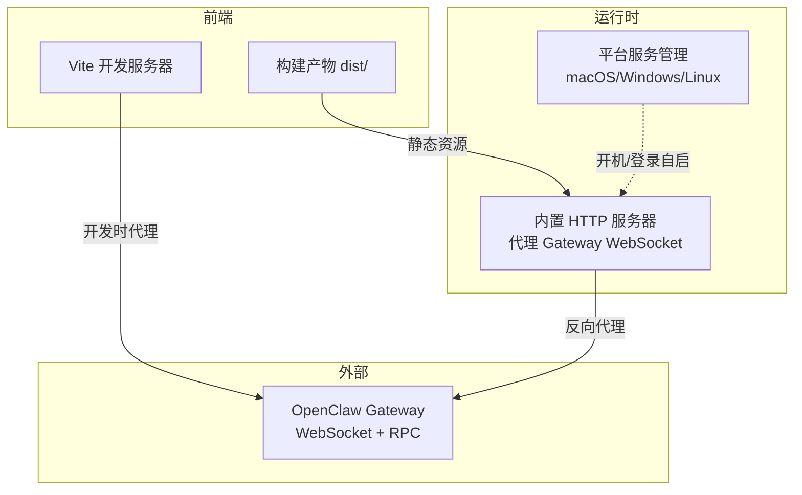
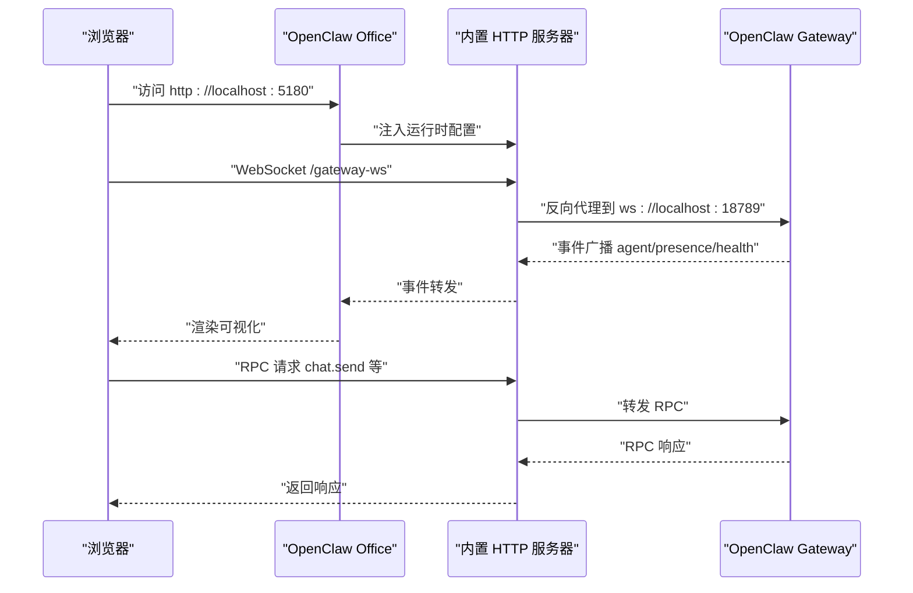
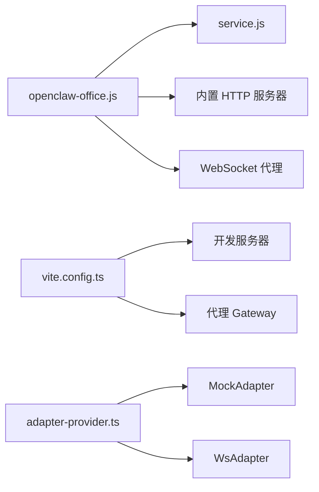

# 快速开始

<cite>
**本文引用的文件**
- [README.md](file://README.md)
- [package.json](file://package.json)
- [bin/openclaw-office.js](file://bin/openclaw-office.js)
- [bin/service.js](file://bin/service.js)
- [scripts/wsl-bootstrap-openclaw-office.sh](file://scripts/wsl-bootstrap-openclaw-office.sh)
- [scripts/start-openclaw-office.ps1](file://scripts/start-openclaw-office.ps1)
- [GATEWAY-SETUP.md](file://GATEWAY-SETUP.md)
- [vite.config.ts](file://vite.config.ts)
- [vite-env.d.ts](file://vite-env.d.ts)
- [src/gateway/adapter-provider.ts](file://src/gateway/adapter-provider.ts)
- [src/gateway/mock-adapter.ts](file://src/gateway/mock-adapter.ts)
</cite>

## 目录
1. [简介](#简介)
2. [项目结构](#项目结构)
3. [核心组件](#核心组件)
4. [架构总览](#架构总览)
5. [详细组件分析](#详细组件分析)
6. [依赖关系分析](#依赖关系分析)
7. [性能考虑](#性能考虑)
8. [故障排除指南](#故障排除指南)
9. [结论](#结论)
10. [附录](#附录)

## 简介
OpenClaw Office 是 OpenClaw 多智能体系统的可视化监控与管理前端。它通过等距投影的虚拟办公室场景，实时展示 Agent 的工作状态、协作链路、工具调用与资源消耗，并提供完整的控制台管理界面与 Chat 对话工作区。本文面向不同技术水平的用户，提供从零到一的快速入门路径，涵盖系统前提、多种启动方式、Gateway Token 自动检测与手动配置、CLI 参数、Windows WSL2 一键启动、环境变量与 Mock 模式的使用说明。

## 项目结构
- 前端构建与运行：Vite 6 + React 19 + Tailwind CSS 4
- 运行时服务：内置 Node.js HTTP/WebSocket 服务器，代理 Gateway WebSocket
- 平台服务：支持 macOS（launchd）与 Linux（systemd --user）系统服务安装
- 开发与部署：支持 npx 直接运行、全局安装、源码安装开发、WSL2 一键启动

图表来源
- [bin/openclaw-office.js:151-763](file://bin/openclaw-office.js#L151-L763)
- [vite.config.ts:342-382](file://vite.config.ts#L342-L382)
- [bin/service.js:1-213](file://bin/service.js#L1-L213)

章节来源
- [README.md:79-125](file://README.md#L79-L125)
- [package.json:1-83](file://package.json#L1-L83)

## 核心组件
- 内置 HTTP 服务器与 WebSocket 代理：负责静态资源服务、注入运行时配置、反向代理 Gateway WebSocket
- 平台服务管理：跨平台安装/卸载/启动/停止/状态查询/日志查看
- 开发服务器与代理：Vite 服务器代理 Gateway WebSocket，支持热重载
- Mock 模式适配器：在无真实 Gateway 时提供模拟数据与事件流

章节来源
- [bin/openclaw-office.js:151-763](file://bin/openclaw-office.js#L151-L763)
- [bin/service.js:1-213](file://bin/service.js#L1-L213)
- [vite.config.ts:342-382](file://vite.config.ts#L342-L382)
- [src/gateway/adapter-provider.ts:50-90](file://src/gateway/adapter-provider.ts#L50-L90)

## 架构总览
OpenClaw Office 通过 WebSocket 连接 OpenClaw Gateway，数据流如下：
- Gateway 广播实时事件（agent、presence、health、heartbeat）
- 前端将事件映射为可视化状态（idle/working/speaking/tool_calling/error）
- 前端通过 RPC（agents.list、chat.send 等）与 Gateway 交互

图表来源
- [README.md:276-282](file://README.md#L276-L282)
- [bin/openclaw-office.js:217-303](file://bin/openclaw-office.js#L217-L303)
- [vite.config.ts:354-379](file://vite.config.ts#L354-L379)

## 详细组件分析

### 启动方式与路径
- npx 直接运行（一次性使用）
  - 无需克隆仓库，直接运行预构建版本
  - 适合快速体验与演示
- 全局安装运行
  - 安装后通过 openclaw-office 命令启动
  - 适合日常使用与系统服务集成
- 从源码安装开发
  - pnpm install 安装依赖
  - pnpm dev 启动开发服务器（端口 5180）
  - 适合二次开发与调试

章节来源
- [README.md:89-125](file://README.md#L89-L125)
- [README.md:196-236](file://README.md#L196-L236)

### Gateway Token 自动检测与手动配置
- 自动检测顺序
  1) 命令行参数 --token
  2) 环境变量 OPENCLAW_GATEWAY_TOKEN
  3) 本地配置文件 ~/.openclaw/openclaw.json 或 ~/.clawdbot/clawdbot.json
- 手动配置
  - 通过命令行参数传入
  - 通过环境变量 OPENCLAW_GATEWAY_TOKEN 设置
  - 通过 OpenClaw CLI 获取 token 并写入配置文件

章节来源
- [bin/openclaw-office.js:100-149](file://bin/openclaw-office.js#L100-L149)
- [GATEWAY-SETUP.md:18-51](file://GATEWAY-SETUP.md#L18-L51)

### CLI 参数与服务管理
- CLI 参数
  - -t, --token <token>：Gateway 认证 token
  - -g, --gateway <url>：Gateway WebSocket 地址（默认 ws://localhost:18789）
  - -p, --port <port>：服务端口（默认 5180，可由 PORT 环境变量覆盖）
  - --host <host>：绑定地址（默认 0.0.0.0）
  - -h, --help：显示帮助
- 服务管理
  - openclaw-office service install/uninstall/start/stop/restart/status/log
  - 支持 macOS（launchd）与 Linux（systemd --user）

章节来源
- [bin/openclaw-office.js:41-98](file://bin/openclaw-office.js#L41-L98)
- [bin/service.js:68-199](file://bin/service.js#L68-L199)

### Windows WSL2 一键启动方案
- 双击 start-openclaw-office.cmd 或 PowerShell 调用 start-openclaw-office.ps1
- 自动检测 WSL 发行版（跳过 docker-desktop）
- 自动安装 Node.js 22+ 与 OpenClaw（如未安装）
- 初始化配置、启动 Gateway 服务（WSL 中以 systemd 方式运行）
- 在 Windows 本机启动 Office Server（Node.js），自动打开浏览器
- 支持自定义参数：WSL 发行版、OpenClaw 版本、Office 端口、Gateway 端口

章节来源
- [README.md:160-193](file://README.md#L160-L193)
- [scripts/start-openclaw-office.ps1:1-281](file://scripts/start-openclaw-office.ps1#L1-L281)
- [scripts/wsl-bootstrap-openclaw-office.sh:1-321](file://scripts/wsl-bootstrap-openclaw-office.sh#L1-L321)

### 环境变量与 Mock 模式
- 环境变量
  - VITE_GATEWAY_URL：Gateway WebSocket 地址（默认 ws://localhost:18789）
  - VITE_GATEWAY_WS_PATH：浏览器侧反向代理 WS 路径（默认 /gateway-ws）
  - VITE_GATEWAY_TOKEN：Gateway 认证 token（连接真实 Gateway 时必须）
  - VITE_MOCK：启用 Mock 模式（无需 Gateway，开发时可用）
- Mock 模式
  - 通过 VITE_MOCK=true pnpm dev 启用
  - 使用 MockAdapter 提供模拟 Agent 数据与事件流
  - 适合无 Gateway 的开发与 UI 调试

章节来源
- [README.md:237-255](file://README.md#L237-L255)
- [vite-env.d.ts:3-10](file://vite-env.d.ts#L3-L10)
- [vite.config.ts:10-16](file://vite.config.ts#L10-L16)
- [src/gateway/adapter-provider.ts:50-90](file://src/gateway/adapter-provider.ts#L50-L90)
- [src/gateway/mock-adapter.ts:564-800](file://src/gateway/mock-adapter.ts#L564-L800)

### 内置 HTTP 服务器与 WebSocket 代理
- 静态资源服务：dist/ 下的 index.html 与静态文件
- 注入运行时配置：将 gatewayUrl、gatewayToken 等注入到 window.__OPENCLAW_CONFIG__
- WebSocket 代理：将 /gateway-ws 与 /api/gateway/ws 反向代理到 Gateway
- 聊天缓存 API：提供会话消息的增删改查接口
- 工作空间技能 API：列出与读取工作空间技能文件

章节来源
- [bin/openclaw-office.js:151-763](file://bin/openclaw-office.js#L151-L763)

### 开发服务器与代理配置
- Vite 服务器默认端口 5180
- 代理 Gateway WebSocket 到 /gateway-ws 与 /api/gateway/ws
- 开发时通过 OPENCLAW_GATEWAY_URL/VITE_GATEWAY_URL 指定 Gateway 地址
- 支持跨域与错误处理

章节来源
- [vite.config.ts:342-382](file://vite.config.ts#L342-L382)

## 依赖关系分析

图表来源
- [bin/openclaw-office.js:14-20](file://bin/openclaw-office.js#L14-L20)
- [bin/service.js:1-213](file://bin/service.js#L1-L213)
- [vite.config.ts:342-382](file://vite.config.ts#L342-L382)
- [src/gateway/adapter-provider.ts:50-103](file://src/gateway/adapter-provider.ts#L50-L103)

章节来源
- [package.json:25-48](file://package.json#L25-L48)
- [README.md:63-76](file://README.md#L63-L76)

## 性能考虑
- 会话同步策略：sessions.list 低频 reconciliation（约每 60 秒），减少 Gateway CPU 压力
- WebSocket 事件驱动：默认由 agent 事件直接驱动实时状态与动画
- 文件缓存：聊天消息按天分片存储，避免频繁全量扫描

章节来源
- [README.md:286-291](file://README.md#L286-L291)

## 故障排除指南
- 连接状态一直显示「连接中...」
  - 确认 Gateway 是否在运行：openclaw status
  - 确认 token 是否有效：openclaw dashboard --no-open（应输出带 token 的 URL）
  - 检查 WebSocket 端口（默认 18789）是否可达
- 缺少 scope 权限（如 missing scope: operator.read）
  - 若使用 dangerouslyDisableDeviceAuth，需同时启用 allowInsecureAuth
  - 重启 Gateway 后重试
- Windows WSL2 启动失败
  - 确保已安装 WSL，且发行版非 docker-desktop
  - 检查日志：.runtime/openclaw-office-windows.log 与 .runtime/openclaw-gateway.log
  - 确认端口占用与防火墙设置

章节来源
- [GATEWAY-SETUP.md:105-132](file://GATEWAY-SETUP.md#L105-L132)
- [scripts/start-openclaw-office.ps1:216-281](file://scripts/start-openclaw-office.ps1#L216-L281)

## 结论
通过本文档，您可以根据自身需求选择合适的启动方式：快速体验可使用 npx；日常使用可全局安装并注册系统服务；开发调试可从源码安装并启用 Mock 模式。结合 Gateway Token 自动检测与手动配置，配合 Windows WSL2 一键启动脚本，能够在不同平台上快速搭建并稳定运行 OpenClaw Office。

## 附录

### 环境变量与 CLI 参数对照表
- 环境变量
  - VITE_GATEWAY_URL：Gateway WebSocket 地址（默认 ws://localhost:18789）
  - VITE_GATEWAY_WS_PATH：浏览器侧反向代理 WS 路径（默认 /gateway-ws）
  - VITE_GATEWAY_TOKEN：Gateway 认证 token（连接真实 Gateway 时必须）
  - VITE_MOCK：启用 Mock 模式（无需 Gateway）
- CLI 参数
  - -t/--token <token>：Gateway 认证 token
  - -g/--gateway <url>：Gateway WebSocket 地址（默认 ws://localhost:18789）
  - -p/--port <port>：服务端口（默认 5180）
  - --host <host>：绑定地址（默认 0.0.0.0）
  - -h/--help：显示帮助

章节来源
- [README.md:237-255](file://README.md#L237-L255)
- [bin/openclaw-office.js:41-98](file://bin/openclaw-office.js#L41-L98)
- [vite-env.d.ts:3-10](file://vite-env.d.ts#L3-L10)