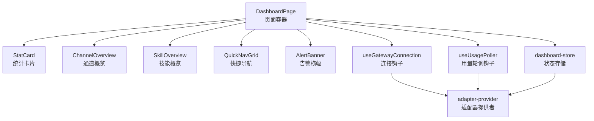
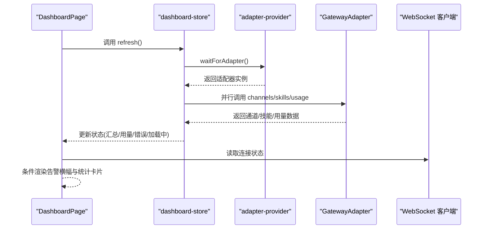
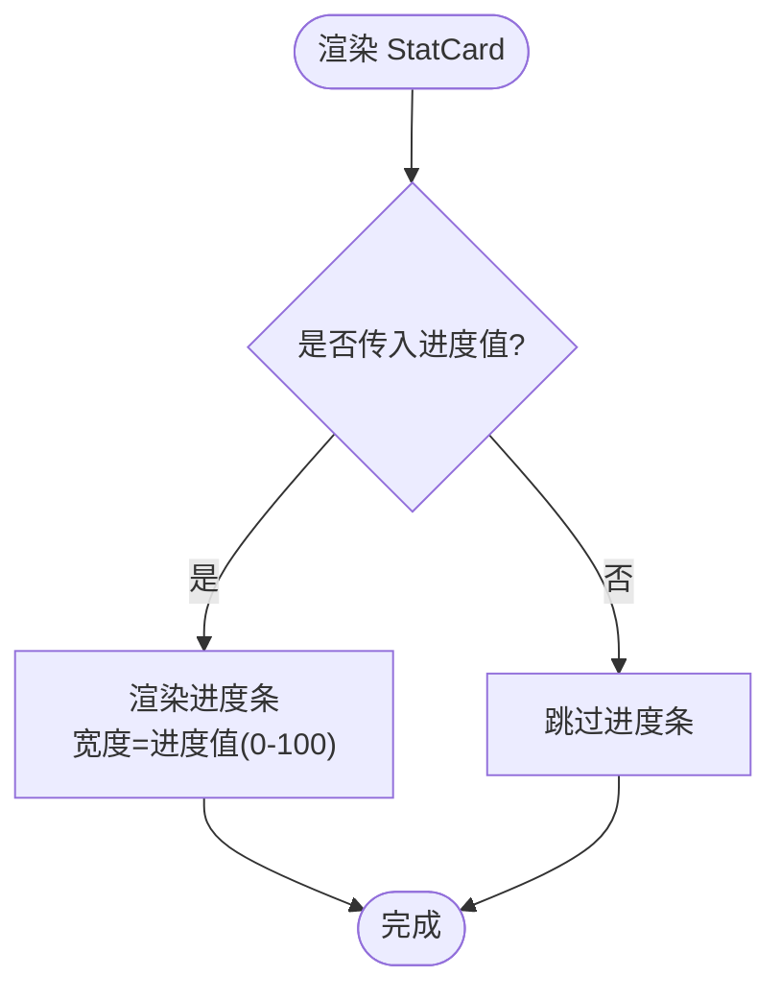
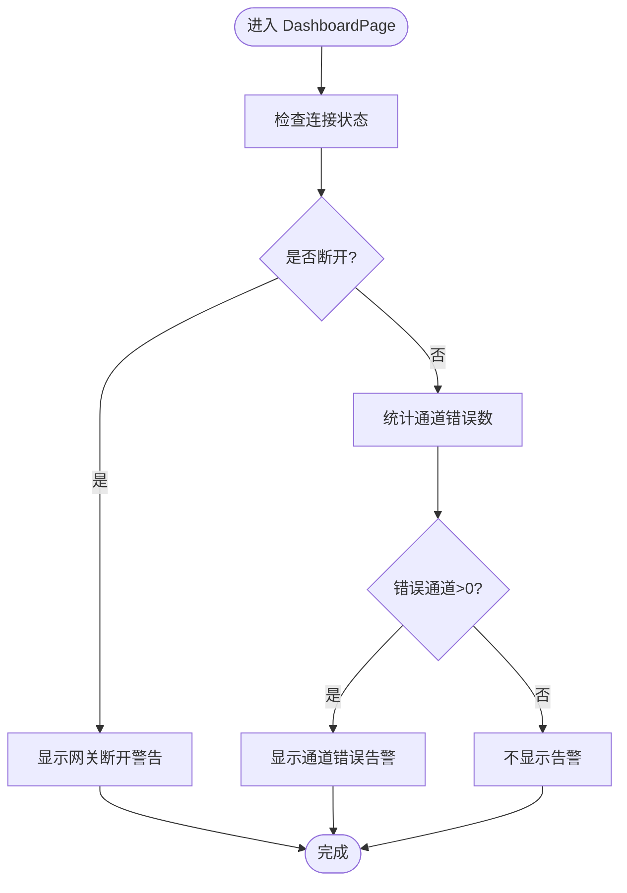
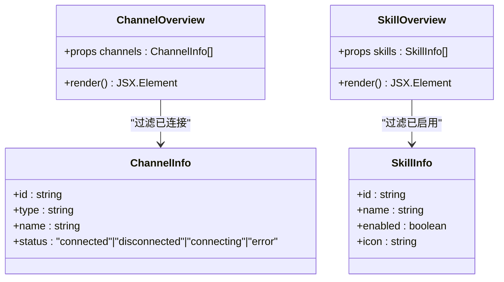
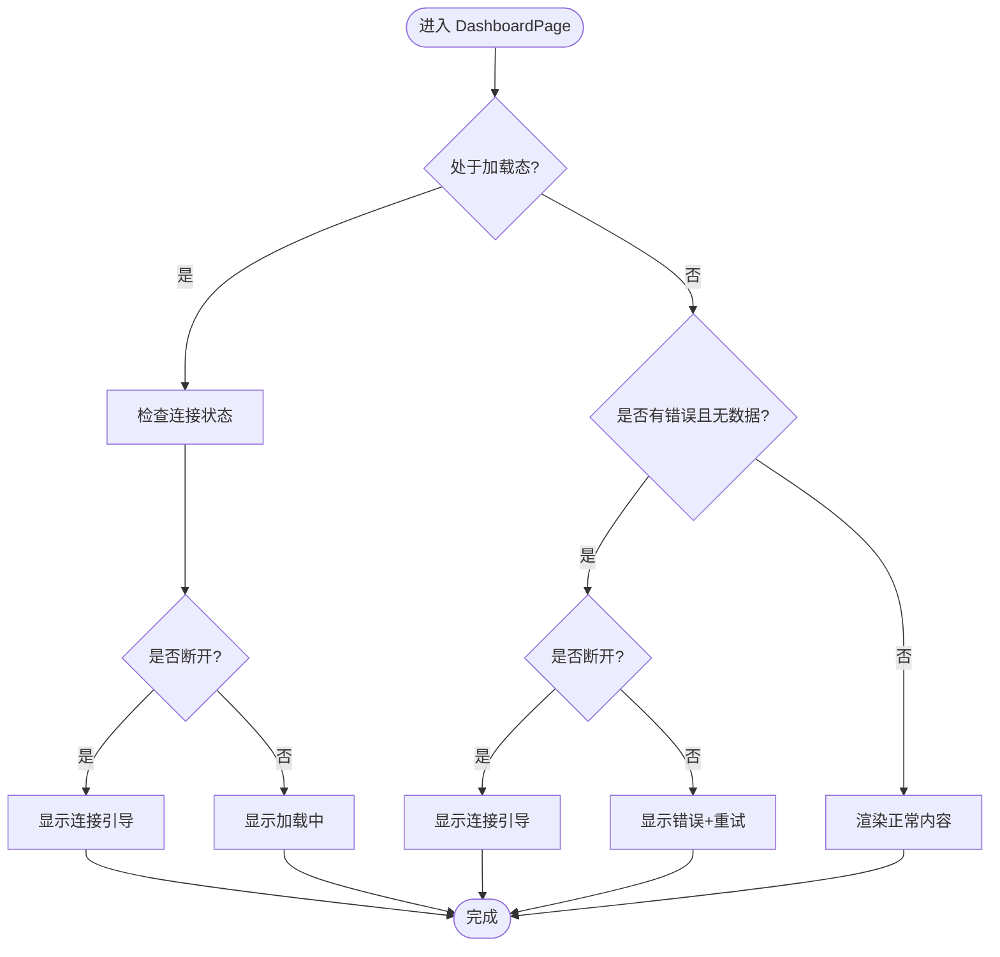
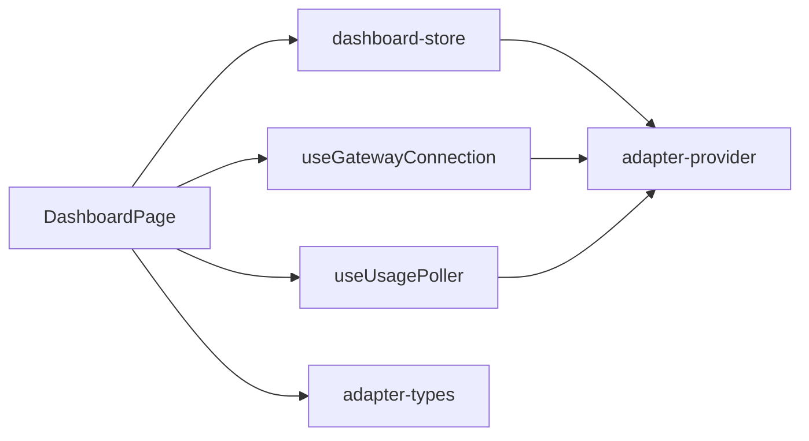

# 仪表板概览

<cite>
**本文引用的文件**
- [StatCard.tsx](file://src/components/console/dashboard/StatCard.tsx)
- [AlertBanner.tsx](file://src/components/console/dashboard/AlertBanner.tsx)
- [ChannelOverview.tsx](file://src/components/console/dashboard/ChannelOverview.tsx)
- [SkillOverview.tsx](file://src/components/console/dashboard/SkillOverview.tsx)
- [QuickNavGrid.tsx](file://src/components/console/dashboard/QuickNavGrid.tsx)
- [DashboardPage.tsx](file://src/components/pages/DashboardPage.tsx)
- [dashboard-store.ts](file://src/store/console-stores/dashboard-store.ts)
- [useGatewayConnection.ts](file://src/hooks/useGatewayConnection.ts)
- [useUsagePoller.ts](file://src/hooks/useUsagePoller.ts)
- [adapter-types.ts](file://src/gateway/adapter-types.ts)
- [adapter-provider.ts](file://src/gateway/adapter-provider.ts)
</cite>

## 目录
1. [简介](#简介)
2. [项目结构](#项目结构)
3. [核心组件](#核心组件)
4. [架构总览](#架构总览)
5. [详细组件分析](#详细组件分析)
6. [依赖关系分析](#依赖关系分析)
7. [性能考量](#性能考量)
8. [故障排查指南](#故障排查指南)
9. [结论](#结论)
10. [附录](#附录)

## 简介
本文件面向“仪表板概览”系统，聚焦以下能力：
- 统计卡片组件：通道连接状态统计、技能启用统计、使用量统计、运行时间统计的UI与数据展示逻辑
- 告警横幅系统：网关断开连接警告、通道错误警告的触发条件与显示逻辑
- Channel/Skill 概览模块：通道状态展示、技能启用状态展示的数据获取与渲染机制
- 快捷导航网格：快速访问各管理功能的导航设计
- 加载与错误状态处理：网关连接状态检查与重试机制
- 组件交互流程、数据流与状态管理实现

## 项目结构
仪表板概览位于控制台页面，由多个子组件与状态存储共同构成：
- 页面容器：DashboardPage 负责布局、状态拉取与告警展示
- 统计卡片：StatCard 提供通用统计卡片UI
- 概览模块：ChannelOverview、SkillOverview 展示通道与技能概览
- 快捷导航：QuickNavGrid 提供功能入口网格
- 告警横幅：AlertBanner 提供统一告警样式
- 状态存储：dashboard-store 管理仪表板数据与刷新
- 连接与轮询：useGatewayConnection、useUsagePoller 管理网关连接与用量轮询

图表来源
- [DashboardPage.tsx:14-129](file://src/components/pages/DashboardPage.tsx#L14-L129)
- [StatCard.tsx:12-38](file://src/components/console/dashboard/StatCard.tsx#L12-L38)
- [ChannelOverview.tsx:24-61](file://src/components/console/dashboard/ChannelOverview.tsx#L24-L61)
- [SkillOverview.tsx:9-45](file://src/components/console/dashboard/SkillOverview.tsx#L9-L45)
- [QuickNavGrid.tsx:32-58](file://src/components/console/dashboard/QuickNavGrid.tsx#L32-L58)
- [AlertBanner.tsx:17-37](file://src/components/console/dashboard/AlertBanner.tsx#L17-L37)
- [dashboard-store.ts:16-54](file://src/store/console-stores/dashboard-store.ts#L16-L54)
- [useGatewayConnection.ts:23-151](file://src/hooks/useGatewayConnection.ts#L23-L151)
- [useUsagePoller.ts:32-106](file://src/hooks/useUsagePoller.ts#L32-L106)
- [adapter-provider.ts:15-86](file://src/gateway/adapter-provider.ts#L15-L86)

章节来源
- [DashboardPage.tsx:14-129](file://src/components/pages/DashboardPage.tsx#L14-L129)
- [dashboard-store.ts:16-54](file://src/store/console-stores/dashboard-store.ts#L16-L54)

## 核心组件
- 统计卡片 StatCard：提供图标、标题、数值、副标题与进度条的统一展示，支持主题色配置
- 通道概览 ChannelOverview：按已连接通道分组展示，含通道类型图标与状态徽标
- 技能概览 SkillOverview：按已启用技能分组展示，含技能图标与名称
- 快捷导航 QuickNavGrid：四宫格导航，直达通道、技能、定时任务、设置
- 告警横幅 AlertBanner：统一警告/错误样式，支持可选操作按钮
- 页面容器 DashboardPage：聚合上述组件，负责加载/错误态、重试、告警触发与数据渲染

章节来源
- [StatCard.tsx:12-38](file://src/components/console/dashboard/StatCard.tsx#L12-L38)
- [ChannelOverview.tsx:24-61](file://src/components/console/dashboard/ChannelOverview.tsx#L24-L61)
- [SkillOverview.tsx:9-45](file://src/components/console/dashboard/SkillOverview.tsx#L9-L45)
- [QuickNavGrid.tsx:32-58](file://src/components/console/dashboard/QuickNavGrid.tsx#L32-L58)
- [AlertBanner.tsx:17-37](file://src/components/console/dashboard/AlertBanner.tsx#L17-L37)
- [DashboardPage.tsx:14-129](file://src/components/pages/DashboardPage.tsx#L14-L129)

## 架构总览
仪表板概览的数据流与交互如下：
- 页面挂载后触发刷新，从适配器批量获取通道、技能、用量信息
- 适配器初始化采用等待模式，确保在网关连接建立后再拉取数据
- 页面根据网关连接状态与通道错误数量动态显示告警横幅
- 用量数据用于“使用量统计”，运行时间统计基于网关连接状态
- 用户可点击刷新或重试，重新触发数据拉取与连接检查

图表来源
- [DashboardPage.tsx:19-21](file://src/components/pages/DashboardPage.tsx#L19-L21)
- [dashboard-store.ts:24-53](file://src/store/console-stores/dashboard-store.ts#L24-L53)
- [adapter-provider.ts:25-48](file://src/gateway/adapter-provider.ts#L25-L48)

## 详细组件分析

### 统计卡片 StatCard
- 设计要点
  - 图标区：支持自定义颜色主题
  - 标题区：小号字体，浅色文本
  - 数值区：大号粗体，深色文本
  - 副标题：可选，细小说明
  - 进度条：可选，范围约束在0-100%
- 数据绑定
  - 通道连接统计：数值为“已连接/总数”
  - 技能启用统计：数值为“已启用/总数”
  - 使用量统计：数值为“提供商显示名: 使用百分比”
  - 运行时间统计：根据网关连接状态显示在线或占位符
- 复杂度
  - 渲染为纯函数组件，O(n) 遍历概览列表生成项

图表来源
- [StatCard.tsx:28-35](file://src/components/console/dashboard/StatCard.tsx#L28-L35)

章节来源
- [StatCard.tsx:12-38](file://src/components/console/dashboard/StatCard.tsx#L12-L38)
- [DashboardPage.tsx:88-114](file://src/components/pages/DashboardPage.tsx#L88-L114)

### 告警横幅 AlertBanner
- 触发条件
  - 网关断开连接：当连接状态非“connected”时显示警告横幅
  - 通道错误：当通道中存在“error”状态时显示错误横幅
- 显示逻辑
  - 样式区分：warning/error 两类主题色
  - 可选操作按钮：支持回调动作
- 国际化
  - 文案来自控制台翻译键值

图表来源
- [DashboardPage.tsx:78-86](file://src/components/pages/DashboardPage.tsx#L78-L86)

章节来源
- [AlertBanner.tsx:17-37](file://src/components/console/dashboard/AlertBanner.tsx#L17-L37)
- [DashboardPage.tsx:78-86](file://src/components/pages/DashboardPage.tsx#L78-L86)

### Channel/Skill 概览模块
- 通道概览 ChannelOverview
  - 数据来源：通道列表（含状态、类型、名称等）
  - 渲染策略：仅展示“已连接”的通道，按类型映射图标，附加状态徽标
  - 空态：无已连接通道时提示空状态
- 技能概览 SkillOverview
  - 数据来源：技能列表（含启用状态、图标、名称等）
  - 渲染策略：仅展示“已启用”的技能，显示图标与名称
  - 空态：无已启用技能时提示空状态

图表来源
- [ChannelOverview.tsx:20-61](file://src/components/console/dashboard/ChannelOverview.tsx#L20-L61)
- [SkillOverview.tsx:5-45](file://src/components/console/dashboard/SkillOverview.tsx#L5-L45)
- [adapter-types.ts:19-33](file://src/gateway/adapter-types.ts#L19-L33)
- [adapter-types.ts:35-57](file://src/gateway/adapter-types.ts#L35-L57)

章节来源
- [ChannelOverview.tsx:24-61](file://src/components/console/dashboard/ChannelOverview.tsx#L24-L61)
- [SkillOverview.tsx:9-45](file://src/components/console/dashboard/SkillOverview.tsx#L9-L45)
- [adapter-types.ts:19-33](file://src/gateway/adapter-types.ts#L19-L33)
- [adapter-types.ts:35-57](file://src/gateway/adapter-types.ts#L35-L57)

### 快捷导航网格 QuickNavGrid
- 设计：四宫格布局，每个格子包含图标、标题与描述
- 行为：点击后通过路由导航到对应页面
- 数据：通过国际化键值与路由路径配置

章节来源
- [QuickNavGrid.tsx:32-58](file://src/components/console/dashboard/QuickNavGrid.tsx#L32-L58)

### 加载状态与错误状态处理
- 加载态
  - 当首次加载且无数据时，若网关未连接则显示“连接引导”，否则显示“加载中”状态
- 错误态
  - 当出现错误且无数据时，若网关未连接则显示“连接引导”，否则显示“错误”状态并提供重试
- 重试机制
  - 刷新按钮与“连接引导”中的重试按钮均调用 store 的 refresh 方法
- 网关连接状态
  - 通过 office-store 中的 connectionStatus 判断，影响“运行时间统计”与告警横幅

图表来源
- [DashboardPage.tsx:23-57](file://src/components/pages/DashboardPage.tsx#L23-L57)

章节来源
- [DashboardPage.tsx:131-199](file://src/components/pages/DashboardPage.tsx#L131-L199)
- [DashboardPage.tsx:23-57](file://src/components/pages/DashboardPage.tsx#L23-L57)

## 依赖关系分析
- 组件耦合
  - DashboardPage 依赖 dashboard-store、useGatewayConnection、useUsagePoller
  - 概览组件依赖 adapter-types 中的类型定义
  - 统计卡片与告警横幅为通用组件，低耦合
- 外部依赖
  - 适配器初始化与等待：adapter-provider
  - 网关连接与事件：useGatewayConnection
  - 用量轮询：useUsagePoller

图表来源
- [DashboardPage.tsx:11-17](file://src/components/pages/DashboardPage.tsx#L11-L17)
- [dashboard-store.ts:1-14](file://src/store/console-stores/dashboard-store.ts#L1-L14)
- [useGatewayConnection.ts:1-16](file://src/hooks/useGatewayConnection.ts#L1-L16)
- [useUsagePoller.ts:1-7](file://src/hooks/useUsagePoller.ts#L1-L7)
- [adapter-provider.ts:15-86](file://src/gateway/adapter-provider.ts#L15-L86)
- [adapter-types.ts:19-57](file://src/gateway/adapter-types.ts#L19-L57)

章节来源
- [DashboardPage.tsx:11-17](file://src/components/pages/DashboardPage.tsx#L11-L17)
- [dashboard-store.ts:1-14](file://src/store/console-stores/dashboard-store.ts#L1-L14)
- [adapter-provider.ts:15-86](file://src/gateway/adapter-provider.ts#L15-L86)

## 性能考量
- 批量请求优化
  - dashboard-store 使用 Promise.allSettled 并行获取通道、技能、用量，减少总等待时间
- 轮询节流
  - 用量轮询间隔为 60 秒；失败阈值为 3 次，超过后采用事件历史估算，避免频繁 RPC 请求
- 渲染优化
  - 概览组件仅渲染已连接/已启用项，降低 DOM 负担
- 状态更新
  - 通过 store 管理全局状态，避免重复渲染

章节来源
- [dashboard-store.ts:28-36](file://src/store/console-stores/dashboard-store.ts#L28-L36)
- [useUsagePoller.ts:7-9](file://src/hooks/useUsagePoller.ts#L7-L9)
- [useUsagePoller.ts:57-93](file://src/hooks/useUsagePoller.ts#L57-L93)

## 故障排查指南
- 网关未连接
  - 现象：显示“连接引导”与警告横幅
  - 排查：确认网关地址与令牌配置，检查网络连通性
  - 处理：点击“重试”或“刷新”按钮
- 通道错误
  - 现象：显示“通道错误告警”，通道概览为空或部分通道标红
  - 排查：查看通道类型与配置，检查第三方平台授权状态
- 用量轮询失败
  - 现象：使用量统计无数据或异常
  - 排查：检查 RPC 可用性与权限；观察失败次数是否达到阈值
  - 处理：等待自动恢复或手动刷新
- 适配器初始化超时
  - 现象：waitForAdapter 超时
  - 排查：确认网关服务可用与前端初始化顺序

章节来源
- [DashboardPage.tsx:131-199](file://src/components/pages/DashboardPage.tsx#L131-L199)
- [DashboardPage.tsx:78-86](file://src/components/pages/DashboardPage.tsx#L78-L86)
- [useUsagePoller.ts:84-93](file://src/hooks/useUsagePoller.ts#L84-L93)
- [adapter-provider.ts:25-48](file://src/gateway/adapter-provider.ts#L25-L48)

## 结论
仪表板概览通过清晰的组件划分与状态管理，实现了对通道、技能、用量与运行时间的可视化展示，并以告警横幅与加载/错误态提升用户体验。其关键特性包括：
- 统一的统计卡片与概览组件，便于扩展与维护
- 告警横幅与连接状态联动，及时反馈系统健康状况
- 并行数据拉取与用量轮询策略，兼顾性能与稳定性
- 易于扩展的快捷导航网格，支持未来功能入口扩展

## 附录
- 关键数据模型
  - 通道信息：包含状态、类型、名称等字段
  - 技能信息：包含启用状态、图标、名称等字段
  - 用量信息：包含提供商、窗口使用百分比等字段

章节来源
- [adapter-types.ts:19-33](file://src/gateway/adapter-types.ts#L19-L33)
- [adapter-types.ts:35-57](file://src/gateway/adapter-types.ts#L35-L57)
- [adapter-types.ts:240-257](file://src/gateway/adapter-types.ts#L240-L257)