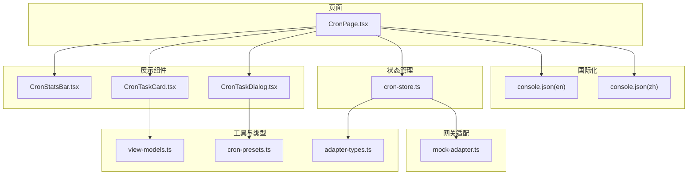
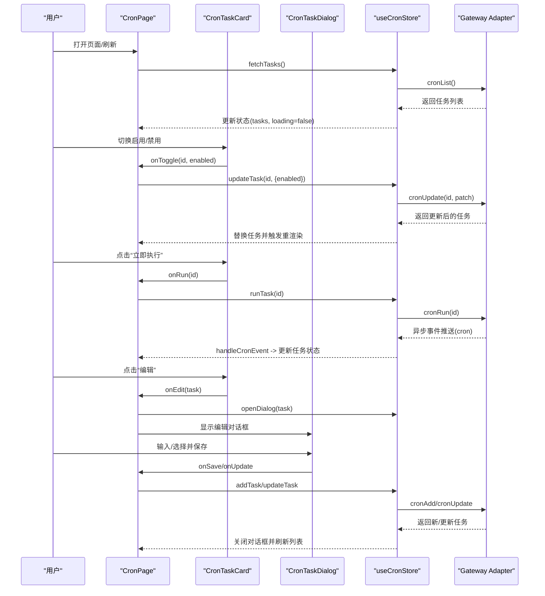
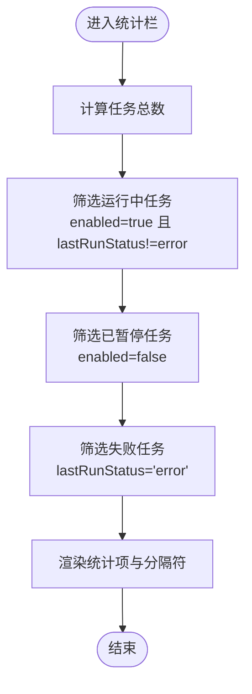
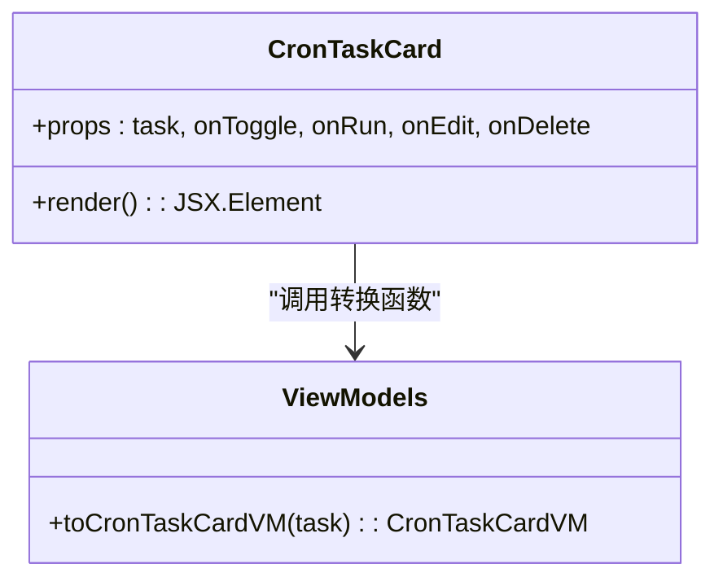
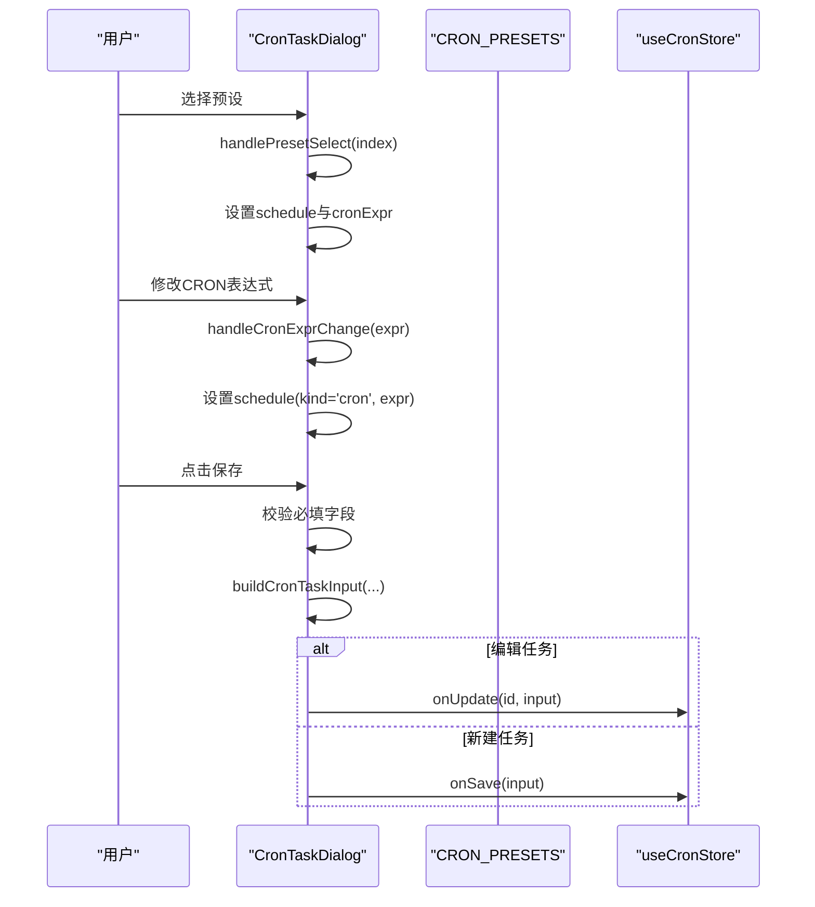
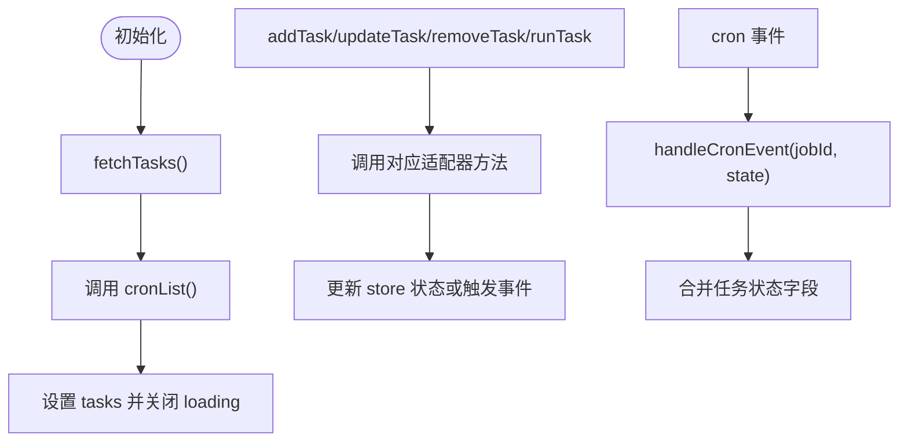
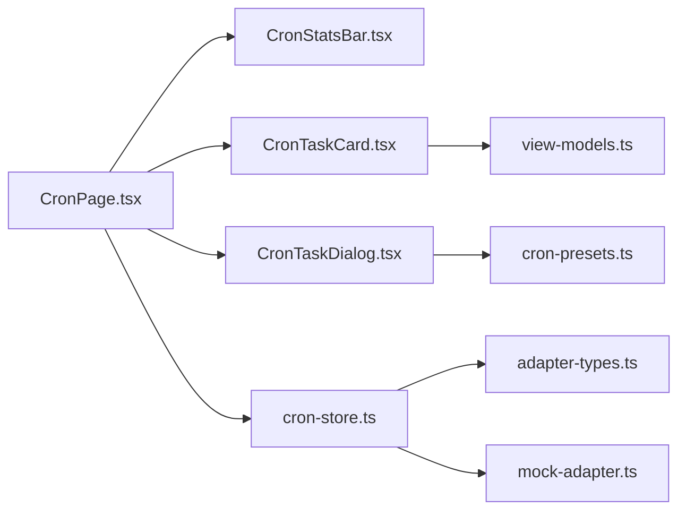

# 定时任务管理

<cite>
**本文档引用的文件**
- [CronStatsBar.tsx](file://src/components/console/cron/CronStatsBar.tsx)
- [CronTaskCard.tsx](file://src/components/console/cron/CronTaskCard.tsx)
- [CronTaskDialog.tsx](file://src/components/console/cron/CronTaskDialog.tsx)
- [cron-store.ts](file://src/store/console-stores/cron-store.ts)
- [CronPage.tsx](file://src/components/pages/CronPage.tsx)
- [cron-presets.ts](file://src/lib/cron-presets.ts)
- [view-models.ts](file://src/lib/view-models.ts)
- [adapter-types.ts](file://src/gateway/adapter-types.ts)
- [mock-adapter.ts](file://src/gateway/mock-adapter.ts)
- [console.json(en)](file://src/i18n/locales/en/console.json)
- [console.json(zh)](file://src/i18n/locales/zh/console.json)
- [CronTaskDialog.test.ts](file://src/components/console/cron/CronTaskDialog.test.ts)
</cite>

## 目录
1. [简介](#简介)
2. [项目结构](#项目结构)
3. [核心组件](#核心组件)
4. [架构总览](#架构总览)
5. [详细组件分析](#详细组件分析)
6. [依赖关系分析](#依赖关系分析)
7. [性能考虑](#性能考虑)
8. [故障排查指南](#故障排查指南)
9. [结论](#结论)
10. [附录](#附录)

## 简介
本文件面向“定时任务管理”功能，围绕以下目标展开：  
- 定时任务统计栏：任务总数、运行中任务数、错误任务数、成功率统计的展示逻辑  
- 定时任务卡片：单个任务的详细信息展示、状态指示、执行历史、操作按钮的功能实现  
- 定时任务对话框：任务创建和编辑表单、CRON表达式与预设、任务配置参数、调度策略的选择逻辑  
- 任务生命周期管理：创建、启用/禁用、编辑、删除、手动执行、历史记录查询的完整流程  
- CRON表达式解析与校验机制、任务执行状态跟踪、错误处理与重试策略  
- 任务调度算法、并发控制、资源限制与性能监控的实现细节  

## 项目结构
定时任务管理功能由页面、组件、状态管理、数据模型与国际化文本共同组成，采用“页面容器 + 展示组件 + 状态存储 + 类型定义”的分层设计。

图表来源
- [CronPage.tsx:13-151](file://src/components/pages/CronPage.tsx#L13-L151)
- [CronStatsBar.tsx:8-38](file://src/components/console/cron/CronStatsBar.tsx#L8-L38)
- [CronTaskCard.tsx:20-106](file://src/components/console/cron/CronTaskCard.tsx#L20-L106)
- [CronTaskDialog.tsx:37-227](file://src/components/console/cron/CronTaskDialog.tsx#L37-L227)
- [cron-store.ts:27-124](file://src/store/console-stores/cron-store.ts#L27-L124)
- [view-models.ts:142-199](file://src/lib/view-models.ts#L142-L199)
- [cron-presets.ts:8-22](file://src/lib/cron-presets.ts#L8-L22)
- [adapter-types.ts:65-123](file://src/gateway/adapter-types.ts#L65-L123)
- [mock-adapter.ts:176-225](file://src/gateway/mock-adapter.ts#L176-L225)

章节来源
- [CronPage.tsx:13-151](file://src/components/pages/CronPage.tsx#L13-L151)
- [CronStatsBar.tsx:8-38](file://src/components/console/cron/CronStatsBar.tsx#L8-L38)
- [CronTaskCard.tsx:20-106](file://src/components/console/cron/CronTaskCard.tsx#L20-L106)
- [CronTaskDialog.tsx:37-227](file://src/components/console/cron/CronTaskDialog.tsx#L37-L227)
- [cron-store.ts:27-124](file://src/store/console-stores/cron-store.ts#L27-L124)
- [view-models.ts:142-199](file://src/lib/view-models.ts#L142-L199)
- [cron-presets.ts:8-22](file://src/lib/cron-presets.ts#L8-L22)
- [adapter-types.ts:65-123](file://src/gateway/adapter-types.ts#L65-L123)
- [mock-adapter.ts:176-225](file://src/gateway/mock-adapter.ts#L176-L225)

## 核心组件
- 统计栏组件：根据任务集合计算总数、运行中、已暂停、失败数量，并渲染本地化文案与颜色标识
- 任务卡片组件：展示任务名称、调度标签、最近/下次运行时间、最后状态图标与错误信息；提供启用开关、立即执行、编辑、删除操作
- 对话框组件：提供任务创建/编辑表单，支持CRON表达式输入与预设选择，进行必填字段校验并构建任务输入对象
- 状态存储：统一管理任务列表、加载状态、错误信息、对话框状态；封装CRUD与事件监听；暴露手动执行与事件处理方法
- 视图模型：将任务实体转换为卡片视图所需的数据结构，包括调度描述、状态标签、时间戳等
- 预设与类型：定义CRON预设集合、调度表达式到文本的转换函数；定义任务、输入、状态等类型

章节来源
- [CronStatsBar.tsx:8-38](file://src/components/console/cron/CronStatsBar.tsx#L8-L38)
- [CronTaskCard.tsx:20-106](file://src/components/console/cron/CronTaskCard.tsx#L20-L106)
- [CronTaskDialog.tsx:37-227](file://src/components/console/cron/CronTaskDialog.tsx#L37-L227)
- [cron-store.ts:27-124](file://src/store/console-stores/cron-store.ts#L27-L124)
- [view-models.ts:142-199](file://src/lib/view-models.ts#L142-L199)
- [cron-presets.ts:8-22](file://src/lib/cron-presets.ts#L8-L22)
- [adapter-types.ts:65-123](file://src/gateway/adapter-types.ts#L65-L123)

## 架构总览
定时任务管理采用“页面容器 + 组件 + 状态存储 + 类型定义”的分层架构，页面负责布局与交互编排，组件负责UI渲染与用户输入，状态存储负责数据获取、持久化与事件订阅，类型定义保证数据一致性。

图表来源
- [CronPage.tsx:34-57](file://src/components/pages/CronPage.tsx#L34-L57)
- [CronTaskCard.tsx:77-102](file://src/components/console/cron/CronTaskCard.tsx#L77-L102)
- [CronTaskDialog.tsx:100-122](file://src/components/console/cron/CronTaskDialog.tsx#L100-L122)
- [cron-store.ts:35-87](file://src/store/console-stores/cron-store.ts#L35-L87)

## 详细组件分析

### 统计栏组件（CronStatsBar）
- 功能要点
  - 计算总数：任务集合长度
  - 运行中：enabled为true且lastRunStatus非error
  - 已暂停：enabled为false
  - 失败：lastRunStatus为error
  - 渲染本地化文案与分隔符，失败存在时才渲染
- 展示逻辑
  - 使用翻译键渲染“总计/运行中/已暂停/失败”，数值使用强样式突出
- 错误处理
  - 仅基于lastRunStatus判断失败，未包含lastError字段的显式处理

图表来源
- [CronStatsBar.tsx:8-38](file://src/components/console/cron/CronStatsBar.tsx#L8-L38)

章节来源
- [CronStatsBar.tsx:8-38](file://src/components/console/cron/CronStatsBar.tsx#L8-L38)

### 任务卡片组件（CronTaskCard）
- 功能要点
  - 启用/禁用：切换开关触发onToggle回调
  - 立即执行：点击按钮触发onRun回调
  - 编辑/删除：分别触发onEdit与onDelete回调
  - 状态指示：根据lastRunStatus渲染对勾、叉号或横线图标
  - 执行历史：展示最近运行时间与下次运行时间（本地化）
  - 错误信息：若存在lastError则显示红色错误文本
- 视图模型
  - 使用toCronTaskCardVM转换任务为卡片视图数据，包含调度描述、状态标签、时间戳等

图表来源
- [CronTaskCard.tsx:20-106](file://src/components/console/cron/CronTaskCard.tsx#L20-L106)
- [view-models.ts:142-165](file://src/lib/view-models.ts#L142-L165)

章节来源
- [CronTaskCard.tsx:20-106](file://src/components/console/cron/CronTaskCard.tsx#L20-L106)
- [view-models.ts:142-165](file://src/lib/view-models.ts#L142-L165)

### 任务对话框组件（CronTaskDialog）
- 功能要点
  - 表单字段：名称、描述、调度（预设+自定义CRON）、消息内容
  - 预设选择：CRON_PRESETS数组，点击后同步到schedule与CRON表达式输入框
  - 自定义CRON：输入框变化时同步到schedule
  - 校验规则：名称与消息必填；CRON表达式必填
  - 保存逻辑：根据是否编辑任务决定调用onSave或onUpdate
  - 输入构建：buildCronTaskInput根据参数构造CronTaskInput，设置sessionTarget与wakeMode
- 国际化
  - 使用console命名空间的翻译键，包含标题、占位符、帮助文本与必填提示

图表来源
- [CronTaskDialog.tsx:37-122](file://src/components/console/cron/CronTaskDialog.tsx#L37-L122)
- [cron-presets.ts:8-22](file://src/lib/cron-presets.ts#L8-L22)
- [CronTaskDialog.test.ts:4-22](file://src/components/console/cron/CronTaskDialog.test.ts#L4-L22)

章节来源
- [CronTaskDialog.tsx:37-122](file://src/components/console/cron/CronTaskDialog.tsx#L37-L122)
- [cron-presets.ts:8-22](file://src/lib/cron-presets.ts#L8-L22)
- [CronTaskDialog.test.ts:4-22](file://src/components/console/cron/CronTaskDialog.test.ts#L4-L22)

### 状态存储（useCronStore）
- 功能要点
  - 数据获取：fetchTasks通过适配器获取任务列表
  - 创建/更新/删除：addTask、updateTask、removeTask封装对应适配器调用
  - 手动执行：runTask触发一次执行
  - 事件监听：initEventListeners订阅cron事件，handleCronEvent合并最新状态
  - 运行态：isLoading、error、dialogOpen、editingTask用于UI反馈
- 适配器集成
  - 通过waitForAdapter确保适配器可用后再发起请求
  - 事件处理中根据jobId匹配并更新对应任务的状态字段

图表来源
- [cron-store.ts:35-99](file://src/store/console-stores/cron-store.ts#L35-L99)

章节来源
- [cron-store.ts:27-124](file://src/store/console-stores/cron-store.ts#L27-L124)

### 页面容器（CronPage）
- 功能要点
  - 生命周期：首次加载拉取任务并初始化事件监听；卸载时返回取消订阅函数
  - 排序：按nextRunAtMs升序排列任务
  - 操作：刷新、创建、启用/禁用、删除确认、立即执行确认
  - 空态：无任务时展示空状态并引导创建
  - 错误态：加载失败时展示错误状态并提供重试
- 交互编排
  - 将卡片与对话框的回调映射到store方法
  - 删除与立即执行采用二次确认对话框

章节来源
- [CronPage.tsx:13-151](file://src/components/pages/CronPage.tsx#L13-L151)

### 类型与视图模型
- 类型定义
  - CronSchedule：支持cron表达式、固定间隔every、指定时刻at三种
  - CronPayload：支持agentTurn、systemEvent、webhook三类负载
  - CronJobState：包含下次/上次运行时间、运行状态、错误信息、运行中时间
  - CronTask/CronTaskInput：任务实体与输入对象
- 视图模型
  - toCronTaskCardVM：将任务转换为卡片视图数据，包含调度描述、状态标签、时间戳
  - describeCronSchedule：将CRON表达式转为人类可读的“每日/每周”描述

章节来源
- [adapter-types.ts:65-123](file://src/gateway/adapter-types.ts#L65-L123)
- [view-models.ts:142-199](file://src/lib/view-models.ts#L142-L199)

### CRON表达式解析与预设
- 预设集合：提供常见周期（每小时、每日9点/18点、每周一9点、每月1日、每30分钟）
- 表达式转换：cronScheduleToExpr将schedule转换为字符串，支持cron、every、at三种形式
- 表达式描述：describeCronSchedule对典型表达式生成本地化描述（如“每日 18:00”）

章节来源
- [cron-presets.ts:8-22](file://src/lib/cron-presets.ts#L8-L22)
- [view-models.ts:182-199](file://src/lib/view-models.ts#L182-L199)

### 任务生命周期管理
- 创建：打开对话框，填写表单，保存时构建CronTaskInput并调用addTask
- 启用/禁用：通过updateTask传入enabled字段
- 编辑：打开对话框并回填当前任务，保存时调用updateTask
- 删除：二次确认后调用removeTask
- 手动执行：二次确认后调用runTask，随后刷新任务列表
- 历史记录：页面按nextRunAtMs排序，卡片展示lastRunAtMs与nextRunAtMs

章节来源
- [CronPage.tsx:40-57](file://src/components/pages/CronPage.tsx#L40-L57)
- [cron-store.ts:46-87](file://src/store/console-stores/cron-store.ts#L46-L87)

### 执行状态跟踪与错误处理
- 状态跟踪：事件监听器接收cron事件，根据jobId合并state字段，实现运行中、成功、失败状态的实时更新
- 错误处理：store在各操作失败时设置error；页面在error存在且无任务时展示错误态
- 重试策略：当前实现未内置自动重试逻辑，建议在业务侧结合lastRunStatus与lastError进行策略扩展

章节来源
- [cron-store.ts:92-99](file://src/store/console-stores/cron-store.ts#L92-L99)
- [CronPage.tsx:73-85](file://src/components/pages/CronPage.tsx#L73-L85)

### 国际化与本地化
- 统计栏、卡片、对话框、空态、确认对话框均使用console命名空间的翻译键
- 支持中英文两套文案，确保多语言环境下的用户体验一致

章节来源
- [console.json(en):250-289](file://src/i18n/locales/en/console.json#L250-L289)
- [console.json(zh):250-289](file://src/i18n/locales/zh/console.json#L250-L289)

## 依赖关系分析
- 组件间依赖
  - CronPage依赖CronStatsBar、CronTaskCard、CronTaskDialog、ConfirmDialog、EmptyState、ErrorState、LoadingState
  - CronTaskCard依赖view-models中的toCronTaskCardVM
  - CronTaskDialog依赖cron-presets与buildCronTaskInput
- 存储与适配器
  - useCronStore封装了与适配器的交互，负责数据获取、CRUD与事件订阅
- 类型与工具
  - adapter-types提供任务与调度的核心类型
  - cron-presets与view-models提供调度描述与视图转换

图表来源
- [CronPage.tsx:13-151](file://src/components/pages/CronPage.tsx#L13-L151)
- [CronTaskCard.tsx:20-106](file://src/components/console/cron/CronTaskCard.tsx#L20-L106)
- [CronTaskDialog.tsx:37-227](file://src/components/console/cron/CronTaskDialog.tsx#L37-L227)
- [view-models.ts:142-165](file://src/lib/view-models.ts#L142-L165)
- [cron-presets.ts:8-22](file://src/lib/cron-presets.ts#L8-L22)
- [cron-store.ts:27-124](file://src/store/console-stores/cron-store.ts#L27-L124)
- [adapter-types.ts:65-123](file://src/gateway/adapter-types.ts#L65-L123)
- [mock-adapter.ts:176-225](file://src/gateway/mock-adapter.ts#L176-L225)

章节来源
- [CronPage.tsx:13-151](file://src/components/pages/CronPage.tsx#L13-L151)
- [cron-store.ts:27-124](file://src/store/console-stores/cron-store.ts#L27-L124)

## 性能考虑
- 渲染优化
  - 任务列表按nextRunAtMs排序，减少视觉跳变
  - 卡片在禁用状态下降低透明度，避免额外重绘成本
- 状态更新
  - 事件驱动的状态合并仅替换匹配任务，避免全量重渲染
- 请求节流
  - runTask后刷新列表，建议在高频执行场景下增加防抖或去抖逻辑
- 资源限制
  - 当前未见并发执行上限与资源配额控制，建议在适配器层引入队列与限流策略

## 故障排查指南
- 无法加载任务
  - 检查适配器连接状态与waitForAdapter是否成功
  - 查看store.error与页面错误态
- 保存失败
  - 校验表单必填字段与CRON表达式有效性
  - 查看适配器返回的错误信息
- 状态不同步
  - 确认事件监听是否初始化，handleCronEvent是否正确合并状态
- 手动执行无效
  - 确认runTask调用链路与事件推送是否正常

章节来源
- [cron-store.ts:35-99](file://src/store/console-stores/cron-store.ts#L35-L99)
- [CronTaskDialog.tsx:100-122](file://src/components/console/cron/CronTaskDialog.tsx#L100-L122)

## 结论
定时任务管理功能通过清晰的分层设计实现了从UI到状态再到适配器的完整闭环：页面负责编排与交互，组件专注展示与输入，状态存储统一管理数据与事件，类型与工具保障一致性与可读性。当前实现覆盖了创建、启用/禁用、编辑、删除、手动执行与状态跟踪等关键流程，具备良好的扩展性与国际化支持。后续可在CRON校验、重试策略、并发控制与性能监控方面进一步完善。

## 附录
- 示例数据（Mock）
  - 提供三类典型任务：每日、每周、每30分钟健康检查，包含状态与错误信息
- 测试用例
  - 验证buildCronTaskInput对消息负载的sessionTarget与wakeMode设置

章节来源
- [mock-adapter.ts:176-225](file://src/gateway/mock-adapter.ts#L176-L225)
- [CronTaskDialog.test.ts:4-22](file://src/components/console/cron/CronTaskDialog.test.ts#L4-L22)