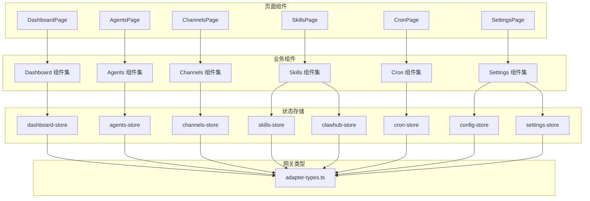
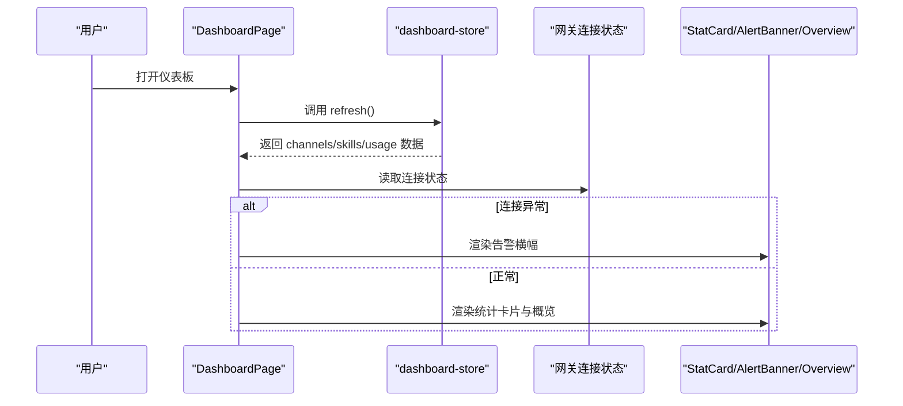
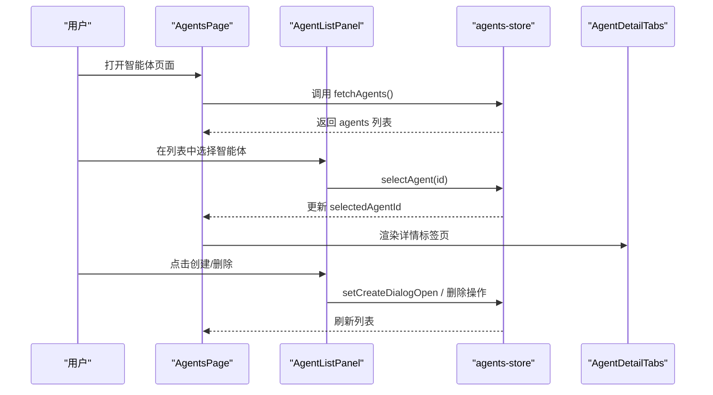
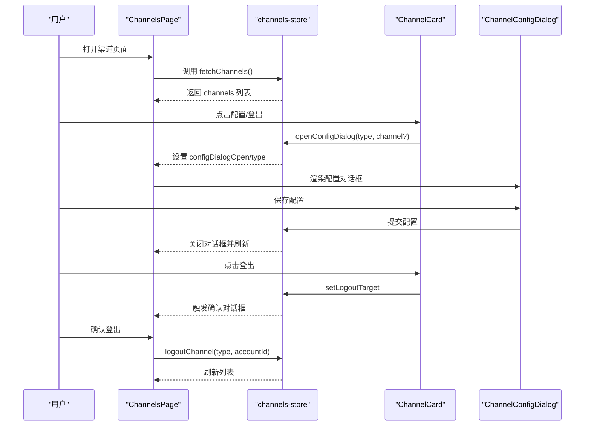
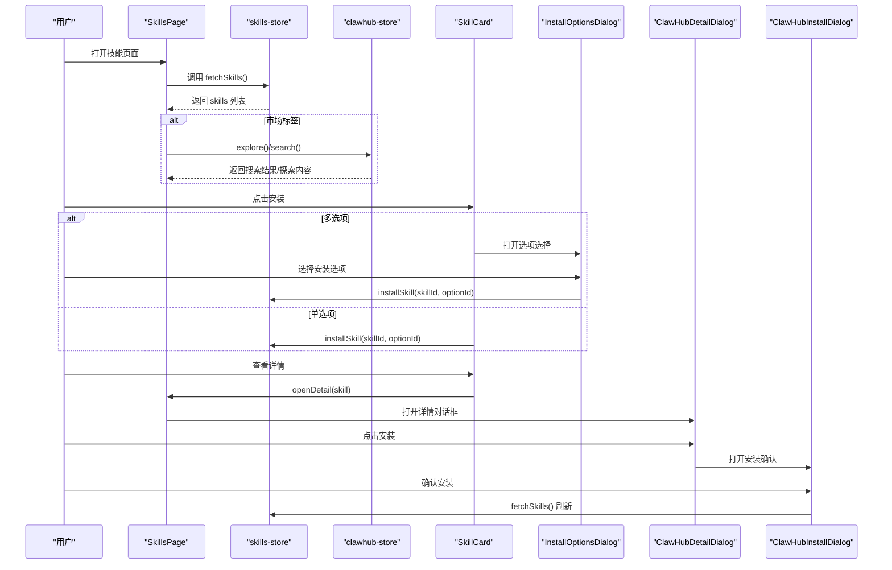
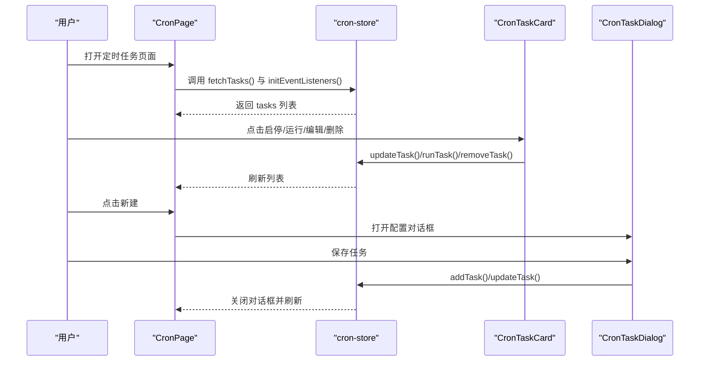
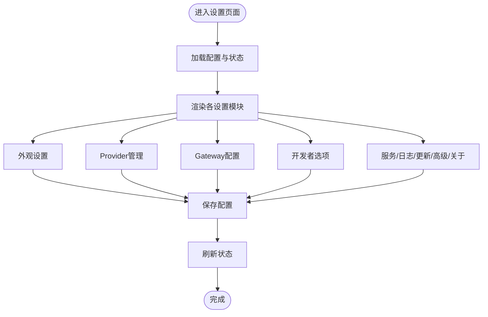
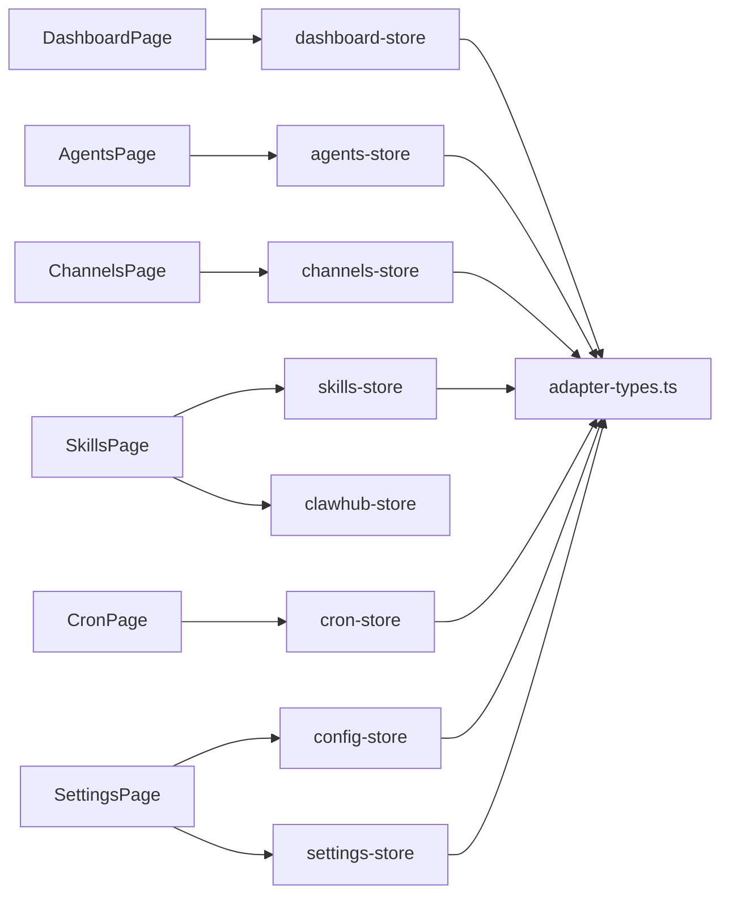

# 控制台管理界面

<cite>
**本文档引用的文件**
- [DashboardPage.tsx](file://src/components/pages/DashboardPage.tsx)
- [AgentsPage.tsx](file://src/components/pages/AgentsPage.tsx)
- [ChannelsPage.tsx](file://src/components/pages/ChannelsPage.tsx)
- [SkillsPage.tsx](file://src/components/pages/SkillsPage.tsx)
- [CronPage.tsx](file://src/components/pages/CronPage.tsx)
- [SettingsPage.tsx](file://src/components/pages/SettingsPage.tsx)
- [StatCard.tsx](file://src/components/console/dashboard/StatCard.tsx)
- [AlertBanner.tsx](file://src/components/console/dashboard/AlertBanner.tsx)
- [ChannelOverview.tsx](file://src/components/console/dashboard/ChannelOverview.tsx)
- [SkillOverview.tsx](file://src/components/console/dashboard/SkillOverview.tsx)
- [QuickNavGrid.tsx](file://src/components/console/dashboard/QuickNavGrid.tsx)
- [AgentListPanel.tsx](file://src/components/console/agents/AgentListPanel.tsx)
- [AgentDetailHeader.tsx](file://src/components/console/agents/AgentDetailHeader.tsx)
- [AgentDetailTabs.tsx](file://src/components/console/agents/AgentDetailTabs.tsx)
- [AgentListItem.tsx](file://src/components/console/agents/AgentListItem.tsx)
- [CreateAgentDialog.tsx](file://src/components/console/agents/CreateAgentDialog.tsx)
- [DeleteAgentDialog.tsx](file://src/components/console/agents/DeleteAgentDialog.tsx)
- [ChannelCard.tsx](file://src/components/console/channels/ChannelCard.tsx)
- [ChannelConfigDialog.tsx](file://src/components/console/channels/ChannelConfigDialog.tsx)
- [ChannelStatsBar.tsx](file://src/components/console/channels/ChannelStatsBar.tsx)
- [WhatsAppQrFlow.tsx](file://src/components/console/channels/WhatsAppQrFlow.tsx)
- [AvailableChannelGrid.tsx](file://src/components/console/channels/AvailableChannelGrid.tsx)
- [CronTaskCard.tsx](file://src/components/console/cron/CronTaskCard.tsx)
- [CronTaskDialog.tsx](file://src/components/console/cron/CronTaskDialog.tsx)
- [CronStatsBar.tsx](file://src/components/console/cron/CronStatsBar.tsx)
- [SkillCard.tsx](file://src/components/console/skills/SkillCard.tsx)
- [SkillDetailDialog.tsx](file://src/components/console/skills/SkillDetailDialog.tsx)
- [InstallOptionsDialog.tsx](file://src/components/console/skills/InstallOptionsDialog.tsx)
- [ClawHubDetailDialog.tsx](file://src/components/console/skills/ClawHubDetailDialog.tsx)
- [ClawHubInstallDialog.tsx](file://src/components/console/skills/ClawHubInstallDialog.tsx)
- [SkillTabBar.tsx](file://src/components/console/skills/SkillTabBar.tsx)
- [ProvidersSection.tsx](file://src/components/console/settings/ProvidersSection.tsx)
- [AppearanceSection.tsx](file://src/components/console/settings/AppearanceSection.tsx)
- [GatewaySection.tsx](file://src/components/console/settings/GatewaySection.tsx)
- [DeveloperSection.tsx](file://src/components/console/settings/DeveloperSection.tsx)
- [AboutSection.tsx](file://src/components/console/settings/AboutSection.tsx)
- [UpdateSection.tsx](file://src/components/console/settings/UpdateSection.tsx)
- [ServiceSection.tsx](file://src/components/console/settings/ServiceSection.tsx)
- [LogViewerSection.tsx](file://src/components/console/settings/LogViewerSection.tsx)
- [AdvancedSection.tsx](file://src/components/console/settings/AdvancedSection.tsx)
- [dashboard-store.ts](file://src/store/console-stores/dashboard-store.ts)
- [agents-store.ts](file://src/store/console-stores/agents-store.ts)
- [channels-store.ts](file://src/store/console-stores/channels-store.ts)
- [skills-store.ts](file://src/store/console-stores/skills-store.ts)
- [cron-store.ts](file://src/store/console-stores/cron-store.ts)
- [config-store.ts](file://src/store/console-stores/config-store.ts)
- [settings-store.ts](file://src/store/console-stores/settings-store.ts)
- [clawhub-store.ts](file://src/store/console-stores/clawhub-store.ts)
- [adapter-types.ts](file://src/gateway/adapter-types.ts)
- [constants.ts](file://src/lib/constants.ts)
</cite>

## 目录
1. [简介](#简介)
2. [项目结构](#项目结构)
3. [核心组件](#核心组件)
4. [架构总览](#架构总览)
5. [详细组件分析](#详细组件分析)
6. [依赖关系分析](#依赖关系分析)
7. [性能考虑](#性能考虑)
8. [故障排除指南](#故障排除指南)
9. [结论](#结论)
10. [附录](#附录)

## 简介
本文件为控制台管理界面的全面功能文档，覆盖以下页面与功能：
- 仪表板概览系统：统计卡片、告警横幅、Channel/Skill概览、快捷导航
- 智能体管理界面：Agent列表展示、创建删除、详情多标签页（Overview/Channels/Cron/Skills/Tools/Files）
- 渠道管理界面：渠道卡片展示、配置对话框、统计信息、WhatsApp QR绑定流程
- 技能管理界面：技能市场、安装选项、技能详情展示
- 定时任务管理：任务列表、配置对话框、统计信息
- 系统设置界面：Provider管理、外观设置、Gateway配置、开发者选项等
- 每个页面的交互逻辑、数据流和API调用

## 项目结构
控制台采用按页面分层的组织方式，页面组件位于 `src/components/pages/`，具体业务组件位于 `src/components/console/` 下对应模块，状态管理位于 `src/store/console-stores/`，网关类型定义在 `src/gateway/`。

```mermaid
graph TB
subgraph "页面层"
D["DashboardPage.tsx"]
A["AgentsPage.tsx"]
C["ChannelsPage.tsx"]
S["SkillsPage.tsx"]
R["CronPage.tsx"]
T["SettingsPage.tsx"]
end
subgraph "仪表板组件"
SC["StatCard.tsx"]
AB["AlertBanner.tsx"]
CO["ChannelOverview.tsx"]
SO["SkillOverview.tsx"]
QN["QuickNavGrid.tsx"]
end
subgraph "智能体组件"
ALP["AgentListPanel.tsx"]
ADH["AgentDetailHeader.tsx"]
ADT["AgentDetailTabs.tsx"]
ALI["AgentListItem.tsx"]
CAD["CreateAgentDialog.tsx"]
DAD["DeleteAgentDialog.tsx"]
end
subgraph "渠道组件"
CC["ChannelCard.tsx"]
CCD["ChannelConfigDialog.tsx"]
CSB["ChannelStatsBar.tsx"]
WQF["WhatsAppQrFlow.tsx"]
AC["AvailableChannelGrid.tsx"]
end
subgraph "技能组件"
SKC["SkillCard.tsx"]
SKD["SkillDetailDialog.tsx"]
IOD["InstallOptionsDialog.tsx"]
CHD["ClawHubDetailDialog.tsx"]
CHI["ClawHubInstallDialog.tsx"]
STB["SkillTabBar.tsx"]
end
subgraph "定时任务组件"
RTC["CronTaskCard.tsx"]
RTD["CronTaskDialog.tsx"]
RSB["CronStatsBar.tsx"]
end
subgraph "设置组件"
PS["ProvidersSection.tsx"]
AS["AppearanceSection.tsx"]
GS["GatewaySection.tsx"]
DevS["DeveloperSection.tsx"]
AbsS["AboutSection.tsx"]
UpS["UpdateSection.tsx"]
SS["ServiceSection.tsx"]
LVS["LogViewerSection.tsx"]
AdvS["AdvancedSection.tsx"]
end
D --> SC
D --> AB
D --> CO
D --> SO
D --> QN
A --> ALP
A --> ADH
A --> ADT
ALP --> ALI
ALP --> CAD
ALP --> DAD
C --> CC
C --> CCD
C --> CSB
C --> WQF
C --> AC
S --> SKC
S --> SKD
S --> IOD
S --> CHD
S --> CHI
S --> STB
R --> RTC
R --> RTD
R --> RSB
T --> PS
T --> AS
T --> GS
T --> DevS
T --> AbsS
T --> UpS
T --> SS
T --> LVS
T --> AdvS
```

图表来源
- [DashboardPage.tsx:14-129](file://src/components/pages/DashboardPage.tsx#L14-L129)
- [AgentsPage.tsx:11-54](file://src/components/pages/AgentsPage.tsx#L11-L54)
- [ChannelsPage.tsx:15-118](file://src/components/pages/ChannelsPage.tsx#L15-L118)
- [SkillsPage.tsx:32-437](file://src/components/pages/SkillsPage.tsx#L32-L437)
- [CronPage.tsx:13-151](file://src/components/pages/CronPage.tsx#L13-L151)
- [SettingsPage.tsx:16-54](file://src/components/pages/SettingsPage.tsx#L16-L54)

章节来源
- [DashboardPage.tsx:14-129](file://src/components/pages/DashboardPage.tsx#L14-L129)
- [AgentsPage.tsx:11-54](file://src/components/pages/AgentsPage.tsx#L11-L54)
- [ChannelsPage.tsx:15-118](file://src/components/pages/ChannelsPage.tsx#L15-L118)
- [SkillsPage.tsx:32-437](file://src/components/pages/SkillsPage.tsx#L32-L437)
- [CronPage.tsx:13-151](file://src/components/pages/CronPage.tsx#L13-L151)
- [SettingsPage.tsx:16-54](file://src/components/pages/SettingsPage.tsx#L16-L54)

## 核心组件
- 仪表板概览系统：通过统计卡片展示连接数/技能数/用量/在线时长；告警横幅提示网关断连或渠道错误；Channel/Skill概览展示已连接渠道与启用技能；快捷导航提供直达入口。
- 智能体管理：左侧列表支持搜索与刷新，右侧详情区包含多标签页（概览/渠道/定时任务/技能/工具/文件），并提供创建/删除弹窗。
- 渠道管理：渠道卡片展示状态与账户信息，支持配置对话框与登出确认；统计条显示连接状态分布；提供可用渠道网格与WhatsApp二维码绑定流程。
- 技能管理：内置技能与市场（ClawHub）双模式，支持搜索、筛选、安装选项选择、详情查看与安装确认。
- 定时任务：任务卡片展示状态与下次运行时间，支持启停、编辑、删除、立即执行，统计条汇总任务状态。
- 系统设置：外观、Provider、Gateway、服务、日志、更新、高级、开发者等模块化配置。

章节来源
- [StatCard.tsx:12-38](file://src/components/console/dashboard/StatCard.tsx#L12-L38)
- [AlertBanner.tsx:17-37](file://src/components/console/dashboard/AlertBanner.tsx#L17-L37)
- [ChannelOverview.tsx:24-61](file://src/components/console/dashboard/ChannelOverview.tsx#L24-L61)
- [SkillOverview.tsx:9-45](file://src/components/console/dashboard/SkillOverview.tsx#L9-L45)
- [QuickNavGrid.tsx:32-58](file://src/components/console/dashboard/QuickNavGrid.tsx#L32-L58)
- [AgentListPanel.tsx:6-91](file://src/components/console/agents/AgentListPanel.tsx#L6-L91)
- [ChannelCard.tsx](file://src/components/console/channels/ChannelCard.tsx)
- [ChannelConfigDialog.tsx](file://src/components/console/channels/ChannelConfigDialog.tsx)
- [ChannelStatsBar.tsx](file://src/components/console/channels/ChannelStatsBar.tsx)
- [WhatsAppQrFlow.tsx](file://src/components/console/channels/WhatsAppQrFlow.tsx)
- [AvailableChannelGrid.tsx](file://src/components/console/channels/AvailableChannelGrid.tsx)
- [SkillCard.tsx](file://src/components/console/skills/SkillCard.tsx)
- [SkillDetailDialog.tsx](file://src/components/console/skills/SkillDetailDialog.tsx)
- [InstallOptionsDialog.tsx](file://src/components/console/skills/InstallOptionsDialog.tsx)
- [ClawHubDetailDialog.tsx](file://src/components/console/skills/ClawHubDetailDialog.tsx)
- [ClawHubInstallDialog.tsx](file://src/components/console/skills/ClawHubInstallDialog.tsx)
- [SkillTabBar.tsx](file://src/components/console/skills/SkillTabBar.tsx)
- [CronTaskCard.tsx](file://src/components/console/cron/CronTaskCard.tsx)
- [CronTaskDialog.tsx](file://src/components/console/cron/CronTaskDialog.tsx)
- [CronStatsBar.tsx](file://src/components/console/cron/CronStatsBar.tsx)
- [ProvidersSection.tsx](file://src/components/console/settings/ProvidersSection.tsx)
- [AppearanceSection.tsx](file://src/components/console/settings/AppearanceSection.tsx)
- [GatewaySection.tsx](file://src/components/console/settings/GatewaySection.tsx)
- [DeveloperSection.tsx](file://src/components/console/settings/DeveloperSection.tsx)
- [AboutSection.tsx](file://src/components/console/settings/AboutSection.tsx)
- [UpdateSection.tsx](file://src/components/console/settings/UpdateSection.tsx)
- [ServiceSection.tsx](file://src/components/console/settings/ServiceSection.tsx)
- [LogViewerSection.tsx](file://src/components/console/settings/LogViewerSection.tsx)
- [AdvancedSection.tsx](file://src/components/console/settings/AdvancedSection.tsx)

## 架构总览
控制台采用“页面组件 + 业务组件 + 状态存储 + 网关类型”的分层架构。页面组件负责布局与交互，业务组件封装UI细节，状态存储统一管理数据与副作用，网关类型定义跨模块共享的数据结构。

图表来源
- [DashboardPage.tsx:14-129](file://src/components/pages/DashboardPage.tsx#L14-L129)
- [AgentsPage.tsx:11-54](file://src/components/pages/AgentsPage.tsx#L11-L54)
- [ChannelsPage.tsx:15-118](file://src/components/pages/ChannelsPage.tsx#L15-L118)
- [SkillsPage.tsx:32-437](file://src/components/pages/SkillsPage.tsx#L32-L437)
- [CronPage.tsx:13-151](file://src/components/pages/CronPage.tsx#L13-L151)
- [SettingsPage.tsx:16-54](file://src/components/pages/SettingsPage.tsx#L16-L54)
- [dashboard-store.ts](file://src/store/console-stores/dashboard-store.ts)
- [agents-store.ts](file://src/store/console-stores/agents-store.ts)
- [channels-store.ts](file://src/store/console-stores/channels-store.ts)
- [skills-store.ts](file://src/store/console-stores/skills-store.ts)
- [cron-store.ts](file://src/store/console-stores/cron-store.ts)
- [config-store.ts](file://src/store/console-stores/config-store.ts)
- [settings-store.ts](file://src/store/console-stores/settings-store.ts)
- [clawhub-store.ts](file://src/store/console-stores/clawhub-store.ts)
- [adapter-types.ts](file://src/gateway/adapter-types.ts)

## 详细组件分析

### 仪表板概览系统
- 统计卡片：展示渠道连接数/总数、技能启用数/总数、用量百分比、在线状态；支持进度条显示。
- 告警横幅：根据网关连接状态与渠道错误数量动态显示警告或错误横幅。
- Channel/Skill概览：展示已连接渠道与启用技能的简要列表。
- 快捷导航：提供直达“渠道/技能/定时任务/设置”的按钮网格。

图表来源
- [DashboardPage.tsx:19-128](file://src/components/pages/DashboardPage.tsx#L19-L128)
- [StatCard.tsx:12-38](file://src/components/console/dashboard/StatCard.tsx#L12-L38)
- [AlertBanner.tsx:17-37](file://src/components/console/dashboard/AlertBanner.tsx#L17-L37)
- [ChannelOverview.tsx:24-61](file://src/components/console/dashboard/ChannelOverview.tsx#L24-L61)
- [SkillOverview.tsx:9-45](file://src/components/console/dashboard/SkillOverview.tsx#L9-L45)
- [QuickNavGrid.tsx:32-58](file://src/components/console/dashboard/QuickNavGrid.tsx#L32-L58)
- [dashboard-store.ts](file://src/store/console-stores/dashboard-store.ts)

章节来源
- [DashboardPage.tsx:14-129](file://src/components/pages/DashboardPage.tsx#L14-L129)
- [StatCard.tsx:12-38](file://src/components/console/dashboard/StatCard.tsx#L12-L38)
- [AlertBanner.tsx:17-37](file://src/components/console/dashboard/AlertBanner.tsx#L17-L37)
- [ChannelOverview.tsx:24-61](file://src/components/console/dashboard/ChannelOverview.tsx#L24-L61)
- [SkillOverview.tsx:9-45](file://src/components/console/dashboard/SkillOverview.tsx#L9-L45)
- [QuickNavGrid.tsx:32-58](file://src/components/console/dashboard/QuickNavGrid.tsx#L32-L58)

### 智能体管理界面
- 列表面板：支持搜索、刷新、新增智能体、默认智能体标识；点击项选中。
- 详情区域：顶部显示智能体基本信息，右侧为多标签页（概览/渠道/定时任务/技能/工具/文件）。
- 创建/删除：通过弹窗进行创建与删除操作，提交后刷新列表。

图表来源
- [AgentsPage.tsx:11-54](file://src/components/pages/AgentsPage.tsx#L11-L54)
- [AgentListPanel.tsx:6-91](file://src/components/console/agents/AgentListPanel.tsx#L6-L91)
- [AgentDetailHeader.tsx](file://src/components/console/agents/AgentDetailHeader.tsx)
- [AgentDetailTabs.tsx](file://src/components/console/agents/AgentDetailTabs.tsx)
- [AgentListItem.tsx](file://src/components/console/agents/AgentListItem.tsx)
- [CreateAgentDialog.tsx](file://src/components/console/agents/CreateAgentDialog.tsx)
- [DeleteAgentDialog.tsx](file://src/components/console/agents/DeleteAgentDialog.tsx)
- [agents-store.ts](file://src/store/console-stores/agents-store.ts)

章节来源
- [AgentsPage.tsx:11-54](file://src/components/pages/AgentsPage.tsx#L11-L54)
- [AgentListPanel.tsx:6-91](file://src/components/console/agents/AgentListPanel.tsx#L6-L91)
- [AgentDetailHeader.tsx](file://src/components/console/agents/AgentDetailHeader.tsx)
- [AgentDetailTabs.tsx](file://src/components/console/agents/AgentDetailTabs.tsx)
- [AgentListItem.tsx](file://src/components/console/agents/AgentListItem.tsx)
- [CreateAgentDialog.tsx](file://src/components/console/agents/CreateAgentDialog.tsx)
- [DeleteAgentDialog.tsx](file://src/components/console/agents/DeleteAgentDialog.tsx)
- [agents-store.ts](file://src/store/console-stores/agents-store.ts)

### 渠道管理界面
- 渠道卡片：展示渠道名称、类型、状态与账户信息，支持登出确认。
- 配置对话框：打开指定类型的配置表单，保存后刷新列表。
- 统计条：显示连接/错误/离线等状态分布。
- 可用渠道网格：展示可添加的新渠道类型，触发配置对话框。
- WhatsApp QR绑定：提供二维码绑定流程组件。

图表来源
- [ChannelsPage.tsx:15-118](file://src/components/pages/ChannelsPage.tsx#L15-L118)
- [ChannelCard.tsx](file://src/components/console/channels/ChannelCard.tsx)
- [ChannelConfigDialog.tsx](file://src/components/console/channels/ChannelConfigDialog.tsx)
- [ChannelStatsBar.tsx](file://src/components/console/channels/ChannelStatsBar.tsx)
- [AvailableChannelGrid.tsx](file://src/components/console/channels/AvailableChannelGrid.tsx)
- [WhatsAppQrFlow.tsx](file://src/components/console/channels/WhatsAppQrFlow.tsx)
- [channels-store.ts](file://src/store/console-stores/channels-store.ts)
- [adapter-types.ts](file://src/gateway/adapter-types.ts)

章节来源
- [ChannelsPage.tsx:15-118](file://src/components/pages/ChannelsPage.tsx#L15-L118)
- [ChannelCard.tsx](file://src/components/console/channels/ChannelCard.tsx)
- [ChannelConfigDialog.tsx](file://src/components/console/channels/ChannelConfigDialog.tsx)
- [ChannelStatsBar.tsx](file://src/components/console/channels/ChannelStatsBar.tsx)
- [AvailableChannelGrid.tsx](file://src/components/console/channels/AvailableChannelGrid.tsx)
- [WhatsAppQrFlow.tsx](file://src/components/console/channels/WhatsAppQrFlow.tsx)
- [channels-store.ts](file://src/store/console-stores/channels-store.ts)
- [adapter-types.ts](file://src/gateway/adapter-types.ts)

### 技能管理界面
- 标签栏：内置/市场（ClawHub）双模式切换。
- 内置技能：支持按来源过滤（内置/市场），搜索过滤，启用/禁用，配置详情，安装选项选择。
- 市场技能：支持离线/在线模式，搜索、浏览最新、加载更多、详情查看、安装确认。
- 安装选项：当技能提供多个安装选项时，弹出选项选择对话框。

图表来源
- [SkillsPage.tsx:32-437](file://src/components/pages/SkillsPage.tsx#L32-L437)
- [SkillCard.tsx](file://src/components/console/skills/SkillCard.tsx)
- [InstallOptionsDialog.tsx](file://src/components/console/skills/InstallOptionsDialog.tsx)
- [SkillDetailDialog.tsx](file://src/components/console/skills/SkillDetailDialog.tsx)
- [ClawHubDetailDialog.tsx](file://src/components/console/skills/ClawHubDetailDialog.tsx)
- [ClawHubInstallDialog.tsx](file://src/components/console/skills/ClawHubInstallDialog.tsx)
- [SkillTabBar.tsx](file://src/components/console/skills/SkillTabBar.tsx)
- [skills-store.ts](file://src/store/console-stores/skills-store.ts)
- [clawhub-store.ts](file://src/store/console-stores/clawhub-store.ts)

章节来源
- [SkillsPage.tsx:32-437](file://src/components/pages/SkillsPage.tsx#L32-L437)
- [SkillCard.tsx](file://src/components/console/skills/SkillCard.tsx)
- [InstallOptionsDialog.tsx](file://src/components/console/skills/InstallOptionsDialog.tsx)
- [SkillDetailDialog.tsx](file://src/components/console/skills/SkillDetailDialog.tsx)
- [ClawHubDetailDialog.tsx](file://src/components/console/skills/ClawHubDetailDialog.tsx)
- [ClawHubInstallDialog.tsx](file://src/components/console/skills/ClawHubInstallDialog.tsx)
- [SkillTabBar.tsx](file://src/components/console/skills/SkillTabBar.tsx)
- [skills-store.ts](file://src/store/console-stores/skills-store.ts)
- [clawhub-store.ts](file://src/store/console-stores/clawhub-store.ts)

### 定时任务管理
- 任务卡片：展示任务名称、状态、下次运行时间、启停按钮、运行/编辑/删除操作。
- 配置对话框：新建/编辑任务，保存后刷新列表。
- 统计条：汇总任务状态（启用/禁用/错误）。
- 事件监听：初始化事件监听器以接收任务状态变更。

图表来源
- [CronPage.tsx:13-151](file://src/components/pages/CronPage.tsx#L13-L151)
- [CronTaskCard.tsx](file://src/components/console/cron/CronTaskCard.tsx)
- [CronTaskDialog.tsx](file://src/components/console/cron/CronTaskDialog.tsx)
- [CronStatsBar.tsx](file://src/components/console/cron/CronStatsBar.tsx)
- [cron-store.ts](file://src/store/console-stores/cron-store.ts)

章节来源
- [CronPage.tsx:13-151](file://src/components/pages/CronPage.tsx#L13-L151)
- [CronTaskCard.tsx](file://src/components/console/cron/CronTaskCard.tsx)
- [CronTaskDialog.tsx](file://src/components/console/cron/CronTaskDialog.tsx)
- [CronStatsBar.tsx](file://src/components/console/cron/CronStatsBar.tsx)
- [cron-store.ts](file://src/store/console-stores/cron-store.ts)

### 系统设置界面
- 外观设置：主题/语言等外观相关配置。
- Provider管理：提供者列表与增删改查。
- Gateway配置：网关连接参数配置。
- 开发者选项：开发调试相关开关。
- 其他模块：服务、日志、更新、高级、关于等。

图表来源
- [SettingsPage.tsx:16-54](file://src/components/pages/SettingsPage.tsx#L16-L54)
- [AppearanceSection.tsx](file://src/components/console/settings/AppearanceSection.tsx)
- [ProvidersSection.tsx](file://src/components/console/settings/ProvidersSection.tsx)
- [GatewaySection.tsx](file://src/components/console/settings/GatewaySection.tsx)
- [DeveloperSection.tsx](file://src/components/console/settings/DeveloperSection.tsx)
- [AboutSection.tsx](file://src/components/console/settings/AboutSection.tsx)
- [UpdateSection.tsx](file://src/components/console/settings/UpdateSection.tsx)
- [ServiceSection.tsx](file://src/components/console/settings/ServiceSection.tsx)
- [LogViewerSection.tsx](file://src/components/console/settings/LogViewerSection.tsx)
- [AdvancedSection.tsx](file://src/components/console/settings/AdvancedSection.tsx)
- [config-store.ts](file://src/store/console-stores/config-store.ts)
- [settings-store.ts](file://src/store/console-stores/settings-store.ts)

章节来源
- [SettingsPage.tsx:16-54](file://src/components/pages/SettingsPage.tsx#L16-L54)
- [AppearanceSection.tsx](file://src/components/console/settings/AppearanceSection.tsx)
- [ProvidersSection.tsx](file://src/components/console/settings/ProvidersSection.tsx)
- [GatewaySection.tsx](file://src/components/console/settings/GatewaySection.tsx)
- [DeveloperSection.tsx](file://src/components/console/settings/DeveloperSection.tsx)
- [AboutSection.tsx](file://src/components/console/settings/AboutSection.tsx)
- [UpdateSection.tsx](file://src/components/console/settings/UpdateSection.tsx)
- [ServiceSection.tsx](file://src/components/console/settings/ServiceSection.tsx)
- [LogViewerSection.tsx](file://src/components/console/settings/LogViewerSection.tsx)
- [AdvancedSection.tsx](file://src/components/console/settings/AdvancedSection.tsx)
- [config-store.ts](file://src/store/console-stores/config-store.ts)
- [settings-store.ts](file://src/store/console-stores/settings-store.ts)

## 依赖关系分析
- 页面组件依赖对应的状态存储，状态存储依赖网关类型定义。
- 业务组件内部组合使用通用UI组件（如状态徽章、空状态、加载状态等）。
- 各模块间通过store解耦，避免直接耦合。

图表来源
- [DashboardPage.tsx:11-17](file://src/components/pages/DashboardPage.tsx#L11-L17)
- [AgentsPage.tsx:9-14](file://src/components/pages/AgentsPage.tsx#L9-L14)
- [ChannelsPage.tsx:13-27](file://src/components/pages/ChannelsPage.tsx#L13-L27)
- [SkillsPage.tsx:24-66](file://src/components/pages/SkillsPage.tsx#L24-L66)
- [CronPage.tsx:11-29](file://src/components/pages/CronPage.tsx#L11-L29)
- [SettingsPage.tsx:13-21](file://src/components/pages/SettingsPage.tsx#L13-L21)
- [adapter-types.ts](file://src/gateway/adapter-types.ts)

章节来源
- [DashboardPage.tsx:11-17](file://src/components/pages/DashboardPage.tsx#L11-L17)
- [AgentsPage.tsx:9-14](file://src/components/pages/AgentsPage.tsx#L9-L14)
- [ChannelsPage.tsx:13-27](file://src/components/pages/ChannelsPage.tsx#L13-L27)
- [SkillsPage.tsx:24-66](file://src/components/pages/SkillsPage.tsx#L24-L66)
- [CronPage.tsx:11-29](file://src/components/pages/CronPage.tsx#L11-L29)
- [SettingsPage.tsx:13-21](file://src/components/pages/SettingsPage.tsx#L13-L21)
- [adapter-types.ts](file://src/gateway/adapter-types.ts)

## 性能考虑
- 列表渲染优化：使用虚拟滚动或分页（如适用）减少DOM节点数量。
- 状态缓存：store内对常用数据进行缓存，避免重复请求。
- 按需加载：技能市场在切换标签或滚动到底部时再加载更多。
- 并发控制：限制同时发起的网络请求数量，防止阻塞UI。
- 图标与资源：使用矢量图标与懒加载图片，降低首屏体积。
- 本地存储：利用本地持久化减少重复计算与网络请求。

## 故障排除指南
- 仪表板无数据或报错
  - 检查网关连接状态，若断开则根据引导进行重连。
  - 使用刷新按钮重新拉取数据。
- 渠道登出失败
  - 确认目标渠道状态正常，再次尝试登出。
  - 查看错误状态并重试。
- 技能安装卡住
  - 检查网络状态与ClawHub可用性。
  - 若出现多选项，确保正确选择安装选项。
- 定时任务无法运行
  - 检查任务状态与下次运行时间。
  - 确认任务配置正确并已启用。
- 设置页面加载缓慢
  - 等待配置加载完成，必要时刷新页面。

章节来源
- [DashboardPage.tsx:23-57](file://src/components/pages/DashboardPage.tsx#L23-L57)
- [ChannelsPage.tsx:42-66](file://src/components/pages/ChannelsPage.tsx#L42-L66)
- [SkillsPage.tsx:155-179](file://src/components/pages/SkillsPage.tsx#L155-L179)
- [CronPage.tsx:59-85](file://src/components/pages/CronPage.tsx#L59-L85)
- [SettingsPage.tsx:37-51](file://src/components/pages/SettingsPage.tsx#L37-L51)

## 结论
本控制台管理界面通过清晰的页面分层与组件化设计，实现了仪表板概览、智能体管理、渠道管理、技能管理、定时任务与系统设置的完整功能闭环。借助store统一管理状态与网关类型定义，保证了模块间的低耦合与高扩展性。建议后续在性能与用户体验方面持续优化，例如引入分页与缓存策略，增强错误处理与提示机制。

## 附录
- 常用图标与文案键值可在i18n目录中查找，页面标题与描述均来自翻译资源。
- 网关适配器类型定义集中于adapter-types.ts，供所有模块共享。