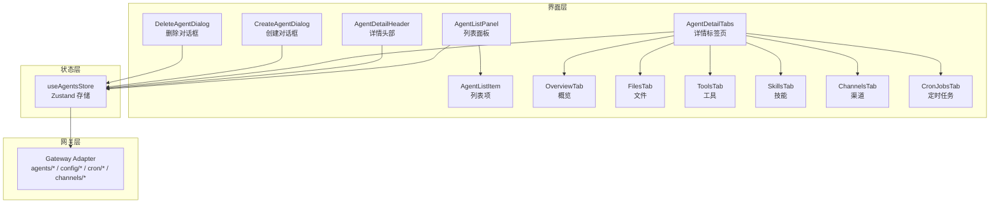
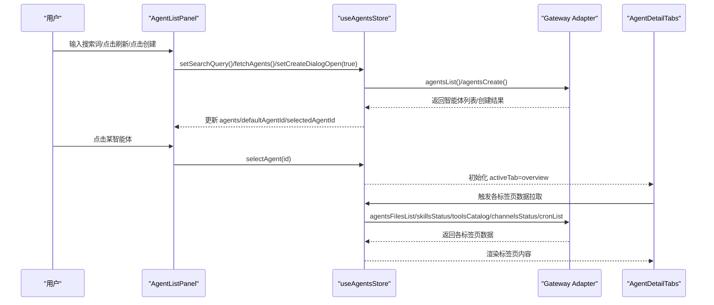
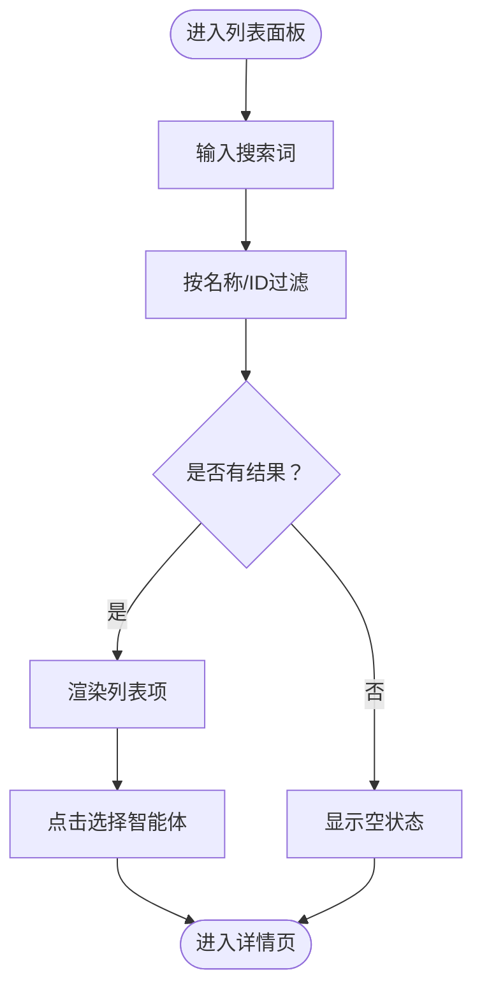
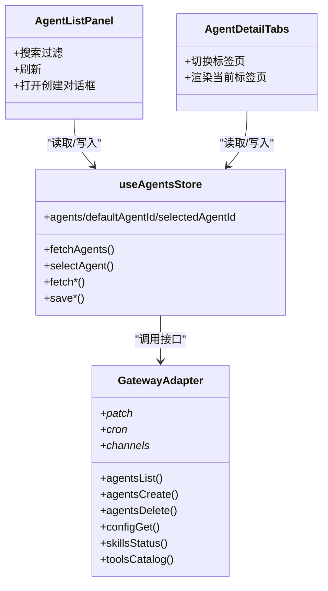

# 智能体管理

<cite>
**本文引用的文件**
- [AgentListPanel.tsx](file://src/components/console/agents/AgentListPanel.tsx)
- [AgentListItem.tsx](file://src/components/console/agents/AgentListItem.tsx)
- [AgentDetailHeader.tsx](file://src/components/console/agents/AgentDetailHeader.tsx)
- [AgentDetailTabs.tsx](file://src/components/console/agents/AgentDetailTabs.tsx)
- [OverviewTab.tsx](file://src/components/console/agents/tabs/OverviewTab.tsx)
- [ChannelsTab.tsx](file://src/components/console/agents/tabs/ChannelsTab.tsx)
- [CronJobsTab.tsx](file://src/components/console/agents/tabs/CronJobsTab.tsx)
- [FilesTab.tsx](file://src/components/console/agents/tabs/FilesTab.tsx)
- [SkillsTab.tsx](file://src/components/console/agents/tabs/SkillsTab.tsx)
- [ToolsTab.tsx](file://src/components/console/agents/tabs/ToolsTab.tsx)
- [CreateAgentDialog.tsx](file://src/components/console/agents/CreateAgentDialog.tsx)
- [DeleteAgentDialog.tsx](file://src/components/console/agents/DeleteAgentDialog.tsx)
- [agents-store.ts](file://src/store/console-stores/agents-store.ts)
- [types.ts](file://src/gateway/types.ts)
- [adapter-types.ts](file://src/gateway/adapter-types.ts)
</cite>

## 目录
1. [简介](#简介)
2. [项目结构](#项目结构)
3. [核心组件](#核心组件)
4. [架构总览](#架构总览)
5. [详细组件分析](#详细组件分析)
6. [依赖关系分析](#依赖关系分析)
7. [性能考量](#性能考量)
8. [故障排查指南](#故障排查指南)
9. [结论](#结论)
10. [附录](#附录)

## 简介
本文件面向“智能体管理”控制台界面，系统性梳理智能体列表面板、列表项组件、详情头部与标签页系统，以及创建/删除对话框的交互与校验流程，并结合状态管理与数据持久化机制，帮助开发者与使用者高效理解与维护该模块。

## 项目结构
智能体管理界面采用“组件 + 存储”的分层设计：
- 列表侧：左侧智能体列表面板负责展示、搜索与刷新；点击后右侧进入详情页。
- 详情侧：顶部头部展示智能体基础信息与默认态标识；底部为标签页系统，覆盖概览、文件、工具、技能、渠道、定时任务等。
- 存储层：统一使用 Zustand 状态管理，封装与 Gateway 的交互，提供 CRUD、配置读取与写入、轮询与状态同步能力。

图表来源
- [AgentListPanel.tsx:1-92](file://src/components/console/agents/AgentListPanel.tsx#L1-L92)
- [AgentDetailTabs.tsx:1-53](file://src/components/console/agents/AgentDetailTabs.tsx#L1-L53)
- [agents-store.ts:141-642](file://src/store/console-stores/agents-store.ts#L141-L642)
- [adapter-types.ts:1-458](file://src/gateway/adapter-types.ts#L1-L458)

章节来源
- [AgentListPanel.tsx:1-92](file://src/components/console/agents/AgentListPanel.tsx#L1-L92)
- [AgentDetailTabs.tsx:1-53](file://src/components/console/agents/AgentDetailTabs.tsx#L1-L53)
- [agents-store.ts:141-642](file://src/store/console-stores/agents-store.ts#L141-L642)

## 核心组件
- 智能体列表面板：支持搜索过滤、刷新、创建入口、选中态高亮与默认态标识。
- 智能体列表项：展示头像或表情、名称、ID、默认徽章。
- 详情头部：展示头像/表情、名称、描述、ID、默认徽章。
- 详情标签页：概览、文件、工具、技能、渠道、定时任务六个标签页。
- 创建/删除对话框：表单校验、异步提交、错误提示与关闭重置。

章节来源
- [AgentListPanel.tsx:1-92](file://src/components/console/agents/AgentListPanel.tsx#L1-L92)
- [AgentListItem.tsx:1-49](file://src/components/console/agents/AgentListItem.tsx#L1-L49)
- [AgentDetailHeader.tsx:1-45](file://src/components/console/agents/AgentDetailHeader.tsx#L1-L45)
- [AgentDetailTabs.tsx:1-53](file://src/components/console/agents/AgentDetailTabs.tsx#L1-L53)
- [CreateAgentDialog.tsx:1-126](file://src/components/console/agents/CreateAgentDialog.tsx#L1-L126)
- [DeleteAgentDialog.tsx:1-82](file://src/components/console/agents/DeleteAgentDialog.tsx#L1-L82)

## 架构总览
整体交互链路如下：
- 用户在列表面板输入关键词进行模糊匹配（名称或ID），支持刷新与创建。
- 选择某个智能体后，右侧详情页加载对应标签页数据。
- 各标签页通过存储层调用 Gateway Adapter 完成读取/更新。
- 存储层在写入配置后触发生命周期提示或会话清理，确保运行时生效。

图表来源
- [AgentListPanel.tsx:1-92](file://src/components/console/agents/AgentListPanel.tsx#L1-L92)
- [agents-store.ts:297-333](file://src/store/console-stores/agents-store.ts#L297-L333)
- [AgentDetailTabs.tsx:1-53](file://src/components/console/agents/AgentDetailTabs.tsx#L1-L53)

## 详细组件分析

### 智能体列表面板
- 功能要点
  - 搜索过滤：对名称与ID进行不区分大小写的包含匹配。
  - 刷新：调用适配器拉取最新智能体列表。
  - 创建入口：打开创建对话框。
  - 列表渲染：遍历过滤后的智能体，逐项渲染列表项。
- 性能与体验
  - 本地过滤，避免频繁网络请求。
  - 加载态通过按钮禁用与旋转图标提示。

图表来源
- [AgentListPanel.tsx:20-25](file://src/components/console/agents/AgentListPanel.tsx#L20-L25)
- [AgentListPanel.tsx:70-88](file://src/components/console/agents/AgentListPanel.tsx#L70-L88)

章节来源
- [AgentListPanel.tsx:1-92](file://src/components/console/agents/AgentListPanel.tsx#L1-L92)

### 智能体列表项组件
- 展示要素
  - 头像或表情：优先使用头像URL，否则使用表情或首字母。
  - 名称与ID：名称优先 identity.name，其次 name，最后回退到 id。
  - 默认徽章：当 isDefault 为真时显示。
  - 选中态：当前选中项有蓝色边框与背景强调。
- 交互行为
  - 点击回调 onSelect，由父级设置选中ID并切换详情页。

章节来源
- [AgentListItem.tsx:1-49](file://src/components/console/agents/AgentListItem.tsx#L1-L49)

### 智能体详情头部
- 展示要素
  - 头像/表情、名称、描述（含ID占位）、ID文本、默认徽章。
- 设计要点
  - 信息分组清晰，便于快速识别当前智能体身份与状态。

章节来源
- [AgentDetailHeader.tsx:1-45](file://src/components/console/agents/AgentDetailHeader.tsx#L1-L45)

### 智能体详情标签页系统
- 标签页集合：概览、文件、工具、技能、渠道、定时任务。
- 切换逻辑：通过 activeTab 控制当前渲染的标签页组件。
- 各标签页职责
  - 概览：模型配置、保存、删除入口。
  - 文件：文件列表、内容查看/编辑/保存。
  - 工具：工具策略（profile/alsoAllow/deny）编辑与保存。
  - 技能：技能允许清单模式切换、批量勾选、保存。
  - 渠道：连接状态卡片、刷新、网关提示。
  - 定时任务：任务列表、新增/编辑/启用/运行/删除、统计。

章节来源
- [AgentDetailTabs.tsx:1-53](file://src/components/console/agents/AgentDetailTabs.tsx#L1-L53)
- [OverviewTab.tsx:1-215](file://src/components/console/agents/tabs/OverviewTab.tsx#L1-L215)
- [FilesTab.tsx:1-146](file://src/components/console/agents/tabs/FilesTab.tsx#L1-L146)
- [ToolsTab.tsx:1-314](file://src/components/console/agents/tabs/ToolsTab.tsx#L1-L314)
- [SkillsTab.tsx:1-346](file://src/components/console/agents/tabs/SkillsTab.tsx#L1-L346)
- [ChannelsTab.tsx:1-128](file://src/components/console/agents/tabs/ChannelsTab.tsx#L1-L128)
- [CronJobsTab.tsx:1-150](file://src/components/console/agents/tabs/CronJobsTab.tsx#L1-L150)

### 概览标签（基本信息、状态、统计）
- 关键能力
  - 模型主备配置：支持主模型与备用模型列表，保存时自动清洗空值。
  - 保存反馈：成功/失败状态提示，必要时触发系统模型刷新与会话清理提示。
  - 删除入口：仅非默认智能体可删除。
- 交互细节
  - 依赖系统模型列表与每个智能体的模型配置快照。
  - 保存成功后，若需要重启，通过配置存储设置生命周期提示。

章节来源
- [OverviewTab.tsx:1-215](file://src/components/console/agents/tabs/OverviewTab.tsx#L1-L215)
- [agents-store.ts:403-449](file://src/store/console-stores/agents-store.ts#L403-L449)

### 渠道标签（连接的渠道列表）
- 关键能力
  - 展示所有渠道的连接状态卡片（连接中/已连接/断开/错误）。
  - 支持刷新渠道状态。
  - 提供网关提示与无绑定时的空状态。
- 设计要点
  - 使用状态色块与简短标签直观表达连接健康度。
  - 通道类型映射为双字母缩写，增强可读性。

章节来源
- [ChannelsTab.tsx:1-128](file://src/components/console/agents/tabs/ChannelsTab.tsx#L1-L128)

### 定时任务标签（相关任务管理）
- 关键能力
  - 任务列表：总数、启用数、错误数统计。
  - 操作：新增、编辑、启用/禁用、立即运行、删除。
  - 对话框：统一的任务编辑弹窗，支持保存与更新。
- 生命周期
  - 每次变更均触发运行时提示，确保策略即时生效。

章节来源
- [CronJobsTab.tsx:1-150](file://src/components/console/agents/tabs/CronJobsTab.tsx#L1-L150)
- [agents-store.ts:596-632](file://src/store/console-stores/agents-store.ts#L596-L632)

### 文件标签（相关文件管理）
- 关键能力
  - 文件列表：名称、大小、修改时间相对格式化。
  - 内容编辑：选中文件后展示文本域，支持撤销与保存。
  - 保存状态：脏检查、保存中状态与错误提示。
- 交互细节
  - 选择文件即拉取内容；保存成功后同步原始内容与脏标记。

章节来源
- [FilesTab.tsx:1-146](file://src/components/console/agents/tabs/FilesTab.tsx#L1-L146)
- [agents-store.ts:335-387](file://src/store/console-stores/agents-store.ts#L335-L387)

### 技能标签（已安装技能）
- 关键能力
  - 模式：全量模式与“仅所选”模式。
  - 允许清单：支持全选/全不选、核心锁定技能不可取消。
  - 统计：总数量、已启用、被阻止（因允许清单）。
  - 保存：写入允许清单，触发配置写入与生命周期提示。
- 交互细节
  - 本地编辑状态实时计算统计，避免与远端状态不同步导致的错觉。

章节来源
- [SkillsTab.tsx:1-346](file://src/components/console/agents/tabs/SkillsTab.tsx#L1-L346)
- [agents-store.ts:520-565](file://src/store/console-stores/agents-store.ts#L520-L565)

### 工具标签（可用工具）
- 关键能力
  - 策略编辑：profile、alsoAllow、deny 三段式配置。
  - 工具目录：按来源分组展示工具条目。
  - 保存：写入工具配置，触发配置写入与生命周期提示。
- 交互细节
  - 支持标签式输入与回车确认添加，去重与移除便捷。

章节来源
- [ToolsTab.tsx:1-314](file://src/components/console/agents/tabs/ToolsTab.tsx#L1-L314)
- [agents-store.ts:471-516](file://src/store/console-stores/agents-store.ts#L471-L516)

### 智能体创建对话框
- 表单字段
  - 名称（必填）、工作空间（可选，默认生成）、表情（可选）。
- 校验与提交
  - 名称为空则提示错误；提交时禁用按钮防止重复提交。
  - 成功后自动选中新智能体并关闭对话框。
- 关闭重置
  - 关闭时清空输入与错误状态。

章节来源
- [CreateAgentDialog.tsx:1-126](file://src/components/console/agents/CreateAgentDialog.tsx#L1-L126)
- [agents-store.ts:389-401](file://src/store/console-stores/agents-store.ts#L389-L401)

### 智能体删除对话框
- 交互流程
  - 选择是否同时删除文件，确认后异步删除并关闭对话框。
  - 删除成功后清空选中项并刷新列表。
- 安全性
  - 默认智能体不可删除，按钮禁用并提供提示。

章节来源
- [DeleteAgentDialog.tsx:1-82](file://src/components/console/agents/DeleteAgentDialog.tsx#L1-L82)
- [OverviewTab.tsx:150-163](file://src/components/console/agents/tabs/OverviewTab.tsx#L150-L163)
- [agents-store.ts:451-464](file://src/store/console-stores/agents-store.ts#L451-L464)

## 依赖关系分析
- 组件与存储
  - 列表面板与详情标签页均通过 useAgentsStore 读取/写入状态。
  - 各标签页内部通过存储层发起对 Gateway 的调用。
- 存储与网关
  - 存储层封装 agents/*、config/*、cron/*、channels/* 等接口，统一处理错误与生命周期提示。
- 类型与契约
  - AgentSummary、SkillInfo、ToolCatalogEntry、CronTask 等类型定义来自网关适配器类型文件，保证前后端契约一致。

图表来源
- [AgentListPanel.tsx:1-92](file://src/components/console/agents/AgentListPanel.tsx#L1-L92)
- [AgentDetailTabs.tsx:1-53](file://src/components/console/agents/AgentDetailTabs.tsx#L1-L53)
- [agents-store.ts:141-642](file://src/store/console-stores/agents-store.ts#L141-L642)
- [adapter-types.ts:1-458](file://src/gateway/adapter-types.ts#L1-L458)

章节来源
- [agents-store.ts:141-642](file://src/store/console-stores/agents-store.ts#L141-L642)
- [types.ts:383-401](file://src/gateway/types.ts#L383-L401)
- [adapter-types.ts:1-458](file://src/gateway/adapter-types.ts#L1-L458)

## 性能考量
- 本地搜索：列表面板对已加载的 agents 进行本地过滤，减少网络压力。
- 懒加载：详情标签页在切换时才触发对应数据拉取，避免一次性加载全部数据。
- 并发优化：系统模型与配置快照并行获取，缩短初始化耗时。
- 写入节流：保存按钮禁用与状态提示，避免重复提交造成资源浪费。
- 会话清理：模型变更可能触发渠道会话清理，降低状态漂移风险。

## 故障排查指南
- 列表为空
  - 检查网络连通与适配器可用性；尝试手动刷新。
  - 查看错误状态字段（如存在）以定位异常。
- 保存失败
  - 概览/工具/技能标签页均有保存状态提示；根据提示重试或检查配置合法性。
  - 若提示需重启，遵循生命周期提示完成重启后再试。
- 文件保存异常
  - 确认文件内容未被其他进程占用；检查磁盘权限与空间。
- 渠道状态异常
  - 查看状态色块与错误信息；尝试重新连接或检查网关配置。
- 定时任务无法执行
  - 检查任务启用状态、调度表达式与目标通道配置；必要时手动运行一次以定位问题。

章节来源
- [OverviewTab.tsx:137-142](file://src/components/console/agents/tabs/OverviewTab.tsx#L137-L142)
- [ToolsTab.tsx:169-174](file://src/components/console/agents/tabs/ToolsTab.tsx#L169-L174)
- [SkillsTab.tsx:226-231](file://src/components/console/agents/tabs/SkillsTab.tsx#L226-L231)
- [agents-store.ts:425-442](file://src/store/console-stores/agents-store.ts#L425-L442)

## 结论
该智能体管理界面以清晰的组件分层与完善的存储抽象，实现了从列表到详情、从配置到运行时的闭环管理。通过本地搜索、懒加载与并发优化，兼顾了易用性与性能。建议在后续迭代中进一步完善国际化文案与错误边界提示，持续提升用户体验与可维护性。

## 附录
- 关键类型参考
  - 智能体摘要：AgentSummary
  - 技能信息：SkillInfo
  - 工具条目：ToolCatalogEntry
  - 定时任务：CronTask
- 关键接口参考
  - agentsList / agentsCreate / agentsDelete
  - configGet / patchAgentModelConfig / patchAgentToolsConfig / patchAgentSkillsConfig
  - cronList / cronAdd / cronUpdate / cronRemove / cronRun
  - channelsStatus
  - skillsStatus / toolsCatalog
  - agentsFilesList / agentsFilesGet / agentsFilesSet

章节来源
- [types.ts:383-401](file://src/gateway/types.ts#L383-L401)
- [adapter-types.ts:35-123](file://src/gateway/adapter-types.ts#L35-L123)
- [agents-store.ts:166-516](file://src/store/console-stores/agents-store.ts#L166-L516)