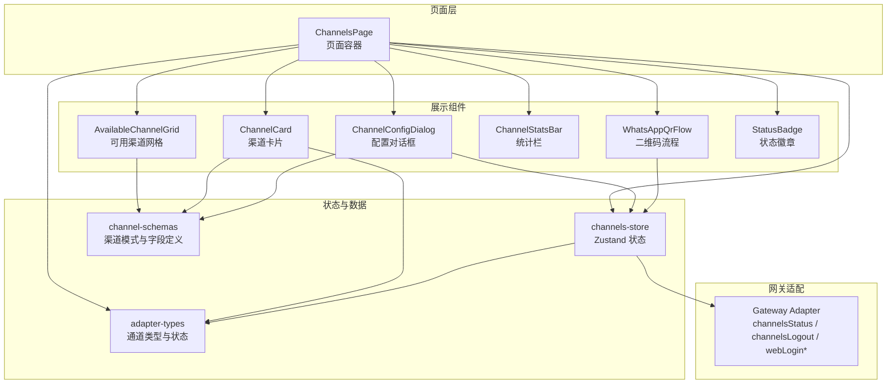
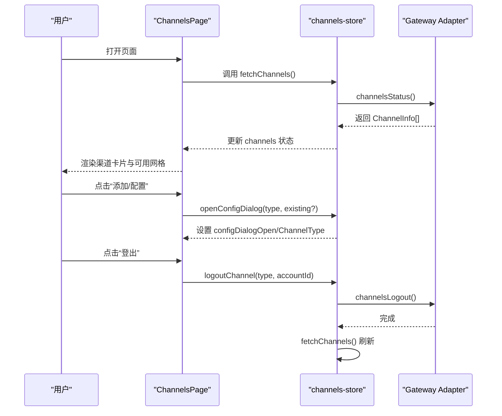
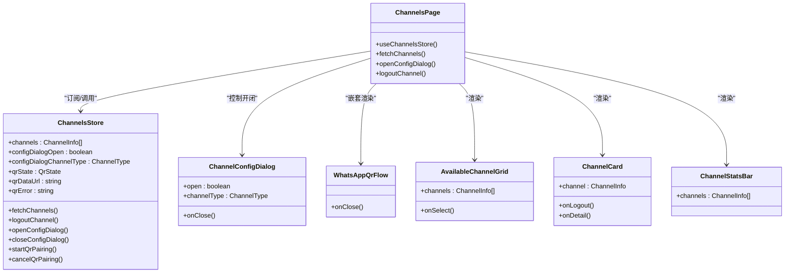

# 渠道管理

<cite>
**本文引用的文件**
- [AvailableChannelGrid.tsx](file://src/components/console/channels/AvailableChannelGrid.tsx)
- [ChannelCard.tsx](file://src/components/console/channels/ChannelCard.tsx)
- [ChannelConfigDialog.tsx](file://src/components/console/channels/ChannelConfigDialog.tsx)
- [ChannelStatsBar.tsx](file://src/components/console/channels/ChannelStatsBar.tsx)
- [WhatsAppQrFlow.tsx](file://src/components/console/channels/WhatsAppQrFlow.tsx)
- [channel-schemas.ts](file://src/lib/channel-schemas.ts)
- [channels-store.ts](file://src/store/console-stores/channels-store.ts)
- [adapter-types.ts](file://src/gateway/adapter-types.ts)
- [StatusBadge.tsx](file://src/components/console/shared/StatusBadge.tsx)
- [ChannelsPage.tsx](file://src/components/pages/ChannelsPage.tsx)
- [console.json](file://src/i18n/locales/en/console.json)
</cite>

## 目录
1. [简介](#简介)
2. [项目结构](#项目结构)
3. [核心组件](#核心组件)
4. [架构总览](#架构总览)
5. [详细组件分析](#详细组件分析)
6. [依赖关系分析](#依赖关系分析)
7. [性能考量](#性能考量)
8. [故障排查指南](#故障排查指南)
9. [结论](#结论)
10. [附录](#附录)

## 简介
本文件面向渠道管理界面，系统性梳理以下能力与实现细节：
- 可用渠道网格：渠道类型展示、图标、状态标识的设计与交互
- 渠道卡片组件：单个渠道的详情展示、连接状态、操作按钮
- 渠道配置对话框：通用表单、字段校验、保存逻辑；以及针对特定渠道的二维码配对流程
- 渠道统计栏：连接状态统计、错误计数、可扩展的性能指标占位
- WhatsApp 二维码绑定流程：从生成到扫描、状态同步的完整链路
- 生命周期管理、配置持久化、连接状态监控与故障处理机制
- 不同渠道类型的特殊处理逻辑与兼容性考虑

## 项目结构
渠道管理界面由页面容器、展示组件、状态管理与网关适配层组成，采用“页面容器 + 组合子组件 + 存储 + 类型定义”的分层设计。

图表来源
- [ChannelsPage.tsx:15-118](file://src/components/pages/ChannelsPage.tsx#L15-L118)
- [AvailableChannelGrid.tsx:11-52](file://src/components/console/channels/AvailableChannelGrid.tsx#L11-L52)
- [ChannelCard.tsx:20-75](file://src/components/console/channels/ChannelCard.tsx#L20-L75)
- [ChannelConfigDialog.tsx:14-129](file://src/components/console/channels/ChannelConfigDialog.tsx#L14-L129)
- [ChannelStatsBar.tsx:8-33](file://src/components/console/channels/ChannelStatsBar.tsx#L8-L33)
- [WhatsAppQrFlow.tsx:9-92](file://src/components/console/channels/WhatsAppQrFlow.tsx#L9-L92)
- [channels-store.ts:27-103](file://src/store/console-stores/channels-store.ts#L27-L103)
- [channel-schemas.ts:20-204](file://src/lib/channel-schemas.ts#L20-L204)
- [adapter-types.ts:4-33](file://src/gateway/adapter-types.ts#L4-L33)

章节来源
- [ChannelsPage.tsx:15-118](file://src/components/pages/ChannelsPage.tsx#L15-L118)
- [AvailableChannelGrid.tsx:11-52](file://src/components/console/channels/AvailableChannelGrid.tsx#L11-L52)
- [ChannelCard.tsx:20-75](file://src/components/console/channels/ChannelCard.tsx#L20-L75)
- [ChannelConfigDialog.tsx:14-129](file://src/components/console/channels/ChannelConfigDialog.tsx#L14-L129)
- [ChannelStatsBar.tsx:8-33](file://src/components/console/channels/ChannelStatsBar.tsx#L8-L33)
- [WhatsAppQrFlow.tsx:9-92](file://src/components/console/channels/WhatsAppQrFlow.tsx#L9-L92)
- [channels-store.ts:27-103](file://src/store/console-stores/channels-store.ts#L27-L103)
- [channel-schemas.ts:20-204](file://src/lib/channel-schemas.ts#L20-L204)
- [adapter-types.ts:4-33](file://src/gateway/adapter-types.ts#L4-L33)

## 核心组件
- 可用渠道网格：展示所有支持的渠道类型，根据是否已配置显示“已配置/添加”标签，点击后打开配置对话框
- 渠道卡片：展示单个渠道的名称、类型、连接状态、最近连接时间、错误信息及操作按钮
- 配置对话框：渲染对应渠道的字段表单，执行必填校验，支持密钥显隐切换；部分渠道（如 WhatsApp）走二维码配对流程
- 统计栏：统计总渠道数、已连接数、错误数
- WhatsApp 二维码流程：生成二维码、等待扫描、成功或失败反馈
- 状态徽章：统一的状态点与本地化标签展示
- 页面容器：拉取渠道列表、触发登出确认、控制对话框开闭

章节来源
- [AvailableChannelGrid.tsx:11-52](file://src/components/console/channels/AvailableChannelGrid.tsx#L11-L52)
- [ChannelCard.tsx:20-75](file://src/components/console/channels/ChannelCard.tsx#L20-L75)
- [ChannelConfigDialog.tsx:14-129](file://src/components/console/channels/ChannelConfigDialog.tsx#L14-L129)
- [ChannelStatsBar.tsx:8-33](file://src/components/console/channels/ChannelStatsBar.tsx#L8-L33)
- [WhatsAppQrFlow.tsx:9-92](file://src/components/console/channels/WhatsAppQrFlow.tsx#L9-L92)
- [StatusBadge.tsx:22-34](file://src/components/console/shared/StatusBadge.tsx#L22-L34)
- [ChannelsPage.tsx:15-118](file://src/components/pages/ChannelsPage.tsx#L15-L118)

## 架构总览
渠道管理的前端架构围绕 Zustand 状态仓库与网关适配器协作展开。页面容器负责发起数据请求与用户交互，状态仓库封装与网关的通信细节，组件通过状态驱动渲染。

图表来源
- [ChannelsPage.tsx:17-33](file://src/components/pages/ChannelsPage.tsx#L17-L33)
- [channels-store.ts:39-57](file://src/store/console-stores/channels-store.ts#L39-L57)
- [adapter-types.ts:19-33](file://src/gateway/adapter-types.ts#L19-L33)

## 详细组件分析

### 可用渠道网格（AvailableChannelGrid）
- 设计要点
  - 展示所有支持的渠道类型，使用图标与本地化名称
  - 已配置类型显示“已配置”标签，未配置类型显示“添加”标签
  - 点击类型触发选择回调，用于打开配置对话框
- 关键实现路径
  - 渲染网格与标签判断：[AvailableChannelGrid.tsx:20-48](file://src/components/console/channels/AvailableChannelGrid.tsx#L20-L48)
  - 使用渠道模式与图标：[channel-schemas.ts:20-204](file://src/lib/channel-schemas.ts#L20-L204)

章节来源
- [AvailableChannelGrid.tsx:11-52](file://src/components/console/channels/AvailableChannelGrid.tsx#L11-L52)
- [channel-schemas.ts:20-204](file://src/lib/channel-schemas.ts#L20-L204)

### 渠道卡片（ChannelCard）
- 展示内容
  - 渠道图标、名称、类型标签
  - 连接状态徽章与最近连接时间
  - 错误信息展示
  - 操作按钮：详情、登出（仅在已连接时）
- 状态映射
  - 连接状态到边框颜色的映射：connected/error/connecting/disconnected
- 关键实现路径
  - 卡片渲染与按钮逻辑：[ChannelCard.tsx:20-75](file://src/components/console/channels/ChannelCard.tsx#L20-L75)
  - 状态徽章组件复用：[StatusBadge.tsx:22-34](file://src/components/console/shared/StatusBadge.tsx#L22-L34)
  - 类型与状态定义：[adapter-types.ts:17-33](file://src/gateway/adapter-types.ts#L17-L33)

章节来源
- [ChannelCard.tsx:20-75](file://src/components/console/channels/ChannelCard.tsx#L20-L75)
- [StatusBadge.tsx:22-34](file://src/components/console/shared/StatusBadge.tsx#L22-L34)
- [adapter-types.ts:17-33](file://src/gateway/adapter-types.ts#L17-L33)

### 渠道配置对话框（ChannelConfigDialog）
- 通用表单
  - 根据渠道类型读取字段定义，渲染文本/密码/多行文本等输入
  - 必填字段校验，错误高亮与提示
  - 密钥显隐切换（密码输入框右侧眼睛图标）
- 特殊渠道：WhatsApp
  - 若渠道声明 hasQrFlow，则不渲染通用表单，而是直接进入二维码配对流程
- 关键实现路径
  - 对话框与字段渲染：[ChannelConfigDialog.tsx:14-129](file://src/components/console/channels/ChannelConfigDialog.tsx#L14-L129)
  - 字段类型与渲染分支：[ChannelConfigDialog.tsx:131-197](file://src/components/console/channels/ChannelConfigDialog.tsx#L131-L197)
  - 渠道模式与二维码标志：[channel-schemas.ts:12-18](file://src/lib/channel-schemas.ts#L12-L18)

章节来源
- [ChannelConfigDialog.tsx:14-129](file://src/components/console/channels/ChannelConfigDialog.tsx#L14-L129)
- [ChannelConfigDialog.tsx:131-197](file://src/components/console/channels/ChannelConfigDialog.tsx#L131-L197)
- [channel-schemas.ts:12-18](file://src/lib/channel-schemas.ts#L12-L18)

### 渠道统计栏（ChannelStatsBar）
- 统计维度
  - 总数、已连接数、错误数
- 渲染策略
  - 当存在错误时才展示错误计数
- 关键实现路径
  - 统计计算与渲染：[ChannelStatsBar.tsx:8-33](file://src/components/console/channels/ChannelStatsBar.tsx#L8-L33)

章节来源
- [ChannelStatsBar.tsx:8-33](file://src/components/console/channels/ChannelStatsBar.tsx#L8-L33)

### WhatsApp 二维码绑定流程（WhatsAppQrFlow）
- 流程阶段
  - idle/cancel：描述说明与开始配对按钮
  - loading：生成二维码中
  - qr/scanning：展示二维码、提示扫描、等待扫描状态
  - success：配对成功
  - error：配对失败，提供重试
- 状态机与行为
  - 开始配对：调用 webLoginStart(true) 获取二维码数据，随后 webLoginWait() 等待结果
  - 成功则刷新渠道列表，失败则记录错误消息
- 关键实现路径
  - 状态渲染与交互：[WhatsAppQrFlow.tsx:9-92](file://src/components/console/channels/WhatsAppQrFlow.tsx#L9-L92)
  - 状态机与调用链：[channels-store.ts:81-98](file://src/store/console-stores/channels-store.ts#L81-L98)

章节来源
- [WhatsAppQrFlow.tsx:9-92](file://src/components/console/channels/WhatsAppQrFlow.tsx#L9-L92)
- [channels-store.ts:81-98](file://src/store/console-stores/channels-store.ts#L81-L98)

### 页面容器（ChannelsPage）
- 职责
  - 初始化加载渠道列表
  - 渲染统计栏、渠道卡片、可用渠道网格
  - 控制配置对话框与登出确认弹窗
- 关键实现路径
  - 页面头部、加载/错误/空态处理：[ChannelsPage.tsx:42-66](file://src/components/pages/ChannelsPage.tsx#L42-L66)
  - 渲染卡片与网格、对话框与确认弹窗：[ChannelsPage.tsx:68-117](file://src/components/pages/ChannelsPage.tsx#L68-L117)

章节来源
- [ChannelsPage.tsx:15-118](file://src/components/pages/ChannelsPage.tsx#L15-L118)

## 依赖关系分析

图表来源
- [ChannelsPage.tsx:17-27](file://src/components/pages/ChannelsPage.tsx#L17-L27)
- [channels-store.ts:27-25](file://src/store/console-stores/channels-store.ts#L27-L25)
- [ChannelConfigDialog.tsx:8-12](file://src/components/console/channels/ChannelConfigDialog.tsx#L8-L12)
- [WhatsAppQrFlow.tsx:5-7](file://src/components/console/channels/WhatsAppQrFlow.tsx#L5-L7)
- [AvailableChannelGrid.tsx:6-9](file://src/components/console/channels/AvailableChannelGrid.tsx#L6-L9)
- [ChannelCard.tsx:7-11](file://src/components/console/channels/ChannelCard.tsx#L7-L11)
- [ChannelStatsBar.tsx:4-6](file://src/components/console/channels/ChannelStatsBar.tsx#L4-L6)

章节来源
- [ChannelsPage.tsx:17-27](file://src/components/pages/ChannelsPage.tsx#L17-L27)
- [channels-store.ts:27-25](file://src/store/console-stores/channels-store.ts#L27-L25)
- [ChannelConfigDialog.tsx:8-12](file://src/components/console/channels/ChannelConfigDialog.tsx#L8-L12)
- [WhatsAppQrFlow.tsx:5-7](file://src/components/console/channels/WhatsAppQrFlow.tsx#L5-L7)
- [AvailableChannelGrid.tsx:6-9](file://src/components/console/channels/AvailableChannelGrid.tsx#L6-L9)
- [ChannelCard.tsx:7-11](file://src/components/console/channels/ChannelCard.tsx#L7-L11)
- [ChannelStatsBar.tsx:4-6](file://src/components/console/channels/ChannelStatsBar.tsx#L4-L6)

## 性能考量
- 渲染优化
  - 使用键控列表（按渠道 id 渲染卡片），避免不必要的重排
  - 统计栏仅在有错误时渲染错误计数，减少 DOM 元素
- 网络与状态
  - 列表加载与错误状态分离，避免重复请求
  - 二维码配对流程中仅在成功后刷新列表，降低频繁轮询
- 输入体验
  - 密钥显隐切换使用内存状态，避免额外网络请求
  - 表单必填校验在保存时进行，减少实时校验开销

## 故障排查指南
- 渠道列表为空或加载失败
  - 检查网关连接状态与令牌配置
  - 查看错误状态提示并重试刷新
- 登出后未生效
  - 确认已调用登出接口并刷新列表
  - 检查返回的错误信息
- WhatsApp 二维码配对失败
  - 重新开始配对，确保手机端扫码成功
  - 失败时查看错误消息并重试
- 字段校验失败
  - 确认必填字段已填写
  - 密钥类字段注意显隐切换与空格处理

章节来源
- [ChannelsPage.tsx:55-66](file://src/components/pages/ChannelsPage.tsx#L55-L66)
- [channels-store.ts:50-57](file://src/store/console-stores/channels-store.ts#L50-L57)
- [WhatsAppQrFlow.tsx:78-91](file://src/components/console/channels/WhatsAppQrFlow.tsx#L78-L91)
- [ChannelConfigDialog.tsx:58-71](file://src/components/console/channels/ChannelConfigDialog.tsx#L58-L71)

## 结论
渠道管理界面以清晰的组件分层与状态驱动实现了“可见、可配、可连、可观测”的目标。通过统一的渠道模式定义与状态管理，系统能够稳定地支撑多种渠道类型的接入与运维，同时为后续扩展新的渠道类型与增强统计能力提供了良好的基础。

## 附录

### 渠道类型与字段定义
- 支持的渠道类型：见类型定义
- 字段类型：文本、密码、下拉、多行文本
- 特殊处理：部分渠道（如 WhatsApp）启用二维码配对流程

章节来源
- [adapter-types.ts:4-15](file://src/gateway/adapter-types.ts#L4-L15)
- [channel-schemas.ts:3-10](file://src/lib/channel-schemas.ts#L3-L10)
- [channel-schemas.ts:56-62](file://src/lib/channel-schemas.ts#L56-L62)

### 国际化键值参考
- 渠道标题、描述、统计文案、配置对话框文案、二维码流程文案、登出确认文案等

章节来源
- [console.json:38-119](file://src/i18n/locales/en/console.json#L38-L119)