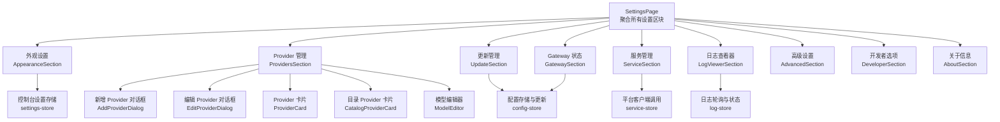
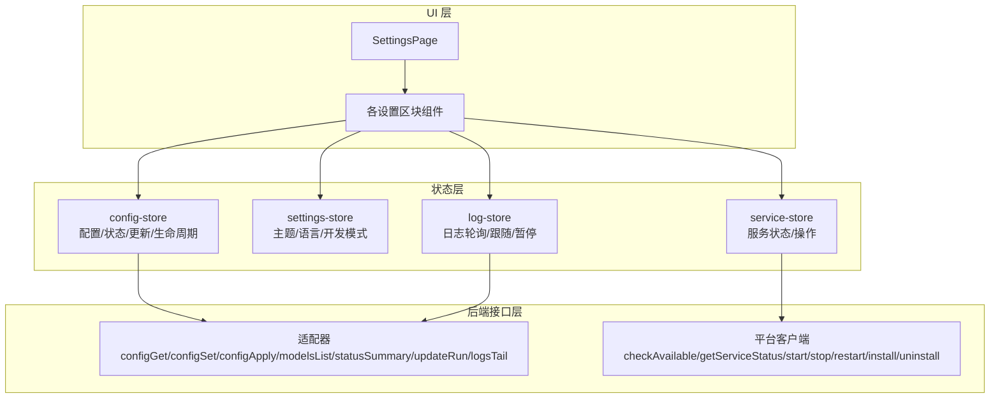
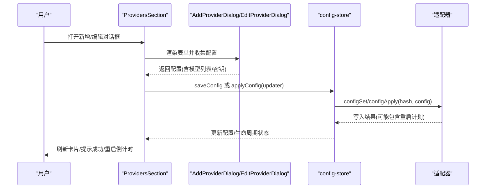
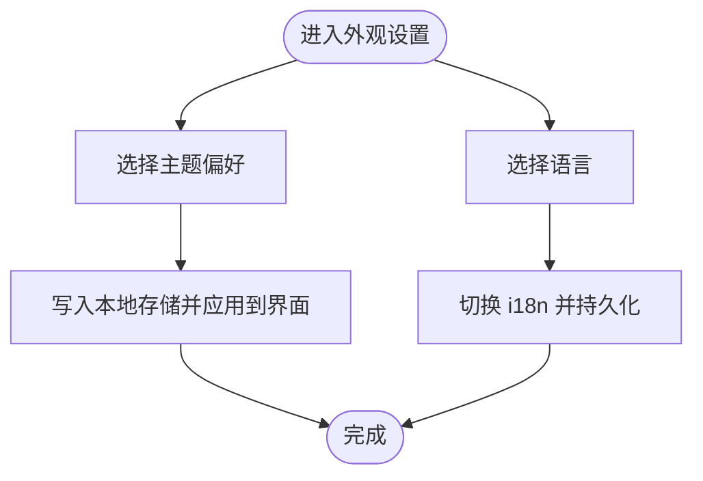
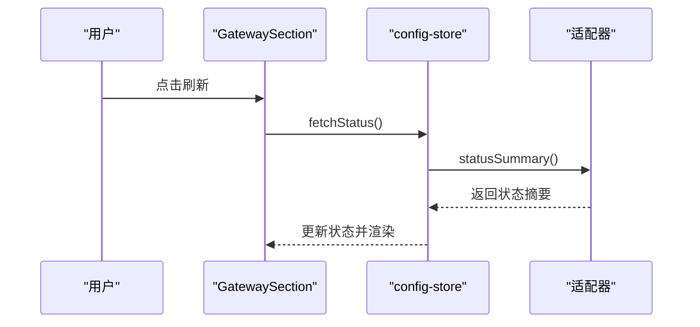
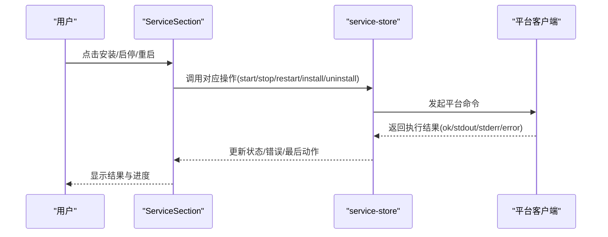
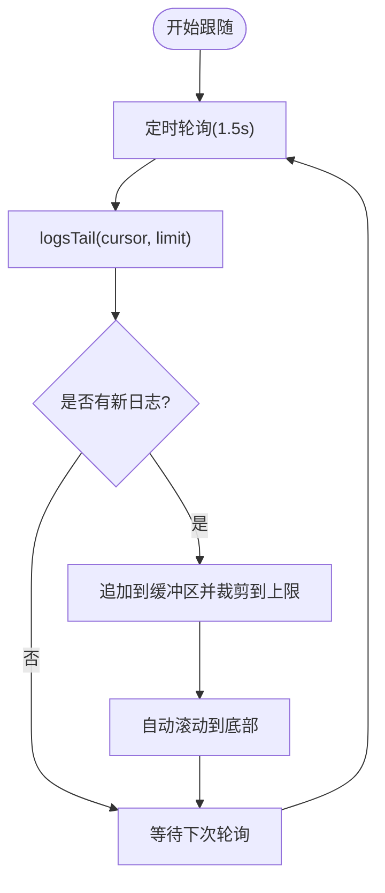
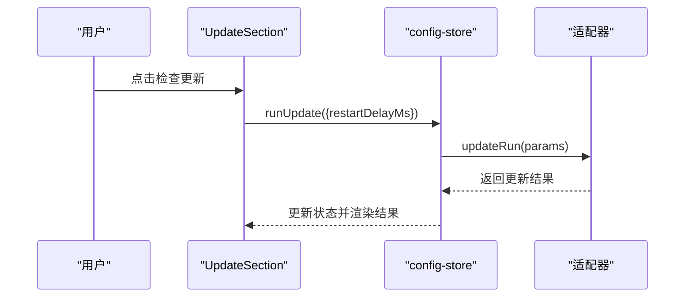
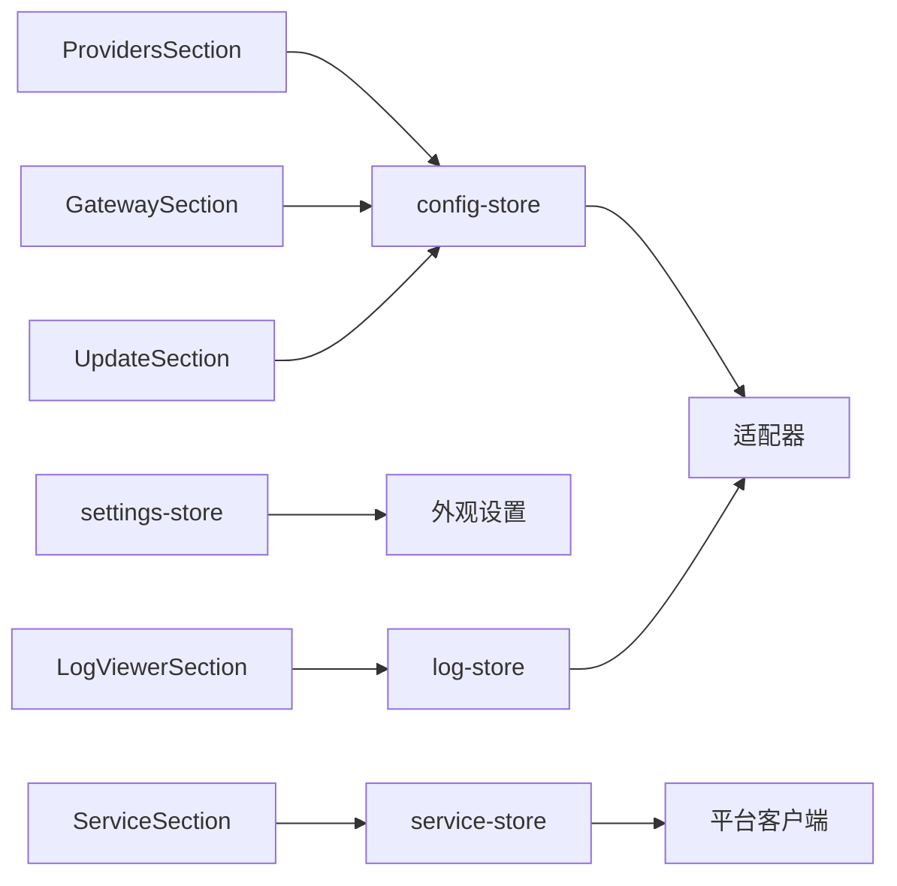

# 系统设置

<cite>
**本文引用的文件**
- [SettingsPage.tsx](file://src/components/pages/SettingsPage.tsx)
- [ProvidersSection.tsx](file://src/components/console/settings/ProvidersSection.tsx)
- [AppearanceSection.tsx](file://src/components/console/settings/AppearanceSection.tsx)
- [GatewaySection.tsx](file://src/components/console/settings/GatewaySection.tsx)
- [ServiceSection.tsx](file://src/components/console/settings/ServiceSection.tsx)
- [DeveloperSection.tsx](file://src/components/console/settings/DeveloperSection.tsx)
- [AdvancedSection.tsx](file://src/components/console/settings/AdvancedSection.tsx)
- [UpdateSection.tsx](file://src/components/console/settings/UpdateSection.tsx)
- [LogViewerSection.tsx](file://src/components/console/settings/LogViewerSection.tsx)
- [AboutSection.tsx](file://src/components/console/settings/AboutSection.tsx)
- [AddProviderDialog.tsx](file://src/components/console/settings/AddProviderDialog.tsx)
- [EditProviderDialog.tsx](file://src/components/console/settings/EditProviderDialog.tsx)
- [ProviderCard.tsx](file://src/components/console/settings/ProviderCard.tsx)
- [CatalogProviderCard.tsx](file://src/components/console/settings/CatalogProviderCard.tsx)
- [ModelEditor.tsx](file://src/components/console/settings/ModelEditor.tsx)
- [config-store.ts](file://src/store/console-stores/config-store.ts)
- [settings-store.ts](file://src/store/console-stores/settings-store.ts)
- [service-store.ts](file://src/store/console-stores/service-store.ts)
- [log-store.ts](file://src/store/console-stores/log-store.ts)
</cite>

## 目录
1. [简介](#简介)
2. [项目结构](#项目结构)
3. [核心组件](#核心组件)
4. [架构总览](#架构总览)
5. [详细组件分析](#详细组件分析)
6. [依赖关系分析](#依赖关系分析)
7. [性能考量](#性能考量)
8. [故障排查指南](#故障排查指南)
9. [结论](#结论)
10. [附录](#附录)

## 简介
本文件为系统设置界面的功能文档，覆盖 Provider 管理（模型提供商）、外观设置（主题与语言）、Gateway 配置（连接与状态）、服务管理（安装、启停、状态）、开发者选项（调试与配置）、高级设置（开发模式开关）、更新管理（版本检查与更新结果）、日志查看器（实时日志流与过滤）以及关于信息（版本与文档链接）。文档基于前端组件与状态存储实现进行梳理，并提供可视化图示帮助理解。

## 项目结构
系统设置页面由 SettingsPage 聚合多个子设置区块，每个区块负责一类配置能力；配置读写通过 config-store 与后端适配器交互；部分能力依赖平台客户端与日志轮询。

图表来源
- [SettingsPage.tsx:16-54](file://src/components/pages/SettingsPage.tsx#L16-L54)
- [ProvidersSection.tsx:35-198](file://src/components/console/settings/ProvidersSection.tsx#L35-L198)
- [AppearanceSection.tsx:24-90](file://src/components/console/settings/AppearanceSection.tsx#L24-L90)
- [GatewaySection.tsx:5-65](file://src/components/console/settings/GatewaySection.tsx#L5-L65)
- [ServiceSection.tsx:15-227](file://src/components/console/settings/ServiceSection.tsx#L15-L227)
- [LogViewerSection.tsx:6-142](file://src/components/console/settings/LogViewerSection.tsx#L6-L142)
- [UpdateSection.tsx:7-116](file://src/components/console/settings/UpdateSection.tsx#L7-L116)
- [AdvancedSection.tsx:4-42](file://src/components/console/settings/AdvancedSection.tsx#L4-L42)
- [DeveloperSection.tsx:7-86](file://src/components/console/settings/DeveloperSection.tsx#L7-L86)
- [AboutSection.tsx:5-51](file://src/components/console/settings/AboutSection.tsx#L5-L51)
- [AddProviderDialog.tsx:21-258](file://src/components/console/settings/AddProviderDialog.tsx#L21-L258)
- [EditProviderDialog.tsx:23-192](file://src/components/console/settings/EditProviderDialog.tsx#L23-L192)
- [ProviderCard.tsx:12-126](file://src/components/console/settings/ProviderCard.tsx#L12-L126)
- [CatalogProviderCard.tsx:11-87](file://src/components/console/settings/CatalogProviderCard.tsx#L11-L87)
- [ModelEditor.tsx:23-380](file://src/components/console/settings/ModelEditor.tsx#L23-L380)
- [config-store.ts:93-400](file://src/store/console-stores/config-store.ts#L93-L400)
- [settings-store.ts:31-50](file://src/store/console-stores/settings-store.ts#L31-L50)
- [service-store.ts:42-204](file://src/store/console-stores/service-store.ts#L42-L204)
- [log-store.ts:60-107](file://src/store/console-stores/log-store.ts#L60-L107)

章节来源
- [SettingsPage.tsx:16-54](file://src/components/pages/SettingsPage.tsx#L16-L54)

## 核心组件
- 设置页聚合器：加载配置与状态，按顺序渲染各设置区块，并在开发模式下显示开发者选项。
- Provider 管理：支持新增、编辑、删除、应用/保存配置；展示已配置与系统发现的模型目录。
- 外观设置：主题（浅色/深色/跟随系统）、语言（中/英）切换。
- Gateway 状态：刷新获取版本、端口、运行时长、模式、Node 版本与平台等信息。
- 服务管理：平台可用性检测、服务安装/卸载、启停/重启、状态查询与确认对话。
- 日志查看器：实时滚动、暂停/恢复、停止、清空、新日志指示与错误提示。
- 更新管理：当前版本、更新通道、检查更新、执行更新并展示结果。
- 高级设置：开发模式开关（用于解锁开发者选项）。
- 开发者选项：网关令牌状态、配置路径、WebSocket 地址、原始配置复制与展开。
- 关于信息：应用名称、标语、版本号与文档/仓库链接。

章节来源
- [SettingsPage.tsx:16-54](file://src/components/pages/SettingsPage.tsx#L16-L54)
- [ProvidersSection.tsx:35-198](file://src/components/console/settings/ProvidersSection.tsx#L35-L198)
- [AppearanceSection.tsx:24-90](file://src/components/console/settings/AppearanceSection.tsx#L24-L90)
- [GatewaySection.tsx:5-65](file://src/components/console/settings/GatewaySection.tsx#L5-L65)
- [ServiceSection.tsx:15-227](file://src/components/console/settings/ServiceSection.tsx#L15-L227)
- [LogViewerSection.tsx:6-142](file://src/components/console/settings/LogViewerSection.tsx#L6-L142)
- [UpdateSection.tsx:7-116](file://src/components/console/settings/UpdateSection.tsx#L7-L116)
- [AdvancedSection.tsx:4-42](file://src/components/console/settings/AdvancedSection.tsx#L4-L42)
- [DeveloperSection.tsx:7-86](file://src/components/console/settings/DeveloperSection.tsx#L7-L86)
- [AboutSection.tsx:5-51](file://src/components/console/settings/AboutSection.tsx#L5-L51)

## 架构总览
设置功能围绕“页面组件 + 子区块组件 + 状态存储 + 后端适配器”的分层设计：

图表来源
- [config-store.ts:93-400](file://src/store/console-stores/config-store.ts#L93-L400)
- [settings-store.ts:31-50](file://src/store/console-stores/settings-store.ts#L31-L50)
- [service-store.ts:42-204](file://src/store/console-stores/service-store.ts#L42-L204)
- [log-store.ts:60-107](file://src/store/console-stores/log-store.ts#L60-L107)

## 详细组件分析

### Provider 管理
- 功能要点
  - 新增 Provider：选择类型、填写 Provider ID、API 类型、Base URL、可选 API Key，配置模型列表（含推理标记、输入类型、上下文窗口、最大输出、成本、兼容性字段等），支持“保存”或“保存并重启应用”两种意图。
  - 编辑 Provider：修改 API 类型/Base URL/API Key，更新模型列表，同样支持“保存/应用”。
  - 删除 Provider：确认对话框，移除对应配置。
  - 展示：已配置 Provider 卡片与系统发现的目录 Provider 卡片，标注模型数量、推理/图像输入标记、是否需要 API Key。
  - 模型编辑器：支持折叠/展开、高级兼容性配置（思维格式、maxTokens 字段、多种特性开关）。
- 数据流与状态
  - 通过 config-store 的 fetchConfig/saveConfig/applyConfig/patchConfig 与后端适配器交互，支持热重载或重启生效。
  - 生命周期状态（如“立即生效/已保存/需重启/CLI重启/重启中/完成/断开/重连中”）用于指导用户反馈与后续行为。
- 安全与隐私
  - API Key 输入支持显隐切换；编辑时若已有密钥存在，保留原值不强制要求再次输入。

图表来源
- [ProvidersSection.tsx:59-118](file://src/components/console/settings/ProvidersSection.tsx#L59-L118)
- [AddProviderDialog.tsx:62-71](file://src/components/console/settings/AddProviderDialog.tsx#L62-L71)
- [EditProviderDialog.tsx:56-64](file://src/components/console/settings/EditProviderDialog.tsx#L56-L64)
- [config-store.ts:235-319](file://src/store/console-stores/config-store.ts#L235-L319)

章节来源
- [ProvidersSection.tsx:35-198](file://src/components/console/settings/ProvidersSection.tsx#L35-L198)
- [AddProviderDialog.tsx:21-258](file://src/components/console/settings/AddProviderDialog.tsx#L21-L258)
- [EditProviderDialog.tsx:23-192](file://src/components/console/settings/EditProviderDialog.tsx#L23-L192)
- [ProviderCard.tsx:12-126](file://src/components/console/settings/ProviderCard.tsx#L12-L126)
- [CatalogProviderCard.tsx:11-87](file://src/components/console/settings/CatalogProviderCard.tsx#L11-L87)
- [ModelEditor.tsx:23-380](file://src/components/console/settings/ModelEditor.tsx#L23-L380)
- [config-store.ts:93-400](file://src/store/console-stores/config-store.ts#L93-L400)

### 外观设置
- 主题切换：支持浅色/深色/跟随系统三种偏好，系统主题解析遵循浏览器 prefers-color-scheme。
- 语言切换：支持中/英，即时切换 i18n 语言。
- 状态持久化：主题与语言偏好存储于本地，下次进入保持一致。

图表来源
- [AppearanceSection.tsx:24-90](file://src/components/console/settings/AppearanceSection.tsx#L24-L90)
- [settings-store.ts:31-50](file://src/store/console-stores/settings-store.ts#L31-L50)

章节来源
- [AppearanceSection.tsx:24-90](file://src/components/console/settings/AppearanceSection.tsx#L24-L90)
- [settings-store.ts:31-50](file://src/store/console-stores/settings-store.ts#L31-L50)

### Gateway 配置
- 能力概述：提供刷新按钮以拉取 Gateway 状态摘要（版本、端口、运行时长、模式、Node 版本、平台），并在错误时提示未连接。
- 使用场景：诊断连接问题、确认运行参数与环境信息。

图表来源
- [GatewaySection.tsx:5-65](file://src/components/console/settings/GatewaySection.tsx#L5-L65)
- [config-store.ts:361-370](file://src/store/console-stores/config-store.ts#L361-L370)

章节来源
- [GatewaySection.tsx:5-65](file://src/components/console/settings/GatewaySection.tsx#L5-L65)
- [config-store.ts:361-370](file://src/store/console-stores/config-store.ts#L361-L370)

### 服务管理
- 能力概述：检测平台可用性、查询服务状态（已安装/运行/PID/端口）、安装/卸载服务、启停/重启服务；对停止/重启提供二次确认。
- 错误处理：统一错误提示与最后一次动作消息；平台不可用时引导用户检查。
- 自动启动：提供自动重试启动流程。

图表来源
- [ServiceSection.tsx:15-227](file://src/components/console/settings/ServiceSection.tsx#L15-L227)
- [service-store.ts:42-204](file://src/store/console-stores/service-store.ts#L42-L204)

章节来源
- [ServiceSection.tsx:15-227](file://src/components/console/settings/ServiceSection.tsx#L15-L227)
- [service-store.ts:42-204](file://src/store/console-stores/service-store.ts#L42-L204)

### 日志查看器
- 能力概述：启动/停止跟随、暂停/恢复、清空日志；自动滚动至底部；标签隐藏时暂停轮询；新日志到达时显示“前往最新”按钮；按关键字高亮颜色（错误/警告/调试）。
- 性能：固定最大行数与轮询间隔，避免内存膨胀；支持游标增量拉取。

图表来源
- [LogViewerSection.tsx:6-142](file://src/components/console/settings/LogViewerSection.tsx#L6-L142)
- [log-store.ts:24-58](file://src/store/console-stores/log-store.ts#L24-L58)

章节来源
- [LogViewerSection.tsx:6-142](file://src/components/console/settings/LogViewerSection.tsx#L6-L142)
- [log-store.ts:60-107](file://src/store/console-stores/log-store.ts#L60-L107)

### 更新管理
- 能力概述：显示当前版本与更新通道；点击检查更新弹出确认对话框；执行更新后展示结果（成功/无需更新/错误）。
- 交互：支持带重启延迟的更新执行，结果包含前后版本对比与原因说明。

图表来源
- [UpdateSection.tsx:7-116](file://src/components/console/settings/UpdateSection.tsx#L7-L116)
- [config-store.ts:383-399](file://src/store/console-stores/config-store.ts#L383-L399)

章节来源
- [UpdateSection.tsx:7-116](file://src/components/console/settings/UpdateSection.tsx#L7-L116)
- [config-store.ts:383-399](file://src/store/console-stores/config-store.ts#L383-L399)

### 高级设置
- 能力概述：开发模式开关，用于解锁开发者选项区块。
- 状态持久化：本地存储记录开关状态。

章节来源
- [AdvancedSection.tsx:4-42](file://src/components/console/settings/AdvancedSection.tsx#L4-L42)
- [settings-store.ts:31-50](file://src/store/console-stores/settings-store.ts#L31-L50)

### 开发者选项
- 能力概述：展示网关令牌状态（是否已配置）、配置路径与 WebSocket URL；支持复制到剪贴板；可展开显示原始配置文本。
- 安全提示：令牌值使用占位符标识已配置状态，避免明文泄露。

章节来源
- [DeveloperSection.tsx:7-86](file://src/components/console/settings/DeveloperSection.tsx#L7-L86)

### 关于信息
- 能力概述：显示应用名称、标语、版本号；提供文档与仓库链接。

章节来源
- [AboutSection.tsx:5-51](file://src/components/console/settings/AboutSection.tsx#L5-L51)

## 依赖关系分析
- 组件耦合
  - SettingsPage 作为聚合器，仅依赖子区块组件与若干存储钩子，低耦合高内聚。
  - Provider 管理相关组件共享 Provider 类型元数据与模型编辑器，形成复用。
- 状态存储
  - config-store：集中管理配置快照、哈希、原始文本、schema 提示、状态摘要、更新结果、模型目录、重启与生命周期状态。
  - settings-store：控制台外观与语言偏好。
  - service-store：服务状态与平台操作封装。
  - log-store：日志轮询与 UI 控制。
- 外部依赖
  - 适配器：提供配置读写、状态摘要、模型目录、更新执行、日志轮询等能力。
  - 平台客户端：提供平台可用性检测与服务生命周期操作。

图表来源
- [config-store.ts:93-400](file://src/store/console-stores/config-store.ts#L93-L400)
- [settings-store.ts:31-50](file://src/store/console-stores/settings-store.ts#L31-L50)
- [service-store.ts:42-204](file://src/store/console-stores/service-store.ts#L42-L204)
- [log-store.ts:60-107](file://src/store/console-stores/log-store.ts#L60-L107)

章节来源
- [config-store.ts:93-400](file://src/store/console-stores/config-store.ts#L93-L400)
- [settings-store.ts:31-50](file://src/store/console-stores/settings-store.ts#L31-L50)
- [service-store.ts:42-204](file://src/store/console-stores/service-store.ts#L42-L204)
- [log-store.ts:60-107](file://src/store/console-stores/log-store.ts#L60-L107)

## 性能考量
- 日志轮询
  - 固定轮询间隔与最大行数，避免长时间运行导致内存增长。
  - 标签页隐藏时自动暂停轮询，恢复时继续，降低资源占用。
- 配置写入
  - 支持“保存”与“应用”两种方式，应用会触发重启计划；保存失败时自动重新拉取配置，避免 UI 与后端状态不一致。
- 服务操作
  - 启动/重启后短暂延时再拉取状态，减少 UI 抖动与重复请求。

[本节为通用建议，不直接分析具体文件]

## 故障排查指南
- 外观设置无效
  - 检查本地存储键值是否正确写入；确认 i18n 初始化与切换逻辑。
- Provider 配置未生效
  - 查看生命周期状态（立即生效/需重启/CLI重启），必要时执行“应用并重启”或手动重启服务。
  - 若提示配置已变更，重新拉取配置后重试。
- Gateway 无法连接
  - 使用刷新按钮获取状态摘要；关注错误提示；确认平台可用性与服务运行状态。
- 服务启停失败
  - 查看最后动作消息（stdout/stderr），根据返回错误定位问题；必要时尝试安装/卸载后重试。
- 日志无输出
  - 确认已启动跟随；检查暂停状态；核对轮询间隔与最大行数限制；标签页隐藏时会自动暂停。
- 更新失败
  - 查看更新结果中的原因说明；确认网络与更新通道配置；必要时重试或回滚。

章节来源
- [config-store.ts:235-349](file://src/store/console-stores/config-store.ts#L235-L349)
- [service-store.ts:95-203](file://src/store/console-stores/service-store.ts#L95-L203)
- [log-store.ts:67-107](file://src/store/console-stores/log-store.ts#L67-L107)
- [UpdateSection.tsx:74-104](file://src/components/console/settings/UpdateSection.tsx#L74-L104)

## 结论
系统设置界面通过清晰的区块划分与完善的生命周期管理，提供了从 Provider 管理到服务运维、从外观定制到日志监控的全链路配置体验。配合本地存储与后端适配器，既保证了易用性也兼顾了安全性与稳定性。

[本节为总结性内容，不直接分析具体文件]

## 附录
- 常用交互与快捷入口
  - Provider：新增/编辑/删除/应用/保存
  - 外观：主题/语言切换
  - Gateway：刷新状态
  - 服务：安装/启停/重启/卸载
  - 日志：跟随/暂停/停止/清空/跳转最新
  - 更新：检查更新/查看结果
  - 开发者：复制配置路径/WS 地址/原始配置
- 最佳实践
  - 修改 Provider 后优先使用“保存并重启”，确保配置立即生效。
  - 在生产环境谨慎开启开发模式，避免暴露敏感调试信息。
  - 定期检查更新并关注更新结果，必要时进行回滚。

[本节为补充说明，不直接分析具体文件]