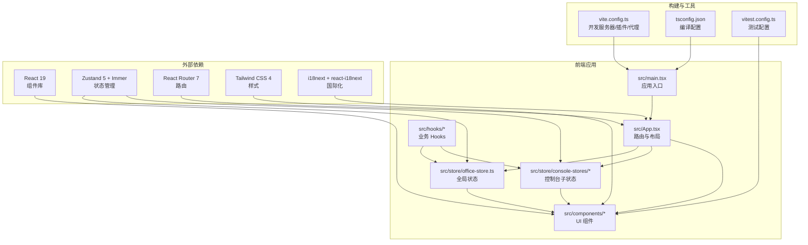
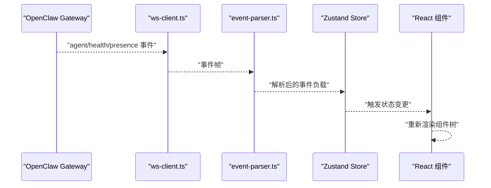
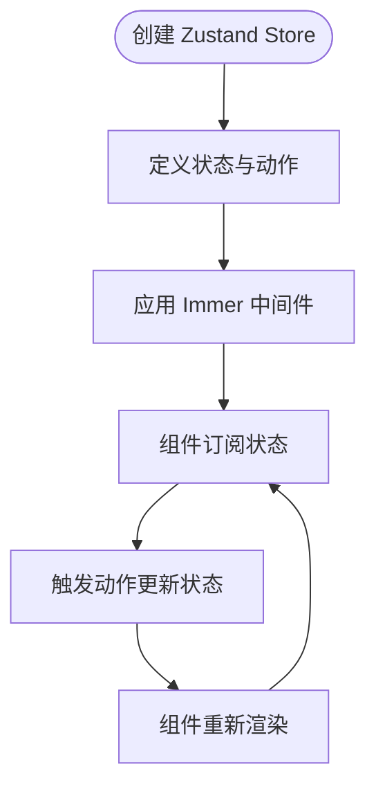
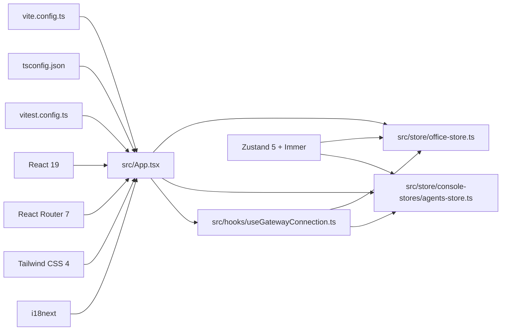

# 技术选型决策

<cite>
**本文档引用的文件**
- [package.json](file://package.json)
- [vite.config.ts](file://vite.config.ts)
- [tsconfig.json](file://tsconfig.json)
- [src/main.tsx](file://src/main.tsx)
- [src/App.tsx](file://src/App.tsx)
- [src/store/office-store.ts](file://src/store/office-store.ts)
- [src/store/console-stores/agents-store.ts](file://src/store/console-stores/agents-store.ts)
- [src/hooks/useGatewayConnection.ts](file://src/hooks/useGatewayConnection.ts)
- [vitest.config.ts](file://vitest.config.ts)
- [src/lib/local-persistence.ts](file://src/lib/local-persistence.ts)
- [README.md](file://README.md)
</cite>

## 目录
1. [引言](#引言)
2. [项目结构](#项目结构)
3. [核心组件](#核心组件)
4. [架构总览](#架构总览)
5. [详细组件分析](#详细组件分析)
6. [依赖关系分析](#依赖关系分析)
7. [性能考量](#性能考量)
8. [故障排查指南](#故障排查指南)
9. [结论](#结论)
10. [附录](#附录)

## 引言
本文件围绕 OpenClaw Office 的技术选型决策进行系统化梳理，重点解释以下关键技术栈的选择理由与实施细节：
- React 19：作为前端框架，如何支撑复杂 2D 动画场景与高并发事件驱动的可视化需求
- TypeScript：如何在大型前端项目中提升类型安全与开发体验
- Vite 6：如何提供快速开发、热重载与现代化构建能力
- Zustand 5：如何替代 Redux，实现更轻量、高性能的状态管理

同时，本文将给出版本兼容性说明、升级路径规划、替代方案对比、技术债务评估与未来演进趋势分析，帮助团队做出可持续的技术决策。

## 项目结构
OpenClaw Office 采用模块化的前端架构，结合 React 19 的函数式组件与 Hooks，配合 Zustand 5 实现集中式状态管理。项目通过 Vite 6 提供开发与构建能力，TypeScript 提供类型安全保障，测试使用 Vitest + jsdom。

图表来源
- [src/main.tsx:1-15](file://src/main.tsx#L1-L15)
- [src/App.tsx:1-124](file://src/App.tsx#L1-L124)
- [vite.config.ts:342-382](file://vite.config.ts#L342-L382)
- [tsconfig.json:1-29](file://tsconfig.json#L1-L29)
- [vitest.config.ts:1-20](file://vitest.config.ts#L1-L20)

章节来源
- [README.md:63-76](file://README.md#L63-L76)
- [package.json:49-78](file://package.json#L49-L78)

## 核心组件
- 应用入口与路由：应用通过 HashRouter 包裹，主入口负责挂载根组件与全局样式，路由层承载页面级组件与 2D 办公室场景。
- 状态管理：全局 office-store 使用 Zustand 5 + Immer，提供 Agent 状态、事件历史、主题、聊天 dock 等状态；控制台子状态（如 agents-store）同样采用 Zustand，职责清晰、边界明确。
- 事件处理：通过 useGatewayConnection Hook 建立 WebSocket 连接，接收 Gateway 事件并通过 Zustand store 更新 UI。
- 构建与测试：Vite 6 提供开发服务器与代理，TypeScript 提供严格类型检查，Vitest 提供 DOM 环境下的单元测试。

章节来源
- [src/main.tsx:1-15](file://src/main.tsx#L1-L15)
- [src/App.tsx:1-124](file://src/App.tsx#L1-L124)
- [src/store/office-store.ts:1-800](file://src/store/office-store.ts#L1-L800)
- [src/store/console-stores/agents-store.ts:1-642](file://src/store/console-stores/agents-store.ts#L1-L642)
- [src/hooks/useGatewayConnection.ts:1-238](file://src/hooks/useGatewayConnection.ts#L1-L238)
- [vite.config.ts:342-382](file://vite.config.ts#L342-L382)
- [tsconfig.json:1-29](file://tsconfig.json#L1-L29)
- [vitest.config.ts:1-20](file://vitest.config.ts#L1-L20)

## 架构总览
OpenClaw Office 的前端架构以“事件驱动 + 状态管理”为核心，数据流从 Gateway 通过 WebSocket 到前端解析，再到 Zustand store，最终驱动 React 组件渲染。路由层负责页面级视图切换，2D 办公室场景与控制台页面并行存在。

图表来源
- [src/hooks/useGatewayConnection.ts:113-126](file://src/hooks/useGatewayConnection.ts#L113-L126)
- [src/store/office-store.ts:762-800](file://src/store/office-store.ts#L762-L800)

章节来源
- [README.md:274-291](file://README.md#L274-L291)

## 详细组件分析

### React 19 选型分析
- 新特性支持
  - 函数式组件与 Hooks：项目广泛使用 useState、useEffect、useMemo、useCallback 等，配合自定义 Hooks（如 useGatewayConnection、useResponsive）实现清晰的业务逻辑分离。
  - 并发渲染与 Suspense：React 19 在并发渲染方面有改进，有助于在高频率事件驱动场景中保持 UI 响应性。
- 性能优势
  - 更小的包体积与更快的渲染：在复杂 2D 动画场景中，减少不必要的重渲染，提升整体性能。
  - 事件优先级与调度：在大量 Agent 状态变化时，能够更好地调度渲染优先级。
- 社区与生态
  - React 生态成熟，与 TypeScript、Vite、Tailwind CSS 等工具链无缝集成。
  - 与 React Router 7 的良好兼容性，满足多页面与路由切换需求。
- 学习曲线与维护性
  - 对现有 React 开发者友好，迁移成本低；类型系统与现代构建工具进一步降低维护成本。

章节来源
- [src/main.tsx:1-15](file://src/main.tsx#L1-L15)
- [src/App.tsx:1-124](file://src/App.tsx#L1-L124)
- [package.json:55-59](file://package.json#L55-L59)

### TypeScript 选型分析
- 类型安全
  - 严格的编译配置（tsconfig.json）开启严格模式、未使用局部变量与参数检查，有效减少运行时错误。
  - 通过类型别名与接口约束 store、事件、路由等关键数据结构，保证跨模块一致性。
- 开发体验
  - IDE 智能提示与重构能力显著提升开发效率；类型推导在复杂状态管理中尤为关键。
- 版本与兼容性
  - TypeScript 5.8 与 ES2022/ESNext 模块解析配合，适配现代浏览器与 Node.js 环境。
- 替代方案对比
  - JavaScript：在大型项目中难以保障类型安全与可维护性。
  - Flow/ReasonML：生态不如 TypeScript 成熟，迁移成本高。

章节来源
- [tsconfig.json:1-29](file://tsconfig.json#L1-L29)
- [src/store/office-store.ts:7-36](file://src/store/office-store.ts#L7-L36)
- [src/store/console-stores/agents-store.ts:5-24](file://src/store/console-stores/agents-store.ts#L5-L24)

### Vite 6 选型分析
- 快速开发与热重载
  - 开发服务器端口 5180，代理 Gateway WebSocket，支持热重载与即时反馈，显著提升开发效率。
  - 插件体系完善，集成 React 插件、Tailwind CSS 插件与自定义中间件（聊天缓存 API、工作区技能 API）。
- 构建优化
  - 生产构建与类型检查并行，提升 CI/CD 效率；路径别名与环境变量配置便于多环境部署。
- 社区与生态
  - 与 React 19、TypeScript、Tailwind CSS 生态高度契合，插件生态丰富。
- 学习曲线与维护性
  - 配置简洁直观，易于上手；插件扩展性强，适合持续演进。
- 升级路径规划
  - 从 Vite 5 升级至 Vite 6：关注插件 API 变更与构建产物差异，逐步验证代理与中间件行为。

章节来源
- [vite.config.ts:342-382](file://vite.config.ts#L342-L382)
- [package.json:35-48](file://package.json#L35-L48)

### Zustand 5 选型分析
- 简单易用
  - 以函数式 API 定义 store，无需 Provider 包裹，使用便捷；Immer 中间件简化不可变更新。
- 性能更好
  - 相比 Redux，Zustand 减少样板代码与中间件开销，在高频事件驱动场景中表现更优。
- 与 Immer 结合
  - 通过 immer 中间件，允许直接修改状态对象，同时保持不可变语义，降低心智负担。
- 替代方案对比
  - Redux：功能强大但样板代码多，对小型到中型项目显得冗余。
  - Jotai/Valtio：各有特色，但 Zustand 在易用性与性能之间取得平衡。
- 升级路径规划
  - 从 Zustand 4 升级至 5：关注 API 变更与中间件兼容性，逐步迁移 store 定义。

图表来源
- [src/store/office-store.ts:217-240](file://src/store/office-store.ts#L217-L240)
- [src/store/console-stores/agents-store.ts:141-164](file://src/store/console-stores/agents-store.ts#L141-L164)

章节来源
- [src/store/office-store.ts:1-800](file://src/store/office-store.ts#L1-L800)
- [src/store/console-stores/agents-store.ts:1-642](file://src/store/console-stores/agents-store.ts#L1-L642)

## 依赖关系分析
- 组件与状态
  - App 与页面组件依赖 office-store 与控制台子 store；Hooks 通过 store API 与 Gateway 交互。
- 构建与测试
  - Vite 配置与 TypeScript 编译配置相互配合；Vitest 配置使用 jsdom 环境，覆盖组件与业务逻辑测试。
- 外部依赖
  - React 19、Zustand 5、React Router 7、Tailwind CSS 4、i18next 等共同构成前端技术栈。

图表来源
- [src/App.tsx:1-124](file://src/App.tsx#L1-L124)
- [src/store/office-store.ts:1-800](file://src/store/office-store.ts#L1-L800)
- [src/store/console-stores/agents-store.ts:1-642](file://src/store/console-stores/agents-store.ts#L1-L642)
- [src/hooks/useGatewayConnection.ts:1-238](file://src/hooks/useGatewayConnection.ts#L1-L238)
- [vite.config.ts:342-382](file://vite.config.ts#L342-L382)
- [tsconfig.json:1-29](file://tsconfig.json#L1-L29)
- [vitest.config.ts:1-20](file://vitest.config.ts#L1-L20)

章节来源
- [package.json:49-78](file://package.json#L49-L78)

## 性能考量
- 事件节流与批处理
  - 通过 EventThrottle 对高频 agent 事件进行节流与批处理，降低渲染压力，提升 UI 响应性。
- 状态粒度与订阅
  - 将全局状态拆分为 office-store 与多个 console-stores，按需订阅，避免无关组件重渲染。
- 2D 动画与渲染
  - 2D 办公室场景使用 SVG 与 CSS 动画，配合状态驱动的位置与运动计算，减少 DOM 操作。
- 本地存储与缓存
  - 本地 IndexedDB 缓存聊天与事件，设置过期策略与配额阈值，避免内存膨胀。
- 构建与打包
  - Vite 6 的快速冷启动与热重载，结合 TypeScript 的类型检查与 Tree Shaking，优化生产包体积。

章节来源
- [src/hooks/useGatewayConnection.ts:88-96](file://src/hooks/useGatewayConnection.ts#L88-L96)
- [src/lib/local-persistence.ts:275-306](file://src/lib/local-persistence.ts#L275-L306)
- [README.md:286-291](file://README.md#L286-L291)

## 故障排查指南
- 开发服务器无法访问
  - 检查 Vite 服务器端口与代理配置，确认 Gateway WebSocket 地址与路径正确。
- 状态不更新或渲染异常
  - 确认 Zustand store 的动作是否正确触发；检查 Immer 中间件是否生效；核对组件订阅的状态字段。
- 测试环境问题
  - 确认 Vitest 使用 jsdom 环境，路径别名与 setup 文件配置正确。
- 本地缓存异常
  - 检查 IndexedDB 是否可用，清理过期数据与配额阈值处理逻辑。

章节来源
- [vite.config.ts:352-380](file://vite.config.ts#L352-L380)
- [vitest.config.ts:13-18](file://vitest.config.ts#L13-L18)
- [src/lib/local-persistence.ts:53-93](file://src/lib/local-persistence.ts#L53-L93)

## 结论
OpenClaw Office 的技术选型以“易用性、性能与可维护性”为核心目标：
- React 19 提供现代化的组件模型与并发能力，适配复杂的 2D 动画与高并发事件驱动场景。
- TypeScript 保障类型安全与开发体验，降低长期维护成本。
- Vite 6 提供快速开发与构建能力，配合完善的插件生态。
- Zustand 5 以极简 API 与高性能实现状态管理，替代 Redux，提升开发效率与运行时性能。

这些选型在当前项目规模与业务复杂度下具备良好的性价比与可持续性，建议在后续迭代中保持对上述技术栈的持续关注与渐进式升级。

## 附录

### 版本兼容性与升级路径
- React 19
  - 与 React Router 7、TypeScript 5.8、Vite 6 兼容良好；升级时关注 Hooks 行为差异与构建配置。
- TypeScript 5.8
  - 与 bundler 模式、ESNext 模块解析兼容；注意严格模式下的新增检查项。
- Vite 6
  - 插件 API 与中间件行为可能调整；建议先在开发环境验证代理与自定义中间件。
- Zustand 5
  - API 与中间件兼容性需验证；逐步迁移 store 定义，确保 Immer 中间件正常工作。

章节来源
- [package.json:49-78](file://package.json#L49-L78)
- [tsconfig.json:1-29](file://tsconfig.json#L1-L29)
- [vite.config.ts:342-382](file://vite.config.ts#L342-L382)

### 替代方案对比
- 状态管理
  - Redux vs Zustand 5：Zustand 更轻量、易用且性能更优，适合当前项目规模。
  - Jotai/Valtio：各有特色，但 Zustand 在易用性与性能之间取得平衡。
- 构建工具
  - Webpack/Vite：Vite 在开发体验与构建速度上更具优势，适合现代前端项目。
- 路由
  - React Router 7：与 React 19 兼容性好，功能完善，满足多页面需求。

章节来源
- [src/store/office-store.ts:1-800](file://src/store/office-store.ts#L1-L800)
- [src/store/console-stores/agents-store.ts:1-642](file://src/store/console-stores/agents-store.ts#L1-L642)
- [package.json:55-62](file://package.json#L55-L62)

### 技术债务评估与未来演进
- 技术债务
  - 当前状态管理清晰，但部分 store 动作较为集中，建议在业务增长后进一步拆分与模块化。
  - 事件处理集中在单一路由，建议引入更细粒度的事件处理器与中间件。
- 未来演进
  - React 19 的并发渲染能力将持续优化，建议关注其在高频事件场景下的表现。
  - Vite 生态持续发展，建议定期评估新插件与构建优化策略。
  - Zustand 生态稳定，建议关注其在大规模状态管理中的最佳实践。

章节来源
- [README.md:274-291](file://README.md#L274-L291)
- [src/store/office-store.ts:1-800](file://src/store/office-store.ts#L1-L800)