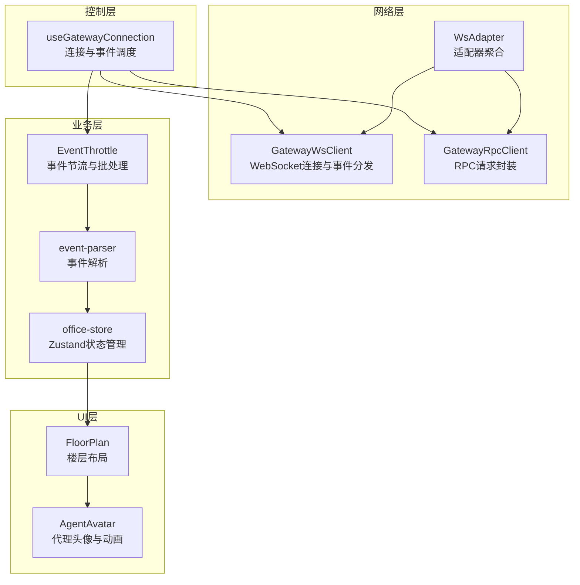
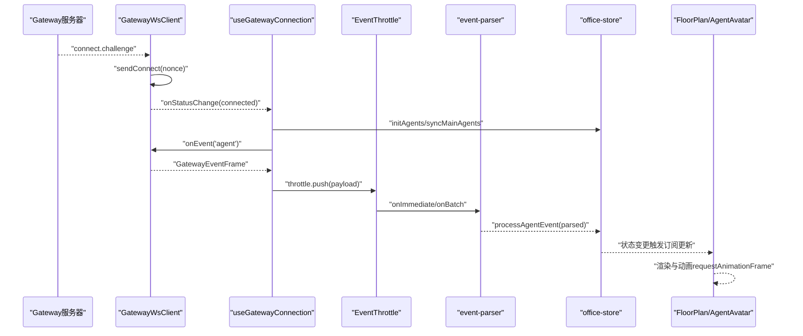
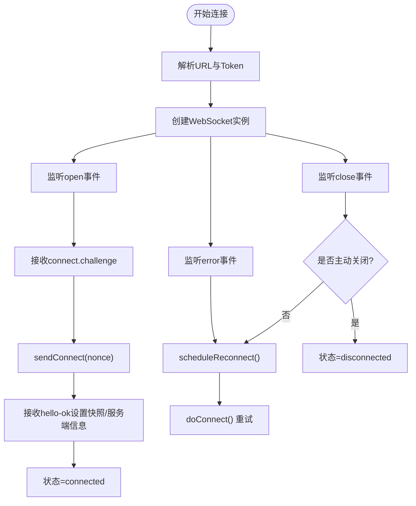
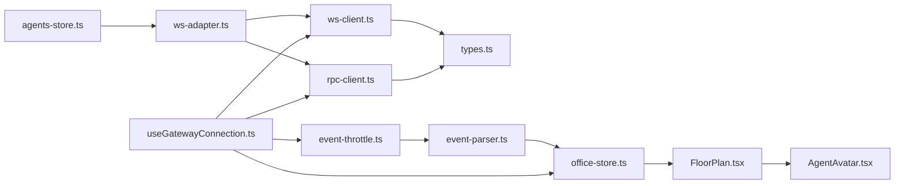

# 数据流架构

<cite>
**本文档引用的文件**
- [src/gateway/ws-adapter.ts](file://src/gateway/ws-adapter.ts)
- [src/gateway/ws-client.ts](file://src/gateway/ws-client.ts)
- [src/gateway/rpc-client.ts](file://src/gateway/rpc-client.ts)
- [src/gateway/event-parser.ts](file://src/gateway/event-parser.ts)
- [src/gateway/adapter-provider.ts](file://src/gateway/adapter-provider.ts)
- [src/gateway/types.ts](file://src/gateway/types.ts)
- [src/hooks/useGatewayConnection.ts](file://src/hooks/useGatewayConnection.ts)
- [src/lib/event-throttle.ts](file://src/lib/event-throttle.ts)
- [src/store/office-store.ts](file://src/store/office-store.ts)
- [src/components/office-2d/AgentAvatar.tsx](file://src/components/office-2d/AgentAvatar.tsx)
- [src/components/office-2d/FloorPlan.tsx](file://src/components/office-2d/FloorPlan.tsx)
- [src/store/console-stores/agents-store.ts](file://src/store/console-stores/agents-store.ts)
- [src/gateway/__tests__/event-parser.test.ts](file://src/gateway/__tests__/event-parser.test.ts)
- [src/store/__tests__/office-store.test.ts](file://src/store/__tests__/office-store.test.ts)
</cite>

## 目录
1. [引言](#引言)
2. [项目结构](#项目结构)
3. [核心组件](#核心组件)
4. [架构总览](#架构总览)
5. [详细组件分析](#详细组件分析)
6. [依赖关系分析](#依赖关系分析)
7. [性能考虑](#性能考虑)
8. [故障排查指南](#故障排查指南)
9. [结论](#结论)

## 引言
本文件面向OpenClaw Office的数据流架构，系统性阐述从Gateway事件流到UI渲染的完整链路：WebSocket连接与维护、事件解析、状态更新、UI渲染与交互。文档同时覆盖并发控制、错误处理、性能优化与内存管理最佳实践，帮助开发者快速理解并高效扩展该数据流体系。

## 项目结构
OpenClaw Office采用分层清晰的前端架构：
- 网络层：WebSocket客户端、RPC客户端、适配器封装
- 业务层：事件解析器、状态管理（Zustand）、UI组件
- 工具层：节流器、常量与工具函数
- 控制层：React Hook负责连接生命周期与事件调度

图表来源
- [src/gateway/ws-client.ts:22-304](file://src/gateway/ws-client.ts#L22-L304)
- [src/gateway/rpc-client.ts:17-63](file://src/gateway/rpc-client.ts#L17-L63)
- [src/gateway/ws-adapter.ts:40-353](file://src/gateway/ws-adapter.ts#L40-L353)
- [src/lib/event-throttle.ts:15-71](file://src/lib/event-throttle.ts#L15-L71)
- [src/gateway/event-parser.ts:17-225](file://src/gateway/event-parser.ts#L17-L225)
- [src/store/office-store.ts:217-800](file://src/store/office-store.ts#L217-L800)
- [src/hooks/useGatewayConnection.ts:23-151](file://src/hooks/useGatewayConnection.ts#L23-L151)
- [src/components/office-2d/FloorPlan.tsx:20-278](file://src/components/office-2d/FloorPlan.tsx#L20-L278)
- [src/components/office-2d/AgentAvatar.tsx:15-255](file://src/components/office-2d/AgentAvatar.tsx#L15-L255)

章节来源
- [src/gateway/ws-client.ts:22-304](file://src/gateway/ws-client.ts#L22-L304)
- [src/gateway/rpc-client.ts:17-63](file://src/gateway/rpc-client.ts#L17-L63)
- [src/gateway/ws-adapter.ts:40-353](file://src/gateway/ws-adapter.ts#L40-L353)
- [src/lib/event-throttle.ts:15-71](file://src/lib/event-throttle.ts#L15-L71)
- [src/gateway/event-parser.ts:17-225](file://src/gateway/event-parser.ts#L17-L225)
- [src/store/office-store.ts:217-800](file://src/store/office-store.ts#L217-L800)
- [src/hooks/useGatewayConnection.ts:23-151](file://src/hooks/useGatewayConnection.ts#L23-L151)
- [src/components/office-2d/FloorPlan.tsx:20-278](file://src/components/office-2d/FloorPlan.tsx#L20-L278)
- [src/components/office-2d/AgentAvatar.tsx:15-255](file://src/components/office-2d/AgentAvatar.tsx#L15-L255)

## 核心组件
- WebSocket客户端（GatewayWsClient）：负责握手、认证、事件分发、重连策略与连接状态管理
- RPC客户端（GatewayRpcClient）：封装请求/响应帧，提供超时与错误处理
- 适配器（WsAdapter）：聚合WebSocket事件与RPC调用，暴露统一的网关能力接口
- 事件节流器（EventThrottle）：高优先级事件立即处理，其余批量处理，避免UI掉帧
- 事件解析器（event-parser）：将原始事件映射为可视化状态与摘要信息
- Zustand状态管理（office-store）：集中管理代理状态、事件历史、指标与UI配置
- React Hook（useGatewayConnection）：连接生命周期管理、事件路由与配置拉取
- UI组件（FloorPlan/AgentAvatar）：订阅状态并驱动渲染与动画

章节来源
- [src/gateway/ws-client.ts:22-304](file://src/gateway/ws-client.ts#L22-L304)
- [src/gateway/rpc-client.ts:17-63](file://src/gateway/rpc-client.ts#L17-L63)
- [src/gateway/ws-adapter.ts:40-353](file://src/gateway/ws-adapter.ts#L40-L353)
- [src/lib/event-throttle.ts:15-71](file://src/lib/event-throttle.ts#L15-L71)
- [src/gateway/event-parser.ts:17-225](file://src/gateway/event-parser.ts#L17-L225)
- [src/store/office-store.ts:217-800](file://src/store/office-store.ts#L217-L800)
- [src/hooks/useGatewayConnection.ts:23-151](file://src/hooks/useGatewayConnection.ts#L23-L151)
- [src/components/office-2d/FloorPlan.tsx:20-278](file://src/components/office-2d/FloorPlan.tsx#L20-L278)
- [src/components/office-2d/AgentAvatar.tsx:15-255](file://src/components/office-2d/AgentAvatar.tsx#L15-L255)

## 架构总览
下图展示了从Gateway事件到UI渲染的端到端数据流：

图表来源
- [src/gateway/ws-client.ts:104-181](file://src/gateway/ws-client.ts#L104-L181)
- [src/hooks/useGatewayConnection.ts:98-126](file://src/hooks/useGatewayConnection.ts#L98-L126)
- [src/lib/event-throttle.ts:29-61](file://src/lib/event-throttle.ts#L29-L61)
- [src/gateway/event-parser.ts:17-60](file://src/gateway/event-parser.ts#L17-L60)
- [src/store/office-store.ts:762-800](file://src/store/office-store.ts#L762-L800)
- [src/components/office-2d/FloorPlan.tsx:20-278](file://src/components/office-2d/FloorPlan.tsx#L20-L278)
- [src/components/office-2d/AgentAvatar.tsx:15-95](file://src/components/office-2d/AgentAvatar.tsx#L15-L95)

## 详细组件分析

### WebSocket连接与维护（GatewayWsClient）
- 握手与认证：收到connect.challenge后构造参数并签名设备身份，发送connect请求
- 事件分发：根据事件名分发到注册的处理器集合；支持通配符“*”
- 连接状态：维护连接状态机（connecting/connected/reconnecting/disconnected/error），并提供快照与服务端信息
- 重连策略：指数退避+抖动，最大重连次数限制
- 错误处理：捕获消息解析异常、onerror后触发onclose，最终进入断开状态

图表来源
- [src/gateway/ws-client.ts:60-130](file://src/gateway/ws-client.ts#L60-L130)
- [src/gateway/ws-client.ts:132-197](file://src/gateway/ws-client.ts#L132-L197)
- [src/gateway/ws-client.ts:270-295](file://src/gateway/ws-client.ts#L270-L295)

章节来源
- [src/gateway/ws-client.ts:22-304](file://src/gateway/ws-client.ts#L22-L304)

### RPC客户端（GatewayRpcClient）
- 请求封装：生成唯一ID，注册响应处理器，支持超时与错误包装
- 错误语义：非连接态直接拒绝；响应帧ok=false时抛出RpcError
- 超时控制：默认10秒，可按方法定制

章节来源
- [src/gateway/rpc-client.ts:17-63](file://src/gateway/rpc-client.ts#L17-L63)

### 适配器（WsAdapter）
- 事件订阅：对多个受关注事件进行监听并广播给所有处理器
- RPC封装：统一封装聊天、会话、通道、技能、定时任务等RPC调用
- 数据映射：将网关返回的原始数据映射为领域模型（如ChannelInfo、SkillInfo）

章节来源
- [src/gateway/ws-adapter.ts:40-83](file://src/gateway/ws-adapter.ts#L40-L83)
- [src/gateway/ws-adapter.ts:85-353](file://src/gateway/ws-adapter.ts#L85-L353)

### 事件节流器（EventThrottle）
- 高优先级判定：error与lifecycle start/end事件立即处理
- 批处理：其他事件进入队列，使用requestAnimationFrame批量flush
- 内存保护：超过阈值时截断保留最近事件，避免内存膨胀

章节来源
- [src/lib/event-throttle.ts:15-71](file://src/lib/event-throttle.ts#L15-L71)

### 事件解析器（event-parser）
- 解析目标：将AgentEventPayload映射为ParsedAgentEvent，包含状态、工具、气泡、摘要等
- 流类型分支：lifecycle/tool/assistant/error/item/plan/approval/command_output/patch/thinking/compaction
- 国际化摘要：为不同流生成本地化摘要，便于UI展示

章节来源
- [src/gateway/event-parser.ts:17-225](file://src/gateway/event-parser.ts#L17-L225)

### Zustand状态管理（office-store）
- 视觉代理模型：维护agents Map、links、全局指标、事件历史、主题与页面状态
- 事件处理：processAgentEvent负责解析并更新代理状态、建立协作链接、记录事件历史
- 动画与移动：提供行走动画、位置分配、会议室管理与退休流程
- 并发控制：Immer中间件保证不可变更新；事件批处理减少渲染抖动

章节来源
- [src/store/office-store.ts:217-800](file://src/store/office-store.ts#L217-L800)

### React Hook（useGatewayConnection）
- 生命周期：连接建立后初始化代理列表、同步主代理、拉取配置、启动轮询
- 事件路由：将agent/health事件经节流器送入状态管理
- 适配器初始化：根据模式选择Mock或WebSocket适配器

章节来源
- [src/hooks/useGatewayConnection.ts:23-151](file://src/hooks/useGatewayConnection.ts#L23-L151)

### UI渲染（FloorPlan/AgentAvatar）
- 订阅状态：FloorPlan订阅agents、links、theme；AgentAvatar订阅单个agent状态
- 渲染策略：按区域分组渲染，支持占位与未确认代理；使用requestAnimationFrame驱动行走动画
- 交互反馈：状态环、思维/说话指示器、工具名称标签、悬停提示

章节来源
- [src/components/office-2d/FloorPlan.tsx:20-278](file://src/components/office-2d/FloorPlan.tsx#L20-L278)
- [src/components/office-2d/AgentAvatar.tsx:15-255](file://src/components/office-2d/AgentAvatar.tsx#L15-L255)

## 依赖关系分析

图表来源
- [src/gateway/ws-client.ts:1-304](file://src/gateway/ws-client.ts#L1-L304)
- [src/gateway/rpc-client.ts:1-63](file://src/gateway/rpc-client.ts#L1-L63)
- [src/gateway/ws-adapter.ts:1-353](file://src/gateway/ws-adapter.ts#L1-L353)
- [src/hooks/useGatewayConnection.ts:1-151](file://src/hooks/useGatewayConnection.ts#L1-L151)
- [src/lib/event-throttle.ts:1-71](file://src/lib/event-throttle.ts#L1-L71)
- [src/gateway/event-parser.ts:1-225](file://src/gateway/event-parser.ts#L1-L225)
- [src/store/office-store.ts:1-800](file://src/store/office-store.ts#L1-L800)
- [src/components/office-2d/FloorPlan.tsx:1-278](file://src/components/office-2d/FloorPlan.tsx#L1-L278)
- [src/components/office-2d/AgentAvatar.tsx:1-255](file://src/components/office-2d/AgentAvatar.tsx#L1-L255)
- [src/store/console-stores/agents-store.ts:1-642](file://src/store/console-stores/agents-store.ts#L1-L642)

章节来源
- [src/gateway/types.ts:1-402](file://src/gateway/types.ts#L1-L402)

## 性能考虑
- 事件批处理与节流
  - 高优先级事件（error、lifecycle start/end）立即处理，降低延迟
  - 其他事件批量处理，避免频繁渲染导致掉帧
  - 队列溢出时截断保留最近事件，防止内存暴涨
- 渲染优化
  - 使用requestAnimationFrame驱动行走动画，确保60fps
  - 组件内部memo化与按区域分组渲染，减少不必要的重绘
- 状态更新
  - Immer中间件保证不可变更新，提升可预测性与调试体验
  - 事件历史上限控制，避免长期运行内存增长
- 连接与重连
  - 指数退避+抖动，避免雪崩效应
  - 最大重连次数限制，防止无限重试

章节来源
- [src/lib/event-throttle.ts:15-71](file://src/lib/event-throttle.ts#L15-L71)
- [src/components/office-2d/AgentAvatar.tsx:46-95](file://src/components/office-2d/AgentAvatar.tsx#L46-L95)
- [src/store/office-store.ts:39-800](file://src/store/office-store.ts#L39-L800)
- [src/gateway/ws-client.ts:270-295](file://src/gateway/ws-client.ts#L270-L295)

## 故障排查指南
- 连接问题
  - 检查connect.challenge是否正确签名设备身份；确认nonce与签名流程
  - 关注重连日志与最大重连次数，必要时调整网络环境
- 事件丢失或乱序
  - 确认节流器配置与事件序列号；检查批处理时机
- 状态不一致
  - 核对processAgentEvent中runId/sessionKey映射与子代理识别逻辑
  - 检查事件历史长度与去重策略
- UI卡顿
  - 检查是否有大量高频事件未被批处理；确认动画循环是否被取消

章节来源
- [src/gateway/ws-client.ts:132-197](file://src/gateway/ws-client.ts#L132-L197)
- [src/lib/event-throttle.ts:29-61](file://src/lib/event-throttle.ts#L29-L61)
- [src/store/office-store.ts:762-800](file://src/store/office-store.ts#L762-L800)
- [src/gateway/__tests__/event-parser.test.ts:1-141](file://src/gateway/__tests__/event-parser.test.ts#L1-L141)
- [src/store/__tests__/office-store.test.ts:1-527](file://src/store/__tests__/office-store.test.ts#L1-L527)

## 结论
OpenClaw Office的数据流以WebSocket为核心，结合事件节流、事件解析与Zustand状态管理，实现了从网关事件到UI渲染的高效闭环。通过高优先级事件即时处理、批量批处理与动画驱动渲染，系统在复杂事件场景下仍能保持流畅体验。建议在扩展新功能时遵循现有模式：先在事件解析器中定义流类型与摘要，再在状态管理中更新模型，最后在UI中订阅渲染。同时持续关注事件节流与内存上限策略，确保系统长期稳定运行。