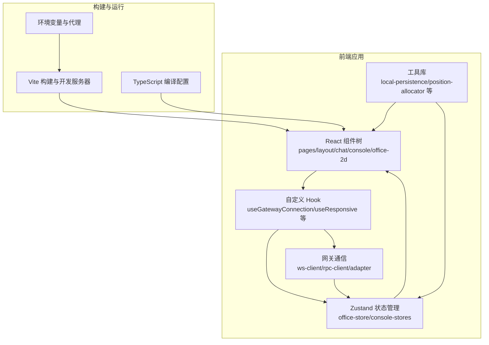
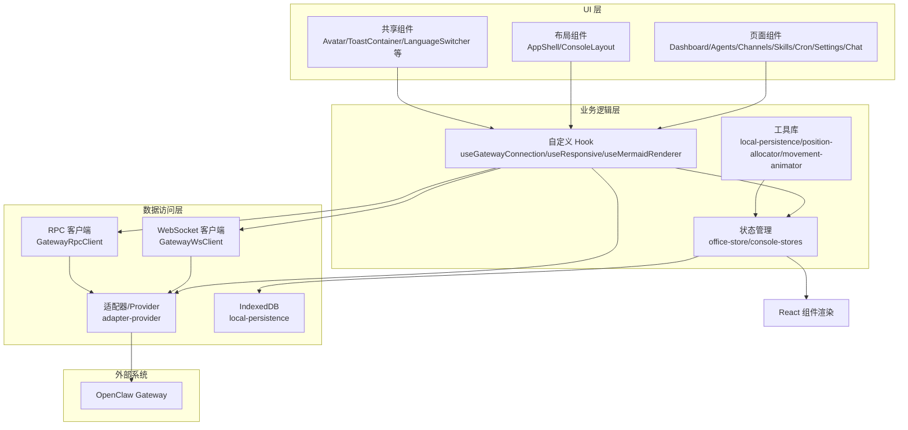
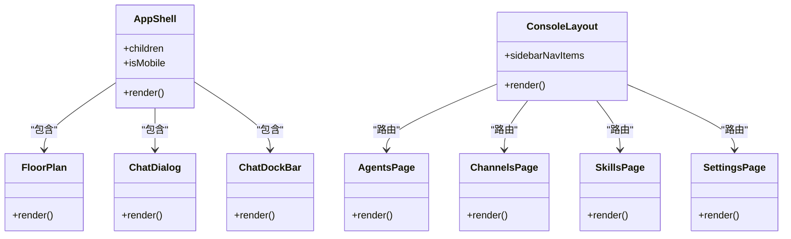
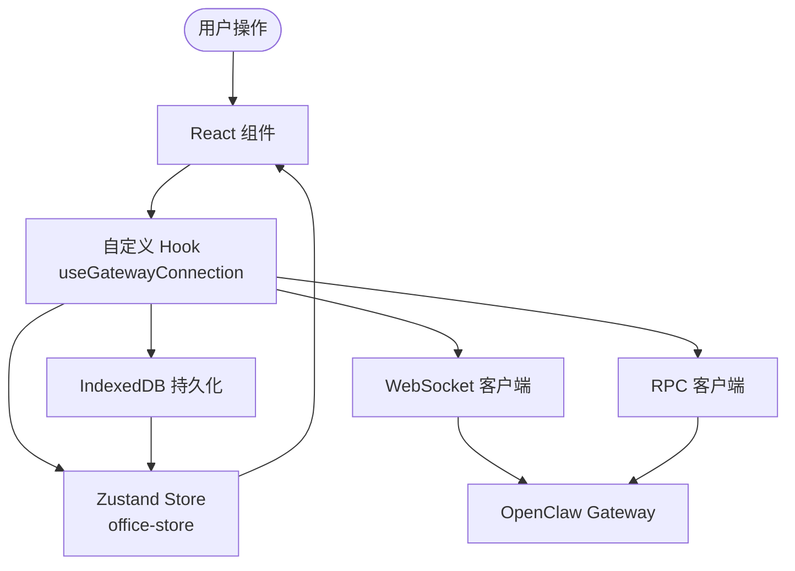
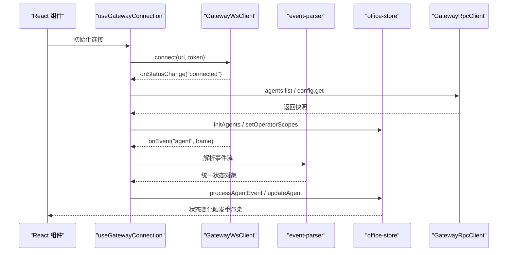
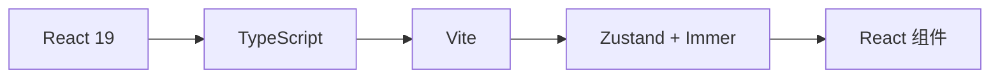
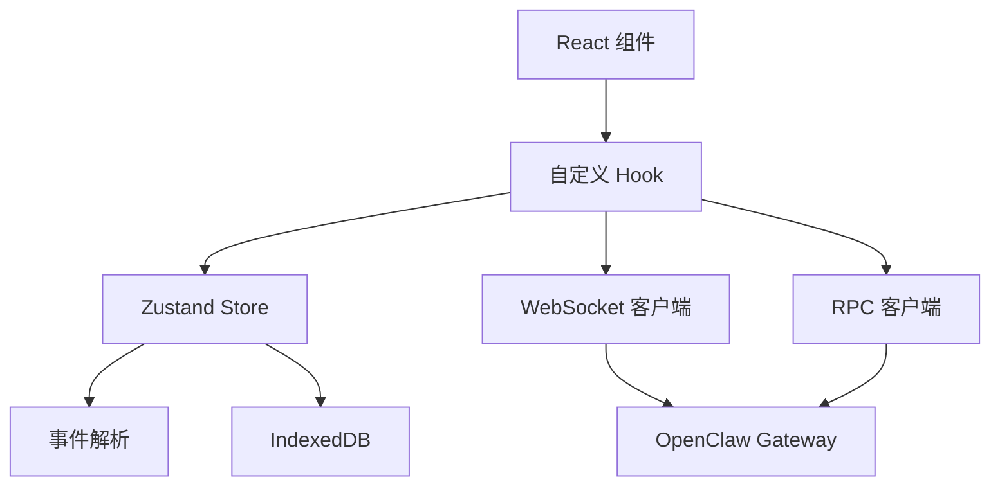

# 整体架构模式

<cite>
**本文档引用的文件**
- [package.json](file://package.json)
- [vite.config.ts](file://vite.config.ts)
- [tsconfig.json](file://tsconfig.json)
- [src/main.tsx](file://src/main.tsx)
- [src/App.tsx](file://src/App.tsx)
- [src/components/layout/AppShell.tsx](file://src/components/layout/AppShell.tsx)
- [src/components/layout/ConsoleLayout.tsx](file://src/components/layout/ConsoleLayout.tsx)
- [src/hooks/useGatewayConnection.ts](file://src/hooks/useGatewayConnection.ts)
- [src/gateway/ws-client.ts](file://src/gateway/ws-client.ts)
- [src/gateway/event-parser.ts](file://src/gateway/event-parser.ts)
- [src/store/office-store.ts](file://src/store/office-store.ts)
- [src/store/console-stores/config-store.ts](file://src/store/console-stores/config-store.ts)
- [src/lib/local-persistence.ts](file://src/lib/local-persistence.ts)
- [README.md](file://README.md)
</cite>

## 目录
1. [引言](#引言)
2. [项目结构](#项目结构)
3. [核心组件](#核心组件)
4. [架构总览](#架构总览)
5. [详细组件分析](#详细组件分析)
6. [依赖分析](#依赖分析)
7. [性能考量](#性能考量)
8. [故障排查指南](#故障排查指南)
9. [结论](#结论)
10. [附录](#附录)

## 引言
本文件系统性阐述 OpenClaw Office 的整体架构模式，重点覆盖三种核心架构模式：
- 组件化架构：基于 React 的模块化组件设计，强调页面布局、功能面板与可视化元素的解耦与复用。
- 分层架构：UI 层、业务逻辑层、数据访问层清晰分离，通过状态管理与网关客户端实现职责划分。
- 事件驱动架构：基于 WebSocket 的事件处理机制，实现前端与 Gateway 的实时数据流与状态同步。

同时，文档解释技术选型（React 19 + TypeScript + Vite + Zustand）的决策依据与权衡，并提供跨领域关注点（安全、监控、灾难恢复）的实现建议与现状说明。

## 项目结构
OpenClaw Office 采用以功能域为中心的目录组织方式：
- src/components：按功能域拆分的 UI 组件，如 chat、console、skills、office-2d、overlays、pages、panels、shared、layout 等。
- src/gateway：网关通信相关，包含 WebSocket 客户端、RPC 客户端、适配器、事件解析与类型定义。
- src/hooks：自定义 Hook，封装网关连接、轮询、响应式布局等横切能力。
- src/store：状态管理，包含全局 office-store 与控制台相关 stores（agents、channels、skills、config 等）。
- src/lib：通用工具库，如本地持久化、位置分配、运动动画、会话键工具、常量等。
- src/i18n：国际化资源与初始化。
- src/styles：全局样式。
- 根目录配置：package.json、vite.config.ts、tsconfig.json 等。

**图表来源**
- [src/main.tsx:1-15](file://src/main.tsx#L1-L15)
- [src/App.tsx:76-124](file://src/App.tsx#L76-L124)
- [vite.config.ts:342-382](file://vite.config.ts#L342-L382)
- [tsconfig.json:1-29](file://tsconfig.json#L1-L29)

**章节来源**
- [README.md:63-76](file://README.md#L63-L76)
- [src/main.tsx:1-15](file://src/main.tsx#L1-L15)
- [vite.config.ts:1-382](file://vite.config.ts#L1-L382)
- [tsconfig.json:1-29](file://tsconfig.json#L1-L29)

## 核心组件
- 应用入口与路由
  - 应用根节点在 main.tsx 中创建，使用 HashRouter 包裹 App。
  - App.tsx 负责路由配置、主题同步、页面跟踪、网关连接初始化与聊天工作区引导。
- 布局组件
  - AppShell：主壳层，承载顶部栏、侧边栏、聊天对话与停靠栏，支持移动端折叠。
  - ConsoleLayout：控制台布局，提供导航与内容区域。
- 网关连接与事件处理
  - useGatewayConnection：封装 WebSocket 连接、RPC 初始化、事件节流、健康状态同步与配置获取。
  - GatewayWsClient：WebSocket 客户端，负责握手、认证、事件分发与重连策略。
  - event-parser：将多流类型的 Agent 事件解析为统一的可视化状态。
- 状态管理
  - office-store：全局状态，包含 Agent 视觉状态、协作连线、事件历史、主题与聊天停靠高度等。
  - console-stores：控制台相关状态，如配置、模型目录、更新生命周期等。
- 本地持久化
  - local-persistence：基于 IndexedDB 的聊天消息、事件历史与会话缓存，支持过期清理与配额控制。

**章节来源**
- [src/main.tsx:1-15](file://src/main.tsx#L1-L15)
- [src/App.tsx:76-124](file://src/App.tsx#L76-L124)
- [src/components/layout/AppShell.tsx:17-83](file://src/components/layout/AppShell.tsx#L17-L83)
- [src/components/layout/ConsoleLayout.tsx:7-60](file://src/components/layout/ConsoleLayout.tsx#L7-L60)
- [src/hooks/useGatewayConnection.ts:23-151](file://src/hooks/useGatewayConnection.ts#L23-L151)
- [src/gateway/ws-client.ts:22-304](file://src/gateway/ws-client.ts#L22-L304)
- [src/gateway/event-parser.ts:17-225](file://src/gateway/event-parser.ts#L17-L225)
- [src/store/office-store.ts:217-800](file://src/store/office-store.ts#L217-L800)
- [src/store/console-stores/config-store.ts:93-420](file://src/store/console-stores/config-store.ts#L93-L420)
- [src/lib/local-persistence.ts:34-408](file://src/lib/local-persistence.ts#L34-L408)

## 架构总览
OpenClaw Office 采用“组件化 + 分层 + 事件驱动”的混合架构：
- 组件化架构：React 组件按功能域拆分，通过路由与布局组件组合形成页面；共享组件与工具库提升复用性。
- 分层架构：UI 层（React 组件）、业务逻辑层（Hook 与 Store）、数据访问层（WebSocket/RPC 客户端与本地存储）职责清晰。
- 事件驱动架构：通过 WebSocket 接收 Gateway 的实时事件，经事件解析与节流后写入状态管理，驱动 UI 更新。

**图表来源**
- [src/App.tsx:107-120](file://src/App.tsx#L107-L120)
- [src/hooks/useGatewayConnection.ts:23-151](file://src/hooks/useGatewayConnection.ts#L23-L151)
- [src/gateway/ws-client.ts:22-304](file://src/gateway/ws-client.ts#L22-L304)
- [src/store/office-store.ts:217-800](file://src/store/office-store.ts#L217-L800)
- [src/lib/local-persistence.ts:34-408](file://src/lib/local-persistence.ts#L34-L408)

## 详细组件分析

### 组件化架构（基于 React 的模块化组件设计）
- 页面与布局
  - AppShell 提供桌面端侧边栏与移动端抽屉式导航，结合 RestartBanner、TopBar、ChatDialog、ChatDockBar 等，形成统一的页面骨架。
  - ConsoleLayout 提供控制台导航与内容区域，支持全宽与窄栏两种布局模式。
- 功能域组件
  - office-2d：包含 AgentAvatar、DeskUnit、FloorPlan、ConnectionLine 等，支撑 2D 办公室场景的可视化。
  - chat：ChatDialog、ChatDockBar、MessageBubble、MarkdownContent 等，支撑聊天工作区。
  - console：agents/channels/cron/skills/settings 等页面与面板，支撑管理控制台。
  - panels：MetricsPanel、NetworkGraph、EventTimeline 等，提供可视化面板。
- 共享组件与工具
  - shared：Avatar、LanguageSwitcher、RestartBanner、ToastContainer 等，提供跨页面复用能力。
  - hooks：useGatewayConnection、useResponsive、useMermaidRenderer 等，封装横切关注点。

**图表来源**
- [src/components/layout/AppShell.tsx:17-83](file://src/components/layout/AppShell.tsx#L17-L83)
- [src/components/layout/ConsoleLayout.tsx:7-60](file://src/components/layout/ConsoleLayout.tsx#L7-L60)
- [src/components/pages/AgentsPage.tsx](file://src/components/pages/AgentsPage.tsx)
- [src/components/pages/ChannelsPage.tsx](file://src/components/pages/ChannelsPage.tsx)
- [src/components/pages/SkillsPage.tsx](file://src/components/pages/SkillsPage.tsx)
- [src/components/pages/SettingsPage.tsx](file://src/components/pages/SettingsPage.tsx)

**章节来源**
- [src/components/layout/AppShell.tsx:17-83](file://src/components/layout/AppShell.tsx#L17-L83)
- [src/components/layout/ConsoleLayout.tsx:7-60](file://src/components/layout/ConsoleLayout.tsx#L7-L60)
- [src/components/office-2d/FloorPlan.tsx](file://src/components/office-2d/FloorPlan.tsx)
- [src/components/chat/ChatDialog.tsx](file://src/components/chat/ChatDialog.tsx)
- [src/components/chat/ChatDockBar.tsx](file://src/components/chat/ChatDockBar.tsx)

### 分层架构（UI 层、业务逻辑层、数据访问层分离）
- UI 层
  - React 组件负责视图渲染与用户交互，通过 props 与状态管理进行数据绑定。
- 业务逻辑层
  - 自定义 Hook 将连接、轮询、响应式布局等横切逻辑抽象出来，减少组件复杂度。
  - Zustand Store 聚合业务状态，提供不可变更新与派生计算（如全局指标）。
- 数据访问层
  - WebSocket 客户端负责与 Gateway 建立长连接、认证与事件分发。
  - RPC 客户端封装请求/响应协议，用于一次性查询与控制操作。
  - 本地持久化通过 IndexedDB 存储聊天消息、事件历史与会话元数据，支持过期清理与配额控制。

**图表来源**
- [src/hooks/useGatewayConnection.ts:23-151](file://src/hooks/useGatewayConnection.ts#L23-L151)
- [src/gateway/ws-client.ts:22-304](file://src/gateway/ws-client.ts#L22-L304)
- [src/store/office-store.ts:217-800](file://src/store/office-store.ts#L217-L800)
- [src/lib/local-persistence.ts:34-408](file://src/lib/local-persistence.ts#L34-L408)

**章节来源**
- [src/hooks/useGatewayConnection.ts:23-151](file://src/hooks/useGatewayConnection.ts#L23-L151)
- [src/gateway/ws-client.ts:22-304](file://src/gateway/ws-client.ts#L22-L304)
- [src/store/office-store.ts:217-800](file://src/store/office-store.ts#L217-L800)
- [src/lib/local-persistence.ts:34-408](file://src/lib/local-persistence.ts#L34-L408)

### 事件驱动架构（基于 WebSocket 的事件处理）
- 事件来源与类型
  - Gateway 通过 WebSocket 广播多流事件（agent、presence、health、heartbeat 等），前端使用 event-parser 将不同流映射为统一的可视化状态。
- 连接与认证
  - GatewayWsClient 负责握手、挑战/应答、设备身份签名与令牌认证，支持断线重连与状态回调。
- 事件处理与节流
  - useGatewayConnection 使用 EventThrottle 对高频事件进行批处理与即时处理，降低渲染压力并保证交互流畅。
- 状态同步
  - 连接成功后，通过 RPC 获取初始快照（agents.list、config.get 等），随后以低频 reconciliation 修复断线丢失的事件。

**图表来源**
- [src/hooks/useGatewayConnection.ts:88-126](file://src/hooks/useGatewayConnection.ts#L88-L126)
- [src/gateway/ws-client.ts:149-181](file://src/gateway/ws-client.ts#L149-L181)
- [src/gateway/event-parser.ts:17-60](file://src/gateway/event-parser.ts#L17-L60)
- [src/store/office-store.ts:762-800](file://src/store/office-store.ts#L762-L800)

**章节来源**
- [src/hooks/useGatewayConnection.ts:88-126](file://src/hooks/useGatewayConnection.ts#L88-L126)
- [src/gateway/ws-client.ts:149-181](file://src/gateway/ws-client.ts#L149-L181)
- [src/gateway/event-parser.ts:17-60](file://src/gateway/event-parser.ts#L17-L60)
- [src/store/office-store.ts:762-800](file://src/store/office-store.ts#L762-L800)

### 技术选型与架构决策（React 19 + TypeScript + Vite + Zustand）
- React 19
  - 提供并发渲染与更优的性能表现，适合高频率事件驱动的 UI 更新场景。
- TypeScript
  - 强类型保障事件帧、状态结构与 API 响应的一致性，降低集成风险。
- Vite
  - 快速冷启动与热更新，内置代理与中间件扩展（如 chat-cache 与 workspace-skills API），便于本地开发与调试。
- Zustand + Immer
  - 轻量的状态管理，Immer 提供不可变更新的便利语法，降低样板代码与 bug 风险。

**图表来源**
- [package.json:49-63](file://package.json#L49-L63)
- [vite.config.ts:342-382](file://vite.config.ts#L342-L382)
- [tsconfig.json:1-29](file://tsconfig.json#L1-L29)

**章节来源**
- [package.json:49-63](file://package.json#L49-L63)
- [vite.config.ts:342-382](file://vite.config.ts#L342-L382)
- [tsconfig.json:1-29](file://tsconfig.json#L1-L29)
- [README.md:63-76](file://README.md#L63-L76)

### 跨领域关注点：安全、监控与灾难恢复
- 安全
  - 设备身份认证：在受信上下文中，使用设备身份签名增强认证强度；若失败，回退至令牌认证。
  - 首次连接安全配置：应用层通过一次性的安全配置补丁，允许在受控环境下放宽设备认证限制（仅在首次连接时执行）。
- 监控
  - 连接状态与错误：WebSocket 客户端维护连接状态与错误信息，通过状态回调通知 UI。
  - 事件历史：本地持久化存储事件历史，支持按时间范围查询与清理，便于问题定位。
- 灾难恢复
  - 断线重连：指数退避与抖动的重连策略，避免雪崩效应。
  - 会话与消息缓存：本地 IndexedDB 缓存聊天消息与会话元数据，支持过期清理与配额控制，提升离线与弱网体验。

**章节来源**
- [src/gateway/ws-client.ts:199-260](file://src/gateway/ws-client.ts#L199-L260)
- [src/store/console-stores/config-store.ts:404-420](file://src/store/console-stores/config-store.ts#L404-L420)
- [src/lib/local-persistence.ts:275-306](file://src/lib/local-persistence.ts#L275-L306)

## 依赖分析
- 组件耦合与内聚
  - 组件间通过 props 与状态管理解耦，布局组件与页面组件内聚于各自功能域。
- 直接与间接依赖
  - UI 组件依赖 Hook 与 Store；Hook 依赖网关客户端与本地持久化；Store 依赖事件解析与工具库。
- 外部依赖与集成点
  - Vite 插件与中间件扩展本地 API（聊天缓存、工作区技能文件），WebSocket 与 RPC 与 Gateway 集成。

**图表来源**
- [src/hooks/useGatewayConnection.ts:23-151](file://src/hooks/useGatewayConnection.ts#L23-L151)
- [src/gateway/ws-client.ts:22-304](file://src/gateway/ws-client.ts#L22-L304)
- [src/gateway/event-parser.ts:17-225](file://src/gateway/event-parser.ts#L17-L225)
- [src/lib/local-persistence.ts:34-408](file://src/lib/local-persistence.ts#L34-L408)

**章节来源**
- [src/hooks/useGatewayConnection.ts:23-151](file://src/hooks/useGatewayConnection.ts#L23-L151)
- [src/gateway/ws-client.ts:22-304](file://src/gateway/ws-client.ts#L22-L304)
- [src/gateway/event-parser.ts:17-225](file://src/gateway/event-parser.ts#L17-L225)
- [src/lib/local-persistence.ts:34-408](file://src/lib/local-persistence.ts#L34-L408)

## 性能考量
- 事件节流与批处理：通过 EventThrottle 降低高频事件对渲染与状态更新的压力。
- 渲染路径最小化：Zustand 的局部更新与 Immer 的不可变更新减少不必要的重渲染。
- 本地缓存与配额控制：IndexedDB 缓存聊天与事件历史，配合过期清理与配额阈值，避免内存膨胀。
- 构建与开发体验：Vite 的快速冷启动与中间件扩展，缩短开发反馈周期。

[本节为通用性能讨论，不直接分析具体文件]

## 故障排查指南
- 连接问题
  - 检查 WebSocket URL 与 Token 配置，确认代理设置正确（/gateway-ws 与 /api/gateway/ws）。
  - 观察连接状态回调与错误信息，必要时查看浏览器网络面板与控制台日志。
- 事件缺失或延迟
  - 确认事件解析是否正确，检查节流配置与事件批处理行为。
  - 如断线后出现会话漂移，等待低频 reconciliation 同步修复。
- 本地缓存异常
  - 检查 IndexedDB 是否可用，确认过期清理与配额控制逻辑未阻塞写入。

**章节来源**
- [vite.config.ts:352-380](file://vite.config.ts#L352-L380)
- [src/gateway/ws-client.ts:297-303](file://src/gateway/ws-client.ts#L297-L303)
- [src/gateway/event-parser.ts:17-60](file://src/gateway/event-parser.ts#L17-L60)
- [src/lib/local-persistence.ts:322-338](file://src/lib/local-persistence.ts#L322-L338)

## 结论
OpenClaw Office 通过组件化、分层与事件驱动三类架构模式的协同，实现了高可维护性与高性能的前端监控与管理界面。React 19 + TypeScript + Vite + Zustand 的技术组合在开发效率、类型安全与运行时性能之间取得良好平衡。安全、监控与灾难恢复等跨领域关注点在现有实现中已有基础覆盖，建议持续完善自动化与可观测性能力。

[本节为总结性内容，不直接分析具体文件]

## 附录
- 环境变量与构建配置
  - Vite 代理与中间件：/gateway-ws 与 /api/gateway/ws 的 WebSocket 代理，以及聊天缓存与工作区技能 API 中间件。
  - TypeScript 配置：严格模式、模块解析、路径别名等。
- 项目技术栈概览
  - 构建工具：Vite 6
  - UI 框架：React 19
  - 状态管理：Zustand 5 + Immer
  - 实时通信：原生 WebSocket
  - 样式：Tailwind CSS 4
  - 路由：React Router 7
  - 图表：Recharts
  - 国际化：i18next + react-i18next

**章节来源**
- [vite.config.ts:342-382](file://vite.config.ts#L342-L382)
- [tsconfig.json:1-29](file://tsconfig.json#L1-L29)
- [README.md:63-76](file://README.md#L63-L76)