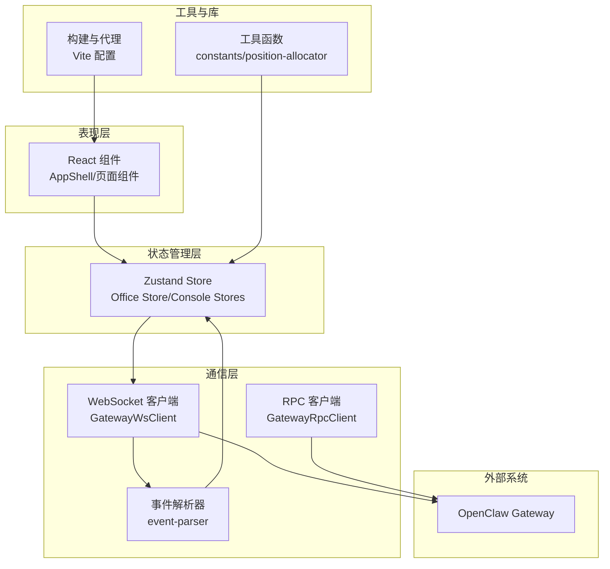
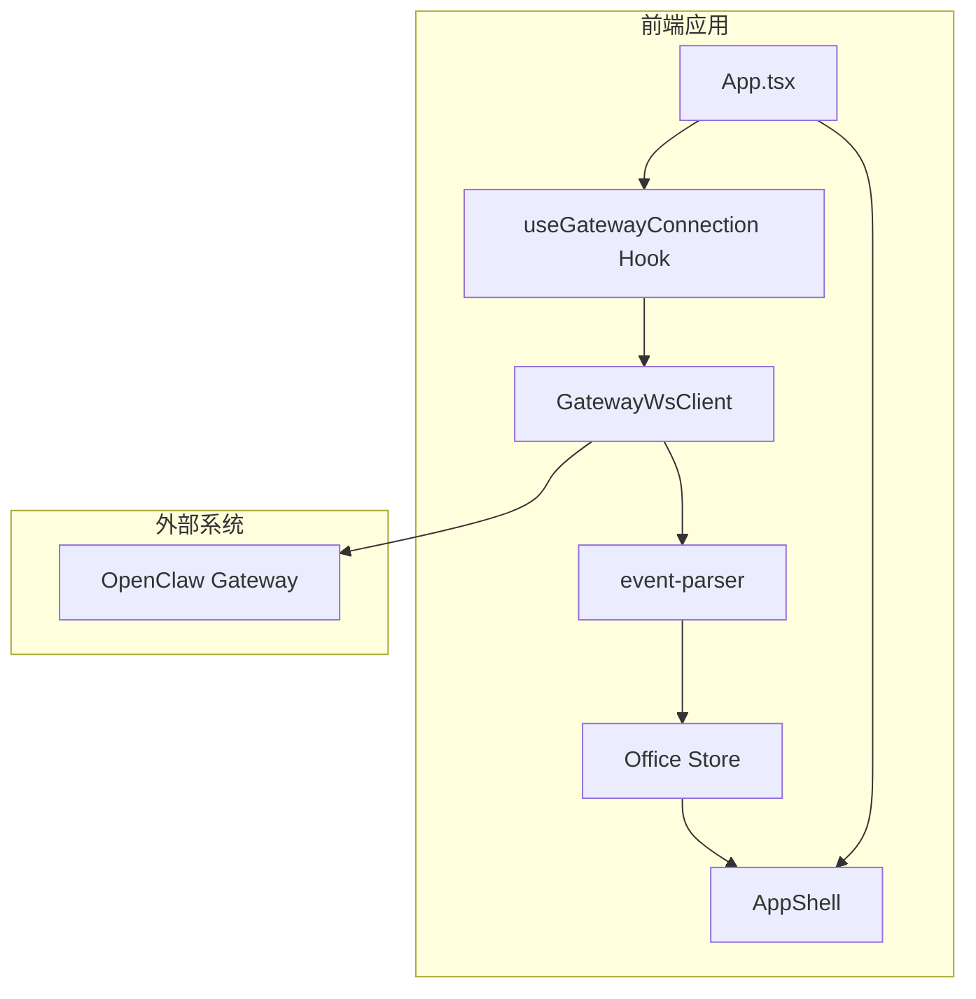
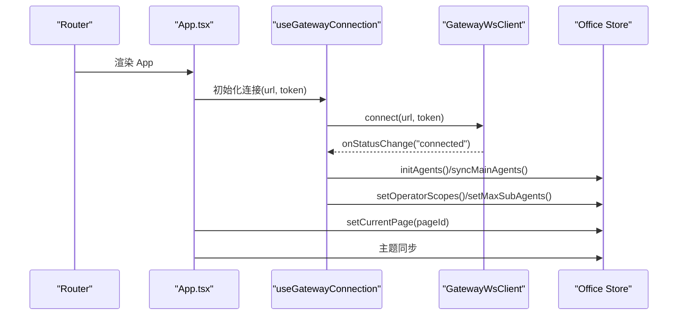
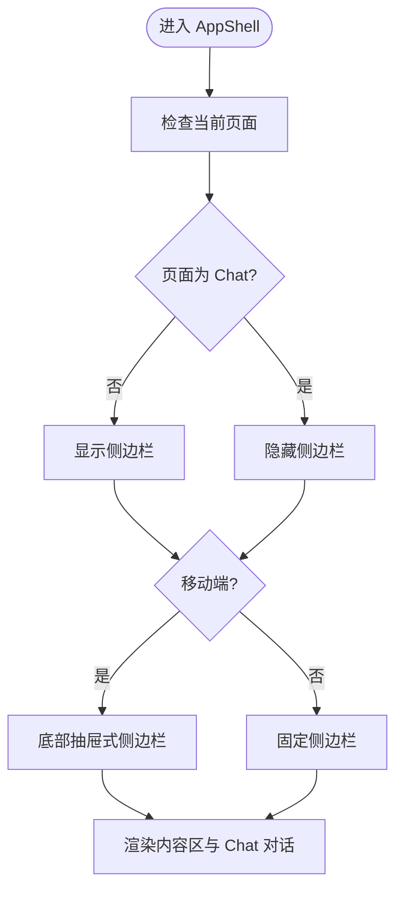
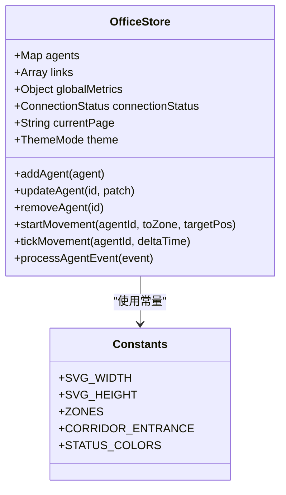
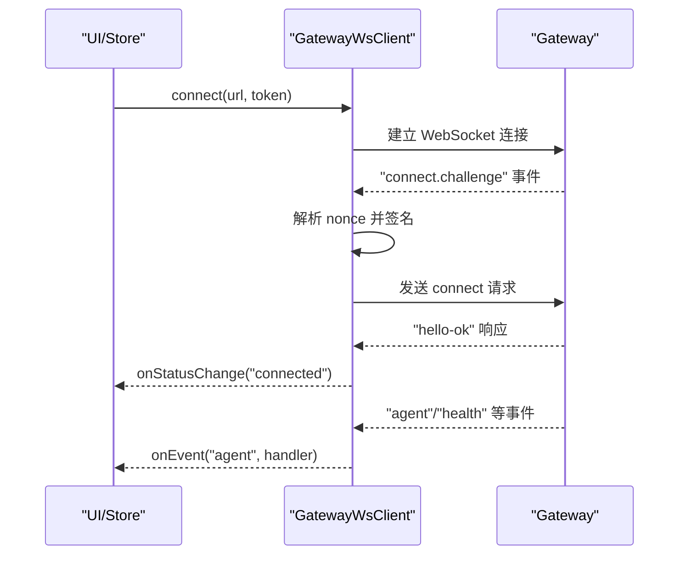
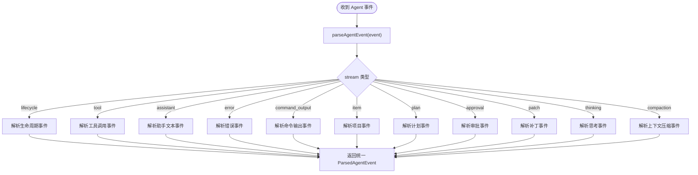
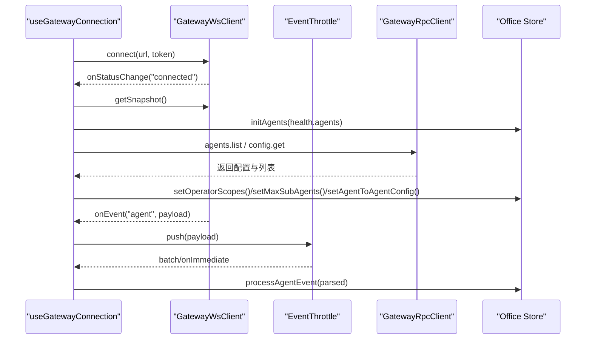
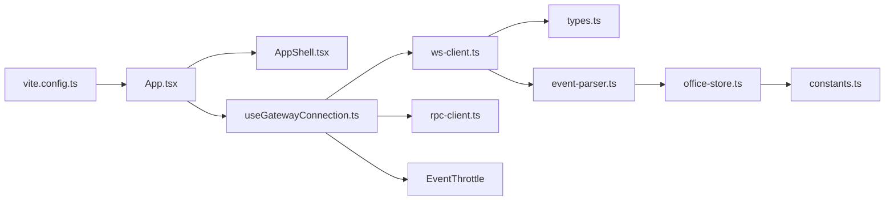

# 架构设计

<cite>
**本文档引用的文件**
- [src/App.tsx](file://src/App.tsx)
- [src/main.tsx](file://src/main.tsx)
- [src/gateway/ws-client.ts](file://src/gateway/ws-client.ts)
- [src/gateway/event-parser.ts](file://src/gateway/event-parser.ts)
- [src/hooks/useGatewayConnection.ts](file://src/hooks/useGatewayConnection.ts)
- [src/store/office-store.ts](file://src/store/office-store.ts)
- [src/components/layout/AppShell.tsx](file://src/components/layout/AppShell.tsx)
- [src/lib/constants.ts](file://src/lib/constants.ts)
- [vite.config.ts](file://vite.config.ts)
- [package.json](file://package.json)
- [README.md](file://README.md)
- [src/gateway/types.ts](file://src/gateway/types.ts)
</cite>

## 目录
1. [简介](#简介)
2. [项目结构](#项目结构)
3. [核心组件](#核心组件)
4. [架构总览](#架构总览)
5. [详细组件分析](#详细组件分析)
6. [依赖关系分析](#依赖关系分析)
7. [性能考量](#性能考量)
8. [故障排查指南](#故障排查指南)
9. [结论](#结论)
10. [附录](#附录)

## 简介
OpenClaw Office 是 OpenClaw 多智能体系统配套的可视化监控与管理前端。系统通过等距投影的虚拟办公室场景，实时呈现 Agent 的工作状态、协作链路、工具调用与资源消耗，并提供完整的控制台管理界面与 Chat 对话工作区。本文档聚焦于整体架构模式、核心组件关系、数据流架构、技术决策与权衡、系统边界与集成模式，帮助开发者快速理解系统的设计思路与技术选型原因。

## 项目结构
项目采用组件化与分层架构相结合的方式组织代码：
- 表现层：React 19 + TypeScript + Vite，使用路由与组件化布局
- 状态管理层：Zustand + Immer，集中管理 Office 与控制台状态
- 通信层：原生 WebSocket + RPC 客户端，对接 OpenClaw Gateway
- 工具与库：Tailwind CSS、Recharts、i18n、Mermaid 等
- 构建与代理：Vite 插件与代理配置，支持本地开发与网关转发

**图表来源**
- [src/App.tsx:76-123](file://src/App.tsx#L76-L123)
- [src/components/layout/AppShell.tsx:17-82](file://src/components/layout/AppShell.tsx#L17-L82)
- [src/gateway/ws-client.ts:22-304](file://src/gateway/ws-client.ts#L22-L304)
- [src/gateway/event-parser.ts:17-225](file://src/gateway/event-parser.ts#L17-L225)
- [src/hooks/useGatewayConnection.ts:23-151](file://src/hooks/useGatewayConnection.ts#L23-L151)
- [src/store/office-store.ts:217-800](file://src/store/office-store.ts#L217-L800)
- [src/lib/constants.ts:1-141](file://src/lib/constants.ts#L1-L141)
- [vite.config.ts:342-382](file://vite.config.ts#L342-L382)

**章节来源**
- [src/App.tsx:1-124](file://src/App.tsx#L1-L124)
- [src/main.tsx:1-15](file://src/main.tsx#L1-L15)
- [vite.config.ts:342-382](file://vite.config.ts#L342-L382)
- [package.json:49-82](file://package.json#L49-L82)

## 核心组件
- App.tsx 主组件：负责路由、主题同步、页面跟踪、Gateway 连接注入与 Chat 工作区引导
- AppShell 布局系统：统一的页面外壳，承载 TopBar、Sidebar、主内容区与 Chat 对话相关 UI
- Office Store 状态管理：集中管理 Agent 视觉状态、位置迁移、协作链路、事件历史、主题与页面状态等
- WebSocket 通信层：封装连接、认证、事件订阅、重连与状态回调，提供事件与响应处理接口

**章节来源**
- [src/App.tsx:76-123](file://src/App.tsx#L76-L123)
- [src/components/layout/AppShell.tsx:17-82](file://src/components/layout/AppShell.tsx#L17-L82)
- [src/store/office-store.ts:217-800](file://src/store/office-store.ts#L217-L800)
- [src/gateway/ws-client.ts:22-304](file://src/gateway/ws-client.ts#L22-L304)

## 架构总览
系统采用“组件化 + 分层 + 事件驱动”的混合架构：
- 组件化：页面与功能模块以组件形式组织，职责清晰、可复用性强
- 分层：表现层、状态管理层、通信层与工具层分离，关注点明确
- 事件驱动：Gateway 通过 WebSocket 广播 Agent 事件，前端以事件驱动的方式更新状态并触发 UI 渲染

**图表来源**
- [src/App.tsx:76-123](file://src/App.tsx#L76-L123)
- [src/components/layout/AppShell.tsx:17-82](file://src/components/layout/AppShell.tsx#L17-L82)
- [src/hooks/useGatewayConnection.ts:23-151](file://src/hooks/useGatewayConnection.ts#L23-L151)
- [src/gateway/ws-client.ts:22-304](file://src/gateway/ws-client.ts#L22-L304)
- [src/gateway/event-parser.ts:17-225](file://src/gateway/event-parser.ts#L17-L225)
- [src/store/office-store.ts:217-800](file://src/store/office-store.ts#L217-L800)

## 详细组件分析

### 组件 A：App.tsx 主组件
- 职责
  - 路由与页面映射：将路径与页面 ID 对应，维护当前页面状态
  - 主题同步：根据 Store 中的主题设置同步 HTML 属性与类名
  - Gateway 连接：解析配置的 Gateway URL 与 Token，注入到连接 Hook
  - Chat 工作区引导：在路由层挂载 Chat 工作区引导组件
- 关键交互
  - 使用 useGatewayConnection 获取 wsClient
  - 通过 useOfficeStore 设置当前页面
  - 通过 resolveGatewayWsUrl 支持多种 URL 输入格式

**图表来源**
- [src/App.tsx:76-123](file://src/App.tsx#L76-L123)
- [src/hooks/useGatewayConnection.ts:23-151](file://src/hooks/useGatewayConnection.ts#L23-L151)
- [src/gateway/ws-client.ts:22-304](file://src/gateway/ws-client.ts#L22-L304)
- [src/store/office-store.ts:217-800](file://src/store/office-store.ts#L217-L800)

**章节来源**
- [src/App.tsx:76-123](file://src/App.tsx#L76-L123)

### 组件 B：AppShell 布局系统
- 职责
  - 统一页面外壳，承载 TopBar、Sidebar、主内容区与 Chat 对话相关 UI
  - 根据当前页面决定是否隐藏侧边栏
  - 移动端适配：底部抽屉式侧边栏与遮罩层
- 关键交互
  - 读取 Store 中的 sidebarCollapsed、currentPage 等状态
  - 初始化事件历史（IndexedDB）

**图表来源**
- [src/components/layout/AppShell.tsx:17-82](file://src/components/layout/AppShell.tsx#L17-L82)

**章节来源**
- [src/components/layout/AppShell.tsx:17-82](file://src/components/layout/AppShell.tsx#L17-L82)

### 组件 C：Office Store 状态管理
- 职责
  - 管理 Agent 视觉状态与位置迁移（含路径规划与插值）
  - 维护协作链路、事件历史、主题、页面状态、会话映射等
  - 提供动作：addAgent/updateAgent/removeAgent、startMovement/tickMovement、processAgentEvent 等
- 关键机制
  - 使用 Immer 中间件实现不可变更新
  - 事件解析：parseAgentEvent 将不同流类型的事件映射为统一的视觉状态
  - 位置分配：基于常量与占用集合分配座位与临时工位

**图表来源**
- [src/store/office-store.ts:217-800](file://src/store/office-store.ts#L217-L800)
- [src/lib/constants.ts:1-141](file://src/lib/constants.ts#L1-L141)

**章节来源**
- [src/store/office-store.ts:217-800](file://src/store/office-store.ts#L217-L800)
- [src/lib/constants.ts:1-141](file://src/lib/constants.ts#L1-L141)

### 组件 D：WebSocket 通信层
- 职责
  - 管理 WebSocket 连接生命周期：连接、断开、重连
  - 认证握手：发送 connect 请求，支持 token 与设备签名认证
  - 事件分发：将事件帧分发给注册的处理器
  - 响应处理：匹配响应 id，回调对应处理器
- 关键机制
  - 指数退避 + 随机抖动的重连策略
  - 支持通配符事件处理器（*）
  - 连接状态回调：connected/reconnecting/disconnected/error

**图表来源**
- [src/gateway/ws-client.ts:22-304](file://src/gateway/ws-client.ts#L22-L304)

**章节来源**
- [src/gateway/ws-client.ts:22-304](file://src/gateway/ws-client.ts#L22-L304)

### 组件 E：事件解析与路由
- 职责
  - 将 Gateway 的 Agent 事件按流类型解析为统一的视觉状态与摘要
  - 为 Store 的 processAgentEvent 提供解析结果
- 关键机制
  - 多流类型解析：lifecycle/tool/assistant/error/command_output/item/plan/approval/patch/thinking/compaction
  - 国际化摘要：基于 i18n 生成人类可读的事件摘要

**图表来源**
- [src/gateway/event-parser.ts:17-225](file://src/gateway/event-parser.ts#L17-L225)

**章节来源**
- [src/gateway/event-parser.ts:17-225](file://src/gateway/event-parser.ts#L17-L225)

### 组件 F：Hook 与连接协调
- 职责
  - useGatewayConnection：封装 WebSocket 与 RPC 客户端初始化、事件节流、连接状态与配置同步
  - 事件节流：批量与即时事件处理，降低 Store 更新频率
  - 配置同步：连接成功后拉取 Gateway 配置并更新 Store
- 关键机制
  - Mock 模式：无需 Gateway 即可开发
  - Snapshot 同步：连接建立后从快照初始化 Agent

**图表来源**
- [src/hooks/useGatewayConnection.ts:23-151](file://src/hooks/useGatewayConnection.ts#L23-L151)

**章节来源**
- [src/hooks/useGatewayConnection.ts:23-151](file://src/hooks/useGatewayConnection.ts#L23-L151)

## 依赖关系分析
- 组件耦合
  - App.tsx 依赖 AppShell、useGatewayConnection、Office Store
  - AppShell 依赖 Office Store 与路由 Outlet
  - useGatewayConnection 依赖 GatewayWsClient、GatewayRpcClient、EventThrottle、Office Store
  - Office Store 依赖 event-parser、lib 常量与工具
- 外部依赖
  - React 19、Zustand 5、Immer、Tailwind CSS、Recharts、i18next、Mermaid、Vite 6
- 构建与代理
  - Vite 代理将 /gateway-ws 与 /api/gateway/ws 转发至 Gateway，支持 WebSocket

**图表来源**
- [src/App.tsx:76-123](file://src/App.tsx#L76-L123)
- [src/components/layout/AppShell.tsx:17-82](file://src/components/layout/AppShell.tsx#L17-L82)
- [src/hooks/useGatewayConnection.ts:23-151](file://src/hooks/useGatewayConnection.ts#L23-L151)
- [src/gateway/ws-client.ts:22-304](file://src/gateway/ws-client.ts#L22-L304)
- [src/gateway/event-parser.ts:17-225](file://src/gateway/event-parser.ts#L17-L225)
- [src/store/office-store.ts:217-800](file://src/store/office-store.ts#L217-L800)
- [src/lib/constants.ts:1-141](file://src/lib/constants.ts#L1-L141)
- [vite.config.ts:342-382](file://vite.config.ts#L342-L382)

**章节来源**
- [package.json:49-82](file://package.json#L49-L82)
- [vite.config.ts:342-382](file://vite.config.ts#L342-L382)

## 性能考量
- 事件节流：通过 EventThrottle 批量处理高频 Agent 事件，减少 Store 更新次数
- 路径动画：使用插值与固定时长计算，保证平滑移动体验
- 重连策略：指数退避 + 随机抖动，避免雪崩效应
- 本地缓存：IndexedDB 存储事件历史，提升首屏加载与回放能力
- 构建优化：Vite 6 + React 插件，支持快速热重载与生产构建

[本节为通用性能建议，不直接分析具体文件]

## 故障排查指南
- 连接问题
  - 检查 Gateway URL 与 Token 配置，确认 Vite 环境变量正确
  - 查看 WebSocket 状态回调，定位连接失败阶段
- 事件缺失
  - 确认 Mock 模式与真实模式差异
  - 检查事件解析器是否覆盖目标流类型
- 状态异常
  - 使用 Store 的调试方法（如打印状态快照）
  - 检查事件历史是否被清理或过期

**章节来源**
- [src/hooks/useGatewayConnection.ts:23-151](file://src/hooks/useGatewayConnection.ts#L23-L151)
- [src/gateway/ws-client.ts:22-304](file://src/gateway/ws-client.ts#L22-L304)
- [src/gateway/event-parser.ts:17-225](file://src/gateway/event-parser.ts#L17-L225)

## 结论
OpenClaw Office 通过组件化与分层架构，结合事件驱动的数据流，实现了对多智能体系统的高效可视化监控与管理。React 19 + TypeScript + Vite + Zustand 的技术组合提供了现代化的开发体验与良好的性能基础；WebSocket 与 RPC 的协同确保了实时性与可控性；Office Store 与事件解析器将复杂的状态变化抽象为统一的视觉状态，使 UI 渲染简洁而稳定。该架构既满足了当前需求，也为未来的扩展与演进预留了空间。

[本节为总结性内容，不直接分析具体文件]

## 附录

### 技术决策与权衡
- React 19 + TypeScript：提供强类型与现代 React 能力，提升开发效率与可维护性
- Vite 6：快速开发与构建，内置代理与热重载，便于与 Gateway 协同
- Zustand 5 + Immer：轻量级状态管理，Immer 简化不可变更新
- 原生 WebSocket：贴近底层协议，便于与 Gateway 对接
- Tailwind CSS 4：原子化样式，快速构建一致的 UI
- Recharts/Mermaid/i18n：丰富可视化与国际化能力

**章节来源**
- [package.json:49-82](file://package.json#L49-L82)
- [README.md:63-76](file://README.md#L63-L76)

### 系统边界与集成模式
- 系统边界
  - 前端：React 应用，负责 UI 渲染与用户交互
  - 后端：OpenClaw Gateway，提供事件广播与 RPC 接口
- 集成模式
  - WebSocket：事件驱动，低延迟
  - RPC：请求-响应，用于配置与控制
  - 本地存储：IndexedDB 缓存事件历史，提升可用性

**章节来源**
- [README.md:274-291](file://README.md#L274-L291)
- [vite.config.ts:342-382](file://vite.config.ts#L342-L382)