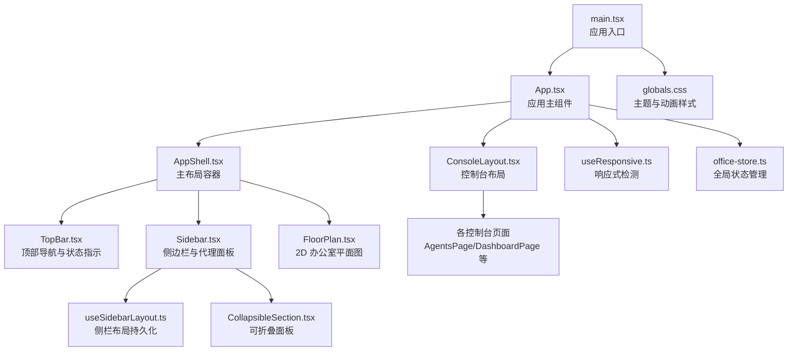
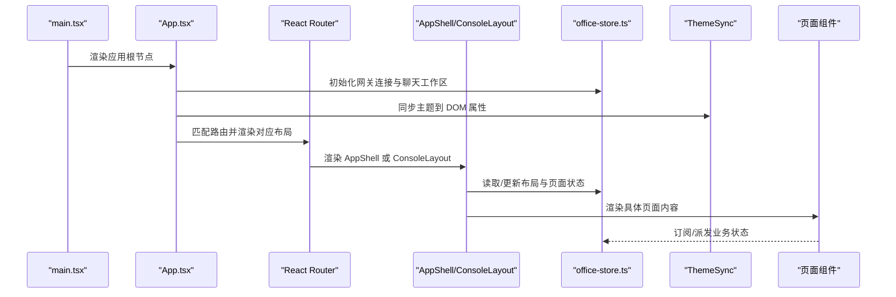
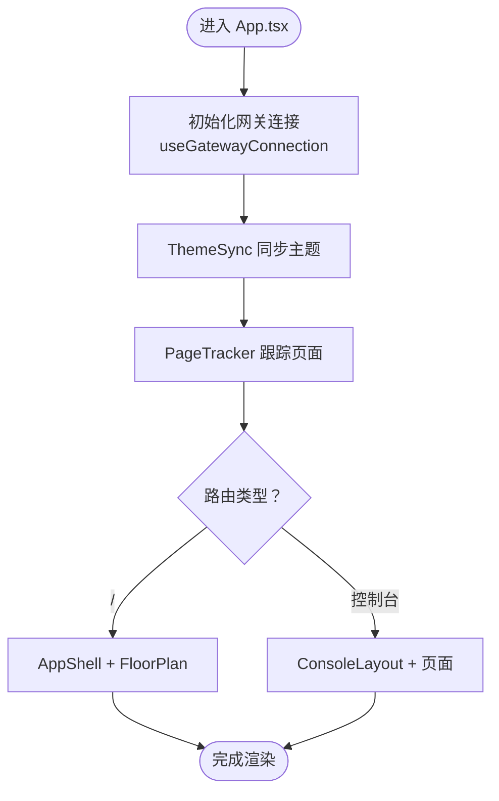
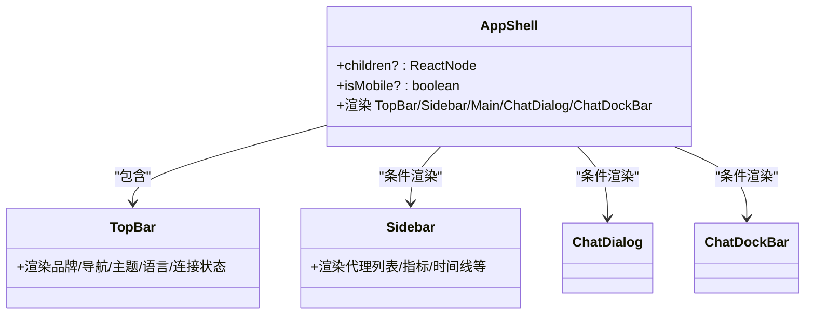
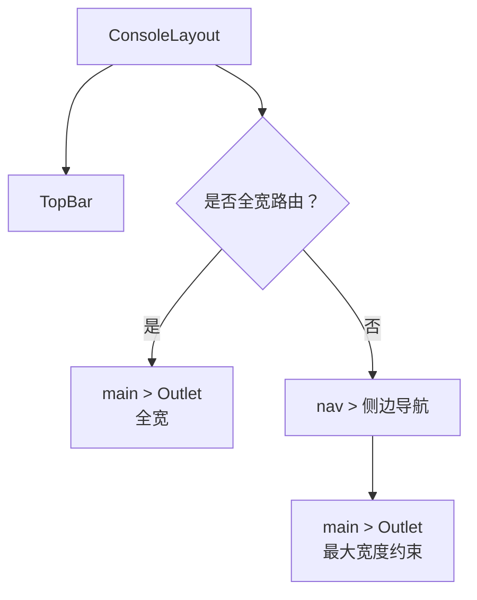
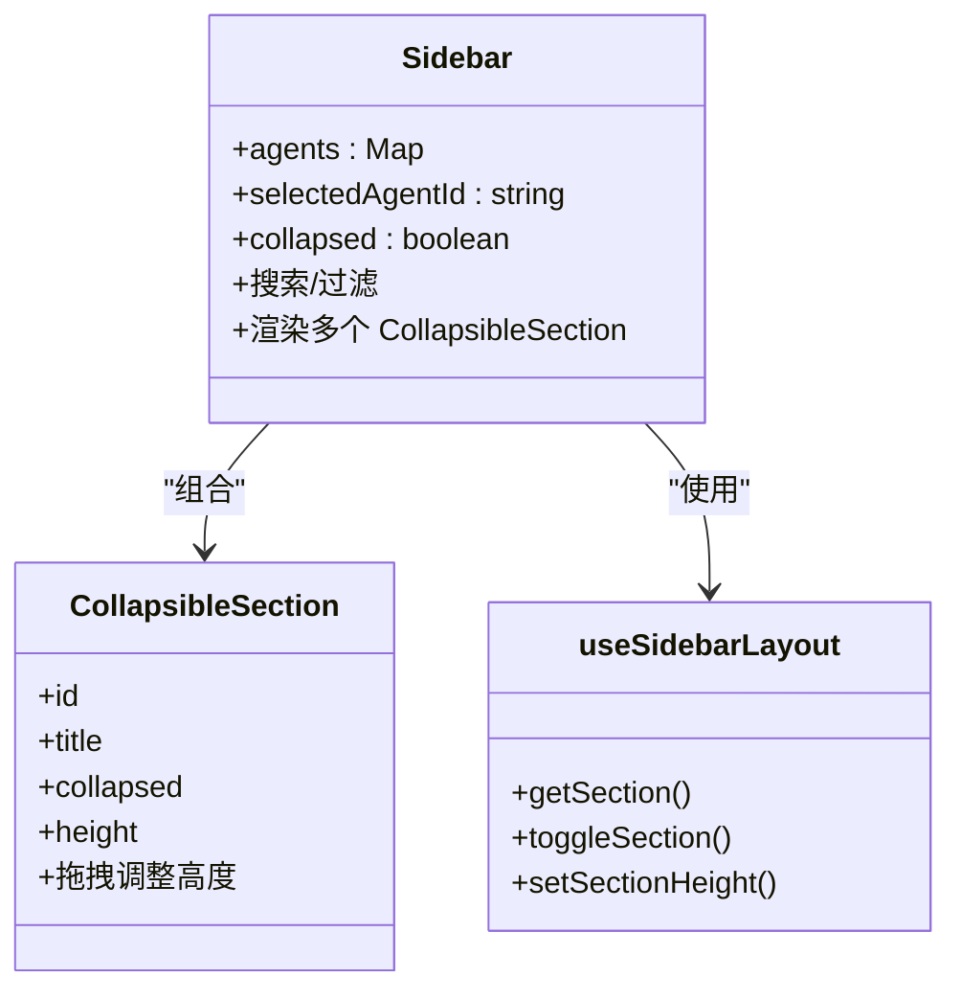
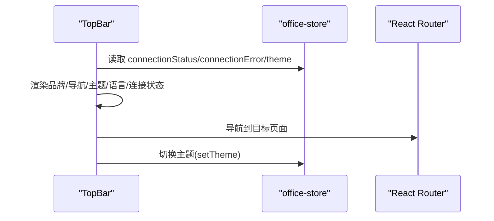
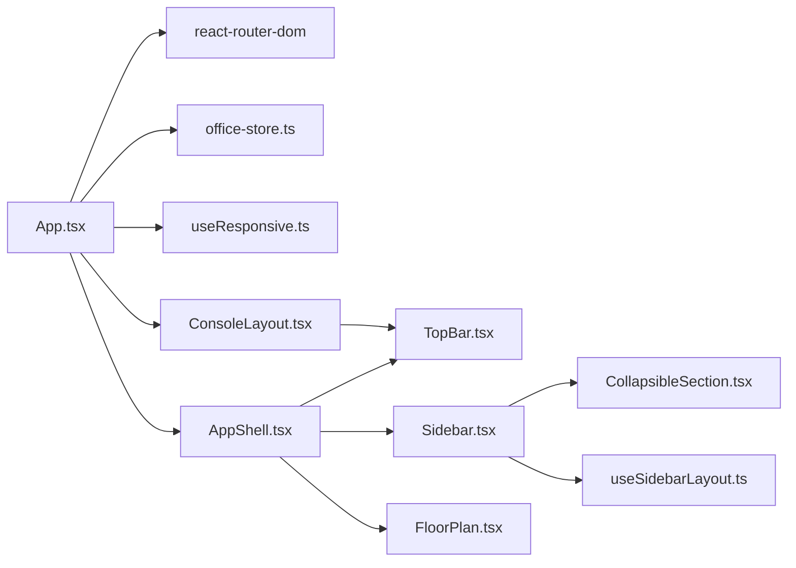

# 核心组件设计

<cite>
**本文档引用的文件**
- [src/App.tsx](file://src/App.tsx)
- [src/main.tsx](file://src/main.tsx)
- [src/components/layout/AppShell.tsx](file://src/components/layout/AppShell.tsx)
- [src/components/layout/ConsoleLayout.tsx](file://src/components/layout/ConsoleLayout.tsx)
- [src/components/layout/Sidebar.tsx](file://src/components/layout/Sidebar.tsx)
- [src/components/layout/TopBar.tsx](file://src/components/layout/TopBar.tsx)
- [src/components/office-2d/FloorPlan.tsx](file://src/components/office-2d/FloorPlan.tsx)
- [src/components/shared/CollapsibleSection.tsx](file://src/components/shared/CollapsibleSection.tsx)
- [src/hooks/useResponsive.ts](file://src/hooks/useResponsive.ts)
- [src/hooks/useSidebarLayout.ts](file://src/hooks/useSidebarLayout.ts)
- [src/store/office-store.ts](file://src/store/office-store.ts)
- [src/styles/globals.css](file://src/styles/globals.css)
- [package.json](file://package.json)
</cite>

## 目录
1. [简介](#简介)
2. [项目结构](#项目结构)
3. [核心组件](#核心组件)
4. [架构总览](#架构总览)
5. [详细组件分析](#详细组件分析)
6. [依赖分析](#依赖分析)
7. [性能考虑](#性能考虑)
8. [故障排除指南](#故障排除指南)
9. [结论](#结论)
10. [附录](#附录)

## 简介
本文件聚焦于 OpenClaw Office 的核心组件设计，围绕以下目标展开：
- 解释 App.tsx 如何作为应用主组件，负责路由与主题同步、网关连接初始化以及聊天工作区引导。
- 阐述 AppShell 布局系统如何协调顶部栏、侧边栏与主要内容区域，并处理移动端适配与事件历史恢复。
- 说明 ConsoleLayout 如何为控制台页面提供统一的导航与内容布局框架。
- 描述组件间依赖关系、props 传递模式、事件传播机制、生命周期管理、状态提升策略与组件复用模式。
- 提供响应式设计在组件中的实现方式与最佳实践。

## 项目结构
OpenClaw Office 采用以功能域划分的目录组织方式，核心入口位于 src 目录，包含组件层、页面层、布局层、存储层与工具钩子等模块。应用通过 HashRouter 进行前端路由，全局样式通过 TailwindCSS 与自定义 CSS 变量实现深色/浅色主题切换。

图表来源
- [src/main.tsx:1-15](file://src/main.tsx#L1-L15)
- [src/App.tsx:1-124](file://src/App.tsx#L1-L124)
- [src/components/layout/AppShell.tsx:1-83](file://src/components/layout/AppShell.tsx#L1-L83)
- [src/components/layout/ConsoleLayout.tsx:1-60](file://src/components/layout/ConsoleLayout.tsx#L1-L60)
- [src/components/layout/TopBar.tsx:1-180](file://src/components/layout/TopBar.tsx#L1-L180)
- [src/components/layout/Sidebar.tsx:1-267](file://src/components/layout/Sidebar.tsx#L1-L267)
- [src/components/office-2d/FloorPlan.tsx:1-686](file://src/components/office-2d/FloorPlan.tsx#L1-L686)
- [src/hooks/useResponsive.ts:1-42](file://src/hooks/useResponsive.ts#L1-L42)
- [src/hooks/useSidebarLayout.ts:1-80](file://src/hooks/useSidebarLayout.ts#L1-L80)
- [src/components/shared/CollapsibleSection.tsx:1-137](file://src/components/shared/CollapsibleSection.tsx#L1-L137)
- [src/store/office-store.ts:1-800](file://src/store/office-store.ts#L1-L800)
- [src/styles/globals.css:1-152](file://src/styles/globals.css#L1-L152)

章节来源
- [src/main.tsx:1-15](file://src/main.tsx#L1-L15)
- [src/App.tsx:1-124](file://src/App.tsx#L1-L124)

## 核心组件
本节从职责与设计原理两个维度，对三大核心组件进行深入剖析。

- App.tsx（应用主组件）
  - 路由与页面映射：通过 react-router-dom 的 Routes/Route 定义路径到页面组件的映射，支持“办公室”、“聊天”、“控制台”等多页面。
  - 主题同步：读取全局 store 中的主题状态，动态设置 documentElement 的 data-theme 与 dark 类名，实现深色/浅色主题切换。
  - 页面跟踪：使用 useLocation 监听路由变化，将当前页面标识写入全局 store，便于 TopBar 与 Sidebar 等组件联动。
  - 网关连接：通过 useGatewayConnection 初始化 WebSocket 客户端，注入 ChatWorkspaceBootstrap 以建立聊天工作区。
  - 响应式适配：通过 useResponsive 获取 isMobile 状态，传递给 AppShell 以决定侧栏显示与交互行为。
  - 开发辅助：在开发模式下向 window 注入便捷的会议 API，便于调试。

- AppShell（主布局容器）
  - 结构职责：承载 TopBar、Sidebar、主要内容区域与聊天对话框/停靠栏，统一处理移动端侧栏抽屉式交互。
  - 状态联动：从 office-store 读取 sidebarCollapsed、currentPage 等状态，根据当前页面决定是否隐藏侧栏。
  - 生命周期：挂载时恢复事件历史（IndexedDB），移动端自动折叠侧栏。
  - 内容分发：优先渲染 children（如 FloorPlan），否则回退到 Outlet（路由嵌套）。

- ConsoleLayout（控制台布局）
  - 导航框架：提供控制台侧边导航（仪表盘、代理、通道、技能、定时任务、设置），支持激活态高亮。
  - 布局策略：根据当前路由决定是否全宽（聊天与技能工作台），非全宽时渲染固定宽度侧边导航。
  - 顶部栏：集成 TopBar，保持一致的品牌与状态指示。

章节来源
- [src/App.tsx:1-124](file://src/App.tsx#L1-L124)
- [src/components/layout/AppShell.tsx:1-83](file://src/components/layout/AppShell.tsx#L1-L83)
- [src/components/layout/ConsoleLayout.tsx:1-60](file://src/components/layout/ConsoleLayout.tsx#L1-L60)

## 架构总览
下图展示了从应用入口到页面渲染、状态管理与主题同步的整体流程。

图表来源
- [src/main.tsx:1-15](file://src/main.tsx#L1-L15)
- [src/App.tsx:1-124](file://src/App.tsx#L1-L124)
- [src/components/layout/AppShell.tsx:1-83](file://src/components/layout/AppShell.tsx#L1-L83)
- [src/components/layout/ConsoleLayout.tsx:1-60](file://src/components/layout/ConsoleLayout.tsx#L1-L60)
- [src/store/office-store.ts:1-800](file://src/store/office-store.ts#L1-L800)

## 详细组件分析

### App.tsx 组件分析
- 路由与页面映射
  - 根路径 "/" 渲染 AppShell 并内嵌 FloorPlan。
  - 控制台路由组（/chat、/dashboard、/agents、/channels、/skills、/skill-workbench、/cron、/settings）由 ConsoleLayout 包裹。
  - 未匹配路由重定向至根路径。
- 主题同步机制
  - ThemeSync 组件订阅 office-store 中的 theme 字段，通过副作用设置 data-theme 与 dark 类名，确保全局样式与图标随主题变化。
- 页面跟踪
  - PageTracker 通过 useLocation 监听路径变化，将 currentPage 写入 store，驱动 TopBar 与 Sidebar 的导航高亮与布局行为。
- 网关连接与聊天工作区
  - 使用 useGatewayConnection 建立 WebSocket 客户端，结合 ChatWorkspaceBootstrap 初始化聊天相关状态与事件流。
- 响应式适配
  - 通过 useResponsive 获取 isMobile，传递给 AppShell 决定侧栏抽屉行为。
- 开发调试
  - 在开发环境向 window 注入 __requestMeeting/__dismissMeeting，便于在控制台快速触发会议场景。

图表来源
- [src/App.tsx:1-124](file://src/App.tsx#L1-L124)

章节来源
- [src/App.tsx:1-124](file://src/App.tsx#L1-L124)

### AppShell 布局系统分析
- 结构组成
  - 顶部栏 TopBar：品牌信息、主导航、主题切换、语言切换、连接状态指示。
  - 主内容区：Outlet 或 children（如 FloorPlan）。
  - 侧栏 Sidebar：在非聊天页且非移动端时显示；移动端以抽屉形式呈现。
  - 底部聊天对话框 ChatDialog 与停靠栏 ChatDockBar：在非聊天页显示。
- 移动端交互
  - isMobile 为真时自动折叠侧栏；底部固定按钮用于展开/收起抽屉；点击遮罩层可关闭抽屉。
- 事件历史恢复
  - 挂载时调用 initEventHistory，从 IndexedDB 恢复事件历史，保证数据一致性。
- 侧栏可见性
  - 当 currentPage 为 "chat" 时隐藏侧栏，避免遮挡聊天界面。

图表来源
- [src/components/layout/AppShell.tsx:1-83](file://src/components/layout/AppShell.tsx#L1-L83)
- [src/components/layout/TopBar.tsx:1-180](file://src/components/layout/TopBar.tsx#L1-L180)
- [src/components/layout/Sidebar.tsx:1-267](file://src/components/layout/Sidebar.tsx#L1-L267)

章节来源
- [src/components/layout/AppShell.tsx:1-83](file://src/components/layout/AppShell.tsx#L1-L83)
- [src/components/layout/TopBar.tsx:1-180](file://src/components/layout/TopBar.tsx#L1-L180)
- [src/components/layout/Sidebar.tsx:1-267](file://src/components/layout/Sidebar.tsx#L1-L267)

### ConsoleLayout 统一布局框架
- 导航项
  - 仪表盘、代理、通道、技能、定时任务、设置六个导航项，使用 Lucide 图标与国际化文案。
- 路由感知
  - 根据当前路由判断是否全宽（聊天与技能工作台），非全宽时渲染固定宽度侧边导航。
- 内容区
  - 使用 Outlet 渲染当前控制台页面；非全宽时限制最大宽度并添加内边距。

图表来源
- [src/components/layout/ConsoleLayout.tsx:1-60](file://src/components/layout/ConsoleLayout.tsx#L1-L60)

章节来源
- [src/components/layout/ConsoleLayout.tsx:1-60](file://src/components/layout/ConsoleLayout.tsx#L1-L60)

### Sidebar 侧栏组件分析
- 数据与状态
  - 从 office-store 读取 agents、selectedAgentId、sidebarCollapsed 等状态，支持选择代理、折叠/展开侧栏。
- 搜索与过滤
  - 支持按名称搜索与状态过滤（全部/活跃/空闲/错误），过滤结果用于代理列表渲染。
- 可折叠面板
  - 使用 CollapsibleSection 实现“指标”“代理列表”“子代理”“详情”“事件时间线”等面板，支持拖拽调整高度与持久化。
- 交互细节
  - 折叠状态下仅显示折叠按钮；展开时渲染完整侧栏，包含头部、搜索与过滤、代理列表、子代理、详情与时间线。

图表来源
- [src/components/layout/Sidebar.tsx:1-267](file://src/components/layout/Sidebar.tsx#L1-L267)
- [src/components/shared/CollapsibleSection.tsx:1-137](file://src/components/shared/CollapsibleSection.tsx#L1-L137)
- [src/hooks/useSidebarLayout.ts:1-80](file://src/hooks/useSidebarLayout.ts#L1-L80)

章节来源
- [src/components/layout/Sidebar.tsx:1-267](file://src/components/layout/Sidebar.tsx#L1-L267)
- [src/components/shared/CollapsibleSection.tsx:1-137](file://src/components/shared/CollapsibleSection.tsx#L1-L137)
- [src/hooks/useSidebarLayout.ts:1-80](file://src/hooks/useSidebarLayout.ts#L1-L80)

### TopBar 顶部栏组件分析
- 品牌与版本
  - 显示应用名称与版本号；在非移动端的办公室页显示全局指标（活跃代理数/总代理数、令牌总量）。
- 导航
  - 提供“办公室/聊天/工作台/控制台”四类导航项，点击切换路由。
- 主题与语言
  - 主题切换按钮与语言切换器，均通过 office-store 更新状态。
- 连接状态指示
  - 根据连接状态（连接中/已连接/重连中/断开/错误）显示不同颜色与脉冲动画，错误时显示错误信息。

图表来源
- [src/components/layout/TopBar.tsx:1-180](file://src/components/layout/TopBar.tsx#L1-L180)
- [src/store/office-store.ts:1-800](file://src/store/office-store.ts#L1-L800)

章节来源
- [src/components/layout/TopBar.tsx:1-180](file://src/components/layout/TopBar.tsx#L1-L180)
- [src/store/office-store.ts:1-800](file://src/store/office-store.ts#L1-L800)

### 响应式设计实现
- 响应式检测
  - useResponsive 返回 isMobile/isTablet/isDesktop 三态，用于 AppShell 决策侧栏折叠与抽屉行为。
- 移动端交互
  - 侧栏抽屉：底部固定按钮展开，点击遮罩层关闭；Esc 键也可关闭。
- 样式与主题
  - 全局样式通过 CSS 变量与 Tailwind 自定义变体实现深色/浅色主题；TopBar 中的连接指示器使用脉冲动画增强视觉反馈。

章节来源
- [src/hooks/useResponsive.ts:1-42](file://src/hooks/useResponsive.ts#L1-L42)
- [src/components/layout/AppShell.tsx:1-83](file://src/components/layout/AppShell.tsx#L1-L83)
- [src/styles/globals.css:1-152](file://src/styles/globals.css#L1-L152)

## 依赖分析
- 组件耦合
  - AppShell 与 TopBar/Sidebar/ChatDialog/ChatDockBar 强耦合，共同构成主布局骨架。
  - ConsoleLayout 与 TopBar 协作，形成控制台导航框架。
  - Sidebar 与 CollapsibleSection、useSidebarLayout 松耦合，通过钩子与 props 传递状态。
- 状态管理
  - office-store 提供全局状态（代理、链接、指标、主题、页面、聊天停靠高度等），所有布局与页面组件通过 store 订阅/更新状态。
- 外部依赖
  - react-router-dom：路由与导航。
  - zustand/immer：轻量状态管理与不可变更新。
  - lucide-react：图标库。
  - tailwindcss：原子化样式与主题变量。

图表来源
- [src/App.tsx:1-124](file://src/App.tsx#L1-L124)
- [src/components/layout/AppShell.tsx:1-83](file://src/components/layout/AppShell.tsx#L1-L83)
- [src/components/layout/ConsoleLayout.tsx:1-60](file://src/components/layout/ConsoleLayout.tsx#L1-L60)
- [src/components/layout/Sidebar.tsx:1-267](file://src/components/layout/Sidebar.tsx#L1-L267)
- [src/components/shared/CollapsibleSection.tsx:1-137](file://src/components/shared/CollapsibleSection.tsx#L1-L137)
- [src/hooks/useResponsive.ts:1-42](file://src/hooks/useResponsive.ts#L1-L42)
- [src/hooks/useSidebarLayout.ts:1-80](file://src/hooks/useSidebarLayout.ts#L1-L80)
- [src/store/office-store.ts:1-800](file://src/store/office-store.ts#L1-L800)

章节来源
- [src/App.tsx:1-124](file://src/App.tsx#L1-L124)
- [package.json:1-83](file://package.json#L1-L83)

## 性能考虑
- 状态粒度与订阅
  - 将布局状态（如 sidebarCollapsed、currentPage）与业务状态（如 agents、metrics）分离，减少无关渲染。
- 计算优化
  - Sidebar 中的代理列表与子代理计算使用 useMemo 缓存，避免每次渲染都重新过滤与排序。
- 动画与渲染
  - FloorPlan 通过分层 SVG 渲染与按区域分组绘制，降低复杂度；动画通过 CSS 关键帧实现，避免 JavaScript 动画抖动。
- 存储与持久化
  - 侧栏面板高度与折叠状态通过 localStorage 持久化，减少重复计算与用户操作成本。

## 故障排除指南
- 主题不生效
  - 检查 ThemeSync 是否正确订阅 office-store 的 theme，并确认 documentElement 上的 data-theme 与 dark 类名是否设置。
- 侧栏不显示或无法展开
  - 确认 AppShell 的 isMobile 与 currentPage 状态，检查 sidebarCollapsed 的值；移动端需通过底部按钮展开。
- 聊天页面布局异常
  - 检查 ConsoleLayout 的路由判断逻辑（聊天与技能工作台是否全宽），确认 Outlet 的内容容器尺寸。
- 连接状态异常
  - 查看 TopBar 中连接状态指示的颜色与脉冲动画，结合 office-store 的 connectionStatus 与 connectionError 字段定位问题。

章节来源
- [src/App.tsx:1-124](file://src/App.tsx#L1-L124)
- [src/components/layout/TopBar.tsx:1-180](file://src/components/layout/TopBar.tsx#L1-L180)
- [src/components/layout/ConsoleLayout.tsx:1-60](file://src/components/layout/ConsoleLayout.tsx#L1-L60)

## 结论
OpenClaw Office 的核心组件围绕“布局-状态-主题-路由”四个维度构建：App.tsx 作为中枢协调路由与主题同步；AppShell 与 ConsoleLayout 提供统一的布局框架；Sidebar 与 CollapsibleSection 实现可扩展的侧栏面板体系；TopBar 与 office-store 保障状态一致性与用户体验。通过合理的状态提升、组件复用与响应式设计，系统在复杂业务场景下仍保持清晰的职责边界与良好的可维护性。

## 附录
- 组件组合模式与最佳实践
  - 布局容器（AppShell/ConsoleLayout）只负责结构与导航，具体业务组件（如 FloorPlan、各控制台页面）独立渲染。
  - 通过 useResponsive 与 store 状态驱动布局行为，避免硬编码的断点逻辑。
  - 使用 useMemo 与 localStorage 优化渲染与交互体验。
- 样式与主题
  - 通过 CSS 变量与 Tailwind 自定义变体实现主题切换；深色/浅色动画与脉冲效果提升状态反馈。