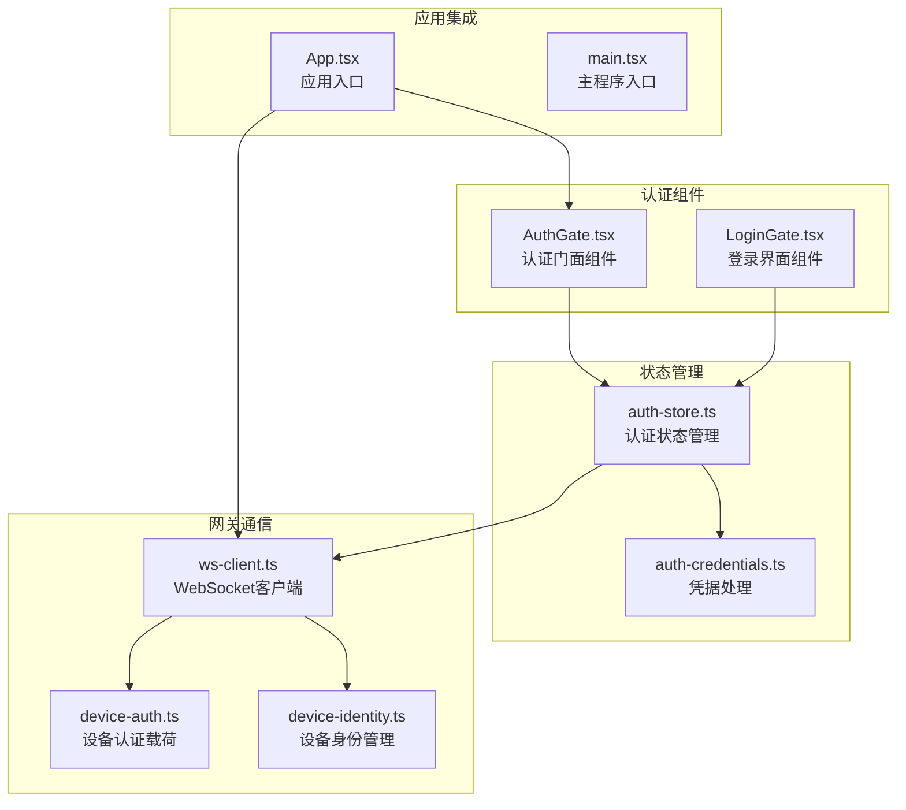
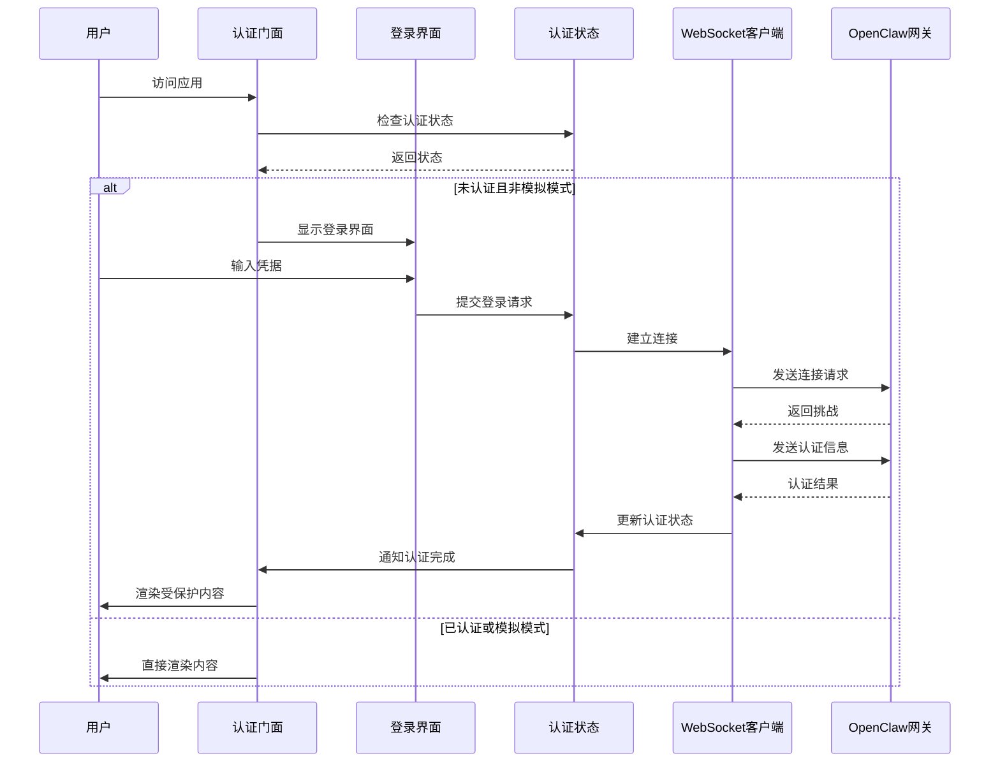
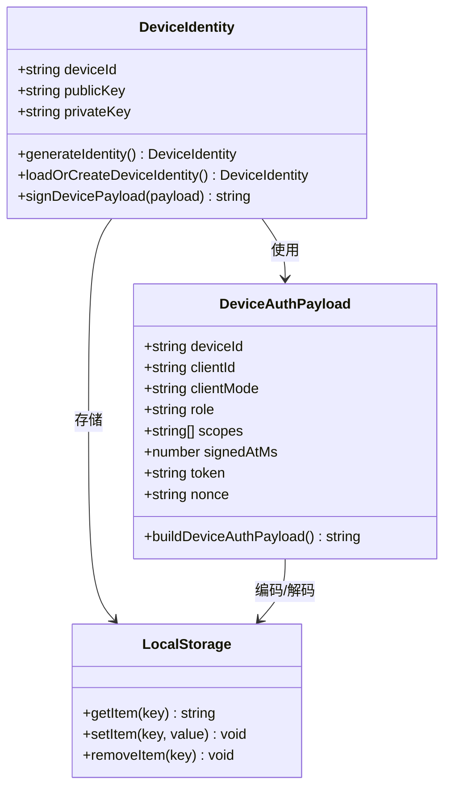
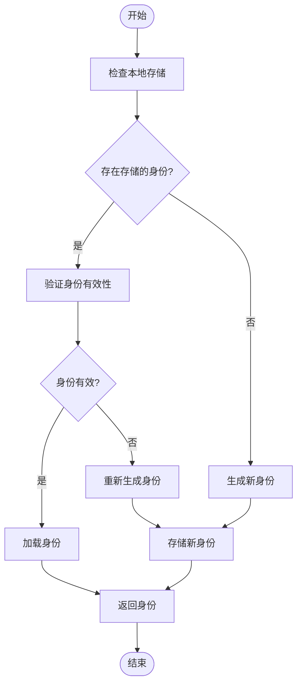
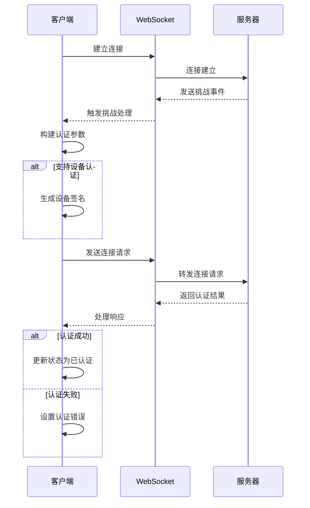
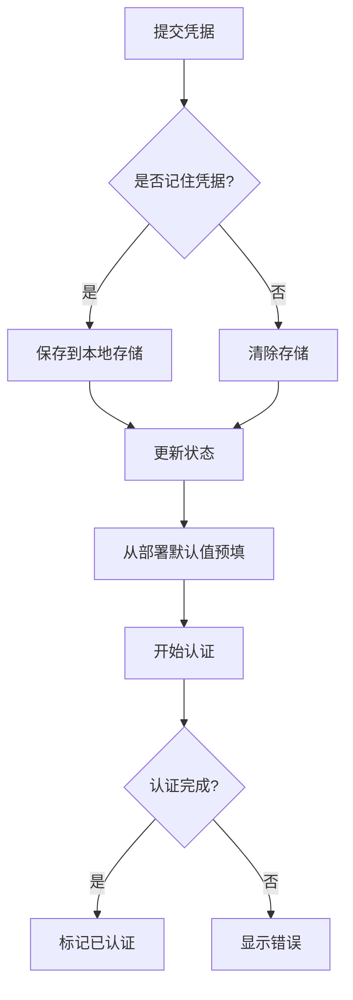
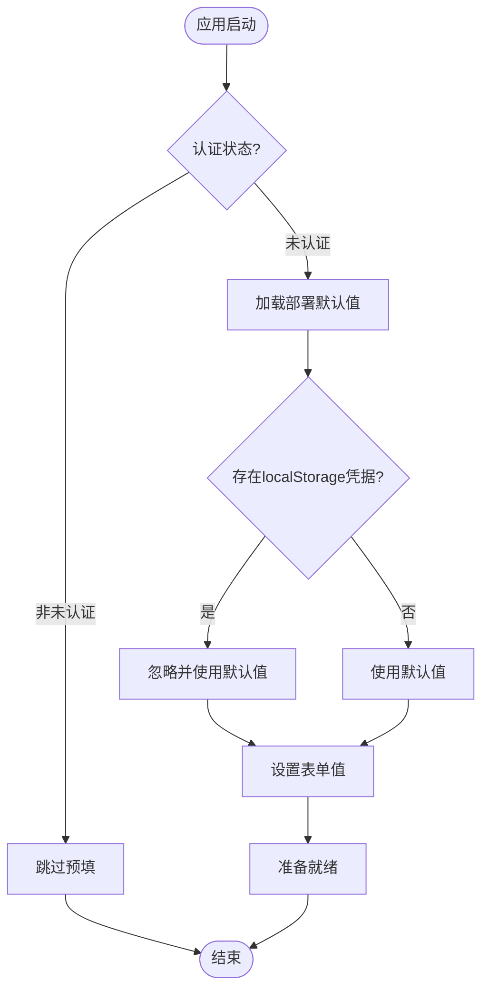
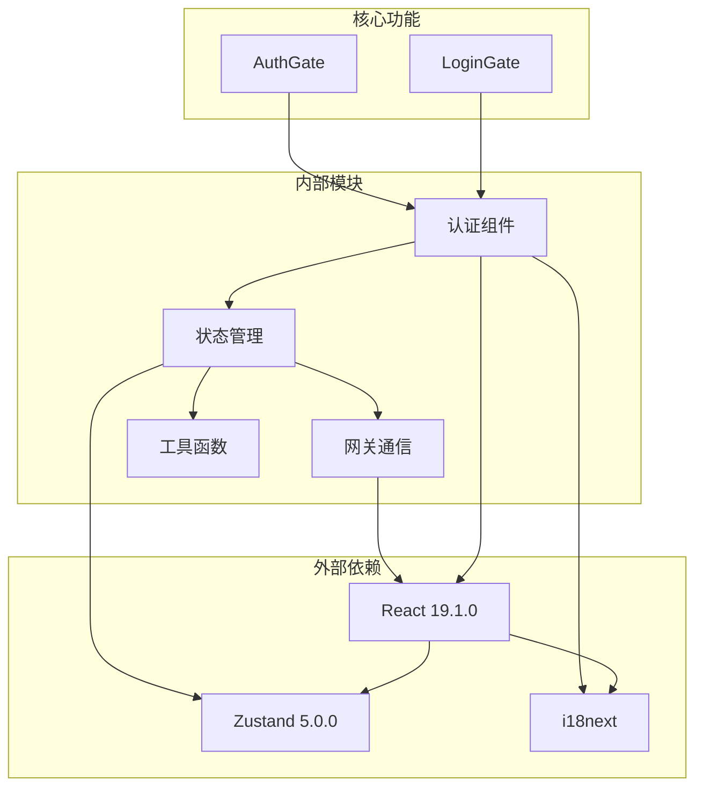

# 认证系统

<cite>
**本文档引用的文件**
- [AuthGate.tsx](file://src/components/auth/AuthGate.tsx)
- [LoginGate.tsx](file://src/components/auth/LoginGate.tsx)
- [auth-store.ts](file://src/store/auth-store.ts)
- [auth-credentials.ts](file://src/gateway/auth-credentials.ts)
- [ws-client.ts](file://src/gateway/ws-client.ts)
- [device-auth.ts](file://src/gateway/device-auth.ts)
- [device-identity.ts](file://src/gateway/device-identity.ts)
- [App.tsx](file://src/App.tsx)
- [main.tsx](file://src/main.tsx)
- [auth.json（英文）](file://src/i18n/locales/en/auth.json)
- [auth.json（中文）](file://src/i18n/locales/zh/auth.json)
</cite>

## 更新摘要
**变更内容**
- 更新了凭据处理策略，移除了自动恢复localStorage凭据的功能
- 新增了部署默认值预填机制，防止用户被卡在"连接中..."状态
- 强调了用户体验改进，确保用户必须显式提交表单
- 新增了详细的错误分类和处理机制

## 目录
1. [简介](#简介)
2. [项目结构](#项目结构)
3. [核心组件](#核心组件)
4. [架构概览](#架构概览)
5. [详细组件分析](#详细组件分析)
6. [依赖关系分析](#依赖关系分析)
7. [性能考虑](#性能考虑)
8. [故障排除指南](#故障排除指南)
9. [结论](#结论)

## 简介

OpenClaw Office 认证系统是一个基于 Web 的安全访问控制系统，负责保护用户与 OpenClaw Gateway 的连接。该系统提供了多层认证机制，包括传统的令牌认证、密码认证以及现代的设备身份认证。

系统采用 React + TypeScript 构建，使用 Zustand 状态管理库实现状态持久化，支持本地存储凭据并在浏览器安全上下文中提供设备身份验证功能。**重要更新**：系统现已移除自动恢复localStorage凭据的功能，改为只预填部署默认值，防止用户被卡在"连接中..."状态。

## 项目结构

认证系统主要分布在以下目录结构中：

**图表来源**
- [AuthGate.tsx:1-24](file://src/components/auth/AuthGate.tsx#L1-L24)
- [LoginGate.tsx:1-186](file://src/components/auth/LoginGate.tsx#L1-L186)
- [auth-store.ts:1-100](file://src/store/auth-store.ts#L1-L100)
- [ws-client.ts:1-333](file://src/gateway/ws-client.ts#L1-L333)

**章节来源**
- [AuthGate.tsx:1-24](file://src/components/auth/AuthGate.tsx#L1-L24)
- [LoginGate.tsx:1-186](file://src/components/auth/LoginGate.tsx#L1-L186)
- [auth-store.ts:1-100](file://src/store/auth-store.ts#L1-L100)

## 核心组件

### 认证门面组件 (AuthGate)

AuthGate 是整个认证系统的核心入口点，负责控制应用程序的访问权限。它检查用户的认证状态，并根据状态决定是渲染受保护的内容还是显示登录界面。

关键特性：
- 支持模拟模式绕过认证
- 监控认证状态变化
- 条件渲染受保护内容

### 登录界面组件 (LoginGate)

LoginGate 提供了完整的用户登录界面，包含以下功能：
- 网关 URL 输入
- 访问令牌输入（可切换显示/隐藏）
- 密码输入（可切换显示/隐藏）
- 凭据记忆选项
- 实时认证状态反馈
- 多语言支持

### 认证状态管理 (AuthStore)

使用 Zustand 实现的状态管理，提供以下功能：
- 认证状态跟踪（未认证/认证中/已认证）
- 凭据持久化存储
- 认证错误处理
- 用户会话管理
- **新增**：部署默认值预填机制

**更新**：AuthStore 现在实现了新的凭据处理策略，只从部署默认值预填表单，不再自动恢复旧的localStorage凭据。

**章节来源**
- [AuthGate.tsx:10-23](file://src/components/auth/AuthGate.tsx#L10-L23)
- [LoginGate.tsx:7-135](file://src/components/auth/LoginGate.tsx#L7-L135)
- [auth-store.ts:29-100](file://src/store/auth-store.ts#L29-L100)

## 架构概览

认证系统采用分层架构设计，确保安全性和可维护性：

**图表来源**
- [AuthGate.tsx:15-23](file://src/components/auth/AuthGate.tsx#L15-L23)
- [LoginGate.tsx:26-39](file://src/components/auth/LoginGate.tsx#L26-L39)
- [ws-client.ts:163-280](file://src/gateway/ws-client.ts#L163-L280)

## 详细组件分析

### 设备身份认证系统

设备身份认证是现代认证系统的重要组成部分，提供了额外的安全层：

**图表来源**
- [device-identity.ts:9-118](file://src/gateway/device-identity.ts#L9-L118)
- [device-auth.ts:1-25](file://src/gateway/device-auth.ts#L1-L25)

#### 设备身份生成流程

**图表来源**
- [device-identity.ts:56-105](file://src/gateway/device-identity.ts#L56-L105)

### WebSocket 连接认证流程

WebSocket 客户端实现了完整的认证握手流程：

**图表来源**
- [ws-client.ts:118-280](file://src/gateway/ws-client.ts#L118-L280)

**章节来源**
- [device-identity.ts:1-118](file://src/gateway/device-identity.ts#L1-L118)
- [device-auth.ts:1-25](file://src/gateway/device-auth.ts#L1-L25)
- [ws-client.ts:1-333](file://src/gateway/ws-client.ts#L1-L333)

### 凭据管理与安全

**更新**：认证系统现在实施了更安全的凭据处理策略，重点防止用户被卡在"连接中..."状态。

#### 凭据存储策略

**更新**：系统现在只从部署默认值预填表单，不再自动恢复旧的localStorage凭据。这防止了过期凭据导致UI卡在"连接中..."状态的问题。

**图表来源**
- [auth-store.ts:38-80](file://src/store/auth-store.ts#L38-L80)
- [auth-credentials.ts:20-66](file://src/gateway/auth-credentials.ts#L20-L66)

#### 错误分类与处理

系统能够智能区分不同类型的连接错误：

| 错误类型 | 特征 | 处理方式 |
|---------|------|----------|
| 认证错误 | 包含特定关键字如 "auth_required", "unauthorized" | 返回登录界面 |
| 网络错误 | 连接超时、网络中断 | 尝试重连 |
| 设备认证错误 | 设备密钥不匹配 | 重新生成设备身份 |

**章节来源**
- [auth-credentials.ts:68-116](file://src/gateway/auth-credentials.ts#L68-L116)
- [auth-store.ts:82-100](file://src/store/auth-store.ts#L82-L100)

### 部署默认值预填机制

**新增功能**：系统现在支持从部署环境预填登录表单，默认值来自环境变量或注入的配置。

**更新**：这个新机制确保用户始终看到正确的部署配置，即使之前有错误的凭据存储在localStorage中。

**章节来源**
- [auth-store.ts:37-56](file://src/store/auth-store.ts#L37-L56)
- [App.tsx:85-103](file://src/App.tsx#L85-L103)

## 依赖关系分析

认证系统的依赖关系清晰明确，遵循单一职责原则：

**图表来源**
- [package.json:51-66](file://package.json#L51-L66)
- [App.tsx:1-146](file://src/App.tsx#L1-L146)

### 关键依赖说明

| 依赖包 | 版本 | 用途 |
|--------|------|------|
| react | ^19.1.0 | 用户界面框架 |
| zustand | ^5.0.0 | 状态管理 |
| lucide-react | ^0.575.0 | 图标组件 |
| react-i18next | ^16.5.4 | 国际化支持 |
| react-router-dom | ^7.13.1 | 路由管理 |

**章节来源**
- [package.json:1-87](file://package.json#L1-L87)

## 性能考虑

认证系统在设计时充分考虑了性能优化：

### 连接重试机制

系统实现了指数退避算法来处理连接重试：
- 最大重试次数：20次
- 基础延迟：1秒
- 最大延迟：30秒
- 随机抖动：±1秒

### 内存管理

- 使用 WeakMap 和 Set 避免内存泄漏
- 及时清理事件监听器
- 合理的定时器管理

### 缓存策略

- 设备身份信息缓存
- 认证凭据本地存储（仅当用户选择记住时）
- **更新**：移除了自动恢复localStorage凭据的缓存策略

## 故障排除指南

### 常见认证问题

#### 1. 认证失败
**症状**：登录后立即被重定向到登录界面
**解决方案**：
- 检查网关 URL 格式
- 验证访问令牌和密码
- 确认网关服务正常运行

#### 2. 设备认证错误
**症状**：出现 "设备认证失败" 错误
**解决方案**：
- 清除浏览器本地存储中的设备身份
- 检查浏览器安全上下文
- 重新生成设备身份

#### 3. 网络连接问题
**症状**：无法建立 WebSocket 连接
**解决方案**：
- 检查防火墙设置
- 验证端口可达性
- 查看浏览器开发者工具中的网络错误

#### 4. UI 卡在"连接中..."状态
**更新**：这是新改进功能的预期行为
**症状**：应用启动后一直显示"连接中..."
**原因**：系统现在只从部署默认值预填表单，不再自动恢复旧的凭据
**解决方案**：
- 手动检查并更新网关URL和凭据
- 确保使用正确的部署配置
- 如果需要记住凭据，请勾选"记住凭据"选项

### 调试技巧

1. **启用详细日志**：在开发环境中查看控制台输出
2. **检查本地存储**：确认凭据是否正确保存
3. **验证时间同步**：确保系统时间准确
4. **测试不同浏览器**：排除浏览器兼容性问题

**章节来源**
- [auth-credentials.ts:95-101](file://src/gateway/auth-credentials.ts#L95-L101)
- [ws-client.ts:290-308](file://src/gateway/ws-client.ts#L290-L308)

## 结论

OpenClaw Office 认证系统通过多层次的安全机制和优雅的用户体验设计，为用户提供了可靠的访问控制解决方案。**重要更新**：系统现已移除自动恢复localStorage凭据的功能，改为只预填部署默认值，这一改进显著提升了用户体验，防止用户被卡在"连接中..."状态。

系统的主要优势包括：

1. **安全性**：支持多种认证方式，包括传统令牌认证和现代设备身份认证
2. **可用性**：**更新**：通过部署默认值预填机制，确保用户始终看到正确的配置
3. **可靠性**：完善的连接管理和自动重试机制
4. **可维护性**：清晰的代码结构和模块化设计
5. **用户体验**：**更新**：防止过期凭据导致的UI卡顿问题

该系统为 OpenClaw 多智能体系统的可视化监控和管理提供了坚实的安全基础，确保只有经过授权的用户才能访问系统功能。新的凭据处理策略进一步增强了系统的稳定性和用户友好性。