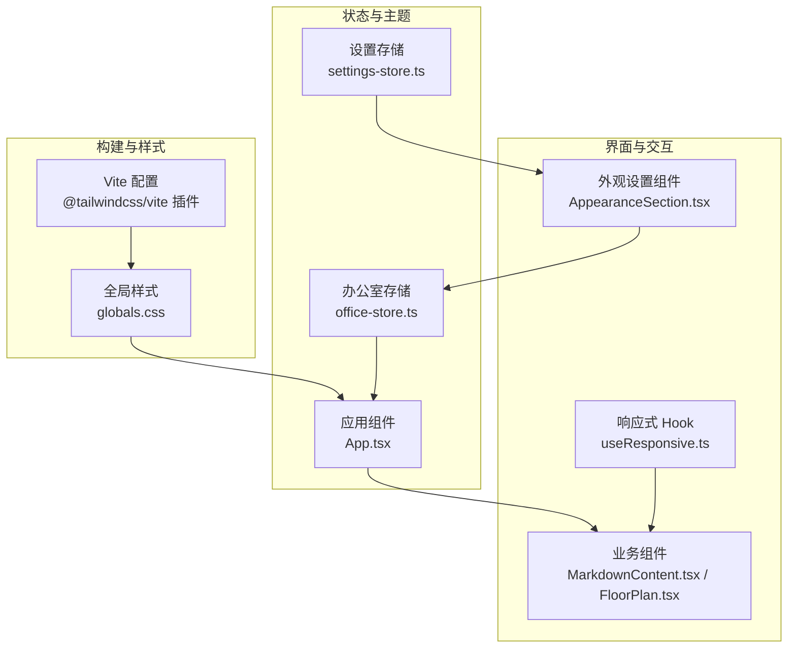
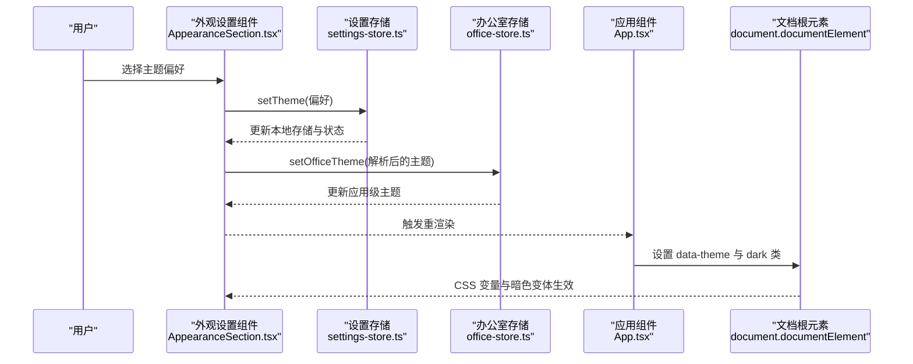
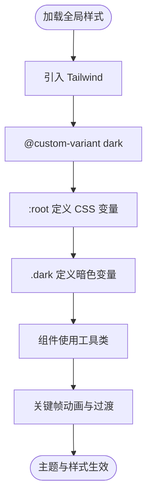
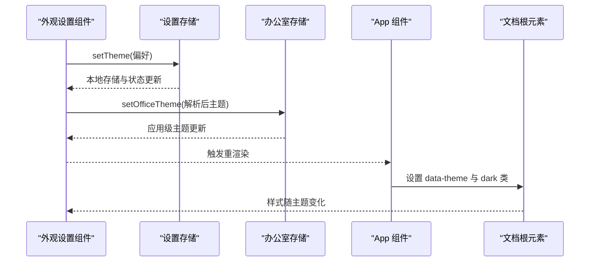
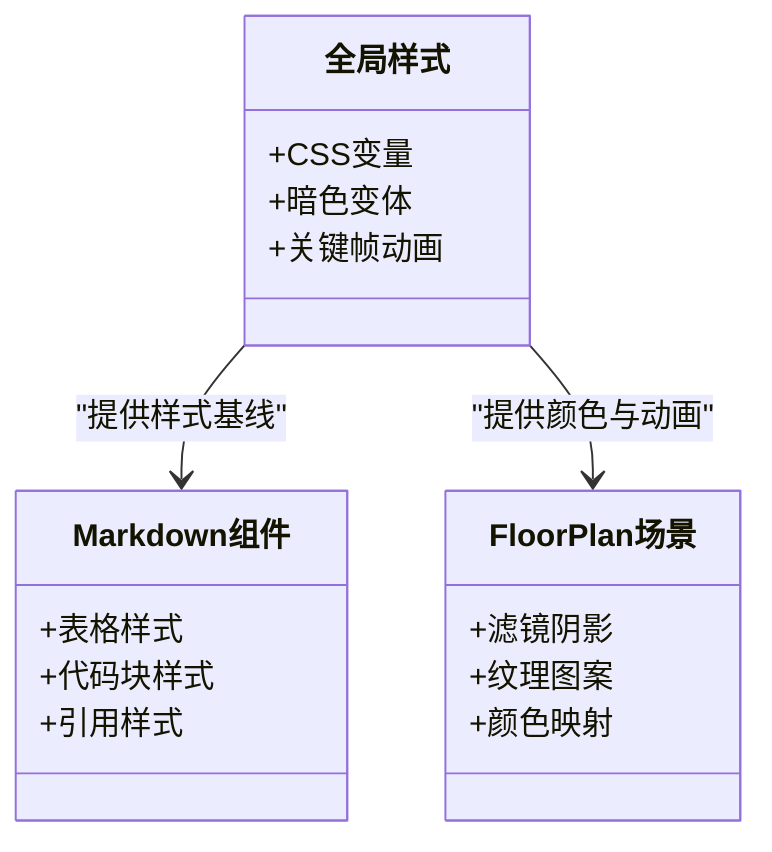
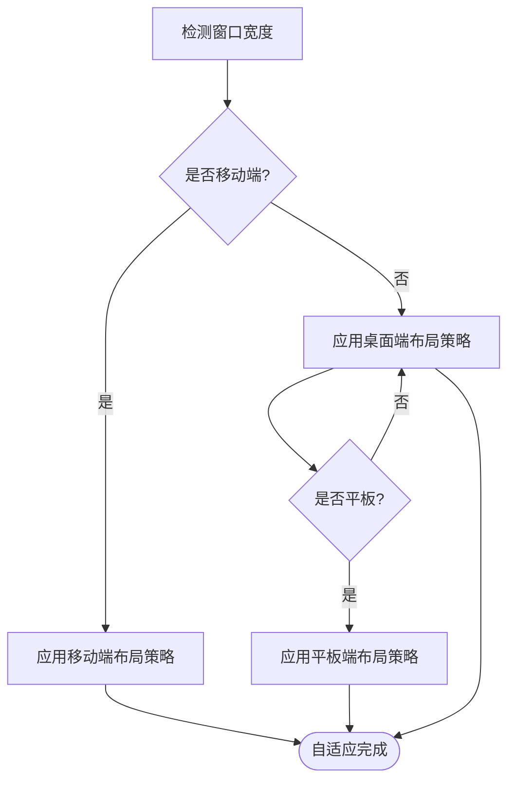
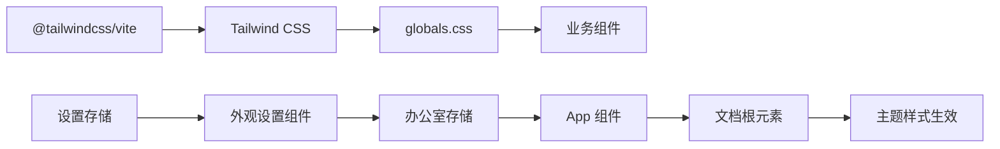

# 样式和主题系统

<cite>
**本文档引用的文件**
- [package.json](file://package.json)
- [vite.config.ts](file://vite.config.ts)
- [globals.css](file://src/styles/globals.css)
- [AppearanceSection.tsx](file://src/components/console/settings/AppearanceSection.tsx)
- [settings-store.ts](file://src/store/console-stores/settings-store.ts)
- [office-store.ts](file://src/store/office-store.ts)
- [App.tsx](file://src/App.tsx)
- [useResponsive.ts](file://src/hooks/useResponsive.ts)
- [MarkdownContent.tsx](file://src/components/chat/MarkdownContent.tsx)
- [StreamingMarkdownContent.tsx](file://src/components/chat/StreamingMarkdownContent.tsx)
- [FloorPlan.tsx](file://src/components/office-2d/FloorPlan.tsx)
</cite>

## 目录
1. [简介](#简介)
2. [项目结构](#项目结构)
3. [核心组件](#核心组件)
4. [架构总览](#架构总览)
5. [详细组件分析](#详细组件分析)
6. [依赖关系分析](#依赖关系分析)
7. [性能考虑](#性能考虑)
8. [故障排除指南](#故障排除指南)
9. [结论](#结论)
10. [附录](#附录)

## 简介
本文件系统性梳理 OpenClaw Office 的样式与主题体系，围绕 Tailwind CSS 4 配置（自定义主题、颜色系统、响应式断点、组件定制）、主题切换机制（明暗主题实现、CSS 变量管理、动态切换逻辑）、全局样式设计（基础样式、组件样式、动画与过渡）、响应式设计（移动端优化、自适应布局、触摸交互）、样式组织结构（模块化 CSS、组件样式隔离、样式继承机制）展开，并补充样式最佳实践、性能优化与浏览器兼容性建议，以及可操作的样式定制方法与使用示例。

## 项目结构
- 构建与样式集成
  - Vite 集成 @tailwindcss/vite 插件，启用 Tailwind CSS 4 的原生支持与自动扫描。
  - 全局样式入口通过 src/styles/globals.css 引入 Tailwind 并定义自定义变体与 CSS 变量。
- 主题与状态管理
  - 设置存储（Console Settings Store）负责用户偏好的主题与语言持久化。
  - 办公室状态存储（Office Store）负责应用级主题状态与初始值读取。
  - App 组件在运行时将主题同步到 documentElement，驱动 CSS 变量与类名切换。
- 响应式与交互
  - 使用自定义 Hook useResponsive 提供断点检测，配合 Tailwind 断点实现自适应布局。
  - 组件内广泛采用 Tailwind 工具类与暗色变体，确保跨组件一致的主题表现。

**图表来源**
- [vite.config.ts:342-382](file://vite.config.ts#L342-L382)
- [globals.css:1-152](file://src/styles/globals.css#L1-L152)
- [settings-store.ts:1-51](file://src/store/console-stores/settings-store.ts#L1-L51)
- [office-store.ts:75-84](file://src/store/office-store.ts#L75-L84)
- [App.tsx:20-33](file://src/App.tsx#L20-L33)
- [AppearanceSection.tsx:24-90](file://src/components/console/settings/AppearanceSection.tsx#L24-L90)
- [useResponsive.ts:9-42](file://src/hooks/useResponsive.ts#L9-L42)
- [MarkdownContent.tsx:54-91](file://src/components/chat/MarkdownContent.tsx#L54-L91)
- [FloorPlan.tsx:108-138](file://src/components/office-2d/FloorPlan.tsx#L108-L138)

**章节来源**
- [package.json:66-74](file://package.json#L66-L74)
- [vite.config.ts:342-382](file://vite.config.ts#L342-L382)
- [globals.css:1-152](file://src/styles/globals.css#L1-L152)

## 核心组件
- Tailwind CSS 4 配置与插件
  - 在 Vite 中通过 @tailwindcss/vite 启用 Tailwind，结合工具类与自定义变体实现主题与响应式。
- 自定义主题与颜色系统
  - 在 globals.css 中定义 :root 与 .dark 的 CSS 变量，覆盖区域颜色、提示框、链接色等，实现明暗主题统一切换。
- 主题切换机制
  - 设置存储负责偏好持久化；App 组件监听 Office Store 的 theme 状态，动态设置 data-theme 与 dark 类，驱动 CSS 变量与暗色变体。
- 全局样式设计
  - 定义关键帧动画（脉冲、流动、闪烁、入场/退场等），并在组件中以工具类调用，保证动效一致性。
- 响应式设计
  - useResponsive 提供断点状态，组件根据 isMobile/isTablet/isDesktop 应用不同布局策略。
- 样式组织结构
  - 采用模块化 CSS（globals.css）集中管理基础与主题变量，组件内部通过 Tailwind 工具类实现样式隔离与继承。

**章节来源**
- [globals.css:3-29](file://src/styles/globals.css#L3-L29)
- [globals.css:31-152](file://src/styles/globals.css#L31-L152)
- [App.tsx:20-33](file://src/App.tsx#L20-L33)
- [useResponsive.ts:9-42](file://src/hooks/useResponsive.ts#L9-L42)

## 架构总览
下图展示从用户操作到样式生效的端到端流程：外观设置组件更新偏好 -> 写入设置存储 -> 触发办公室存储主题变更 -> App 组件同步到 DOM -> Tailwind CSS 变量与暗色变体生效。

**图表来源**
- [AppearanceSection.tsx:24-34](file://src/components/console/settings/AppearanceSection.tsx#L24-L34)
- [settings-store.ts:31-50](file://src/store/console-stores/settings-store.ts#L31-L50)
- [office-store.ts:75-84](file://src/store/office-store.ts#L75-L84)
- [App.tsx:20-33](file://src/App.tsx#L20-L33)

## 详细组件分析

### Tailwind CSS 4 配置与自定义主题
- 配置要点
  - 在 Vite 中启用 @tailwindcss/vite 插件，使 Tailwind 能在开发与构建阶段正确生成样式。
  - 在 globals.css 中引入 Tailwind 并定义 @custom-variant dark，确保暗色变体作用于 .dark 或 :where(.dark, .dark *)。
- 自定义主题与颜色系统
  - :root 定义默认 CSS 变量（如区域背景、描边、标签、提示框、链接色等）。
  - .dark 定义暗色模式下的对应变量值，实现一键切换。
- 响应式断点与组件定制
  - 结合 useResponsive 的断点状态与 Tailwind 断点类，实现移动端、平板、桌面的差异化布局。
  - 组件内部通过工具类组合（如边框、背景、文本、阴影、动画等）实现风格统一与可维护性。

**图表来源**
- [globals.css:1-29](file://src/styles/globals.css#L1-L29)
- [globals.css:31-152](file://src/styles/globals.css#L31-L152)
- [useResponsive.ts:9-42](file://src/hooks/useResponsive.ts#L9-L42)

**章节来源**
- [package.json:66-74](file://package.json#L66-L74)
- [vite.config.ts:342-382](file://vite.config.ts#L342-L382)
- [globals.css:1-152](file://src/styles/globals.css#L1-L152)

### 主题切换机制：明暗主题实现、CSS 变量管理、动态切换逻辑
- 明暗主题实现
  - 通过 CSS 变量在 :root 与 .dark 中分别定义，确保在 light/dark/system 三种偏好下切换。
- CSS 变量管理
  - 区域颜色、描边、标签、提示框背景/描边/文字、SVG 链接色等均通过 CSS 变量统一管理，便于主题切换与扩展。
- 动态切换逻辑
  - 外观设置组件负责用户交互与偏好持久化；App 组件监听主题状态并设置 data-theme 与 dark 类，驱动 Tailwind 暗色变体与 CSS 变量生效。

**图表来源**
- [AppearanceSection.tsx:24-34](file://src/components/console/settings/AppearanceSection.tsx#L24-L34)
- [settings-store.ts:31-50](file://src/store/console-stores/settings-store.ts#L31-L50)
- [office-store.ts:75-84](file://src/store/office-store.ts#L75-L84)
- [App.tsx:20-33](file://src/App.tsx#L20-L33)

**章节来源**
- [AppearanceSection.tsx:19-34](file://src/components/console/settings/AppearanceSection.tsx#L19-L34)
- [settings-store.ts:9-19](file://src/store/console-stores/settings-store.ts#L9-L19)
- [office-store.ts:75-84](file://src/store/office-store.ts#L75-L84)
- [App.tsx:20-33](file://src/App.tsx#L20-L33)

### 全局样式设计：基础样式、组件样式、动画效果、过渡效果
- 基础样式
  - 在 globals.css 中集中定义 CSS 变量与暗色变体，确保所有组件共享同一套颜色体系。
- 组件样式
  - Markdown 渲染组件（MarkdownContent、StreamingMarkdownContent）通过工具类实现表格、代码块、引用等的明暗适配。
  - FloorPlan 场景组件通过 CSS 变量与滤镜实现建筑阴影、纹理图案等视觉层次。
- 动画与过渡
  - 定义了脉冲、流动、闪烁、入场/退场、思考点等关键帧动画，并在组件中以工具类触发，提升交互体验。

**图表来源**
- [globals.css:5-29](file://src/styles/globals.css#L5-L29)
- [globals.css:31-152](file://src/styles/globals.css#L31-L152)
- [MarkdownContent.tsx:54-91](file://src/components/chat/MarkdownContent.tsx#L54-L91)
- [StreamingMarkdownContent.tsx:107-135](file://src/components/chat/StreamingMarkdownContent.tsx#L107-L135)
- [FloorPlan.tsx:108-138](file://src/components/office-2d/FloorPlan.tsx#L108-L138)

**章节来源**
- [globals.css:1-152](file://src/styles/globals.css#L1-L152)
- [MarkdownContent.tsx:54-91](file://src/components/chat/MarkdownContent.tsx#L54-L91)
- [StreamingMarkdownContent.tsx:107-135](file://src/components/chat/StreamingMarkdownContent.tsx#L107-L135)
- [FloorPlan.tsx:108-138](file://src/components/office-2d/FloorPlan.tsx#L108-L138)

### 响应式设计：移动端优化、自适应布局、触摸交互
- 移动端优化
  - useResponsive 提供 isMobile/isTablet/isDesktop 状态，组件可根据断点调整布局与间距。
- 自适应布局
  - Tailwind 断点类与组件内的条件渲染相结合，实现不同设备的最佳显示效果。
- 触摸交互
  - 在移动端场景下，按钮、列表项等交互元素适当增大触控目标尺寸，提升可用性。

**图表来源**
- [useResponsive.ts:9-42](file://src/hooks/useResponsive.ts#L9-L42)

**章节来源**
- [useResponsive.ts:9-42](file://src/hooks/useResponsive.ts#L9-L42)

### 样式组织结构：模块化 CSS、组件样式隔离、样式继承机制
- 模块化 CSS
  - 将全局样式集中在 globals.css，按功能拆分（颜色、动画、变体），避免重复与冲突。
- 组件样式隔离
  - 通过 Tailwind 工具类与暗色变体，确保组件在不同主题下保持一致的视觉语义。
- 样式继承机制
  - CSS 变量作为继承基线，子组件通过工具类或变体继承父级主题状态，减少样板代码。

**章节来源**
- [globals.css:1-152](file://src/styles/globals.css#L1-L152)

## 依赖关系分析
- 构建与样式
  - Vite 通过 @tailwindcss/vite 插件集成 Tailwind，确保样式在开发与生产环境的一致生成。
- 主题与状态
  - AppearanceSection 与设置存储协作，将用户偏好写入 localStorage；Office Store 负责应用级主题状态；App 组件负责将状态同步到 DOM。
- 组件与样式
  - 各业务组件通过工具类与暗色变体消费全局样式，形成统一的视觉与交互体验。

**图表来源**
- [package.json:66-74](file://package.json#L66-L74)
- [vite.config.ts:342-382](file://vite.config.ts#L342-L382)
- [globals.css:1-152](file://src/styles/globals.css#L1-L152)
- [AppearanceSection.tsx:24-34](file://src/components/console/settings/AppearanceSection.tsx#L24-L34)
- [settings-store.ts:31-50](file://src/store/console-stores/settings-store.ts#L31-L50)
- [office-store.ts:75-84](file://src/store/office-store.ts#L75-L84)
- [App.tsx:20-33](file://src/App.tsx#L20-L33)

**章节来源**
- [package.json:66-74](file://package.json#L66-L74)
- [vite.config.ts:342-382](file://vite.config.ts#L342-L382)
- [globals.css:1-152](file://src/styles/globals.css#L1-L152)
- [AppearanceSection.tsx:24-34](file://src/components/console/settings/AppearanceSection.tsx#L24-L34)
- [settings-store.ts:31-50](file://src/store/console-stores/settings-store.ts#L31-L50)
- [office-store.ts:75-84](file://src/store/office-store.ts#L75-L84)
- [App.tsx:20-33](file://src/App.tsx#L20-L33)

## 性能考虑
- 样式体积控制
  - 仅引入必要的工具类与变体，避免过度使用未使用的 Tailwind 类导致包体膨胀。
- 动画与过渡
  - 关键帧动画尽量使用 GPU 友好的属性（如 transform、opacity），减少重排与重绘。
- 主题切换
  - 通过 CSS 变量与暗色变体实现主题切换，避免在 JS 中频繁修改样式对象，降低渲染成本。
- 响应式策略
  - 在移动端优先使用更少的布局层级与更小的图片/图标，减少首屏渲染压力。

## 故障排除指南
- 主题未生效
  - 检查 App 组件是否正确设置 data-theme 与 dark 类；确认 Office Store 的 theme 是否被更新。
- CSS 变量不生效
  - 确认 globals.css 中 :root 与 .dark 的变量定义完整；检查组件是否使用正确的工具类或变体。
- 响应式异常
  - 检查 useResponsive 的断点逻辑与组件内的条件渲染；确保 Tailwind 断点类拼写正确。
- 动画卡顿
  - 检查关键帧动画是否使用了昂贵属性；必要时简化动画或降低帧率。

**章节来源**
- [App.tsx:20-33](file://src/App.tsx#L20-L33)
- [globals.css:1-152](file://src/styles/globals.css#L1-L152)
- [useResponsive.ts:9-42](file://src/hooks/useResponsive.ts#L9-L42)

## 结论
本项目的样式与主题系统以 Tailwind CSS 4 为核心，结合 CSS 变量与暗色变体，实现了统一、可维护且高性能的主题切换与全局样式管理。通过设置存储与状态存储的协同、App 组件的动态同步，以及组件层面的工具类与动画策略，整体方案在易用性、一致性与扩展性方面表现良好。建议在后续迭代中持续关注样式体积与动画性能，并完善主题变量的文档与示例，以提升团队协作效率。

## 附录
- 样式定制方法与使用示例（路径指引）
  - 自定义颜色变量：在 globals.css 的 :root 与 .dark 中添加新变量，组件通过工具类或变体消费。
  - 新增关键帧动画：在 globals.css 中定义关键帧，组件通过工具类触发。
  - 响应式布局：使用 useResponsive 获取断点状态，配合 Tailwind 断点类实现自适应。
  - 主题偏好持久化：通过设置存储的 setTheme 方法写入偏好，App 组件自动同步。
  - 组件样式隔离：在业务组件中使用工具类与暗色变体，避免样式泄漏。

**章节来源**
- [globals.css:1-152](file://src/styles/globals.css#L1-L152)
- [useResponsive.ts:9-42](file://src/hooks/useResponsive.ts#L9-L42)
- [settings-store.ts:31-50](file://src/store/console-stores/settings-store.ts#L31-L50)
- [office-store.ts:75-84](file://src/store/office-store.ts#L75-L84)
- [App.tsx:20-33](file://src/App.tsx#L20-L33)