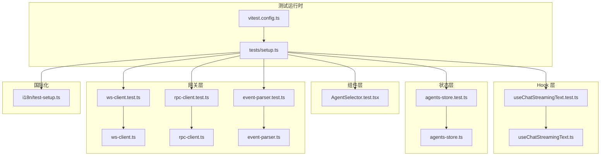
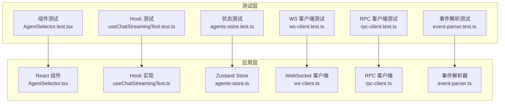
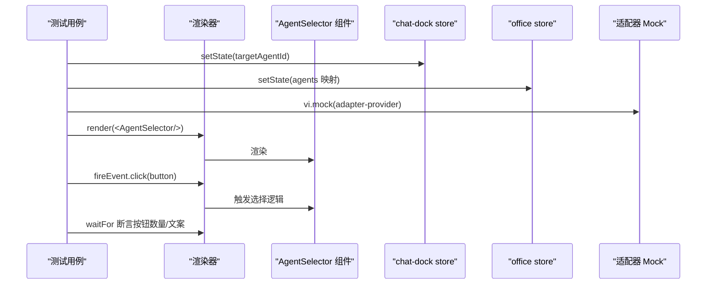
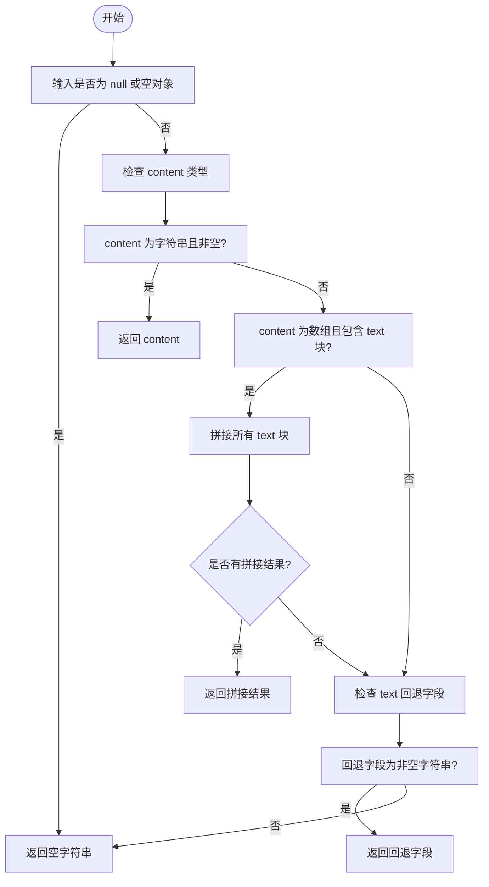
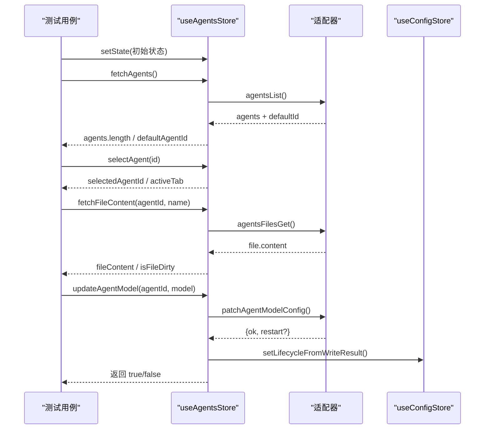
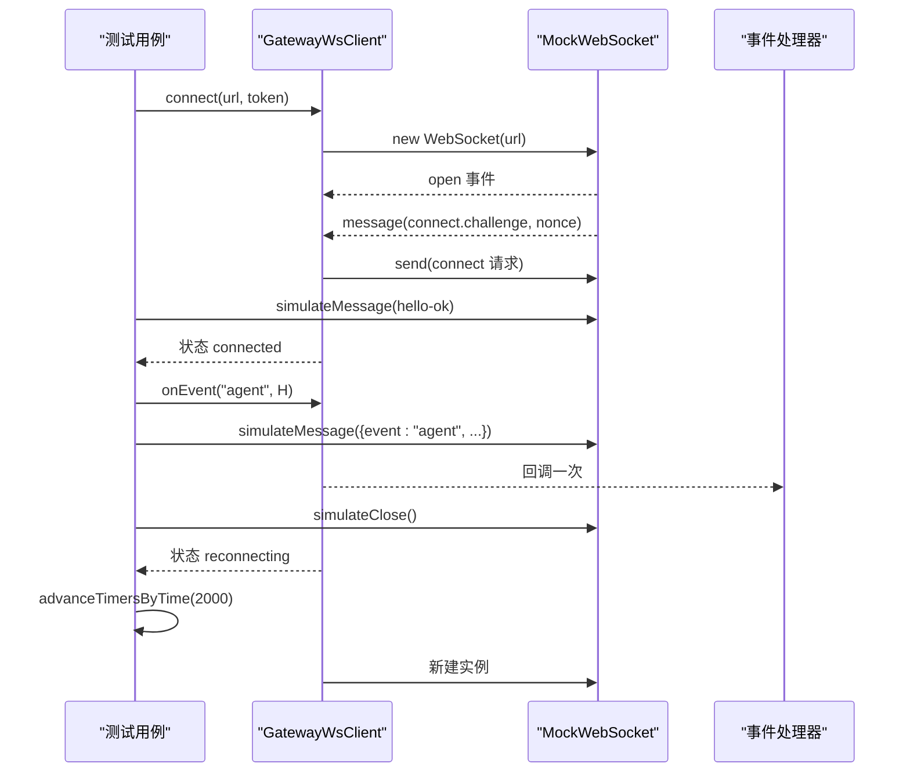
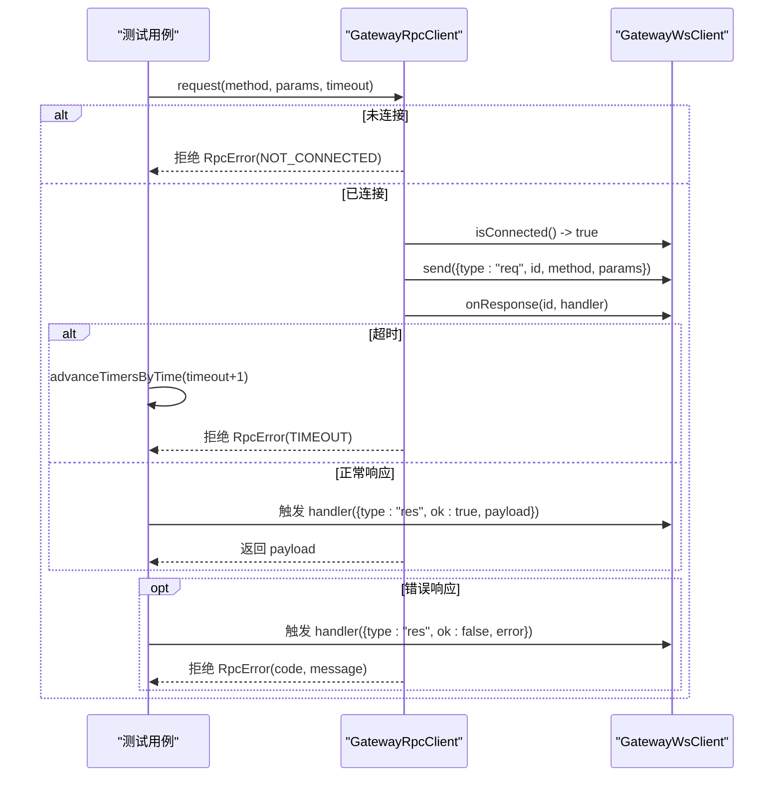
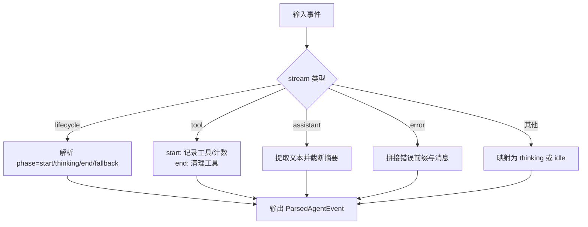
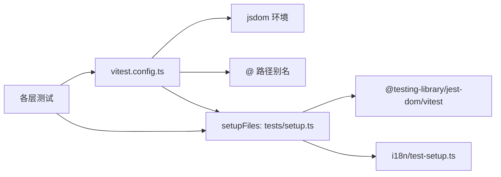

# 单元测试

<cite>
**本文引用的文件**
- [vitest.config.ts](file://vitest.config.ts)
- [tests/setup.ts](file://tests/setup.ts)
- [package.json](file://package.json)
- [src/components/chat/AgentSelector.test.tsx](file://src/components/chat/AgentSelector.test.tsx)
- [src/hooks/__tests__/useChatStreamingText.test.ts](file://src/hooks/__tests__/useChatStreamingText.test.ts)
- [src/hooks/useChatStreamingText.ts](file://src/hooks/useChatStreamingText.ts)
- [src/store/__tests__/agents-store.test.ts](file://src/store/__tests__/agents-store.test.ts)
- [src/store/console-stores/agents-store.ts](file://src/store/console-stores/agents-store.ts)
- [src/gateway/__tests__/ws-client.test.ts](file://src/gateway/__tests__/ws-client.test.ts)
- [src/gateway/ws-client.ts](file://src/gateway/ws-client.ts)
- [src/gateway/__tests__/rpc-client.test.ts](file://src/gateway/__tests__/rpc-client.test.ts)
- [src/gateway/rpc-client.ts](file://src/gateway/rpc-client.ts)
- [src/gateway/__tests__/event-parser.test.ts](file://src/gateway/__tests__/event-parser.test.ts)
- [src/gateway/event-parser.ts](file://src/gateway/event-parser.ts)
- [src/i18n/test-setup.ts](file://src/i18n/test-setup.ts)
</cite>

## 目录
1. [引言](#引言)
2. [项目结构](#项目结构)
3. [核心组件](#核心组件)
4. [架构总览](#架构总览)
5. [详细组件分析](#详细组件分析)
6. [依赖分析](#依赖分析)
7. [性能考虑](#性能考虑)
8. [故障排查指南](#故障排查指南)
9. [结论](#结论)
10. [附录](#附录)

## 引言
本文件系统性梳理 OpenClaw-Office 的单元测试架构与实践，覆盖以下主题：
- 组件测试：React 组件渲染、交互与状态联动
- Hook 测试：纯函数与派生逻辑的断言
- 工具函数测试：消息流文本提取与清理
- 状态管理测试：Zustand store 行为、异步数据加载与副作用
- 网关通信测试：WebSocket 适配器、RPC 客户端、事件解析
- 测试工具配置：Vitest 配置、测试环境与 Mock 策略
- 编写指南：用例组织、断言方法、异步处理与覆盖率建议

## 项目结构
测试相关目录与文件分布如下：
- 测试运行时配置：vitest.config.ts、tests/setup.ts
- 组件测试：src/components/**/*test.tsx
- Hook 测试：src/hooks/**/*test.ts
- 工具函数测试：src/lib/**/*test.ts（示例：lobster-parser.test.ts）
- 状态管理测试：src/store/**/*test.ts
- 网关通信测试：src/gateway/**/*test.ts
- 国际化测试初始化：src/i18n/test-setup.ts

**图表来源**
- [vitest.config.ts:1-20](file://vitest.config.ts#L1-L20)
- [tests/setup.ts:1-3](file://tests/setup.ts#L1-L3)
- [src/components/chat/AgentSelector.test.tsx:1-77](file://src/components/chat/AgentSelector.test.tsx#L1-L77)
- [src/hooks/__tests__/useChatStreamingText.test.ts:1-93](file://src/hooks/__tests__/useChatStreamingText.test.ts#L1-L93)
- [src/hooks/useChatStreamingText.ts:1-88](file://src/hooks/useChatStreamingText.ts#L1-L88)
- [src/store/__tests__/agents-store.test.ts:1-152](file://src/store/__tests__/agents-store.test.ts#L1-L152)
- [src/store/console-stores/agents-store.ts:1-642](file://src/store/console-stores/agents-store.ts#L1-L642)
- [src/gateway/__tests__/ws-client.test.ts:1-207](file://src/gateway/__tests__/ws-client.test.ts#L1-L207)
- [src/gateway/ws-client.ts:1-304](file://src/gateway/ws-client.ts#L1-L304)
- [src/gateway/__tests__/rpc-client.test.ts:1-79](file://src/gateway/__tests__/rpc-client.test.ts#L1-L79)
- [src/gateway/rpc-client.ts:1-63](file://src/gateway/rpc-client.ts#L1-L63)
- [src/gateway/__tests__/event-parser.test.ts:1-141](file://src/gateway/__tests__/event-parser.test.ts#L1-L141)
- [src/gateway/event-parser.ts:1-225](file://src/gateway/event-parser.ts#L1-L225)
- [src/i18n/test-setup.ts:1-45](file://src/i18n/test-setup.ts#L1-L45)

**章节来源**
- [vitest.config.ts:1-20](file://vitest.config.ts#L1-L20)
- [tests/setup.ts:1-3](file://tests/setup.ts#L1-L3)
- [package.json:1-83](file://package.json#L1-L83)

## 核心组件
- 测试运行时与环境
  - Vitest 配置启用 jsdom 环境、全局断言、路径别名与测试文件扫描规则
  - 测试入口注入 @testing-library/jest-dom 与 i18n 初始化
- 组件测试
  - 使用 @testing-library/react 进行渲染与交互断言
  - 通过 vi.mock 对外部依赖进行隔离
- Hook 测试
  - 对纯函数进行输入输出断言，覆盖边界与异常分支
- 状态管理测试
  - 以 Zustand store 为中心，验证异步动作、状态变更与副作用
- 网关通信测试
  - WebSocket 客户端：连接握手、设备身份签名、重连机制、事件分发
  - RPC 客户端：请求超时、响应解析、错误包装
  - 事件解析：多流类型的状态映射与摘要生成

**章节来源**
- [vitest.config.ts:1-20](file://vitest.config.ts#L1-L20)
- [tests/setup.ts:1-3](file://tests/setup.ts#L1-L3)
- [src/i18n/test-setup.ts:1-45](file://src/i18n/test-setup.ts#L1-L45)

## 架构总览
下图展示测试架构中各层之间的关系与交互：

**图表来源**
- [src/components/chat/AgentSelector.test.tsx:1-77](file://src/components/chat/AgentSelector.test.tsx#L1-L77)
- [src/hooks/__tests__/useChatStreamingText.test.ts:1-93](file://src/hooks/__tests__/useChatStreamingText.test.ts#L1-L93)
- [src/store/__tests__/agents-store.test.ts:1-152](file://src/store/__tests__/agents-store.test.ts#L1-L152)
- [src/gateway/__tests__/ws-client.test.ts:1-207](file://src/gateway/__tests__/ws-client.test.ts#L1-L207)
- [src/gateway/__tests__/rpc-client.test.ts:1-79](file://src/gateway/__tests__/rpc-client.test.ts#L1-L79)
- [src/gateway/__tests__/event-parser.test.ts:1-141](file://src/gateway/__tests__/event-parser.test.ts#L1-L141)

## 详细组件分析

### 组件测试：React 组件
- 目标：验证组件在不同状态下的渲染、交互与副作用
- 方法：
  - 渲染与查询：使用 render 与 screen 查询 DOM 元素
  - 事件触发：fireEvent 触发点击、输入等用户行为
  - 状态断言：waitFor 等待异步状态更新后断言
  - 外部依赖隔离：vi.mock 适配器与 store 初始状态
- 示例要点（AgentSelector）：
  - 初始化 chat-dock 与 office store 的目标 agent
  - Mock 适配器返回的 agents 列表
  - 断言按钮存在、点击后列表变化

**图表来源**
- [src/components/chat/AgentSelector.test.tsx:1-77](file://src/components/chat/AgentSelector.test.tsx#L1-L77)
- [src/store/console-stores/chat-dock-store.ts](file://src/store/console-stores/chat-dock-store.ts)
- [src/store/office-store.ts](file://src/store/office-store.ts)

**章节来源**
- [src/components/chat/AgentSelector.test.tsx:1-77](file://src/components/chat/AgentSelector.test.tsx#L1-L77)

### Hook 测试：纯函数与派生逻辑
- 目标：对无副作用的纯函数进行完备的输入输出断言
- 方法：
  - 覆盖空值、数组、字符串回退、标签提取与清理等分支
  - 断言返回值满足预期格式与长度限制
- 示例要点（useChatStreamingText）：
  - extractStreamingTextFromMessage：字符串、内容块、回退字段
  - extractThinkingFromMessage：thinking 字段、内容块、标签
  - stripThinkingTags：移除标签后的可见文本

**图表来源**
- [src/hooks/__tests__/useChatStreamingText.test.ts:1-93](file://src/hooks/__tests__/useChatStreamingText.test.ts#L1-L93)
- [src/hooks/useChatStreamingText.ts:1-88](file://src/hooks/useChatStreamingText.ts#L1-L88)

**章节来源**
- [src/hooks/__tests__/useChatStreamingText.test.ts:1-93](file://src/hooks/__tests__/useChatStreamingText.test.ts#L1-L93)
- [src/hooks/useChatStreamingText.ts:1-88](file://src/hooks/useChatStreamingText.ts#L1-L88)

### 状态管理测试：Zustand Store
- 目标：验证 store 的异步动作、状态变更与副作用
- 方法：
  - 初始化适配器与 store 初始状态
  - 调用 action 并断言状态字段变化
  - 验证与 config store 的联动（生命周期状态）
- 示例要点（Agents Store）：
  - fetchAgents：加载 agents 列表、默认 agent 设置
  - selectAgent：切换选中 agent 并重置标签页
  - 文件操作：读取、修改、保存、恢复
  - 模型更新：持久化配置、触发生命周期状态

**图表来源**
- [src/store/__tests__/agents-store.test.ts:1-152](file://src/store/__tests__/agents-store.test.ts#L1-L152)
- [src/store/console-stores/agents-store.ts:1-642](file://src/store/console-stores/agents-store.ts#L1-L642)

**章节来源**
- [src/store/__tests__/agents-store.test.ts:1-152](file://src/store/__tests__/agents-store.test.ts#L1-L152)
- [src/store/console-stores/agents-store.ts:1-642](file://src/store/console-stores/agents-store.ts#L1-L642)

### 网关通信测试：WebSocket 适配器
- 目标：验证连接握手、设备身份签名、事件分发与重连策略
- 方法：
  - 替换全局 WebSocket 为可控制的 MockWebSocket
  - 使用 vi.useFakeTimers 控制定时器
  - 断言发送帧、状态变更与事件回调
- 示例要点（GatewayWsClient）：
  - challenge -> connect 请求：校验 client.id、auth.token
  - secure context 下的设备签名：deviceId/publicKey/signature/nonce
  - hello-ok 后状态变为 connected
  - 事件分发：注册处理器并断言回调次数
  - 关闭与重连：关闭后进入 reconnecting，延迟后新建实例
  - shutdown 事件：停止重连并断开

**图表来源**
- [src/gateway/__tests__/ws-client.test.ts:1-207](file://src/gateway/__tests__/ws-client.test.ts#L1-L207)
- [src/gateway/ws-client.ts:1-304](file://src/gateway/ws-client.ts#L1-L304)

**章节来源**
- [src/gateway/__tests__/ws-client.test.ts:1-207](file://src/gateway/__tests__/ws-client.test.ts#L1-L207)
- [src/gateway/ws-client.ts:1-304](file://src/gateway/ws-client.ts#L1-L304)

### 网关通信测试：RPC 客户端
- 目标：验证请求超时、成功响应与错误包装
- 方法：
  - 通过 spyOn 隔离 wsClient 的 isConnected/send/onResponse
  - 手动触发响应处理器以模拟服务端返回
- 示例要点（GatewayRpcClient）：
  - 未连接：拒绝 NOT_CONNECTED 错误
  - 超时：定时器触发后拒绝 TIMEOUT
  - 成功：payload 解析并返回
  - 错误：封装为 RpcError 并携带 code/message

**图表来源**
- [src/gateway/__tests__/rpc-client.test.ts:1-79](file://src/gateway/__tests__/rpc-client.test.ts#L1-L79)
- [src/gateway/rpc-client.ts:1-63](file://src/gateway/rpc-client.ts#L1-L63)

**章节来源**
- [src/gateway/__tests__/rpc-client.test.ts:1-79](file://src/gateway/__tests__/rpc-client.test.ts#L1-L79)
- [src/gateway/rpc-client.ts:1-63](file://src/gateway/rpc-client.ts#L1-L63)

### 网关通信测试：事件解析
- 目标：验证多流类型的事件到可视化状态的映射与摘要生成
- 方法：
  - 构造不同 stream/data 的事件载荷
  - 断言状态、工具/语音气泡、计数与摘要
- 示例要点（parseAgentEvent）：
  - lifecycle：start/thinking/end/fallback 映射为 thinking/idle/error
  - tool：start 记录当前工具并增量计数；end 清理工具
  - assistant：提取文本并截断摘要
  - error：拼接错误前缀与消息
  - 边界：未知流返回 idle，缺失字段安全降级

**图表来源**
- [src/gateway/__tests__/event-parser.test.ts:1-141](file://src/gateway/__tests__/event-parser.test.ts#L1-L141)
- [src/gateway/event-parser.ts:1-225](file://src/gateway/event-parser.ts#L1-L225)

**章节来源**
- [src/gateway/__tests__/event-parser.test.ts:1-141](file://src/gateway/__tests__/event-parser.test.ts#L1-L141)
- [src/gateway/event-parser.ts:1-225](file://src/gateway/event-parser.ts#L1-L225)

## 依赖分析
- 测试运行时依赖
  - Vitest 与 jsdom 提供 DOM 环境与测试执行能力
  - @testing-library/jest-dom/vitest 提供 DOM 断言扩展
  - i18n 初始化确保翻译可用
- 组件测试依赖
  - @testing-library/react 与 vitest
  - vi.mock 隔离外部依赖（如适配器）
- 状态管理测试依赖
  - Zustand store 与适配器提供真实异步行为
  - config store 作为副作用目标
- 网关通信测试依赖
  - 自定义 MockWebSocket 与 vi.useFakeTimers
  - 设备身份签名与本地存储

**图表来源**
- [vitest.config.ts:1-20](file://vitest.config.ts#L1-L20)
- [tests/setup.ts:1-3](file://tests/setup.ts#L1-L3)
- [src/i18n/test-setup.ts:1-45](file://src/i18n/test-setup.ts#L1-L45)

**章节来源**
- [vitest.config.ts:1-20](file://vitest.config.ts#L1-L20)
- [tests/setup.ts:1-3](file://tests/setup.ts#L1-L3)
- [package.json:1-83](file://package.json#L1-L83)

## 性能考虑
- 测试并发与隔离
  - 使用 vi.useFakeTimers 控制定时器，避免真实等待
  - MockWebSocket 实例复用与 reset，减少重复创建成本
- 断言粒度
  - 优先断言关键状态与副作用，避免冗余断言
  - 对异步流程使用 waitFor 确保稳定断言
- 资源释放
  - 测试结束后清理定时器与连接，防止泄漏

## 故障排查指南
- 常见问题
  - 未初始化 i18n：导致翻译键无法解析，需确认 tests/setup.ts 注入
  - 适配器未 mock：导致真实网络请求或状态污染，需在测试前 vi.mock
  - WebSocket 未替换：导致真实连接与定时器影响，需替换全局 WebSocket
- 排查步骤
  - 确认 vitest.config.ts 的 include 与环境设置
  - 在测试文件顶部添加必要的 setup 与 mock
  - 使用最小化用例定位问题范围

**章节来源**
- [tests/setup.ts:1-3](file://tests/setup.ts#L1-L3)
- [src/i18n/test-setup.ts:1-45](file://src/i18n/test-setup.ts#L1-L45)

## 结论
本项目采用 Vitest + jsdom 的前端测试方案，结合 @testing-library/react 与自定义 Mock，实现了对组件、Hook、状态管理与网关通信的全面覆盖。通过合理的 Mock 策略与断言设计，测试具备高稳定性与可维护性。建议持续完善覆盖率与边界用例，确保关键路径与异常场景得到充分验证。

## 附录
- 测试用例编写指南
  - 组织结构：按功能模块划分目录，文件命名以 .test.* 结尾
  - 用例命名：描述“在…条件下…期望…”
  - 断言方法：优先使用 @testing-library 的语义化查询与 jest-dom 断言
  - 异步处理：使用 vitest 的 fake timers 与 waitFor
  - Mock 策略：对外部依赖进行最小化隔离，避免真实网络与 I/O
- 覆盖率要求
  - 建议核心业务逻辑（store actions、事件解析、Hook 纯函数）达到较高覆盖率
  - 组件交互与边界条件逐步补齐，确保关键分支与异常路径覆盖