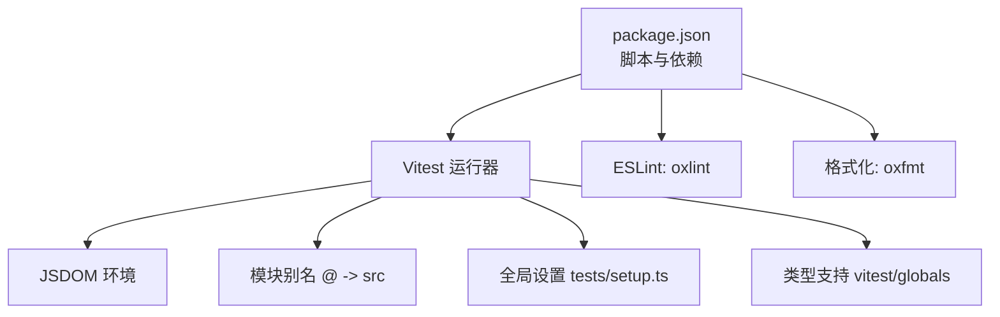
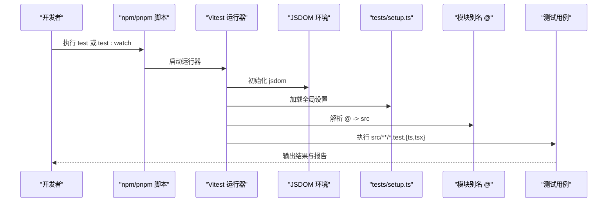
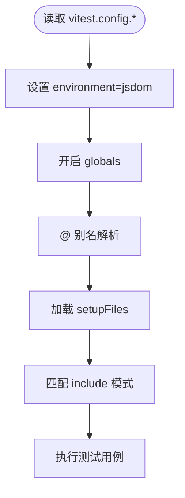
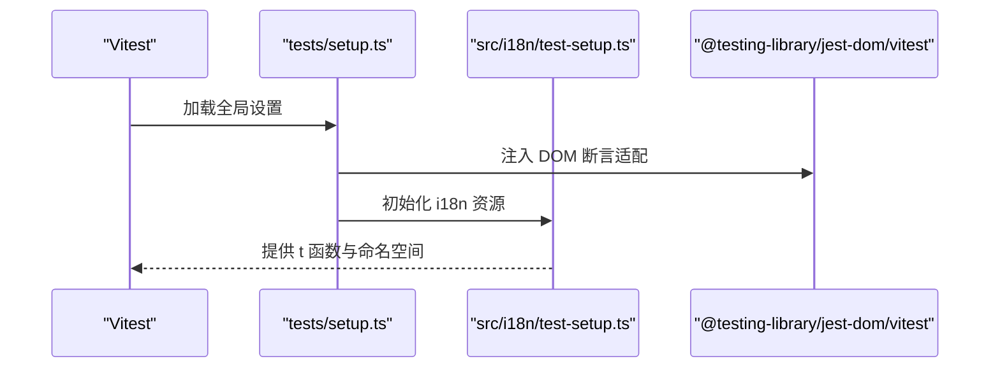
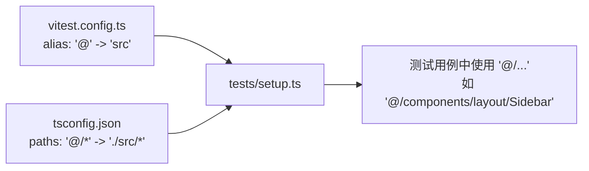
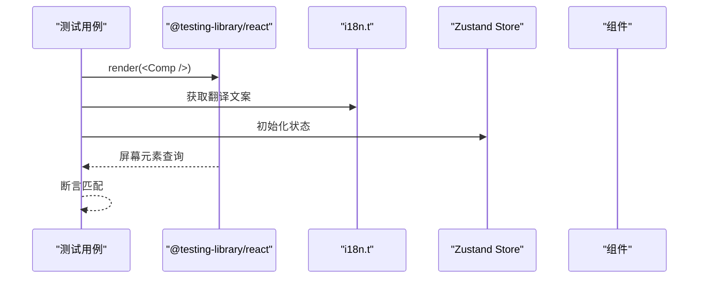
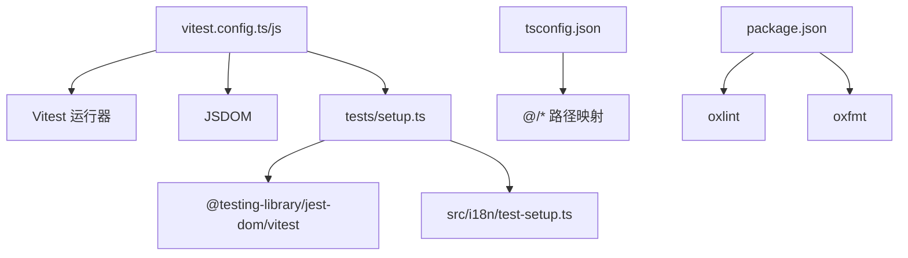

# 测试配置

<cite>
**本文引用的文件**
- [vitest.config.ts](file://vitest.config.ts)
- [vitest.config.js](file://vitest.config.js)
- [vitest.config.d.ts](file://vitest.config.d.ts)
- [package.json](file://package.json)
- [tsconfig.json](file://tsconfig.json)
- [tsconfig.node.json](file://tsconfig.node.json)
- [tests/setup.ts](file://tests/setup.ts)
- [src/i18n/test-setup.ts](file://src/i18n/test-setup.ts)
- [src/components/layout/__tests__/Sidebar.test.tsx](file://src/components/layout/__tests__/Sidebar.test.tsx)
- [src/components/layout/__tests__/TopBar-viewmode.test.tsx](file://src/components/layout/__tests__/TopBar-viewmode.test.tsx)
- [src/lib/assistant-collaboration-hints.test.ts](file://src/lib/assistant-collaboration-hints.test.ts)
- [src/lib/assistant-collaboration-hints.ts](file://src/lib/assistant-collaboration-hints.ts)
</cite>

## 目录
1. [简介](#简介)
2. [项目结构](#项目结构)
3. [核心组件](#核心组件)
4. [架构总览](#架构总览)
5. [详细组件分析](#详细组件分析)
6. [依赖分析](#依赖分析)
7. [性能考虑](#性能考虑)
8. [故障排查指南](#故障排查指南)
9. [结论](#结论)
10. [附录](#附录)

## 简介
本文件面向测试配置与运行，系统性梳理本项目在 Vitest 下的测试环境设置、模块别名、插件与工具集成、覆盖率配置、CI/CD 集成、性能优化与最佳实践。当前仓库同时存在 TypeScript 与 JavaScript 的 Vitest 配置文件，二者功能一致，均指向同一测试入口与 JSDOM 环境；测试工具链通过 TypeScript 编译器与 Vite 协同，结合 ESLint、Prettier（oxlint/oxfmt）与 Vitest 运行器完成端到端测试。

## 项目结构
- 测试运行器：Vitest（通过脚本命令触发）
- 测试环境：JSDOM（模拟浏览器 DOM 环境）
- 模块别名：@ 指向 src 根目录
- 全局设置：通过 tests/setup.ts 注入测试库与国际化初始化
- 类型支持：tsconfig 中启用 vitest/globals 类型声明
- 工具链：ESLint（oxlint）、格式化（oxfmt）

图表来源
- [package.json:35-47](file://package.json#L35-L47)
- [vitest.config.ts:7-19](file://vitest.config.ts#L7-L19)
- [tsconfig.json:12](file://tsconfig.json#L12)

章节来源
- [package.json:35-47](file://package.json#L35-L47)
- [vitest.config.ts:7-19](file://vitest.config.ts#L7-L19)
- [tsconfig.json:12](file://tsconfig.json#L12)

## 核心组件
- Vitest 配置
  - 环境：jsdom
  - 全局：开启 globals
  - 别名：@ -> src
  - 设置文件：tests/setup.ts
  - 包含模式：src/**/*.test.{ts,tsx}
- 测试设置
  - 引入 @testing-library/jest-dom/vitest 适配器
  - 初始化 i18n 资源（中英文多命名空间）
- TypeScript 配置
  - 启用 vitest/globals 类型
  - 路径映射 @/* -> ./src/*
- 工具链
  - Lint：oxlint
  - 格式化：oxfmt
  - 构建：tsc + vite

章节来源
- [vitest.config.ts:7-19](file://vitest.config.ts#L7-L19)
- [tests/setup.ts:1-3](file://tests/setup.ts#L1-L3)
- [src/i18n/test-setup.ts:16-42](file://src/i18n/test-setup.ts#L16-L42)
- [tsconfig.json:12](file://tsconfig.json#L12)
- [tsconfig.json:21-23](file://tsconfig.json#L21-L23)
- [package.json:42](file://package.json#L42)
- [package.json:40](file://package.json#L40)

## 架构总览
下图展示测试执行的关键路径：从 npm 脚本触发 Vitest，加载 JSDOM 环境与全局设置，解析模块别名，执行测试用例并进行断言。

图表来源
- [package.json:45-46](file://package.json#L45-L46)
- [vitest.config.ts:13-18](file://vitest.config.ts#L13-L18)
- [tests/setup.ts:1-3](file://tests/setup.ts#L1-L3)

## 详细组件分析

### 组件一：Vitest 配置与运行参数
- 环境设置
  - environment: jsdom，确保 DOM API 可用，适合 React 组件与路由测试
- 全局能力
  - globals: true，允许直接使用 describe/it/expect 等顶层 API
- 模块别名
  - alias: @ -> src，便于统一导入路径
- 设置文件
  - setupFiles: tests/setup.ts，注入测试库与国际化初始化
- 测试范围
  - include: src/**/*.test.{ts,tsx}，限定测试文件匹配
- 并发与超时
  - 默认并发策略由 Vitest 控制；未显式配置超时与重试
- 报告输出
  - 未显式配置 reporter；默认行为取决于运行器与 CI 环境

图表来源
- [vitest.config.ts:13-18](file://vitest.config.ts#L13-L18)

章节来源
- [vitest.config.ts:7-19](file://vitest.config.ts#L7-L19)
- [vitest.config.js:5-17](file://vitest.config.js#L5-L17)

### 组件二：测试环境设置与国际化
- JSDOM 配置
  - 在 vitest.config.ts 中指定 environment: jsdom，满足 DOM API 使用需求
- 全局 Mock 与适配器
  - tests/setup.ts 引入 @testing-library/jest-dom/vitest，提供 DOM 断言扩展
- 国际化初始化
  - tests/setup.ts 引入 src/i18n/test-setup.ts，提前初始化 i18n 资源（中英双语、多命名空间），避免测试中重复初始化
- 测试数据库与环境变量
  - 未发现专门的测试数据库或环境变量隔离配置；建议在 CI 中通过环境变量覆盖默认值

图表来源
- [tests/setup.ts:1-3](file://tests/setup.ts#L1-L3)
- [src/i18n/test-setup.ts:16-42](file://src/i18n/test-setup.ts#L16-L42)

章节来源
- [tests/setup.ts:1-3](file://tests/setup.ts#L1-L3)
- [src/i18n/test-setup.ts:16-42](file://src/i18n/test-setup.ts#L16-L42)
- [vitest.config.ts:14](file://vitest.config.ts#L14)

### 组件三：模块别名与路径映射
- 别名定义
  - vitest.config.ts 中将 @ 映射到 src
- TypeScript 路径
  - tsconfig.json 中配置 paths: "@/*": ["./src/*"]，保证编译期与运行期一致
- 影响范围
  - 所有测试与源码均可通过 @/xxx 导入，提升可维护性

图表来源
- [vitest.config.ts:8-12](file://vitest.config.ts#L8-L12)
- [tsconfig.json:21-23](file://tsconfig.json#L21-L23)

章节来源
- [vitest.config.ts:8-12](file://vitest.config.ts#L8-L12)
- [tsconfig.json:21-23](file://tsconfig.json#L21-L23)

### 组件四：测试工具集成（TypeScript、ESLint、Prettier）
- TypeScript 支持
  - tsconfig.json 启用 vitest/globals 类型，使测试文件可直接使用 Vitest 全局 API
- ESLint 集成
  - package.json 中提供 lint 脚本，使用 oxlint 对 src/ 进行静态检查
- Prettier/格式检查
  - package.json 中提供 format 与 format:check 脚本，使用 oxfmt 对 src/ 进行格式化与检查
- 与 Vitest 的关系
  - 上述工具链独立于 Vitest，建议在提交前统一执行以保证质量

章节来源
- [tsconfig.json:12](file://tsconfig.json#L12)
- [package.json:42](file://package.json#L42)
- [package.json:40](file://package.json#L40)

### 组件五：测试运行配置（并行、超时、重试、报告）
- 并行测试
  - 未在配置中显式设置；默认遵循 Vitest 行为
- 超时设置
  - 未在配置中显式设置；默认遵循 Vitest 行为
- 重试机制
  - 未在配置中显式设置；默认遵循 Vitest 行为
- 报告输出
  - 未在配置中显式设置；默认遵循 Vitest 行为
- 建议
  - 如需自定义，可在 vitest.config.ts 的 test 字段中添加相应选项

章节来源
- [vitest.config.ts:13-18](file://vitest.config.ts#L13-L18)

### 组件六：覆盖率配置（当前状态与建议）
- 当前状态
  - 未在配置中启用覆盖率收集
- 建议
  - 在 vitest.config.ts 的 coverage 字段中配置覆盖率规则（如 include/exclude、reporter、thresholds 等）
  - 结合 CI/CD 在 PR 中生成覆盖率报告

章节来源
- [vitest.config.ts:7-19](file://vitest.config.ts#L7-L19)

### 组件七：CI/CD 集成与性能优化
- CI/CD 集成
  - 建议在 CI 中执行：pnpm lint、pnpm format:check、pnpm test、可选覆盖率收集
  - 使用缓存加速依赖安装（pnpm store）
- 性能优化
  - 使用 test:watch 进行开发时快速反馈
  - 将大型测试拆分为更小粒度，减少不必要的渲染与状态初始化
  - 在测试中复用 setup 逻辑，避免重复初始化

章节来源
- [package.json:45-46](file://package.json#L45-L46)

### 组件八：示例测试用例与最佳实践
- 示例一：布局组件测试（Sidebar）
  - 使用 @testing-library/react 渲染组件，结合 i18n.t 与路由 MemoryRouter
  - 通过 fireEvent 与断言验证交互行为
- 示例二：布局组件测试（TopBar）
  - 验证菜单高亮与页面切换
- 示例三：纯函数测试（assistant-collaboration-hints）
  - 针对文本协作提示检测函数进行单元测试，覆盖本地化名称与排除条件

图表来源
- [src/components/layout/__tests__/Sidebar.test.tsx:18-77](file://src/components/layout/__tests__/Sidebar.test.tsx#L18-L77)
- [src/components/layout/__tests__/TopBar-viewmode.test.tsx:30-57](file://src/components/layout/__tests__/TopBar-viewmode.test.tsx#L30-L57)
- [src/lib/assistant-collaboration-hints.test.ts:32-94](file://src/lib/assistant-collaboration-hints.test.ts#L32-L94)

章节来源
- [src/components/layout/__tests__/Sidebar.test.tsx:18-77](file://src/components/layout/__tests__/Sidebar.test.tsx#L18-L77)
- [src/components/layout/__tests__/TopBar-viewmode.test.tsx:30-57](file://src/components/layout/__tests__/TopBar-viewmode.test.tsx#L30-L57)
- [src/lib/assistant-collaboration-hints.test.ts:32-94](file://src/lib/assistant-collaboration-hints.test.ts#L32-L94)
- [src/lib/assistant-collaboration-hints.ts:26-48](file://src/lib/assistant-collaboration-hints.ts#L26-L48)

## 依赖分析
- 配置文件依赖
  - vitest.config.ts/js 依赖 Vitest 运行器与 JSDOM
  - tests/setup.ts 依赖 @testing-library/jest-dom/vitest 与 src/i18n/test-setup.ts
- 类型与路径
  - tsconfig.json 与 tsconfig.node.json 分别服务于应用与构建配置
- 工具链
  - package.json 提供 lint/format 脚本，与测试流程解耦但互补

图表来源
- [vitest.config.ts:7-19](file://vitest.config.ts#L7-L19)
- [tests/setup.ts:1-3](file://tests/setup.ts#L1-L3)
- [src/i18n/test-setup.ts:16-42](file://src/i18n/test-setup.ts#L16-L42)
- [tsconfig.json:21-23](file://tsconfig.json#L21-L23)
- [package.json:42](file://package.json#L42)
- [package.json:40](file://package.json#L40)

章节来源
- [vitest.config.ts:7-19](file://vitest.config.ts#L7-L19)
- [tests/setup.ts:1-3](file://tests/setup.ts#L1-L3)
- [src/i18n/test-setup.ts:16-42](file://src/i18n/test-setup.ts#L16-L42)
- [tsconfig.json:21-23](file://tsconfig.json#L21-L23)
- [package.json:42](file://package.json#L42)
- [package.json:40](file://package.json#L40)

## 性能考虑
- 使用 watch 模式进行快速迭代
- 将大型渲染与状态初始化放入 beforeEach，避免重复
- 仅测试关键分支与边界条件，减少冗余断言
- 在 CI 中启用缓存与并行作业，缩短流水线时间

## 故障排查指南
- 症状：测试中找不到 @ 路径
  - 排查：确认 vitest.config.ts 与 tsconfig.json 的 @ 路径一致
- 症状：i18n 文案未生效
  - 排查：确认 tests/setup.ts 已引入 src/i18n/test-setup.ts，且初始化逻辑只执行一次
- 症状：DOM 断言报错
  - 排查：确认 tests/setup.ts 已引入 @testing-library/jest-dom/vitest
- 症状：ESLint/Prettier 报错阻塞 CI
  - 排查：在本地执行 pnpm lint 与 pnpm format:check，修复问题后再提交

章节来源
- [vitest.config.ts:8-12](file://vitest.config.ts#L8-L12)
- [tsconfig.json:21-23](file://tsconfig.json#L21-L23)
- [tests/setup.ts:1-3](file://tests/setup.ts#L1-L3)
- [src/i18n/test-setup.ts:16-42](file://src/i18n/test-setup.ts#L16-L42)
- [package.json:42](file://package.json#L42)
- [package.json:40](file://package.json#L40)

## 结论
本项目基于 Vitest + JSDOM 实现前端测试，通过模块别名与全局设置提升可维护性；TypeScript、ESLint 与 Prettier 作为质量保障工具与测试流程解耦。当前未启用覆盖率与显式超时/重试配置，建议在 CI 中补充覆盖率与性能监控，并根据团队规范完善运行参数与报告输出。

## 附录

### 配置模板与最佳实践
- Vitest 配置要点（建议）
  - 环境：jsdom
  - 全局：globals: true
  - 别名：@ -> src
  - 设置文件：tests/setup.ts
  - 包含模式：src/**/*.test.{ts,tsx}
  - 覆盖率：在 coverage 中配置 include/exclude/reporter/thresholds
  - 超时/重试：按需在 test 字段添加 timeout/retry
- TypeScript 与路径
  - tsconfig.json 启用 vitest/globals
  - tsconfig.json 与 vitest.config.ts 的 @ 路径保持一致
- 工具链
  - 本地执行：pnpm lint、pnpm format:check、pnpm test
  - CI 中：缓存依赖、分阶段执行 lint/format/test/coverage

章节来源
- [vitest.config.ts:7-19](file://vitest.config.ts#L7-L19)
- [tsconfig.json:12](file://tsconfig.json#L12)
- [tsconfig.json:21-23](file://tsconfig.json#L21-L23)
- [package.json:42](file://package.json#L42)
- [package.json:40](file://package.json#L40)
- [package.json:45-46](file://package.json#L45-L46)