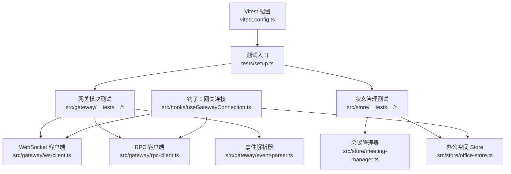
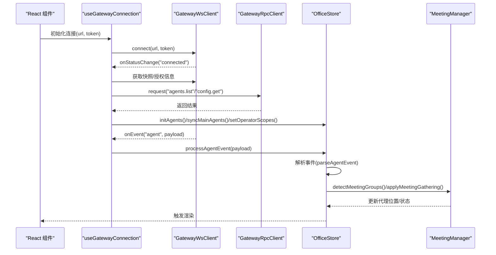
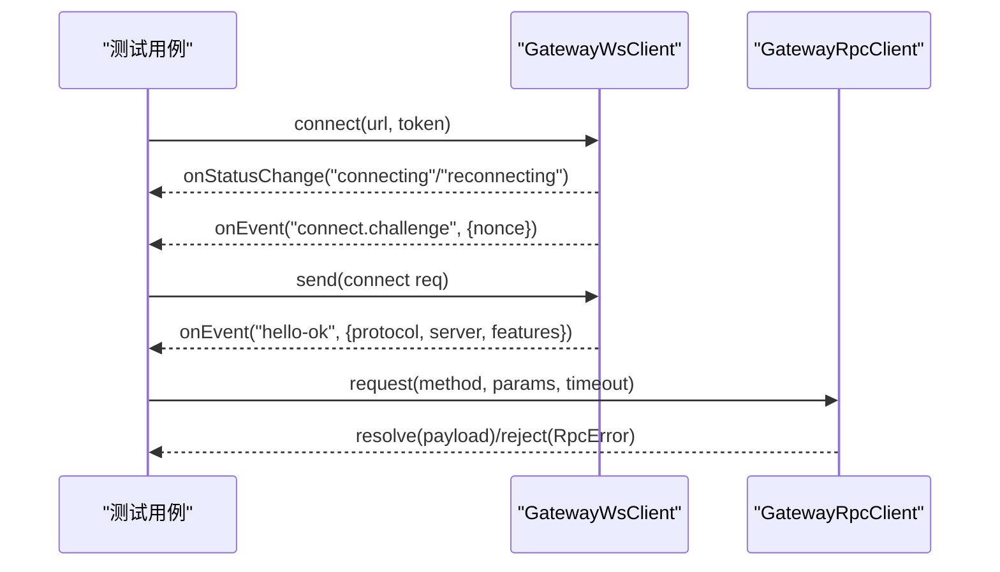
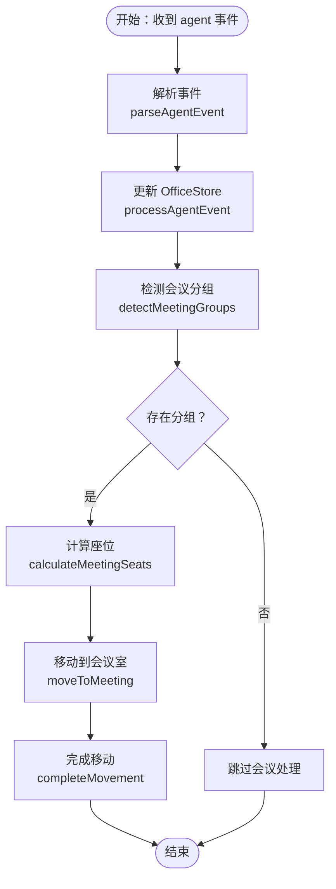
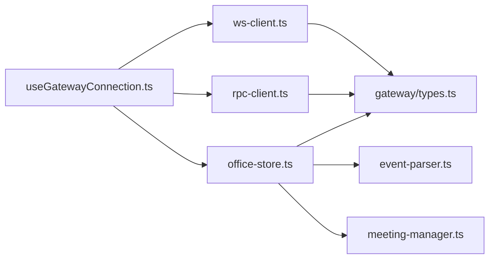

# 集成测试

<cite>
**本文引用的文件**
- [tests/setup.ts](file://tests/setup.ts)
- [vitest.config.ts](file://vitest.config.ts)
- [src/gateway/__tests__/ws-client.test.ts](file://src/gateway/__tests__/ws-client.test.ts)
- [src/gateway/__tests__/rpc-client.test.ts](file://src/gateway/__tests__/rpc-client.test.ts)
- [src/gateway/__tests__/event-parser.test.ts](file://src/gateway/__tests__/event-parser.test.ts)
- [src/gateway/ws-client.ts](file://src/gateway/ws-client.ts)
- [src/gateway/rpc-client.ts](file://src/gateway/rpc-client.ts)
- [src/gateway/event-parser.ts](file://src/gateway/event-parser.ts)
- [src/store/meeting-manager.ts](file://src/store/meeting-manager.ts)
- [src/store/office-store.ts](file://src/store/office-store.ts)
- [src/store/__tests__/meeting-manager-integration.test.ts](file://src/store/__tests__/meeting-manager-integration.test.ts)
- [src/hooks/useGatewayConnection.ts](file://src/hooks/useGatewayConnection.ts)
</cite>

## 目录
1. [引言](#引言)
2. [项目结构](#项目结构)
3. [核心组件](#核心组件)
4. [架构总览](#架构总览)
5. [详细组件分析](#详细组件分析)
6. [依赖关系分析](#依赖关系分析)
7. [性能考量](#性能考量)
8. [故障排查指南](#故障排查指南)
9. [结论](#结论)
10. [附录](#附录)

## 引言
本文件面向集成测试，系统性梳理并说明以下三类测试的实现与设计要点：
- 网关通信集成测试：WebSocket 连接测试、事件处理测试、RPC 调用测试
- 状态管理集成测试：多 store 协调测试、状态同步测试、数据流测试
- 端到端测试架构：用户交互测试、工作流程测试、系统边界测试

同时覆盖测试数据管理（环境配置、Mock 数据准备、测试数据隔离）、异步测试处理（Promise 测试、WebSocket 事件测试、定时器测试），以及测试场景设计、错误处理测试、性能测试等技术要点。

## 项目结构
本项目采用 Vitest + jsdom 的前端测试配置，通过别名映射到 src 目录，统一在 src/**/*.test.{ts,tsx} 下组织测试用例。测试入口由 setup.ts 注入，确保 DOM 环境与国际化初始化。

图表来源
- [vitest.config.ts:1-20](file://vitest.config.ts#L1-L20)
- [tests/setup.ts:1-3](file://tests/setup.ts#L1-L3)
- [src/gateway/ws-client.ts:1-304](file://src/gateway/ws-client.ts#L1-L304)
- [src/gateway/rpc-client.ts:1-63](file://src/gateway/rpc-client.ts#L1-L63)
- [src/gateway/event-parser.ts:1-225](file://src/gateway/event-parser.ts#L1-L225)
- [src/store/meeting-manager.ts:1-136](file://src/store/meeting-manager.ts#L1-L136)
- [src/store/office-store.ts:1-200](file://src/store/office-store.ts#L1-L200)
- [src/hooks/useGatewayConnection.ts:1-238](file://src/hooks/useGatewayConnection.ts#L1-L238)

章节来源
- [vitest.config.ts:1-20](file://vitest.config.ts#L1-L20)
- [tests/setup.ts:1-3](file://tests/setup.ts#L1-L3)

## 核心组件
- WebSocket 客户端：负责建立与网关的 WebSocket 连接、握手挑战、事件分发、响应处理、重连机制与状态管理。
- RPC 客户端：基于 WebSocket 实现请求-响应模式，提供超时控制与错误封装。
- 事件解析器：将来自网关的多流事件（生命周期、工具、助手文本、错误等）解析为 UI 可消费的可视化状态与摘要。
- 办公空间 Store：集中管理代理可视化状态、协作链接、事件历史、区域迁移、会议聚合等。
- 会议管理器：检测协作强度与会话键，计算会议室座位并驱动代理移动。
- 网关连接钩子：在 React 组件中注入网关连接、事件节流、配置拉取、健康状态同步等逻辑。

章节来源
- [src/gateway/ws-client.ts:1-304](file://src/gateway/ws-client.ts#L1-L304)
- [src/gateway/rpc-client.ts:1-63](file://src/gateway/rpc-client.ts#L1-L63)
- [src/gateway/event-parser.ts:1-225](file://src/gateway/event-parser.ts#L1-L225)
- [src/store/office-store.ts:1-200](file://src/store/office-store.ts#L1-L200)
- [src/store/meeting-manager.ts:1-136](file://src/store/meeting-manager.ts#L1-L136)
- [src/hooks/useGatewayConnection.ts:1-238](file://src/hooks/useGatewayConnection.ts#L1-L238)

## 架构总览
下图展示从 React 组件到网关客户端再到 Store 的端到端集成路径，包括事件节流、RPC 请求、状态更新与会议联动。

图表来源
- [src/hooks/useGatewayConnection.ts:1-238](file://src/hooks/useGatewayConnection.ts#L1-L238)
- [src/gateway/ws-client.ts:1-304](file://src/gateway/ws-client.ts#L1-L304)
- [src/gateway/rpc-client.ts:1-63](file://src/gateway/rpc-client.ts#L1-L63)
- [src/gateway/event-parser.ts:1-225](file://src/gateway/event-parser.ts#L1-L225)
- [src/store/office-store.ts:1-200](file://src/store/office-store.ts#L1-L200)
- [src/store/meeting-manager.ts:1-136](file://src/store/meeting-manager.ts#L1-L136)

## 详细组件分析

### 网关通信集成测试
本类测试覆盖 WebSocket 连接、事件处理与 RPC 调用三个层面，重点验证握手流程、设备身份签名、事件分发、重连策略与超时控制。

- WebSocket 连接测试
  - 场景要点：模拟 WebSocket 事件序列（challenge -> connect 请求 -> hello-ok），校验连接参数、设备身份签名、状态切换。
  - 关键断言：发送帧类型与方法、安全上下文下的设备签名字段、连接成功后的状态。
  - 异步处理：使用 fake timers 推进时间，模拟服务端事件到达与自动重连。
  - 参考路径：[ws-client.test.ts:87-131](file://src/gateway/__tests__/ws-client.test.ts#L87-L131)

- 事件处理测试
  - 场景要点：注册事件处理器，接收 agent 事件并触发回调；验证不同事件流（生命周期、工具、助手文本、错误）的解析结果。
  - 关键断言：事件回调次数、解析后的状态、语音气泡、摘要长度截断。
  - 参考路径：[ws-client.test.ts:162-177](file://src/gateway/__tests__/ws-client.test.ts#L162-L177)，[event-parser.test.ts:17-141](file://src/gateway/__tests__/event-parser.test.ts#L17-L141)

- RPC 调用测试
  - 场景要点：未连接时拒绝请求；超时控制；成功响应与错误响应的封装。
  - 关键断言：Promise 拒绝原因、RpcError 类型与消息、响应负载透传。
  - 异步处理：spy on 发送与响应监听，手动触发响应处理器。
  - 参考路径：[rpc-client.test.ts:20-77](file://src/gateway/__tests__/rpc-client.test.ts#L20-L77)

图表来源
- [src/gateway/__tests__/ws-client.test.ts:87-131](file://src/gateway/__tests__/ws-client.test.ts#L87-L131)
- [src/gateway/__tests__/rpc-client.test.ts:20-77](file://src/gateway/__tests__/rpc-client.test.ts#L20-L77)
- [src/gateway/ws-client.ts:150-260](file://src/gateway/ws-client.ts#L150-L260)
- [src/gateway/rpc-client.ts:20-61](file://src/gateway/rpc-client.ts#L20-L61)

章节来源
- [src/gateway/__tests__/ws-client.test.ts:1-207](file://src/gateway/__tests__/ws-client.test.ts#L1-L207)
- [src/gateway/__tests__/rpc-client.test.ts:1-79](file://src/gateway/__tests__/rpc-client.test.ts#L1-L79)
- [src/gateway/__tests__/event-parser.test.ts:1-141](file://src/gateway/__tests__/event-parser.test.ts#L1-L141)
- [src/gateway/ws-client.ts:1-304](file://src/gateway/ws-client.ts#L1-L304)
- [src/gateway/rpc-client.ts:1-63](file://src/gateway/rpc-client.ts#L1-L63)
- [src/gateway/event-parser.ts:1-225](file://src/gateway/event-parser.ts#L1-L225)

### 状态管理集成测试
本类测试聚焦多 store 协调、状态同步与数据流，特别是会议联动与事件解析对 Store 的影响。

- 多 store 协调测试
  - 场景要点：OfficeStore 初始化两个代理，设置共享会话键，触发协作事件，检测协作链接生成与会议分组。
  - 关键断言：链接数量、分组包含的代理 ID、移动目标区域、返回后回到工位。
  - 参考路径：[meeting-manager-integration.test.ts:31-117](file://src/store/__tests__/meeting-manager-integration.test.ts#L31-L117)

- 状态同步测试
  - 场景要点：事件解析后 Store 更新代理状态、语音气泡、工具计数与摘要；健康事件同步代理列表。
  - 关键断言：代理状态变化、clearTool/clearSpeech 标志、摘要文本长度与内容。
  - 参考路径：[event-parser.test.ts:17-141](file://src/gateway/__tests__/event-parser.test.ts#L17-L141)，[office-store.test.ts](file://src/store/__tests__/office-store.test.ts)

- 数据流测试
  - 场景要点：从 useGatewayConnection 捕获 agent 事件，经事件节流进入 OfficeStore，再由 MeetingManager 计算并应用会议聚集。
  - 关键断言：事件批处理、立即处理、Store 内部状态一致性。
  - 参考路径：[useGatewayConnection.ts:88-126](file://src/hooks/useGatewayConnection.ts#L88-L126)，[meeting-manager.ts:32-135](file://src/store/meeting-manager.ts#L32-L135)

图表来源
- [src/gateway/event-parser.ts:17-126](file://src/gateway/event-parser.ts#L17-L126)
- [src/store/office-store.ts:1-200](file://src/store/office-store.ts#L1-L200)
- [src/store/meeting-manager.ts:32-135](file://src/store/meeting-manager.ts#L32-L135)

章节来源
- [src/store/__tests__/meeting-manager-integration.test.ts:1-119](file://src/store/__tests__/meeting-manager-integration.test.ts#L1-L119)
- [src/store/meeting-manager.ts:1-136](file://src/store/meeting-manager.ts#L1-L136)
- [src/hooks/useGatewayConnection.ts:1-238](file://src/hooks/useGatewayConnection.ts#L1-L238)

### 端到端测试架构
- 用户交互测试
  - 目标：验证用户操作（如选择代理、发起会话）与 Store 状态变化、UI 渲染的一致性。
  - 方法：结合 React Testing Library 与 Store 快照对比，断言状态字段与 UI 属性。
  - 参考路径：[ChatPage.test.tsx](file://src/components/pages/ChatPage.test.tsx)，[AgentSelector.test.tsx](file://src/components/chat/AgentSelector.test.tsx)

- 工作流程测试
  - 目标：覆盖从连接建立、配置拉取、代理列表加载到事件驱动的状态流转。
  - 方法：模拟网关事件与 RPC 响应，断言 Store 的初始化与同步行为。
  - 参考路径：[useGatewayConnection.ts:88-126](file://src/hooks/useGatewayConnection.ts#L88-L126)

- 系统边界测试
  - 目标：验证跨模块边界（WebSocket、RPC、Store、UI）的契约与异常路径。
  - 方法：断言错误码、超时、重连上限、关闭事件对状态的影响。
  - 参考路径：[ws-client.test.ts:179-205](file://src/gateway/__tests__/ws-client.test.ts#L179-L205)，[rpc-client.test.ts:24-33](file://src/gateway/__tests__/rpc-client.test.ts#L24-L33)

## 依赖关系分析
- 组件耦合
  - useGatewayConnection 依赖 WebSocket/RPC 客户端与 OfficeStore，形成“钩子-客户端-状态”的单向依赖。
  - OfficeStore 依赖事件解析器与会议管理器，实现事件到可视化的转换与协作调度。
- 外部依赖
  - jsdom 环境用于 DOM API 与事件模拟。
  - i18n 用于事件摘要的本地化文本。
- 循环依赖
  - 当前模块间无明显循环依赖，职责清晰分离。

图表来源
- [src/hooks/useGatewayConnection.ts:1-238](file://src/hooks/useGatewayConnection.ts#L1-L238)
- [src/gateway/ws-client.ts:1-304](file://src/gateway/ws-client.ts#L1-L304)
- [src/gateway/rpc-client.ts:1-63](file://src/gateway/rpc-client.ts#L1-L63)
- [src/gateway/event-parser.ts:1-225](file://src/gateway/event-parser.ts#L1-L225)
- [src/store/office-store.ts:1-200](file://src/store/office-store.ts#L1-L200)
- [src/store/meeting-manager.ts:1-136](file://src/store/meeting-manager.ts#L1-L136)

章节来源
- [src/hooks/useGatewayConnection.ts:1-238](file://src/hooks/useGatewayConnection.ts#L1-L238)
- [src/gateway/ws-client.ts:1-304](file://src/gateway/ws-client.ts#L1-L304)
- [src/gateway/rpc-client.ts:1-63](file://src/gateway/rpc-client.ts#L1-L63)
- [src/gateway/event-parser.ts:1-225](file://src/gateway/event-parser.ts#L1-L225)
- [src/store/office-store.ts:1-200](file://src/store/office-store.ts#L1-L200)
- [src/store/meeting-manager.ts:1-136](file://src/store/meeting-manager.ts#L1-L136)

## 性能考量
- 事件节流
  - 使用 EventThrottle 对高频 agent 事件进行批处理与即时处理，降低 Store 更新频率，提升 UI 渲染性能。
  - 参考路径：[useGatewayConnection.ts:88-96](file://src/hooks/useGatewayConnection.ts#L88-L96)
- 重连退避
  - 指数退避 + 随机抖动，避免雪崩效应，最大延迟与尝试次数限制保障稳定性。
  - 参考路径：[ws-client.ts:270-288](file://src/gateway/ws-client.ts#L270-L288)
- 超时控制
  - RPC 请求默认超时阈值，避免长时间挂起，便于快速失败与重试策略。
  - 参考路径：[rpc-client.ts:5-24](file://src/gateway/rpc-client.ts#L5-L24)

## 故障排查指南
- WebSocket 未连接导致 RPC 拒绝
  - 现象：Promise 拒绝，错误码为未连接。
  - 排查：确认连接状态回调已触发，检查 connect 调用与服务端握手。
  - 参考路径：[rpc-client.test.ts:20-22](file://src/gateway/__tests__/rpc-client.test.ts#L20-L22)
- 超时问题
  - 现象：Promise 在设定时间内未收到响应。
  - 排查：推进 fake timers 至超时点，确认响应处理器是否注册。
  - 参考路径：[rpc-client.test.ts:24-33](file://src/gateway/__tests__/rpc-client.test.ts#L24-L33)
- 设备身份签名失败回退
  - 现象：安全上下文可用但签名失败时回退至令牌认证。
  - 排查：检查 isSecureContext 与 crypto 支持，确认回退分支。
  - 参考路径：[ws-client.test.ts:109-131](file://src/gateway/__tests__/ws-client.test.ts#L109-L131)，[ws-client.ts:222-252](file://src/gateway/ws-client.ts#L222-L252)
- 会议联动异常
  - 现象：代理未移动或返回后未回到工位。
  - 排查：核对协作链接强度阈值、会话键匹配、分组数量限制与座位分配。
  - 参考路径：[meeting-manager-integration.test.ts:67-117](file://src/store/__tests__/meeting-manager-integration.test.ts#L67-L117)，[meeting-manager.ts:32-96](file://src/store/meeting-manager.ts#L32-L96)

章节来源
- [src/gateway/__tests__/rpc-client.test.ts:1-79](file://src/gateway/__tests__/rpc-client.test.ts#L1-L79)
- [src/gateway/__tests__/ws-client.test.ts:1-207](file://src/gateway/__tests__/ws-client.test.ts#L1-L207)
- [src/store/__tests__/meeting-manager-integration.test.ts:1-119](file://src/store/__tests__/meeting-manager-integration.test.ts#L1-L119)
- [src/store/meeting-manager.ts:1-136](file://src/store/meeting-manager.ts#L1-L136)

## 结论
本项目在网关通信与状态管理两条主线建立了完善的集成测试体系：WebSocket 连接与事件处理、RPC 调用与错误封装、事件解析与 Store 同步、会议联动与多 store 协调。通过 jsdom 环境、fake timers 与精心设计的 Mock 数据，能够稳定复现真实业务场景并覆盖异常路径。建议持续补充 UI 交互与端到端工作流测试，进一步完善系统边界验证。

## 附录
- 测试环境配置
  - Vitest 别名指向 src，jsdom 环境，全局 setup 文件注入。
  - 参考路径：[vitest.config.ts:1-20](file://vitest.config.ts#L1-L20)，[tests/setup.ts:1-3](file://tests/setup.ts#L1-L3)
- Mock 数据准备
  - WebSocket 事件模拟：challenge、hello-ok、shutdown、agent、health 等。
  - Store 初始化：代理列表、会话键、协作链接、运行 ID 映射。
  - 参考路径：[ws-client.test.ts:87-205](file://src/gateway/__tests__/ws-client.test.ts#L87-L205)，[meeting-manager-integration.test.ts:6-26](file://src/store/__tests__/meeting-manager-integration.test.ts#L6-L26)
- 测试数据隔离
  - 每个测试前后清理 WebSocket 实例、定时器与 localStorage，避免跨用例污染。
  - 参考路径：[ws-client.test.ts:68-85](file://src/gateway/__tests__/ws-client.test.ts#L68-L85)