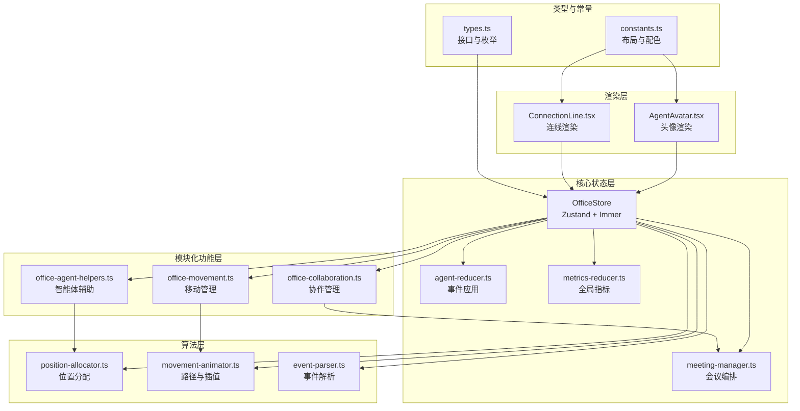
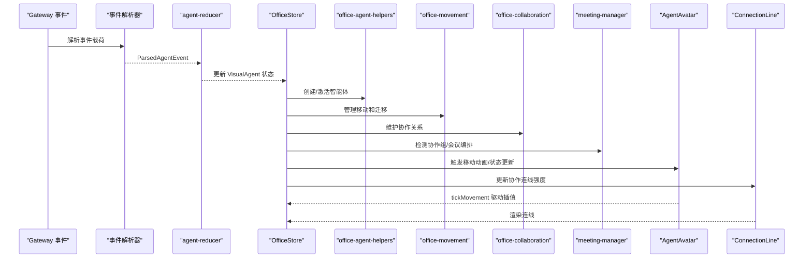
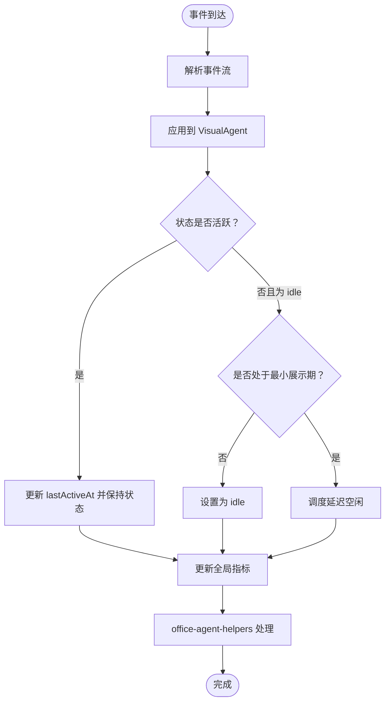
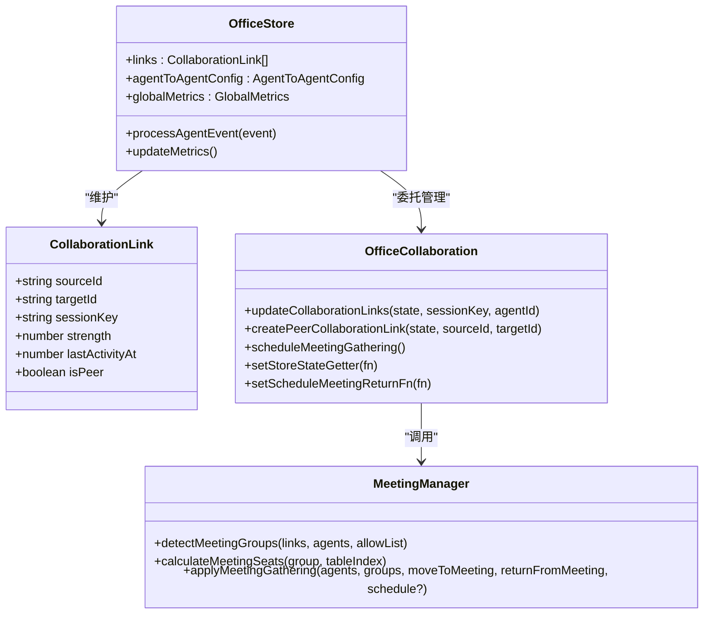
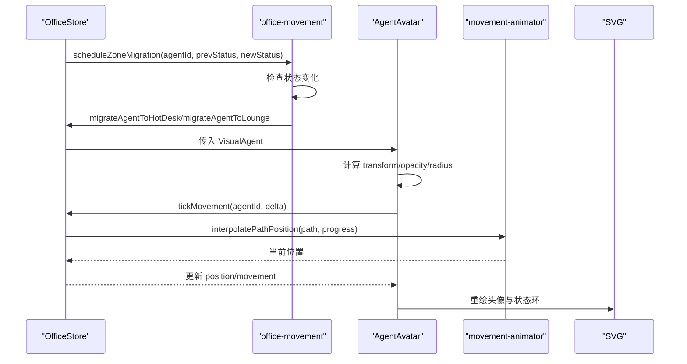
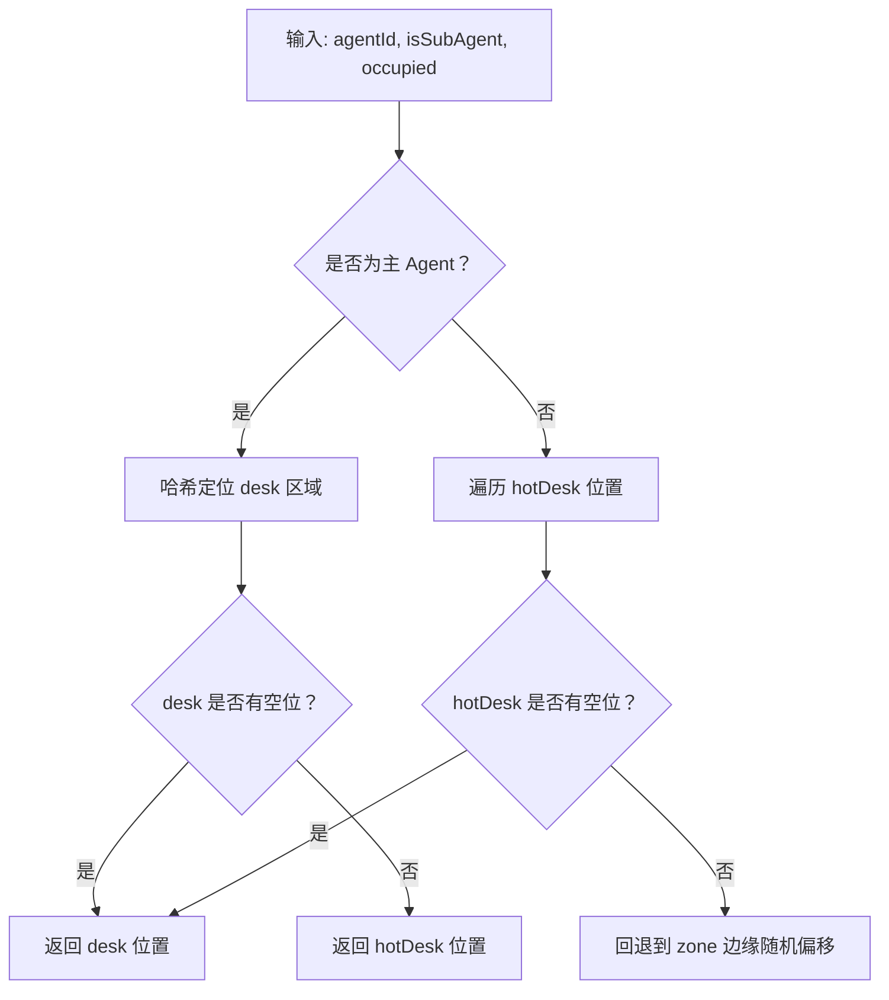
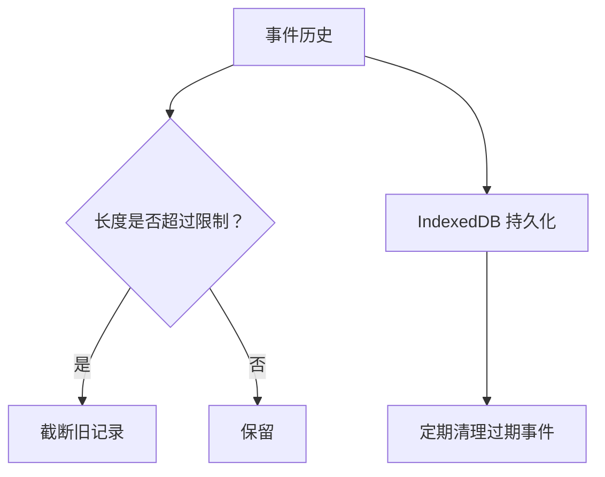
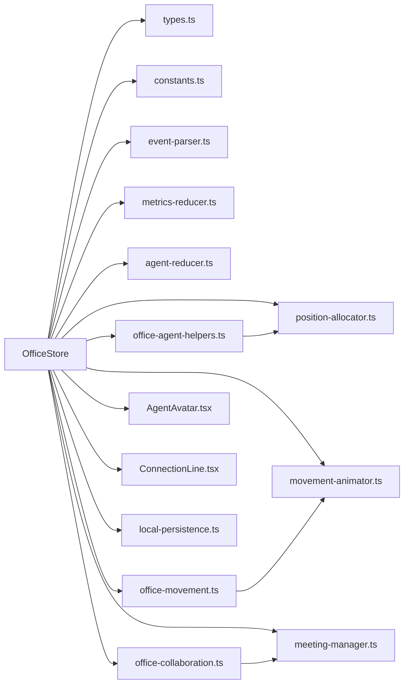

# Office Store 核心设计

<cite>
**本文档引用的文件**
- [office-store.ts](file://src/store/office-store.ts)
- [office-agent-helpers.ts](file://src/store/office-agent-helpers.ts)
- [office-movement.ts](file://src/store/office-movement.ts)
- [office-collaboration.ts](file://src/store/office-collaboration.ts)
- [agent-reducer.ts](file://src/store/agent-reducer.ts)
- [meeting-manager.ts](file://src/store/meeting-manager.ts)
- [types.ts](file://src/gateway/types.ts)
- [constants.ts](file://src/lib/constants.ts)
- [position-allocator.ts](file://src/lib/position-allocator.ts)
- [movement-animator.ts](file://src/lib/movement-animator.ts)
- [AgentAvatar.tsx](file://src/components/office-2d/AgentAvatar.tsx)
- [ConnectionLine.tsx](file://src/components/office-2d/ConnectionLine.tsx)
- [assistant-collaboration-hints.ts](file://src/lib/assistant-collaboration-hints.ts)
- [local-persistence.ts](file://src/lib/local-persistence.ts)
- [metrics-reducer.ts](file://src/store/metrics-reducer.ts)
- [event-parser.ts](file://src/gateway/event-parser.ts)
- [office-store.test.ts](file://src/store/__tests__/office-store.test.ts)
- [position-allocator.test.ts](file://src/lib/__tests__/position-allocator.test.ts)
- [meeting-manager.test.ts](file://src/store/__tests__/meeting-manager.test.ts)
</cite>

## 目录
1. [简介](#简介)
2. [项目结构](#项目结构)
3. [核心组件](#核心组件)
4. [架构总览](#架构总览)
5. [详细组件分析](#详细组件分析)
6. [依赖关系分析](#依赖关系分析)
7. [性能考虑](#性能考虑)
8. [故障排查指南](#故障排查指南)
9. [结论](#结论)
10. [附录](#附录)

## 简介
本文件面向 Office Store 核心设计，系统性阐述以下主题：
- 智能体状态管理架构：VisualAgent 数据结构、智能体生命周期管理、状态转换逻辑
- 协作关系维护机制：CollaborationLink 的设计、agent-to-agent 配置、协作热力图计算
- 2D 办公室渲染状态管理：AgentAvatar 组件状态、ConnectionLine 连线状态、移动动画状态
- 位置分配算法：allocatePosition、allocateMeetingPositions、calculateLoungePositions 的实现原理
- 事件历史记录机制：EVENT_HISTORY_LIMIT 限制、EventHistoryItem 结构、调试和监控功能
- 状态持久化策略、性能优化技巧、内存管理最佳实践

**更新** Office Store 系统已完成模块化重构，将职责分离到专用模块中，提升了代码的可维护性和可测试性。

## 项目结构
Office Store 采用 Zustand + Immer 的状态管理方案，结合自研的路径规划与位置分配算法，支撑 2D 办公室场景中的智能体可视化与交互。系统现已重构为模块化架构，职责明确分离。

**图表来源**
- [office-store.ts:35-61](file://src/store/office-store.ts#L35-L61)
- [office-agent-helpers.ts:1-205](file://src/store/office-agent-helpers.ts#L1-L205)
- [office-movement.ts:1-213](file://src/store/office-movement.ts#L1-L213)
- [office-collaboration.ts:1-204](file://src/store/office-collaboration.ts#L1-L204)

**章节来源**
- [office-store.ts:35-61](file://src/store/office-store.ts#L35-L61)
- [types.ts:166-222](file://src/gateway/types.ts#L166-L222)
- [constants.ts:23-141](file://src/lib/constants.ts#L23-L141)

## 核心组件
- OfficeStore：集中管理所有智能体、协作关系、全局指标、连接状态、事件历史等，提供统一的状态读取与更新入口。现已集成三个专用模块。
- VisualAgent：智能体在 2D 办公室中的可视化表示，包含状态、位置、运动轨迹、会话映射等字段。
- CollaborationLink：跨智能体协作关系，支持强度、最后活动时间、是否 peer 指派等标记。
- EventHistoryItem：事件历史条目，用于调试与审计，支持按 run、item 合并。
- 位置分配器：负责固定工位、临时工位、休息区、会议室座位的确定性分配。
- 移动动画器：基于走廊拓扑的路径规划、距离计算、进度插值与动画驱动。
- 渲染组件：AgentAvatar 与 ConnectionLine，分别负责智能体头像与协作连线的视觉呈现。

**更新** OfficeStore 现已将智能体创建、移动管理和协作关系维护等功能模块化，通过专用模块提供更清晰的职责分离。

**章节来源**
- [office-store.ts:39-84](file://src/store/office-store.ts#L39-L84)
- [types.ts:166-222](file://src/gateway/types.ts#L166-L222)
- [position-allocator.ts:51-101](file://src/lib/position-allocator.ts#L51-L101)
- [movement-animator.ts:85-159](file://src/lib/movement-animator.ts#L85-L159)
- [AgentAvatar.tsx:15-254](file://src/components/office-2d/AgentAvatar.tsx#L15-L254)
- [ConnectionLine.tsx:9-53](file://src/components/office-2d/ConnectionLine.tsx#L9-L53)

## 架构总览
Office Store 的控制流从事件解析开始，经由 agent-reducer 应用到 VisualAgent，再由 OfficeStore 决策是否触发移动动画或会议编排，最终驱动渲染层更新。系统现已通过模块化设计提升可维护性。

**图表来源**
- [event-parser.ts:17-60](file://src/gateway/event-parser.ts#L17-L60)
- [agent-reducer.ts:19-67](file://src/store/agent-reducer.ts#L19-L67)
- [office-store.ts:762-820](file://src/store/office-store.ts#L762-L820)
- [office-agent-helpers.ts:9-67](file://src/store/office-agent-helpers.ts#L9-L67)
- [office-movement.ts:30-81](file://src/store/office-movement.ts#L30-L81)
- [office-collaboration.ts:34-118](file://src/store/office-collaboration.ts#L34-L118)
- [meeting-manager.ts:32-135](file://src/store/meeting-manager.ts#L32-L135)

## 详细组件分析

### 智能体状态管理架构
- VisualAgent 字段族：包含 id、name、status、position、currentTool、speechBubble、lastActiveAt、toolCallCount、toolCallHistory、runId、isSubAgent、isPlaceholder、parentAgentId、childAgentIds、zone、originalPosition、movement、confirmed、arrivedAtHotDeskAt、pendingRetire、arrivedAtMeetingAt、manualMeeting。
- 生命周期管理：processAgentEvent 负责解析事件流，agent-reducer.applyEventToAgent 将状态变更应用到 VisualAgent；OfficeStore.updateAgent 提供外部更新能力。
- 状态转换逻辑：根据事件流类型（lifecycle、tool、assistant、error、item、plan、approval、command_output、patch、thinking、compaction）设置状态、工具、语音气泡、计数与历史记录；使用延迟空闲机制确保短暂状态的可见性。

**更新** 智能体创建和初始化现在由 office-agent-helpers.ts 专门处理，提供 createVisualAgent、activateFromLoungePlaceholder 等专用函数，使 OfficeStore 更专注于状态协调。

**图表来源**
- [event-parser.ts:17-60](file://src/gateway/event-parser.ts#L17-L60)
- [agent-reducer.ts:19-67](file://src/store/agent-reducer.ts#L19-L67)
- [metrics-reducer.ts:3-27](file://src/store/metrics-reducer.ts#L3-L27)
- [office-agent-helpers.ts:9-67](file://src/store/office-agent-helpers.ts#L9-L67)

**章节来源**
- [types.ts:166-193](file://src/gateway/types.ts#L166-L193)
- [agent-reducer.ts:19-67](file://src/store/agent-reducer.ts#L19-L67)
- [office-store.ts:762-820](file://src/store/office-store.ts#L762-L820)

### 协作关系维护机制
- CollaborationLink 设计：包含 sourceId、targetId、sessionKey、strength、lastActivityAt、isPeer 标记，支持按会话键聚合协作强度。
- agent-to-agent 配置：AgentToAgentConfig 支持启用/允许列表，影响协作组检测与会议编排范围。
- 协作热力图计算：computeMetrics 基于非占位且已确认智能体的活跃比例计算 collaborationHeat，作为全局热力图指标。

**更新** 协作关系管理已完全模块化到 office-collaboration.ts，包括链接更新、peer协作链接创建、会议聚集调度等功能，OfficeStore 通过 setStoreStateGetter 和 setScheduleMeetingReturnFn 与移动模块解耦。

**图表来源**
- [types.ts:200-208](file://src/gateway/types.ts#L200-L208)
- [types.ts:261-264](file://src/gateway/types.ts#L261-L264)
- [metrics-reducer.ts:3-27](file://src/store/metrics-reducer.ts#L3-L27)
- [office-collaboration.ts:14-32](file://src/store/office-collaboration.ts#L14-L32)
- [meeting-manager.ts:32-135](file://src/store/meeting-manager.ts#L32-L135)

**章节来源**
- [types.ts:200-208](file://src/gateway/types.ts#L200-L208)
- [types.ts:261-264](file://src/gateway/types.ts#L261-L264)
- [metrics-reducer.ts:3-27](file://src/store/metrics-reducer.ts#L3-L27)
- [meeting-manager.ts:32-135](file://src/store/meeting-manager.ts#L32-L135)

### 2D 办公室渲染状态管理
- AgentAvatar 组件状态：根据 VisualAgent 的 status、movement、selected、placeholder/unconfirmed 等状态决定颜色、动画、标签与交互行为；通过 requestAnimationFrame 驱动 tickMovement 插值，实现行走的 bob 与坐起/坐下过渡效果。
- ConnectionLine 连线状态：根据协作强度绘制虚线/实线、脉冲/流动动画、阴影与透明度，强连接使用 dash-flow 动画，弱连接使用 pulse 动画。
- 移动动画状态：OfficeStore.startMovement 计算路径与持续时间，tickMovement/completeMovement 驱动进度插值，到达目标后更新 zone 与 position，并触发退休/返回逻辑。

**更新** 移动管理已模块化到 office-movement.ts，包含状态迁移、退休调度、会议返回等功能，通过 setMovementStoreGetter 避免循环依赖。

**图表来源**
- [AgentAvatar.tsx:46-95](file://src/components/office-2d/AgentAvatar.tsx#L46-L95)
- [movement-animator.ts:132-159](file://src/lib/movement-animator.ts#L132-L159)
- [office-store.ts:504-580](file://src/store/office-store.ts#L504-L580)
- [office-movement.ts:30-81](file://src/store/office-movement.ts#L30-L81)

**章节来源**
- [AgentAvatar.tsx:15-254](file://src/components/office-2d/AgentAvatar.tsx#L15-L254)
- [ConnectionLine.tsx:9-53](file://src/components/office-2d/ConnectionLine.tsx#L9-L53)
- [movement-animator.ts:85-159](file://src/lib/movement-animator.ts#L85-L159)
- [office-store.ts:504-580](file://src/store/office-store.ts#L504-L580)

### 位置分配算法
- allocatePosition：主 Agent 基于 agentId 哈希在固定工位网格中选择稳定位置；若满员则回退到临时工位区域；子 Agent 直接分配至临时工位。
- allocateMeetingPositions：围绕会议桌中心按等角分布计算座位坐标，考虑 2D/3D 缩放。
- calculateLoungePositions：预设休息区锚点，保证子 Agent 占位与视觉舒适度。
- calculateDeskSlots：水平优先布局，自动计算列数与行列分布，适配最小工位宽度。

**更新** 位置分配现在由 office-agent-helpers.ts 提供 allocateNextPosition 和 activateFromLoungePlaceholder 等函数，OfficeStore 通过 positionKey 辅助函数统一位置标识。

**图表来源**
- [position-allocator.ts:51-82](file://src/lib/position-allocator.ts#L51-L82)
- [position-allocator.ts:84-101](file://src/lib/position-allocator.ts#L84-L101)
- [position-allocator.ts:173-190](file://src/lib/position-allocator.ts#L173-L190)
- [position-allocator.ts:131-159](file://src/lib/position-allocator.ts#L131-L159)

**章节来源**
- [position-allocator.ts:51-82](file://src/lib/position-allocator.ts#L51-L82)
- [position-allocator.ts:84-101](file://src/lib/position-allocator.ts#L84-L101)
- [position-allocator.ts:173-190](file://src/lib/position-allocator.ts#L173-L190)
- [position-allocator.ts:131-159](file://src/lib/position-allocator.ts#L131-L159)

### 事件历史记录机制
- EVENT_HISTORY_LIMIT：限制事件历史数量，避免内存膨胀。
- EventHistoryItem：包含时间戳、agentId/name、stream、summary、runId/fullText/itemId 等，支持按 run 与 item 合并。
- 调试与监控：OfficeStore.initEventHistory 与本地持久化配合，支持事件查询与清理；测试覆盖事件上限与合并行为。

**更新** 事件历史记录机制保持不变，但通过模块化设计提升了事件处理的可维护性。

**图表来源**
- [office-store.ts:39](file://src/store/office-store.ts#L39)
- [types.ts:210-222](file://src/gateway/types.ts#L210-L222)
- [local-persistence.ts:217-271](file://src/lib/local-persistence.ts#L217-L271)

**章节来源**
- [office-store.ts:39](file://src/store/office-store.ts#L39)
- [types.ts:210-222](file://src/gateway/types.ts#L210-L222)
- [local-persistence.ts:217-271](file://src/lib/local-persistence.ts#L217-L271)
- [office-store.test.ts:193-210](file://src/store/__tests__/office-store.test.ts#L193-L210)

## 依赖关系分析
- OfficeStore 依赖：
  - 类型与常量：types.ts、constants.ts
  - 算法：position-allocator.ts、movement-animator.ts
  - 事件解析：event-parser.ts
  - 指标：metrics-reducer.ts
  - 子模块：agent-reducer.ts、meeting-manager.ts
  - 专用模块：office-agent-helpers.ts、office-movement.ts、office-collaboration.ts
  - 渲染：AgentAvatar.tsx、ConnectionLine.tsx
  - 持久化：local-persistence.ts

**更新** OfficeStore 现已集成三个专用模块，通过 setMovementStoreGetter、setStoreStateGetter 等函数建立松耦合的依赖关系。

**图表来源**
- [office-store.ts:35-61](file://src/store/office-store.ts#L35-L61)
- [office-agent-helpers.ts:1-205](file://src/store/office-agent-helpers.ts#L1-L205)
- [office-movement.ts:1-213](file://src/store/office-movement.ts#L1-L213)
- [office-collaboration.ts:1-204](file://src/store/office-collaboration.ts#L1-L204)

**章节来源**
- [office-store.ts:35-61](file://src/store/office-store.ts#L35-L61)

## 性能考虑
- 状态不可变与批量更新：使用 Immer 中间件，减少样板代码与深拷贝开销。
- 动画驱动：AgentAvatar 使用 requestAnimationFrame，仅在存在移动时启动循环，避免不必要的重绘。
- 路径与插值：movement-animator 对路径长度与速度进行限制，保证动画流畅与可预测。
- 位置分配：allocatePosition 基于哈希与网格，避免复杂搜索；calculateLoungePositions 预设锚点，降低动态计算成本。
- 事件历史：限制长度与定期清理，避免内存泄漏。
- 指标计算：computeMetrics 在状态变更后增量计算，避免全量扫描。
- **模块化优化**：通过专用模块分离职责，减少单个文件的复杂度，提升编译和运行时性能。

**更新** 模块化架构提升了代码的可维护性和性能，专用模块减少了不必要的依赖传递。

## 故障排查指南
- 事件未生效：检查 event-parser 是否正确识别 stream 与 phase；确认 agent-reducer.applyEventToAgent 是否更新状态与计数。
- 移动异常：验证 startMovement 是否生成有效 path；检查 tickMovement/completeMovement 是否正确更新 zone 与 position。
- 会议未触发：确认 CollaborationLink 强度阈值与 allowList；检查 detectMeetingGroups 是否过滤了子 Agent。
- 事件历史过多：确认 EVENT_HISTORY_LIMIT 与本地持久化清理策略；必要时手动清理过期事件。
- 子 Agent 退休问题：检查 pendingRetire 与最小停留时间；确认 Lounge 退休流程是否触发 removeSubAgent。
- **模块化相关问题**：检查模块间的 getter 函数是否正确设置；确认 setMovementStoreGetter、setStoreStateGetter 等函数的调用顺序。

**更新** 新增模块化相关故障排查指导。

**章节来源**
- [event-parser.ts:17-60](file://src/gateway/event-parser.ts#L17-L60)
- [agent-reducer.ts:19-67](file://src/store/agent-reducer.ts#L19-L67)
- [office-store.ts:504-580](file://src/store/office-store.ts#L504-L580)
- [meeting-manager.ts:32-135](file://src/store/meeting-manager.ts#L32-L135)
- [local-persistence.ts:275-306](file://src/lib/local-persistence.ts#L275-L306)

## 结论
Office Store 通过清晰的分层设计与确定性算法，实现了从事件到可视化的完整闭环。系统已完成模块化重构，将智能体管理、移动控制、协作关系等功能分离到专用模块中，进一步提升了系统的可维护性、可测试性和扩展性。VisualAgent 与 OfficeStore 的协同、协作关系与会议编排的解耦、以及渲染层的高效动画，共同构成了可扩展、可观测、可维护的 2D 办公室智能体系统。

**更新** 模块化架构的引入使系统更加清晰和健壮，为未来的功能扩展奠定了良好的基础。

## 附录
- 状态持久化策略：使用 IndexedDB（local-persistence.ts）缓存聊天消息、事件历史与会话信息，支持按天清理与配额阈值保护。
- 性能优化技巧：批量更新、按需动画、路径限制、预设锚点、指标缓存、模块化职责分离。
- 内存管理最佳实践：限制事件历史长度、及时清理定时器与占位符、避免重复订阅与冗余渲染、模块化依赖管理。
- **模块化最佳实践**：通过 getter 函数避免循环依赖、合理划分职责边界、保持模块间接口稳定、使用 TypeScript 类型确保类型安全。

**更新** 新增模块化最佳实践指导。