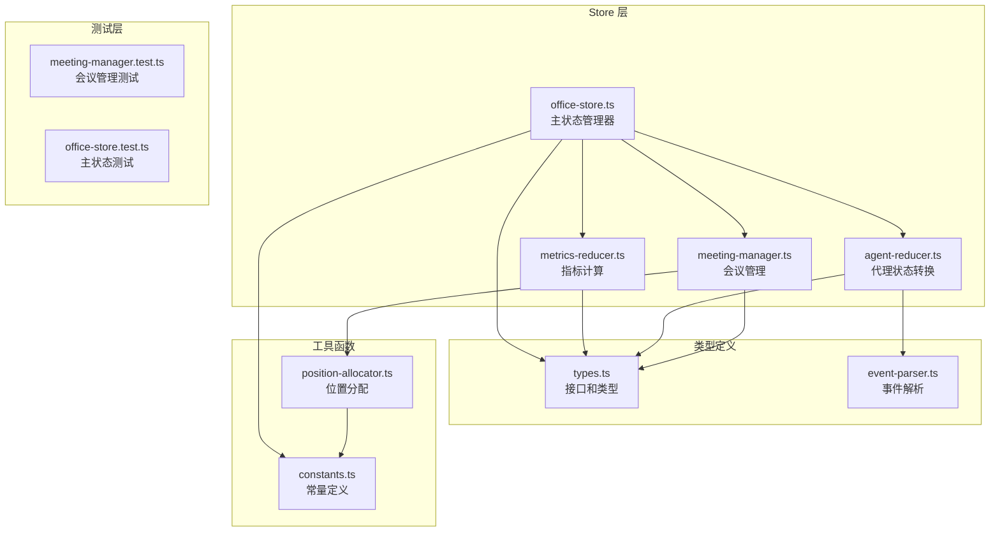
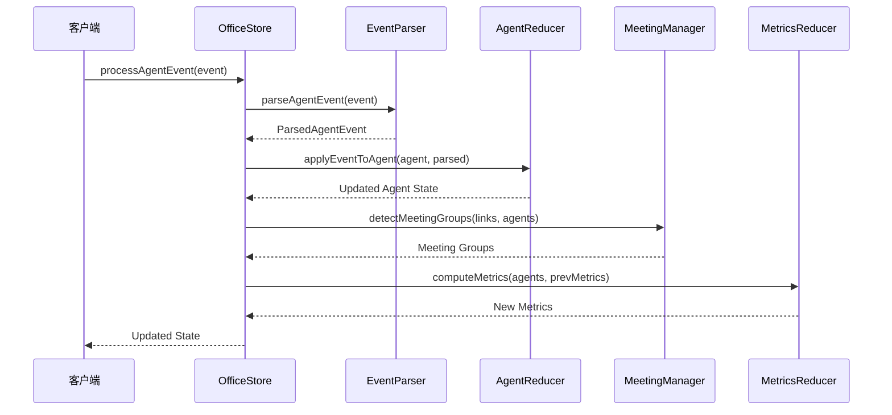
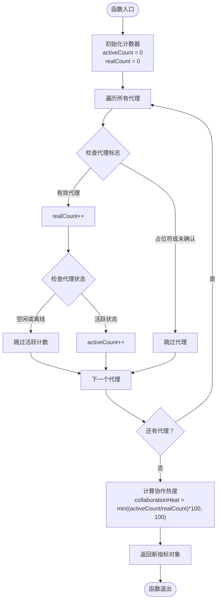
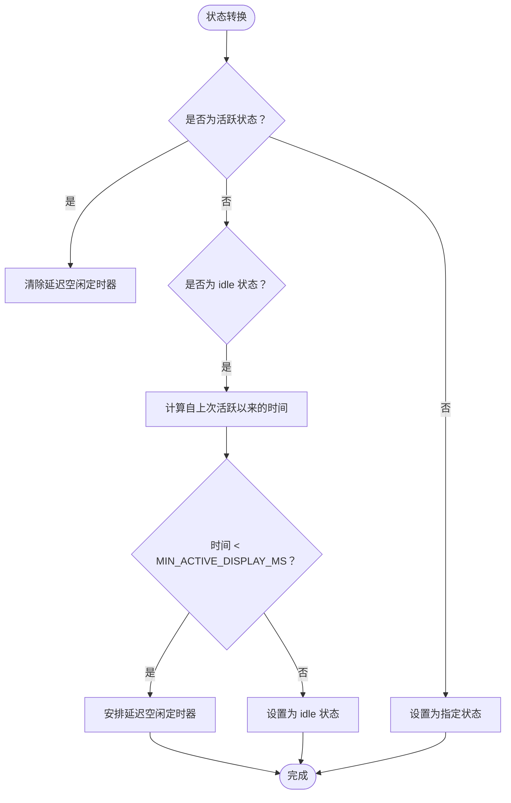
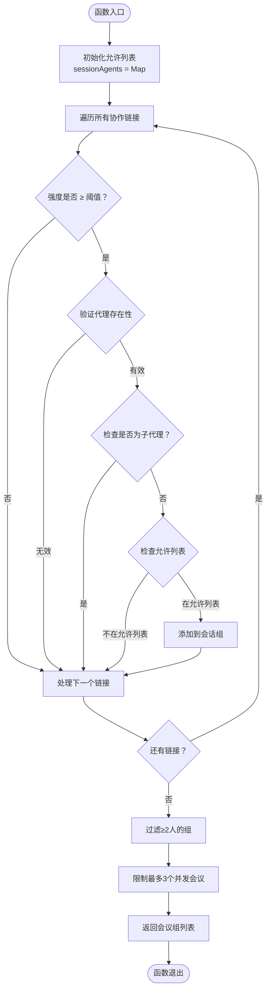
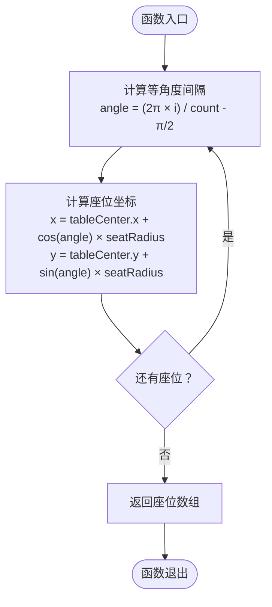
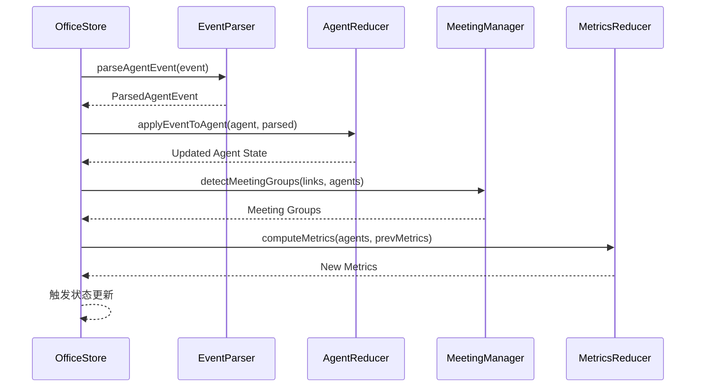
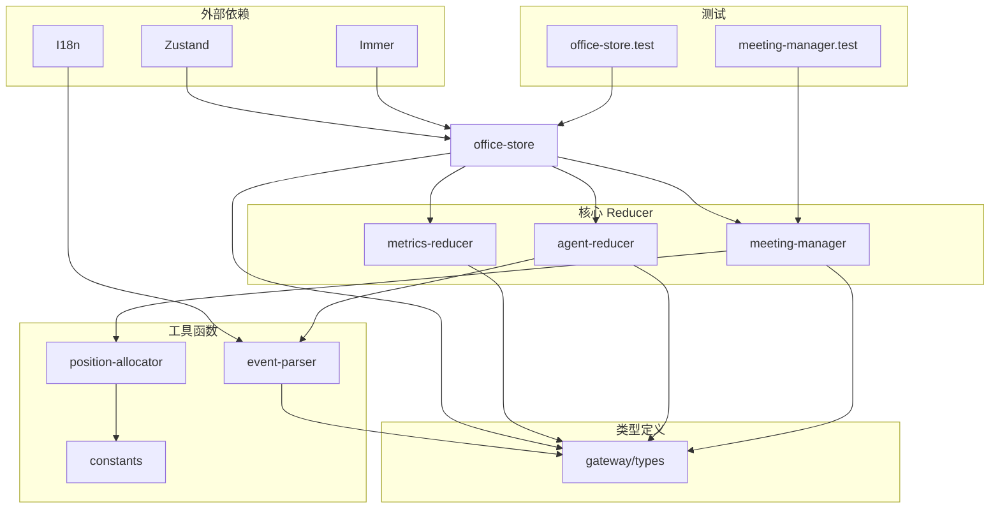
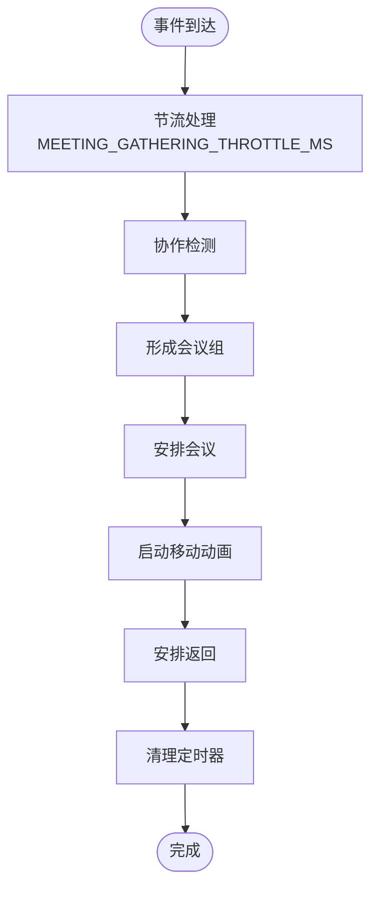

# Reducer 模式应用

<cite>
**本文档引用的文件**
- [metrics-reducer.ts](file://src/store/metrics-reducer.ts)
- [agent-reducer.ts](file://src/store/agent-reducer.ts)
- [meeting-manager.ts](file://src/store/meeting-manager.ts)
- [office-store.ts](file://src/store/office-store.ts)
- [types.ts](file://src/gateway/types.ts)
- [event-parser.ts](file://src/gateway/event-parser.ts)
- [constants.ts](file://src/lib/constants.ts)
- [position-allocator.ts](file://src/lib/position-allocator.ts)
- [meeting-manager.test.ts](file://src/store/__tests__/meeting-manager.test.ts)
- [meeting-manager-integration.test.ts](file://src/store/__tests__/meeting-manager-integration.test.ts)
- [office-store.test.ts](file://src/store/__tests__/office-store.test.ts)
</cite>

## 目录
1. [简介](#简介)
2. [项目结构](#项目结构)
3. [核心组件](#核心组件)
4. [架构概览](#架构概览)
5. [详细组件分析](#详细组件分析)
6. [依赖关系分析](#依赖关系分析)
7. [性能考虑](#性能考虑)
8. [故障排除指南](#故障排除指南)
9. [结论](#结论)

## 简介

OpenClaw-Office 是一个基于 React 和 Zustand 的智能办公空间可视化系统，采用了先进的 Reducer 模式来管理复杂的状态流转和业务逻辑。该系统通过三个核心 Reducer 实现了完整的状态管理：metrics-reducer（指标计算）、agent-reducer（代理状态转换）和 meeting-manager（会议管理）。这些 Reducer 以纯函数的形式实现了不可变状态更新，确保了系统的可预测性和可维护性。

系统的核心设计理念是将复杂的业务逻辑封装在独立的 Reducer 中，每个 Reducer 负责特定领域的状态转换，通过组合模式实现模块化的状态管理。这种设计不仅提高了代码的可测试性，还使得状态管理逻辑更加清晰和易于理解。

## 项目结构

项目采用模块化的文件组织方式，主要的 Reducer 实现位于 `src/store/` 目录下：



**图表来源**
- [office-store.ts:1-50](file://src/store/office-store.ts#L1-L50)
- [metrics-reducer.ts:1-28](file://src/store/metrics-reducer.ts#L1-L28)
- [agent-reducer.ts:1-103](file://src/store/agent-reducer.ts#L1-L103)
- [meeting-manager.ts:1-136](file://src/store/meeting-manager.ts#L1-L136)

**章节来源**
- [office-store.ts:1-800](file://src/store/office-store.ts#L1-L800)
- [metrics-reducer.ts:1-28](file://src/store/metrics-reducer.ts#L1-L28)
- [agent-reducer.ts:1-103](file://src/store/agent-reducer.ts#L1-L103)
- [meeting-manager.ts:1-136](file://src/store/meeting-manager.ts#L1-L136)

## 核心组件

### 指标计算 Reducer (metrics-reducer)

metrics-reducer 负责计算全局指标，包括活跃代理数量、总代理数和协作热度指数。其核心功能是通过遍历所有代理状态来统计活跃度，并计算协作效率指标。

### 代理状态 Reducer (agent-reducer)

agent-reducer 实现了代理的视觉状态转换逻辑，包括状态机转换、延迟空闲处理和工具使用记录。它使用定时器机制来处理状态的延迟转换，确保用户体验的流畅性。

### 会议管理 Reducer (meeting-manager)

meeting-manager 负责检测协作关系并触发会议调度，包括协作组检测、座位分配和自动返回机制。它实现了复杂的协作网络分析算法，能够识别潜在的会议参与者。

**章节来源**
- [metrics-reducer.ts:3-27](file://src/store/metrics-reducer.ts#L3-L27)
- [agent-reducer.ts:19-67](file://src/store/agent-reducer.ts#L19-L67)
- [meeting-manager.ts:32-77](file://src/store/meeting-manager.ts#L32-L77)

## 架构概览

系统采用分层架构设计，通过 Reducer 组合模式实现状态管理：



**图表来源**
- [office-store.ts:762-1178](file://src/store/office-store.ts#L762-L1178)
- [event-parser.ts:17-60](file://src/gateway/event-parser.ts#L17-L60)
- [agent-reducer.ts:19-67](file://src/store/agent-reducer.ts#L19-L67)
- [meeting-manager.ts:32-77](file://src/store/meeting-manager.ts#L32-L77)
- [metrics-reducer.ts:3-27](file://src/store/metrics-reducer.ts#L3-L27)

## 详细组件分析

### 指标计算 Reducer 详解

#### computeMetrics 函数实现

computeMetrics 函数是指标计算的核心，负责实时计算全局指标：



**图表来源**
- [metrics-reducer.ts:3-27](file://src/store/metrics-reducer.ts#L3-L27)

#### 指标计算逻辑

系统计算以下关键指标：
- **activeAgents**: 当前活跃的代理数量（非空闲且非离线状态）
- **totalAgents**: 确认的代理总数（排除占位符和未确认代理）
- **collaborationHeat**: 协作热度指数，计算公式为 `(活跃代理数/总代理数) × 100`
- **totalTokens**: 总令牌消耗量
- **tokenRate**: 每分钟令牌消耗率

**章节来源**
- [metrics-reducer.ts:3-27](file://src/store/metrics-reducer.ts#L3-L27)
- [types.ts:242-248](file://src/gateway/types.ts#L242-L248)

### 代理状态 Reducer 详解

#### applyEventToAgent 函数实现

applyEventToAgent 函数实现了代理状态机转换的核心逻辑：

```mermaid
stateDiagram-v2
[*] --> Idle : 初始状态
Idle --> Thinking : 接收到生命周期开始
Thinking --> ToolCalling : 接收到工具调用开始
ToolCalling --> Thinking : 工具调用结束
Thinking --> Speaking : 接收到助手回复
Thinking --> Spawning : 接收到创建状态
Thinking --> Error : 接收到错误事件
Thinking --> Idle : 延迟空闲机制触发
state Idle {
[*] --> Idle
}
state Thinking {
[*] --> Thinking
}
state ToolCalling {
[*] --> ToolCalling
}
state Speaking {
[*] --> Speaking
}
state Spawning {
[*] --> Spawning
}
state Error {
[*] --> Error
}
```

**图表来源**
- [agent-reducer.ts:19-67](file://src/store/agent-reducer.ts#L19-L67)

#### 状态转换规则

代理状态转换遵循严格的规则：

1. **活跃状态识别**: `isVisuallyActive` 函数识别视觉上活跃的状态
2. **延迟空闲机制**: 使用 `MIN_ACTIVE_DISPLAY_MS` 常量确保状态转换的合理性
3. **工具使用跟踪**: 自动记录工具调用次数和历史
4. **语音气泡管理**: 智能管理语音气泡的显示和清理

#### 延迟空闲处理机制

系统实现了复杂的延迟空闲处理机制：



**图表来源**
- [agent-reducer.ts:26-38](file://src/store/agent-reducer.ts#L26-L38)
- [agent-reducer.ts:75-83](file://src/store/agent-reducer.ts#L75-L83)

**章节来源**
- [agent-reducer.ts:19-67](file://src/store/agent-reducer.ts#L19-L67)
- [agent-reducer.ts:75-98](file://src/store/agent-reducer.ts#L75-L98)

### 会议管理 Reducer 详解

#### detectMeetingGroups 函数实现

detectMeetingGroups 函数实现了协作关系检测的核心算法：



**图表来源**
- [meeting-manager.ts:32-77](file://src/store/meeting-manager.ts#L32-L77)

#### 会议调度算法

系统实现了智能的会议调度算法：

1. **协作强度阈值**: 使用 `STRENGTH_THRESHOLD` (0.3) 来过滤弱协作关系
2. **并发会议限制**: 最多同时进行3个会议组
3. **主代理优先**: 自动排除子代理，仅考虑主代理参与会议
4. **座位分配**: 使用 `allocateMeetingPositions` 函数进行圆形座位分配

#### calculateMeetingSeats 函数

calculateMeetingSeats 函数实现了等角度座位分配算法：



**图表来源**
- [meeting-manager.ts:83-96](file://src/store/meeting-manager.ts#L83-L96)
- [position-allocator.ts:84-101](file://src/lib/position-allocator.ts#L84-L101)

**章节来源**
- [meeting-manager.ts:32-77](file://src/store/meeting-manager.ts#L32-L77)
- [meeting-manager.ts:83-96](file://src/store/meeting-manager.ts#L83-L96)
- [position-allocator.ts:84-101](file://src/lib/position-allocator.ts#L84-L101)

### 主状态管理器 (OfficeStore)

OfficeStore 作为 Zustand 状态管理器，整合了所有 Reducer 的功能：

#### 状态结构设计

OfficeStore 维护了以下核心状态：

```mermaid
classDiagram
class OfficeStore {
+Map~string, VisualAgent~ agents
+CollaborationLink[] links
+GlobalMetrics globalMetrics
+ConnectionStatus connectionStatus
+EventHistoryItem[] eventHistory
+Map~string, string~ runIdMap
+Map~string, string[]~ sessionKeyMap
+addAgent(agent)
+updateAgent(id, patch)
+removeAgent(id)
+processAgentEvent(event)
+moveToMeeting(agentId, position)
+returnFromMeeting(agentId)
+requestMeeting(agentIds)
+dismissMeeting(agentIds?)
}
class VisualAgent {
+string id
+string name
+AgentVisualStatus status
+{x : number, y : number} position
+ToolInfo currentTool
+SpeechBubble speechBubble
+number lastActiveAt
+number toolCallCount
+ToolCallRecord[] toolCallHistory
+string runId
+boolean isSubAgent
+boolean isPlaceholder
+string parentAgentId
+string[] childAgentIds
+AgentZone zone
+{x : number, y : number} originalPosition
+MovementState movement
+boolean confirmed
+number arrivedAtHotDeskAt
+boolean pendingRetire
+number arrivedAtMeetingAt
+boolean manualMeeting
}
class GlobalMetrics {
+number activeAgents
+number totalAgents
+number totalTokens
+number tokenRate
+number collaborationHeat
}
OfficeStore --> VisualAgent : manages
OfficeStore --> GlobalMetrics : calculates
```

**图表来源**
- [types.ts:286-370](file://src/gateway/types.ts#L286-L370)
- [types.ts:166-193](file://src/gateway/types.ts#L166-L193)
- [types.ts:242-248](file://src/gateway/types.ts#L242-L248)

#### 事件处理流程

OfficeStore 的事件处理流程体现了 Reducer 组合模式的优势：



**图表来源**
- [office-store.ts:762-1178](file://src/store/office-store.ts#L762-L1178)

**章节来源**
- [office-store.ts:217-1368](file://src/store/office-store.ts#L217-L1368)
- [types.ts:286-370](file://src/gateway/types.ts#L286-L370)

## 依赖关系分析

系统中的依赖关系体现了清晰的分层架构：



**图表来源**
- [office-store.ts:1-50](file://src/store/office-store.ts#L1-L50)
- [metrics-reducer.ts:1](file://src/store/metrics-reducer.ts#L1)
- [agent-reducer.ts:1](file://src/store/agent-reducer.ts#L1)
- [meeting-manager.ts:1](file://src/store/meeting-manager.ts#L1)

### 关键依赖关系

1. **OfficeStore 依赖所有 Reducer**: 主状态管理器整合了所有业务逻辑
2. **EventParser 依赖 i18n**: 事件解析依赖国际化支持
3. **PositionAllocator 依赖 Constants**: 位置分配依赖常量定义
4. **MeetingManager 依赖 PositionAllocator**: 会议管理依赖位置分配算法

**章节来源**
- [office-store.ts:30-37](file://src/store/office-store.ts#L30-L37)
- [event-parser.ts:1](file://src/gateway/event-parser.ts#L1)
- [position-allocator.ts:1-13](file://src/lib/position-allocator.ts#L1-L13)

## 性能考虑

### 内存管理优化

系统采用了多种内存管理策略来确保性能：

1. **定时器清理**: 所有定时器都在适当的时机被清理，防止内存泄漏
2. **状态映射优化**: 使用 Map 结构替代普通对象，提高查找性能
3. **事件历史限制**: 事件历史最多保留200条记录，防止无限增长

### 计算复杂度分析

- **computeMetrics**: O(n) 时间复杂度，n为代理数量
- **detectMeetingGroups**: O(m + n) 时间复杂度，m为链接数量，n为代理数量
- **applyEventToAgent**: O(1) 时间复杂度，状态转换操作

### 异步处理策略

系统使用了多种异步处理机制：



**图表来源**
- [office-store.ts:1590-1600](file://src/store/office-store.ts#L1590-L1600)

**章节来源**
- [office-store.ts:48-59](file://src/store/office-store.ts#L48-L59)
- [office-store.ts:1590-1600](file://src/store/office-store.ts#L1590-L1600)

## 故障排除指南

### 常见问题诊断

#### 代理状态异常

**问题**: 代理状态长时间停留在活跃状态
**解决方案**: 检查 `MIN_ACTIVE_DISPLAY_MS` 配置，确保延迟空闲机制正常工作

#### 会议调度失败

**问题**: 协作链接无法形成会议组
**解决方案**: 
1. 检查协作强度是否达到阈值 (0.3)
2. 确认代理不是子代理
3. 验证允许列表配置

#### 指标计算错误

**问题**: 活跃代理计数不正确
**解决方案**: 
1. 检查代理状态过滤逻辑
2. 确认占位符和未确认代理被正确排除
3. 验证空闲和离线状态的识别

### 调试技巧

1. **使用浏览器开发者工具**: 监控 Zustand 状态变化
2. **启用日志输出**: 在关键路径添加日志语句
3. **单元测试覆盖**: 编写全面的测试用例验证边界条件

**章节来源**
- [meeting-manager.test.ts:36-281](file://src/store/__tests__/meeting-manager.test.ts#L36-L281)
- [office-store.test.ts:35-527](file://src/store/__tests__/office-store.test.ts#L35-L527)

## 结论

OpenClaw-Office 的 Reducer 模式应用展现了现代前端状态管理的最佳实践。通过将复杂的业务逻辑封装在独立的 Reducer 中，系统实现了高度模块化和可维护的状态管理架构。

### 主要优势

1. **模块化设计**: 每个 Reducer 负责特定领域，职责单一
2. **纯函数实现**: 不可变状态更新确保了可预测性
3. **组合模式**: Reducer 之间可以灵活组合使用
4. **测试友好**: 纯函数便于单元测试和集成测试

### 技术创新点

1. **智能协作检测**: 基于强度阈值的协作关系识别
2. **延迟空闲机制**: 提升用户体验的智能状态转换
3. **可视化指标**: 实时计算协作热度等关键指标
4. **动画驱动**: 基于物理位置的移动动画系统

### 未来改进方向

1. **性能监控**: 添加详细的性能指标收集
2. **状态快照**: 支持状态回放和调试
3. **扩展性增强**: 更灵活的 Reducer 组合机制
4. **错误恢复**: 更强大的错误处理和恢复能力

这个 Reducer 模式应用为类似的复杂状态管理系统提供了优秀的参考模板，展示了如何通过函数式编程思想实现可维护和高性能的状态管理。