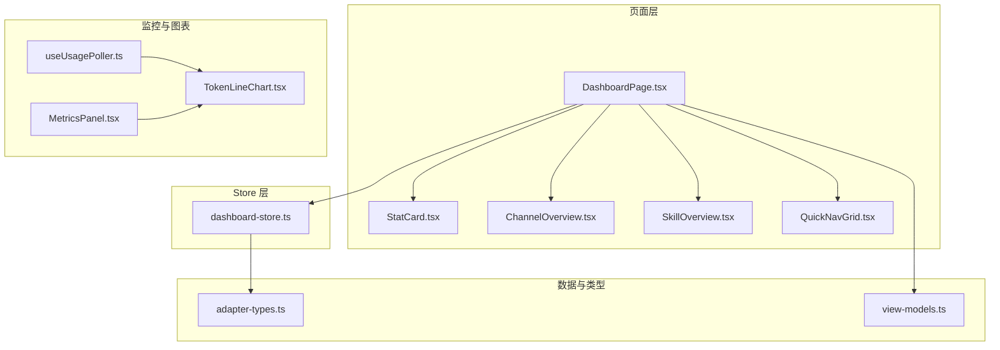
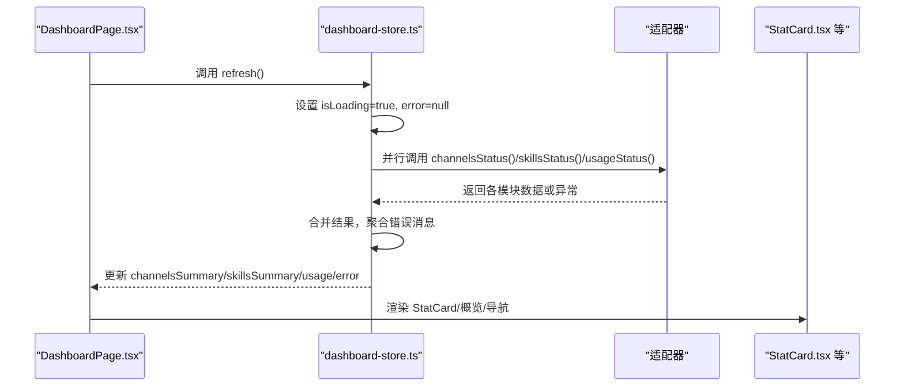
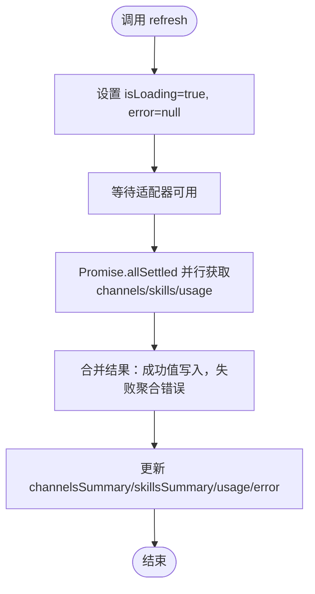
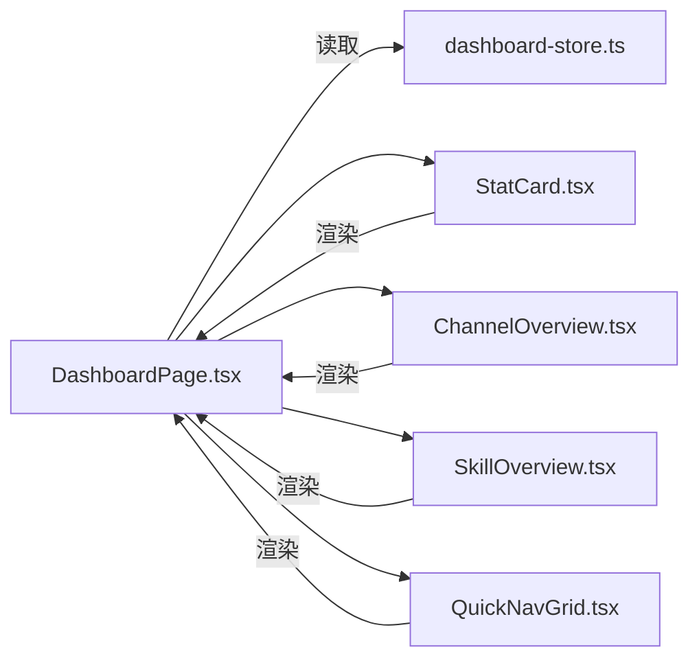
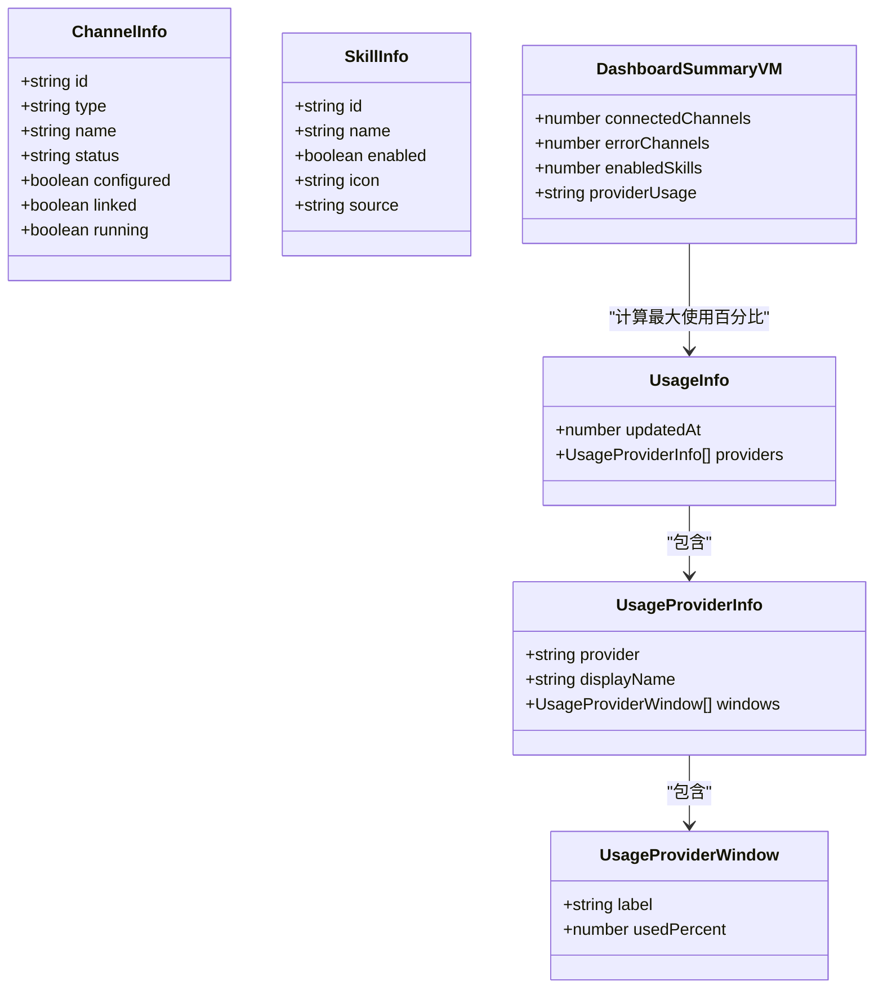
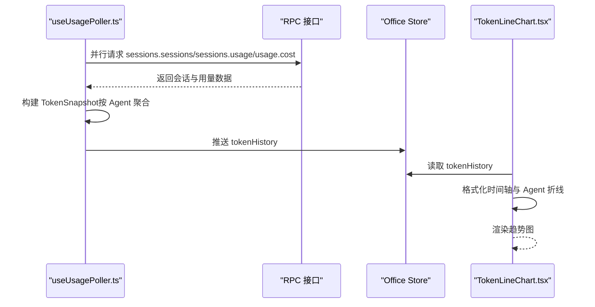
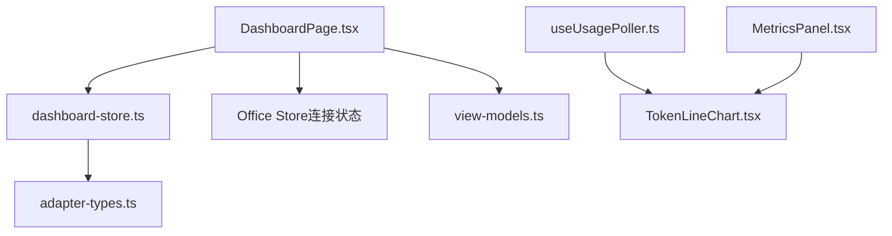

# 仪表板 Store

<cite>
**本文档引用的文件**
- [src/store/console-stores/dashboard-store.ts](file://src/store/console-stores/dashboard-store.ts)
- [src/components/pages/DashboardPage.tsx](file://src/components/pages/DashboardPage.tsx)
- [src/components/console/dashboard/StatCard.tsx](file://src/components/console/dashboard/StatCard.tsx)
- [src/components/console/dashboard/ChannelOverview.tsx](file://src/components/console/dashboard/ChannelOverview.tsx)
- [src/components/console/dashboard/SkillOverview.tsx](file://src/components/console/dashboard/SkillOverview.tsx)
- [src/components/console/dashboard/QuickNavGrid.tsx](file://src/components/console/dashboard/QuickNavGrid.tsx)
- [src/lib/view-models.ts](file://src/lib/view-models.ts)
- [src/gateway/adapter-types.ts](file://src/gateway/adapter-types.ts)
- [src/hooks/useUsagePoller.ts](file://src/hooks/useUsagePoller.ts)
- [src/components/panels/TokenLineChart.tsx](file://src/components/panels/TokenLineChart.tsx)
- [src/components/panels/MetricsPanel.tsx](file://src/components/panels/MetricsPanel.tsx)
- [src/store/__tests__/dashboard-store-phase-c.test.ts](file://src/store/__tests__/dashboard-store-phase-c.test.ts)
</cite>

## 目录
1. [简介](#简介)
2. [项目结构](#项目结构)
3. [核心组件](#核心组件)
4. [架构总览](#架构总览)
5. [详细组件分析](#详细组件分析)
6. [依赖关系分析](#依赖关系分析)
7. [性能考量](#性能考量)
8. [故障排查指南](#故障排查指南)
9. [结论](#结论)
10. [附录](#附录)

## 简介
本文件为仪表板 Store 模块的技术文档，聚焦以下目标：
- 系统概览数据的聚合与展示：从多个 Store 模块收集状态，汇总为仪表板卡片与概览视图。
- 关键指标的实时更新与缓存：通过适配器并行拉取通道、技能与用量信息，并在页面层进行缓存与展示。
- 多维度数据统计与分析：对连接状态、启用技能数、用量占比等进行统计与可视化准备。
- 仪表板数据模型：StatCard 接口定义、指标类型分类、数据格式标准化。
- 图表数据处理：时间序列数据处理、趋势分析准备、可视化数据结构。
- 性能监控：数据刷新频率控制、内存使用优化、响应时间监控。
- 自定义指标配置、数据导出、报表生成的最佳实践。

## 项目结构
仪表板 Store 位于控制台 Store 层，配合页面组件与适配器类型共同完成数据采集与展示。关键文件分布如下：
- Store 层：dashboard-store.ts 提供状态与刷新逻辑
- 页面层：DashboardPage.tsx 负责渲染概览卡片、导航与错误/加载态
- 视图组件：StatCard、ChannelOverview、SkillOverview、QuickNavGrid
- 数据模型与转换：adapter-types.ts 定义适配器数据结构；view-models.ts 提供 UI ViewModel 转换函数
- 使用态监控：useUsagePoller.ts 提供令牌用量快照与成本聚合，配合 TokenLineChart 进行趋势可视化
- 测试：dashboard-store-phase-c.test.ts 验证 Store 的并行刷新与错误聚合

**图表来源**
- [src/components/pages/DashboardPage.tsx:1-231](file://src/components/pages/DashboardPage.tsx#L1-L231)
- [src/store/console-stores/dashboard-store.ts:1-55](file://src/store/console-stores/dashboard-store.ts#L1-L55)
- [src/components/console/dashboard/StatCard.tsx:1-39](file://src/components/console/dashboard/StatCard.tsx#L1-L39)
- [src/components/console/dashboard/ChannelOverview.tsx:1-62](file://src/components/console/dashboard/ChannelOverview.tsx#L1-L62)
- [src/components/console/dashboard/SkillOverview.tsx:1-45](file://src/components/console/dashboard/SkillOverview.tsx#L1-L45)
- [src/components/console/dashboard/QuickNavGrid.tsx:1-59](file://src/components/console/dashboard/QuickNavGrid.tsx#L1-L59)
- [src/lib/view-models.ts:1-200](file://src/lib/view-models.ts#L1-L200)
- [src/gateway/adapter-types.ts:1-458](file://src/gateway/adapter-types.ts#L1-L458)
- [src/hooks/useUsagePoller.ts:50-149](file://src/hooks/useUsagePoller.ts#L50-L149)
- [src/components/panels/TokenLineChart.tsx:1-124](file://src/components/panels/TokenLineChart.tsx#L1-L124)
- [src/components/panels/MetricsPanel.tsx:1-128](file://src/components/panels/MetricsPanel.tsx#L1-L128)

**章节来源**
- [src/store/console-stores/dashboard-store.ts:1-55](file://src/store/console-stores/dashboard-store.ts#L1-L55)
- [src/components/pages/DashboardPage.tsx:1-231](file://src/components/pages/DashboardPage.tsx#L1-L231)

## 核心组件
- 仪表板 Store（dashboard-store.ts）：提供 channelsSummary、skillsSummary、usage、uptime、isLoading、error 状态，以及 refresh 方法用于并行获取通道、技能与用量状态。
- 页面组件（DashboardPage.tsx）：负责首次加载触发刷新、根据连接状态与错误显示不同 UI、渲染 StatCard 概览卡片与概览区域。
- 视图组件：
  - StatCard.tsx：通用指标卡片组件，支持图标、标题、数值、副标题与进度条。
  - ChannelOverview.tsx：展示已连接通道的图标与状态徽标。
  - SkillOverview.tsx：展示已启用技能列表。
  - QuickNavGrid.tsx：快捷导航网格，跳转到通道、技能、定时任务与设置。
- 数据模型与转换（adapter-types.ts、view-models.ts）：定义 ChannelInfo、SkillInfo、UsageInfo 等适配器数据结构，并提供 toDashboardSummaryVM 等 ViewModel 转换函数。
- 使用态监控（useUsagePoller.ts、TokenLineChart.tsx）：周期性拉取会话用量，构建 TokenSnapshot 时间序列，用于趋势图展示。
- 测试（dashboard-store-phase-c.test.ts）：验证 Store 并行刷新、错误聚合与 Provider 窗口字段。

**章节来源**
- [src/store/console-stores/dashboard-store.ts:1-55](file://src/store/console-stores/dashboard-store.ts#L1-L55)
- [src/components/pages/DashboardPage.tsx:1-231](file://src/components/pages/DashboardPage.tsx#L1-L231)
- [src/components/console/dashboard/StatCard.tsx:1-39](file://src/components/console/dashboard/StatCard.tsx#L1-L39)
- [src/components/console/dashboard/ChannelOverview.tsx:1-62](file://src/components/console/dashboard/ChannelOverview.tsx#L1-L62)
- [src/components/console/dashboard/SkillOverview.tsx:1-45](file://src/components/console/dashboard/SkillOverview.tsx#L1-L45)
- [src/components/console/dashboard/QuickNavGrid.tsx:1-59](file://src/components/console/dashboard/QuickNavGrid.tsx#L1-L59)
- [src/lib/view-models.ts:1-200](file://src/lib/view-models.ts#L1-L200)
- [src/gateway/adapter-types.ts:1-458](file://src/gateway/adapter-types.ts#L1-L458)
- [src/hooks/useUsagePoller.ts:50-149](file://src/hooks/useUsagePoller.ts#L50-L149)
- [src/components/panels/TokenLineChart.tsx:1-124](file://src/components/panels/TokenLineChart.tsx#L1-L124)
- [src/store/__tests__/dashboard-store-phase-c.test.ts:1-47](file://src/store/__tests__/dashboard-store-phase-c.test.ts#L1-L47)

## 架构总览
仪表板 Store 的工作流由“页面触发 → Store 并行拉取 → 组装状态 → 渲染组件”构成。同时，使用态监控独立运行，提供时间序列数据以支撑趋势图。

**图表来源**
- [src/components/pages/DashboardPage.tsx:19-21](file://src/components/pages/DashboardPage.tsx#L19-L21)
- [src/store/console-stores/dashboard-store.ts:24-53](file://src/store/console-stores/dashboard-store.ts#L24-L53)
- [src/gateway/adapter-types.ts:19-33](file://src/gateway/adapter-types.ts#L19-L33)
- [src/gateway/adapter-types.ts:35-57](file://src/gateway/adapter-types.ts#L35-L57)
- [src/gateway/adapter-types.ts:240-257](file://src/gateway/adapter-types.ts#L240-L257)

## 详细组件分析

### 仪表板 Store（dashboard-store.ts）
- 状态字段
  - channelsSummary：通道状态数组（含 id、type、name、status 等）
  - skillsSummary：技能状态数组（含 id、name、enabled、icon 等）
  - usage：用量信息（包含 providers/windows/updatedAt）
  - uptime：系统在线时长（当前 Store 中初始化为 0）
  - isLoading/error：加载状态与错误信息
- 刷新流程
  - 等待适配器可用后，使用 Promise.allSettled 并行请求三个状态接口
  - 将 fulfilled 结果写入对应字段，rejected 错误聚合为字符串
  - 异常捕获统一设置 error 并关闭 isLoading
- 与页面交互
  - DashboardPage 在挂载时调用 refresh，首次加载即触发
  - 页面根据 isLoading 与 error 决定加载态或错误态 UI

**图表来源**
- [src/store/console-stores/dashboard-store.ts:24-53](file://src/store/console-stores/dashboard-store.ts#L24-L53)

**章节来源**
- [src/store/console-stores/dashboard-store.ts:1-55](file://src/store/console-stores/dashboard-store.ts#L1-L55)
- [src/store/__tests__/dashboard-store-phase-c.test.ts:18-47](file://src/store/__tests__/dashboard-store-phase-c.test.ts#L18-L47)

### 页面与概览组件（DashboardPage.tsx、StatCard.tsx、ChannelOverview.tsx、SkillOverview.tsx、QuickNavGrid.tsx）
- DashboardPage
  - 首次加载自动调用 refresh
  - 根据连接状态与错误显示加载态、错误态或概览页
  - 计算连接通道数、错误通道数、启用技能数、用量占比等指标
  - 渲染四个 StatCard 指标卡与 QuickNavGrid 快捷导航
- StatCard
  - 接收图标、标题、数值、副标题与进度条参数
  - 支持颜色与样式定制
- ChannelOverview/SkillOverview
  - 展示已连接通道与已启用技能的列表与状态
- QuickNavGrid
  - 四个快捷入口：通道、技能、定时任务、设置

**图表来源**
- [src/components/pages/DashboardPage.tsx:14-129](file://src/components/pages/DashboardPage.tsx#L14-L129)
- [src/components/console/dashboard/StatCard.tsx:1-39](file://src/components/console/dashboard/StatCard.tsx#L1-L39)
- [src/components/console/dashboard/ChannelOverview.tsx:1-62](file://src/components/console/dashboard/ChannelOverview.tsx#L1-L62)
- [src/components/console/dashboard/SkillOverview.tsx:1-45](file://src/components/console/dashboard/SkillOverview.tsx#L1-L45)
- [src/components/console/dashboard/QuickNavGrid.tsx:1-59](file://src/components/console/dashboard/QuickNavGrid.tsx#L1-L59)

**章节来源**
- [src/components/pages/DashboardPage.tsx:1-231](file://src/components/pages/DashboardPage.tsx#L1-L231)
- [src/components/console/dashboard/StatCard.tsx:1-39](file://src/components/console/dashboard/StatCard.tsx#L1-L39)
- [src/components/console/dashboard/ChannelOverview.tsx:1-62](file://src/components/console/dashboard/ChannelOverview.tsx#L1-L62)
- [src/components/console/dashboard/SkillOverview.tsx:1-45](file://src/components/console/dashboard/SkillOverview.tsx#L1-L45)
- [src/components/console/dashboard/QuickNavGrid.tsx:1-59](file://src/components/console/dashboard/QuickNavGrid.tsx#L1-L59)

### 数据模型与转换（adapter-types.ts、view-models.ts）
- 适配器数据结构
  - ChannelInfo：通道标识、类型、名称、状态、配置与运行相关字段
  - SkillInfo：技能标识、名称、启用状态、图标、来源、需求与校验等
  - UsageInfo/UsageProviderInfo/UsageProviderWindow：提供商、窗口与使用百分比
- ViewModel 转换
  - toDashboardSummaryVM：计算连接通道数、错误通道数、启用技能数与最大使用百分比
  - 其他转换函数（如 toChannelCardVM、toSkillCardVM）用于卡片视图

**图表来源**
- [src/gateway/adapter-types.ts:19-33](file://src/gateway/adapter-types.ts#L19-L33)
- [src/gateway/adapter-types.ts:35-57](file://src/gateway/adapter-types.ts#L35-L57)
- [src/gateway/adapter-types.ts:240-257](file://src/gateway/adapter-types.ts#L240-L257)
- [src/lib/view-models.ts:8-13](file://src/lib/view-models.ts#L8-L13)
- [src/lib/view-models.ts:82-100](file://src/lib/view-models.ts#L82-L100)

**章节来源**
- [src/gateway/adapter-types.ts:1-458](file://src/gateway/adapter-types.ts#L1-L458)
- [src/lib/view-models.ts:1-200](file://src/lib/view-models.ts#L1-L200)

### 图表数据处理（useUsagePoller.ts、TokenLineChart.tsx）
- 使用态监控
  - 定期轮询会话列表、会话用量与总成本，构建 TokenSnapshot（timestamp、total、byAgent）
  - 当 RPC 请求失败达到阈值时，基于事件历史估算快照并推入时间序列
- 趋势图准备
  - TokenLineChart 从 Office Store 获取 tokenHistory，按时间轴格式化并提取前 N 个高贡献 Agent
  - 为每个 Agent 生成折线，叠加总用量折线，用于趋势分析与可视化

**图表来源**
- [src/hooks/useUsagePoller.ts:50-149](file://src/hooks/useUsagePoller.ts#L50-L149)
- [src/components/panels/TokenLineChart.tsx:22-124](file://src/components/panels/TokenLineChart.tsx#L22-L124)

**章节来源**
- [src/hooks/useUsagePoller.ts:50-149](file://src/hooks/useUsagePoller.ts#L50-L149)
- [src/components/panels/TokenLineChart.tsx:1-124](file://src/components/panels/TokenLineChart.tsx#L1-L124)

### 测试与验证（dashboard-store-phase-c.test.ts）
- 验证 Store 在模拟适配器下的行为：
  - refresh 并行加载通道、技能与用量
  - 首次加载时 isLoading 为 true，完成后为 false
  - usage 的 providers 包含 windows 字段，且每个 Provider 至少有一个窗口

**章节来源**
- [src/store/__tests__/dashboard-store-phase-c.test.ts:1-47](file://src/store/__tests__/dashboard-store-phase-c.test.ts#L1-L47)

## 依赖关系分析
- 组件耦合
  - DashboardPage 依赖 dashboard-store 的状态与方法，依赖 Office Store 的连接状态用于断连提示
  - StatCard 为纯展示组件，无副作用
  - ChannelOverview/SkillOverview 依赖适配器返回的原始数据结构
- 外部依赖
  - 适配器类型定义来自 adapter-types.ts
  - ViewModel 转换来自 view-models.ts
  - 使用态监控来自 useUsagePoller.ts，输出至 Office Store，被 TokenLineChart 读取

**图表来源**
- [src/components/pages/DashboardPage.tsx:11-17](file://src/components/pages/DashboardPage.tsx#L11-L17)
- [src/store/console-stores/dashboard-store.ts:1-55](file://src/store/console-stores/dashboard-store.ts#L1-L55)
- [src/gateway/adapter-types.ts:1-458](file://src/gateway/adapter-types.ts#L1-L458)
- [src/lib/view-models.ts:1-200](file://src/lib/view-models.ts#L1-L200)
- [src/hooks/useUsagePoller.ts:50-149](file://src/hooks/useUsagePoller.ts#L50-L149)
- [src/components/panels/TokenLineChart.tsx:1-124](file://src/components/panels/TokenLineChart.tsx#L1-L124)
- [src/components/panels/MetricsPanel.tsx:1-128](file://src/components/panels/MetricsPanel.tsx#L1-L128)

**章节来源**
- [src/components/pages/DashboardPage.tsx:1-231](file://src/components/pages/DashboardPage.tsx#L1-L231)
- [src/store/console-stores/dashboard-store.ts:1-55](file://src/store/console-stores/dashboard-store.ts#L1-L55)
- [src/gateway/adapter-types.ts:1-458](file://src/gateway/adapter-types.ts#L1-L458)
- [src/lib/view-models.ts:1-200](file://src/lib/view-models.ts#L1-L200)
- [src/hooks/useUsagePoller.ts:50-149](file://src/hooks/useUsagePoller.ts#L50-L149)
- [src/components/panels/TokenLineChart.tsx:1-124](file://src/components/panels/TokenLineChart.tsx#L1-L124)
- [src/components/panels/MetricsPanel.tsx:1-128](file://src/components/panels/MetricsPanel.tsx#L1-L128)

## 性能考量
- 刷新频率控制
  - dashboard-store 的 refresh 采用一次性并行拉取，避免重复请求
  - 使用 isLoading 控制 UI 重绘与按钮禁用，防止频繁点击导致并发风暴
- 内存使用优化
  - 使用态监控中的 TokenSnapshot 仅保留必要字段（timestamp、total、byAgent），避免冗余
  - TokenLineChart 仅对前 N 个高贡献 Agent 绘制折线，降低渲染开销
- 响应时间监控
  - 通过 Office Store 的连接状态与错误信息反馈，辅助定位网络问题
  - 使用态轮询间隔固定，失败阈值触发降级估算，保证稳定性

[本节为通用性能建议，不直接分析具体文件]

## 故障排查指南
- 仪表板 Store
  - 若首次加载长时间处于加载态，检查适配器是否可用与网络连接
  - 若出现错误提示，查看 error 字段内容，确认 channels/skills/usage 中哪一项失败
- 使用态监控
  - 若趋势图空白或数据缺失，检查 tokenHistory 是否存在足够样本
  - 若轮询失败，观察失败计数与 Office Store 的事件历史，确认是否触发了降级估算
- 页面断连提示
  - 当连接状态非 connected 且非 connecting 时，页面会显示断连引导与重试按钮

**章节来源**
- [src/components/pages/DashboardPage.tsx:23-57](file://src/components/pages/DashboardPage.tsx#L23-L57)
- [src/hooks/useUsagePoller.ts:83-94](file://src/hooks/useUsagePoller.ts#L83-L94)

## 结论
仪表板 Store 通过并行拉取通道、技能与用量状态，结合 ViewModel 转换与 UI 组件，实现了系统概览的高效聚合与展示。配合使用态监控与趋势图，进一步完善了实时指标与可视化能力。测试覆盖验证了关键行为，确保在复杂环境下仍可稳定运行。

[本节为总结性内容，不直接分析具体文件]

## 附录

### 数据模型与接口定义
- 通道信息（ChannelInfo）
  - 字段：id、type、name、status、configured、linked、running、lastConnectedAt、lastMessageAt、reconnectAttempts、mode
- 技能信息（SkillInfo）
  - 字段：id、slug、name、description、enabled、icon、version、author、isCore、isBundled、config、source、homepage、primaryEnv、always、eligible、blockedByAllowlist、requirements、missing、installOptions、configChecks
- 用量信息（UsageInfo/UsageProviderInfo/UsageProviderWindow）
  - 字段：updatedAt、providers（包含 provider、displayName、plan、windows）、windows（包含 label、usedPercent、resetAt）

**章节来源**
- [src/gateway/adapter-types.ts:19-33](file://src/gateway/adapter-types.ts#L19-L33)
- [src/gateway/adapter-types.ts:35-57](file://src/gateway/adapter-types.ts#L35-L57)
- [src/gateway/adapter-types.ts:240-257](file://src/gateway/adapter-types.ts#L240-L257)

### 指标类型与统计
- 连接通道数：channelsSummary 中 status 为 connected 的数量
- 错误通道数：channelsSummary 中 status 为 error 的数量
- 已启用技能数：skillsSummary 中 enabled 为 true 的数量
- 最大使用百分比：usage.providers.windows.usedPercent 的最大值

**章节来源**
- [src/lib/view-models.ts:82-100](file://src/lib/view-models.ts#L82-L100)
- [src/components/pages/DashboardPage.tsx:59-67](file://src/components/pages/DashboardPage.tsx#L59-L67)

### 可视化准备与图表
- TokenLineChart
  - 输入：tokenHistory（TokenSnapshot 数组）
  - 输出：按时间轴格式化的折线图数据，包含 total 与前 N 个高贡献 Agent 的折线
- MetricsPanel
  - 提供概览、趋势、拓扑、活动四个标签页，懒加载对应面板组件

**章节来源**
- [src/components/panels/TokenLineChart.tsx:22-124](file://src/components/panels/TokenLineChart.tsx#L22-L124)
- [src/components/panels/MetricsPanel.tsx:28-118](file://src/components/panels/MetricsPanel.tsx#L28-L118)