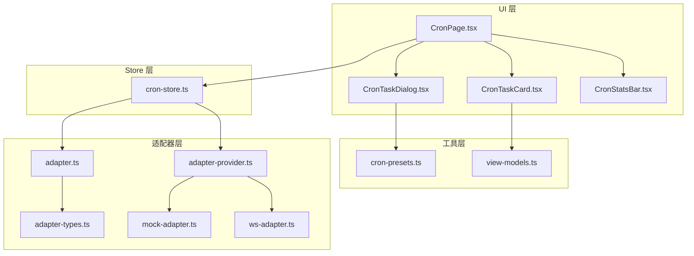
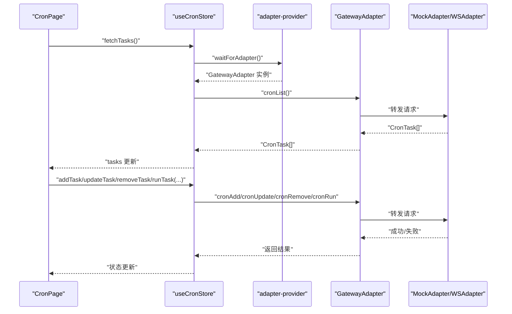
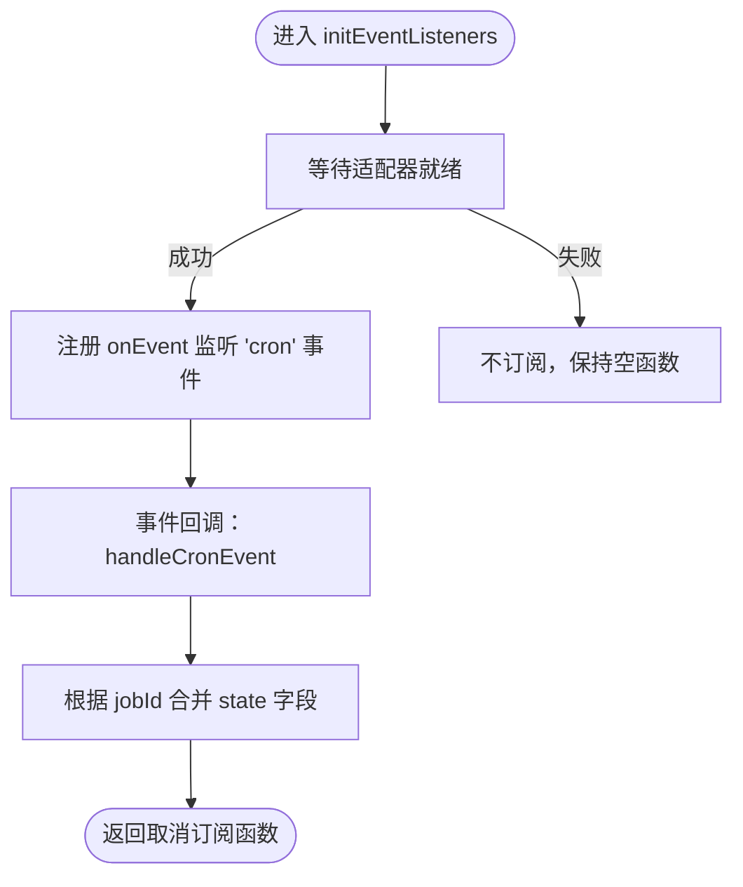
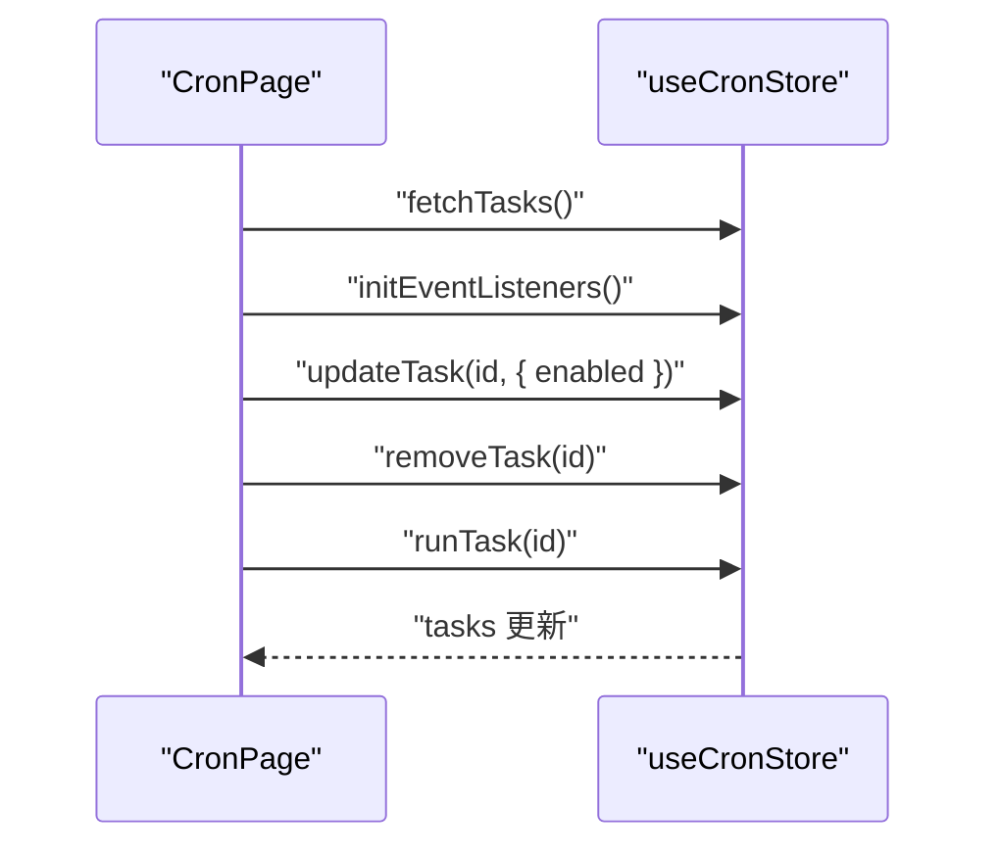
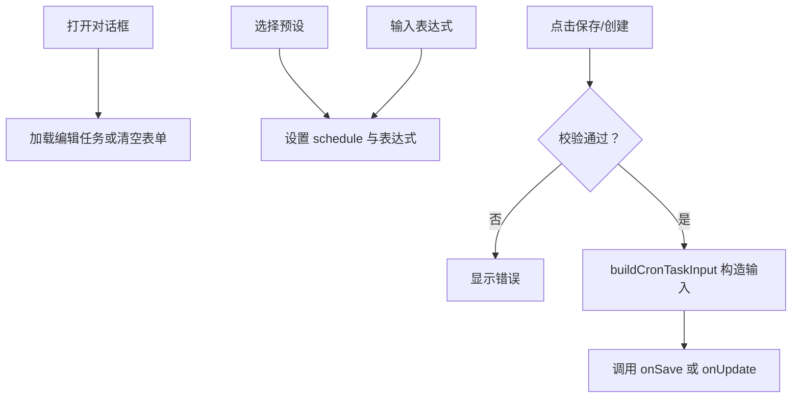
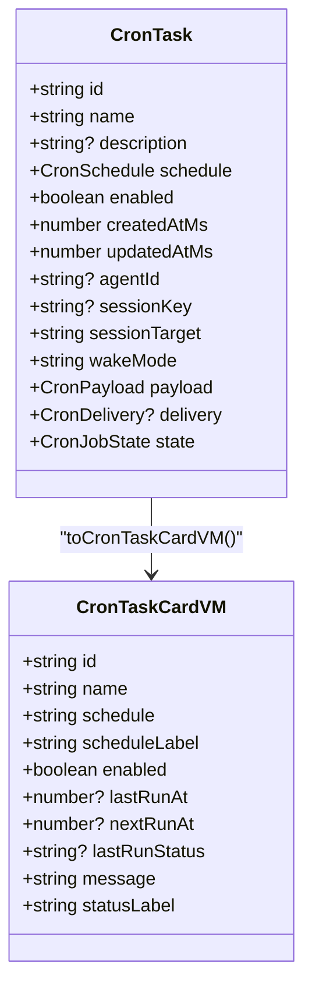
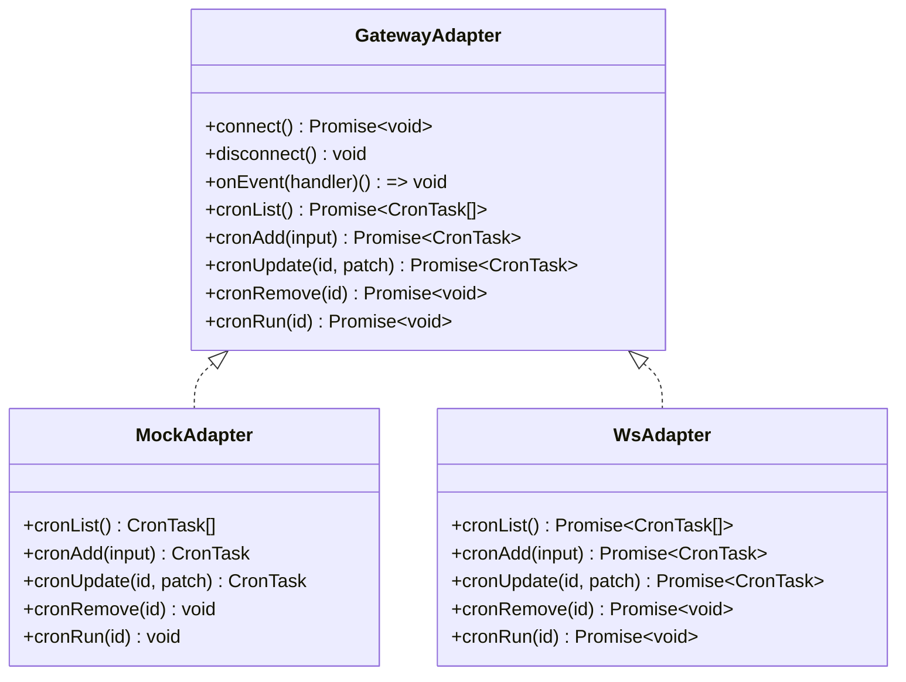
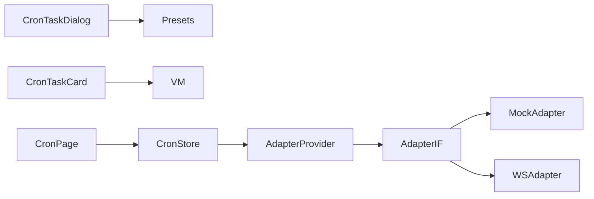

# 定时任务 Store

<cite>
**本文档引用的文件**
- [src/store/console-stores/cron-store.ts](file://src/store/console-stores/cron-store.ts)
- [src/components/pages/CronPage.tsx](file://src/components/pages/CronPage.tsx)
- [src/components/console/cron/CronTaskDialog.tsx](file://src/components/console/cron/CronTaskDialog.tsx)
- [src/components/console/cron/CronTaskCard.tsx](file://src/components/console/cron/CronTaskCard.tsx)
- [src/components/console/cron/CronStatsBar.tsx](file://src/components/console/cron/CronStatsBar.tsx)
- [src/lib/cron-presets.ts](file://src/lib/cron-presets.ts)
- [src/lib/view-models.ts](file://src/lib/view-models.ts)
- [src/gateway/adapter-types.ts](file://src/gateway/adapter-types.ts)
- [src/gateway/adapter.ts](file://src/gateway/adapter.ts)
- [src/gateway/adapter-provider.ts](file://src/gateway/adapter-provider.ts)
- [src/gateway/mock-adapter.ts](file://src/gateway/mock-adapter.ts)
- [src/gateway/ws-adapter.ts](file://src/gateway/ws-adapter.ts)
</cite>

## 目录
1. [简介](#简介)
2. [项目结构](#项目结构)
3. [核心组件](#核心组件)
4. [架构总览](#架构总览)
5. [详细组件分析](#详细组件分析)
6. [依赖关系分析](#依赖关系分析)
7. [性能考量](#性能考量)
8. [故障排除指南](#故障排除指南)
9. [结论](#结论)

## 简介
本文件面向“定时任务 Store”模块，系统性阐述基于 Zustand 的前端状态管理如何与后端网关适配器协同，实现定时任务的创建、调度、执行监控与状态管理。重点覆盖：
- Cron 表达式与调度规则的数据模型与预设
- 任务生命周期：创建、更新、删除、立即执行
- 执行监控：状态字段、UI 展示、事件驱动刷新
- 交互界面：任务卡片、对话框、统计栏
- 适配器抽象：Mock 与 WebSocket 两种实现路径
- 最佳实践与常见问题排查

## 项目结构
定时任务相关代码主要分布在以下位置：
- Store 层：Zustand 状态管理，封装对适配器的调用与事件监听
- UI 层：页面、卡片、对话框、统计组件
- 工具层：Cron 预设、视图模型转换
- 适配器层：统一接口与两种实现（Mock/WS）



图表来源
- [src/components/pages/CronPage.tsx:13-151](file://src/components/pages/CronPage.tsx#L13-L151)
- [src/store/console-stores/cron-store.ts:27-125](file://src/store/console-stores/cron-store.ts#L27-L125)
- [src/lib/cron-presets.ts:1-23](file://src/lib/cron-presets.ts#L1-L23)
- [src/lib/view-models.ts:142-165](file://src/lib/view-models.ts#L142-L165)
- [src/gateway/adapter-types.ts:65-123](file://src/gateway/adapter-types.ts#L65-L123)
- [src/gateway/adapter.ts:46-82](file://src/gateway/adapter.ts#L46-L82)
- [src/gateway/adapter-provider.ts:15-86](file://src/gateway/adapter-provider.ts#L15-L86)
- [src/gateway/mock-adapter.ts:869-931](file://src/gateway/mock-adapter.ts#L869-L931)
- [src/gateway/ws-adapter.ts:208-230](file://src/gateway/ws-adapter.ts#L208-L230)

章节来源
- [src/store/console-stores/cron-store.ts:1-125](file://src/store/console-stores/cron-store.ts#L1-L125)
- [src/components/pages/CronPage.tsx:1-195](file://src/components/pages/CronPage.tsx#L1-L195)
- [src/lib/cron-presets.ts:1-23](file://src/lib/cron-presets.ts#L1-L23)
- [src/lib/view-models.ts:142-165](file://src/lib/view-models.ts#L142-L165)
- [src/gateway/adapter-types.ts:65-123](file://src/gateway/adapter-types.ts#L65-L123)
- [src/gateway/adapter.ts:46-82](file://src/gateway/adapter.ts#L46-L82)
- [src/gateway/adapter-provider.ts:15-86](file://src/gateway/adapter-provider.ts#L15-L86)
- [src/gateway/mock-adapter.ts:869-931](file://src/gateway/mock-adapter.ts#L869-L931)
- [src/gateway/ws-adapter.ts:208-230](file://src/gateway/ws-adapter.ts#L208-L230)

## 核心组件
- CronStore（Zustand）
  - 负责任务列表、加载状态、错误状态、对话框状态
  - 对外暴露：任务 CRUD、立即执行、打开/关闭对话框、事件监听初始化
  - 与适配器交互：通过等待适配器就绪后调用 cronList/cronAdd/cronUpdate/cronRemove/cronRun
- CronPage（页面）
  - 初始化任务拉取与事件监听
  - 提供任务切换启用/禁用、删除确认、立即执行确认
  - 任务排序：按下次运行时间升序
- CronTaskDialog（表单）
  - 支持 Cron 预设、手动输入表达式
  - 校验必填项（名称、消息、表达式）
  - 构造 CronTaskInput 并提交到 Store
- CronTaskCard（卡片）
  - 展示任务名称、计划标签、最近/下次运行时间、最后状态图标、错误信息
  - 支持启用/禁用、立即执行、编辑、删除
- CronStatsBar（统计）
  - 展示总数、启用数、暂停数、失败数
- 视图模型与预设
  - toCronTaskCardVM：将 CronTask 映射为卡片视图模型
  - cron-presets：内置常用 Cron 预设与表达式描述函数

章节来源
- [src/store/console-stores/cron-store.ts:7-25](file://src/store/console-stores/cron-store.ts#L7-L25)
- [src/components/pages/CronPage.tsx:13-151](file://src/components/pages/CronPage.tsx#L13-L151)
- [src/components/console/cron/CronTaskDialog.tsx:37-227](file://src/components/console/cron/CronTaskDialog.tsx#L37-L227)
- [src/components/console/cron/CronTaskCard.tsx:20-106](file://src/components/console/cron/CronTaskCard.tsx#L20-L106)
- [src/components/console/cron/CronStatsBar.tsx:8-38](file://src/components/console/cron/CronStatsBar.tsx#L8-L38)
- [src/lib/view-models.ts:142-165](file://src/lib/view-models.ts#L142-L165)
- [src/lib/cron-presets.ts:3-22](file://src/lib/cron-presets.ts#L3-L22)

## 架构总览
定时任务从 UI 到状态管理再到适配器的调用链路如下：



图表来源
- [src/store/console-stores/cron-store.ts:35-87](file://src/store/console-stores/cron-store.ts#L35-L87)
- [src/gateway/adapter-provider.ts:25-48](file://src/gateway/adapter-provider.ts#L25-L48)
- [src/gateway/adapter.ts:76-82](file://src/gateway/adapter.ts#L76-L82)
- [src/gateway/mock-adapter.ts:869-931](file://src/gateway/mock-adapter.ts#L869-L931)
- [src/gateway/ws-adapter.ts:208-230](file://src/gateway/ws-adapter.ts#L208-L230)

## 详细组件分析

### CronStore 状态与方法
- 状态字段
  - tasks：任务数组
  - isLoading/error：加载与错误状态
  - dialogOpen/editingTask：对话框状态
- 方法
  - fetchTasks：拉取任务列表
  - addTask/updateTask/removeTask/runTask：任务 CRUD 与立即执行
  - openDialog/closeDialog：对话框开关
  - handleCronEvent：接收 cron 事件并合并到任务状态
  - initEventListeners：订阅适配器事件，返回取消订阅函数



图表来源
- [src/store/console-stores/cron-store.ts:101-123](file://src/store/console-stores/cron-store.ts#L101-L123)

章节来源
- [src/store/console-stores/cron-store.ts:27-125](file://src/store/console-stores/cron-store.ts#L27-L125)

### CronPage 页面逻辑
- 生命周期：挂载时拉取任务并初始化事件监听，卸载时返回并调用取消订阅
- 用户操作：
  - 切换 enabled 字段（通过 updateTask）
  - 删除确认：removeTask
  - 立即执行：runTask，并重新拉取任务列表
- 排序：按 state.nextRunAtMs 升序排列



图表来源
- [src/components/pages/CronPage.tsx:34-57](file://src/components/pages/CronPage.tsx#L34-L57)

章节来源
- [src/components/pages/CronPage.tsx:13-151](file://src/components/pages/CronPage.tsx#L13-L151)

### CronTaskDialog 表单与校验
- 预设选择：CRON_PRESETS 列表，点击后设置 schedule 与表达式
- 手动输入：实时同步表达式到 schedule
- 校验：名称、消息、表达式必填
- 构建输入：buildCronTaskInput 将表单参数映射为 CronTaskInput
  - payload 支持 agentTurn/systemEvent
  - sessionTarget 默认根据 payloadKind 决定
  - wakeMode 固定为 "now"



图表来源
- [src/components/console/cron/CronTaskDialog.tsx:55-122](file://src/components/console/cron/CronTaskDialog.tsx#L55-L122)
- [src/lib/cron-presets.ts:8-22](file://src/lib/cron-presets.ts#L8-L22)

章节来源
- [src/components/console/cron/CronTaskDialog.tsx:37-227](file://src/components/console/cron/CronTaskDialog.tsx#L37-L227)
- [src/lib/cron-presets.ts:1-23](file://src/lib/cron-presets.ts#L1-L23)

### CronTaskCard 卡片展示
- 任务状态：enabled 控制透明度
- 计划标签：通过视图模型生成人类可读描述
- 时间显示：最近/下次运行时间本地化
- 最后状态：ok/error/skipped 图标
- 错误信息：lastError 文本



图表来源
- [src/gateway/adapter-types.ts:95-123](file://src/gateway/adapter-types.ts#L95-L123)
- [src/lib/view-models.ts:142-165](file://src/lib/view-models.ts#L142-L165)

章节来源
- [src/components/console/cron/CronTaskCard.tsx:20-106](file://src/components/console/cron/CronTaskCard.tsx#L20-L106)
- [src/lib/view-models.ts:142-165](file://src/lib/view-models.ts#L142-L165)

### CronStatsBar 统计
- active：enabled 且 lastRunStatus 非 error
- paused：!enabled
- failed：lastRunStatus === "error"

章节来源
- [src/components/console/cron/CronStatsBar.tsx:8-38](file://src/components/console/cron/CronStatsBar.tsx#L8-L38)

### 适配器与数据模型

#### Cron 数据模型
- CronSchedule：支持 cron/expression、every（毫秒）、at（时间字符串）
- CronPayload：支持 agentTurn、systemEvent、webhook
- CronDelivery：通知模式与目标
- CronJobState：包含 nextRunAtMs/lastRunAtMs/lastRunStatus/lastError/runningAtMs
- CronTask/CronTaskInput：任务实体与输入参数

```mermaid
erDiagram
CRON_TASK {
string id PK
string name
string? description
json schedule
boolean enabled
number createdAtMs
number updatedAtMs
string? agentId
string? sessionKey
string sessionTarget
string wakeMode
json payload
json? delivery
json state
}
CRON_SCHEDULE {
string kind
string? expr
number? everyMs
number? anchorMs
string? at
string? tz
}
CRON_PAYLOAD {
string kind
string? message
string? text
string? url
string? method
json? headers
string? body
}
CRON_DELIVERY {
string mode
string? channel
string? target
}
CRON_JOB_STATE {
number? nextRunAtMs
number? lastRunAtMs
string? lastRunStatus
string? lastError
number? runningAtMs
}
CRON_TASK }o--|| CRON_SCHEDULE : "schedule"
CRON_TASK }o--|| CRON_PAYLOAD : "payload"
CRON_TASK }o--|| CRON_DELIVERY : "delivery"
CRON_TASK }o--|| CRON_JOB_STATE : "state"
```

图表来源
- [src/gateway/adapter-types.ts:65-123](file://src/gateway/adapter-types.ts#L65-L123)

章节来源
- [src/gateway/adapter-types.ts:65-123](file://src/gateway/adapter-types.ts#L65-L123)

#### 适配器接口与实现
- GatewayAdapter：定义 cronList/cronAdd/cronUpdate/cronRemove/cronRun 等方法
- MockAdapter：提供内存中的任务集合与简单实现
- WsAdapter：通过 RPC 请求转发到后端



图表来源
- [src/gateway/adapter.ts:46-82](file://src/gateway/adapter.ts#L46-L82)
- [src/gateway/mock-adapter.ts:869-931](file://src/gateway/mock-adapter.ts#L869-L931)
- [src/gateway/ws-adapter.ts:208-230](file://src/gateway/ws-adapter.ts#L208-L230)

章节来源
- [src/gateway/adapter.ts:46-82](file://src/gateway/adapter.ts#L46-L82)
- [src/gateway/mock-adapter.ts:869-931](file://src/gateway/mock-adapter.ts#L869-L931)
- [src/gateway/ws-adapter.ts:208-230](file://src/gateway/ws-adapter.ts#L208-L230)

## 依赖关系分析
- Store 依赖适配器提供者与适配器接口
- UI 组件依赖 Store 与视图模型
- 表单依赖预设工具
- 适配器实现依赖 RPC/WS 客户端



图表来源
- [src/components/console/cron/CronTaskDialog.tsx:3-4](file://src/components/console/cron/CronTaskDialog.tsx#L3-L4)
- [src/lib/view-models.ts:142-165](file://src/lib/view-models.ts#L142-L165)
- [src/components/pages/CronPage.tsx](file://src/components/pages/CronPage.tsx#L11)
- [src/store/console-stores/cron-store.ts:1-5](file://src/store/console-stores/cron-store.ts#L1-L5)
- [src/gateway/adapter-provider.ts:1-6](file://src/gateway/adapter-provider.ts#L1-L6)
- [src/gateway/adapter.ts:1-35](file://src/gateway/adapter.ts#L1-L35)

章节来源
- [src/components/console/cron/CronTaskDialog.tsx:1-228](file://src/components/console/cron/CronTaskDialog.tsx#L1-L228)
- [src/lib/view-models.ts:1-200](file://src/lib/view-models.ts#L1-L200)
- [src/components/pages/CronPage.tsx:1-195](file://src/components/pages/CronPage.tsx#L1-L195)
- [src/store/console-stores/cron-store.ts:1-125](file://src/store/console-stores/cron-store.ts#L1-L125)
- [src/gateway/adapter-provider.ts:1-130](file://src/gateway/adapter-provider.ts#L1-L130)
- [src/gateway/adapter.ts:1-113](file://src/gateway/adapter.ts#L1-L113)

## 性能考量
- 状态粒度：Store 仅维护任务列表与少量 UI 状态，避免冗余重渲染
- 事件驱动：通过 cron 事件增量更新任务状态，减少全量刷新
- UI 排序：页面内对任务进行排序，复杂度 O(n log n)，建议在任务较多时考虑虚拟滚动
- 适配器等待：使用 waitForAdapter 避免竞态，确保 UI 在适配器可用后再发起请求

## 故障排除指南
- 无法加载任务
  - 检查适配器是否初始化成功（waitForAdapter 是否超时）
  - 查看 Store.error 字段与页面 ErrorState
- 事件不刷新
  - 确认 initEventListeners 是否正确调用并返回取消订阅函数
  - 检查事件名是否为 "cron"
- 表单校验失败
  - 确保名称、消息、表达式均非空
  - 预设选择后需同步更新表达式
- 立即执行无效
  - 确认 runTask 成功返回
  - 页面会在执行后重新拉取任务列表，确认网络请求成功

章节来源
- [src/store/console-stores/cron-store.ts:35-87](file://src/store/console-stores/cron-store.ts#L35-L87)
- [src/components/pages/CronPage.tsx:34-57](file://src/components/pages/CronPage.tsx#L34-L57)
- [src/components/console/cron/CronTaskDialog.tsx:100-122](file://src/components/console/cron/CronTaskDialog.tsx#L100-L122)

## 结论
该定时任务 Store 通过清晰的分层设计与事件驱动机制，实现了从 UI 到后端适配器的完整闭环。Cron 数据模型覆盖多种调度方式，配合预设与视图模型提升了易用性与可读性。在生产环境中，建议结合后端调度器完善 Cron 表达式解析与时区处理，并在 UI 中增加更细粒度的执行历史查询能力。