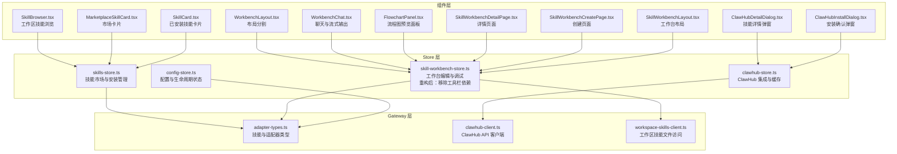
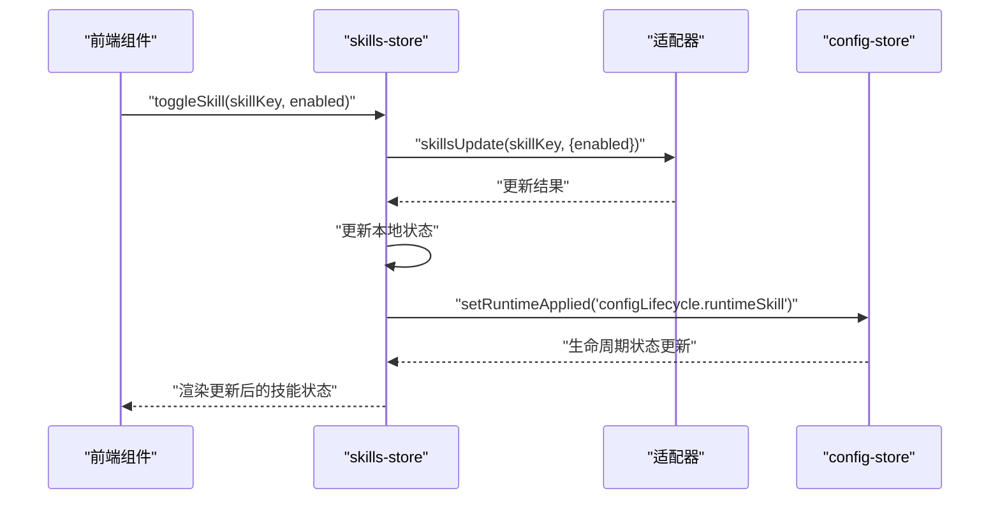
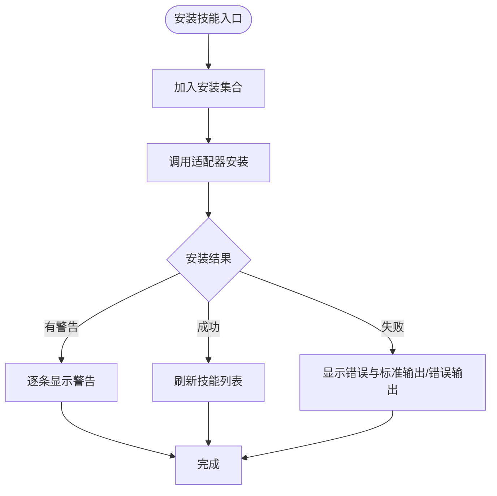
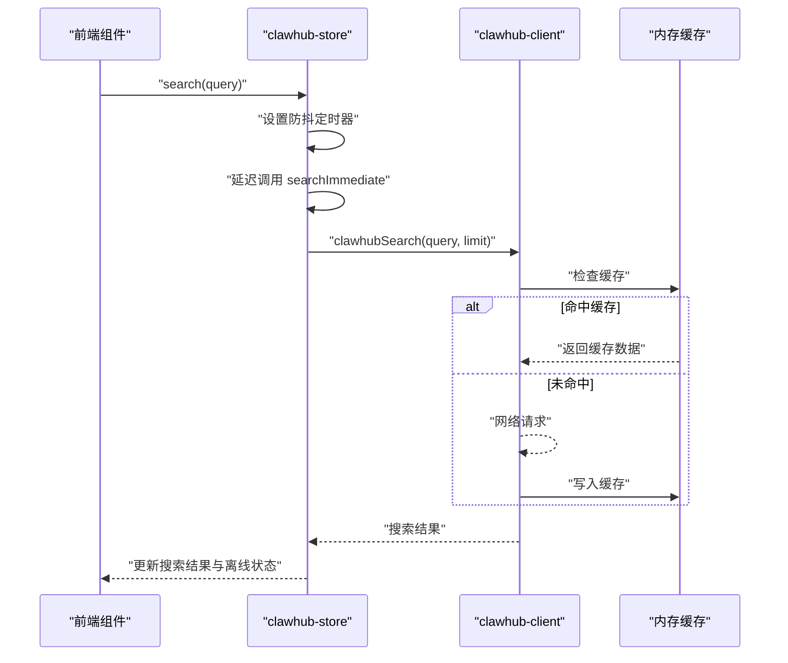
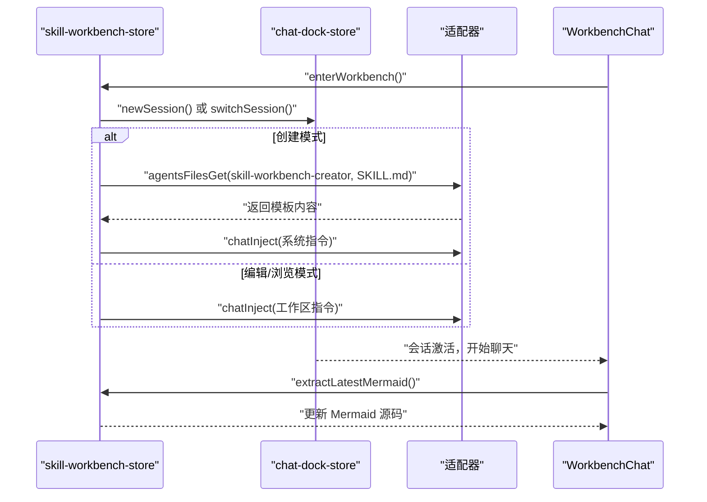
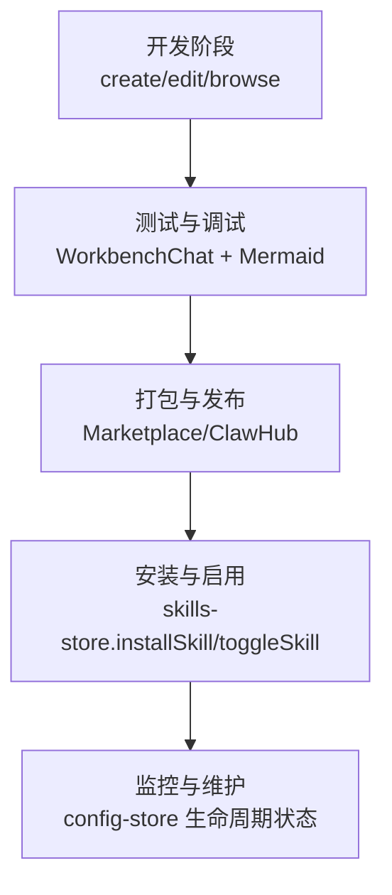
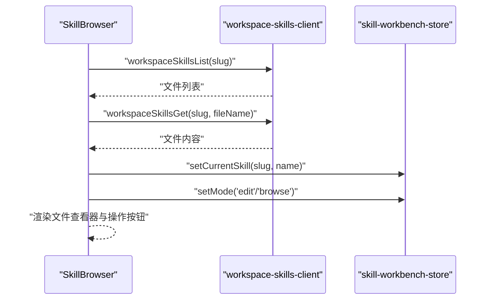
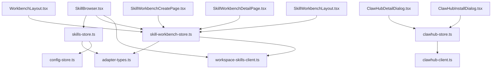

# 技能管理 Store

<cite>
**本文档引用的文件**
- [skills-store.ts](file://src/store/console-stores/skills-store.ts)
- [clawhub-store.ts](file://src/store/console-stores/clawhub-store.ts)
- [skill-workbench-store.ts](file://src/store/console-stores/skill-workbench-store.ts)
- [clawhub-client.ts](file://src/gateway/clawhub-client.ts)
- [adapter-types.ts](file://src/gateway/adapter-types.ts)
- [workspace-skills-client.ts](file://src/gateway/workspace-skills-client.ts)
- [SkillBrowser.tsx](file://src/components/console/skills/SkillBrowser.tsx)
- [ClawHubDetailDialog.tsx](file://src/components/console/skills/ClawHubDetailDialog.tsx)
- [ClawHubInstallDialog.tsx](file://src/components/console/skills/ClawHubInstallDialog.tsx)
- [MarketplaceSkillCard.tsx](file://src/components/console/skills/MarketplaceSkillCard.tsx)
- [SkillCard.tsx](file://src/components/console/skills/SkillCard.tsx)
- [WorkbenchLayout.tsx](file://src/components/console/skills/WorkbenchLayout.tsx)
- [WorkbenchChat.tsx](file://src/components/console/skills/WorkbenchChat.tsx)
- [FlowchartPanel.tsx](file://src/components/console/skills/FlowchartPanel.tsx)
- [SkillWorkbenchDetailPage.tsx](file://src/components/pages/SkillWorkbenchDetailPage.tsx)
- [SkillWorkbenchCreatePage.tsx](file://src/components/pages/SkillWorkbenchCreatePage.tsx)
- [SkillWorkbenchLayout.tsx](file://src/components/pages/SkillWorkbenchLayout.tsx)
- [config-store.ts](file://src/store/console-stores/config-store.ts)
</cite>

## 更新摘要
**所做更改**
- 更新技能工作台Store重构说明：移除对旧工具栏系统的依赖
- 增强工作台会话管理和模式切换功能
- 改进类型安全性和组件解耦
- 新增WorkbenchMode类型定义和会话管理机制
- 更新组件集成和用户交互流程

## 目录
1. [简介](#简介)
2. [项目结构](#项目结构)
3. [核心组件](#核心组件)
4. [架构概览](#架构概览)
5. [详细组件分析](#详细组件分析)
6. [依赖分析](#依赖分析)
7. [性能考虑](#性能考虑)
8. [故障排除指南](#故障排除指南)
9. [结论](#结论)
10. [附录](#附录)

## 简介
本文件为 OpenClaw-Office 项目中技能管理 Store 模块的综合技术文档。重点涵盖以下方面：
- skills-store：技能市场的浏览、搜索、安装与卸载管理，技能分类与来源过滤，以及技能启用/禁用控制。
- clawhub-store：ClawHub 平台集成、技能包搜索与详情展示、离线缓存与网络错误处理。
- skill-workbench-store：技能工作台的编辑、调试与测试环境管理，Mermaid 流程图解析与同步，**新增**：移除旧工具栏系统依赖，增强会话管理和模式切换功能。
- 技能数据模型：SkillInfo 接口定义、技能元数据结构、依赖关系与运行时状态。
- 技能生命周期：从开发到发布的完整流程、版本升级策略、兼容性检查。
- 性能监控、使用统计与错误诊断实现细节。
- 技能开发与调试最佳实践。

## 项目结构
技能管理 Store 模块位于 src/store/console-stores 目录下，配合 gateway 层的适配器客户端与前端组件共同构成完整的技能管理体系。



**图表来源**
- [skills-store.ts:1-168](file://src/store/console-stores/skills-store.ts#L1-L168)
- [clawhub-store.ts:1-135](file://src/store/console-stores/clawhub-store.ts#L1-L135)
- [skill-workbench-store.ts:1-296](file://src/store/console-stores/skill-workbench-store.ts#L1-L296)
- [adapter-types.ts:1-458](file://src/gateway/adapter-types.ts#L1-L458)
- [clawhub-client.ts:1-202](file://src/gateway/clawhub-client.ts#L1-L202)
- [workspace-skills-client.ts:1-27](file://src/gateway/workspace-skills-client.ts#L1-L27)

**章节来源**
- [skills-store.ts:1-168](file://src/store/console-stores/skills-store.ts#L1-L168)
- [clawhub-store.ts:1-135](file://src/store/console-stores/clawhub-store.ts#L1-L135)
- [skill-workbench-store.ts:1-296](file://src/store/console-stores/skill-workbench-store.ts#L1-L296)

## 核心组件
本节概述三个核心 Store 的职责与关键能力：

- skills-store
  - 负责技能状态获取、安装、启用/禁用、过滤与排序。
  - 提供安装进度跟踪与错误提示。
  - 通过适配器调用底层技能管理 API。

- clawhub-store
  - 提供 ClawHub 搜索、探索、详情获取与离线模式检测。
  - 实现防抖搜索、分页加载与缓存清理。
  - 区分网络错误与业务错误，支持离线模式提示。

- skill-workbench-store
  - **重构后**：移除对旧工具栏系统的依赖，增强工作台会话管理和模式切换功能。
  - 管理工作台模式（create/browse/edit）、会话上下文注入与自动消息发送。
  - 解析 Mermaid 图形代码并同步到工作台界面。
  - 维护文件树、选中文件与内容加载状态。
  - **新增**：WorkbenchMode 类型定义独立于UI组件，提高类型安全性。

**章节来源**
- [skills-store.ts:11-29](file://src/store/console-stores/skills-store.ts#L11-L29)
- [clawhub-store.ts:14-34](file://src/store/console-stores/clawhub-store.ts#L14-L34)
- [skill-workbench-store.ts:5-14](file://src/store/console-stores/skill-workbench-store.ts#L5-L14)
- [skill-workbench-store.ts:115-152](file://src/store/console-stores/skill-workbench-store.ts#L115-L152)

## 架构概览
技能管理模块采用分层架构：
- Store 层：集中管理状态与副作用，协调组件与网关层。
- Gateway 层：封装适配器与外部服务（ClawHub）交互。
- 组件层：负责 UI 渲染与用户交互，绑定 Store 状态。



**图表来源**
- [skills-store.ts:112-132](file://src/store/console-stores/skills-store.ts#L112-L132)
- [config-store.ts:177-186](file://src/store/console-stores/config-store.ts#L177-L186)

**章节来源**
- [skills-store.ts:84-132](file://src/store/console-stores/skills-store.ts#L84-L132)
- [config-store.ts:177-186](file://src/store/console-stores/config-store.ts#L177-L186)

## 详细组件分析

### skills-store：技能市场与安装管理
- 状态管理
  - 技能列表、加载状态、错误信息、活动标签页、来源过滤器、详情弹窗状态、安装集合。
- 关键方法
  - fetchSkills：等待适配器就绪后拉取技能状态。
  - toggleSkill：启用/禁用技能，成功后更新本地状态并触发配置生命周期状态变更。
  - installSkill：发起技能安装，跟踪安装中状态，处理成功/失败/警告反馈。
- 过滤与排序
  - 支持内置与市场来源过滤、名称/描述/标识符模糊匹配、优先级排序（启用优先、核心技能优先）。



**图表来源**
- [skills-store.ts:134-166](file://src/store/console-stores/skills-store.ts#L134-L166)

**章节来源**
- [skills-store.ts:84-167](file://src/store/console-stores/skills-store.ts#L84-L167)

### clawhub-store：ClawHub 集成与缓存
- 功能特性
  - 搜索：带防抖的异步搜索，区分空查询与无效查询。
  - 探索：分页加载，支持游标续载。
  - 详情：按 slug 获取技能详情，支持缓存。
  - 离线模式：基于网络错误码判断离线状态。
- 缓存与限流
  - 内存缓存：探索与详情分别设置 TTL。
  - 速率限制：统一冷却时间，避免频繁请求。



**图表来源**
- [clawhub-store.ts:51-85](file://src/store/console-stores/clawhub-store.ts#L51-L85)
- [clawhub-client.ts:153-159](file://src/gateway/clawhub-client.ts#L153-L159)
- [clawhub-client.ts:164-186](file://src/gateway/clawhub-client.ts#L164-L186)

**章节来源**
- [clawhub-store.ts:38-134](file://src/store/console-stores/clawhub-store.ts#L38-L134)
- [clawhub-client.ts:76-202](file://src/gateway/clawhub-client.ts#L76-L202)

### skill-workbench-store：工作台编辑与调试（重构后）
**更新** 移除了对旧工具栏系统的依赖，增强了会话管理和模式切换功能，改进了类型安全性和组件解耦。

- **重构亮点**
  - WorkbenchMode 类型定义从 UI 组件迁移到 Store，实现模式与 UI 解耦。
  - 增强的会话管理：保存原始会话键，确保离开工作台时能正确恢复。
  - 自动消息发送机制：支持一键流程图生成功能。
  - 改进的类型安全性：明确的接口定义和类型约束。

- 模式管理
  - create：创建新会话并注入技能创建框架上下文。
  - edit/browse：切换到指定技能的工作会话，注入工作区路径与操作指引。
- Mermaid 同步
  - 从聊天消息与流式内容中提取最新 Mermaid 代码块，自动同步到工作台。
- 文件系统集成
  - 通过 workspace-skills-client 访问工作区技能文件，支持文件树与内容读取。
- 会话管理
  - 保存原始会话键，在离开工作台时恢复上下文。
  - **新增**：pendingAutoSendMessage 机制，支持自动消息发送。



**图表来源**
- [skill-workbench-store.ts:190-258](file://src/store/console-stores/skill-workbench-store.ts#L190-L258)
- [skill-workbench-store.ts:278-295](file://src/store/console-stores/skill-workbench-store.ts#L278-L295)

**章节来源**
- [skill-workbench-store.ts:5-14](file://src/store/console-stores/skill-workbench-store.ts#L5-L14)
- [skill-workbench-store.ts:115-152](file://src/store/console-stores/skill-workbench-store.ts#L115-L152)
- [skill-workbench-store.ts:190-273](file://src/store/console-stores/skill-workbench-store.ts#L190-L273)

### 技能数据模型：SkillInfo 与相关类型
- SkillInfo 字段
  - 标识与元数据：id、slug、name、description、icon、version、author、homepage。
  - 来源与属性：isCore、isBundled、source、primaryEnv、always、eligible、blockedByAllowlist。
  - 运行时状态：enabled、config、configChecks。
  - 依赖与需求：requirements（binaries/env）、missing（缺失项）。
  - 安装选项：installOptions。
- 安装结果：包含成功/失败标志、输出流与警告数组。
- 适配器类型：统一了技能与聊天等领域的数据契约。

```mermaid
classDiagram
class SkillInfo {
+string id
+string slug
+string name
+string description
+string icon
+string version
+boolean enabled
+boolean isCore
+boolean isBundled
+string source
+string homepage
+Record~string, unknown~ config
+ConfigCheck[] configChecks
+Requirements requirements
+Missing missing
+InstallOption[] installOptions
}
class SkillInstallResult {
+boolean ok
+string message
+string stdout
+string stderr
+number code
+string[] warnings
}
class Requirements {
+string[] bins
+string[] env
}
class Missing {
+string[] bins
+string[] env
}
class ConfigCheck {
+string path
+boolean satisfied
}
class InstallOption {
+string id
+string kind
+string label
}
SkillInfo --> Requirements : "依赖需求"
SkillInfo --> Missing : "缺失项"
SkillInfo --> ConfigCheck : "配置检查"
SkillInfo --> InstallOption : "安装选项"
SkillInstallResult --> "被安装流程使用"
```

**图表来源**
- [adapter-types.ts:35-57](file://src/gateway/adapter-types.ts#L35-L57)
- [adapter-types.ts:259-266](file://src/gateway/adapter-types.ts#L259-L266)

**章节来源**
- [adapter-types.ts:35-57](file://src/gateway/adapter-types.ts#L35-L57)
- [adapter-types.ts:259-266](file://src/gateway/adapter-types.ts#L259-L266)

### 技能生命周期：从开发到发布
- 开发生命周期
  - 工作台模式：create/edit/browse，结合聊天与文件系统进行技能开发与调试。
  - Mermaid 流程图：自动生成与复用，确保流程可视化与一致性。
  - **重构后**：增强的一键流程图生成功能，通过 pendingAutoSendMessage 机制实现。
- 发布与版本管理
  - MarketPlace 卡片：展示版本、作者、主页链接与安装状态。
  - ClawHub 集成：通过搜索、详情与安装命令进行技能分发。
- 版本升级与兼容性
  - 通过技能元数据与依赖检查字段评估兼容性。
  - 安装选项与警告提示帮助用户识别潜在问题。



**图表来源**
- [skill-workbench-store.ts:190-258](file://src/store/console-stores/skill-workbench-store.ts#L190-L258)
- [skills-store.ts:134-166](file://src/store/console-stores/skills-store.ts#L134-L166)
- [config-store.ts:177-186](file://src/store/console-stores/config-store.ts#L177-L186)

**章节来源**
- [MarketplaceSkillCard.tsx:1-100](file://src/components/console/skills/MarketplaceSkillCard.tsx#L1-L100)
- [SkillCard.tsx:1-105](file://src/components/console/skills/SkillCard.tsx#L1-L105)

### 组件集成与用户交互（重构后）
**更新** 移除了对旧工具栏系统的依赖，增强了组件间的解耦和会话管理。

- 技能浏览器
  - 过滤与选择：按名称/描述/标识符筛选，加载文件树与内容。
  - 流程图生成：一键生成并保存 FLOWCHART.md。
- 市场与详情
  - 市场卡片：展示技能信息与安装按钮。
  - 详情弹窗：展示评分、下载量、版本变更日志与安装入口。
  - 安装确认：提供命令复制与安全提示。
- **新增**：WorkbenchLayout 组件提供灵活的左右布局分割，支持拖拽调整比例。
- **新增**：SkillWorkbenchLayout 提供路由级别的工作台包装，确保会话正确恢复。



**图表来源**
- [SkillBrowser.tsx:59-125](file://src/components/console/skills/SkillBrowser.tsx#L59-L125)
- [workspace-skills-client.ts:19-27](file://src/gateway/workspace-skills-client.ts#L19-L27)

**章节来源**
- [SkillBrowser.tsx:22-259](file://src/components/console/skills/SkillBrowser.tsx#L22-L259)
- [ClawHubDetailDialog.tsx:13-149](file://src/components/console/skills/ClawHubDetailDialog.tsx#L13-L149)
- [ClawHubInstallDialog.tsx:13-100](file://src/components/console/skills/ClawHubInstallDialog.tsx#L13-L100)
- [WorkbenchLayout.tsx:1-63](file://src/components/console/skills/WorkbenchLayout.tsx#L1-L63)
- [SkillWorkbenchLayout.tsx:1-28](file://src/components/pages/SkillWorkbenchLayout.tsx#L1-L28)

## 依赖分析
- 组件耦合
  - skills-store 与 adapter-types 强耦合，通过适配器抽象隔离底层实现。
  - skill-workbench-store 依赖 chat-dock-store 与适配器注入系统上下文。
  - **重构后**：WorkbenchMode 类型独立于 UI 组件，降低耦合度。
  - clawhub-store 依赖 clawhub-client 的缓存与错误处理。
- 外部依赖
  - zustand：轻量状态管理库。
  - fetch：ClawHub API 请求与工作区文件访问。
  - react hooks：useChatStreamingText 等用于流式内容处理。



**图表来源**
- [skills-store.ts:1-8](file://src/store/console-stores/skills-store.ts#L1-L8)
- [clawhub-store.ts:1-12](file://src/store/console-stores/clawhub-store.ts#L1-L12)
- [skill-workbench-store.ts:1-8](file://src/store/console-stores/skill-workbench-store.ts#L1-L8)
- [adapter-types.ts:1-458](file://src/gateway/adapter-types.ts#L1-L458)
- [clawhub-client.ts:1-202](file://src/gateway/clawhub-client.ts#L1-L202)
- [workspace-skills-client.ts:1-27](file://src/gateway/workspace-skills-client.ts#L1-L27)

**章节来源**
- [skills-store.ts:1-8](file://src/store/console-stores/skills-store.ts#L1-L8)
- [clawhub-store.ts:1-12](file://src/store/console-stores/clawhub-store.ts#L1-L12)
- [skill-workbench-store.ts:1-8](file://src/store/console-stores/skill-workbench-store.ts#L1-L8)

## 性能考虑
- 搜索防抖：clawhub-store 对搜索输入进行 300ms 防抖，减少网络请求频率。
- 缓存策略：探索与详情分别设置短/长 TTL，降低重复请求成本。
- 安装状态去重：installing 集合避免同一技能并发安装导致的状态混乱。
- 流式渲染：WorkbenchChat 使用自动滚动与增量渲染优化用户体验。
- 依赖检查：在 UI 中提前提示缺失依赖，减少运行时失败概率。
- **重构后优化**：会话管理优化，避免重复创建会话，提高响应速度。

## 故障排除指南
- 安装失败
  - 检查 stdout/stderr 输出与 warnings 列表，定位具体错误原因。
  - 若出现网络错误，ClawHub 错误码为 0 时进入离线模式。
- 启用/禁用失败
  - 查看错误信息并确认技能是否受保护（核心技能 always 为真）。
  - 触发配置生命周期状态变更以反映运行时生效。
- Mermaid 解析失败
  - 确认聊天响应中包含合法的 Mermaid 代码块，或使用 plain 格式声明。
  - 检查文件内容是否包含 YAML frontmatter，必要时进行剥离处理。
- 缓存问题
  - 使用 clearClawHubCache 清理缓存，重新加载数据。
  - 检查速率限制冷却时间，避免频繁请求触发 429。
- **重构后问题**：会话恢复失败
  - 检查 savedSessionKey 是否正确保存。
  - 确认 leaveWorkbench() 调用时机，确保在组件卸载时正确恢复会话。

**章节来源**
- [skills-store.ts:134-166](file://src/store/console-stores/skills-store.ts#L134-L166)
- [clawhub-store.ts:76-84](file://src/store/console-stores/clawhub-store.ts#L76-L84)
- [clawhub-client.ts:138-146](file://src/gateway/clawhub-client.ts#L138-L146)
- [skill-workbench-store.ts:44-71](file://src/store/console-stores/skill-workbench-store.ts#L44-L71)
- [skill-workbench-store.ts:260-266](file://src/store/console-stores/skill-workbench-store.ts#L260-L266)

## 结论
技能管理 Store 模块通过清晰的分层设计与强类型约束，实现了从技能浏览、安装、启用到工作台编辑与调试的完整闭环。**重构后的 skill-workbench-store 移除了对旧工具栏系统的依赖，增强了会话管理和模式切换功能，改进了类型安全性和组件解耦**。ClawHub 集成提供了强大的生态支持，而本地缓存与防抖策略有效提升了用户体验。建议在后续迭代中进一步完善性能监控与错误诊断指标，以支撑更大规模的技能生态。

## 附录

### 技能开发与调试最佳实践
- 使用工作台模式
  - create：首次创建技能时注入标准化框架上下文。
  - edit/browse：针对现有技能进行流程图与说明的迭代。
  - **重构后**：利用增强的会话管理，确保工作台状态正确恢复。
- Mermaid 流程图
  - 优先复用现有 FLOWCHART.md，最小化修改范围。
  - 将流程图作为技能文档的一部分，便于团队协作与知识沉淀。
  - **新增**：利用一键流程图生成功能，提高开发效率。
- 依赖与兼容性
  - 在安装前检查 requirements 与 missing 字段，提前解决缺失项。
  - 通过 configChecks 验证配置有效性，避免运行时异常。
- 版本管理
  - 严格遵循语义化版本，利用 ClawHub 的版本与变更日志进行追踪。
  - 在 Marketplace 卡片中准确填写版本与作者信息，提升可信度。
- **重构后最佳实践**
  - 利用 WorkbenchMode 类型约束，确保模式切换的类型安全。
  - 使用 SkillWorkbenchLayout 确保会话正确恢复。
  - 通过 pendingAutoSendMessage 实现自动化工作流。