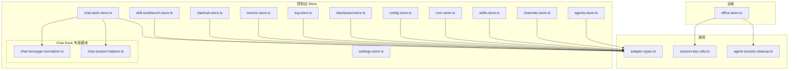
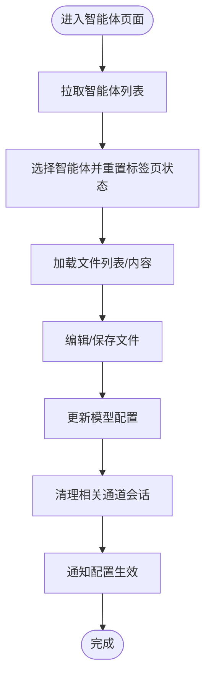
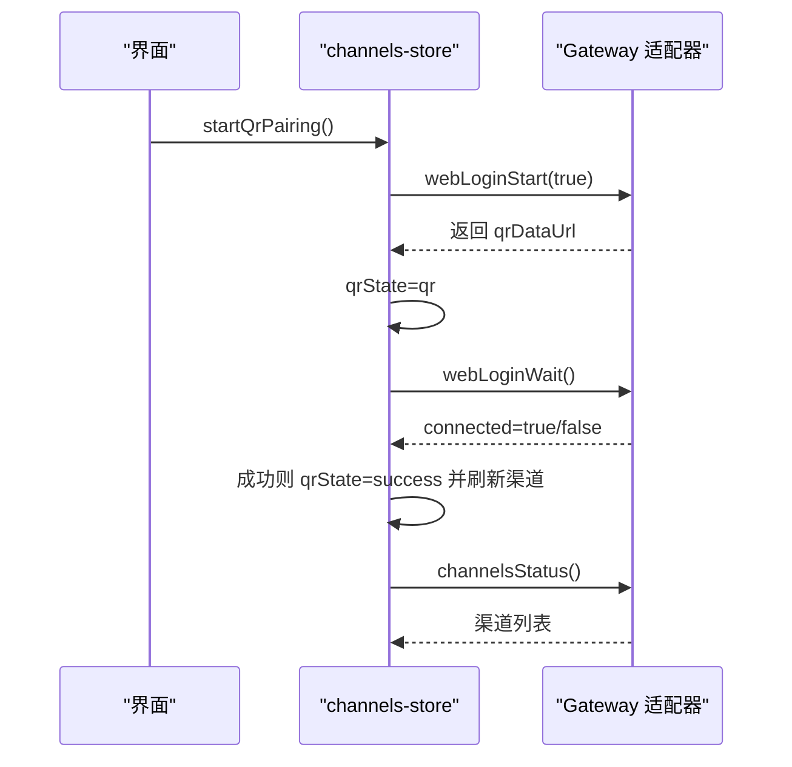
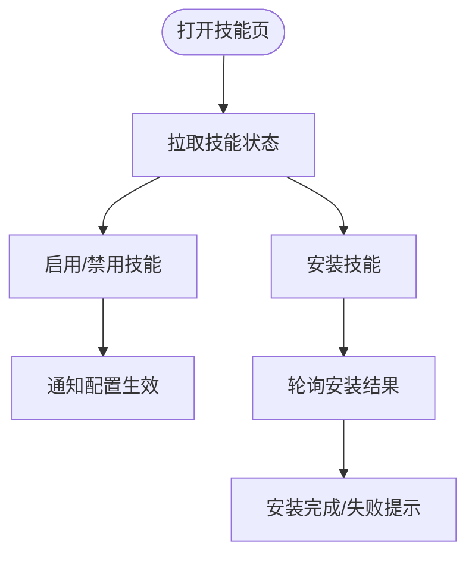
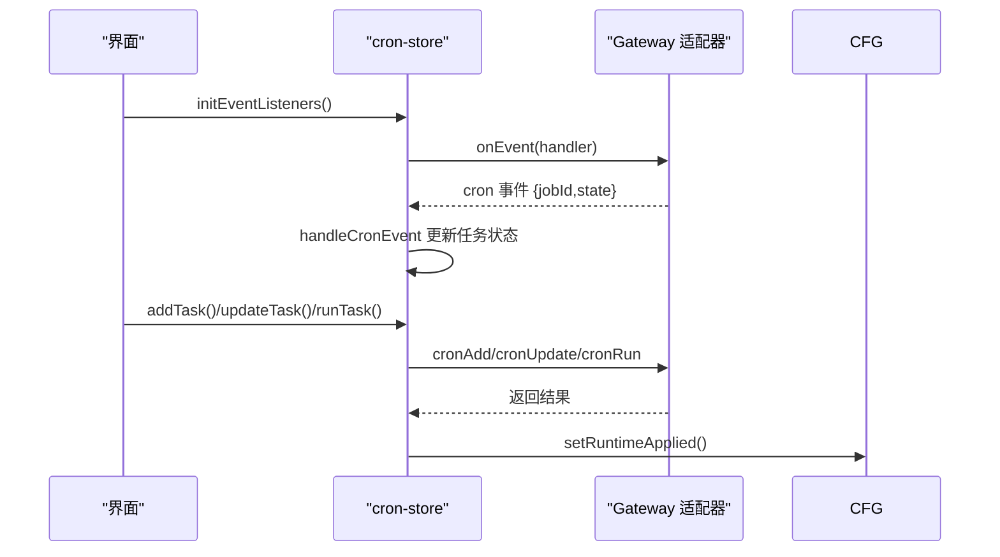
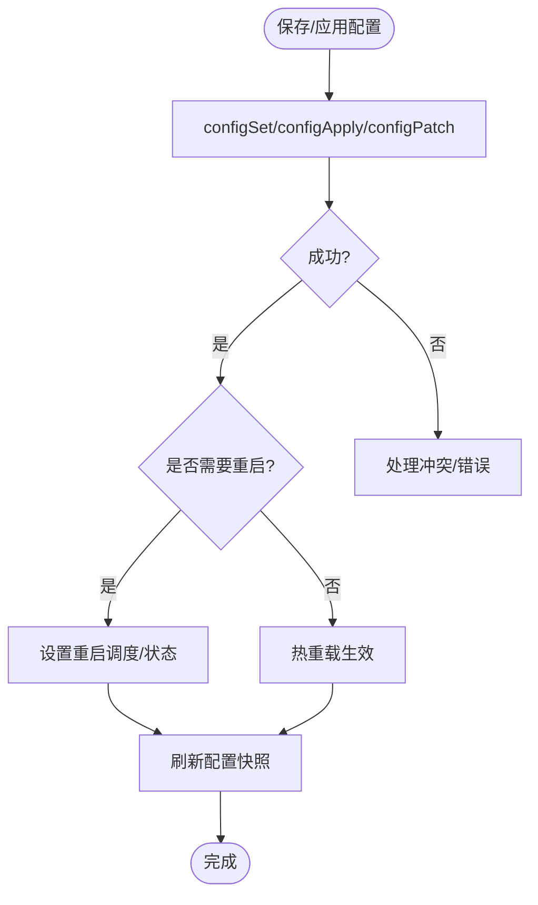
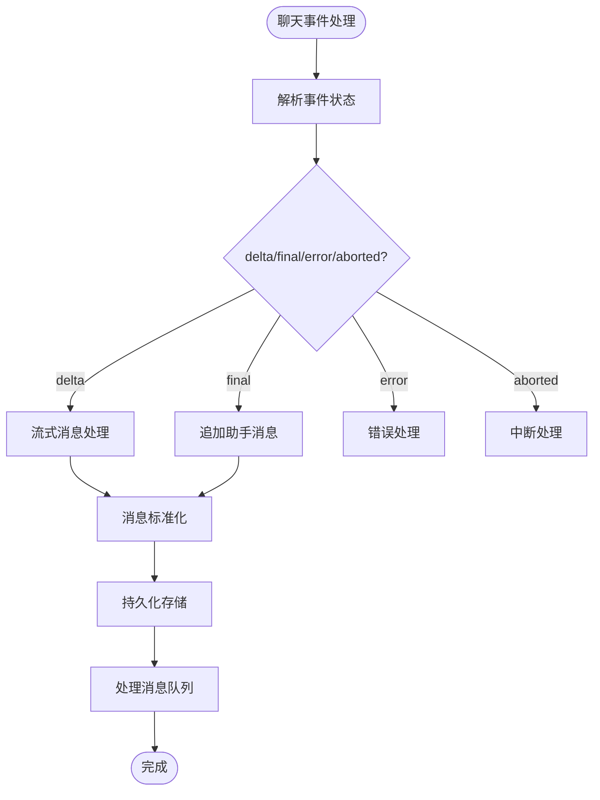
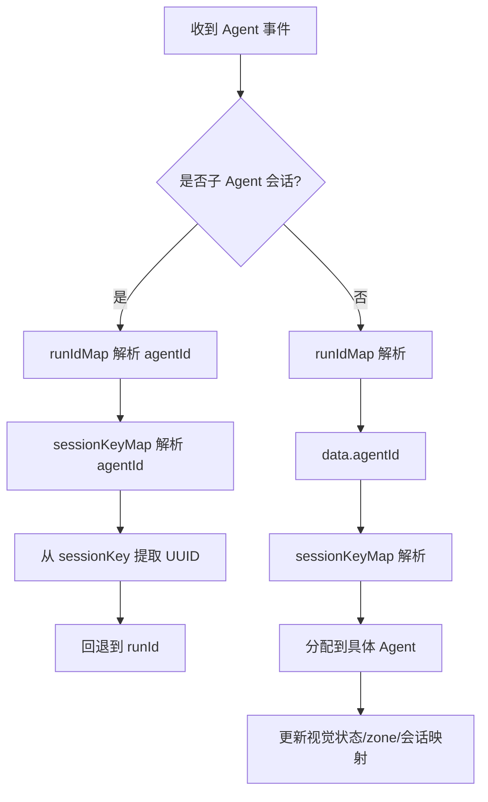
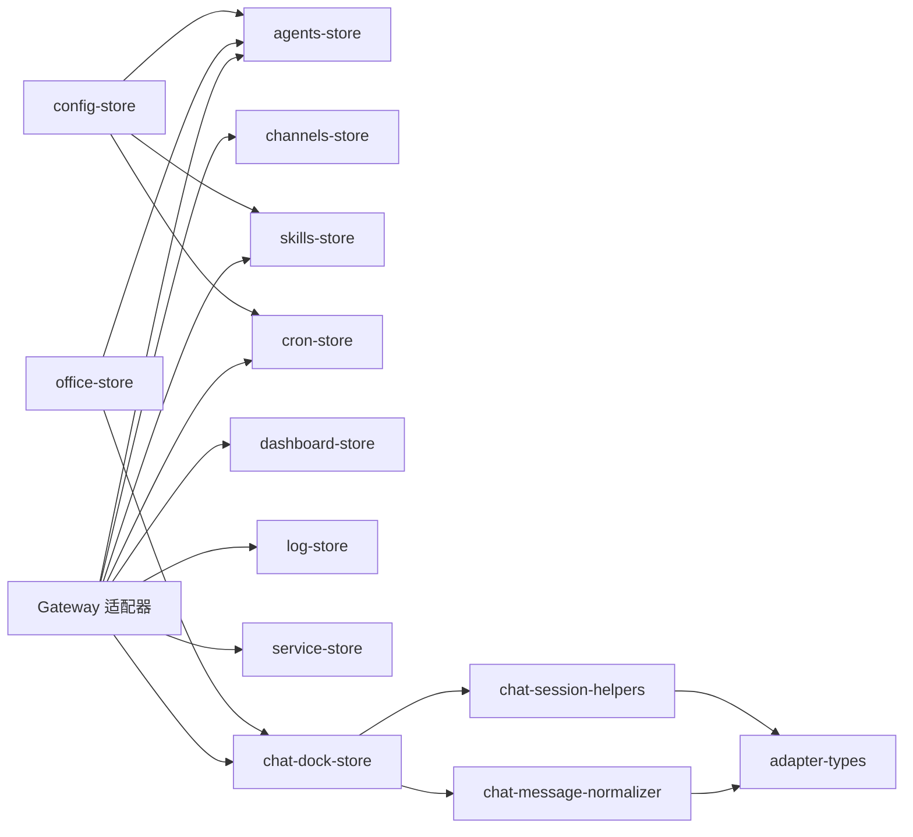

# 控制台 Store 系统

<cite>
**本文引用的文件**
- [agents-store.ts](file://src/store/console-stores/agents-store.ts)
- [channels-store.ts](file://src/store/console-stores/channels-store.ts)
- [skills-store.ts](file://src/store/console-stores/skills-store.ts)
- [cron-store.ts](file://src/store/console-stores/cron-store.ts)
- [config-store.ts](file://src/store/console-stores/config-store.ts)
- [dashboard-store.ts](file://src/store/console-stores/dashboard-store.ts)
- [log-store.ts](file://src/store/console-stores/log-store.ts)
- [service-store.ts](file://src/store/console-stores/service-store.ts)
- [settings-store.ts](file://src/store/console-stores/settings-store.ts)
- [clawhub-store.ts](file://src/store/console-stores/clawhub-store.ts)
- [skill-workbench-store.ts](file://src/store/console-stores/skill-workbench-store.ts)
- [chat-dock-store.ts](file://src/store/console-stores/chat-dock-store.ts)
- [chat-message-normalizer.ts](file://src/store/console-stores/chat-message-normalizer.ts)
- [chat-session-helpers.ts](file://src/store/console-stores/chat-session-helpers.ts)
- [office-store.ts](file://src/store/office-store.ts)
- [session-key-utils.ts](file://src/lib/session-key-utils.ts)
- [agent-session-cleanup.ts](file://src/store/console-stores/agent-session-cleanup.ts)
- [adapter-types.ts](file://src/gateway/adapter-types.ts)
</cite>

## 更新摘要
**变更内容**
- Chat Dock Store 从单一文件重构为模块化架构
- 新增 chat-message-normalizer.ts 专用模块，负责消息标准化处理
- 新增 chat-session-helpers.ts 专用模块，负责会话管理辅助函数
- 提高代码可维护性和可测试性，分离关注点

## 目录
1. [简介](#简介)
2. [项目结构](#项目结构)
3. [核心组件](#核心组件)
4. [架构总览](#架构总览)
5. [详细组件分析](#详细组件分析)
6. [依赖关系分析](#依赖关系分析)
7. [性能考量](#性能考量)
8. [故障排查指南](#故障排查指南)
9. [结论](#结论)
10. [附录](#附录)

## 简介
本文件系统化梳理控制台 Store 系统，聚焦四大控制台 Store 模块：agents-store（智能体）、channels-store（通信渠道）、skills-store（技能市场与工作台）、cron-store（定时任务）。文档覆盖职责分工、数据流与事件路由、状态初始化与依赖注入、异步操作与错误处理、扩展性与性能监控、调试工具使用等主题，帮助开发者快速理解并高效维护该系统。

**更新** Chat Dock Store 已重构为模块化架构，将消息处理和会话管理功能分离到专用模块中，提高了代码的可维护性和可测试性。

## 项目结构
控制台 Store 采用按功能域划分的模块化组织方式，每个 Store 使用 Zustand 管理自身状态与副作用，统一通过 Gateway 适配器访问后端能力。核心 Store 位于 src/store/console-stores，另有 office-store 等全局状态 Store 与通用工具库。



**图表来源**
- [chat-dock-store.ts:18-40](file://src/store/console-stores/chat-dock-store.ts#L18-L40)
- [chat-message-normalizer.ts:1-261](file://src/store/console-stores/chat-message-normalizer.ts#L1-L261)
- [chat-session-helpers.ts:1-150](file://src/store/console-stores/chat-session-helpers.ts#L1-L150)

**章节来源**
- [agents-store.ts:1-642](file://src/store/console-stores/agents-store.ts#L1-L642)
- [channels-store.ts:1-104](file://src/store/console-stores/channels-store.ts#L1-L104)
- [skills-store.ts:1-168](file://src/store/console-stores/skills-store.ts#L1-L168)
- [cron-store.ts:1-125](file://src/store/console-stores/cron-store.ts#L1-L125)
- [config-store.ts:1-420](file://src/store/console-stores/config-store.ts#L1-L420)
- [dashboard-store.ts:1-55](file://src/store/console-stores/dashboard-store.ts#L1-L55)
- [log-store.ts:1-108](file://src/store/console-stores/log-store.ts#L1-L108)
- [service-store.ts:1-205](file://src/store/console-stores/service-store.ts#L1-L205)
- [settings-store.ts:1-51](file://src/store/console-stores/settings-store.ts#L1-L51)
- [clawhub-store.ts:1-135](file://src/store/console-stores/clawhub-store.ts#L1-L135)
- [skill-workbench-store.ts:1-247](file://src/store/console-stores/skill-workbench-store.ts#L1-L247)
- [chat-dock-store.ts:1-1325](file://src/store/console-stores/chat-dock-store.ts#L1-L1325)
- [chat-message-normalizer.ts:1-261](file://src/store/console-stores/chat-message-normalizer.ts#L1-L261)
- [chat-session-helpers.ts:1-150](file://src/store/console-stores/chat-session-helpers.ts#L1-L150)
- [office-store.ts:1-800](file://src/store/office-store.ts#L1-L800)
- [session-key-utils.ts:1-54](file://src/lib/session-key-utils.ts#L1-L54)
- [agent-session-cleanup.ts:1-53](file://src/store/console-stores/agent-session-cleanup.ts#L1-L53)
- [adapter-types.ts:1-200](file://src/gateway/adapter-types.ts#L1-L200)

## 核心组件
- agents-store：管理智能体列表、详情、模型配置、工具/技能/渠道/定时任务子标签页，提供创建、更新、删除智能体及文件读写等操作。
- channels-store：管理通信渠道状态、配置与二维码登录流程。
- skills-store：管理技能市场与已安装技能，支持启用/禁用、安装、过滤与搜索。
- cron-store：管理全局定时任务，支持增删改查、立即运行、事件监听与生命周期提示。
- config-store：集中管理配置快照、校验、保存/应用、重启调度与生命周期状态。
- dashboard-store：聚合渠道、技能、用量等概览信息。
- log-store：日志轮询与跟随模式，带暂停/恢复与错误处理。
- service-store：平台服务状态检查与启停/重启/安装/卸载。
- settings-store：主题、语言、开发模式偏好持久化。
- clawhub-store：ClawHub 技能市场搜索、探索与离线模式处理。
- skill-workbench-store：技能工作台模式切换、会话隔离与上下文注入。
- chat-dock-store：聊天面板消息队列、历史加载、事件处理与附件管理。**更新**现已模块化，分离消息处理和会话管理功能。
- office-store：全局办公态（Agent 视觉化、zone 迁移、runIdMap/sessionKeyMap 事件路由）。

**更新** chat-dock-store 现已重构为模块化架构：
- chat-message-normalizer.ts：负责消息标准化、附件处理、工具调用重建等功能
- chat-session-helpers.ts：负责会话键构建、会话选择、会话持久化等辅助功能

**章节来源**
- [agents-store.ts:1-642](file://src/store/console-stores/agents-store.ts#L1-L642)
- [channels-store.ts:1-104](file://src/store/console-stores/channels-store.ts#L1-L104)
- [skills-store.ts:1-168](file://src/store/console-stores/skills-store.ts#L1-L168)
- [cron-store.ts:1-125](file://src/store/console-stores/cron-store.ts#L1-L125)
- [config-store.ts:1-420](file://src/store/console-stores/config-store.ts#L1-L420)
- [dashboard-store.ts:1-55](file://src/store/console-stores/dashboard-store.ts#L1-L55)
- [log-store.ts:1-108](file://src/store/console-stores/log-store.ts#L1-L108)
- [service-store.ts:1-205](file://src/store/console-stores/service-store.ts#L1-L205)
- [settings-store.ts:1-51](file://src/store/console-stores/settings-store.ts#L1-L51)
- [clawhub-store.ts:1-135](file://src/store/console-stores/clawhub-store.ts#L1-L135)
- [skill-workbench-store.ts:1-247](file://src/store/console-stores/skill-workbench-store.ts#L1-L247)
- [chat-dock-store.ts:1-1325](file://src/store/console-stores/chat-dock-store.ts#L1-L1325)
- [chat-message-normalizer.ts:1-261](file://src/store/console-stores/chat-message-normalizer.ts#L1-L261)
- [chat-session-helpers.ts:1-150](file://src/store/console-stores/chat-session-helpers.ts#L1-L150)
- [office-store.ts:1-800](file://src/store/office-store.ts#L1-L800)

## 架构总览
控制台 Store 以 Zustand 为核心，围绕 Gateway 适配器进行数据与事件交互。各 Store 通过 create 方法声明状态与动作，内部通过 waitForAdapter/getAdapter 获取适配器实例，统一调用 agents/*、channels/*、skills/*、cron/* 等接口。全局 office-store 维护 runIdMap 与 sessionKeyMap，用于事件路由与跨 Agent 协作。

```mermaid
sequenceDiagram
participant UI as "界面组件"
participant AS as "agents-store"
participant CS as "channels-store"
participant SLS as "skills-store"
participant CRON as "cron-store"
participant CFG as "config-store"
participant CHAT as "chat-dock-store"
participant CMN as "chat-message-normalizer"
participant CSH as "chat-session-helpers"
participant ADP as "Gateway 适配器"
participant OFF as "office-store"
UI->>AS : 调用 fetchAgents()/updateAgentModel()
AS->>ADP : agentsList()/configPatch(...)
ADP-->>AS : 返回结果
AS->>CFG : setRuntimeApplied()/setLifecycleFromWriteResult()
CFG-->>UI : 生命周期状态变更
UI->>CS : fetchChannels()/startQrPairing()
CS->>ADP : channelsStatus()/webLoginStart()/webLoginWait()
ADP-->>CS : 返回结果
CS-->>UI : 渲染渠道状态
UI->>SLS : fetchSkills()/toggleSkill()
SLS->>ADP : skillsStatus()/skillsUpdate()
ADP-->>SLS : 返回结果
SLS->>CFG : setRuntimeApplied()
UI->>CRON : fetchTasks()/addTask()/runTask()
CRON->>ADP : cronList()/cronAdd()/cronRun()
ADP-->>CRON : 返回结果
CRON->>CFG : setRuntimeApplied()
UI->>CHAT : sendMessage()/handleChatEvent()
CHAT->>CMN : normalizeHistoryMessages()/appendAssistantSegment()
CHAT->>CSH : buildSessionKey()/resolveSessionAgentId()
CHAT->>ADP : chatSend()/chatHistory()/sessionsList()
ADP-->>CHAT : 返回结果
CHAT->>CFG : setRuntimeApplied()
OFF->>OFF : 处理 Agent 事件<br/>解析 runIdMap/sessionKeyMap
OFF-->>UI : 更新视觉 Agent 与 zone
```

**图表来源**
- [chat-dock-store.ts:18-40](file://src/store/console-stores/chat-dock-store.ts#L18-L40)
- [chat-message-normalizer.ts:170-182](file://src/store/console-stores/chat-message-normalizer.ts#L170-L182)
- [chat-session-helpers.ts:40-55](file://src/store/console-stores/chat-session-helpers.ts#L40-L55)

## 详细组件分析

### agents-store（智能体）
- 职责：智能体列表、默认智能体、选中智能体、搜索；文件读写；模型配置；工具/技能/渠道/定时任务子标签页；创建/更新/删除智能体。
- 关键状态：agents、defaultAgentId、selectedAgentId、activeTab、searchQuery、files、agentModelConfigs、agentTools、agentSkills、agentChannels、agentCronJobs。
- 异步操作：waitForAdapter 后调用 agentsList、agentsFilesList/Get/Set、skillsStatus、channelsStatus、cronList 等；模型更新通过 patchAgentModelConfig 并联动清理相关会话。
- 错误处理：捕获异常并设置 error/isLoading；文件读写失败时回退为空内容。
- 依赖注入：依赖 config-store 的生命周期提示；依赖 agent-session-cleanup 清理会话。



**章节来源**
- [agents-store.ts:1-642](file://src/store/console-stores/agents-store.ts#L1-L642)
- [agent-session-cleanup.ts:1-53](file://src/store/console-stores/agent-session-cleanup.ts#L1-L53)
- [config-store.ts:1-420](file://src/store/console-stores/config-store.ts#L1-L420)

### channels-store（通信渠道）
- 职责：渠道状态展示、登出、配置弹窗、二维码配对（webLoginStart/webLoginWait）。
- 关键状态：channels、isLoading、error、selectedChannel、configDialogOpen、qrState、qrDataUrl、qrError。
- 异步操作：channelsStatus、channelsLogout；QR 登录流程 startQrPairing/cancelQrPairing。
- 错误处理：网络异常时设置 error；QR 流程中根据连接结果切换状态。



**章节来源**
- [channels-store.ts:1-104](file://src/store/console-stores/channels-store.ts#L1-L104)

### skills-store（技能市场与工作台）
- 职责：技能状态、启用/禁用、安装、过滤与搜索；内置/市场来源筛选；安装进度提示。
- 关键状态：skills、isLoading、error、activeTab、sourceFilter、selectedSkill、detailDialogOpen、installing。
- 异步操作：skillsStatus、skillsUpdate、skillsInstall；安装成功后重新拉取技能列表。
- 错误处理：安装失败/警告通过 toast 展示；toggle 失败记录 error 并提示。



**章节来源**
- [skills-store.ts:1-168](file://src/store/console-stores/skills-store.ts#L1-L168)

### cron-store（定时任务）
- 职责：全局定时任务管理；对话框状态；事件监听；运行/更新/删除/立即执行。
- 关键状态：tasks、isLoading、error、dialogOpen、editingTask。
- 异步操作：cronList/add/update/remove/run；initEventListeners 订阅 cron 事件并更新任务状态。
- 错误处理：操作失败设置 error；事件处理忽略无效 jobId/state。



**章节来源**
- [cron-store.ts:1-125](file://src/store/console-stores/cron-store.ts#L1-L125)
- [config-store.ts:1-420](file://src/store/console-stores/config-store.ts#L1-L420)

### config-store（配置与生命周期）
- 职责：配置快照、schema、状态、更新、重启调度；生命周期状态机（保存/应用/重启/断开/重连/完成）。
- 关键状态：config/hash/path/raw/valid、schemaHints、status/statusLoading/error、updateResult/updateLoading、catalogModels、restartState、lifecycleState。
- 异步操作：configGet/set/apply/patch、configSchema、statusSummary、modelsList、updateRun。
- 生命周期：setLifecycleFromWriteResult 根据 restart.scheduled 决定"热重载/需重启/CLI重启"；setRuntimeApplied 标记"即时生效"。



**章节来源**
- [config-store.ts:1-420](file://src/store/console-stores/config-store.ts#L1-L420)

### dashboard-store（仪表盘）
- 职责：并发拉取渠道、技能、用量概览，汇总错误。
- 异步操作：Promise.allSettled 并发调用 channelsStatus/skillsStatus/usageStatus。

**章节来源**
- [dashboard-store.ts:1-55](file://src/store/console-stores/dashboard-store.ts#L1-L55)

### log-store（日志）
- 职责：tail 日志、游标滚动、自动跟随、暂停/恢复、清空。
- 异步操作：logsTail 定时轮询；visibilitychange 自动暂停/恢复。
- 性能：最大行数限制与批量追加，避免内存膨胀。

**章节来源**
- [log-store.ts:1-108](file://src/store/console-stores/log-store.ts#L1-L108)

### service-store（平台服务）
- 职责：平台可用性检测、服务状态查询、启停/重启/安装/卸载、自动启动。
- 异步操作：checkAvailable、getServiceStatus、start/stop/restart/install/uninstall。
- 重试：autoStartGateway 最多重试 3 次，间隔 3 秒。

**章节来源**
- [service-store.ts:1-205](file://src/store/console-stores/service-store.ts#L1-L205)

### settings-store（设置）
- 职责：主题、语言、开发模式偏好本地持久化。
- 存储：localStorage 键值读写。

**章节来源**
- [settings-store.ts:1-51](file://src/store/console-stores/settings-store.ts#L1-L51)

### clawhub-store（ClawHub 市场）
- 职责：搜索、探索、详情、离线模式；防抖搜索。
- 异步操作：clawhubSearch/clawhubExplore/clawhubSkillDetail；网络错误标记 offlineMode。

**章节来源**
- [clawhub-store.ts:1-135](file://src/store/console-stores/clawhub-store.ts#L1-L135)

### skill-workbench-store（技能工作台）
- 职责：工作台模式切换、会话隔离、上下文注入、Mermaid 提取。
- 会话策略：根据当前 Agent 生成独立会话 key，离开时恢复原会话；可注入系统提示。

**章节来源**
- [skill-workbench-store.ts:1-247](file://src/store/console-stores/skill-workbench-store.ts#L1-L247)

### chat-dock-store（聊天面板）
- 职责：消息队列、历史加载、事件处理、附件管理、导出。
- 事件处理：applyChatEventToRuntime 解析 delta/final/error/aborted 状态，合并消息与工具调用。
- **更新**模块化重构：消息标准化和会话管理功能已分离到专用模块。

**更新** 模块化架构改进：
- **消息标准化**：chat-message-normalizer.ts 提供消息提取、附件处理、工具调用重建、助手消息拼接等功能
- **会话管理**：chat-session-helpers.ts 提供会话键构建、会话选择、会话持久化、消息计数提示等辅助功能
- **事件处理**：chat-dock-store 专注于事件路由、状态管理和用户交互



**图表来源**
- [chat-dock-store.ts:185-317](file://src/store/console-stores/chat-dock-store.ts#L185-L317)
- [chat-message-normalizer.ts:170-182](file://src/store/console-stores/chat-message-normalizer.ts#L170-L182)

**章节来源**
- [chat-dock-store.ts:1-1325](file://src/store/console-stores/chat-dock-store.ts#L1-L1325)
- [chat-message-normalizer.ts:1-261](file://src/store/console-stores/chat-message-normalizer.ts#L1-L261)
- [chat-session-helpers.ts:1-150](file://src/store/console-stores/chat-session-helpers.ts#L1-L150)

### office-store（全局办公态）
- 职责：Agent 视觉化、zone 迁移、协作链接、指标计算；runIdMap 与 sessionKeyMap 事件路由。
- 事件路由：processAgentEvent 基于 runIdMap/sessionKeyMap/显式 agentId/sessionKey 前缀解析子 Agent 与主 Agent，避免前缀冲突。
- 子 Agent 管理：addSubAgent/removeSubAgent/retireSubAgent，占位符与区域迁移。



**图表来源**
- [office-store.ts:762-822](file://src/store/office-store.ts#L762-L822)
- [session-key-utils.ts:15-53](file://src/lib/session-key-utils.ts#L15-L53)

**章节来源**
- [office-store.ts:1-800](file://src/store/office-store.ts#L1-L800)
- [session-key-utils.ts:1-54](file://src/lib/session-key-utils.ts#L1-L54)

## 依赖关系分析
- Store 间耦合：低耦合，通过各自暴露的 actions 与状态读取；config-store 作为生命周期中枢被多个 Store 调用。
- 外部依赖：Gateway 适配器（adapter-provider）封装 RPC/WS 能力；Zustand 提供轻量状态管理；Immer 优化不可变更新。
- 事件链路：office-store 负责事件路由与会话映射；chat-dock-store 负责聊天事件；cron-store 订阅 cron 事件；agents-store 在模型变更后触发会话清理与生命周期提示。

**更新** Chat Dock Store 依赖关系：
- chat-dock-store 依赖 chat-message-normalizer.ts 进行消息标准化处理
- chat-dock-store 依赖 chat-session-helpers.ts 进行会话管理辅助
- 两个模块都依赖 adapter-types.ts 进行类型定义



**图表来源**
- [chat-dock-store.ts:18-40](file://src/store/console-stores/chat-dock-store.ts#L18-L40)
- [chat-message-normalizer.ts:1-8](file://src/store/console-stores/chat-message-normalizer.ts#L1-L8)
- [chat-session-helpers.ts:1-4](file://src/store/console-stores/chat-session-helpers.ts#L1-L4)

## 性能考量
- 并发请求：dashboard-store 使用 Promise.allSettled 并发拉取多源数据，降低首屏等待时间。
- 轮询与节流：log-store 固定轮询周期与最大行数，避免内存暴涨；clawhub-store 搜索防抖 300ms。
- 事件路由：office-store 通过 runIdMap/sessionKeyMap 快速定位 Agent，减少遍历成本。
- 会话清理：agents-store 在模型变更后清理相关通道会话，避免陈旧状态影响性能。
- 生命周期提示：config-store 的生命周期状态机避免频繁刷新，提升用户体验。
- **更新** 消息处理优化：chat-message-normalizer.ts 通过模块化设计，将消息标准化逻辑独立出来，提高处理效率和可测试性。

## 故障排查指南
- 适配器未就绪：所有 Store 使用 waitForAdapter/getAdapter，若超时或断开，检查网关连接与 WebSocket 状态。
- 配置冲突：config-store 在 configSet/configApply 失败时会刷新快照，确认 hash 是否过期。
- 二维码登录失败：channels-store 在 startQrPairing 后根据 webLoginWait 结果设置 qrError，检查网络与设备授权。
- 技能安装失败：skills-store 安装失败通过 toast 展示 stderr/stdout 详情，查看日志定位问题。
- 定时任务状态不同步：cron-store 通过 initEventListeners 订阅 cron 事件，确认事件通道是否正常。
- 日志不更新：log-store 在 visibilitychange 时自动暂停/恢复，检查页面可见性与轮询定时器。
- 子 Agent 事件错配：office-store 的事件路由依赖 runIdMap/sessionKeyMap，确认会话键格式与映射是否正确。
- **更新** 消息处理问题：chat-dock-store 模块化后，如遇消息显示异常，检查 chat-message-normalizer.ts 的消息标准化逻辑；如遇会话管理问题，检查 chat-session-helpers.ts 的会话辅助函数。

**章节来源**
- [channels-store.ts:81-98](file://src/store/console-stores/channels-store.ts#L81-L98)
- [skills-store.ts:134-166](file://src/store/console-stores/skills-store.ts#L134-L166)
- [cron-store.ts:101-123](file://src/store/console-stores/cron-store.ts#L101-L123)
- [log-store.ts:77-98](file://src/store/console-stores/log-store.ts#L77-L98)
- [office-store.ts:762-822](file://src/store/office-store.ts#L762-L822)

## 结论
控制台 Store 系统以清晰的职责边界与统一的适配器抽象实现了高内聚、低耦合的状态管理。通过 runIdMap 与 sessionKeyMap 的事件路由机制，结合 office-store 的可视化 Agent 管理，系统在复杂多 Agent 场景下仍保持稳定与可扩展。配合 config-store 的生命周期状态机与各类 Store 的异步错误处理，整体具备良好的可观测性与可维护性。

**更新** Chat Dock Store 的模块化重构进一步提升了系统的可维护性和可测试性。通过将消息处理和会话管理功能分离到专用模块，开发者可以更专注于特定功能的实现和测试，同时保持代码的清晰度和可扩展性。

## 附录
- 扩展性建议
  - 新增 Store 时遵循 create 模式，统一使用 waitForAdapter/getAdapter。
  - 将生命周期提示统一委托给 config-store，保证一致的用户体验。
  - 对于高频事件（如聊天流式事件），优先使用 runIdMap/sessionKeyMap 进行路由，避免全量扫描。
  - **更新** 新增模块化开发模式：将复杂功能拆分为专用模块，提高代码复用性和测试覆盖率。
- 性能监控
  - 使用浏览器性能面板观察 Zustand 状态更新频率与渲染开销。
  - 对长列表（技能、渠道、会话）启用虚拟化与懒加载。
  - **更新** 监控模块化性能：关注 chat-message-normalizer.ts 和 chat-session-helpers.ts 的处理效率。
- 调试工具
  - 使用 React DevTools + Zustand Devtools 查看 Store 状态变化。
  - 在 office-store 中打印 runIdMap/sessionKeyMap 变化，验证事件路由正确性。
  - 在 agents-store 中观察模型变更后的会话清理与生命周期提示。
  - **更新** 模块化调试：使用专门的测试工具验证 chat-message-normalizer.ts 和 chat-session-helpers.ts 的功能正确性。