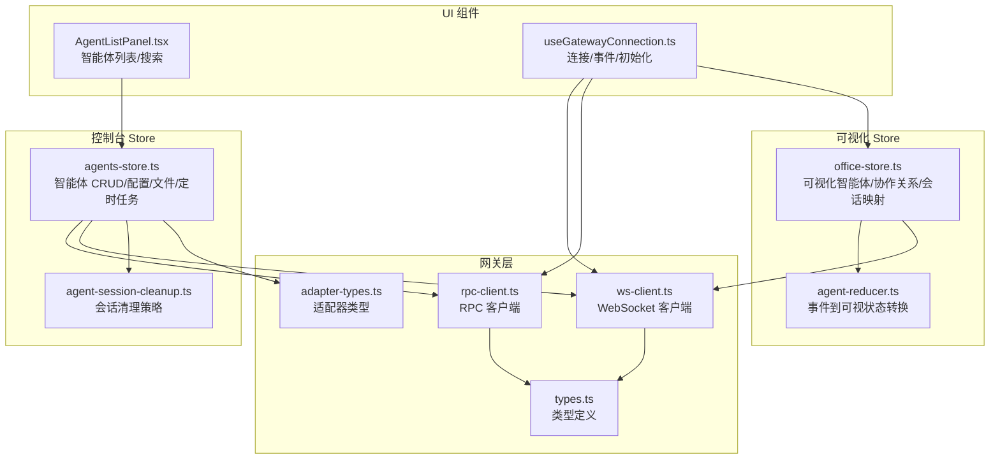
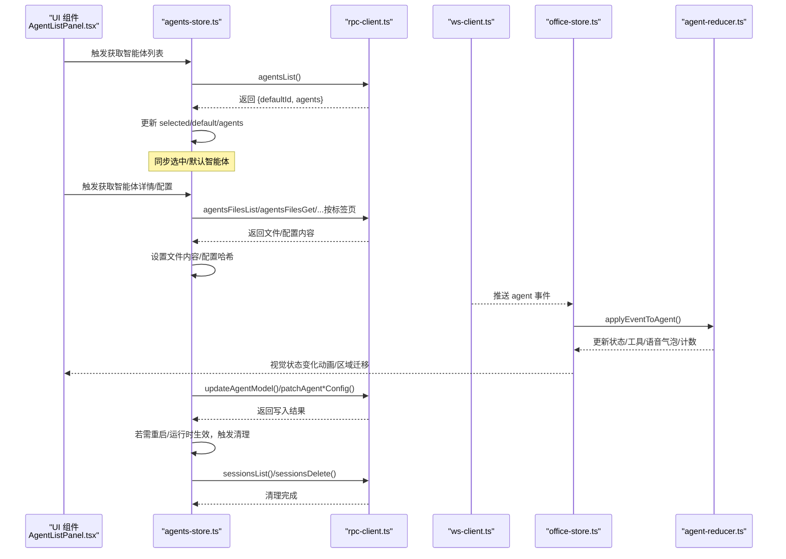
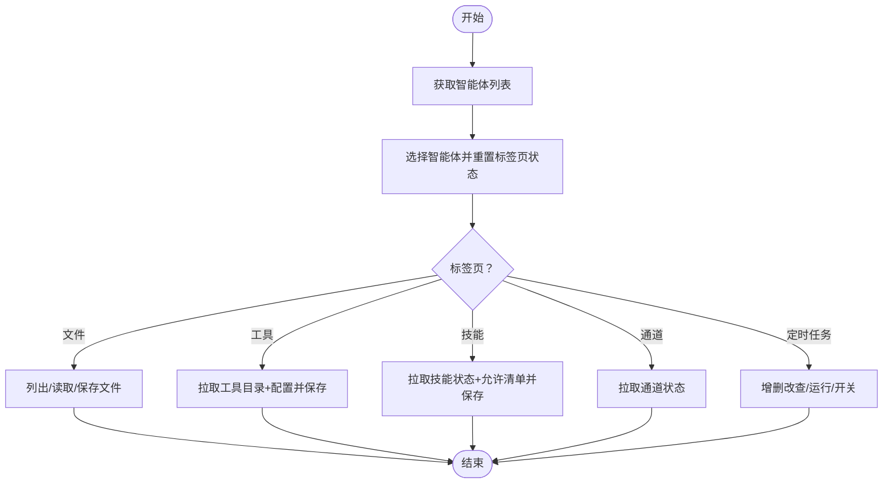
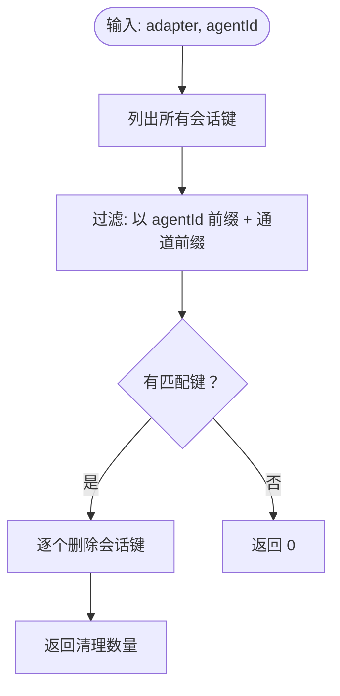
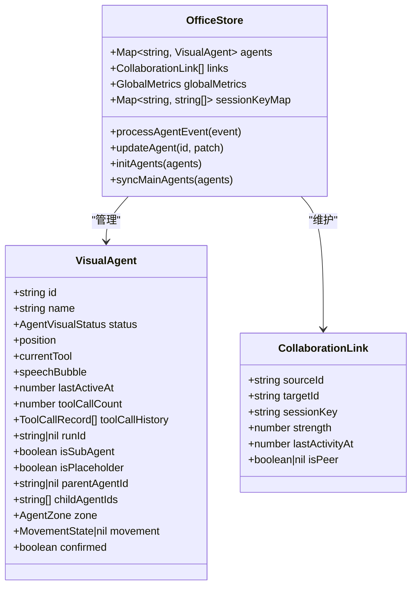
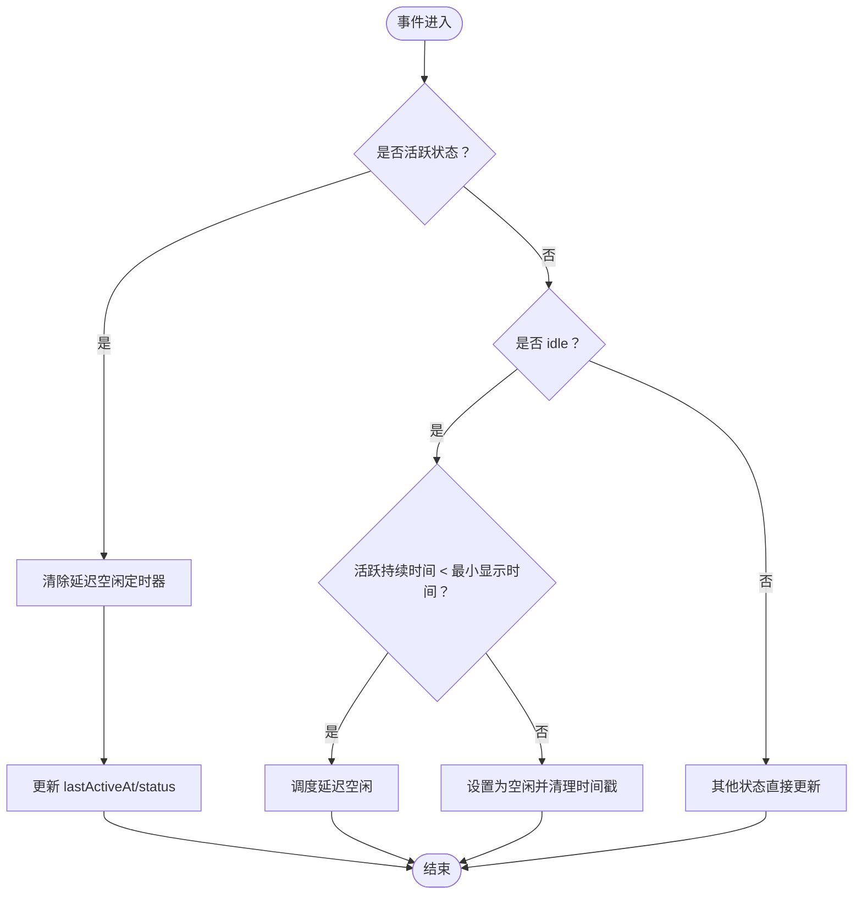
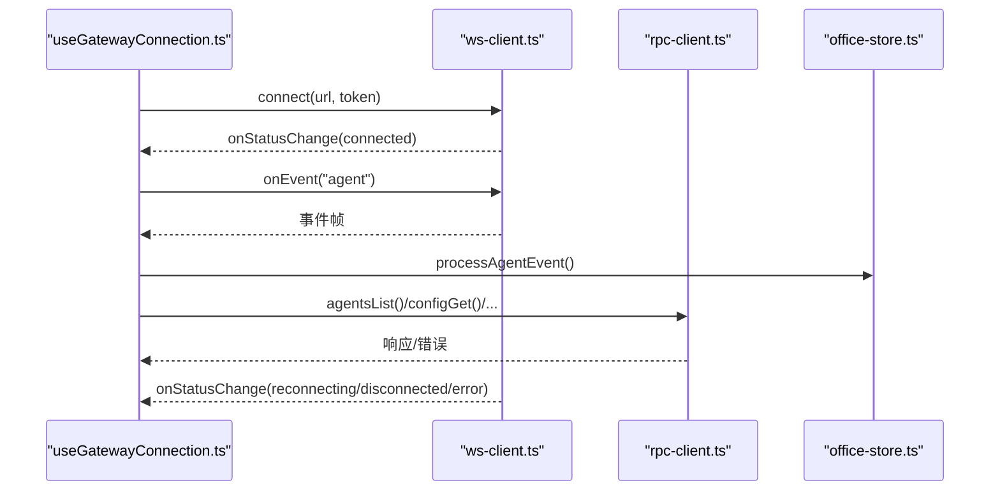
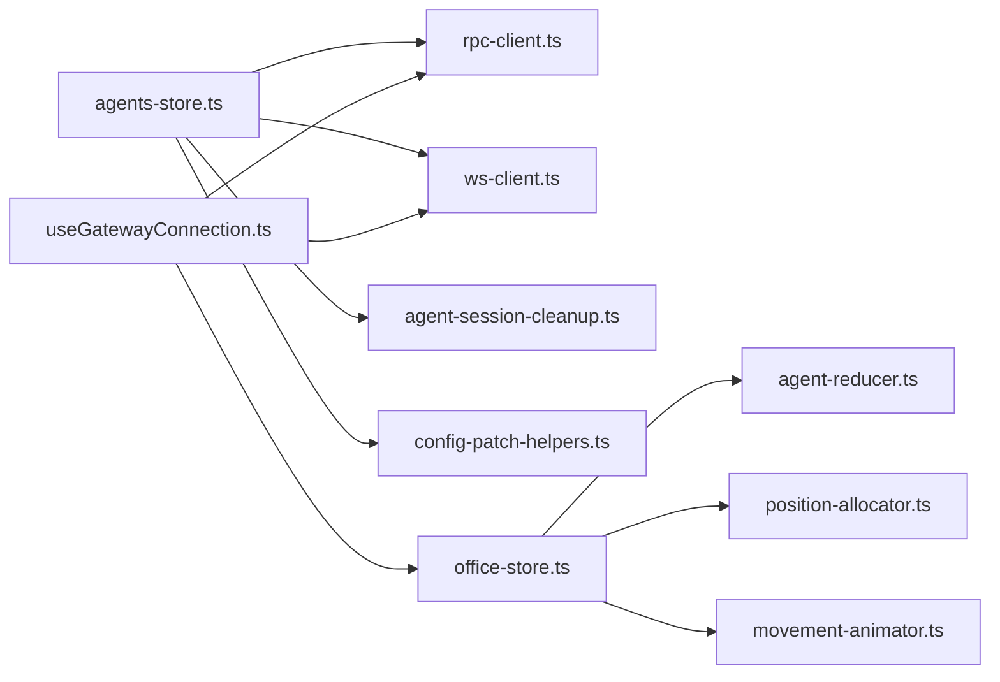

# 智能体管理 Store

<cite>
**本文引用的文件**
- [agents-store.ts](file://src/store/console-stores/agents-store.ts)
- [agent-session-cleanup.ts](file://src/store/console-stores/agent-session-cleanup.ts)
- [agent-reducer.ts](file://src/store/agent-reducer.ts)
- [office-store.ts](file://src/store/office-store.ts)
- [types.ts](file://src/gateway/types.ts)
- [adapter-types.ts](file://src/gateway/adapter-types.ts)
- [rpc-client.ts](file://src/gateway/rpc-client.ts)
- [ws-client.ts](file://src/gateway/ws-client.ts)
- [useGatewayConnection.ts](file://src/hooks/useGatewayConnection.ts)
- [AgentListPanel.tsx](file://src/components/console/agents/AgentListPanel.tsx)
- [fuzzy-match.ts](file://src/lib/fuzzy-match.ts)
</cite>

## 目录
1. [简介](#简介)
2. [项目结构](#项目结构)
3. [核心组件](#核心组件)
4. [架构总览](#架构总览)
5. [详细组件分析](#详细组件分析)
6. [依赖分析](#依赖分析)
7. [性能考虑](#性能考虑)
8. [故障排查指南](#故障排查指南)
9. [结论](#结论)
10. [附录](#附录)

## 简介
本技术文档聚焦于智能体管理 Store 模块，系统性阐述 agents-store 的核心能力与 agent-session-cleanup 的会话清理机制，并深入解析 Office Store 中的可视化智能体模型、协作关系与会话信息。同时，文档覆盖异步操作处理（RPC 客户端调用、WebSocket 事件监听、错误重试机制）、智能体搜索与过滤、排序、批量操作等实现细节，并提供实际使用示例与最佳实践建议。

## 项目结构
- 控制台智能体管理 Store：负责智能体列表、详情、配置、文件、工具、技能、通道、定时任务等的读取与持久化。
- 会话清理模块：在模型变更或运行时配置生效后，清理受影响的通道会话键，确保状态一致性。
- Office Store：承载可视化智能体状态、协作关系、会话映射与事件处理，驱动 UI 动画与交互。
- 网关层：通过 WebSocket 与 RPC 提供统一的异步通信与事件分发。

图表来源
- [agents-store.ts:1-642](file://src/store/console-stores/agents-store.ts#L1-L642)
- [agent-session-cleanup.ts:1-53](file://src/store/console-stores/agent-session-cleanup.ts#L1-L53)
- [office-store.ts:1-200](file://src/store/office-store.ts#L1-L200)
- [agent-reducer.ts:1-103](file://src/store/agent-reducer.ts#L1-L103)
- [types.ts:1-402](file://src/gateway/types.ts#L1-L402)
- [adapter-types.ts:1-458](file://src/gateway/adapter-types.ts#L1-L458)
- [rpc-client.ts:1-62](file://src/gateway/rpc-client.ts#L1-L62)
- [ws-client.ts:40-197](file://src/gateway/ws-client.ts#L40-L197)
- [useGatewayConnection.ts:75-188](file://src/hooks/useGatewayConnection.ts#L75-L188)
- [AgentListPanel.tsx:1-92](file://src/components/console/agents/AgentListPanel.tsx#L1-L92)

章节来源
- [agents-store.ts:1-642](file://src/store/console-stores/agents-store.ts#L1-L642)
- [agent-session-cleanup.ts:1-53](file://src/store/console-stores/agent-session-cleanup.ts#L1-L53)
- [office-store.ts:1-200](file://src/store/office-store.ts#L1-L200)
- [types.ts:1-402](file://src/gateway/types.ts#L1-L402)
- [adapter-types.ts:1-458](file://src/gateway/adapter-types.ts#L1-L458)
- [rpc-client.ts:1-62](file://src/gateway/rpc-client.ts#L1-L62)
- [ws-client.ts:40-197](file://src/gateway/ws-client.ts#L40-L197)
- [useGatewayConnection.ts:75-188](file://src/hooks/useGatewayConnection.ts#L75-L188)
- [AgentListPanel.tsx:1-92](file://src/components/console/agents/AgentListPanel.tsx#L1-L92)

## 核心组件
- agents-store：提供智能体 CRUD、文件读写、工具/技能/通道/定时任务配置、系统模型枚举、搜索与查询等能力。
- agent-session-cleanup：根据通道前缀与 agentId 过滤并删除会话键，保障配置变更后的会话一致性。
- agent-reducer：将网关事件转换为可视化智能体状态，包括“活跃显示最小时间”与延迟空闲切换。
- office-store：维护 VisualAgent、协作关系、会话映射、事件历史与全局指标，驱动 UI 动画与区域迁移。
- 网关层：WebSocket 事件监听与 RPC 请求封装，支持超时与错误码语义化。

章节来源
- [agents-store.ts:40-123](file://src/store/console-stores/agents-store.ts#L40-L123)
- [agent-session-cleanup.ts:27-52](file://src/store/console-stores/agent-session-cleanup.ts#L27-L52)
- [agent-reducer.ts:19-67](file://src/store/agent-reducer.ts#L19-L67)
- [office-store.ts:217-270](file://src/store/office-store.ts#L217-L270)
- [rpc-client.ts:20-61](file://src/gateway/rpc-client.ts#L20-L61)
- [ws-client.ts:132-197](file://src/gateway/ws-client.ts#L132-L197)

## 架构总览
下图展示从 UI 到 Store 再到网关的端到端流程，包括智能体列表获取、详情加载、配置变更、事件驱动的可视化状态更新与会话清理。

图表来源
- [AgentListPanel.tsx:6-91](file://src/components/console/agents/AgentListPanel.tsx#L6-L91)
- [agents-store.ts:297-449](file://src/store/console-stores/agents-store.ts#L297-L449)
- [rpc-client.ts:20-61](file://src/gateway/rpc-client.ts#L20-L61)
- [ws-client.ts:132-197](file://src/gateway/ws-client.ts#L132-L197)
- [office-store.ts:770-1020](file://src/store/office-store.ts#L770-L1020)
- [agent-reducer.ts:19-67](file://src/store/agent-reducer.ts#L19-L67)
- [agent-session-cleanup.ts:38-52](file://src/store/console-stores/agent-session-cleanup.ts#L38-L52)

## 详细组件分析

### agents-store：智能体管理与配置
- 智能体列表与选择
  - 获取列表：等待适配器可用后调用 agentsList，设置默认与选中智能体。
  - 选择逻辑：清空文件与标签页状态，自动切换到概览页。
- 文件管理
  - 列出文件、获取/保存文件内容，脏标记与保存状态管理。
- 创建/更新/删除
  - 创建：agentsCreate，成功后刷新列表。
  - 更新模型：patchAgentModelConfig，支持重启调度与运行时生效提示；必要时清理通道会话。
  - 删除：agentsDelete，成功后清除选中并刷新。
- 工具/技能/通道/定时任务
  - 工具：toolsCatalog + configGet，提取工具配置，保存时带配置哈希校验。
  - 技能：skillsStatus + configGet，提取允许清单，保存时带配置哈希校验。
  - 通道：channelsStatus。
  - 定时任务：cronList/add/update/remove/run/toggle，均通过 RPC 完成。
- 系统模型枚举
  - 并行获取 configGet 与 modelsList，结合可用凭据与已引用提供者生成可选模型选项与默认模型配置映射。
- 搜索与过滤
  - 支持按名称或 ID 模糊匹配（大小写不敏感），列表组件内直接过滤。

图表来源
- [agents-store.ts:297-641](file://src/store/console-stores/agents-store.ts#L297-L641)
- [AgentListPanel.tsx:20-25](file://src/components/console/agents/AgentListPanel.tsx#L20-L25)

章节来源
- [agents-store.ts:84-123](file://src/store/console-stores/agents-store.ts#L84-L123)
- [agents-store.ts:297-464](file://src/store/console-stores/agents-store.ts#L297-L464)
- [agents-store.ts:471-565](file://src/store/console-stores/agents-store.ts#L471-L565)
- [agents-store.ts:569-594](file://src/store/console-stores/agents-store.ts#L569-L594)
- [agents-store.ts:582-632](file://src/store/console-stores/agents-store.ts#L582-L632)
- [agents-store.ts:166-295](file://src/store/console-stores/agents-store.ts#L166-L295)
- [AgentListPanel.tsx:20-25](file://src/components/console/agents/AgentListPanel.tsx#L20-L25)

### agent-session-cleanup：会话清理策略与资源释放
- 通道前缀白名单：涵盖多平台即时通讯通道，用于识别“智能体通道会话”。
- 会话键过滤规则：以 agentId 前缀匹配，且剩余部分以通道前缀开头。
- 清理流程：列出所有会话键，筛选目标键，逐个删除并返回清理数量。

图表来源
- [agent-session-cleanup.ts:38-52](file://src/store/console-stores/agent-session-cleanup.ts#L38-L52)

章节来源
- [agent-session-cleanup.ts:3-25](file://src/store/console-stores/agent-session-cleanup.ts#L3-L25)
- [agent-session-cleanup.ts:27-52](file://src/store/console-stores/agent-session-cleanup.ts#L27-L52)

### Office Store：可视化智能体与协作关系
- 可视化智能体模型（VisualAgent）
  - 字段：状态、位置、当前工具、语音气泡、最后活跃时间、工具调用计数与历史、runId、子/父代理关系、所在区域、移动状态、确认状态等。
- 协作关系（CollaborationLink）
  - 以 sessionKey 为纽带，记录两个智能体之间的强度与最后活动时间；支持 peer agent 直连场景。
- 会话映射与事件路由
  - sessionKeyMap 将会话键映射到智能体集合，用于事件路由与协作链接建立。
- 事件处理与状态转换
  - 解析 agent 事件，调用 agent-reducer 将事件转换为可视化状态；根据活跃状态调度区域迁移（lounge↔hotDesk）。
- 全局指标与历史
  - 维护全局指标与事件历史，支持 UI 展示与调试。

图表来源
- [types.ts:166-222](file://src/gateway/types.ts#L166-L222)
- [types.ts:200-208](file://src/gateway/types.ts#L200-L208)
- [office-store.ts:217-370](file://src/store/office-store.ts#L217-L370)

章节来源
- [types.ts:166-222](file://src/gateway/types.ts#L166-L222)
- [types.ts:200-208](file://src/gateway/types.ts#L200-L208)
- [office-store.ts:217-370](file://src/store/office-store.ts#L217-L370)
- [office-store.ts:770-1020](file://src/store/office-store.ts#L770-L1020)

### agent-reducer：事件到可视状态的转换
- 活跃判定：思考/工具调用/说话/出生/错误视为视觉活跃。
- 空闲延迟：在活跃状态下，若离开活跃超过最小显示时间（毫秒级），才切换为空闲。
- 工具/语音/计数/历史：根据事件增量更新当前工具、语音气泡、工具调用计数与历史。
- 运行期回调：支持延迟空闲回调注册与取消。

图表来源
- [agent-reducer.ts:19-98](file://src/store/agent-reducer.ts#L19-L98)

章节来源
- [agent-reducer.ts:19-98](file://src/store/agent-reducer.ts#L19-L98)

### 异步操作与错误处理
- RPC 客户端
  - request 方法封装：生成唯一请求 ID，注册响应处理器，超时则抛出带错误码的异常。
- WebSocket 客户端
  - 连接/断开/重连、事件与响应分发、状态变更回调。
- 网关连接钩子
  - 初始化：连接成功后，从快照中初始化智能体，拉取配置与主智能体列表，注入适配器。
  - 事件：订阅 agent 事件，使用节流器批处理，避免 UI 抖动。
- 错误重试与超时
  - RPC 默认超时；WebSocket 断线自动重连；连接状态变更通知 UI。

图表来源
- [useGatewayConnection.ts:75-188](file://src/hooks/useGatewayConnection.ts#L75-L188)
- [rpc-client.ts:20-61](file://src/gateway/rpc-client.ts#L20-L61)
- [ws-client.ts:132-197](file://src/gateway/ws-client.ts#L132-L197)
- [office-store.ts:770-1020](file://src/store/office-store.ts#L770-L1020)

章节来源
- [rpc-client.ts:20-61](file://src/gateway/rpc-client.ts#L20-L61)
- [ws-client.ts:132-197](file://src/gateway/ws-client.ts#L132-L197)
- [useGatewayConnection.ts:75-188](file://src/hooks/useGatewayConnection.ts#L75-L188)

### 智能体搜索、过滤与排序
- 搜索逻辑
  - 列表组件内对智能体名称与 ID 进行大小写不敏感的包含匹配。
- 过滤与排序
  - 当前实现为简单包含过滤；如需排序，可在 UI 层基于名称/ID 排序后再渲染。
- 批量操作
  - 通过 agents-store 的标签页接口批量执行工具/技能配置保存，内部使用配置哈希进行幂等写入。

章节来源
- [AgentListPanel.tsx:20-25](file://src/components/console/agents/AgentListPanel.tsx#L20-L25)
- [agents-store.ts:471-565](file://src/store/console-stores/agents-store.ts#L471-L565)

### 实际使用示例与最佳实践
- 获取智能体列表并自动选择默认
  - 在组件挂载时调用 fetchAgents，随后在 UI 中展示并选择默认智能体。
- 编辑工具配置
  - 先 fetchAgentTools，再 saveAgentToolsConfig，注意保存后更新配置哈希。
- 更新模型并清理会话
  - updateAgentModel 成功后，若返回需要清理会话，调用清理函数并提示用户。
- 处理事件驱动的可视化状态
  - 通过 office-store 的 processAgentEvent 与 agent-reducer 的 applyEventToAgent，确保 UI 实时反映智能体状态。
- 最佳实践
  - 使用配置哈希进行幂等写入，避免并发冲突。
  - 对高频事件使用节流/批处理，减少 UI 重绘压力。
  - 在模型变更后及时清理相关会话，避免旧会话影响新行为。

章节来源
- [agents-store.ts:297-449](file://src/store/console-stores/agents-store.ts#L297-L449)
- [agent-session-cleanup.ts:38-52](file://src/store/console-stores/agent-session-cleanup.ts#L38-L52)
- [useGatewayConnection.ts:88-116](file://src/hooks/useGatewayConnection.ts#L88-L116)
- [office-store.ts:770-1020](file://src/store/office-store.ts#L770-L1020)

## 依赖分析
- agents-store 依赖
  - 网关适配器（agentsList/agentsCreate/agentsDelete 等）
  - 配置补丁工具（patchAgentModelConfig/patchAgentToolsConfig/patchAgentSkillsConfig）
  - 会话清理模块（clearAgentChannelSessions）
  - 配置 Store（setLifecycleFromWriteResult/setRuntimeApplied）
- Office Store 依赖
  - 事件解析器（parseAgentEvent）
  - agent-reducer（applyEventToAgent）
  - 位置分配与路径规划（position-allocator/movement-animator）
  - 协作提示（assistant-collaboration-hints）
- 网关层依赖
  - WebSocket 客户端与 RPC 客户端，提供统一的连接与请求抽象。

图表来源
- [agents-store.ts:16-24](file://src/store/console-stores/agents-store.ts#L16-L24)
- [rpc-client.ts:1-62](file://src/gateway/rpc-client.ts#L1-L62)
- [ws-client.ts:40-197](file://src/gateway/ws-client.ts#L40-L197)
- [agent-session-cleanup.ts:1-53](file://src/store/console-stores/agent-session-cleanup.ts#L1-L53)
- [office-store.ts:25-37](file://src/store/office-store.ts#L25-L37)
- [useGatewayConnection.ts:75-188](file://src/hooks/useGatewayConnection.ts#L75-L188)

章节来源
- [agents-store.ts:16-24](file://src/store/console-stores/agents-store.ts#L16-L24)
- [office-store.ts:25-37](file://src/store/office-store.ts#L25-L37)
- [useGatewayConnection.ts:75-188](file://src/hooks/useGatewayConnection.ts#L75-L188)

## 性能考虑
- 事件节流与批处理：通过节流器对 agent 事件进行批处理，降低 UI 重绘频率。
- 并行请求：系统模型枚举与配置快照并行获取，缩短首屏等待时间。
- 延迟空闲：避免频繁切换空闲状态，减少不必要的 UI 更新。
- 会话清理：仅清理受影响的通道会话键，避免全量扫描。

## 故障排查指南
- 连接问题
  - 检查 WebSocket 状态变化回调，确认是否处于 reconnecting/disconnected/error。
  - 确认连接参数与认证信息正确。
- RPC 超时
  - 默认超时时间，检查网络状况与服务端负载。
  - 对长耗时操作适当增大超时或拆分为多个短请求。
- 配置写入失败
  - 检查配置哈希是否过期，重新拉取快照后重试。
  - 关注错误码与消息，定位具体字段问题。
- 事件未生效
  - 确认事件已到达 office-store 的 processAgentEvent。
  - 检查 sessionKeyMap 是否正确映射到目标智能体。

章节来源
- [ws-client.ts:132-197](file://src/gateway/ws-client.ts#L132-L197)
- [rpc-client.ts:20-61](file://src/gateway/rpc-client.ts#L20-L61)
- [useGatewayConnection.ts:88-116](file://src/hooks/useGatewayConnection.ts#L88-L116)
- [office-store.ts:770-1020](file://src/store/office-store.ts#L770-L1020)

## 结论
agents-store 提供了完整的智能体生命周期管理与配置能力，配合 agent-session-cleanup 确保配置变更后的会话一致性。Office Store 将网关事件转化为可视化状态，驱动 UI 动画与协作关系。通过 RPC/WebSocket 的异步抽象与事件节流，系统在复杂场景下仍能保持良好的交互体验与稳定性。

## 附录
- 关键类型参考
  - VisualAgent、CollaborationLink、AgentEventPayload、SessionInfo 等类型定义见类型文件。
- 相关实现参考
  - 智能体列表组件的搜索与过滤逻辑。
  - 模糊匹配工具用于 ID 解析与批量匹配。

章节来源
- [types.ts:166-222](file://src/gateway/types.ts#L166-L222)
- [types.ts:195-212](file://src/gateway/types.ts#L195-L212)
- [AgentListPanel.tsx:20-25](file://src/components/console/agents/AgentListPanel.tsx#L20-L25)
- [fuzzy-match.ts:7-44](file://src/lib/fuzzy-match.ts#L7-L44)