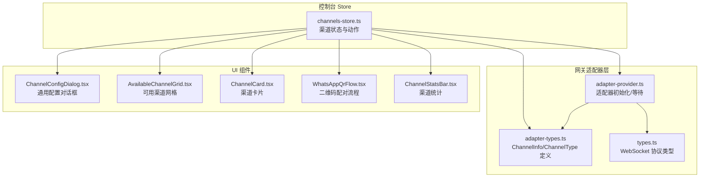
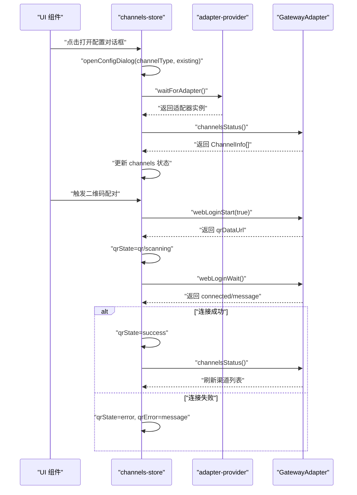
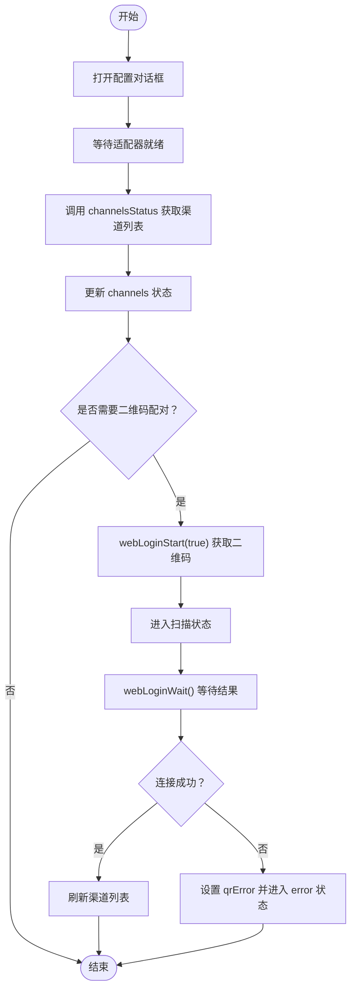
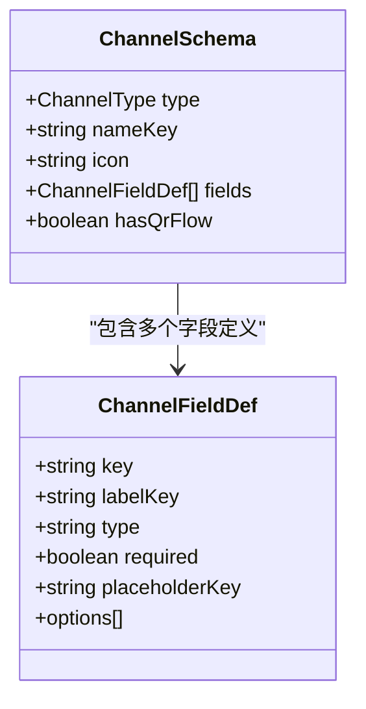
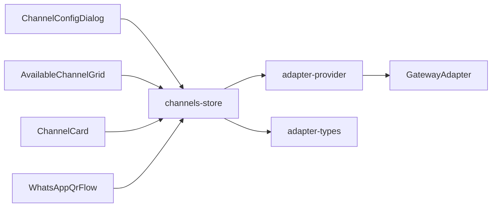
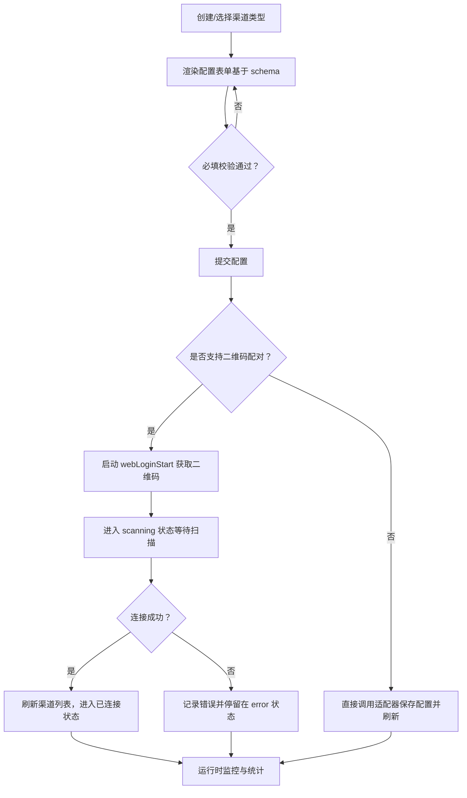

# 渠道管理 Store

<cite>
**本文引用的文件**
- [channels-store.ts](file://src/store/console-stores/channels-store.ts)
- [channel-schemas.ts](file://src/lib/channel-schemas.ts)
- [adapter-types.ts](file://src/gateway/adapter-types.ts)
- [adapter-provider.ts](file://src/gateway/adapter-provider.ts)
- [types.ts](file://src/gateway/types.ts)
- [ChannelConfigDialog.tsx](file://src/components/console/channels/ChannelConfigDialog.tsx)
- [AvailableChannelGrid.tsx](file://src/components/console/channels/AvailableChannelGrid.tsx)
- [ChannelCard.tsx](file://src/components/console/channels/ChannelCard.tsx)
- [WhatsAppQrFlow.tsx](file://src/components/console/channels/WhatsAppQrFlow.tsx)
- [ChannelStatsBar.tsx](file://src/components/console/channels/ChannelStatsBar.tsx)
- [channels-store-phase-c.test.ts](file://src/store/__tests__/channels-store-phase-c.test.ts)
</cite>

## 目录
1. [简介](#简介)
2. [项目结构](#项目结构)
3. [核心组件](#核心组件)
4. [架构总览](#架构总览)
5. [详细组件分析](#详细组件分析)
6. [依赖关系分析](#依赖关系分析)
7. [性能考量](#性能考量)
8. [故障排查指南](#故障排查指南)
9. [结论](#结论)
10. [附录](#附录)

## 简介
本文件为“渠道管理 Store”模块的技术文档，聚焦 channels-store 的功能职责与实现细节，涵盖：
- 渠道的注册、配置、启用与禁用管理
- 渠道类型的统一管理（如 WhatsApp、微信、Slack 等）
- 渠道配置的校验与测试机制
- 渠道数据结构：ChannelInfo 接口、配置参数 schema、状态字段含义
- 渠道生命周期管理：从配置到激活的完整流程、运行时状态监控、故障自动恢复
- 渠道适配器集成：与 gateway 层的通信协议、事件处理机制、错误处理策略
- 渠道统计信息收集、性能监控、日志记录的实现要点
- 渠道配置最佳实践与常见问题解决方案

## 项目结构
channels-store 位于控制台 Store 层，负责渠道列表、配置对话框状态、二维码配对流程等；配合 gateway 适配器与前端 UI 组件共同完成渠道全生命周期管理。

图表来源
- [channels-store.ts:1-104](file://src/store/console-stores/channels-store.ts#L1-L104)
- [adapter-provider.ts:1-130](file://src/gateway/adapter-provider.ts#L1-L130)
- [adapter-types.ts:1-458](file://src/gateway/adapter-types.ts#L1-L458)
- [types.ts:1-402](file://src/gateway/types.ts#L1-L402)
- [ChannelConfigDialog.tsx:1-198](file://src/components/console/channels/ChannelConfigDialog.tsx#L1-L198)
- [AvailableChannelGrid.tsx:1-53](file://src/components/console/channels/AvailableChannelGrid.tsx#L1-L53)
- [ChannelCard.tsx:1-76](file://src/components/console/channels/ChannelCard.tsx#L1-L76)
- [WhatsAppQrFlow.tsx:1-93](file://src/components/console/channels/WhatsAppQrFlow.tsx#L1-L93)
- [ChannelStatsBar.tsx:1-34](file://src/components/console/channels/ChannelStatsBar.tsx#L1-L34)

章节来源
- [channels-store.ts:1-104](file://src/store/console-stores/channels-store.ts#L1-L104)
- [adapter-provider.ts:1-130](file://src/gateway/adapter-provider.ts#L1-L130)
- [adapter-types.ts:1-458](file://src/gateway/adapter-types.ts#L1-L458)
- [types.ts:1-402](file://src/gateway/types.ts#L1-L402)
- [ChannelConfigDialog.tsx:1-198](file://src/components/console/channels/ChannelConfigDialog.tsx#L1-L198)
- [AvailableChannelGrid.tsx:1-53](file://src/components/console/channels/AvailableChannelGrid.tsx#L1-L53)
- [ChannelCard.tsx:1-76](file://src/components/console/channels/ChannelCard.tsx#L1-L76)
- [WhatsAppQrFlow.tsx:1-93](file://src/components/console/channels/WhatsAppQrFlow.tsx#L1-L93)
- [ChannelStatsBar.tsx:1-34](file://src/components/console/channels/ChannelStatsBar.tsx#L1-L34)

## 核心组件
- 渠道 Store（channels-store）
  - 负责：加载渠道列表、打开/关闭配置对话框、启动/取消二维码配对、登出渠道
  - 关键状态：channels、isLoading、error、selectedChannel、configDialogOpen、configDialogChannelType、qrState、qrDataUrl、qrError
  - 关键动作：fetchChannels、logoutChannel、openConfigDialog、closeConfigDialog、startQrPairing、cancelQrPairing
- 渠道 Schema（channel-schemas）
  - 定义：各渠道类型的配置字段、必填项、占位符、图标、名称国际化键、是否支持二维码配对
- 渠道类型定义（adapter-types）
  - 定义：ChannelType、ChannelStatus、ChannelInfo 结构及扩展字段（configured、linked、running、lastConnectedAt、lastMessageAt、reconnectAttempts、mode 等）
- 适配器提供者（adapter-provider）
  - 提供：getAdapter()/waitForAdapter()、initAdapter()、Mock/Ws 适配器选择、等待器队列与超时处理
- UI 组件
  - ChannelConfigDialog：根据 schema 渲染表单并进行必填校验；支持二维码配对流程
  - AvailableChannelGrid：展示可用渠道类型与已配置状态
  - ChannelCard：展示渠道状态、连接时间、错误信息，并支持登出
  - WhatsAppQrFlow：封装二维码配对流程的状态机与交互
  - ChannelStatsBar：统计渠道总数、已连接数、错误数

章节来源
- [channels-store.ts:7-25](file://src/store/console-stores/channels-store.ts#L7-L25)
- [channels-store.ts:27-103](file://src/store/console-stores/channels-store.ts#L27-L103)
- [channel-schemas.ts:3-18](file://src/lib/channel-schemas.ts#L3-L18)
- [channel-schemas.ts:20-205](file://src/lib/channel-schemas.ts#L20-L205)
- [adapter-types.ts:4-33](file://src/gateway/adapter-types.ts#L4-L33)
- [adapter-provider.ts:15-48](file://src/gateway/adapter-provider.ts#L15-L48)
- [ChannelConfigDialog.tsx:14-129](file://src/components/console/channels/ChannelConfigDialog.tsx#L14-L129)
- [AvailableChannelGrid.tsx:11-52](file://src/components/console/channels/AvailableChannelGrid.tsx#L11-L52)
- [ChannelCard.tsx:20-75](file://src/components/console/channels/ChannelCard.tsx#L20-L75)
- [WhatsAppQrFlow.tsx:9-92](file://src/components/console/channels/WhatsAppQrFlow.tsx#L9-L92)
- [ChannelStatsBar.tsx:8-33](file://src/components/console/channels/ChannelStatsBar.tsx#L8-L33)

## 架构总览
channels-store 通过 adapter-provider 获取适配器实例，调用适配器提供的通道管理方法（如 channelsStatus、channelsLogout、webLoginStart/webLoginWait），并与 UI 组件协同完成渠道配置与二维码配对流程。

图表来源
- [channels-store.ts:39-98](file://src/store/console-stores/channels-store.ts#L39-L98)
- [adapter-provider.ts:25-48](file://src/gateway/adapter-provider.ts#L25-L48)
- [adapter-types.ts:19-33](file://src/gateway/adapter-types.ts#L19-L33)

## 详细组件分析

### 渠道 Store（channels-store）
- 状态设计
  - channels：渠道数组，包含扩展字段（configured、linked、running、lastConnectedAt、lastMessageAt、reconnectAttempts、mode 等）
  - 加载与错误：isLoading、error
  - 配置对话框：configDialogOpen、configDialogChannelType、selectedChannel
  - 二维码配对：qrState（idle/loading/qr/scanning/success/error/cancel）、qrDataUrl、qrError
- 动作实现
  - fetchChannels：等待适配器就绪后调用 channelsStatus，设置 channels 或 error
  - logoutChannel：调用 channelsLogout 并刷新渠道列表
  - openConfigDialog/closeConfigDialog：切换对话框状态并重置二维码状态
  - startQrPairing：启动 webLoginStart 获取二维码，进入 scanning 并等待 webLoginWait，成功则刷新渠道列表
  - cancelQrPairing：重置二维码状态
- 错误处理
  - 适配器未初始化或超时：waitForAdapter 抛错
  - 业务异常：捕获并设置 error 字段

图表来源
- [channels-store.ts:39-98](file://src/store/console-stores/channels-store.ts#L39-L98)
- [adapter-provider.ts:25-48](file://src/gateway/adapter-provider.ts#L25-L48)

章节来源
- [channels-store.ts:7-25](file://src/store/console-stores/channels-store.ts#L7-L25)
- [channels-store.ts:27-103](file://src/store/console-stores/channels-store.ts#L27-L103)

### 渠道 Schema（channel-schemas）
- 结构
  - ChannelSchema：包含 type、nameKey、icon、fields（ChannelFieldDef 数组）、可选 hasQrFlow
  - ChannelFieldDef：key、labelKey、type（text/secret/select/textarea）、required、placeholderKey、options
- 支持的渠道类型与字段
  - telegram/discord/feishu/matrix/line/msteams/mattermost：均提供必填字段定义
  - whatsapp：无字段，hasQrFlow=true，使用二维码配对
  - signal：手机号字段
  - imessage：无字段
  - googlechat：服务账号 JSON 文本字段
- 使用方式
  - UI 根据 schema 渲染表单，进行必填校验；若 hasQrFlow=true，则渲染二维码配对流程

图表来源
- [channel-schemas.ts:3-18](file://src/lib/channel-schemas.ts#L3-L18)
- [channel-schemas.ts:20-205](file://src/lib/channel-schemas.ts#L20-L205)

章节来源
- [channel-schemas.ts:3-18](file://src/lib/channel-schemas.ts#L3-L18)
- [channel-schemas.ts:20-205](file://src/lib/channel-schemas.ts#L20-L205)

### 渠道类型定义（adapter-types）
- ChannelType：支持的渠道类型枚举（whatsapp、telegram、discord、signal、feishu、imessage、matrix、line、msteams、googlechat、mattermost）
- ChannelStatus：connected/disconnected/connecting/error
- ChannelInfo：基础字段 id、type、name、status、accountId、error；扩展字段 configured、linked、running、lastConnectedAt、lastMessageAt、reconnectAttempts、mode
- 用途
  - Store 与 UI 组件共享类型定义，确保状态一致性
  - 测试用例验证扩展字段存在性与类型

章节来源
- [adapter-types.ts:4-33](file://src/gateway/adapter-types.ts#L4-L33)
- [channels-store-phase-c.test.ts:21-29](file://src/store/__tests__/channels-store-phase-c.test.ts#L21-L29)

### 适配器提供者（adapter-provider）
- 能力
  - getAdapter：获取已初始化适配器，未初始化抛错
  - waitForAdapter：等待适配器初始化，带超时与等待器队列
  - initAdapter：根据模式选择 MockAdapter 或 WsAdapter，建立连接并通知等待者
- 设计要点
  - 防止重复初始化
  - 统一错误处理与超时控制
  - 与 UI 页面在挂载前调用 waitForAdapter，避免竞态

章节来源
- [adapter-provider.ts:15-48](file://src/gateway/adapter-provider.ts#L15-L48)
- [adapter-provider.ts:50-86](file://src/gateway/adapter-provider.ts#L50-L86)

### UI 组件与交互
- ChannelConfigDialog
  - 根据 schema 渲染字段输入，支持密码显隐切换
  - 必填字段校验，保存时若无错误则关闭对话框
  - 若 hasQrFlow=true，渲染 WhatsAppQrFlow
- AvailableChannelGrid
  - 展示所有支持的渠道类型，标记已配置状态
- ChannelCard
  - 展示渠道图标、名称、类型、状态徽标、最近连接时间、错误信息
  - 已连接状态下提供登出按钮
- WhatsAppQrFlow
  - 状态机：idle/loading/qr/scanning/success/error
  - 展示二维码图片、提示文案、取消/重试操作
- ChannelStatsBar
  - 统计总数、已连接数、错误数

章节来源
- [ChannelConfigDialog.tsx:14-129](file://src/components/console/channels/ChannelConfigDialog.tsx#L14-L129)
- [AvailableChannelGrid.tsx:11-52](file://src/components/console/channels/AvailableChannelGrid.tsx#L11-L52)
- [ChannelCard.tsx:20-75](file://src/components/console/channels/ChannelCard.tsx#L20-L75)
- [WhatsAppQrFlow.tsx:9-92](file://src/components/console/channels/WhatsAppQrFlow.tsx#L9-L92)
- [ChannelStatsBar.tsx:8-33](file://src/components/console/channels/ChannelStatsBar.tsx#L8-L33)

## 依赖关系分析
- Store 对适配器的依赖
  - 通过 adapter-provider.waitForAdapter/getAdapter 获取适配器实例
  - 调用适配器方法：channelsStatus、channelsLogout、webLoginStart、webLoginWait
- Store 对类型定义的依赖
  - 使用 ChannelInfo/ChannelType/ChannelStatus 等类型保证状态与行为一致
- Store 对 UI 的依赖
  - 通过 openConfigDialog/closeConfigDialog 控制对话框状态
  - 通过 startQrPairing/cancelQrPairing 控制二维码流程
- UI 对 Store 的依赖
  - 读取 qrState、qrDataUrl、qrError 等状态驱动渲染
  - 调用 Store 动作发起配对或登出

图表来源
- [channels-store.ts:39-98](file://src/store/console-stores/channels-store.ts#L39-L98)
- [adapter-provider.ts:15-48](file://src/gateway/adapter-provider.ts#L15-L48)
- [adapter-types.ts:4-33](file://src/gateway/adapter-types.ts#L4-L33)
- [ChannelConfigDialog.tsx:14-129](file://src/components/console/channels/ChannelConfigDialog.tsx#L14-L129)
- [AvailableChannelGrid.tsx:11-52](file://src/components/console/channels/AvailableChannelGrid.tsx#L11-L52)
- [ChannelCard.tsx:20-75](file://src/components/console/channels/ChannelCard.tsx#L20-L75)
- [WhatsAppQrFlow.tsx:9-92](file://src/components/console/channels/WhatsAppQrFlow.tsx#L9-L92)

章节来源
- [channels-store.ts:39-98](file://src/store/console-stores/channels-store.ts#L39-L98)
- [adapter-provider.ts:15-48](file://src/gateway/adapter-provider.ts#L15-L48)
- [adapter-types.ts:4-33](file://src/gateway/adapter-types.ts#L4-L33)
- [ChannelConfigDialog.tsx:14-129](file://src/components/console/channels/ChannelConfigDialog.tsx#L14-L129)
- [AvailableChannelGrid.tsx:11-52](file://src/components/console/channels/AvailableChannelGrid.tsx#L11-L52)
- [ChannelCard.tsx:20-75](file://src/components/console/channels/ChannelCard.tsx#L20-L75)
- [WhatsAppQrFlow.tsx:9-92](file://src/components/console/channels/WhatsAppQrFlow.tsx#L9-L92)

## 性能考量
- 适配器初始化等待
  - waitForAdapter 带超时（默认 15 秒），避免页面挂起；建议在页面挂载前调用
- 状态更新粒度
  - Store 将渠道列表一次性拉取并缓存，减少频繁请求；二维码配对流程中仅在关键节点更新状态
- UI 渲染优化
  - ChannelCard 仅渲染必要字段，避免大对象深比较
  - WhatsAppQrFlow 根据状态分支渲染，减少不必要计算
- 日志与监控
  - Store 在错误时设置 error 字段，便于上层统一处理与日志记录
  - ChannelStatsBar 提供快速概览，辅助运维观察

[本节为通用性能建议，不直接分析具体文件]

## 故障排查指南
- 适配器未初始化
  - 现象：调用 getAdapter 抛错或 waitForAdapter 超时
  - 处理：确保在访问 Store 动作前调用 initAdapter 或 waitForAdapter
- 二维码配对失败
  - 现象：qrState=error，qrError 显示错误消息
  - 处理：检查网络连通性、重试 startQrPairing；必要时 cancelQrPairing 后重新开始
- 登出渠道无效
  - 现象：调用 logoutChannel 后渠道列表未变化
  - 处理：确认 accountId 参数正确；再次调用 fetchChannels 刷新
- 配置对话框无法关闭
  - 现象：关闭后 qrState 未重置
  - 处理：调用 closeConfigDialog；确保对话框内部逻辑正确重置状态

章节来源
- [adapter-provider.ts:15-48](file://src/gateway/adapter-provider.ts#L15-L48)
- [channels-store.ts:50-57](file://src/store/console-stores/channels-store.ts#L50-L57)
- [channels-store.ts:100-102](file://src/store/console-stores/channels-store.ts#L100-L102)
- [channels-store-phase-c.test.ts:55-69](file://src/store/__tests__/channels-store-phase-c.test.ts#L55-L69)

## 结论
channels-store 以清晰的状态机与动作模型，结合适配器层与 UI 组件，实现了渠道的全生命周期管理。通过统一的 ChannelInfo/ChannelType 定义与 ChannelSchema，系统在功能扩展与维护性方面具备良好基础。建议在生产环境中强化错误上报与重试策略，并完善渠道健康度与性能指标采集。

[本节为总结性内容，不直接分析具体文件]

## 附录

### 渠道数据结构与状态字段说明
- ChannelInfo 字段
  - id、type、name、status、accountId、error
  - 扩展字段：configured、linked、running、lastConnectedAt、lastMessageAt、reconnectAttempts、mode
- ChannelStatus
  - connected、disconnected、connecting、error
- ChannelType
  - whatsapp、telegram、discord、signal、feishu、imessage、matrix、line、msteams、googlechat、mattermost

章节来源
- [adapter-types.ts:4-33](file://src/gateway/adapter-types.ts#L4-L33)

### 渠道生命周期管理流程

图表来源
- [channel-schemas.ts:20-205](file://src/lib/channel-schemas.ts#L20-L205)
- [channels-store.ts:39-98](file://src/store/console-stores/channels-store.ts#L39-L98)

### 最佳实践
- 配置阶段
  - 使用 schema 的 required 字段强制必填，避免后续连接失败
  - 对 secret 类型字段提供显隐切换，提升用户体验
- 运行阶段
  - 定期调用 channelsStatus 刷新状态，结合 ChannelStatsBar 观察整体健康度
  - 对 error 状态的渠道进行告警与重试策略
- 二维码配对
  - 在 startQrPairing 前确保网络稳定，提供明确的用户引导
  - 失败时及时 cancelQrPairing 并允许用户重试

[本节为通用建议，不直接分析具体文件]