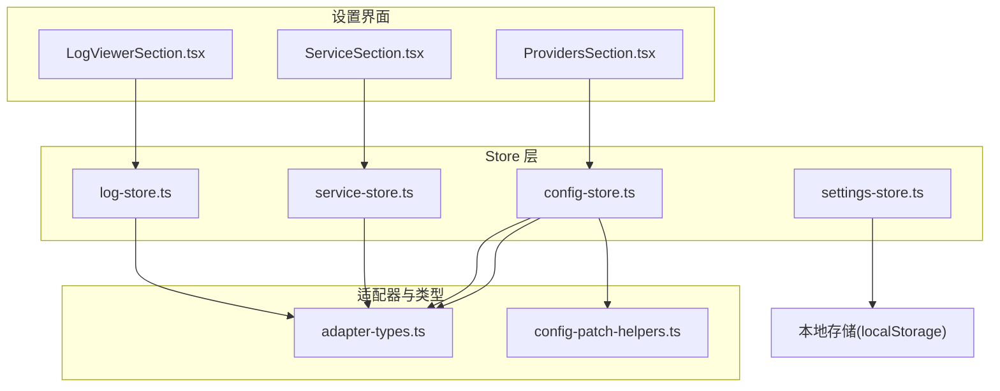
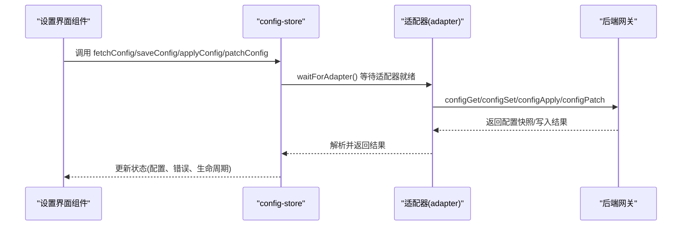
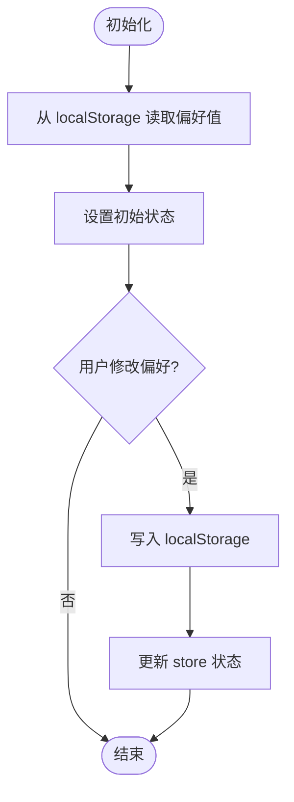
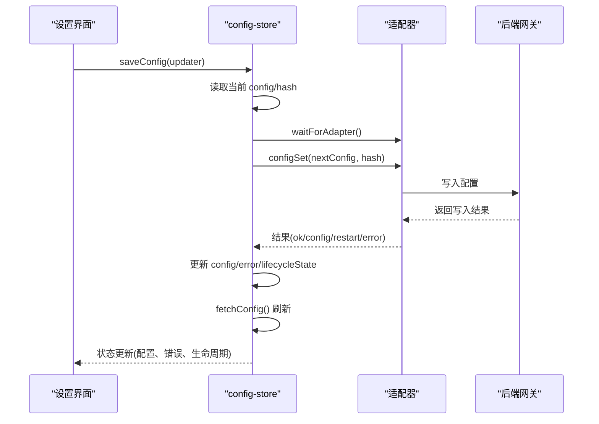
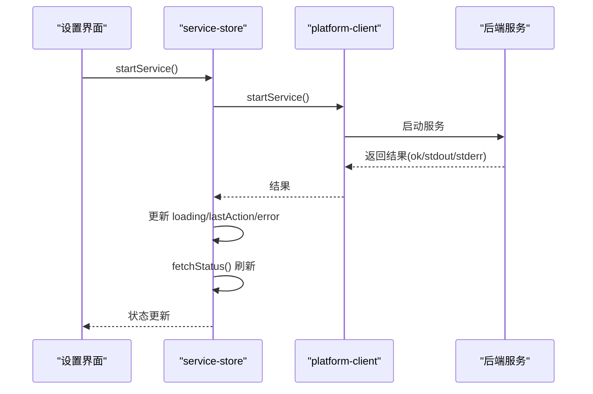
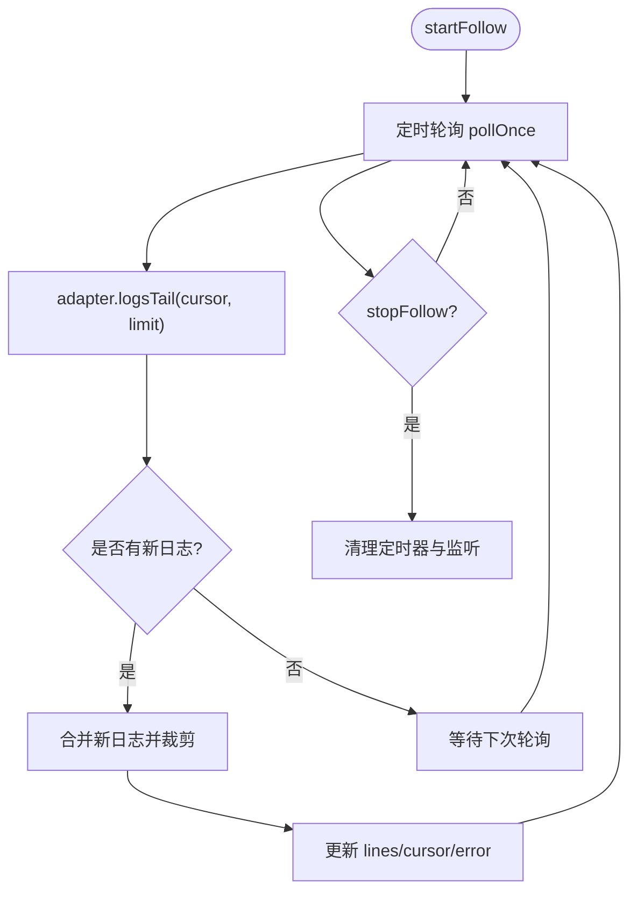
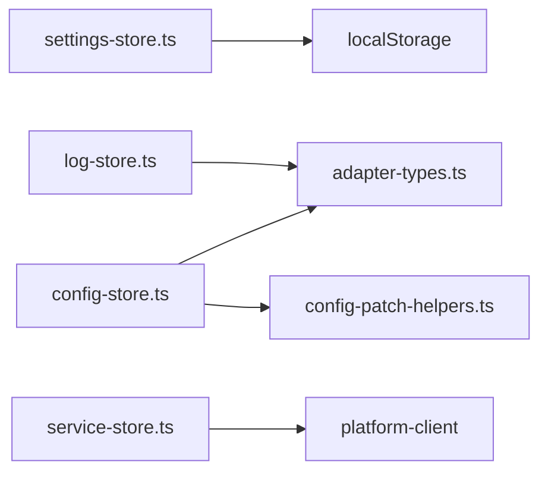

# 系统设置 Store

<cite>
**本文档引用的文件**
- [settings-store.ts](file://src/store/console-stores/settings-store.ts)
- [config-store.ts](file://src/store/console-stores/config-store.ts)
- [service-store.ts](file://src/store/console-stores/service-store.ts)
- [log-store.ts](file://src/store/console-stores/log-store.ts)
- [adapter-types.ts](file://src/gateway/adapter-types.ts)
- [config-patch-helpers.ts](file://src/lib/config-patch-helpers.ts)
- [ProvidersSection.tsx](file://src/components/console/settings/ProvidersSection.tsx)
- [ServiceSection.tsx](file://src/components/console/settings/ServiceSection.tsx)
- [LogViewerSection.tsx](file://src/components/console/settings/LogViewerSection.tsx)
- [service-store.test.ts](file://src/store/__tests__/service-store.test.ts)
- [log-store.test.ts](file://src/store/__tests__/log-store.test.ts)
</cite>

## 目录
1. [简介](#简介)
2. [项目结构](#项目结构)
3. [核心组件](#核心组件)
4. [架构总览](#架构总览)
5. [详细组件分析](#详细组件分析)
6. [依赖关系分析](#依赖关系分析)
7. [性能考量](#性能考量)
8. [故障排查指南](#故障排查指南)
9. [结论](#结论)
10. [附录](#附录)

## 简介
本文件为系统设置 Store 模块的综合技术文档，围绕以下四个核心 Store 进行深入解析：
- settings-store：系统配置项的管理、用户偏好设置、全局参数调整
- config-store：配置文件的读取、验证、持久化存储；配置热更新机制；配置备份与恢复；配置变更通知与生命周期管理
- service-store：系统服务的启动、停止、重启管理；服务状态监控与健康检查
- log-store：日志级别配置、日志轮转策略、日志查询与过滤

同时，文档将详细说明配置数据模型（ConfigSchema 接口定义、配置项分类、默认值管理），以及配置变更通知机制、权限控制与审计日志的实现细节，并提供系统配置的最佳实践与安全注意事项。

## 项目结构
系统设置 Store 模块位于前端代码的 store 层，采用 Zustand 状态管理库进行状态建模与更新。各 Store 文件分别负责不同领域的配置与状态管理，通过统一的适配器层与后端网关交互，实现配置读写、服务控制与日志采集。

图表来源
- [settings-store.ts:1-51](file://src/store/console-stores/settings-store.ts#L1-L51)
- [config-store.ts:1-420](file://src/store/console-stores/config-store.ts#L1-L420)
- [service-store.ts:1-205](file://src/store/console-stores/service-store.ts#L1-L205)
- [log-store.ts:1-108](file://src/store/console-stores/log-store.ts#L1-L108)
- [adapter-types.ts:350-458](file://src/gateway/adapter-types.ts#L350-L458)
- [config-patch-helpers.ts:1-158](file://src/lib/config-patch-helpers.ts#L1-L158)

章节来源
- [settings-store.ts:1-51](file://src/store/console-stores/settings-store.ts#L1-L51)
- [config-store.ts:1-420](file://src/store/console-stores/config-store.ts#L1-L420)
- [service-store.ts:1-205](file://src/store/console-stores/service-store.ts#L1-L205)
- [log-store.ts:1-108](file://src/store/console-stores/log-store.ts#L1-L108)
- [adapter-types.ts:350-458](file://src/gateway/adapter-types.ts#L350-L458)
- [config-patch-helpers.ts:1-158](file://src/lib/config-patch-helpers.ts#L1-L158)

## 核心组件
本节对四大 Store 的职责、数据模型与关键方法进行概览性说明，帮助读者快速建立整体认知。

- settings-store
  - 职责：管理主题、语言、开发者模式等用户偏好设置，基于 localStorage 实现持久化。
  - 关键状态：theme、language、devModeUnlocked
  - 关键方法：setTheme、setLanguage、setDevModeUnlocked
  - 存储：localStorage 键值映射

- config-store
  - 职责：配置读取、保存、应用、补丁更新；schema 提示；状态与更新执行；生命周期与重启状态管理。
  - 关键状态：config、hash、configPath、configRaw、configValid、loading、error、schemaHints、status、updateResult、catalogModels、restartState、lifecycleState
  - 关键方法：fetchConfig、saveConfig、applyConfig、patchConfig、fetchSchema、fetchStatus、fetchCatalogModels、runUpdate
  - 生命周期：RestartState、ConfigLifecycleState

- service-store
  - 职责：平台可用性检测、服务状态获取、服务启停控管、自动启动流程。
  - 关键状态：serviceStatus、platformAvailable、loading、error、lastAction
  - 关键方法：checkPlatform、fetchStatus、startService、stopService、restartService、installService、uninstallService、autoStartGateway

- log-store
  - 职责：日志轮询、跟随模式、暂停/恢复、清空日志；带游标与缓冲上限。
  - 关键状态：lines、cursor、following、paused、error
  - 关键方法：startFollow、stopFollow、togglePause、clearLogs
  - 行为：定时轮询、可见性感知暂停、缓冲裁剪

章节来源
- [settings-store.ts:21-50](file://src/store/console-stores/settings-store.ts#L21-L50)
- [config-store.ts:38-91](file://src/store/console-stores/config-store.ts#L38-L91)
- [service-store.ts:13-29](file://src/store/console-stores/service-store.ts#L13-L29)
- [log-store.ts:8-19](file://src/store/console-stores/log-store.ts#L8-L19)

## 架构总览
系统设置 Store 通过适配器层与后端网关交互，实现配置与服务的统一管理。配置相关操作依赖 adapter-types 中的类型定义，确保前后端契约一致；服务控制通过 platform-client 封装；日志通过适配器的 logsTail 接口实现流式拉取。

图表来源
- [config-store.ts:217-349](file://src/store/console-stores/config-store.ts#L217-L349)
- [adapter-types.ts:352-382](file://src/gateway/adapter-types.ts#L352-L382)

章节来源
- [config-store.ts:217-349](file://src/store/console-stores/config-store.ts#L217-L349)
- [adapter-types.ts:352-382](file://src/gateway/adapter-types.ts#L352-L382)

## 详细组件分析

### settings-store 组件分析
- 功能要点
  - 主题偏好：支持 light、dark、system 三种模式，持久化到 localStorage
  - 语言偏好：默认 zh，支持切换
  - 开发者模式：解锁开关，持久化存储
- 数据模型
  - 状态键：theme、language、devModeUnlocked
  - 本地存储键：openclaw-console-theme、openclaw-console-lang、openclaw-console-dev-mode
- 处理逻辑
  - 初始化从 localStorage 读取默认值
  - 写入时同步更新 localStorage 并触发状态更新
- 安全与权限
  - 仅本地偏好，无敏感信息
  - 建议：避免在多设备间共享该存储键

图表来源
- [settings-store.ts:9-19](file://src/store/console-stores/settings-store.ts#L9-L19)
- [settings-store.ts:31-50](file://src/store/console-stores/settings-store.ts#L31-L50)

章节来源
- [settings-store.ts:1-51](file://src/store/console-stores/settings-store.ts#L1-L51)

### config-store 组件分析
- 功能要点
  - 配置读取：configGet 获取当前配置快照（含 hash、raw、valid、path）
  - 配置保存：configSet 保存新配置，返回写入结果与是否需重启
  - 配置应用：configApply 应用配置并可能触发重启
  - 配置补丁：configPatch 对指定路径进行增量更新
  - Schema 提示：configSchema 返回 UI 建议与版本
  - 状态与更新：statusSummary 获取运行态摘要；modelsList 获取模型目录；updateRun 触发系统更新
  - 生命周期与重启：RestartState、ConfigLifecycleState 管理“生效中/已保存/需重启/CLI重启/重连中/完成”等状态
  - 安全配置一次性应用：applySecurityConfigOnce 在首次连接时应用安全相关配置
- 数据模型
  - ConfigSnapshot：config、hash、raw、valid、path、issues
  - ConfigWriteResult/ConfigPatchResult：ok、config、restart（scheduled/delayMs/coalesced）、error
  - ConfigSchemaResponse：schema、uiHints、version
  - StatusSummary：version、port、uptime、mode、pid、nodeVersion、platform 等
  - ModelCatalogEntry：id、name、provider、contextWindow、reasoning、input
  - UpdateRunResult：ok、result（status/mode/before/after/reason/steps/durationMs）、restart
- 处理逻辑
  - fetchConfig：调用 adapter.configGet，更新 config、hash、configRaw、configValid
  - saveConfig/applyConfig：构造 nextConfig，调用对应 adapter 方法，处理 ok/error、冲突回退、fetchConfig 刷新
  - patchConfig：对 patch 进行 JSON 序列化，调用 adapter.configPatch，处理重启调度与刷新
  - 生命周期：setLifecycleFromWriteResult 根据 restart.scheduled 与 fallbackCommand 设置生命周期状态
  - 安全配置：首次连接时对 gateway.controlUi.dangerouslyDisableDeviceAuth 与 allowInsecureAuth 打开
- 变更通知机制
  - 通过 lifecycleState 与 restartState 通知 UI 当前配置变更所处阶段
  - setRuntimeApplied 用于标记“即时生效”的变更
- 权限控制与审计
  - 未在该文件中直接体现细粒度权限控制
  - 建议：结合后端鉴权与审计日志，记录配置变更的用户、时间、内容与结果

图表来源
- [config-store.ts:235-278](file://src/store/console-stores/config-store.ts#L235-L278)
- [config-store.ts:138-175](file://src/store/console-stores/config-store.ts#L138-L175)
- [adapter-types.ts:372-382](file://src/gateway/adapter-types.ts#L372-L382)

章节来源
- [config-store.ts:38-91](file://src/store/console-stores/config-store.ts#L38-L91)
- [config-store.ts:217-349](file://src/store/console-stores/config-store.ts#L217-L349)
- [adapter-types.ts:352-458](file://src/gateway/adapter-types.ts#L352-L458)
- [config-patch-helpers.ts:17-158](file://src/lib/config-patch-helpers.ts#L17-L158)

### service-store 组件分析
- 功能要点
  - 平台可用性检测：checkAvailable 判断平台客户端是否可用
  - 服务状态获取：解析 service.runtime 与 gateway 端口等关键字段
  - 服务启停控管：start/stop/restart/install/uninstall
  - 自动启动：autoStartGateway 支持多次重试与短暂等待
- 数据模型
  - ServiceStatusData：installed、running、pid、port
- 处理逻辑
  - fetchStatus：标准化后端返回，设置 normalized 状态
  - 各操作：设置 loading、记录 lastAction（stdout/stderr）、错误处理、成功后刷新状态
  - autoStartGateway：最多三次尝试，每次间隔固定延迟

图表来源
- [service-store.ts:95-110](file://src/store/console-stores/service-store.ts#L95-L110)
- [service-store.ts:56-93](file://src/store/console-stores/service-store.ts#L56-L93)

章节来源
- [service-store.ts:13-29](file://src/store/console-stores/service-store.ts#L13-L29)
- [service-store.ts:51-204](file://src/store/console-stores/service-store.ts#L51-L204)

### log-store 组件分析
- 功能要点
  - 日志轮询：按固定间隔拉取最新日志，支持游标 cursor 与分页 limit
  - 跟随模式：startFollow 启动定时轮询；stopFollow 停止轮询并清理资源
  - 可见性感知：页面隐藏时自动暂停，显示时恢复
  - 缓冲管理：最大行数限制与裁剪策略
- 数据模型
  - LogsTailParams：cursor、limit、maxBytes
  - LogsTailResult：file、cursor、size、lines、truncated、reset
- 处理逻辑
  - pollOnce：调用 adapter.logsTail，合并新日志并裁剪至上限
  - startFollow：设置 following/paused，启动轮询与可见性监听
  - stopFollow：清理轮询定时器与事件监听
  - togglePause/clearLogs：控制暂停与清空

图表来源
- [log-store.ts:24-58](file://src/store/console-stores/log-store.ts#L24-L58)
- [log-store.ts:67-98](file://src/store/console-stores/log-store.ts#L67-L98)
- [adapter-types.ts:423-436](file://src/gateway/adapter-types.ts#L423-L436)

章节来源
- [log-store.ts:8-19](file://src/store/console-stores/log-store.ts#L8-L19)
- [log-store.ts:24-98](file://src/store/console-stores/log-store.ts#L24-L98)
- [adapter-types.ts:423-436](file://src/gateway/adapter-types.ts#L423-L436)

## 依赖关系分析
- 组件耦合
  - settings-store 与 localStorage 强耦合，无外部依赖
  - config-store 依赖 adapter-types 的类型定义与 adapter 提供的配置接口
  - service-store 依赖 platform-client 的服务控制接口
  - log-store 依赖 adapter-types 的日志接口
- 外部依赖
  - adapter-provider：waitForAdapter 确保适配器可用后再发起请求
  - localStorage：settings-store 的持久化基础
- 循环依赖
  - 未发现循环依赖迹象，模块职责清晰

图表来源
- [settings-store.ts:1-51](file://src/store/console-stores/settings-store.ts#L1-L51)
- [config-store.ts:1-11](file://src/store/console-stores/config-store.ts#L1-L11)
- [service-store.ts:1-3](file://src/store/console-stores/service-store.ts#L1-L3)
- [log-store.ts:1-2](file://src/store/console-stores/log-store.ts#L1-L2)
- [config-patch-helpers.ts:1-2](file://src/lib/config-patch-helpers.ts#L1-L2)

章节来源
- [config-store.ts:1-11](file://src/store/console-stores/config-store.ts#L1-L11)
- [service-store.ts:1-3](file://src/store/console-stores/service-store.ts#L1-L3)
- [log-store.ts:1-2](file://src/store/console-stores/log-store.ts#L1-L2)
- [config-patch-helpers.ts:1-2](file://src/lib/config-patch-helpers.ts#L1-L2)

## 性能考量
- 配置读取与更新
  - 使用 hash 进行并发写入保护，避免覆盖他人变更
  - 保存/应用后主动 fetchConfig 刷新，减少 UI 不一致
- 日志轮询
  - 固定轮询间隔与最大行数限制，防止内存膨胀
  - 页面不可见时自动暂停，降低资源消耗
- 服务控制
  - 启动/重启后短暂等待再刷新状态，提升用户体验
  - 最多重试次数与固定延迟，避免频繁重试导致压力

[本节为通用性能建议，不直接分析具体文件]

## 故障排查指南
- 配置相关
  - 冲突错误：当提示“配置已变更”，优先重新加载配置并确认最新状态
  - 生命周期状态异常：关注 lifecycleState.status 与 restartState.status，必要时手动触发 fetchConfig
  - 安全配置：首次连接后会尝试应用安全相关配置，若失败可稍后重试
- 服务相关
  - 平台不可用：检查平台客户端可用性，确认网络与后端服务状态
  - 启停失败：查看 lastAction.message（stdout/stderr）定位问题
  - 自动启动：观察 autoStartGateway 的重试次数与延迟
- 日志相关
  - 无法跟随：检查轮询定时器与可见性监听是否正常
  - 日志缺失：确认 adapter.logsTail 返回的 cursor 是否前进

章节来源
- [config-store.ts:264-267](file://src/store/console-stores/config-store.ts#L264-L267)
- [config-store.ts:188-213](file://src/store/console-stores/config-store.ts#L188-L213)
- [service-store.ts:184-203](file://src/store/console-stores/service-store.ts#L184-L203)
- [log-store.ts:77-98](file://src/store/console-stores/log-store.ts#L77-L98)

## 结论
系统设置 Store 模块通过四个独立但相互协作的 Store，实现了用户偏好、配置管理、服务控制与日志采集的完整闭环。其设计遵循“状态集中、职责单一、类型明确”的原则，配合适配器层与类型定义，确保了前后端一致性与可维护性。建议在生产环境中进一步完善权限控制与审计日志，以满足企业级安全合规要求。

[本节为总结性内容，不直接分析具体文件]

## 附录

### 配置数据模型与接口定义
- ConfigSnapshot：包含配置对象、哈希、原始文本、有效性、路径与校验问题列表
- ConfigWriteResult/ConfigPatchResult：包含写入结果、配置对象、重启调度信息与错误描述
- ConfigSchemaResponse：包含 schema、UI 提示与版本
- StatusSummary：包含版本、端口、运行时长、模式、进程 ID、Node 版本与平台信息
- ModelCatalogEntry：包含模型标识、名称、提供商、上下文窗口、推理能力与输入类型
- LogsTailParams/LogsTailResult：包含游标、限制、最大字节数与日志行、截断与重置标志
- UpdateRunResult：包含更新执行结果、步骤明细与重启调度

章节来源
- [adapter-types.ts:352-458](file://src/gateway/adapter-types.ts#L352-L458)

### 配置变更通知机制与生命周期
- RestartState：重启状态（pending/disconnected/reconnecting/complete）与开始时间、预计延迟
- ConfigLifecycleState：生命周期状态（effective-now/saved-hot-reload/saved-restart-required/saved-cli-restart-required/apply-restarting/disconnected/reconnecting/complete）与来源、开始时间、命令与消息键
- setLifecycleFromWriteResult：根据写入结果与来源设置生命周期状态，处理重启调度与 CLI 命令回退
- setRuntimeApplied：标记“即时生效”的变更

章节来源
- [config-store.ts:13-36](file://src/store/console-stores/config-store.ts#L13-L36)
- [config-store.ts:138-186](file://src/store/console-stores/config-store.ts#L138-L186)

### 权限控制与审计日志
- 权限控制
  - 未在 settings-store 与 config-store 中直接体现细粒度权限控制
  - 建议：结合后端鉴权与 RBAC，限制配置变更与服务控制的操作范围
- 审计日志
  - 建议：在后端记录配置变更的用户、时间、IP、变更内容与结果
  - 前端可记录关键操作（如 applyConfig/saveConfig）的时间戳与结果，便于问题追踪

[本节为通用建议，不直接分析具体文件]

### 最佳实践与安全注意事项
- 配置管理
  - 使用 hash 防止并发覆盖；保存/应用后及时刷新
  - 对敏感配置使用 UI 提示与二次确认
- 服务控制
  - 启停操作前进行状态检查；失败时查看 lastAction 的 stdout/stderr
  - 自动启动应设置合理的重试次数与延迟
- 日志管理
  - 合理设置轮询间隔与缓冲上限，避免内存占用过高
  - 页面不可见时自动暂停，恢复时再继续
- 安全
  - 首次连接时应用安全配置（如禁用设备认证与允许不安全认证），后续谨慎调整
  - 对高危操作（如 CLI 重启）提供明确提示与确认

[本节为通用建议，不直接分析具体文件]