# 状态管理系统

<cite>
**本文档引用的文件**
- [office-store.ts](file://src/store/office-store.ts)
- [office-agent-helpers.ts](file://src/store/office-agent-helpers.ts)
- [office-movement.ts](file://src/store/office-movement.ts)
- [office-collaboration.ts](file://src/store/office-collaboration.ts)
- [agent-reducer.ts](file://src/store/agent-reducer.ts)
- [metrics-reducer.ts](file://src/store/metrics-reducer.ts)
- [meeting-manager.ts](file://src/store/meeting-manager.ts)
- [agents-store.ts](file://src/store/console-stores/agents-store.ts)
- [channels-store.ts](file://src/store/console-stores/channels-store.ts)
- [skills-store.ts](file://src/store/console-stores/skills-store.ts)
- [cron-store.ts](file://src/store/console-stores/cron-store.ts)
- [config-store.ts](file://src/store/console-stores/config-store.ts)
- [chat-dock-store.ts](file://src/store/console-stores/chat-dock-store.ts)
- [chat-message-normalizer.ts](file://src/store/console-stores/chat-message-normalizer.ts)
- [chat-session-helpers.ts](file://src/store/console-stores/chat-session-helpers.ts)
- [toast-store.ts](file://src/store/toast-store.ts)
- [auth-store.ts](file://src/store/auth-store.ts)
- [auth-credentials.ts](file://src/gateway/auth-credentials.ts)
- [types.ts](file://src/gateway/types.ts)
- [local-persistence.ts](file://src/lib/local-persistence.ts)
- [office-store.test.ts](file://src/store/__tests__/office-store.test.ts)
- [agents-store.test.ts](file://src/store/__tests__/agents-store.test.ts)
- [auth-store.test.ts](file://src/store/__tests__/auth-store.test.ts)
- [AuthGate.tsx](file://src/components/auth/AuthGate.tsx)
- [LoginGate.tsx](file://src/components/auth/LoginGate.tsx)
- [App.tsx](file://src/App.tsx)
- [useGatewayConnection.ts](file://src/hooks/useGatewayConnection.ts)
</cite>

## 更新摘要
**所做更改**
- 新增认证状态管理模块（auth-store）和相关认证凭证管理功能
- 增强状态订阅机制，支持更精细的组件状态监听
- 更新应用启动流程，集成认证状态管理到应用生命周期
- 新增认证状态与网关连接的深度集成
- 扩展状态持久化策略，支持认证凭据的本地存储

## 目录
1. [简介](#简介)
2. [项目结构](#项目结构)
3. [核心组件](#核心组件)
4. [架构总览](#架构总览)
5. [详细组件分析](#详细组件分析)
6. [模块化架构设计](#模块化架构设计)
7. [依赖关系分析](#依赖关系分析)
8. [性能考虑](#性能考虑)
9. [故障排除指南](#故障排除指南)
10. [结论](#结论)
11. [附录](#附录)

## 简介
本文件系统性梳理 OpenClaw Office 的状态管理系统，基于 Zustand 5 + Immer 的轻量级架构，围绕重构后的 Office Store 模块化架构（智能体状态管理、协作关系维护、2D办公室渲染状态）、控制台 Store 系统（agents-store、channels-store、skills-store、cron-store 等）、**新增的认证状态管理模块（auth-store）**、**增强的状态订阅与更新机制**、reducer 模式应用（metrics-reducer、agent-reducer）、以及状态持久化策略与性能优化进行深入解析。文档同时提供最佳实践与使用示例，帮助开发者快速理解并扩展状态管理能力。

## 项目结构
状态管理相关代码主要分布在以下目录：
- 核心状态：src/store 下的 office-store.ts、office-agent-helpers.ts、office-movement.ts、office-collaboration.ts、agent-reducer.ts、metrics-reducer.ts、meeting-manager.ts
- 控制台状态：src/store/console-stores 下的 agents-store.ts、channels-store.ts、skills-store.ts、cron-store.ts、config-store.ts、chat-dock-store.ts、chat-message-normalizer.ts、chat-session-helpers.ts、toast-store.ts
- **认证状态：src/store 下的 auth-store.ts，认证凭证管理：src/gateway/auth-credentials.ts**
- **访问控制组件：src/components/auth 下的 AuthGate.tsx、LoginGate.tsx**
- **应用入口：src/App.tsx 集成认证状态管理**
- **网关连接：src/hooks/useGatewayConnection.ts 集成认证状态**
- 类型定义：src/gateway/types.ts
- 持久化：src/lib/local-persistence.ts
- 测试：src/store/__tests__ 下的 office-store.test.ts、agents-store.test.ts、**auth-store.test.ts**

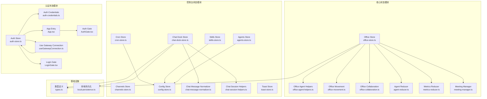

**图表来源**
- [office-store.ts:1-61](file://src/store/office-store.ts#L1-L61)
- [office-agent-helpers.ts:1-205](file://src/store/office-agent-helpers.ts#L1-L205)
- [office-movement.ts:1-213](file://src/store/office-movement.ts#L1-L213)
- [office-collaboration.ts:1-204](file://src/store/office-collaboration.ts#L1-L204)
- [chat-dock-store.ts:25-41](file://src/store/console-stores/chat-dock-store.ts#L25-L41)
- [auth-store.ts:1-108](file://src/store/auth-store.ts#L1-L108)
- [auth-credentials.ts:1-116](file://src/gateway/auth-credentials.ts#L1-L116)
- [AuthGate.tsx:1-24](file://src/components/auth/AuthGate.tsx#L1-L24)
- [LoginGate.tsx:1-186](file://src/components/auth/LoginGate.tsx#L1-L186)
- [App.tsx:1-146](file://src/App.tsx#L1-L146)
- [useGatewayConnection.ts:1-286](file://src/hooks/useGatewayConnection.ts#L1-L286)

**章节来源**
- [office-store.ts:1-61](file://src/store/office-store.ts#L1-L61)
- [types.ts:1-402](file://src/gateway/types.ts#L1-L402)

## 核心组件
- Office Store：负责 2D 办公室渲染状态、智能体可视化、协作关系维护、移动动画与会议室调度、全局指标计算与事件历史记录。现已重构为模块化架构，通过专用模块处理不同功能领域。
- Office Agent Helpers：处理智能体创建、位置分配、占位符管理、父子关系解析等基础功能。
- Office Movement：管理智能体移动调度、区域迁移、退休定时器等移动相关逻辑。
- Office Collaboration：维护协作链接、会议室调度、同级代理协作等功能。
- Agent Reducer：将 Agent 事件流转换为智能体可视化状态，包括状态机、工具调用计数、语音气泡、延迟空闲等。
- Metrics Reducer：计算全局指标（活跃智能体数、总智能体数、协作热度等）。
- Meeting Manager：检测协作强度，生成会议室分组，分配座位，触发/返回会议室。
- 控制台 Stores：agents-store、channels-store、skills-store、cron-store、config-store、chat-dock-store、toast-store，分别管理控制台页面的数据与交互状态。
- Chat Message Normalizer：标准化聊天消息格式，处理附件、工具调用、思维内容等。
- Chat Session Helpers：管理会话状态、持久化、偏好设置等会话相关功能。
- **Auth Store：管理用户认证状态、凭据存储、登录表单预填充、认证状态切换。**
- **Auth Credentials：提供认证凭据的本地存储、加载、清理和错误分类功能。**
- **Auth Gate：应用级别的访问控制组件，保护整个应用直到用户通过认证。**
- **Login Gate：认证登录界面组件，提供表单输入和认证流程。**
- **Use Gateway Connection：集成认证状态的网关连接管理，处理认证失败和状态切换。**
- 类型系统：统一定义事件、可视化智能体、协作链接、全局指标等类型。

**章节来源**
- [office-store.ts:217-760](file://src/store/office-store.ts#L217-L760)
- [office-agent-helpers.ts:9-67](file://src/store/office-agent-helpers.ts#L9-L67)
- [office-movement.ts:12-81](file://src/store/office-movement.ts#L12-L81)
- [office-collaboration.ts:34-118](file://src/store/office-collaboration.ts#L34-L118)
- [agent-reducer.ts:19-67](file://src/store/agent-reducer.ts#L19-L67)
- [metrics-reducer.ts:3-27](file://src/store/metrics-reducer.ts#L3-L27)
- [meeting-manager.ts:32-135](file://src/store/meeting-manager.ts#L32-L135)
- [chat-message-normalizer.ts:12-26](file://src/store/console-stores/chat-message-normalizer.ts#L12-L26)
- [chat-session-helpers.ts:6-150](file://src/store/console-stores/chat-session-helpers.ts#L6-L150)
- [auth-store.ts:10-27](file://src/store/auth-store.ts#L10-L27)
- [auth-credentials.ts:1-116](file://src/gateway/auth-credentials.ts#L1-L116)
- [AuthGate.tsx:10-23](file://src/components/auth/AuthGate.tsx#L10-L23)
- [LoginGate.tsx:1-186](file://src/components/auth/LoginGate.tsx#L1-L186)
- [useGatewayConnection.ts:43-65](file://src/hooks/useGatewayConnection.ts#L43-L65)
- [types.ts:166-370](file://src/gateway/types.ts#L166-L370)

## 架构总览
Zustand 5 + Immer 架构采用中间件增强不可变更新，Office Store 作为核心状态容器，通过模块化设计将复杂功能分解为专用模块，其他 Store 作为功能域状态容器，通过共享类型与工具函数协同工作。**新增的认证状态管理模块为整个应用提供安全的访问控制，通过 AuthGate 组件保护应用路由，LoginGate 提供认证界面，useGatewayConnection 集成认证状态管理到网关连接流程中。**

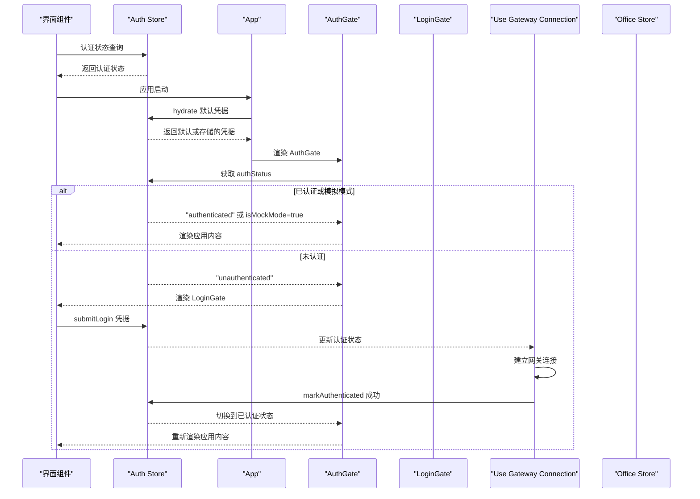

**图表来源**
- [auth-store.ts:29-107](file://src/store/auth-store.ts#L29-L107)
- [App.tsx:99-103](file://src/App.tsx#L99-L103)
- [AuthGate.tsx:15-23](file://src/components/auth/AuthGate.tsx#L15-L23)
- [LoginGate.tsx:26-39](file://src/components/auth/LoginGate.tsx#L26-L39)
- [useGatewayConnection.ts:137-154](file://src/hooks/useGatewayConnection.ts#L137-L154)

## 详细组件分析

### Office Store：模块化智能体可视化与协作渲染
- 关键职责
  - 智能体生命周期管理：addAgent、updateAgent、removeAgent、initAgents、syncMainAgents
  - 子智能体管理：addSubAgent、removeSubAgent、retireSubAgent、确认流程（confirmAgent）
  - 移动动画：startMovement、tickMovement、completeMovement、会议室移动 moveToMeeting、returnFromMeeting
  - 协作关系：基于事件解析与助手协作提示构建协作链接，支持手动会议 requestMeeting/dismissMeeting
  - 全局指标：computeMetrics、updateMetrics
  - 事件历史：processAgentEvent、eventHistory 限制与持久化
  - UI 状态：主题、侧边栏、当前页、聊天面板高度等

- 模块化架构优势
  - 将复杂逻辑分解为专用模块，提高代码可维护性和可测试性
  - 通过接口抽象隐藏实现细节，降低模块间耦合
  - 支持独立开发和单元测试，加快开发迭代速度

- 状态结构要点
  - agents: Map<string, VisualAgent>
  - links: CollaborationLink[]
  - globalMetrics: GlobalMetrics
  - runIdMap: Map<string, string>
  - sessionKeyMap: Map<string, string[]>
  - eventHistory: EventHistoryItem[]（上限 200）

- 处理流程（事件到状态）
  - 解析 Agent 事件 -> 应用到对应智能体 -> 更新全局指标 -> 触发移动/会议室逻辑 -> 记录事件历史

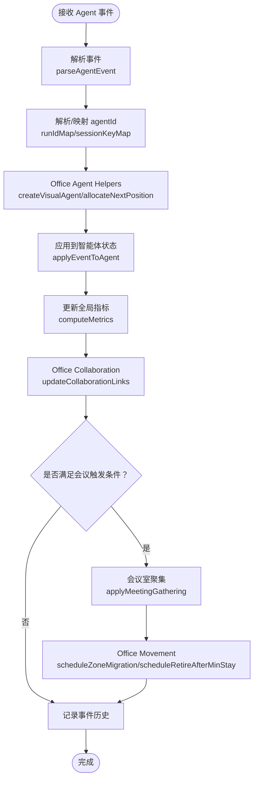

**图表来源**
- [office-store.ts:762-850](file://src/store/office-store.ts#L762-L850)
- [office-agent-helpers.ts:9-67](file://src/store/office-agent-helpers.ts#L9-L67)
- [office-movement.ts:30-81](file://src/store/office-movement.ts#L30-L81)
- [office-collaboration.ts:34-118](file://src/store/office-collaboration.ts#L34-L118)
- [agent-reducer.ts:19-67](file://src/store/agent-reducer.ts#L19-L67)
- [metrics-reducer.ts:3-27](file://src/store/metrics-reducer.ts#L3-L27)
- [meeting-manager.ts:105-135](file://src/store/meeting-manager.ts#L105-L135)

**章节来源**
- [office-store.ts:217-760](file://src/store/office-store.ts#L217-L760)
- [types.ts:166-370](file://src/gateway/types.ts#L166-L370)

### Office Agent Helpers：智能体基础功能模块
- 职责
  - 智能体创建：createVisualAgent（支持主智能体和子智能体）
  - 位置分配：allocateNextPosition（支持大厅、工位、热座）
  - 占位符管理：nextPlaceholderIndex、activateFromLoungePlaceholder
  - 父子关系解析：isRegisteredMainAgentId、extractParentFromSessionKey
  - 位置标识：positionKey

- 关键机制
  - 条件创建：未确认智能体创建特殊状态，确认后转为正常状态
  - 区域分配：根据智能体类型和区域动态分配位置
  - 会话映射：通过 sessionKeyMap 解析智能体关系
  - 位置去重：使用 positionKey 避免位置冲突

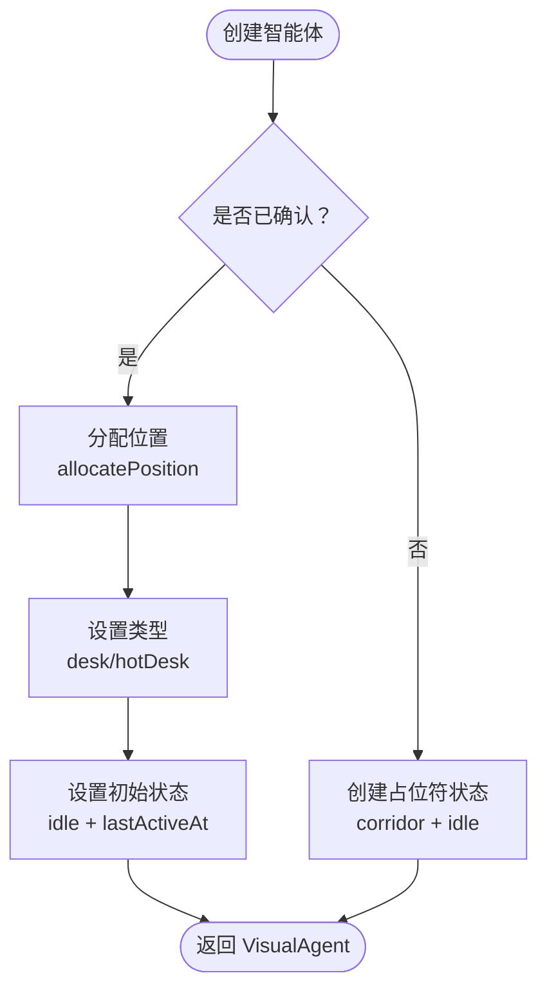

**图表来源**
- [office-agent-helpers.ts:9-67](file://src/store/office-agent-helpers.ts#L9-L67)
- [office-agent-helpers.ts:84-106](file://src/store/office-agent-helpers.ts#L84-L106)
- [office-agent-helpers.ts:146-168](file://src/store/office-agent-helpers.ts#L146-L168)

**章节来源**
- [office-agent-helpers.ts:9-205](file://src/store/office-agent-helpers.ts#L9-L205)

### Office Movement：移动调度与区域管理
- 职责
  - 活动状态检测：isActiveStatus（思考、工具调用、说话、生成）
  - 区域迁移：scheduleZoneMigration（大厅→热座、热座→大厅）
  - 退休调度：scheduleRetireAfterMinStay（子智能体最小停留时间）
  - 会议室返回：scheduleMeetingReturn（主智能体最小停留时间）
  - 定时器管理：cancelRetireTimer、cancelMigrationTimer、cancelMeetingReturnTimer

- 关键机制
  - 状态转换：基于活动状态变化触发区域迁移
  - 延迟机制：LOUNGE_TO_HOTDESK_DEBOUNCE_MS、HOTDESK_TO_LOUNGE_DELAY_MS
  - 最小停留：MIN_HOTDESK_STAY_MS、MIN_MEETING_STAY_MS
  - 循环依赖解决：通过 setMovementStoreGetter 避免循环导入

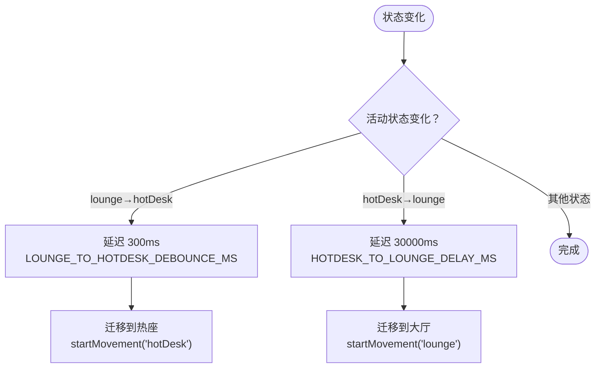

**图表来源**
- [office-movement.ts:30-81](file://src/store/office-movement.ts#L30-L81)
- [office-movement.ts:117-156](file://src/store/office-movement.ts#L117-L156)
- [office-movement.ts:167-212](file://src/store/office-movement.ts#L167-L212)

**章节来源**
- [office-movement.ts:12-213](file://src/store/office-movement.ts#L12-L213)

### Office Collaboration：协作关系与会议室调度
- 职责
  - 协作链接：updateCollaborationLinks（基于 sessionKey 联系智能体）
  - 同级协作：createPeerCollaborationLink（主智能体间直接协作）
  - 会议室调度：scheduleMeetingGathering（节流调度）
  - 链接管理：链接强度衰减、超时清理

- 关键机制
  - 会话匹配：基于 sessionKeyMap 建立协作关系
  - 命名空间：extractSessionNamespace 支持命名空间匹配
  - 强度计算：link.strength 随时间衰减，新活动增加强度
  - 节流控制：MEETING_GATHERING_THROTTLE_MS=500 防止频繁调度
  - 循环依赖解决：通过 setStoreStateGetter 和 setScheduleMeetingReturnFn

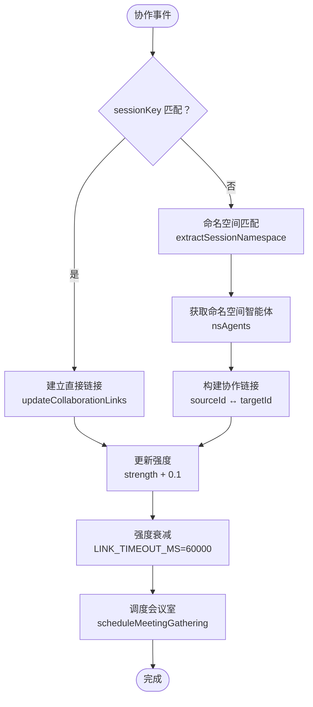

**图表来源**
- [office-collaboration.ts:34-118](file://src/store/office-collaboration.ts#L34-L118)
- [office-collaboration.ts:125-163](file://src/store/office-collaboration.ts#L125-L163)
- [office-collaboration.ts:176-203](file://src/store/office-collaboration.ts#L176-L203)

**章节来源**
- [office-collaboration.ts:34-204](file://src/store/office-collaboration.ts#L34-L204)

### Chat Dock Store：模块化聊天状态管理
- 职责
  - 会话管理：会话创建、切换、持久化
  - 消息处理：消息标准化、流式处理、历史加载
  - 事件驱动：聊天事件、代理事件处理
  - 队列管理：消息队列、流式响应处理

- 模块化优化
  - chat-message-normalizer.ts：消息标准化、附件处理、工具调用重建
  - chat-session-helpers.ts：会话管理、偏好设置、持久化策略

- 关键功能
  - 消息标准化：normalizeHistoryMessages、buildAssistantMessage
  - 会话管理：selectPreferredSessionKey、mergeCurrentSession
  - 附件处理：extractAttachments、normalizeAttachment
  - 思维内容：extractThinkingFromHistoryMessage

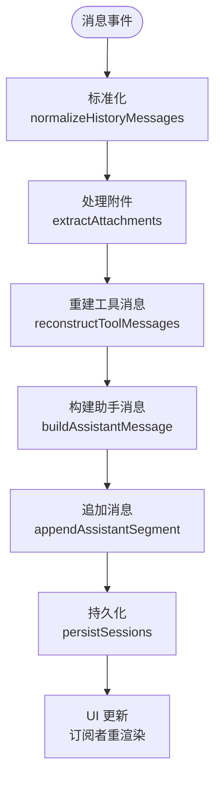

**图表来源**
- [chat-dock-store.ts:80-97](file://src/store/console-stores/chat-dock-store.ts#L80-L97)
- [chat-message-normalizer.ts:170-182](file://src/store/console-stores/chat-message-normalizer.ts#L170-L182)
- [chat-session-helpers.ts:117-120](file://src/store/console-stores/chat-session-helpers.ts#L117-L120)

**章节来源**
- [chat-dock-store.ts:57-107](file://src/store/console-stores/chat-dock-store.ts#L57-L107)
- [chat-message-normalizer.ts:12-261](file://src/store/console-stores/chat-message-normalizer.ts#L12-L261)
- [chat-session-helpers.ts:6-150](file://src/store/console-stores/chat-session-helpers.ts#L6-L150)

### 控制台 Store 系统
- Agents Store（agents-store.ts）
  - 职责：代理列表、模型配置、文件管理、工具/技能/频道/Cron 管理
  - 关键动作：fetchAgents、updateAgentModel、fetchAgentTools、fetchAgentSkills、fetchAgentChannels、fetchAgentCronJobs、add/update/remove/toggleCronJob
  - 依赖：useConfigStore（生命周期状态同步）

- Channels Store（channels-store.ts）
  - 职责：通道状态、QR 登录配对、登出
  - 关键动作：fetchChannels、logoutChannel、startQrPairing、cancelQrPairing

- Skills Store（skills-store.ts）
  - 职责：技能列表、启用/禁用、安装
  - 关键动作：fetchSkills、toggleSkill、installSkill

- Cron Store（cron-store.ts）
  - 职责：Cron 任务管理、运行、事件监听
  - 关键动作：fetchTasks、addTask、updateTask、removeTask、runTask、initEventListeners

- Config Store（config-store.ts）
  - 职责：配置读取/保存/应用、重启状态、生命周期状态
  - 关键动作：fetchConfig、saveConfig、applyConfig、patchConfig、setRuntimeApplied

- Toast Store（toast-store.ts）
  - 职责：通知弹窗管理
  - 关键动作：addToast/removeToast/clearAll

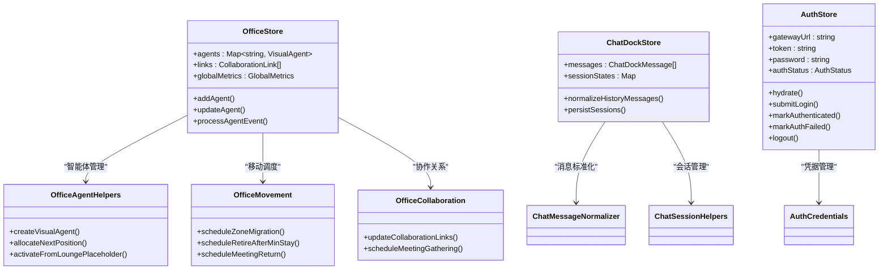

**图表来源**
- [office-store.ts:122-147](file://src/store/office-store.ts#L122-L147)
- [office-agent-helpers.ts:9-67](file://src/store/office-agent-helpers.ts#L9-L67)
- [office-movement.ts:30-81](file://src/store/office-movement.ts#L30-L81)
- [office-collaboration.ts:34-118](file://src/store/office-collaboration.ts#L34-L118)
- [chat-dock-store.ts:25-41](file://src/store/console-stores/chat-dock-store.ts#L25-L41)
- [auth-store.ts:12-27](file://src/store/auth-store.ts#L12-L27)

**章节来源**
- [agents-store.ts:141-642](file://src/store/console-stores/agents-store.ts#L141-L642)
- [channels-store.ts:27-104](file://src/store/console-stores/channels-store.ts#L27-L104)
- [skills-store.ts:84-168](file://src/store/console-stores/skills-store.ts#L84-L168)
- [cron-store.ts:27-125](file://src/store/console-stores/cron-store.ts#L27-L125)
- [config-store.ts:93-420](file://src/store/console-stores/config-store.ts#L93-L420)
- [chat-dock-store.ts:57-107](file://src/store/console-stores/chat-dock-store.ts#L57-L107)
- [toast-store.ts:32-74](file://src/store/toast-store.ts#L32-L74)

### 认证状态管理模块
- Auth Store（auth-store.ts）
  - 职责：管理用户认证状态、凭据存储、登录表单预填充、认证状态切换
  - 关键状态：gatewayUrl、token、password、rememberCredentials、authStatus、authError、defaults
  - 关键动作：hydrate（从存储恢复凭据）、submitLogin（提交登录凭据）、markAuthenticated（标记认证成功）、markAuthFailed（标记认证失败）、logout（退出登录）
  - 认证状态：unauthenticated（未认证）、authenticating（认证中）、authenticated（已认证）

- Auth Credentials（auth-credentials.ts）
  - 职责：提供认证凭据的本地存储、加载、清理和错误分类功能
  - 本地存储：使用 localStorage 存储认证凭据，键名为 "openclaw-office.auth.v1"
  - 错误分类：classifyConnectError 识别认证错误和网络错误
  - 安全处理：redactAuthError 清理错误信息中的敏感内容

- Auth Gate（AuthGate.tsx）
  - 职责：应用级别的访问控制组件，保护整个应用直到用户通过认证
  - 逻辑：当处于模拟模式或认证状态为 authenticated 时显示应用内容，否则显示 LoginGate

- Login Gate（LoginGate.tsx）
  - 职责：认证登录界面组件，提供表单输入和认证流程
  - 功能：表单字段（网关URL、令牌、密码）、记住凭据选项、错误显示、连接状态指示

- Use Gateway Connection（useGatewayConnection.ts）
  - 集成认证状态：监听认证状态变化，根据状态决定是否建立网关连接
  - 认证失败处理：通过 classifyConnectError 识别认证错误，调用 markAuthFailed 回退到登录界面
  - 状态同步：认证成功时调用 markAuthenticated，更新网关连接状态

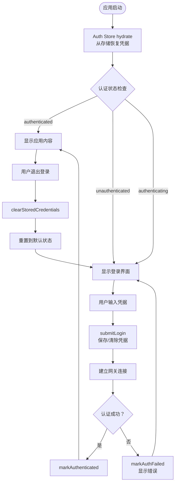

**图表来源**
- [auth-store.ts:29-107](file://src/store/auth-store.ts#L29-L107)
- [auth-credentials.ts:20-66](file://src/gateway/auth-credentials.ts#L20-L66)
- [AuthGate.tsx:15-23](file://src/components/auth/AuthGate.tsx#L15-L23)
- [LoginGate.tsx:26-39](file://src/components/auth/LoginGate.tsx#L26-L39)
- [useGatewayConnection.ts:137-154](file://src/hooks/useGatewayConnection.ts#L137-L154)

**章节来源**
- [auth-store.ts:10-108](file://src/store/auth-store.ts#L10-L108)
- [auth-credentials.ts:1-116](file://src/gateway/auth-credentials.ts#L1-L116)
- [AuthGate.tsx:1-24](file://src/components/auth/AuthGate.tsx#L1-L24)
- [LoginGate.tsx:1-186](file://src/components/auth/LoginGate.tsx#L1-L186)
- [useGatewayConnection.ts:43-199](file://src/hooks/useGatewayConnection.ts#L43-L199)

### 增强的状态订阅与更新机制
- 认证状态订阅
  - AuthGate 通过 useAuthStore((s) => s.authStatus) 订阅认证状态变化
  - LoginGate 订阅多个认证状态字段：gatewayUrl、token、password、rememberCredentials、authStatus、authError
  - App 组件订阅 hydrate 方法，在应用启动时恢复认证状态

- 网关连接状态订阅
  - useGatewayConnection 集成认证状态订阅，根据认证状态决定连接行为
  - 监听网关连接状态变化，自动更新 Office Store 的连接状态

- 组件级状态订阅
  - Office Store 支持细粒度状态订阅，仅在相关状态变化时触发组件重渲染
  - Immer 中间件确保状态更新的不可变性和高效重渲染

- 事件驱动更新
  - Office Store 的 processAgentEvent 将实时事件转换为状态变更
  - 认证状态变化触发应用级别的重新渲染和路由更新

**章节来源**
- [AuthGate.tsx:16](file://src/components/auth/AuthGate.tsx#L16)
- [LoginGate.tsx:9-15](file://src/components/auth/LoginGate.tsx#L9-L15)
- [App.tsx:100-103](file://src/App.tsx#L100-L103)
- [useGatewayConnection.ts:48-65](file://src/hooks/useGatewayConnection.ts#L48-L65)
- [office-store.ts:217-270](file://src/store/office-store.ts#L217-L270)

### Reducer 模式应用
- agent-reducer：将 Agent 事件流转换为智能体可视化状态，包含状态机、工具调用、语音气泡、延迟空闲等
- metrics-reducer：纯函数计算全局指标，输入输出明确，便于测试与复用
- meeting-manager：纯函数协作分组与会议室调度，解耦 Office Store 的业务逻辑
- **auth-reducer：纯函数处理认证状态转换，输入输出明确，便于测试与复用**

**章节来源**
- [agent-reducer.ts:19-103](file://src/store/agent-reducer.ts#L19-L103)
- [metrics-reducer.ts:3-28](file://src/store/metrics-reducer.ts#L3-L28)
- [meeting-manager.ts:32-135](file://src/store/meeting-manager.ts#L32-L135)

### 状态持久化策略
- 本地持久化（IndexedDB）
  - chat-dock-store：消息、会话、事件历史的 IndexedDB 缓存与清理
  - local-persistence：统一的 IndexedDB 封装，支持配额检查、过期清理、批量写入
- **认证凭据持久化**
  - auth-credentials：使用 localStorage 存储认证凭据，键名为 "openclaw-office.auth.v1"
  - 支持凭据的加载、保存、清除功能，提供安全的凭据管理
- 服务器持久化
  - chat-dock-store：会话信息同步到服务器
- 本地存储
  - Office Store：主题、聊天面板高度等 UI 状态持久化到 localStorage
  - Chat Dock Store：会话偏好设置持久化到 localStorage

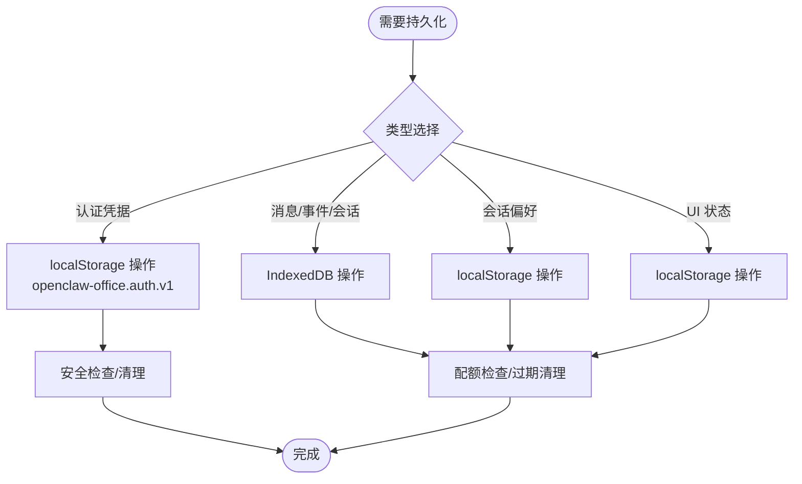

**图表来源**
- [chat-dock-store.ts:504-507](file://src/store/console-stores/chat-dock-store.ts#L504-L507)
- [chat-session-helpers.ts:20-38](file://src/store/console-stores/chat-session-helpers.ts#L20-L38)
- [local-persistence.ts:34-86](file://src/lib/local-persistence.ts#L34-L86)
- [auth-credentials.ts:20-66](file://src/gateway/auth-credentials.ts#L20-L66)
- [office-store.ts:65-84](file://src/store/office-store.ts#L65-L84)

**章节来源**
- [chat-dock-store.ts:504-507](file://src/store/console-stores/chat-dock-store.ts#L504-L507)
- [chat-session-helpers.ts:20-38](file://src/store/console-stores/chat-session-helpers.ts#L20-L38)
- [local-persistence.ts:34-408](file://src/lib/local-persistence.ts#L34-L408)
- [auth-credentials.ts:20-116](file://src/gateway/auth-credentials.ts#L20-L116)
- [office-store.ts:65-84](file://src/store/office-store.ts#L65-L84)

## 模块化架构设计
Office Store 系统重构为模块化架构，通过专用模块处理不同功能领域，提高了代码的可维护性、可测试性和可扩展性。**新增的认证状态管理模块进一步完善了系统的模块化设计，将安全控制与业务逻辑分离。**

### 模块划分原则
- **单一职责**：每个模块专注于特定功能领域
- **接口抽象**：通过清晰的接口定义模块边界
- **依赖注入**：使用 getter 函数避免循环依赖
- **独立测试**：模块可独立进行单元测试
- **安全隔离**：认证模块独立于业务模块，确保安全控制的完整性

### 模块间交互
- Office Store 作为协调者，调用各专用模块处理具体功能
- 认证模块通过 AuthGate 组件与应用路由集成，提供应用级的安全控制
- 网关连接模块集成认证状态，实现认证与网络连接的协同工作
- 通过回调函数传递依赖，避免直接 import 导致的循环依赖
- 使用 setter 函数注入依赖，确保模块初始化顺序

### 重构收益
- **代码组织**：复杂逻辑分解为小而专注的模块
- **开发效率**：团队可并行开发不同模块
- **测试覆盖**：模块可独立测试，提高测试覆盖率
- **维护性**：修改一个模块不影响其他模块
- **安全性**：认证控制独立管理，提高系统安全性
- **可扩展性**：新增模块不影响现有功能

**章节来源**
- [office-store.ts:42-61](file://src/store/office-store.ts#L42-L61)
- [office-store.ts:1243-1264](file://src/store/office-store.ts#L1243-L1264)
- [auth-store.ts:1-108](file://src/store/auth-store.ts#L1-L108)

## 依赖关系分析
- Office Store 依赖 office-agent-helpers、office-movement、office-collaboration、agent-reducer、metrics-reducer、meeting-manager、types
- 控制台 Stores 依赖 adapter-provider、config-store、i18n、toast-store
- Chat Dock Store 依赖 chat-message-normalizer、chat-session-helpers、local-persistence、server-persistence、i18n
- **Auth Store 依赖 auth-credentials、types**
- **Auth Gate 依赖 Auth Store、Auth Credentials**
- **Login Gate 依赖 Auth Store、i18n**
- **Use Gateway Connection 依赖 Auth Store、Office Store**
- 类型系统贯穿所有模块，保证跨模块一致性

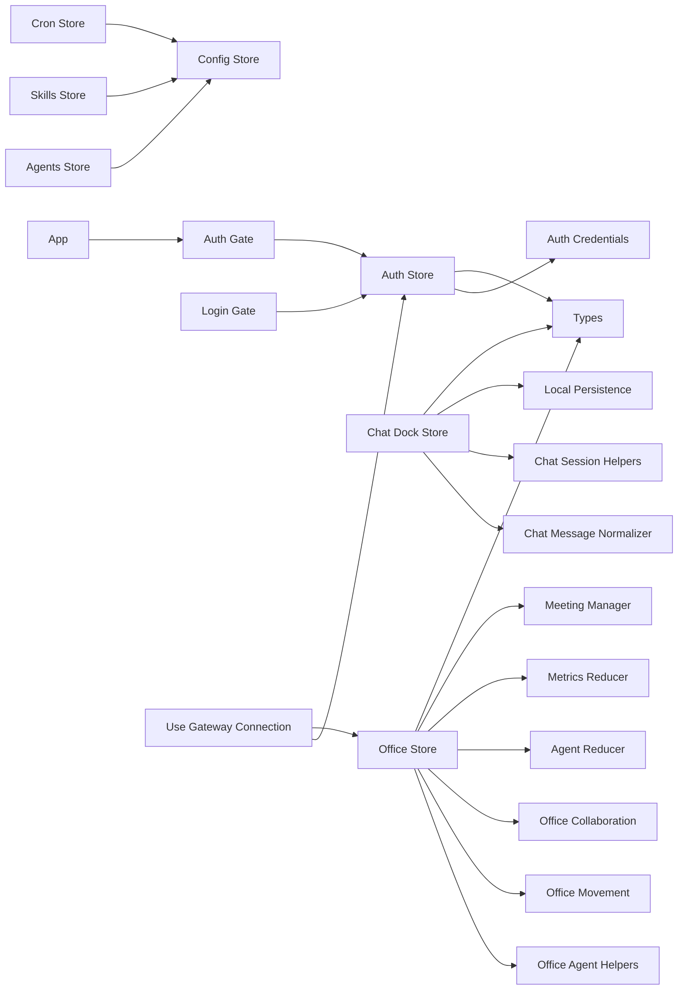

**图表来源**
- [office-store.ts:1-50](file://src/store/office-store.ts#L1-L50)
- [office-agent-helpers.ts:1-8](file://src/store/office-agent-helpers.ts#L1-L8)
- [office-movement.ts:1-10](file://src/store/office-movement.ts#L1-L10)
- [office-collaboration.ts:1-6](file://src/store/office-collaboration.ts#L1-L6)
- [agents-store.ts:1-25](file://src/store/console-stores/agents-store.ts#L1-L25)
- [chat-dock-store.ts:1-18](file://src/store/console-stores/chat-dock-store.ts#L1-L18)
- [auth-store.ts:1-8](file://src/store/auth-store.ts#L1-L8)
- [AuthGate.tsx:1-4](file://src/components/auth/AuthGate.tsx#L1-L4)
- [LoginGate.tsx:1-5](file://src/components/auth/LoginGate.tsx#L1-L5)
- [useGatewayConnection.ts:1-18](file://src/hooks/useGatewayConnection.ts#L1-L18)
- [types.ts:1-402](file://src/gateway/types.ts#L1-L402)
- [local-persistence.ts:1-408](file://src/lib/local-persistence.ts#L1-L408)

**章节来源**
- [office-store.ts:1-50](file://src/store/office-store.ts#L1-L50)
- [agents-store.ts:1-25](file://src/store/console-stores/agents-store.ts#L1-L25)
- [chat-dock-store.ts:1-18](file://src/store/console-stores/chat-dock-store.ts#L1-L18)
- [auth-store.ts:1-108](file://src/store/auth-store.ts#L1-L108)

## 性能考虑
- 不可变更新与 Immer：减少深拷贝开销，提升状态更新效率
- 事件历史限制：EVENT_HISTORY_LIMIT=200，避免内存膨胀
- 延迟空闲机制：MIN_ACTIVE_DISPLAY_MS 防止频繁闪烁，降低 UI 重绘频率
- 会议室节流：MEETING_GATHERING_THROTTLE_MS=500，避免高频调度
- IndexedDB 配额与清理：QUOTA_THRESHOLD=0.8，定期清理过期数据
- Map/Set 结构：agents 使用 Map，links 使用数组，平衡查找与遍历成本
- 模块化优化：专用模块减少不必要的状态更新，提高响应速度
- **认证状态缓存**：Auth Store 避免重复的凭据加载和状态切换
- **细粒度订阅**：组件只订阅必要的状态，减少不必要的重渲染
- **连接状态管理**：根据认证状态智能建立或断开网关连接，节省资源

**章节来源**
- [office-store.ts:39-59](file://src/store/office-store.ts#L39-L59)
- [agent-reducer.ts:4-5](file://src/store/agent-reducer.ts#L4-L5)
- [local-persistence.ts:28-338](file://src/lib/local-persistence.ts#L28-L338)
- [office-movement.ts:3-7](file://src/store/office-movement.ts#L3-L7)
- [auth-store.ts:38-64](file://src/store/auth-store.ts#L38-L64)

## 故障排除指南
- Office Store 事件历史异常增长
  - 检查 EVENT_HISTORY_LIMIT 是否生效，确认事件历史清理逻辑
  - 参考：[office-store.ts:39](file://src/store/office-store.ts#L39)
- 子智能体无法确认/错位
  - 检查 runIdMap/sessionKeyMap 映射是否正确，确认激活/迁移流程
  - 参考：[office-store.ts:762-850](file://src/store/office-store.ts#L762-L850)
- 会议室调度不生效
  - 检查协作强度阈值与允许列表，确认 detectMeetingGroups 结果
  - 参考：[meeting-manager.ts:32-77](file://src/store/meeting-manager.ts#L32-L77)
- 控制台配置写入失败
  - 查看 Config Store 的错误状态与 hash 冲突处理
  - 参考：[config-store.ts:235-278](file://src/store/console-stores/config-store.ts#L235-L278)
- IndexedDB 存储异常
  - 检查配额阈值与清理逻辑，确认事务完成回调
  - 参考：[local-persistence.ts:322-402](file://src/lib/local-persistence.ts#L322-L402)
- 模块化依赖问题
  - 检查模块间的 getter/setter 函数是否正确初始化
  - 参考：[office-store.ts:1243-1264](file://src/store/office-store.ts#L1243-L1264)
- Chat Dock 消息格式异常
  - 检查 chat-message-normalizer 的标准化逻辑
  - 参考：[chat-message-normalizer.ts:170-182](file://src/store/console-stores/chat-message-normalizer.ts#L170-L182)
- **认证凭据存储异常**
  - 检查 localStorage 访问权限，确认存储键名和格式
  - 参考：[auth-credentials.ts:20-66](file://src/gateway/auth-credentials.ts#L20-L66)
- **认证状态不正确**
  - 检查 Auth Store 的 hydrate、submitLogin、markAuthenticated 状态转换
  - 参考：[auth-store.ts:29-107](file://src/store/auth-store.ts#L29-L107)
- **网关连接认证失败**
  - 检查 classifyConnectError 的错误分类，确认 markAuthFailed 是否被调用
  - 参考：[useGatewayConnection.ts:137-154](file://src/hooks/useGatewayConnection.ts#L137-L154)
- **应用无法显示内容**
  - 检查 AuthGate 的认证状态判断，确认 isMockMode 条件
  - 参考：[AuthGate.tsx:18](file://src/components/auth/AuthGate.tsx#L18)

**章节来源**
- [office-store.ts:39-850](file://src/store/office-store.ts#L39-L850)
- [meeting-manager.ts:32-77](file://src/store/meeting-manager.ts#L32-L77)
- [config-store.ts:235-278](file://src/store/console-stores/config-store.ts#L235-L278)
- [local-persistence.ts:322-402](file://src/lib/local-persistence.ts#L322-L402)
- [office-store.ts:1243-1264](file://src/store/office-store.ts#L1243-L1264)
- [chat-message-normalizer.ts:170-182](file://src/store/console-stores/chat-message-normalizer.ts#L170-L182)
- [auth-credentials.ts:20-116](file://src/gateway/auth-credentials.ts#L20-L116)
- [auth-store.ts:29-107](file://src/store/auth-store.ts#L29-L107)
- [useGatewayConnection.ts:137-154](file://src/hooks/useGatewayConnection.ts#L137-L154)
- [AuthGate.tsx:18](file://src/components/auth/AuthGate.tsx#L18)

## 结论
本状态管理系统以 Zustand 5 + Immer 为核心，结合重构后的模块化架构与 reducer 模式，实现了智能体可视化、协作关系与会议室调度的高内聚低耦合设计。**新增的认证状态管理模块为系统提供了完整的安全控制机制，通过 AuthGate 组件实现应用级访问控制，LoginGate 提供用户友好的认证界面，useGatewayConnection 集成认证状态管理到网关连接流程中。** Office Store 通过 office-agent-helpers、office-movement、office-collaboration 三个专用模块，将复杂功能分解为小而专注的组件，显著提升了系统的可维护性和可扩展性。控制台 Store 系统覆盖代理、通道、技能、Cron、配置与聊天等关键领域，配合本地与服务器持久化策略，提供了稳定可靠的用户体验。**通过增强的状态订阅机制和细粒度的组件状态监听，系统实现了高效的 UI 更新和响应。**通过严格的事件历史限制、配额检查与节流机制，系统在复杂场景下仍能保持良好性能与可维护性。

## 附录
- 最佳实践
  - 使用 Immer 中间件进行不可变更新，避免深层拷贝
  - 将纯函数逻辑（reducer、工具函数）拆分为独立模块，便于测试与复用
  - 对高频操作（如事件历史、会议室调度、认证状态）设置节流/限制，防止性能抖动
  - 在 Store 层统一处理错误与生命周期状态，UI 层专注渲染
  - 对关键状态（如主题、聊天面板高度、认证凭据）使用 localStorage 持久化
  - 采用模块化设计，遵循单一职责原则，避免循环依赖
  - 使用 getter/setter 函数注入依赖，确保模块初始化顺序
  - **实现细粒度的状态订阅，只订阅必要的状态字段，减少重渲染**
  - **将安全控制与业务逻辑分离，确保认证状态的独立管理和安全性**
  - **在应用启动时集成认证状态管理，确保用户会话的连续性**
- 使用示例（路径引用）
  - 初始化智能体：[office-store.ts:706-726](file://src/store/office-store.ts#L706-L726)
  - 处理 Agent 事件：[office-store.ts:762-850](file://src/store/office-store.ts#L762-L850)
  - 更新代理模型配置：[agents-store.ts:403-449](file://src/store/console-stores/agents-store.ts#L403-L449)
  - 技能启用/禁用：[skills-store.ts:112-132](file://src/store/console-stores/skills-store.ts#L112-L132)
  - Cron 任务增删改查：[cron-store.ts:35-87](file://src/store/console-stores/cron-store.ts#L35-L87)
  - 会话历史加载：[chat-dock-store.ts:86-88](file://src/store/console-stores/chat-dock-store.ts#L86-L88)
  - 添加通知：[toast-store.ts:59-74](file://src/store/toast-store.ts#L59-L74)
  - 智能体创建：[office-agent-helpers.ts:9-67](file://src/store/office-agent-helpers.ts#L9-L67)
  - 移动调度：[office-movement.ts:30-81](file://src/store/office-movement.ts#L30-L81)
  - 协作链接：[office-collaboration.ts:34-118](file://src/store/office-collaboration.ts#L34-L118)
  - 消息标准化：[chat-message-normalizer.ts:170-182](file://src/store/console-stores/chat-message-normalizer.ts#L170-L182)
  - 会话管理：[chat-session-helpers.ts:45-55](file://src/store/console-stores/chat-session-helpers.ts#L45-L55)
  - **认证状态管理：[auth-store.ts:29-107](file://src/store/auth-store.ts#L29-L107)**
  - **认证凭据管理：[auth-credentials.ts:20-66](file://src/gateway/auth-credentials.ts#L20-L66)**
  - **应用认证集成：[App.tsx:99-103](file://src/App.tsx#L99-L103)**
  - **网关连接认证：[useGatewayConnection.ts:137-154](file://src/hooks/useGatewayConnection.ts#L137-L154)**