# 状态订阅和更新机制

<cite>
**本文档引用的文件**
- [office-store.ts](file://src/store/office-store.ts)
- [agents-store.ts](file://src/store/console-stores/agents-store.ts)
- [channels-store.ts](file://src/store/console-stores/channels-store.ts)
- [config-store.ts](file://src/store/console-stores/config-store.ts)
- [skill-workbench-store.ts](file://src/store/console-stores/skill-workbench-store.ts)
- [chat-dock-store.ts](file://src/store/console-stores/chat-dock-store.ts)
- [toast-store.ts](file://src/store/toast-store.ts)
- [ws-client.ts](file://src/gateway/ws-client.ts)
- [rpc-client.ts](file://src/gateway/rpc-client.ts)
- [adapter-provider.ts](file://src/gateway/adapter-provider.ts)
- [event-parser.ts](file://src/gateway/event-parser.ts)
- [useSubAgentPoller.ts](file://src/hooks/useSubAgentPoller.ts)
- [useUsagePoller.ts](file://src/hooks/useUsagePoller.ts)
- [local-persistence.ts](file://src/lib/local-persistence.ts)
- [metrics-reducer.ts](file://src/store/metrics-reducer.ts)
</cite>

## 目录
1. [引言](#引言)
2. [项目结构](#项目结构)
3. [核心组件](#核心组件)
4. [架构概览](#架构概览)
5. [详细组件分析](#详细组件分析)
6. [依赖关系分析](#依赖关系分析)
7. [性能考虑](#性能考虑)
8. [故障排除指南](#故障排除指南)
9. [结论](#结论)

## 引言

本文件深入解析OpenClaw-Office项目中的状态订阅和更新机制，涵盖Zustand状态管理模式、WebSocket事件处理、RPC调用响应、定时轮询机制以及性能优化策略。文档特别关注以下方面：

- Zustand订阅模式：useStore订阅、selector优化、状态变更通知机制
- 异步状态更新：WebSocket事件处理、RPC调用响应、定时轮询机制
- 性能优化：immer中间件的不可变更新、批量状态更新、状态压缩策略
- 组件级别订阅：useSelector钩子使用、状态选择器优化、避免不必要的重渲染
- 全局状态同步：跨组件状态共享、状态持久化、本地存储集成
- 调试工具、性能监控指标、常见问题排查

## 项目结构

项目采用模块化的状态管理架构，主要分为以下层次：

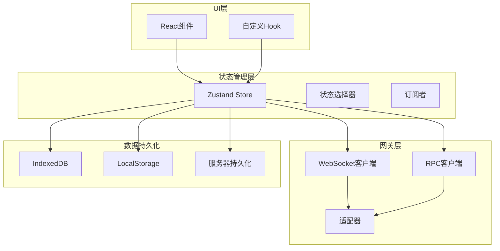

**图表来源**
- [office-store.ts:217-800](file://src/store/office-store.ts#L217-L800)
- [ws-client.ts:22-304](file://src/gateway/ws-client.ts#L22-L304)
- [rpc-client.ts:17-63](file://src/gateway/rpc-client.ts#L17-L63)

**章节来源**
- [office-store.ts:1-800](file://src/store/office-store.ts#L1-L800)
- [agents-store.ts:1-642](file://src/store/console-stores/agents-store.ts#L1-L642)
- [channels-store.ts:1-104](file://src/store/console-stores/channels-store.ts#L1-L104)
- [config-store.ts:1-420](file://src/store/console-stores/config-store.ts#L1-L420)

## 核心组件

### Zustand状态管理基础

项目使用Zustand作为状态管理库，通过`create`函数创建store实例，并结合immer中间件实现不可变更新。

关键特性：
- **immer中间件**：自动处理不可变更新，简化状态操作
- **useStore订阅**：组件直接订阅store状态变化
- **selector优化**：通过选择器函数减少不必要的重渲染
- **中间件链**：支持多个中间件组合使用

**章节来源**
- [office-store.ts:1-8](file://src/store/office-store.ts#L1-L8)
- [office-store.ts:217-244](file://src/store/office-store.ts#L217-L244)

### 状态存储分类

项目包含多个专门的状态存储模块：

1. **办公空间状态** (`office-store.ts`)
   - 办公室Agent可视化状态
   - 实时位置跟踪和移动动画
   - 事件历史记录

2. **控制台状态** (`console-stores/`)
   - 代理管理状态
   - 渠道配置状态
   - 配置管理状态
   - 技能工作台状态

3. **聊天状态** (`chat-dock-store.ts`)
   - 实时聊天消息管理
   - 会话历史持久化
   - 工具调用状态跟踪

4. **辅助状态** (`toast-store.ts`)
   - 全局通知系统
   - 错误提示管理

**章节来源**
- [office-store.ts:217-800](file://src/store/office-store.ts#L217-L800)
- [agents-store.ts:40-123](file://src/store/console-stores/agents-store.ts#L40-L123)
- [channels-store.ts:7-25](file://src/store/console-stores/channels-store.ts#L7-L25)
- [config-store.ts:38-91](file://src/store/console-stores/config-store.ts#L38-L91)
- [chat-dock-store.ts:57-107](file://src/store/console-stores/chat-dock-store.ts#L57-L107)
- [toast-store.ts:25-30](file://src/store/toast-store.ts#L25-L30)

## 架构概览

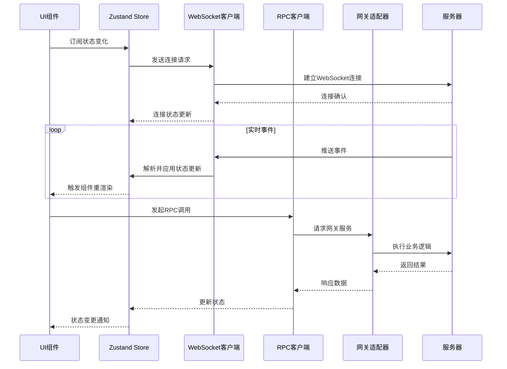

**图表来源**
- [ws-client.ts:104-130](file://src/gateway/ws-client.ts#L104-L130)
- [rpc-client.ts:20-61](file://src/gateway/rpc-client.ts#L20-L61)
- [adapter-provider.ts:50-86](file://src/gateway/adapter-provider.ts#L50-L86)

## 详细组件分析

### 办公室状态管理 (Office Store)

办公室状态管理是整个系统的核心，负责管理所有Agent的可视化状态和实时交互。

#### 状态结构设计

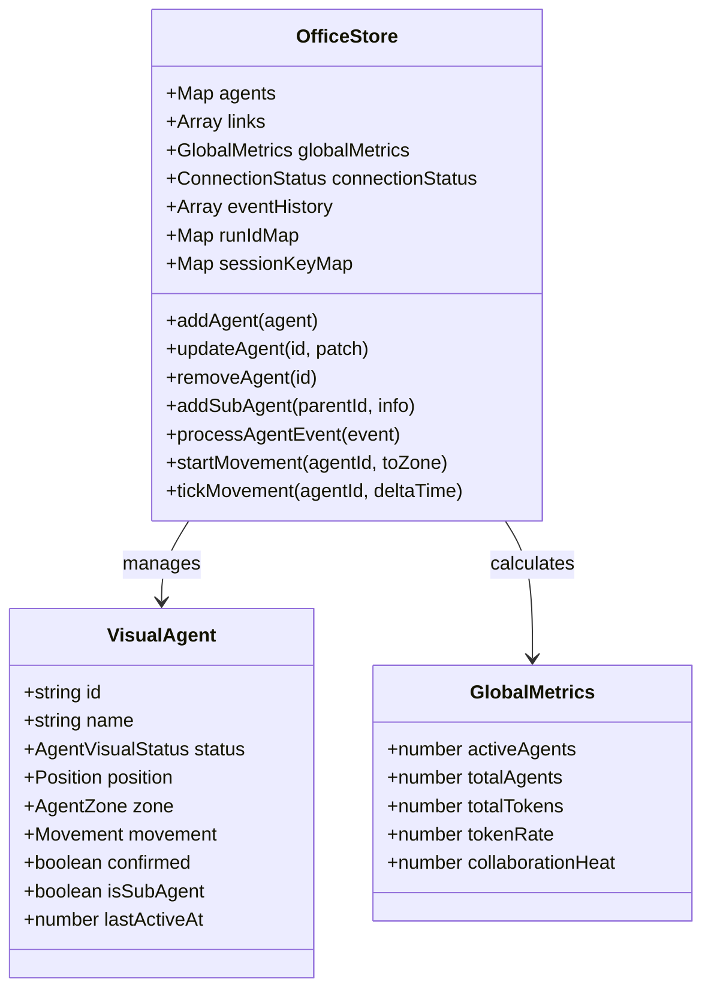

**图表来源**
- [office-store.ts:217-244](file://src/store/office-store.ts#L217-L244)
- [office-store.ts:86-144](file://src/store/office-store.ts#L86-L144)

#### 实时事件处理机制

系统通过WebSocket接收Agent事件，使用事件解析器进行状态转换：

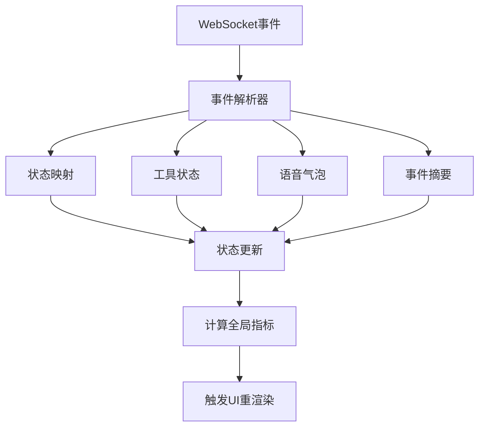

**图表来源**
- [event-parser.ts:17-60](file://src/gateway/event-parser.ts#L17-L60)
- [office-store.ts:762-800](file://src/store/office-store.ts#L762-L800)

#### 移动动画系统

系统实现了复杂的Agent移动动画系统，支持多种移动模式：

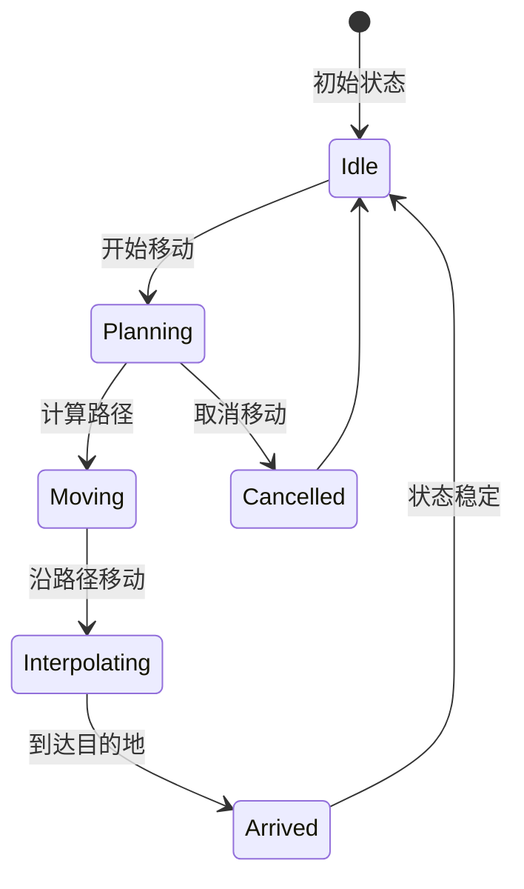

**图表来源**
- [office-store.ts:504-580](file://src/store/office-store.ts#L504-L580)

**章节来源**
- [office-store.ts:217-800](file://src/store/office-store.ts#L217-L800)
- [event-parser.ts:1-225](file://src/gateway/event-parser.ts#L1-L225)

### 控制台状态管理

#### 代理管理状态

代理管理状态负责控制台中代理的生命周期管理：

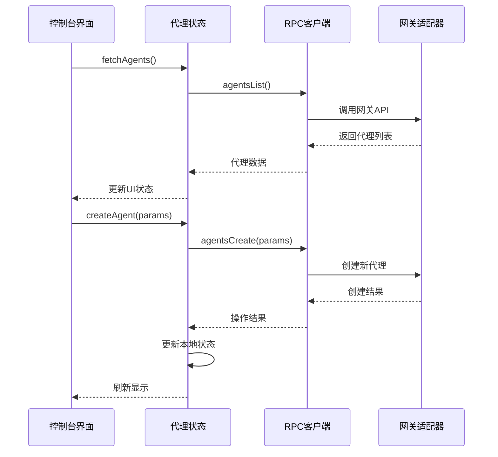

**图表来源**
- [agents-store.ts:297-317](file://src/store/console-stores/agents-store.ts#L297-L317)
- [agents-store.ts:389-401](file://src/store/console-stores/agents-store.ts#L389-L401)

#### 配置管理状态

配置管理状态提供了完整的配置生命周期管理：

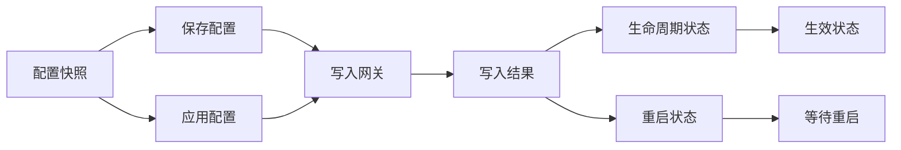

**图表来源**
- [config-store.ts:235-278](file://src/store/console-stores/config-store.ts#L235-L278)
- [config-store.ts:280-319](file://src/store/console-stores/config-store.ts#L280-L319)

**章节来源**
- [agents-store.ts:1-642](file://src/store/console-stores/agents-store.ts#L1-L642)
- [channels-store.ts:1-104](file://src/store/console-stores/channels-store.ts#L1-L104)
- [config-store.ts:1-420](file://src/store/console-stores/config-store.ts#L1-L420)

### 聊天状态管理

聊天状态管理实现了复杂的消息处理和会话管理功能：

#### 消息事件处理

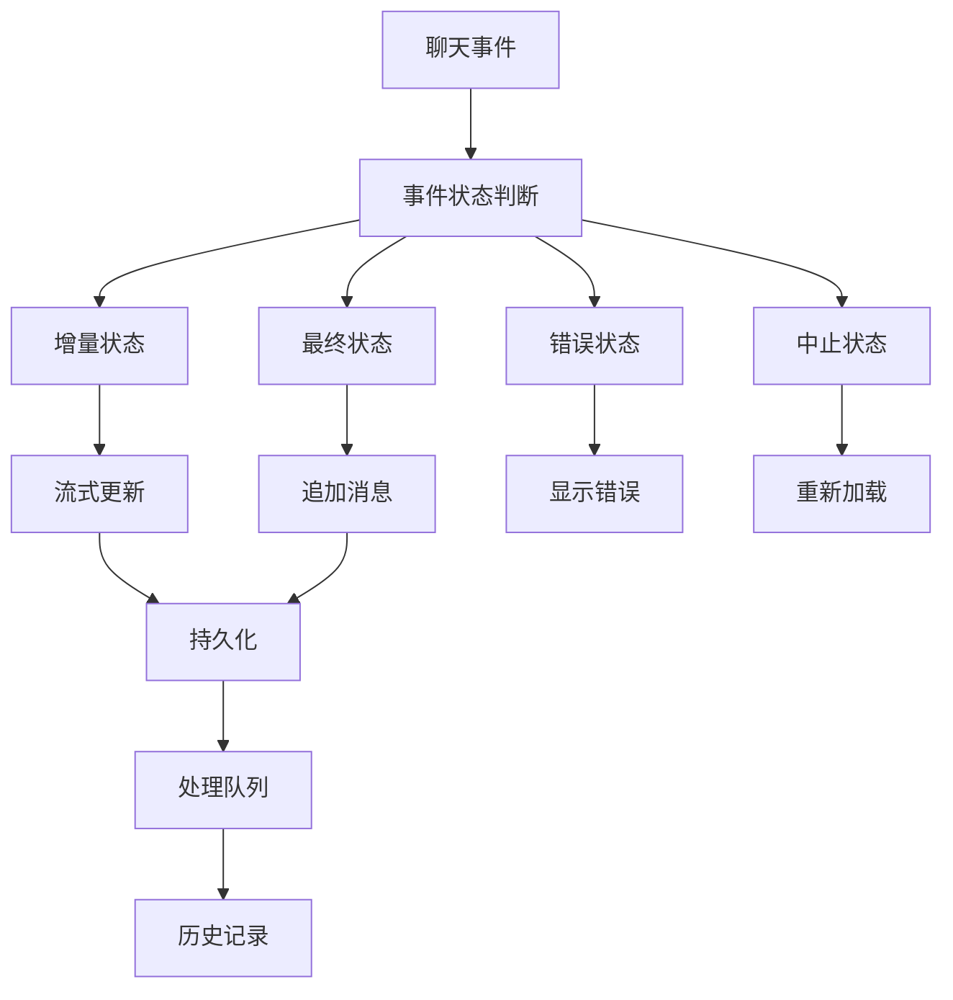

**图表来源**
- [chat-dock-store.ts:196-309](file://src/store/console-stores/chat-dock-store.ts#L196-L309)

#### 会话持久化策略

系统实现了多层次的会话持久化策略：

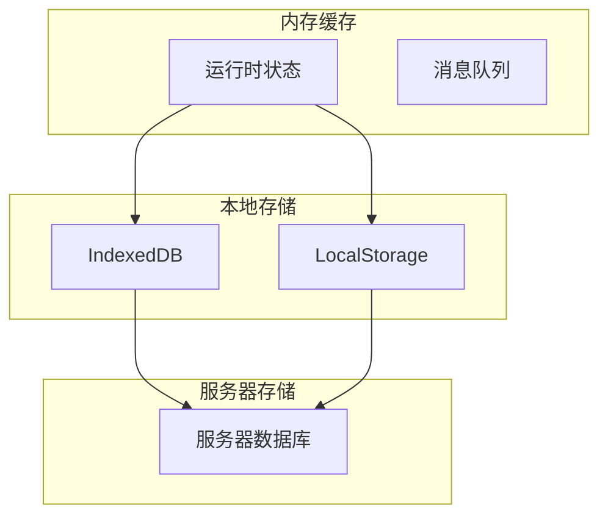

**图表来源**
- [chat-dock-store.ts:792-799](file://src/store/console-stores/chat-dock-store.ts#L792-L799)
- [local-persistence.ts:34-51](file://src/lib/local-persistence.ts#L34-L51)

**章节来源**
- [chat-dock-store.ts:1-800](file://src/store/console-stores/chat-dock-store.ts#L1-L800)
- [local-persistence.ts:1-408](file://src/lib/local-persistence.ts#L1-L408)

### 异步状态更新机制

#### WebSocket事件处理

系统通过WebSocket实现实时事件推送：

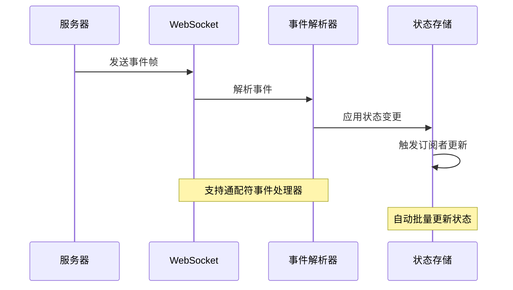

**图表来源**
- [ws-client.ts:149-181](file://src/gateway/ws-client.ts#L149-L181)
- [event-parser.ts:17-60](file://src/gateway/event-parser.ts#L17-L60)

#### RPC调用响应

RPC客户端提供统一的远程调用接口：

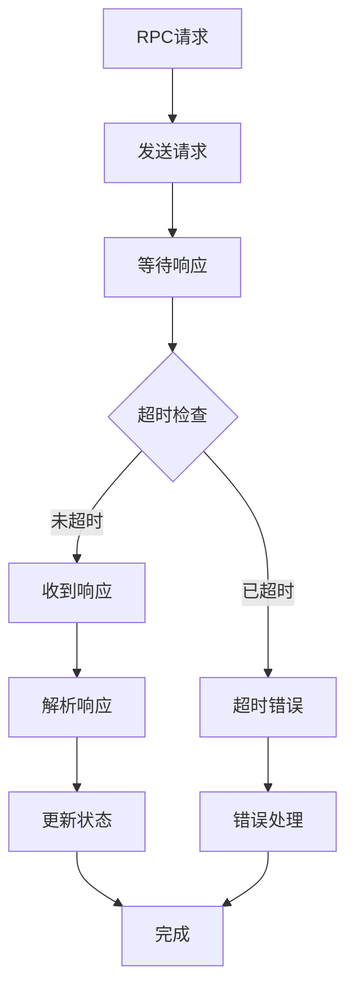

**图表来源**
- [rpc-client.ts:20-61](file://src/gateway/rpc-client.ts#L20-L61)

#### 定时轮询机制

系统使用定时轮询获取统计数据：

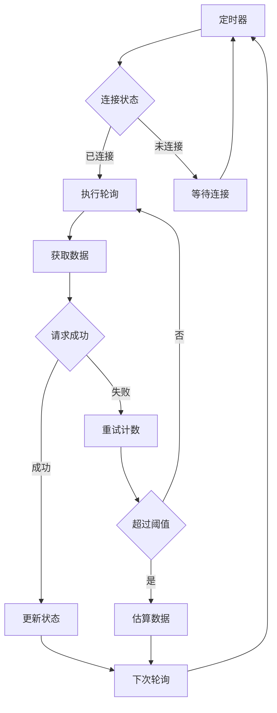

**图表来源**
- [useUsagePoller.ts:50-94](file://src/hooks/useUsagePoller.ts#L50-L94)

**章节来源**
- [ws-client.ts:1-304](file://src/gateway/ws-client.ts#L1-L304)
- [rpc-client.ts:1-63](file://src/gateway/rpc-client.ts#L1-L63)
- [useSubAgentPoller.ts:69-137](file://src/hooks/useSubAgentPoller.ts#L69-L137)
- [useUsagePoller.ts:1-191](file://src/hooks/useUsagePoller.ts#L1-L191)

## 依赖关系分析

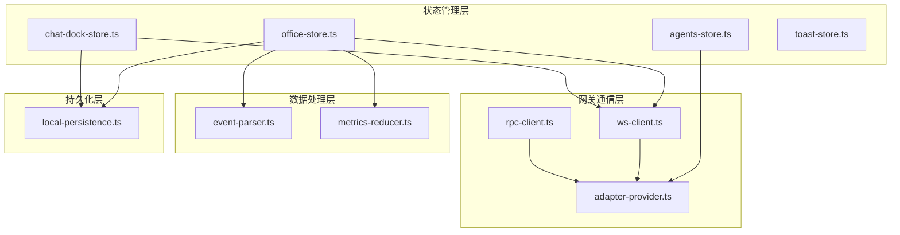

**图表来源**
- [office-store.ts:1-35](file://src/store/office-store.ts#L1-L35)
- [agents-store.ts:1-24](file://src/store/console-stores/agents-store.ts#L1-L24)
- [chat-dock-store.ts:1-17](file://src/store/console-stores/chat-dock-store.ts#L1-L17)

**章节来源**
- [adapter-provider.ts:1-130](file://src/gateway/adapter-provider.ts#L1-L130)
- [metrics-reducer.ts:1-27](file://src/store/metrics-reducer.ts#L1-L27)

## 性能考虑

### immutability优化

系统使用immer中间件实现高效的不可变更新：

- **自动代理**：immer自动创建可编辑的代理对象
- **批量更新**：单个set调用内多次状态更新会被批处理
- **深度冻结**：更新后的状态自动冻结，防止意外修改

### selector优化策略

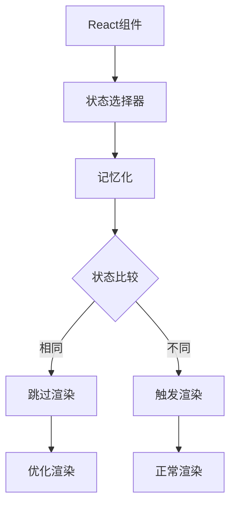

**图表来源**
- [office-store.ts:71-84](file://src/store/office-store.ts#L71-L84)

### 内存管理优化

系统实现了多层内存管理策略：

1. **事件历史限制**：限制事件历史数量，防止内存泄漏
2. **会话清理**：定期清理过期会话数据
3. **IndexedDB限制**：控制本地存储大小，自动清理过期数据

**章节来源**
- [office-store.ts:39-59](file://src/store/office-store.ts#L39-L59)
- [local-persistence.ts:26-33](file://src/lib/local-persistence.ts#L26-L33)
- [local-persistence.ts:326-338](file://src/lib/local-persistence.ts#L326-L338)

## 故障排除指南

### WebSocket连接问题

常见连接问题及解决方案：

1. **连接超时**
   - 检查网络连接和防火墙设置
   - 验证服务器地址和端口配置
   - 查看浏览器开发者工具中的网络面板

2. **认证失败**
   - 确认token有效性
   - 检查设备身份验证配置
   - 验证权限范围设置

3. **断线重连**
   - 系统自动进行指数退避重连
   - 最大重连次数为20次
   - 超时后停止重连并报告错误

### RPC调用错误

RPC调用失败的诊断步骤：

1. **检查连接状态**
   - 确认WebSocket连接正常
   - 验证网关服务可用性

2. **查看错误详情**
   - RpcError包含错误码和详细信息
   - 检查超时设置（默认10秒）

3. **重试机制**
   - RPC客户端自动处理超时重试
   - 失败达到阈值后使用估算数据

### 状态同步问题

状态不同步的排查方法：

1. **检查订阅**
   - 确认组件正确使用useStore订阅
   - 验证selector函数的准确性

2. **事件处理**
   - 检查事件解析器是否正确处理
   - 验证状态更新逻辑

3. **持久化问题**
   - 检查IndexedDB访问权限
   - 验证localStorage容量限制

**章节来源**
- [ws-client.ts:270-295](file://src/gateway/ws-client.ts#L270-L295)
- [rpc-client.ts:7-15](file://src/gateway/rpc-client.ts#L7-L15)
- [useUsagePoller.ts:83-93](file://src/hooks/useUsagePoller.ts#L83-L93)

## 结论

OpenClaw-Office项目的状态管理机制展现了现代前端应用的最佳实践：

**核心优势**：
- **模块化设计**：清晰的状态分层和职责分离
- **实时性**：基于WebSocket的实时事件推送
- **可靠性**：完善的错误处理和重连机制
- **性能优化**：immer中间件、selector优化、内存管理

**技术亮点**：
- 使用Zustand简化状态管理复杂度
- 实现复杂的Agent可视化和动画系统
- 提供完整的聊天和会话管理
- 建立多层次的数据持久化策略

**扩展性考虑**：
- 中间件架构支持功能扩展
- 模块化设计便于维护和测试
- 清晰的依赖关系便于重构

该状态管理方案为类似的企业级应用提供了优秀的参考模板，特别是在实时协作和可视化展示方面具有重要借鉴价值。