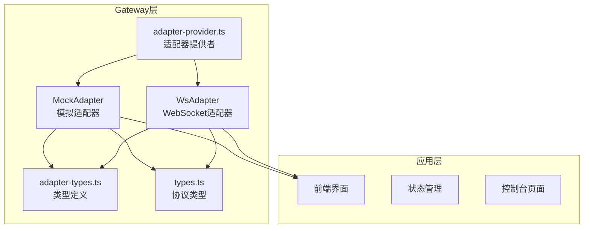
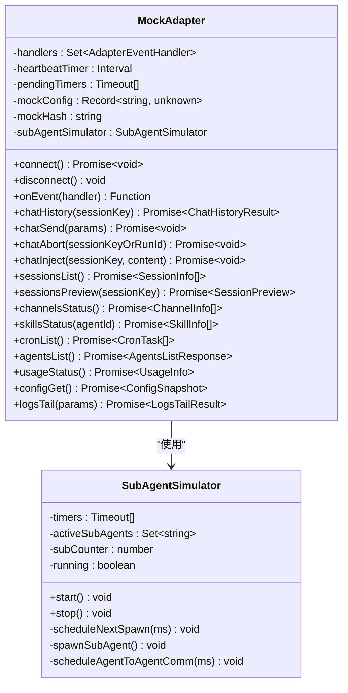
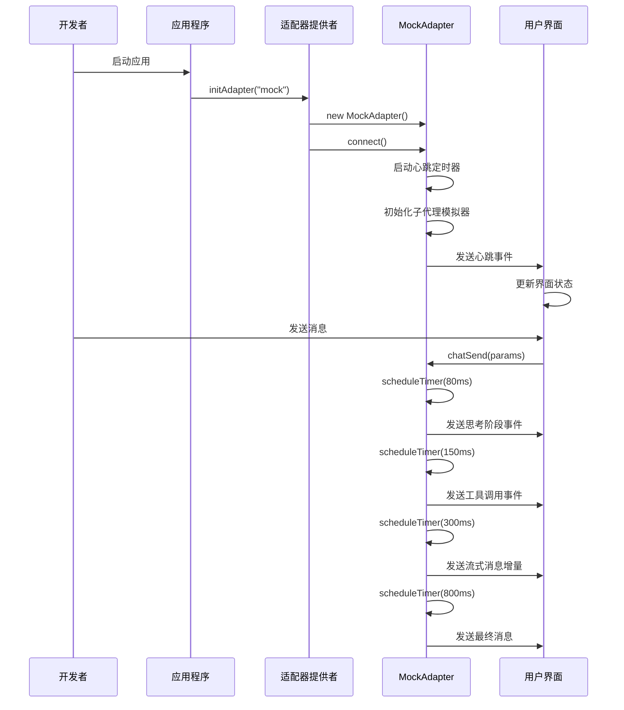
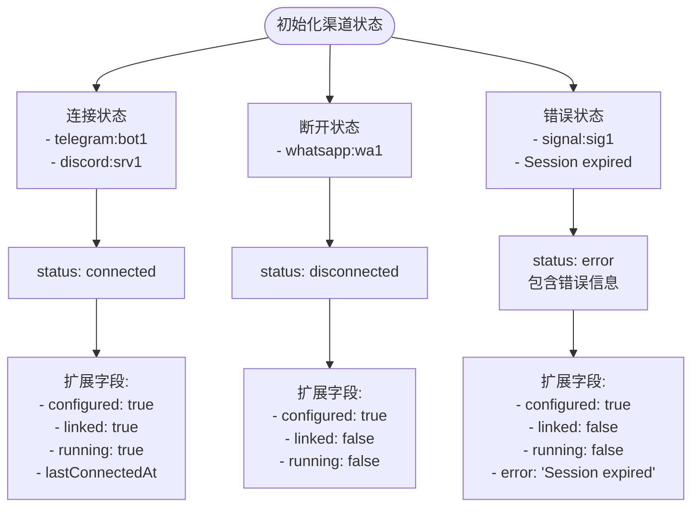
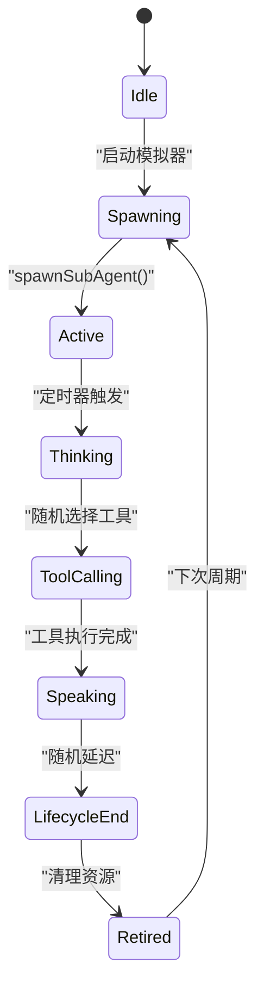
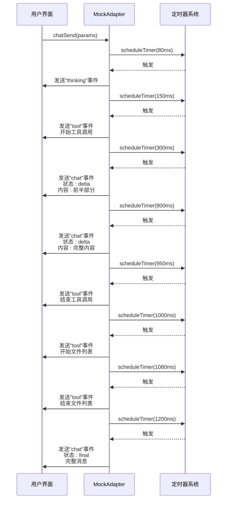
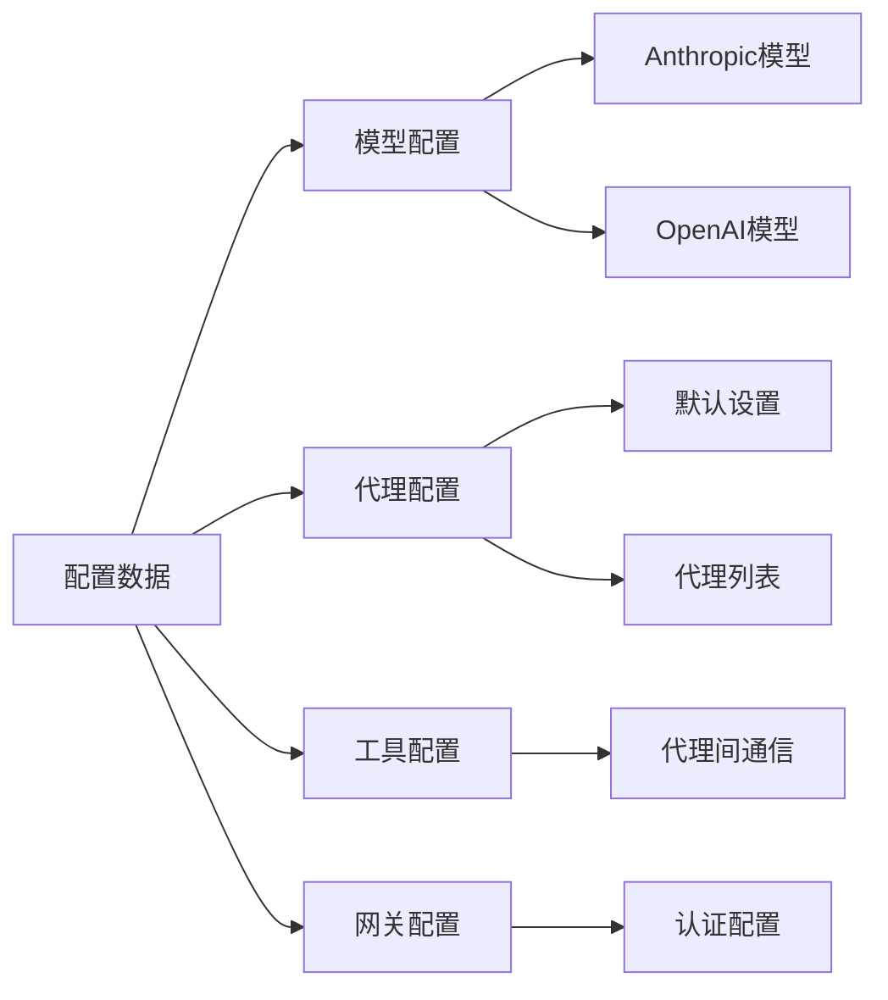
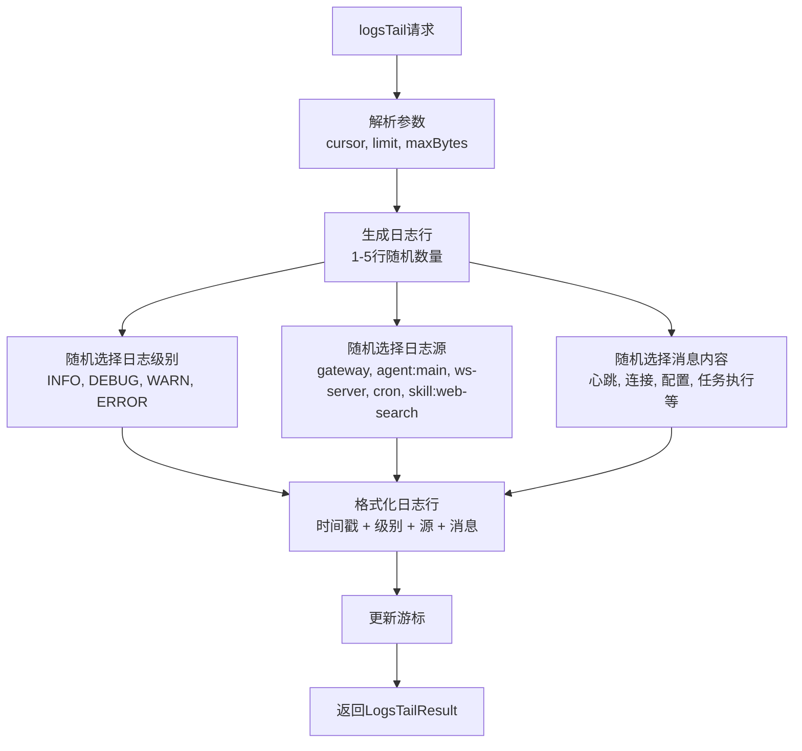
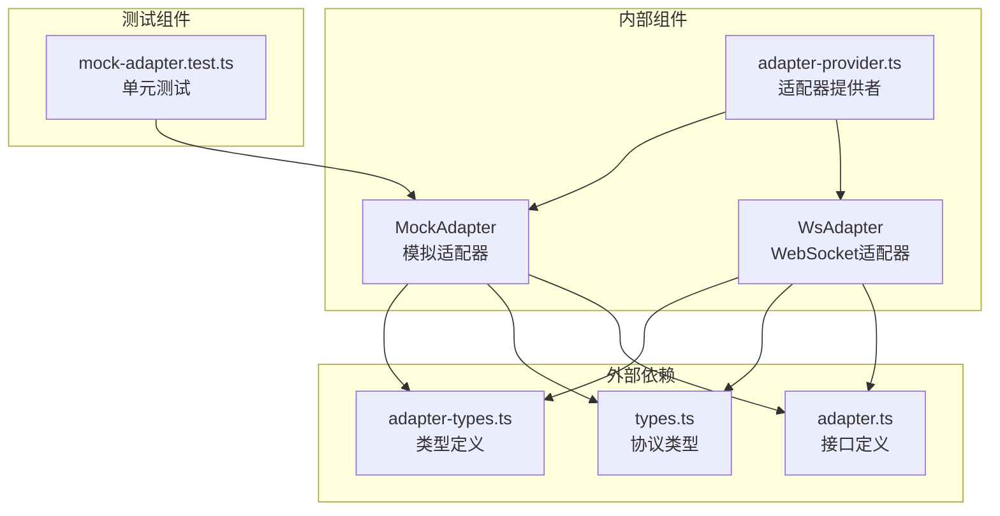

# Mock模式适配器

<cite>
**本文档引用的文件**
- [mock-adapter.ts](file://src/gateway/mock-adapter.ts)
- [adapter.ts](file://src/gateway/adapter.ts)
- [adapter-types.ts](file://src/gateway/adapter-types.ts)
- [types.ts](file://src/gateway/types.ts)
- [adapter-provider.ts](file://src/gateway/adapter-provider.ts)
- [ws-adapter.ts](file://src/gateway/ws-adapter.ts)
- [mock-adapter.test.ts](file://src/gateway/__tests__/mock-adapter.test.ts)
- [vite-env.d.ts](file://vite-env.d.ts)
- [package.json](file://package.json)
</cite>

## 目录
1. [简介](#简介)
2. [项目结构](#项目结构)
3. [核心组件](#核心组件)
4. [架构概览](#架构概览)
5. [详细组件分析](#详细组件分析)
6. [依赖关系分析](#依赖关系分析)
7. [性能考虑](#性能考虑)
8. [故障排除指南](#故障排除指南)
9. [结论](#结论)
10. [附录](#附录)

## 简介

Mock模式适配器是OpenClaw Office前端应用中的一个关键组件，它提供了无需真实Gateway即可进行开发和测试的模拟机制。该适配器实现了完整的GatewayAdapter接口，能够完全替代真实的WebSocket适配器，为开发者提供了一个功能完备的模拟环境。

Mock模式的设计目的是让开发者能够在没有真实Gateway服务的情况下进行：
- 前端界面开发和调试
- 自动化测试和持续集成
- 功能验证和原型开发
- 性能测试和压力测试

## 项目结构

OpenClaw Office采用模块化的架构设计，Mock模式适配器位于gateway目录下，与真实适配器并列存在：



**图表来源**
- [adapter-provider.ts:50-86](file://src/gateway/adapter-provider.ts#L50-L86)
- [mock-adapter.ts:564-596](file://src/gateway/mock-adapter.ts#L564-L596)
- [ws-adapter.ts:40-83](file://src/gateway/ws-adapter.ts#L40-L83)

**章节来源**
- [adapter-provider.ts:1-130](file://src/gateway/adapter-provider.ts#L1-L130)
- [mock-adapter.ts:1-1251](file://src/gateway/mock-adapter.ts#L1-L1251)

## 核心组件

### MockAdapter类设计

MockAdapter是整个Mock模式的核心实现，它完全实现了GatewayAdapter接口的所有方法。该类的设计遵循以下原则：

#### 主要特性
- **完整接口实现**：实现了所有GatewayAdapter方法
- **事件驱动**：通过事件处理器分发模拟事件
- **定时器管理**：使用setTimeout和setInterval模拟异步操作
- **状态管理**：维护内部状态以支持会话和子代理模拟

#### 关键实现模式


**图表来源**
- [mock-adapter.ts:564-596](file://src/gateway/mock-adapter.ts#L564-L596)
- [mock-adapter.ts:346-562](file://src/gateway/mock-adapter.ts#L346-L562)

**章节来源**
- [mock-adapter.ts:564-1251](file://src/gateway/mock-adapter.ts#L564-L1251)

## 架构概览

Mock模式适配器在整个系统架构中扮演着关键角色，它提供了与真实Gateway的完全兼容性：



**图表来源**
- [adapter-provider.ts:50-86](file://src/gateway/adapter-provider.ts#L50-L86)
- [mock-adapter.ts:645-791](file://src/gateway/mock-adapter.ts#L645-L791)

### 接口一致性保证

MockAdapter通过以下方式确保与真实适配器的接口一致性：

1. **完整方法实现**：实现了GatewayAdapter接口的所有方法
2. **相同的数据结构**：使用相同的类型定义和数据格式
3. **一致的事件模型**：产生相同的事件类型和负载
4. **相同的错误处理**：提供一致的错误响应格式

**章节来源**
- [adapter.ts:46-112](file://src/gateway/adapter.ts#L46-L112)
- [adapter-types.ts:1-458](file://src/gateway/adapter-types.ts#L1-L458)

## 详细组件分析

### 测试数据生成策略

MockAdapter实现了多种智能的测试数据生成策略：

#### 渠道连接状态模拟


**图表来源**
- [mock-adapter.ts:36-80](file://src/gateway/mock-adapter.ts#L36-L80)

#### 智能代理状态模拟
MockAdapter使用SubAgentSimulator类来模拟子代理的生命周期：



**图表来源**
- [mock-adapter.ts:346-562](file://src/gateway/mock-adapter.ts#L346-L562)

#### 聊天记录模拟
MockAdapter实现了复杂的聊天事件模拟流程：



**图表来源**
- [mock-adapter.ts:645-791](file://src/gateway/mock-adapter.ts#L645-L791)

**章节来源**
- [mock-adapter.ts:36-174](file://src/gateway/mock-adapter.ts#L36-L174)
- [mock-adapter.ts:346-562](file://src/gateway/mock-adapter.ts#L346-L562)
- [mock-adapter.ts:623-791](file://src/gateway/mock-adapter.ts#L623-L791)

### 配置管理系统

MockAdapter实现了完整的配置管理功能，包括：

#### 配置数据模拟


**图表来源**
- [mock-adapter.ts:229-314](file://src/gateway/mock-adapter.ts#L229-L314)

#### 配置热更新模拟
MockAdapter支持配置的热更新和应用，包括：
- `configGet()`: 获取当前配置快照
- `configSet()`: 设置完整配置
- `configApply()`: 应用配置变更
- `configPatch()`: 部分配置更新
- `configSchema()`: 获取配置模式

**章节来源**
- [mock-adapter.ts:1107-1181](file://src/gateway/mock-adapter.ts#L1107-L1181)

### 日志系统模拟

MockAdapter实现了完整的日志系统模拟功能：

#### 日志生成策略


**图表来源**
- [mock-adapter.ts:1211-1249](file://src/gateway/mock-adapter.ts#L1211-L1249)

**章节来源**
- [mock-adapter.ts:1211-1249](file://src/gateway/mock-adapter.ts#L1211-L1249)

## 依赖关系分析

### 组件耦合度分析

MockAdapter与其他组件的依赖关系如下：



**图表来源**
- [adapter-provider.ts:1-130](file://src/gateway/adapter-provider.ts#L1-L130)
- [mock-adapter.ts:1-34](file://src/gateway/mock-adapter.ts#L1-L34)
- [ws-adapter.ts:1-38](file://src/gateway/ws-adapter.ts#L1-L38)

### 接口契约分析

MockAdapter严格遵循GatewayAdapter接口契约：

#### 方法实现完整性
| 接口方法 | MockAdapter实现 | 功能描述 |
|---------|----------------|----------|
| `connect()` | ✅ | 启动心跳定时器和子代理模拟器 |
| `disconnect()` | ✅ | 清理定时器和事件处理器 |
| `onEvent()` | ✅ | 注册事件处理器 |
| `chatHistory()` | ✅ | 返回模拟聊天历史 |
| `chatSend()` | ✅ | 模拟聊天发送流程 |
| `chatAbort()` | ✅ | 中止聊天操作 |
| `chatInject()` | ✅ | 注入聊天消息 |
| `sessions*` | ✅ | 会话管理功能 |
| `channels*` | ✅ | 渠道状态管理 |
| `skills*` | ✅ | 技能状态管理 |
| `cron*` | ✅ | 定时任务管理 |
| `agents*` | ✅ | 代理管理功能 |
| `toolsCatalog()` | ✅ | 工具目录查询 |
| `usageStatus()` | ✅ | 使用量统计 |
| `modelsList()` | ✅ | 模型列表查询 |
| `config*` | ✅ | 配置管理功能 |
| `statusSummary()` | ✅ | 状态摘要 |
| `updateRun()` | ✅ | 更新运行 |
| `logsTail()` | ✅ | 日志尾部查询 |

**章节来源**
- [adapter.ts:46-112](file://src/gateway/adapter.ts#L46-L112)
- [mock-adapter.ts:564-1251](file://src/gateway/mock-adapter.ts#L564-L1251)

## 性能考虑

### 内存管理
MockAdapter在设计时充分考虑了内存使用效率：

#### 定时器管理
- 使用`pendingTimers`数组跟踪所有定时器
- 在断开连接时统一清理所有定时器
- 避免内存泄漏和僵尸定时器

#### 事件处理器管理
- 使用Set数据结构存储事件处理器
- 提供取消订阅机制
- 支持动态添加和移除处理器

### 异步操作优化
MockAdapter通过以下方式优化异步操作性能：

#### 定时器调度
- 使用随机延迟模拟真实网络延迟
- 最大延迟限制在15秒以内
- 避免长时间阻塞主线程

#### 数据缓存
- 预生成静态数据集合
- 避免重复计算和字符串拼接
- 使用深拷贝避免数据污染

## 故障排除指南

### 常见问题诊断

#### 适配器初始化失败
**症状**：调用`initAdapter("mock")`抛出异常
**原因**：可能的错误包括适配器实例已存在或初始化超时
**解决方案**：
1. 检查适配器是否已被正确初始化
2. 确认没有其他初始化过程正在进行
3. 查看控制台错误信息获取具体原因

#### 事件处理异常
**症状**：注册的事件处理器不被调用
**原因**：事件处理器未正确注册或适配器已断开连接
**解决方案**：
1. 确保在适配器连接后注册事件处理器
2. 检查事件处理器函数的this绑定
3. 验证事件处理器返回的取消函数是否正确使用

#### 数据不一致问题
**症状**：配置更新后数据状态不一致
**原因**：并发访问或竞态条件
**解决方案**：
1. 使用配置哈希验证机制
2. 实现原子性的配置更新操作
3. 添加适当的错误处理和回滚机制

### 调试技巧

#### 启用详细日志
MockAdapter会在控制台输出详细的调试信息，包括：
- 事件发送和接收日志
- 定时器触发记录
- 配置变更跟踪
- 错误和异常信息

#### 单元测试覆盖
项目提供了完整的单元测试套件，包括：
- 基本功能测试
- 边界条件测试
- 错误场景测试
- 并发访问测试

**章节来源**
- [mock-adapter.test.ts:1-95](file://src/gateway/__tests__/mock-adapter.test.ts#L1-L95)

## 结论

Mock模式适配器是OpenClaw Office项目中一个精心设计的组件，它成功地实现了以下目标：

1. **完全兼容性**：与真实Gateway提供完全相同的接口和行为
2. **开发友好性**：为开发者提供了便捷的本地开发和测试环境
3. **测试支持性**：支持完整的自动化测试和持续集成流程
4. **性能优化**：通过合理的内存管理和异步操作优化确保高效运行

MockAdapter的设计体现了现代前端架构的最佳实践，包括：
- 清晰的职责分离
- 完善的错误处理机制
- 友好的API设计
- 全面的测试覆盖

对于开发者而言，Mock模式适配器不仅是一个实用的工具，更是理解整个OpenClaw系统架构的重要窗口。

## 附录

### 配置和启用方法

#### 环境变量配置
Mock模式通过环境变量`VITE_MOCK`控制启用状态：

```bash
# 启用Mock模式
VITE_MOCK=true

# 启用真实Gateway模式
VITE_MOCK=false
```

#### 代码集成示例
```typescript
import { initAdapter } from "@/gateway/adapter-provider";

// 初始化Mock适配器
const adapter = await initAdapter("mock");

// 或者根据环境变量自动选择
const mode = import.meta.env.VITE_MOCK === "true" ? "mock" : "ws";
const adapter = await initAdapter(mode);
```

#### 测试环境配置
在测试环境中，MockAdapter提供了专门的重置功能：

```typescript
import { __resetAdapterForTests } from "@/gateway/adapter-provider";

// 在测试结束后重置适配器状态
afterEach(() => {
  __resetAdapterForTests();
});
```

**章节来源**
- [adapter-provider.ts:88-90](file://src/gateway/adapter-provider.ts#L88-L90)
- [vite-env.d.ts:3-6](file://vite-env.d.ts#L3-L6)