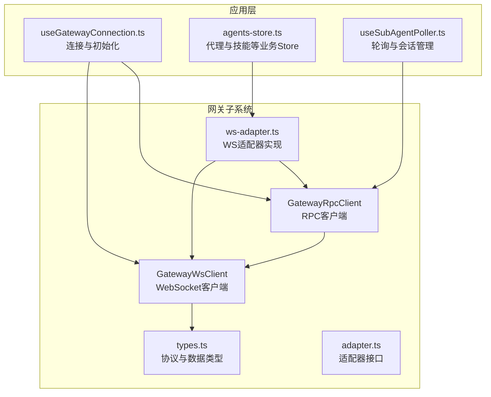
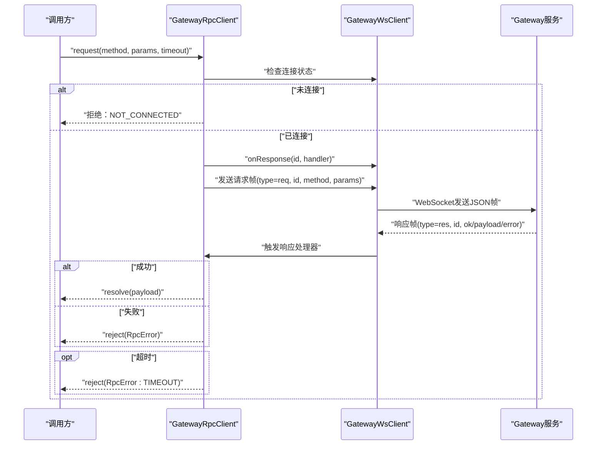
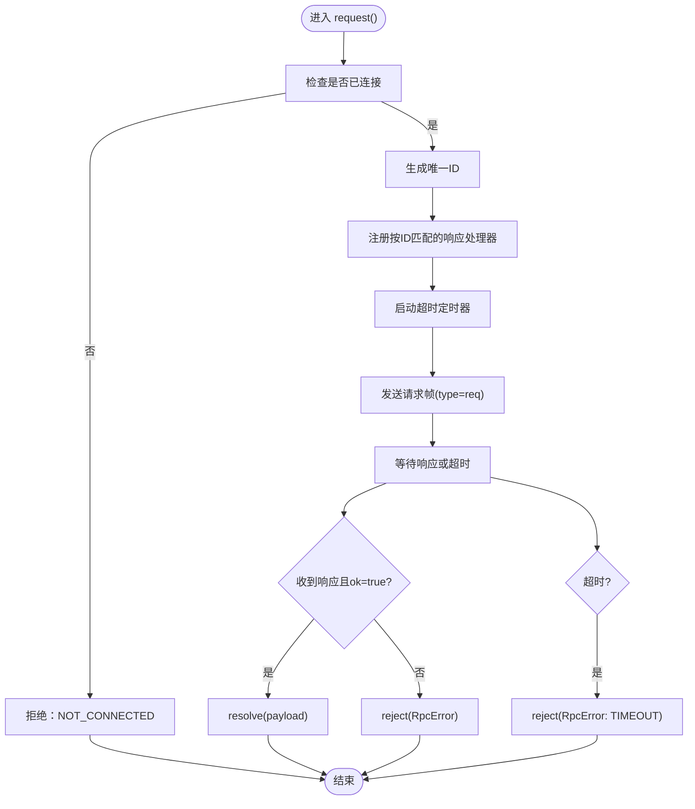
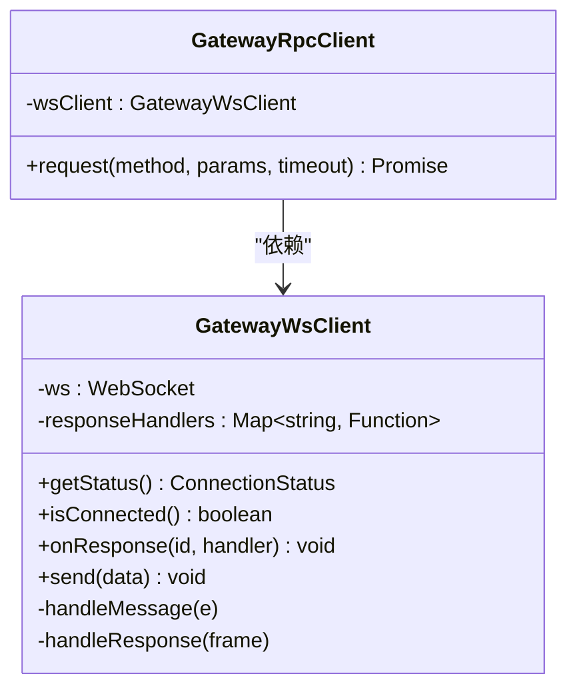
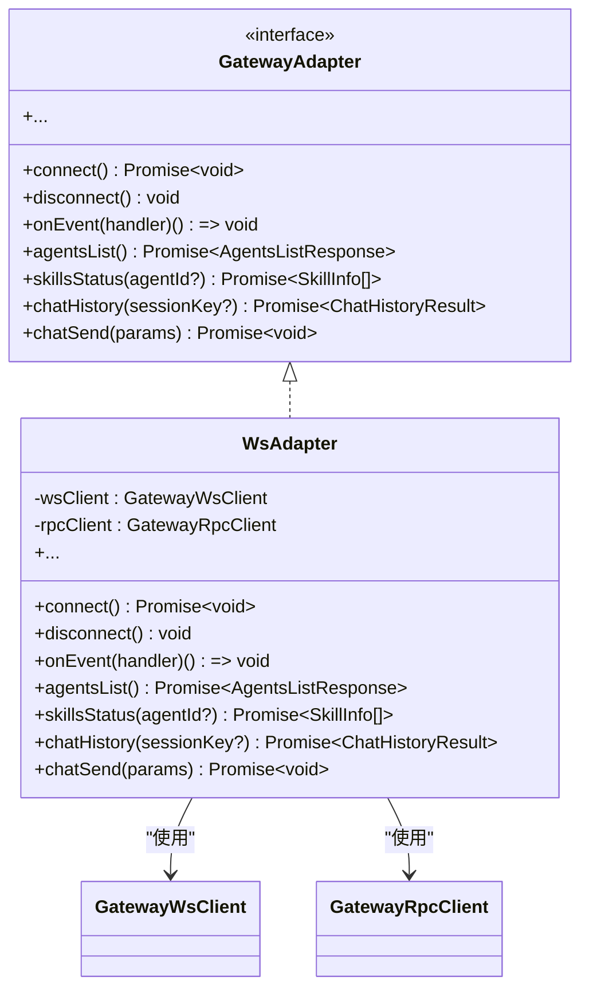
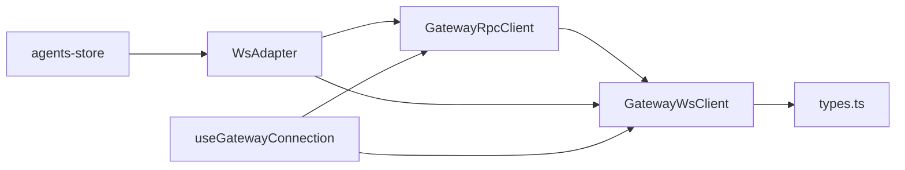

# RPC客户端

<cite>
**本文引用的文件**
- [rpc-client.ts](file://src/gateway/rpc-client.ts)
- [ws-client.ts](file://src/gateway/ws-client.ts)
- [types.ts](file://src/gateway/types.ts)
- [adapter.ts](file://src/gateway/adapter.ts)
- [ws-adapter.ts](file://src/gateway/ws-adapter.ts)
- [useGatewayConnection.ts](file://src/hooks/useGatewayConnection.ts)
- [rpc-client.test.ts](file://src/gateway/__tests__/rpc-client.test.ts)
- [agents-store.ts](file://src/store/console-stores/agents-store.ts)
- [useSubAgentPoller.ts](file://src/hooks/useSubAgentPoller.ts)
</cite>

## 目录
1. [简介](#简介)
2. [项目结构](#项目结构)
3. [核心组件](#核心组件)
4. [架构总览](#架构总览)
5. [详细组件分析](#详细组件分析)
6. [依赖分析](#依赖分析)
7. [性能考量](#性能考量)
8. [故障排查指南](#故障排查指南)
9. [结论](#结论)
10. [附录](#附录)

## 简介
本文件面向RPC客户端的使用者与维护者，系统性阐述GatewayRpcClient类的实现原理与使用方式，重点覆盖：
- 远程过程调用的封装机制与请求/响应模式
- 超时处理策略与错误模型
- request()方法的核心逻辑：参数序列化、响应解析、错误处理
- RPC客户端与WebSocket客户端的协作关系
- 如何通过RPC实现对Gateway服务的统一访问
- 常见RPC调用场景与参数/返回值格式
- 完整的使用示例与最佳实践
- 错误恢复与重试机制的设计考量

## 项目结构
RPC客户端位于网关子系统中，与WebSocket客户端、适配器层、Hooks与Store协同工作，形成“连接—协议—抽象—UI”的分层架构。

**图表来源**
- [rpc-client.ts:17-62](file://src/gateway/rpc-client.ts#L17-L62)
- [ws-client.ts:22-303](file://src/gateway/ws-client.ts#L22-L303)
- [types.ts:6-35](file://src/gateway/types.ts#L6-L35)
- [adapter.ts:46-112](file://src/gateway/adapter.ts#L46-L112)
- [ws-adapter.ts:40-47](file://src/gateway/ws-adapter.ts#L40-L47)
- [useGatewayConnection.ts:23-151](file://src/hooks/useGatewayConnection.ts#L23-L151)
- [agents-store.ts:297-317](file://src/store/console-stores/agents-store.ts#L297-L317)
- [useSubAgentPoller.ts:69-137](file://src/hooks/useSubAgentPoller.ts#L69-L137)

**章节来源**
- [rpc-client.ts:17-62](file://src/gateway/rpc-client.ts#L17-L62)
- [ws-client.ts:22-303](file://src/gateway/ws-client.ts#L22-L303)
- [types.ts:6-35](file://src/gateway/types.ts#L6-L35)
- [adapter.ts:46-112](file://src/gateway/adapter.ts#L46-L112)
- [ws-adapter.ts:40-47](file://src/gateway/ws-adapter.ts#L40-L47)
- [useGatewayConnection.ts:23-151](file://src/hooks/useGatewayConnection.ts#L23-L151)
- [agents-store.ts:297-317](file://src/store/console-stores/agents-store.ts#L297-L317)
- [useSubAgentPoller.ts:69-137](file://src/hooks/useSubAgentPoller.ts#L69-L137)

## 核心组件
- GatewayRpcClient：基于WebSocket的RPC封装，负责请求生成、超时控制、响应回调绑定与错误转换。
- GatewayWsClient：WebSocket连接管理、消息编解码、事件与响应分发、自动重连。
- types.ts：定义Gateway协议帧（请求/响应/事件）、错误形状、Agent/会话/工具/技能等数据模型。
- 适配器层：将RPC抽象为高层API（如agents.list、skills.status、chat.history等），屏蔽底层协议细节。
- Hooks与Store：在应用生命周期内建立连接、初始化配置、拉取数据并驱动UI更新。

**章节来源**
- [rpc-client.ts:17-62](file://src/gateway/rpc-client.ts#L17-L62)
- [ws-client.ts:22-303](file://src/gateway/ws-client.ts#L22-L303)
- [types.ts:6-35](file://src/gateway/types.ts#L6-L35)
- [adapter.ts:46-112](file://src/gateway/adapter.ts#L46-L112)
- [ws-adapter.ts:40-47](file://src/gateway/ws-adapter.ts#L40-L47)

## 架构总览
RPC客户端通过GatewayWsClient与Gateway服务通信，采用“请求-响应”帧模型，每个RPC调用对应一个唯一的帧ID，确保请求与响应的匹配。RPC层负责超时与错误包装，上层通过适配器暴露语义化的API。

**图表来源**
- [rpc-client.ts:20-61](file://src/gateway/rpc-client.ts#L20-L61)
- [ws-client.ts:94-96](file://src/gateway/ws-client.ts#L94-L96)
- [ws-client.ts:183-197](file://src/gateway/ws-client.ts#L183-L197)
- [types.ts:6-27](file://src/gateway/types.ts#L6-L27)

**章节来源**
- [rpc-client.ts:20-61](file://src/gateway/rpc-client.ts#L20-L61)
- [ws-client.ts:94-96](file://src/gateway/ws-client.ts#L94-L96)
- [ws-client.ts:183-197](file://src/gateway/ws-client.ts#L183-L197)
- [types.ts:6-27](file://src/gateway/types.ts#L6-L27)

## 详细组件分析

### GatewayRpcClient 实现原理
- 关键职责
  - 生成唯一请求ID
  - 注册按ID匹配的响应处理器
  - 启动超时定时器
  - 发送请求帧
  - 将响应帧解析为成功或错误结果
- 错误模型
  - RpcError：包含错误码与消息，区分超时与服务端错误
- 超时策略
  - 默认超时时间常量
  - 超时后清理定时器并拒绝Promise

**图表来源**
- [rpc-client.ts:20-61](file://src/gateway/rpc-client.ts#L20-L61)

**章节来源**
- [rpc-client.ts:17-62](file://src/gateway/rpc-client.ts#L17-L62)

### 请求/响应模式与协议帧
- 请求帧
  - type: "req"
  - id: string（唯一请求标识）
  - method: string（RPC方法名）
  - params?: Record<string, unknown>
- 响应帧
  - 成功：type: "res", ok: true, payload: T
  - 失败：type: "res", ok: false, error: { code, message, retryable?, retryAfterMs? }
- 事件帧
  - type: "event"，用于推送式通知（非RPC响应）

**章节来源**
- [types.ts:6-27](file://src/gateway/types.ts#L6-L27)

### 与WebSocket客户端的协作
- GatewayWsClient负责：
  - 连接生命周期管理、自动重连
  - 消息解析与路由（事件/响应）
  - 响应处理器映射（按id）
- GatewayRpcClient负责：
  - 生成请求ID与超时
  - 绑定响应处理器
  - 将帧转换为Promise结果

**图表来源**
- [ws-client.ts:22-303](file://src/gateway/ws-client.ts#L22-L303)
- [rpc-client.ts:17-62](file://src/gateway/rpc-client.ts#L17-L62)

**章节来源**
- [ws-client.ts:22-303](file://src/gateway/ws-client.ts#L22-L303)
- [rpc-client.ts:17-62](file://src/gateway/rpc-client.ts#L17-L62)

### 适配器层与统一访问
- 适配器接口定义高层API（如agents.list、skills.status、chat.history等）
- WS适配器通过RPC客户端实现具体方法，屏蔽协议细节
- 应用层通过适配器获取统一的数据模型与行为

**图表来源**
- [adapter.ts:46-112](file://src/gateway/adapter.ts#L46-L112)
- [ws-adapter.ts:40-47](file://src/gateway/ws-adapter.ts#L40-L47)

**章节来源**
- [adapter.ts:46-112](file://src/gateway/adapter.ts#L46-L112)
- [ws-adapter.ts:40-47](file://src/gateway/ws-adapter.ts#L40-L47)

### 常见RPC调用场景与参数/返回值
以下API均通过GatewayRpcClient实现，参数与返回值遵循适配器类型定义与协议帧规范：

- agents.list
  - 方法：agents.list
  - 参数：无或可选作用域过滤（由上层决定）
  - 返回：AgentsListResponse
  - 使用示例：在连接成功后拉取代理列表并缓存名称

- skills.status
  - 方法：skills.status
  - 参数：agentId?（可选）
  - 返回：SkillInfo[]
  - 使用示例：在代理详情页加载技能状态与允许清单

- chat.history
  - 方法：chat.history
  - 参数：sessionKey?（可选）
  - 返回：ChatHistoryResult
  - 使用示例：聊天面板加载历史消息

- chat.send
  - 方法：chat.send
  - 参数：ChatSendParams（文本、附件等）
  - 返回：void
  - 使用示例：发送消息并接收流式事件

- sessions.list / preview / delete / patch / reset / compact
  - 方法：sessions.list / sessions.preview / sessions.delete / sessions.patch / sessions.reset / sessions.compact
  - 参数：根据方法不同而异（如sessionKey、patch内容等）
  - 返回：SessionInfo[] / SessionPreview / void / void / void / void
  - 使用示例：会话管理与轮询

- channels.status / logout / web.login.start / web.login.wait
  - 方法：channels.status / channels.logout / web.login.start / web.login.wait
  - 参数：channels.logout含channel与accountId；web.login含force
  - 返回：ChannelInfo[] / { cleared: boolean } / { qrDataUrl?, message } / { connected, message }
  - 使用示例：渠道状态与Web登录流程

- cron.list / add / update / remove / run
  - 方法：cron.list / cron.add / cron.update / cron.remove / cron.run
  - 参数：cron.add含CronTaskInput；cron.update含部分字段patch
  - 返回：jobs数组 / CronTask / CronTask / void / void
  - 使用示例：定时任务管理

- config.get / set / apply / patch / schema / status / update / logs.tail
  - 方法：config.get / config.set / config.apply / config.patch / config.schema / status.summary / update.run / logs.tail
  - 参数：config.get含keys；logs.tail含cursor/limit/maxBytes
  - 返回：ConfigSnapshot / ConfigWriteResult / ConfigWriteResult / ConfigPatchResult / ConfigSchemaResponse / StatusSummary / UpdateRunResult / LogsTailResult
  - 使用示例：配置读写与运行状态查询

- tools.catalog / models.list / usage.status
  - 方法：tools.catalog / models.list / usage.status
  - 参数：无或agentId可选
  - 返回：ToolCatalog / ModelCatalogEntry[] / UsageInfo
  - 使用示例：工具目录与模型列表

- agents.create / update / delete / files.list / files.get / files.set
  - 方法：agents.create / update / delete / agents.files.list / agents.files.get / agents.files.set
  - 参数：各方法对应参数对象
  - 返回：AgentCreateResult / AgentUpdateResult / AgentDeleteResult / AgentFilesListResult / AgentFileContent / AgentFileSetResult
  - 使用示例：代理文件管理

- chat.abort / inject
  - 方法：chat.abort / chat.inject
  - 参数：chat.abort含sessionKeyOrRunId；chat.inject含sessionKey与content
  - 返回：void
  - 使用示例：中断与注入消息

- chat.send（内部转换）
  - 方法：chat.send（内部）
  - 参数：GatewayChatSendParams（包含sessionKey、message、deliver、idempotencyKey、attachments）
  - 返回：void
  - 使用示例：内部消息发送

- web.login.start / web.login.wait（内部）
  - 方法：web.login.start / web.login.wait
  - 参数：web.login.start含force；web.login.wait无参
  - 返回：{ qrDataUrl?, message } / { connected, message }
  - 使用示例：Web登录流程

**章节来源**
- [adapter.ts:46-112](file://src/gateway/adapter.ts#L46-L112)
- [ws-adapter.ts:181-218](file://src/gateway/ws-adapter.ts#L181-L218)
- [adapter-types.ts:171-193](file://src/gateway/adapter-types.ts#L171-L193)
- [adapter-types.ts:195-224](file://src/gateway/adapter-types.ts#L195-L224)
- [adapter-types.ts:350-458](file://src/gateway/adapter-types.ts#L350-L458)

### 使用示例与最佳实践
- 初始化与连接
  - 在应用启动时创建GatewayWsClient与GatewayRpcClient，并监听连接状态变化
  - 连接成功后初始化适配器、拉取配置与代理列表
- 调用RPC方法
  - 对于需要严格超时控制的场景，传入合适的timeoutMs
  - 对于幂等请求，建议提供idempotencyKey
  - 对于可能长时间运行的任务，结合事件订阅与轮询
- 错误处理
  - 捕获RpcError并根据code与retryable标志决定重试策略
  - 对于TIMEOUT，可提示用户重试或检查网络
  - 对于INVALID等业务错误，向用户反馈具体信息
- 重试与退避
  - 建议在上层实现指数退避重试，避免频繁重试导致服务器压力
  - 对于不可重试错误（如鉴权失败），直接终止并引导用户修复

**章节来源**
- [useGatewayConnection.ts:23-151](file://src/hooks/useGatewayConnection.ts#L23-L151)
- [agents-store.ts:297-317](file://src/store/console-stores/agents-store.ts#L297-L317)
- [rpc-client.test.ts:20-78](file://src/gateway/__tests__/rpc-client.test.ts#L20-L78)

## 依赖分析
- 内聚性
  - GatewayRpcClient专注于RPC封装，职责清晰
  - GatewayWsClient专注于连接与帧处理，职责清晰
- 耦合度
  - RPC依赖WS客户端的onResponse与send能力
  - 适配器层依赖RPC客户端实现高层API
- 外部依赖
  - WebSocket浏览器API
  - JSON序列化/反序列化
- 循环依赖
  - 无循环依赖，分层清晰

**图表来源**
- [rpc-client.ts:17-62](file://src/gateway/rpc-client.ts#L17-L62)
- [ws-client.ts:22-303](file://src/gateway/ws-client.ts#L22-L303)
- [types.ts:6-35](file://src/gateway/types.ts#L6-L35)
- [ws-adapter.ts:40-47](file://src/gateway/ws-adapter.ts#L40-L47)
- [useGatewayConnection.ts:23-151](file://src/hooks/useGatewayConnection.ts#L23-L151)
- [agents-store.ts:297-317](file://src/store/console-stores/agents-store.ts#L297-L317)

**章节来源**
- [rpc-client.ts:17-62](file://src/gateway/rpc-client.ts#L17-L62)
- [ws-client.ts:22-303](file://src/gateway/ws-client.ts#L22-L303)
- [ws-adapter.ts:40-47](file://src/gateway/ws-adapter.ts#L40-L47)
- [useGatewayConnection.ts:23-151](file://src/hooks/useGatewayConnection.ts#L23-L151)
- [agents-store.ts:297-317](file://src/store/console-stores/agents-store.ts#L297-L317)

## 性能考量
- 超时设置
  - 根据API复杂度与网络状况调整timeoutMs，避免过短导致误判
- 响应处理
  - 使用Map按ID快速匹配响应处理器，降低查找开销
- 事件与RPC并发
  - 事件与RPC共享同一WebSocket连接，注意避免阻塞
- 重连策略
  - 指数退避+抖动，防止雪崩效应
- 批量与节流
  - 对高频事件（如agent事件）采用节流/批处理，减少渲染压力

[本节为通用指导，无需特定文件来源]

## 故障排查指南
- 连接未建立
  - 现象：请求立即被拒绝，错误码NOT_CONNECTED
  - 排查：确认wsClient.isConnected()为true；检查连接URL与token
- 请求超时
  - 现象：错误码TIMEOUT
  - 排查：检查网络状况、服务器负载；适当增大timeoutMs；确认服务器是否支持该方法
- 业务错误
  - 现象：RpcError携带服务端错误码与消息
  - 排查：根据错误码定位问题（如INVALID、UNAUTHORIZED、NOT_FOUND等）
- 自动重连
  - 现象：连接断开后自动重连
  - 排查：观察重连次数与延迟；若超过最大尝试次数仍失败，检查服务器状态
- 单元测试参考
  - 可参考RPC客户端测试用例验证超时、成功与错误分支的行为

**章节来源**
- [rpc-client.test.ts:20-78](file://src/gateway/__tests__/rpc-client.test.ts#L20-L78)
- [ws-client.ts:270-288](file://src/gateway/ws-client.ts#L270-L288)

## 结论
GatewayRpcClient通过简洁的请求/响应模型与严格的超时控制，为上层提供了稳定可靠的RPC能力。配合GatewayWsClient的连接管理与适配器层的高层抽象，实现了对Gateway服务的统一访问。在实际使用中，建议合理设置超时、完善错误处理与重试策略，并结合事件与轮询机制提升用户体验。

[本节为总结，无需特定文件来源]

## 附录

### API清单与参数/返回值速查
- agents.list
  - 方法：agents.list
  - 参数：无或可选
  - 返回：AgentsListResponse
- skills.status
  - 方法：skills.status
  - 参数：agentId?
  - 返回：SkillInfo[]
- chat.history
  - 方法：chat.history
  - 参数：sessionKey?
  - 返回：ChatHistoryResult
- chat.send
  - 方法：chat.send
  - 参数：ChatSendParams
  - 返回：void
- sessions.list / preview / delete / patch / reset / compact
  - 方法：sessions.list / sessions.preview / sessions.delete / sessions.patch / sessions.reset / sessions.compact
  - 参数：按方法而异
  - 返回：按方法而异
- channels.status / logout / web.login.start / web.login.wait
  - 方法：channels.status / channels.logout / web.login.start / web.login.wait
  - 参数：channels.logout含channel与accountId；web.login含force
  - 返回：按方法而异
- cron.list / add / update / remove / run
  - 方法：cron.list / cron.add / cron.update / cron.remove / cron.run
  - 参数：cron.add含CronTaskInput；cron.update含部分字段patch
  - 返回：按方法而异
- config.get / set / apply / patch / schema / status / update / logs.tail
  - 方法：config.get / config.set / config.apply / config.patch / config.schema / status.summary / update.run / logs.tail
  - 参数：config.get含keys；logs.tail含cursor/limit/maxBytes
  - 返回：按方法而异
- tools.catalog / models.list / usage.status
  - 方法：tools.catalog / models.list / usage.status
  - 参数：无或agentId可选
  - 返回：按方法而异
- agents.create / update / delete / files.list / files.get / files.set
  - 方法：agents.create / update / delete / agents.files.list / agents.files.get / agents.files.set
  - 参数：各方法对应参数对象
  - 返回：按方法而异
- chat.abort / inject
  - 方法：chat.abort / chat.inject
  - 参数：chat.abort含sessionKeyOrRunId；chat.inject含sessionKey与content
  - 返回：void

**章节来源**
- [adapter.ts:46-112](file://src/gateway/adapter.ts#L46-L112)
- [ws-adapter.ts:181-218](file://src/gateway/ws-adapter.ts#L181-L218)
- [adapter-types.ts:171-193](file://src/gateway/adapter-types.ts#L171-L193)
- [adapter-types.ts:195-224](file://src/gateway/adapter-types.ts#L195-L224)
- [adapter-types.ts:350-458](file://src/gateway/adapter-types.ts#L350-L458)