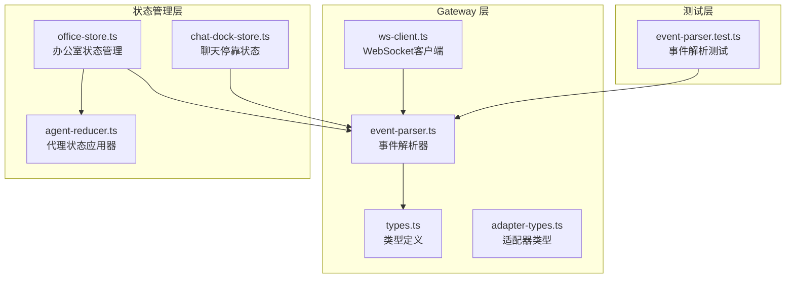
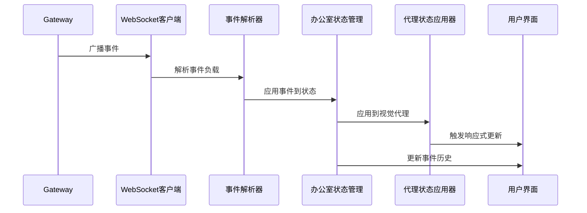
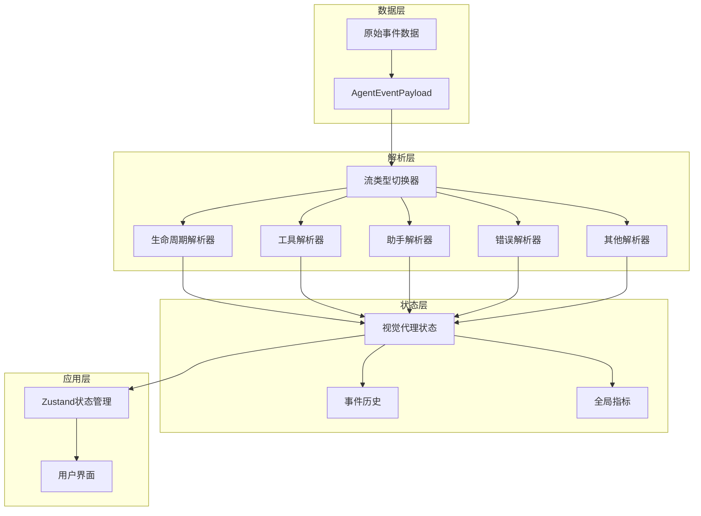
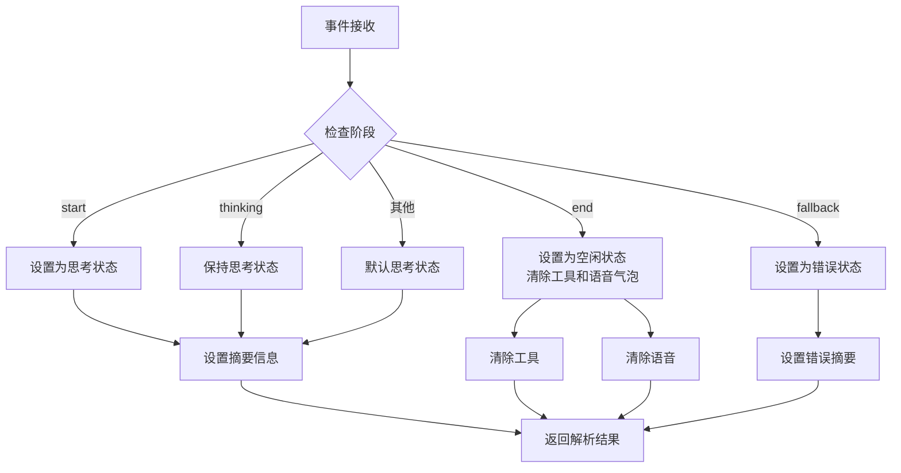
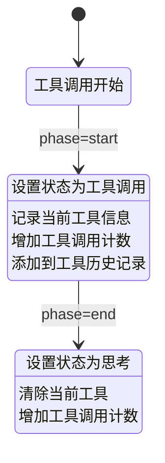
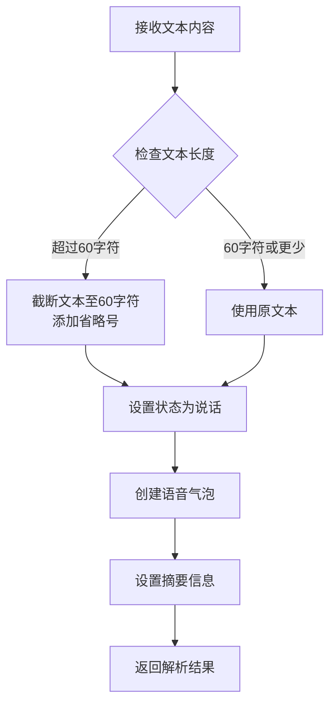
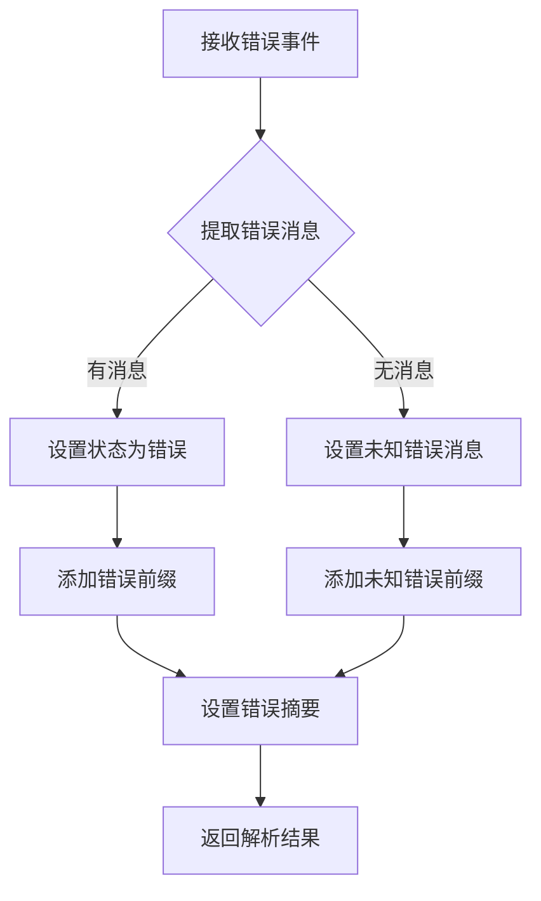
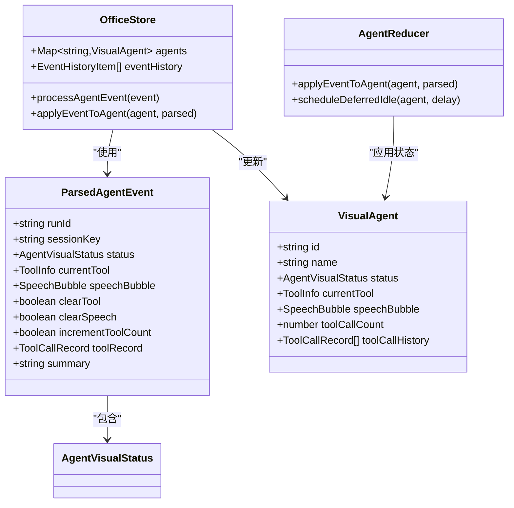
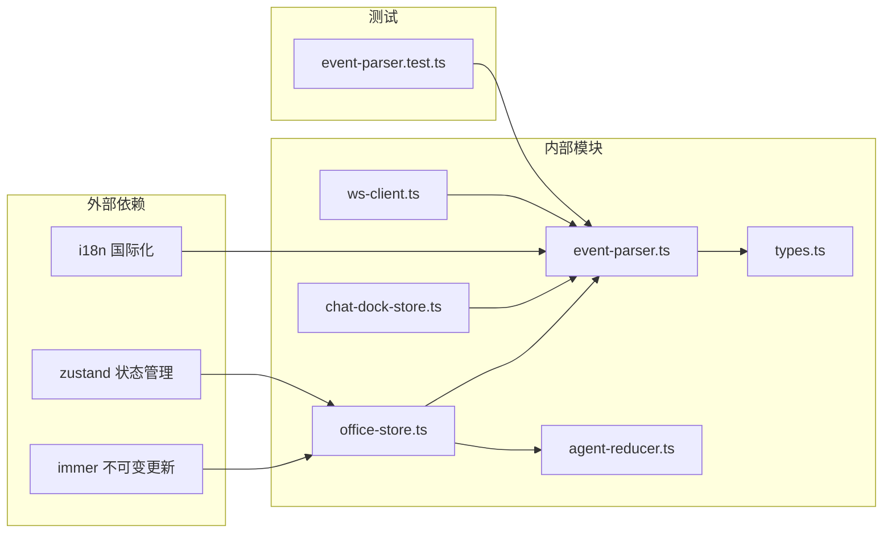

# 事件解析系统

<cite>
**本文档引用的文件**
- [event-parser.ts](file://src/gateway/event-parser.ts)
- [types.ts](file://src/gateway/types.ts)
- [ws-client.ts](file://src/gateway/ws-client.ts)
- [adapter-types.ts](file://src/gateway/adapter-types.ts)
- [office-store.ts](file://src/store/office-store.ts)
- [agent-reducer.ts](file://src/store/agent-reducer.ts)
- [chat-dock-store.ts](file://src/store/console-stores/chat-dock-store.ts)
- [event-parser.test.ts](file://src/gateway/__tests__/event-parser.test.ts)
</cite>

## 目录
1. [简介](#简介)
2. [项目结构](#项目结构)
3. [核心组件](#核心组件)
4. [架构概览](#架构概览)
5. [详细组件分析](#详细组件分析)
6. [依赖分析](#依赖分析)
7. [性能考虑](#性能考虑)
8. [故障排除指南](#故障排除指南)
9. [结论](#结论)
10. [附录](#附录)

## 简介

事件解析系统是 OpenClaw Office 中负责处理 Gateway 广播事件的核心模块。该系统将来自 Gateway 的原始事件数据转换为应用可用的结构化对象，并驱动 Zustand 状态管理实现响应式更新。系统支持多种事件类型，包括 agent 事件、chat 事件、presence 事件、health 事件等，每种类型都有特定的数据结构和处理流程。

## 项目结构

事件解析系统主要分布在以下目录中：



**图表来源**
- [event-parser.ts:1-225](file://src/gateway/event-parser.ts#L1-L225)
- [types.ts:1-402](file://src/gateway/types.ts#L1-L402)
- [office-store.ts:1-1781](file://src/store/office-store.ts#L1-L1781)

**章节来源**
- [event-parser.ts:1-225](file://src/gateway/event-parser.ts#L1-L225)
- [types.ts:1-402](file://src/gateway/types.ts#L1-L402)

## 核心组件

### 事件解析器 (Event Parser)

事件解析器是系统的核心组件，负责将原始的 AgentEventPayload 转换为 ParsedAgentEvent 结构。它支持 11 种不同的事件流类型：

- **生命周期事件 (lifecycle)**: 处理代理的启动、思考、结束、回退状态
- **工具事件 (tool)**: 跟踪工具调用的开始和结束
- **助手事件 (assistant)**: 处理 AI 助手的文本输出
- **错误事件 (error)**: 处理运行时错误
- **项目事件 (item)**: 跟踪具体任务或项目的执行状态
- **计划事件 (plan)**: 处理代理的计划更新
- **审批事件 (approval)**: 处理需要用户审批的操作
- **命令输出事件 (command_output)**: 处理命令行工具的输出
- **补丁事件 (patch)**: 处理文件变更补丁摘要
- **思考事件 (thinking)**: 处理模型推理过程
- **压缩事件 (compaction)**: 处理上下文压缩事件

### 状态管理集成

事件解析系统与 Zustand 状态管理深度集成：



**图表来源**
- [ws-client.ts:149-181](file://src/gateway/ws-client.ts#L149-L181)
- [event-parser.ts:17-60](file://src/gateway/event-parser.ts#L17-L60)
- [office-store.ts:762-1178](file://src/store/office-store.ts#L762-L1178)

**章节来源**
- [event-parser.ts:17-225](file://src/gateway/event-parser.ts#L17-L225)
- [office-store.ts:762-1178](file://src/store/office-store.ts#L762-L1178)

## 架构概览

事件解析系统采用分层架构设计，确保了良好的可维护性和扩展性：



**图表来源**
- [event-parser.ts:31-59](file://src/gateway/event-parser.ts#L31-L59)
- [types.ts:124-131](file://src/gateway/types.ts#L124-L131)
- [office-store.ts:217-1147](file://src/store/office-store.ts#L217-L1147)

## 详细组件分析

### 事件类型解析规则

#### 生命周期事件 (Lifecycle Events)

生命周期事件处理代理的基本状态变化：



**图表来源**
- [event-parser.ts:62-88](file://src/gateway/event-parser.ts#L62-L88)

生命周期事件的关键特征：
- **start 阶段**: 设置代理为思考状态，显示运行开始的摘要信息
- **thinking 阶段**: 保持思考状态，通常表示代理正在处理任务
- **end 阶段**: 设置代理为空闲状态，自动清除工具和语音气泡
- **fallback 阶段**: 设置代理为错误状态，表示发生了回退情况

#### 工具事件 (Tool Events)

工具事件跟踪代理使用的工具及其参数：



**图表来源**
- [event-parser.ts:90-111](file://src/gateway/event-parser.ts#L90-L111)

工具事件的处理逻辑：
- **开始阶段**: 创建工具调用记录，包含工具名称、参数和开始时间
- **结束阶段**: 清理工具调用状态，更新工具使用统计

#### 助手事件 (Assistant Events)

助手事件处理 AI 助手的文本输出：



**图表来源**
- [event-parser.ts:113-119](file://src/gateway/event-parser.ts#L113-L119)

助手事件的特点：
- 自动截断长文本以保持界面整洁
- 创建语音气泡显示实际文本内容
- 生成简洁的摘要信息用于事件历史

#### 错误事件 (Error Events)

错误事件处理运行时发生的错误：



**图表来源**
- [event-parser.ts:121-126](file://src/gateway/event-parser.ts#L121-L126)

错误事件的处理策略：
- 优先使用提供的错误消息
- 如果没有消息，使用默认的未知错误提示
- 统一添加错误前缀以提高可读性

### 状态更新机制

事件解析系统与 Zustand 状态管理的集成：



**图表来源**
- [event-parser.ts:4-15](file://src/gateway/event-parser.ts#L4-L15)
- [types.ts:166-193](file://src/gateway/types.ts#L166-L193)
- [office-store.ts:762-1178](file://src/store/office-store.ts#L762-L1178)

**章节来源**
- [office-store.ts:762-1178](file://src/store/office-store.ts#L762-L1178)
- [agent-reducer.ts:19-67](file://src/store/agent-reducer.ts#L19-L67)

## 依赖分析

事件解析系统的依赖关系图：



**图表来源**
- [event-parser.ts:1](file://src/gateway/event-parser.ts#L1)
- [office-store.ts:1-7](file://src/store/office-store.ts#L1-L7)

**章节来源**
- [event-parser.ts:1-225](file://src/gateway/event-parser.ts#L1-L225)
- [office-store.ts:1-800](file://src/store/office-store.ts#L1-L800)

## 性能考虑

事件解析系统在设计时充分考虑了性能优化：

### 内存管理
- 使用 Map 和 Set 数据结构优化查找性能
- 事件历史限制在 200 条记录以内
- 及时清理定时器和回调函数

### 异步处理
- 使用微任务队列进行非阻塞的本地持久化
- 分批处理事件以避免 UI 阻塞
- 智能的延迟处理机制

### 缓存策略
- 事件历史的本地存储
- 工具调用历史的有限缓存（最多 10 条）
- 代理状态的智能更新

## 故障排除指南

### 常见问题及解决方案

#### 事件未正确解析
- **症状**: 事件显示为未知状态或无摘要信息
- **原因**: 事件流类型不在支持列表中
- **解决**: 检查事件的 stream 字段是否为受支持的值

#### 状态更新延迟
- **症状**: UI 状态更新滞后
- **原因**: 事件处理队列阻塞
- **解决**: 检查是否有过多的同步操作

#### 内存泄漏
- **症状**: 应用内存持续增长
- **原因**: 定时器未正确清理
- **解决**: 确保所有定时器在组件卸载时清理

**章节来源**
- [event-parser.test.ts:111-140](file://src/gateway/__tests__/event-parser.test.ts#L111-L140)

## 结论

事件解析系统通过清晰的分层架构和精心设计的状态管理机制，成功地将 Gateway 的原始事件数据转换为丰富的可视化状态。系统支持多种事件类型，具有良好的扩展性，并与 Zustand 状态管理深度集成，实现了高效的响应式更新。

系统的关键优势包括：
- 模块化的事件解析器设计
- 强类型的 TypeScript 支持
- 完善的测试覆盖
- 优秀的性能表现
- 良好的错误处理机制

## 附录

### 事件解析示例

#### Agent 事件示例

**输入格式**:
```json
{
  "runId": "run-123",
  "seq": 1,
  "stream": "lifecycle",
  "ts": 1640995200000,
  "data": {
    "phase": "start",
    "agentId": "agent-001"
  },
  "sessionKey": "session-main"
}
```

**输出格式**:
```json
{
  "runId": "run-123",
  "sessionKey": "session-main",
  "status": "thinking",
  "currentTool": null,
  "speechBubble": null,
  "clearTool": false,
  "clearSpeech": false,
  "incrementToolCount": false,
  "toolRecord": null,
  "summary": "代理开始运行"
}
```

#### Chat 事件示例

**输入格式**:
```json
{
  "state": "delta",
  "runId": "run-456",
  "message": {
    "role": "assistant",
    "content": "Hello, how can I help you today?",
    "timestamp": 1640995201000
  }
}
```

**输出格式**:
```json
{
  "runtime": {
    "messages": [...],
    "activeRunId": "run-456",
    "isStreaming": true
  },
  "persist": false,
  "reloadHistory": false
}
```

### 扩展新事件类型

要添加新的事件类型处理器，需要遵循以下步骤：

1. **更新类型定义**: 在 `types.ts` 中添加新的流类型
2. **实现解析逻辑**: 在 `event-parser.ts` 中添加对应的解析函数
3. **更新状态应用**: 在 `agent-reducer.ts` 中应用新的状态变化
4. **编写测试**: 在 `event-parser.test.ts` 中添加测试用例
5. **集成到状态管理**: 在 `office-store.ts` 中注册新的事件处理器

**章节来源**
- [event-parser.ts:17-225](file://src/gateway/event-parser.ts#L17-L225)
- [types.ts:110-122](file://src/gateway/types.ts#L110-L122)