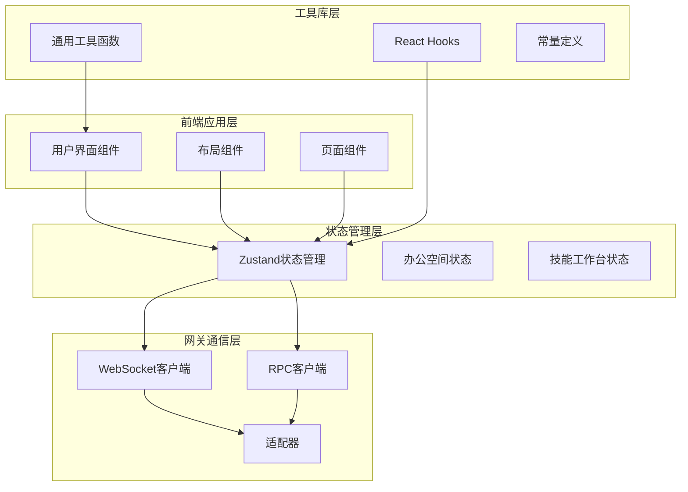
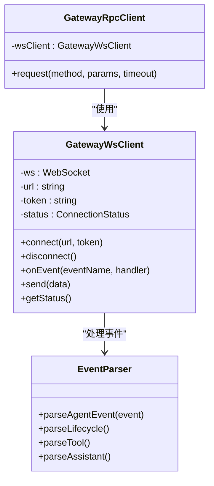
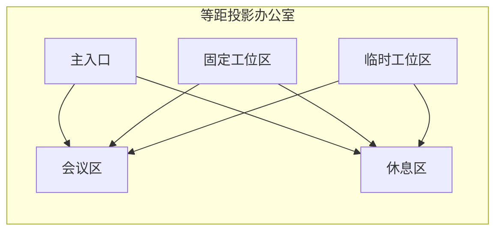
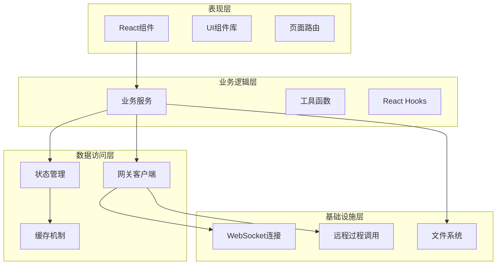
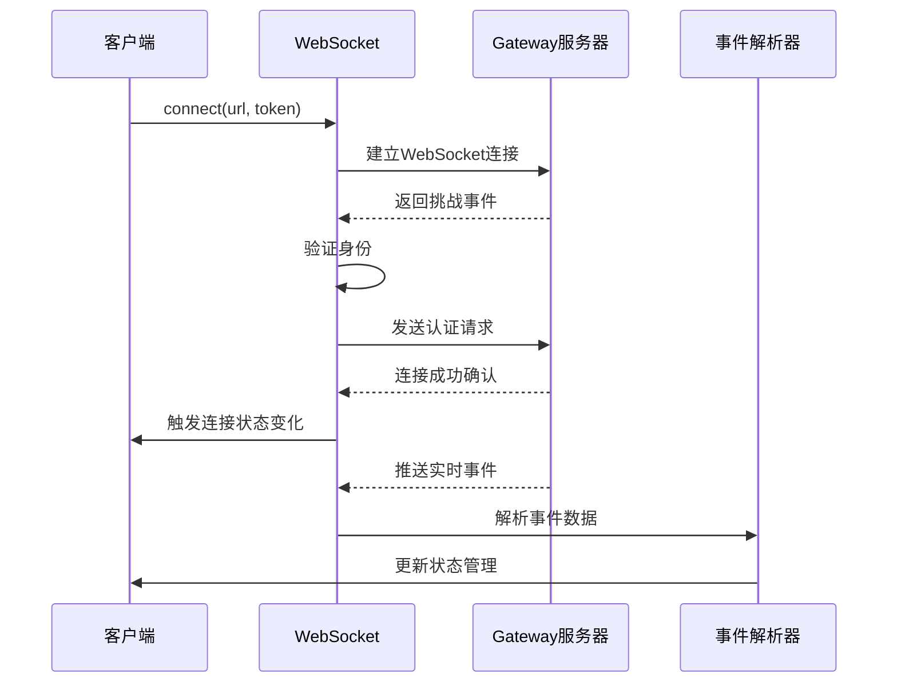
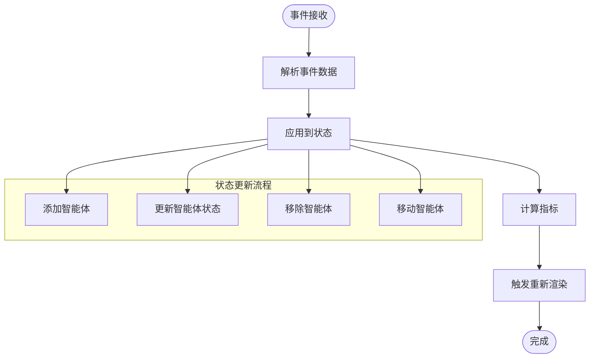
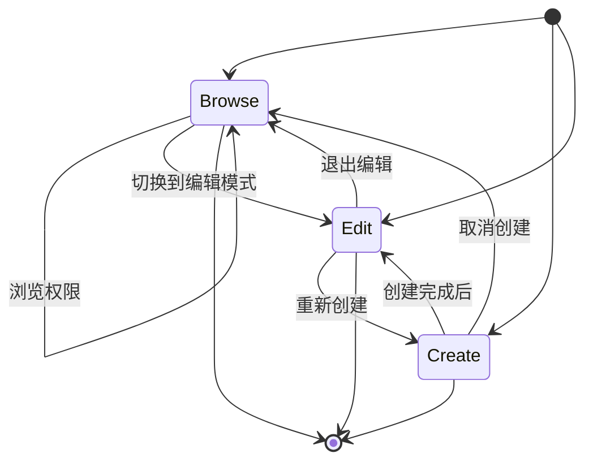
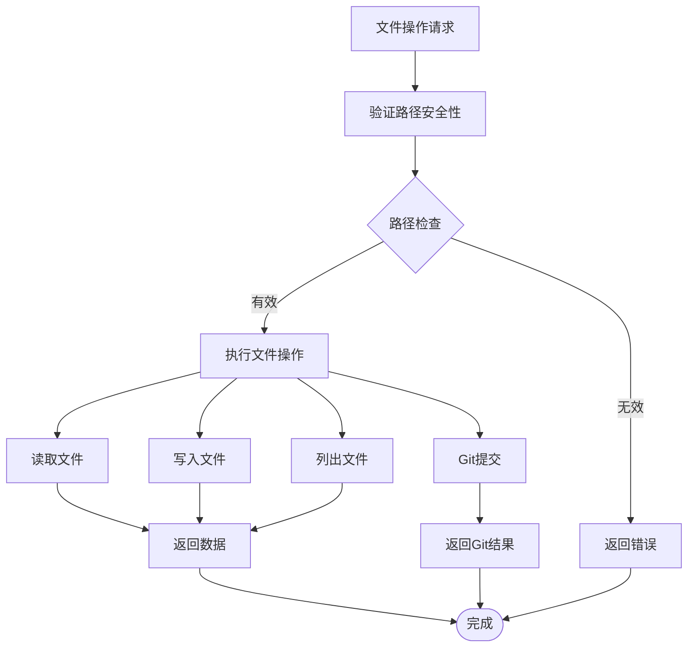
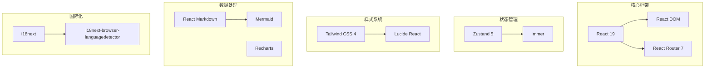

# 工作区技能客户端

<cite>
**本文档引用的文件**
- [README.md](file://README.md)
- [package.json](file://package.json)
- [src/main.tsx](file://src/main.tsx)
- [src/App.tsx](file://src/App.tsx)
- [src/gateway/workspace-skills-client.ts](file://src/gateway/workspace-skills-client.ts)
- [src/gateway/ws-client.ts](file://src/gateway/ws-client.ts)
- [src/gateway/rpc-client.ts](file://src/gateway/rpc-client.ts)
- [src/store/office-store.ts](file://src/store/office-store.ts)
- [src/components/office-2d/FloorPlan.tsx](file://src/components/office-2d/FloorPlan.tsx)
- [src/components/pages/SkillWorkbenchLayout.tsx](file://src/components/pages/SkillWorkbenchLayout.tsx)
- [src/lib/constants.ts](file://src/lib/constants.ts)
- [src/hooks/useGatewayConnection.ts](file://src/hooks/useGatewayConnection.ts)
- [src/gateway/event-parser.ts](file://src/gateway/event-parser.ts)
- [src/store/console-stores/skill-workbench-store.ts](file://src/store/console-stores/skill-workbench-store.ts)
- [vite.config.js](file://vite.config.js)
</cite>

## 目录
1. [简介](#简介)
2. [项目结构](#项目结构)
3. [核心组件](#核心组件)
4. [架构概览](#架构概览)
5. [详细组件分析](#详细组件分析)
6. [依赖关系分析](#依赖关系分析)
7. [性能考虑](#性能考虑)
8. [故障排除指南](#故障排除指南)
9. [结论](#结论)

## 简介

工作区技能客户端是 OpenClaw 多智能体系统的一个重要组成部分，它提供了可视化的技能开发和管理工作台。该项目通过等距投影的虚拟办公室场景，实时展示智能体的工作状态、协作关系和技能执行过程，同时集成了完整的技能开发工具链。

该系统的核心特色包括：
- **虚拟办公室可视化**：基于 SVG 的等距投影场景，包含工位区、临时工位、会议区和休息区
- **智能体协作监控**：实时显示智能体间的协作关系和工具调用状态
- **技能开发工作台**：集成的技能创建、编辑和管理平台
- **实时数据流**：通过 WebSocket 连接 OpenClaw Gateway 获取实时事件

## 项目结构

项目采用模块化的组织结构，主要分为以下几个核心区域：

**图表来源**
- [src/main.tsx:1-15](file://src/main.tsx#L1-L15)
- [src/App.tsx:83-135](file://src/App.tsx#L83-L135)

**章节来源**
- [README.md:1-331](file://README.md#L1-L331)
- [package.json:1-87](file://package.json#L1-L87)

## 核心组件

### 网关通信系统

系统通过 WebSocket 与 OpenClaw Gateway 建立实时连接，实现智能体状态的实时同步和控制命令的发送。

**图表来源**
- [src/gateway/ws-client.ts:24-306](file://src/gateway/ws-client.ts#L24-L306)
- [src/gateway/rpc-client.ts:17-63](file://src/gateway/rpc-client.ts#L17-L63)
- [src/gateway/event-parser.ts:17-225](file://src/gateway/event-parser.ts#L17-L225)

### 办公室可视化系统

通过 SVG 渲染实现等距投影的虚拟办公室场景，包含四个主要区域：

**图表来源**
- [src/components/office-2d/FloorPlan.tsx:23-278](file://src/components/office-2d/FloorPlan.tsx#L23-L278)
- [src/lib/constants.ts:23-28](file://src/lib/constants.ts#L23-L28)

### 技能工作台

集成的技能开发和管理工作台，提供三种模式：创建、浏览和编辑。

**章节来源**
- [src/gateway/workspace-skills-client.ts:1-97](file://src/gateway/workspace-skills-client.ts#L1-L97)
- [src/store/console-stores/skill-workbench-store.ts:155-286](file://src/store/console-stores/skill-workbench-store.ts#L155-L286)

## 架构概览

系统采用分层架构设计，各层职责清晰分离：

**图表来源**
- [src/App.tsx:83-135](file://src/App.tsx#L83-L135)
- [src/hooks/useGatewayConnection.ts:23-151](file://src/hooks/useGatewayConnection.ts#L23-L151)

## 详细组件分析

### WebSocket 连接管理

WebSocket 客户端实现了完整的连接生命周期管理，包括自动重连、事件处理和状态监控。

**图表来源**
- [src/gateway/ws-client.ts:62-132](file://src/gateway/ws-client.ts#L62-L132)
- [src/hooks/useGatewayConnection.ts:98-116](file://src/hooks/useGatewayConnection.ts#L98-L116)

### 办公室状态管理

使用 Zustand 实现的状态管理系统，负责维护整个办公室场景的状态。

**图表来源**
- [src/store/office-store.ts:245-270](file://src/store/office-store.ts#L245-L270)
- [src/store/office-store.ts:762-825](file://src/store/office-store.ts#L762-L825)

### 技能工作台交互流程

技能工作台提供了三种不同的交互模式，每种模式都有特定的会话管理和内容注入机制。

**图表来源**
- [src/store/console-stores/skill-workbench-store.ts:15-15](file://src/store/console-stores/skill-workbench-store.ts#L15-L15)

**章节来源**
- [src/gateway/ws-client.ts:1-306](file://src/gateway/ws-client.ts#L1-L306)
- [src/store/office-store.ts:1-800](file://src/store/office-store.ts#L1-L800)

### 文件系统集成

系统集成了本地文件系统操作，支持技能文件的读写和版本控制。

**图表来源**
- [vite.config.js:112-156](file://vite.config.js#L112-L156)
- [vite.config.js:323-434](file://vite.config.js#L323-L434)

**章节来源**
- [vite.config.js:1-475](file://vite.config.js#L1-L475)

## 依赖关系分析

项目使用现代化的技术栈，各依赖项之间存在清晰的层次关系：

**图表来源**
- [package.json:51-66](file://package.json#L51-L66)

**章节来源**
- [package.json:1-87](file://package.json#L1-L87)

## 性能考虑

系统在设计时充分考虑了性能优化：

1. **事件节流**：使用事件节流机制减少高频事件对 UI 的影响
2. **状态局部化**：通过 Zustand 实现细粒度的状态更新
3. **SVG 优化**：使用高效的 SVG 渲染和动画
4. **懒加载**：组件按需加载，减少初始包大小
5. **缓存策略**：聊天记录采用分片缓存，支持长期存储

## 故障排除指南

### 连接问题

当遇到 WebSocket 连接问题时，可以检查以下方面：

1. **网络连接**：确认 Gateway 服务正常运行
2. **认证令牌**：验证 VITE_GATEWAY_TOKEN 配置正确
3. **防火墙设置**：确保 WebSocket 端口未被阻止
4. **代理配置**：检查 VITE_GATEWAY_URL 设置

### 性能问题

如果遇到性能问题：

1. **事件频率**：检查是否有过多的高频事件产生
2. **状态更新**：确认状态更新是否过于频繁
3. **渲染优化**：使用 React.memo 优化组件渲染
4. **内存泄漏**：检查定时器和事件监听器的清理

### 技能工作台问题

技能工作台相关问题的排查步骤：

1. **文件权限**：确认 ~/.openclaw/workspace/skills 目录可读写
2. **Git 配置**：检查 Git 安装和配置
3. **代理设置**：验证网络代理配置
4. **缓存清理**：清除浏览器缓存后重试

**章节来源**
- [src/hooks/useGatewayConnection.ts:1-238](file://src/hooks/useGatewayConnection.ts#L1-L238)

## 结论

工作区技能客户端是一个功能完整、架构清晰的智能体协作可视化平台。它通过创新的虚拟办公室概念，将复杂的智能体协作关系直观地展现给用户，同时提供了强大的技能开发工具链。

系统的主要优势包括：
- **直观的可视化界面**：通过等距投影场景提供沉浸式的协作体验
- **实时数据同步**：基于 WebSocket 的低延迟事件传输
- **灵活的技能开发**：集成的技能工作台支持多种开发模式
- **可扩展的架构**：模块化的组件设计便于功能扩展

未来的发展方向可能包括增强的协作功能、更丰富的可视化元素以及与其他 OpenClaw 组件的深度集成。