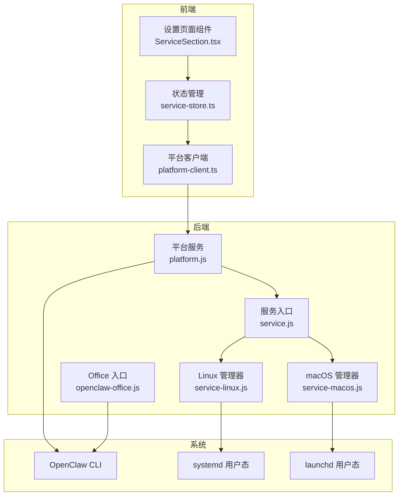
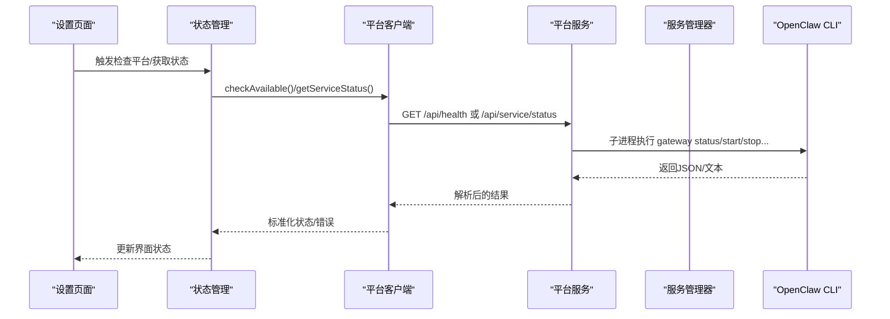
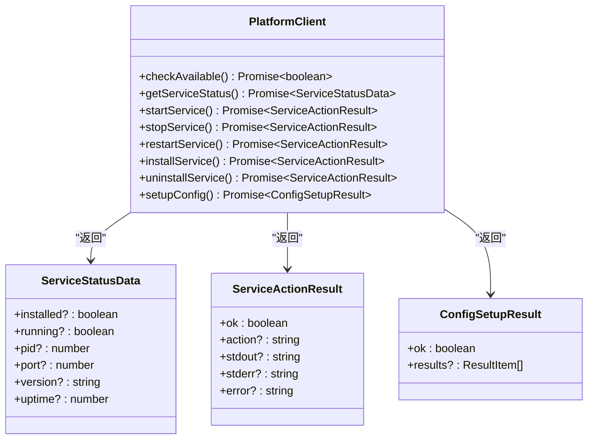
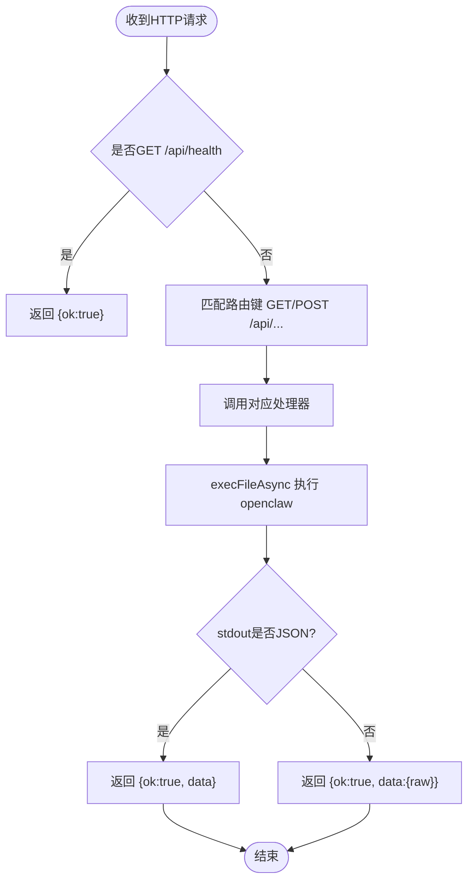
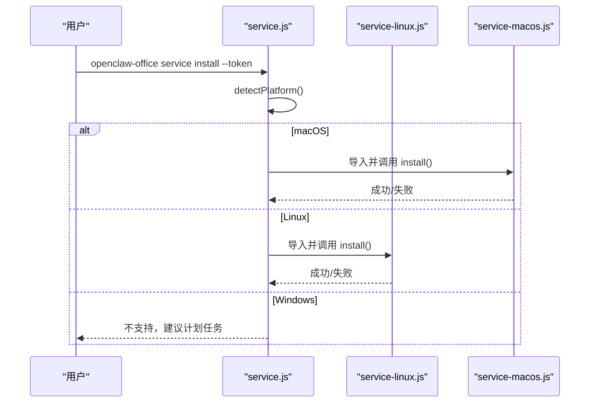
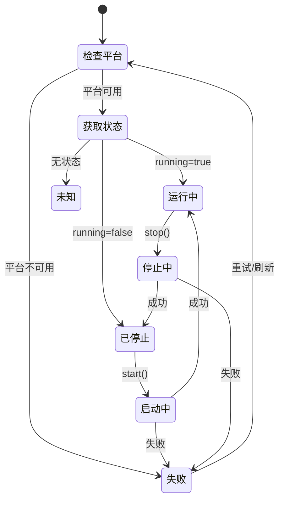
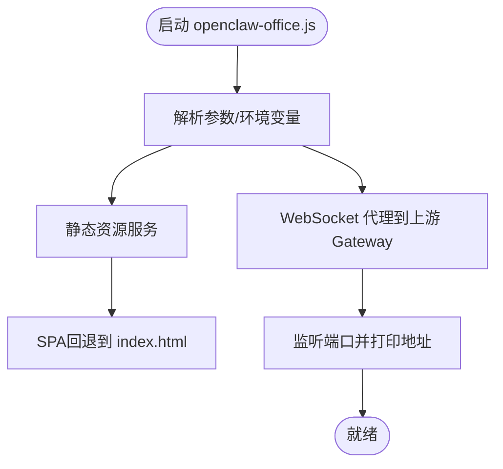
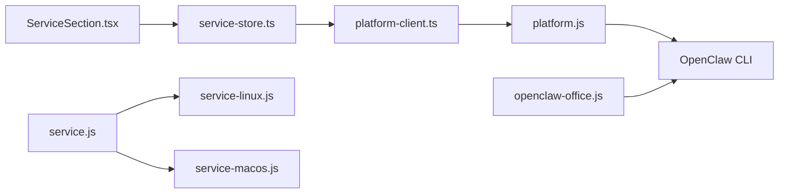

# 平台客户端

<cite>
**本文档引用的文件**
- [src/gateway/platform-client.ts](file://src/gateway/platform-client.ts)
- [bin/platform.js](file://bin/platform.js)
- [bin/service.js](file://bin/service.js)
- [bin/service-linux.js](file://bin/service-linux.js)
- [bin/service-macos.js](file://bin/service-macos.js)
- [bin/openclaw-office.js](file://bin/openclaw-office.js)
- [src/store/console-stores/service-store.ts](file://src/store/console-stores/service-store.ts)
- [src/components/console/settings/ServiceSection.tsx](file://src/components/console/settings/ServiceSection.tsx)
- [src/gateway/__tests__/platform-client.test.ts](file://src/gateway/__tests__/platform-client.test.ts)
- [src/store/__tests__/service-store.test.ts](file://src/store/__tests__/service-store.test.ts)
- [scripts/start-openclaw-office.ps1](file://scripts/start-openclaw-office.ps1)
- [scripts/wsl-bootstrap-openclaw-office.sh](file://scripts/wsl-bootstrap-openclaw-office.sh)
- [package.json](file://package.json)
</cite>

## 目录
1. [简介](#简介)
2. [项目结构](#项目结构)
3. [核心组件](#核心组件)
4. [架构总览](#架构总览)
5. [详细组件分析](#详细组件分析)
6. [依赖关系分析](#依赖关系分析)
7. [性能考量](#性能考量)
8. [故障排查指南](#故障排查指南)
9. [结论](#结论)
10. [附录](#附录)

## 简介
本文件面向平台客户端（PlatformClient）的技术文档，聚焦于其设计目标、跨平台集成接口与兼容性处理机制。平台客户端通过统一的HTTP API抽象底层平台差异，向上游提供一致的服务生命周期管理能力，包括状态查询、启停控制、安装卸载与配置设置，并在UI层以可观察的状态管理模式进行集成。

平台客户端的核心价值在于：
- 抽象不同平台（Windows、macOS、Linux）的差异，提供统一API。
- 在本地安全绑定回环地址，避免外部暴露风险。
- 支持容器化与WSL场景下的多平台部署与兼容。

## 项目结构
平台客户端涉及前后端协作：前端通过HTTP调用后端轻量HTTP服务，后端再委派至系统服务管理器（systemd/launchd），最终由OpenClaw CLI完成实际的网关生命周期管理。

图表来源
- [src/components/console/settings/ServiceSection.tsx:15-227](file://src/components/console/settings/ServiceSection.tsx#L15-L227)
- [src/store/console-stores/service-store.ts:42-204](file://src/store/console-stores/service-store.ts#L42-L204)
- [src/gateway/platform-client.ts:1-89](file://src/gateway/platform-client.ts#L1-L89)
- [bin/platform.js:110-155](file://bin/platform.js#L110-L155)
- [bin/service.js:99-161](file://bin/service.js#L99-L161)
- [bin/service-linux.js:109-157](file://bin/service-linux.js#L109-L157)
- [bin/service-macos.js:118-165](file://bin/service-macos.js#L118-L165)
- [bin/openclaw-office.js:14-20](file://bin/openclaw-office.js#L14-L20)

章节来源
- [src/gateway/platform-client.ts:1-89](file://src/gateway/platform-client.ts#L1-L89)
- [bin/platform.js:1-161](file://bin/platform.js#L1-L161)
- [bin/service.js:1-213](file://bin/service.js#L1-L213)
- [bin/service-linux.js:1-324](file://bin/service-linux.js#L1-L324)
- [bin/service-macos.js:1-299](file://bin/service-macos.js#L1-L299)
- [bin/openclaw-office.js:1-763](file://bin/openclaw-office.js#L1-L763)

## 核心组件
- 平台客户端（platform-client.ts）
  - 定义统一的HTTP接口常量与数据结构。
  - 提供健康检查、服务状态查询、启停重启、安装卸载、配置设置等方法。
  - 内置超时控制与AbortController中断机制。
- 平台服务（platform.js）
  - 轻量HTTP服务器，仅监听127.0.0.1回环地址。
  - 通过子进程调用OpenClaw CLI执行具体命令。
  - 提供/api/health、/api/service/*、/api/config/*等路由。
- 服务入口（service.js）
  - 平台检测与分发：根据平台导入对应管理器（Linux/macOS）。
  - 命令解析与令牌自动检测，支持帮助信息输出。
- 平台特定管理器
  - Linux：基于systemd用户态服务，生成服务文件与定时器，支持日志查看。
  - macOS：基于launchd用户态服务，生成plist，支持日志查看。
- Office入口（openclaw-office.js）
  - 提供静态资源服务、WebSocket代理、SPA回退。
  - 作为WSL/容器环境中的主进程入口，负责启动与日志输出。

章节来源
- [src/gateway/platform-client.ts:1-89](file://src/gateway/platform-client.ts#L1-L89)
- [bin/platform.js:1-161](file://bin/platform.js#L1-L161)
- [bin/service.js:38-161](file://bin/service.js#L38-L161)
- [bin/service-linux.js:109-293](file://bin/service-linux.js#L109-L293)
- [bin/service-macos.js:118-268](file://bin/service-macos.js#L118-L268)
- [bin/openclaw-office.js:153-762](file://bin/openclaw-office.js#L153-L762)

## 架构总览
平台客户端采用“前端HTTP调用 → 平台服务 → 系统服务管理器”的三层架构，确保在不同操作系统上提供一致的控制面。

图表来源
- [src/store/console-stores/service-store.ts:51-93](file://src/store/console-stores/service-store.ts#L51-L93)
- [src/gateway/platform-client.ts:48-88](file://src/gateway/platform-client.ts#L48-L88)
- [bin/platform.js:63-95](file://bin/platform.js#L63-L95)
- [bin/service.js:107-161](file://bin/service.js#L107-L161)

## 详细组件分析

### 组件A：平台客户端（platform-client.ts）
- 设计目标
  - 抽象平台差异，提供统一的HTTP API。
  - 保证本地安全访问（默认绑定127.0.0.1:18790）。
  - 提供超时控制与错误兜底。
- 关键接口
  - 健康检查：checkAvailable()
  - 服务状态：getServiceStatus()
  - 服务控制：startService()/stopService()/restartService()
  - 生命周期：installService()/uninstallService()
  - 配置设置：setupConfig()
- 数据结构
  - ServiceStatusData：标准化服务状态字段（installed/running/pid/port/version/uptime等）。
  - ServiceActionResult：操作返回（ok/action/stdout/stderr/error）。
  - ConfigSetupResult：配置设置批量结果。
- 错误处理
  - 网络异常捕获并返回false/错误信息。
  - 超时通过AbortController中断请求。
- 性能与可靠性
  - 默认超时15秒，避免阻塞。
  - 对非2xx响应按错误路径处理，保持前端可控。

图表来源
- [src/gateway/platform-client.ts:4-25](file://src/gateway/platform-client.ts#L4-L25)

章节来源
- [src/gateway/platform-client.ts:1-89](file://src/gateway/platform-client.ts#L1-L89)

### 组件B：平台服务（platform.js）
- 设计目标
  - 作为本地HTTP代理，将前端请求转发给OpenClaw CLI。
  - 严格限制仅接受来自127.0.0.1的请求，保障安全。
  - 提供轻量CORS支持与统一JSON响应格式。
- 路由与处理
  - /api/health：健康检查。
  - /api/service/status：查询服务状态（内部调用openclaw gateway status）。
  - /api/service/start/stop/restart/install/uninstall：执行对应动作。
  - /api/config/setup：设置控制UI相关配置项。
- 命令执行
  - 使用child_process执行OpenClaw CLI，支持超时与错误捕获。
  - 输出stdout/stderr透传到HTTP响应体。
- 安全与容错
  - 本地请求校验，拒绝非本地IP。
  - 对CLI输出进行JSON解析，失败时回退到原始输出。

图表来源
- [bin/platform.js:110-155](file://bin/platform.js#L110-L155)
- [bin/platform.js:63-95](file://bin/platform.js#L63-L95)

章节来源
- [bin/platform.js:1-161](file://bin/platform.js#L1-L161)

### 组件C：服务入口与平台特定管理器（service.js、service-linux.js、service-macos.js）
- 设计目标
  - 在Windows/macOS/Linux之间进行平台检测与分发。
  - 自动检测令牌来源（命令行/环境变量/配置文件），简化安装流程。
  - 提供一致的命令语义：install/start/stop/restart/status/log。
- 平台检测与分发
  - detectPlatform()识别darwin/linux/win32并映射为macos/linux/windows。
  - 按平台动态导入对应管理器模块。
- Linux管理器（systemd）
  - 生成用户态服务文件与日志目录。
  - 通过systemctl --user管理启停、启用、状态与日志。
  - 支持定时器用于自愈重启。
- macOS管理器（launchd）
  - 生成用户态plist文件与日志目录。
  - 通过launchctl管理加载/卸载与状态。
  - 支持标准输出/错误输出路径。
- Windows
  - 当前不支持服务管理，提示使用计划任务或手动运行。

图表来源
- [bin/service.js:107-161](file://bin/service.js#L107-L161)
- [bin/service-linux.js:109-157](file://bin/service-linux.js#L109-L157)
- [bin/service-macos.js:118-165](file://bin/service-macos.js#L118-L165)

章节来源
- [bin/service.js:38-161](file://bin/service.js#L38-L161)
- [bin/service-linux.js:109-293](file://bin/service-linux.js#L109-L293)
- [bin/service-macos.js:118-268](file://bin/service-macos.js#L118-L268)

### 组件D：状态管理与UI集成（service-store.ts、ServiceSection.tsx）
- 设计目标
  - 将平台客户端的HTTP调用封装为可观察的状态，驱动UI交互。
  - 提供自动重试与错误清理能力。
- 状态模型
  - platformAvailable：平台可达性。
  - serviceStatus：标准化后的服务状态（installed/running/pid/port）。
  - loading/error/lastAction：操作状态与反馈。
- 关键流程
  - checkPlatform：调用checkAvailable更新可达性。
  - fetchStatus：调用getServiceStatus并标准化数据。
  - start/stop/restart/install/uninstall：调用对应平台客户端方法，更新状态与错误。
  - autoStartGateway：最多重试3次，延迟3秒，成功后刷新状态。
- UI集成
  - ServiceSection.tsx订阅状态，渲染运行/停止/未知状态图标与按钮组。
  - 支持二次确认（停止/重启）与加载态显示。

图表来源
- [src/store/console-stores/service-store.ts:51-204](file://src/store/console-stores/service-store.ts#L51-L204)
- [src/components/console/settings/ServiceSection.tsx:15-227](file://src/components/console/settings/ServiceSection.tsx#L15-L227)

章节来源
- [src/store/console-stores/service-store.ts:1-205](file://src/store/console-stores/service-store.ts#L1-L205)
- [src/components/console/settings/ServiceSection.tsx:1-288](file://src/components/console/settings/ServiceSection.tsx#L1-L288)

### 组件E：Office入口与多平台部署（openclaw-office.js、WSL/Windows脚本）
- 设计目标
  - 提供静态资源服务、WebSocket代理与SPA回退。
  - 支持WSL与Windows环境的自动化部署与启动。
- 关键功能
  - 静态资源与MIME类型映射。
  - WebSocket升级代理到上游Gateway。
  - 运行时注入配置脚本（gatewayUrl/gatewayToken）。
  - 网络接口枚举与本地/网络地址打印。
- 多平台部署
  - WSL：脚本自动检测WSL发行版、安装Node/pnpm/openclaw，配置Gateway，启动Office。
  - Windows：PowerShell脚本通过WSL引导，Windows侧启动Office进程。
- 容器化考虑
  - 通过环境变量与命令行参数控制端口、主机绑定与网关地址。
  - 与systemd/launchd配合实现开机自启与自愈。

图表来源
- [bin/openclaw-office.js:153-762](file://bin/openclaw-office.js#L153-L762)
- [scripts/wsl-bootstrap-openclaw-office.sh:297-321](file://scripts/wsl-bootstrap-openclaw-office.sh#L297-L321)
- [scripts/start-openclaw-office.ps1:216-281](file://scripts/start-openclaw-office.ps1#L216-L281)

章节来源
- [bin/openclaw-office.js:1-763](file://bin/openclaw-office.js#L1-L763)
- [scripts/wsl-bootstrap-openclaw-office.sh:1-321](file://scripts/wsl-bootstrap-openclaw-office.sh#L1-L321)
- [scripts/start-openclaw-office.ps1:1-281](file://scripts/start-openclaw-office.ps1#L1-L281)

## 依赖关系分析
- 前端依赖
  - 平台客户端被状态管理模块直接依赖，状态管理模块被UI组件依赖。
- 后端依赖
  - 平台服务依赖OpenClaw CLI；服务入口根据平台动态导入Linux/macOS管理器。
- 外部依赖
  - Node内置模块（http/child_process/fs/path/os/url等）。
  - 系统服务管理器（systemd/launchd）。
- 脚本依赖
  - WSL/Windows脚本依赖WSL、sudo、systemd、launchd等系统能力。

图表来源
- [src/components/console/settings/ServiceSection.tsx:13-27](file://src/components/console/settings/ServiceSection.tsx#L13-L27)
- [src/store/console-stores/service-store.ts:1-3](file://src/store/console-stores/service-store.ts#L1-L3)
- [src/gateway/platform-client.ts:1-2](file://src/gateway/platform-client.ts#L1-L2)
- [bin/platform.js:1-11](file://bin/platform.js#L1-L11)
- [bin/service.js:15-26](file://bin/service.js#L15-L26)
- [bin/service-linux.js:10-22](file://bin/service-linux.js#L10-L22)
- [bin/service-macos.js:10-25](file://bin/service-macos.js#L10-L25)
- [bin/openclaw-office.js:3-9](file://bin/openclaw-office.js#L3-L9)

章节来源
- [package.json:25-82](file://package.json#L25-L82)

## 性能考量
- 超时控制
  - 平台客户端默认超时15秒，避免长时间阻塞。
  - 平台服务命令执行超时30秒，防止僵尸进程。
- 并发与重试
  - UI层对自动启动提供最多3次重试，间隔3秒，降低瞬时失败影响。
- I/O优化
  - 平台服务仅做轻量HTTP代理与子进程调度，避免复杂逻辑。
  - Office入口静态资源缓存与MIME映射减少重复计算。
- 日志与可观测性
  - Linux/macOS管理器分别支持journalctl与文件日志，便于问题定位。
  - 平台服务记录PID与OpenClaw二进制路径，便于诊断。

## 故障排查指南
- 平台不可达
  - 症状：设置页提示平台不可用。
  - 排查：确认平台服务是否在127.0.0.1:18790监听；检查防火墙/权限。
  - 参考：[checkAvailable:81-88](file://src/gateway/platform-client.ts#L81-L88)
- 服务状态异常
  - 症状：状态未知或错误信息。
  - 排查：查看平台服务返回的stdout/stderr；检查OpenClaw CLI是否正常。
  - 参考：[getServiceStatus:48-55](file://src/gateway/platform-client.ts#L48-L55)
- 启停失败
  - 症状：start/stop/restart失败且显示错误。
  - 排查：查看lastAction.message；Linux使用journalctl，macOS查看日志文件。
  - 参考：[service-store.ts:95-148](file://src/store/console-stores/service-store.ts#L95-L148)
- Windows不支持
  - 症状：提示Windows服务管理尚未支持。
  - 处理：使用计划任务或手动运行；参考[service.js:109-113](file://bin/service.js#L109-L113)
- WSL/容器部署问题
  - 症状：WSL未启用systemd或缺少sudo。
  - 处理：按脚本提示启用systemd并重启；确保WSL发行版具备必要工具。
  - 参考：[wsl-bootstrap-openclaw-office.sh:50-65](file://scripts/wsl-bootstrap-openclaw-office.sh#L50-L65)

章节来源
- [src/gateway/platform-client.ts:81-88](file://src/gateway/platform-client.ts#L81-L88)
- [src/store/console-stores/service-store.ts:95-148](file://src/store/console-stores/service-store.ts#L95-L148)
- [bin/service.js:109-113](file://bin/service.js#L109-L113)
- [scripts/wsl-bootstrap-openclaw-office.sh:50-65](file://scripts/wsl-bootstrap-openclaw-office.sh#L50-L65)

## 结论
平台客户端通过“前端HTTP → 平台服务 → 系统服务管理器”的清晰分层，实现了对Windows、macOS、Linux的统一抽象与一致控制体验。其设计强调安全性（仅本地访问）、可维护性（最小HTTP代理）与可扩展性（按平台动态导入）。结合状态管理与UI组件，平台客户端为用户提供直观的服务生命周期管理能力，并在WSL/容器等复杂环境中提供了稳健的部署方案。

## 附录

### 使用示例（不同平台）
- Windows（WSL）
  - 使用PowerShell脚本启动：[start-openclaw-office.ps1:245-281](file://scripts/start-openclaw-office.ps1#L245-L281)
  - 脚本会自动检测WSL发行版、安装依赖、启动Gateway与Office。
- Linux（systemd）
  - 使用服务入口安装：[service.js:109-157](file://bin/service.js#L109-L157)
  - 通过systemctl --user管理启停与状态。
- macOS（launchd）
  - 使用服务入口安装：[service.js:122-126](file://bin/service.js#L122-L126)
  - 通过launchctl管理启停与状态。

章节来源
- [scripts/start-openclaw-office.ps1:245-281](file://scripts/start-openclaw-office.ps1#L245-L281)
- [bin/service.js:109-157](file://bin/service.js#L109-L157)

### 扩展性设计（新增平台）
- 新增步骤
  - 在服务入口添加平台检测分支并导入新管理器模块。
  - 实现新管理器的install/start/stop/restart/status/log等方法。
  - 在平台服务中增加对应路由与处理函数。
  - 在UI层补充状态展示与操作按钮。
- 参考实现
  - Linux/macOS管理器：[service-linux.js:109-293](file://bin/service-linux.js#L109-L293)、[service-macos.js:118-268](file://bin/service-macos.js#L118-L268)
  - 平台服务路由：[platform.js:110-118](file://bin/platform.js#L110-L118)

章节来源
- [bin/service.js:107-161](file://bin/service.js#L107-L161)
- [bin/service-linux.js:109-293](file://bin/service-linux.js#L109-L293)
- [bin/service-macos.js:118-268](file://bin/service-macos.js#L118-L268)
- [bin/platform.js:110-118](file://bin/platform.js#L110-L118)

### 与系统服务集成关系
- Linux：systemd用户态服务文件与定时器，日志落盘至用户目录。
- macOS：launchd用户态plist，日志落盘至用户目录。
- Windows：当前不支持服务管理，建议计划任务或手动运行。

章节来源
- [bin/service-linux.js:109-293](file://bin/service-linux.js#L109-L293)
- [bin/service-macos.js:118-268](file://bin/service-macos.js#L118-L268)
- [bin/service.js:109-113](file://bin/service.js#L109-L113)

### 容器化部署考虑
- 端口与主机绑定
  - 通过环境变量PORT/HOST或命令行参数控制。
- 网关连接
  - 通过OPENCLAW_GATEWAY_URL或命令行参数指定WebSocket地址。
- 权限与日志
  - 容器内需具备执行OpenClaw CLI的权限；日志输出至标准输出/错误。
- 参考入口
  - [openclaw-office.js:14-20](file://bin/openclaw-office.js#L14-L20)、[openclaw-office.js:143-149](file://bin/openclaw-office.js#L143-L149)

章节来源
- [bin/openclaw-office.js:14-20](file://bin/openclaw-office.js#L14-L20)
- [bin/openclaw-office.js:143-149](file://bin/openclaw-office.js#L143-L149)