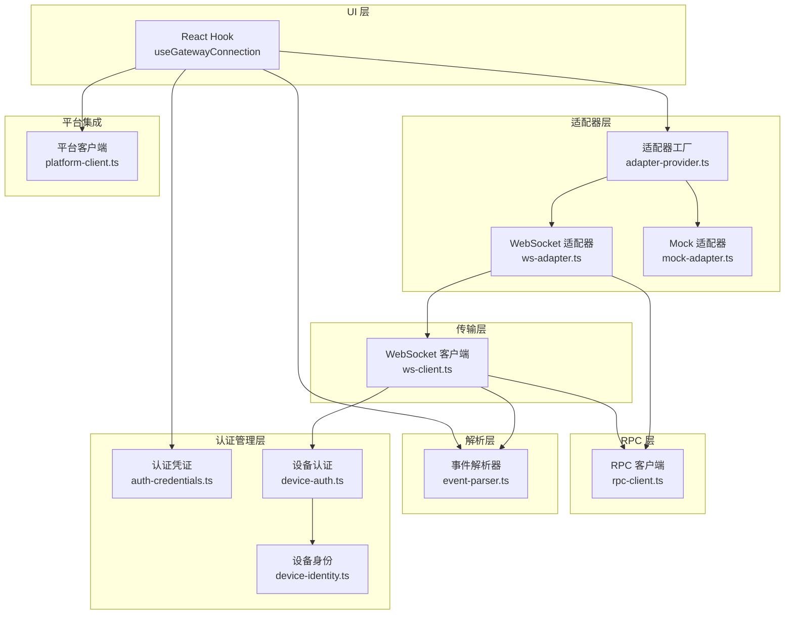
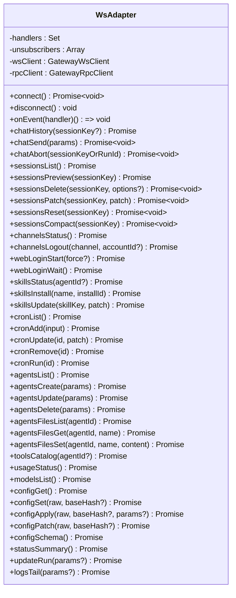
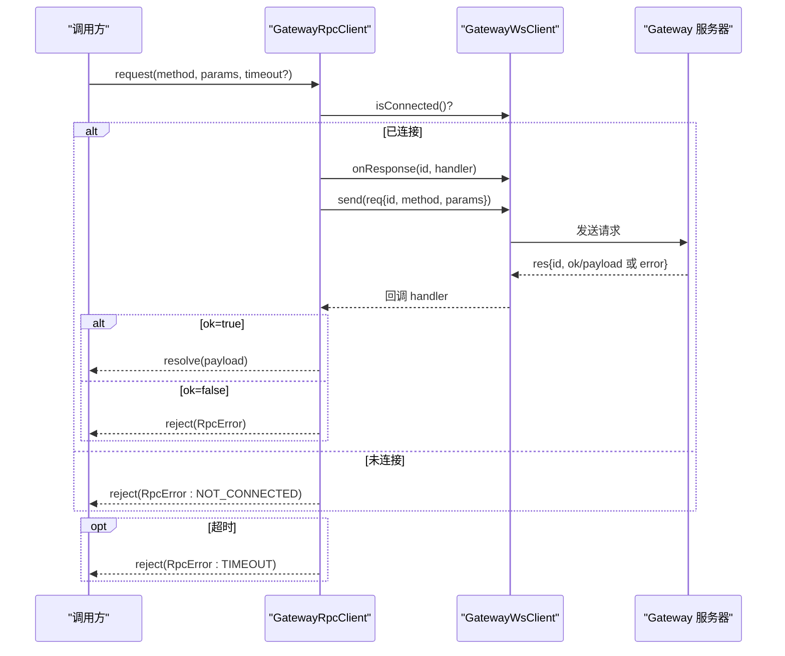
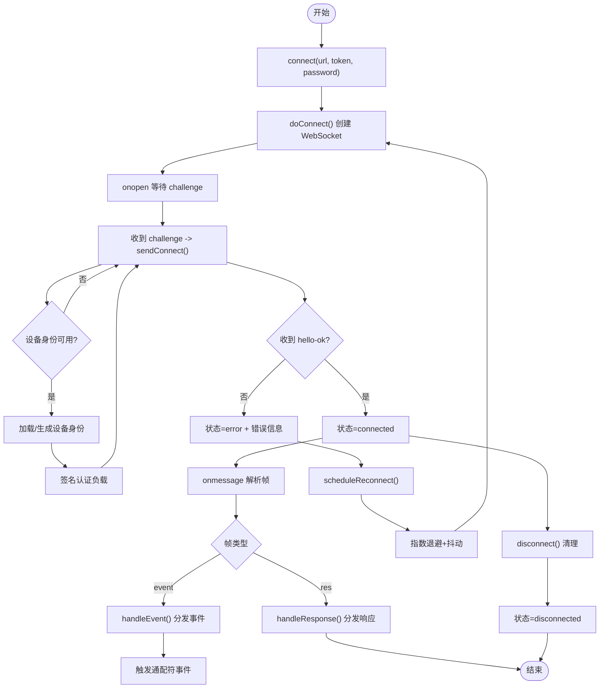
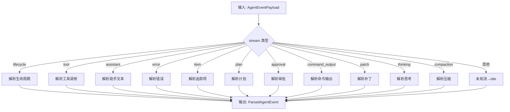
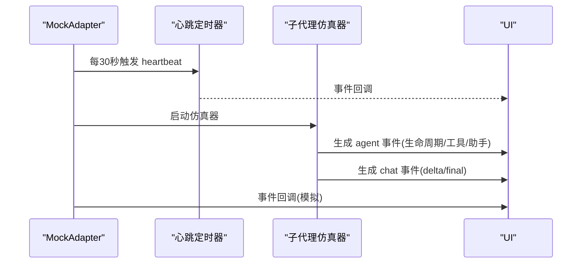
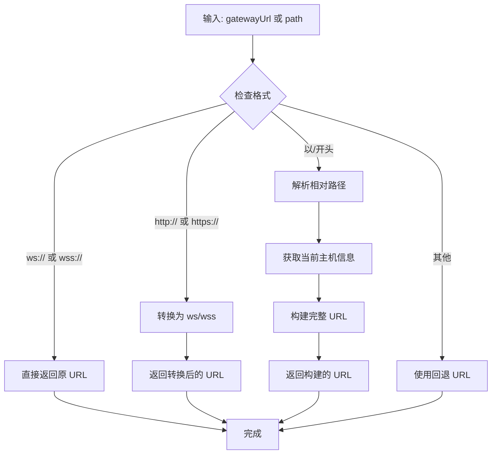
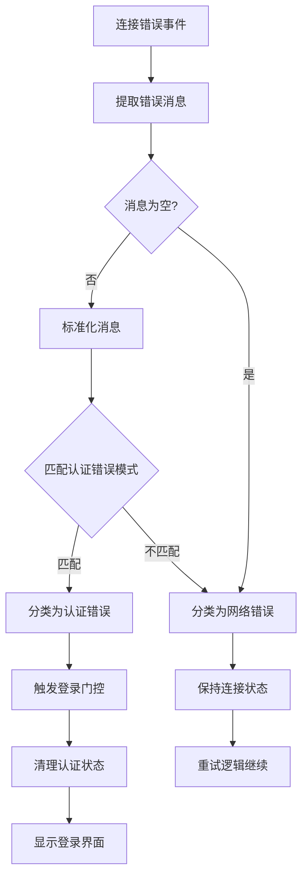
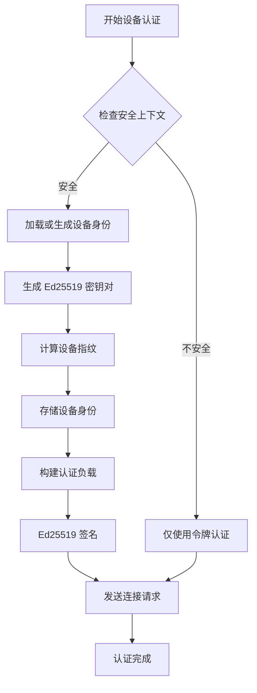
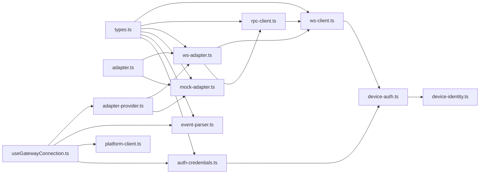

# 网关通信层

<cite>
**本文引用的文件**
- [src/gateway/ws-adapter.ts](file://src/gateway/ws-adapter.ts)
- [src/gateway/rpc-client.ts](file://src/gateway/rpc-client.ts)
- [src/gateway/event-parser.ts](file://src/gateway/event-parser.ts)
- [src/gateway/mock-adapter.ts](file://src/gateway/mock-adapter.ts)
- [src/gateway/platform-client.ts](file://src/gateway/platform-client.ts)
- [src/gateway/ws-client.ts](file://src/gateway/ws-client.ts)
- [src/gateway/adapter.ts](file://src/gateway/adapter.ts)
- [src/gateway/adapter-types.ts](file://src/gateway/adapter-types.ts)
- [src/gateway/adapter-provider.ts](file://src/gateway/adapter-provider.ts)
- [src/gateway/types.ts](file://src/gateway/types.ts)
- [src/hooks/useGatewayConnection.ts](file://src/hooks/useGatewayConnection.ts)
- [src/gateway/auth-credentials.ts](file://src/gateway/auth-credentials.ts)
- [src/gateway/device-auth.ts](file://src/gateway/device-auth.ts)
- [src/gateway/device-identity.ts](file://src/gateway/device-identity.ts)
- [src/gateway/__tests__/ws-client.test.ts](file://src/gateway/__tests__/ws-client.test.ts)
- [src/gateway/__tests__/auth-credentials.test.ts](file://src/gateway/__tests__/auth-credentials.test.ts)
</cite>

## 更新摘要
**所做更改**
- 新增了增强的网关连接逻辑章节，重点描述认证失败处理和 WebSocket URL 解析机制
- 更新了 WebSocket 客户端实现细节，包括设备身份认证和错误分类处理
- 新增了设备身份管理和认证凭证存储的相关内容
- 完善了连接状态管理和错误处理的架构图示

## 目录
1. [简介](#简介)
2. [项目结构](#项目结构)
3. [核心组件](#核心组件)
4. [架构总览](#架构总览)
5. [详细组件分析](#详细组件分析)
6. [增强的网关连接逻辑](#增强的网关连接逻辑)
7. [依赖关系分析](#依赖关系分析)
8. [性能考量](#性能考量)
9. [故障排查指南](#故障排查指南)
10. [结论](#结论)
11. [附录](#附录)

## 简介
本文件面向"网关通信层"的技术文档，聚焦以下目标：
- WebSocket 适配器设计：连接管理、心跳机制、重连策略、错误处理
- RPC 客户端实现：远程过程调用封装、请求响应模式、超时处理
- 事件解析系统：Gateway 广播事件的解析逻辑、事件类型处理、数据格式转换
- Mock 模式支持：无需 Gateway 即可开发的模拟机制、测试数据生成、开发调试流程
- 平台客户端：与不同平台的集成接口、兼容性处理
- **新增** 增强的网关连接逻辑：认证失败处理、WebSocket URL 解析、设备身份认证
- 通信协议细节、性能优化、安全考虑
- 具体的 API 接口和使用示例

## 项目结构
网关通信层位于 src/gateway 目录，采用分层设计：
- 适配器层：统一对外接口，提供 WebSocket 与 Mock 两种实现
- 传输层：WebSocket 客户端负责连接、事件与响应处理
- RPC 层：基于 WebSocket 的请求/响应封装，带超时与错误语义
- 解析层：将 Gateway 广播事件映射为前端可视状态
- 平台集成：与本地服务的交互接口
- Hook 层：在 UI 中初始化与使用适配器
- **新增** 认证管理层：处理设备身份认证、凭证存储和错误分类



**图表来源**
- [src/hooks/useGatewayConnection.ts:23-151](file://src/hooks/useGatewayConnection.ts#L23-L151)
- [src/gateway/adapter-provider.ts:50-103](file://src/gateway/adapter-provider.ts#L50-L103)
- [src/gateway/ws-adapter.ts:40-83](file://src/gateway/ws-adapter.ts#L40-L83)
- [src/gateway/mock-adapter.ts:564-621](file://src/gateway/mock-adapter.ts#L564-L621)
- [src/gateway/ws-client.ts:22-102](file://src/gateway/ws-client.ts#L22-L102)
- [src/gateway/rpc-client.ts:17-62](file://src/gateway/rpc-client.ts#L17-L62)
- [src/gateway/event-parser.ts:17-60](file://src/gateway/event-parser.ts#L17-L60)
- [src/gateway/platform-client.ts:1-89](file://src/gateway/platform-client.ts#L1-L89)
- [src/gateway/auth-credentials.ts:1-116](file://src/gateway/auth-credentials.ts#L1-L116)
- [src/gateway/device-auth.ts:1-25](file://src/gateway/device-auth.ts#L1-L25)
- [src/gateway/device-identity.ts:1-118](file://src/gateway/device-identity.ts#L1-L118)

**章节来源**
- [src/gateway/adapter.ts:46-112](file://src/gateway/adapter.ts#L46-L112)
- [src/gateway/types.ts:39-106](file://src/gateway/types.ts#L39-L106)

## 核心组件
- 适配器接口：统一聊天、会话、通道、技能、定时任务、代理与工具、模型目录、配置与状态、日志等操作的抽象
- WebSocket 适配器：订阅 Gateway 广播事件，封装 RPC 请求
- RPC 客户端：请求/响应封装、超时控制、错误语义
- WebSocket 客户端：连接生命周期、握手挑战、事件/响应分发、指数退避重连、**新增** 设备身份认证
- 事件解析器：将 Agent 事件流映射为前端可视状态
- Mock 适配器：无 Gateway 的开发/测试模式，生成模拟事件与数据
- 平台客户端：与本地服务的 HTTP 交互
- 适配器工厂：根据模式选择具体实现并管理初始化与等待
- **新增** 认证凭证管理：存储和管理网关连接凭证，支持本地存储和错误分类
- **新增** 设备身份认证：在安全上下文中生成和管理设备身份，支持设备签名认证

**章节来源**
- [src/gateway/adapter.ts:46-112](file://src/gateway/adapter.ts#L46-L112)
- [src/gateway/ws-adapter.ts:40-353](file://src/gateway/ws-adapter.ts#L40-L353)
- [src/gateway/rpc-client.ts:17-62](file://src/gateway/rpc-client.ts#L17-L62)
- [src/gateway/ws-client.ts:22-303](file://src/gateway/ws-client.ts#L22-L303)
- [src/gateway/event-parser.ts:17-225](file://src/gateway/event-parser.ts#L17-L225)
- [src/gateway/mock-adapter.ts:564-800](file://src/gateway/mock-adapter.ts#L564-L800)
- [src/gateway/platform-client.ts:1-89](file://src/gateway/platform-client.ts#L1-L89)
- [src/gateway/adapter-provider.ts:50-130](file://src/gateway/adapter-provider.ts#L50-L130)
- [src/gateway/auth-credentials.ts:1-116](file://src/gateway/auth-credentials.ts#L1-L116)
- [src/gateway/device-auth.ts:1-25](file://src/gateway/device-auth.ts#L1-L25)
- [src/gateway/device-identity.ts:1-118](file://src/gateway/device-identity.ts#L1-L118)

## 架构总览
下图展示从 UI 到 Gateway 的端到端流程，包括连接建立、事件订阅、RPC 请求与响应、以及 Mock 模式的替代路径。**更新** 新增了认证失败处理和 WebSocket URL 解析的流程。

```mermaid
sequenceDiagram
participant UI as "UI 应用"
participant Hooks as "useGatewayConnection"
participant AP as "适配器工厂"
participant WA as "WebSocket 适配器"
participant WC as "WebSocket 客户端"
participant RC as "RPC 客户端"
participant GW as "Gateway 服务器"
participant AC as "认证凭证"
UI->>Hooks : 初始化连接参数
Hooks->>AC : 加载存储的凭证
AC-->>Hooks : 返回凭证信息
Hooks->>Hooks : 解析 WebSocket URL
Hooks->>AP : initAdapter(mode)
alt 模式=WS
AP->>WA : 创建并 connect()
WA->>WC : 订阅事件
WA->>RC : 发起 RPC 请求
WC->>GW : 握手/认证(connect)
GW-->>WC : hello-ok/事件
WC-->>WA : 事件回调
RC->>GW : req(id, method, params)
GW-->>RC : res(id, ok/payload 或 error)
alt 认证失败
WC->>Hooks : 状态=error + 错误信息
Hooks->>AC : 分类认证错误
AC-->>Hooks : 返回错误类型
Hooks->>Hooks : 处理认证失败
else 模式=Mock
AP->>WA : 创建并 connect()
WA->>WA : 定时 heartbeat
WA-->>Hooks : 事件回调(模拟)
end
Hooks-->>UI : 更新连接状态/代理列表/配置
```

**图表来源**
- [src/hooks/useGatewayConnection.ts:41-126](file://src/hooks/useGatewayConnection.ts#L41-L126)
- [src/gateway/adapter-provider.ts:50-103](file://src/gateway/adapter-provider.ts#L50-L103)
- [src/gateway/ws-adapter.ts:59-83](file://src/gateway/ws-adapter.ts#L59-L83)
- [src/gateway/ws-client.ts:104-197](file://src/gateway/ws-client.ts#L104-L197)
- [src/gateway/rpc-client.ts:20-61](file://src/gateway/rpc-client.ts#L20-L61)
- [src/gateway/mock-adapter.ts:572-596](file://src/gateway/mock-adapter.ts#L572-L596)
- [src/gateway/auth-credentials.ts:68-101](file://src/gateway/auth-credentials.ts#L68-L101)

## 详细组件分析

### WebSocket 适配器（WsAdapter）
- 连接管理：订阅固定事件集合（agent、chat、presence、health、heartbeat、cron、shutdown），并将事件转发给注册的处理器
- RPC 封装：将高层 API 映射为 RPC 方法调用，自动处理附件编码、幂等键、会话键等
- 数据映射：将底层响应标准化（如频道状态扁平化、技能条目映射、重启提示归一化）



**图表来源**
- [src/gateway/ws-adapter.ts:40-353](file://src/gateway/ws-adapter.ts#L40-L353)

**章节来源**
- [src/gateway/ws-adapter.ts:49-83](file://src/gateway/ws-adapter.ts#L49-L83)
- [src/gateway/ws-adapter.ts:85-353](file://src/gateway/ws-adapter.ts#L85-L353)

### RPC 客户端（GatewayRpcClient）
- 请求/响应模型：每个请求分配唯一 id，等待对应响应；支持超时与错误语义
- 超时控制：默认超时时间可配置，超时后抛出 RpcError
- 错误处理：响应错误时抛出 RpcError，包含 code 与 message



**图表来源**
- [src/gateway/rpc-client.ts:17-62](file://src/gateway/rpc-client.ts#L17-L62)

**章节来源**
- [src/gateway/rpc-client.ts:5-15](file://src/gateway/rpc-client.ts#L5-L15)
- [src/gateway/rpc-client.ts:20-61](file://src/gateway/rpc-client.ts#L20-L61)

### WebSocket 客户端（GatewayWsClient）
- 连接生命周期：connect/disconnect，状态机包含 connecting/connected/reconnecting/disconnected/error
- 握手与认证：接收 connect.challenge 后发送 connect 请求，成功后进入 connected
- 事件与响应：区分 event 与 res 帧，分别路由到事件处理器与响应处理器
- 重连策略：指数退避 + 随机抖动，最大尝试次数限制
- 关闭与清理：关闭时清除重连定时器，避免重复重连
- **新增** 设备身份认证：在安全上下文中生成设备身份，支持设备签名认证



**图表来源**
- [src/gateway/ws-client.ts:118-144](file://src/gateway/ws-client.ts#L118-L144)
- [src/gateway/ws-client.ts:163-195](file://src/gateway/ws-client.ts#L163-L195)
- [src/gateway/ws-client.ts:213-280](file://src/gateway/ws-client.ts#L213-L280)
- [src/gateway/ws-client.ts:290-308](file://src/gateway/ws-client.ts#L290-L308)

**章节来源**
- [src/gateway/ws-client.ts:22-102](file://src/gateway/ws-client.ts#L22-L102)
- [src/gateway/ws-client.ts:104-197](file://src/gateway/ws-client.ts#L104-L197)
- [src/gateway/ws-client.ts:270-303](file://src/gateway/ws-client.ts#L270-L303)

### 事件解析系统（event-parser）
- 输入：AgentEventPayload（包含 runId、stream、data、ts 等）
- 输出：ParsedAgentEvent（包含可视状态、当前工具、气泡文本、摘要等）
- 流类型覆盖：lifecycle、tool、assistant、error、item、plan、approval、command_output、patch、thinking、compaction
- 文本截断与摘要：对长文本进行截断，便于 UI 展示
- 国际化：摘要与错误消息使用 i18n



**图表来源**
- [src/gateway/event-parser.ts:17-225](file://src/gateway/event-parser.ts#L17-L225)

**章节来源**
- [src/gateway/event-parser.ts:17-225](file://src/gateway/event-parser.ts#L17-L225)

### Mock 适配器（MockAdapter）
- 连接与心跳：启动定时器周期性发出 heartbeat 事件
- 子代理仿真：模拟多代理并发运行、工具调用、会话共享等协作行为
- 事件生成：按时间序列生成 agent、chat 等事件，模拟真实 Gateway 行为
- 数据模拟：提供频道、技能、定时任务、配置等模拟数据
- 取消与清理：支持取消挂起定时器、停止仿真器、清理处理器



**图表来源**
- [src/gateway/mock-adapter.ts:572-596](file://src/gateway/mock-adapter.ts#L572-L596)
- [src/gateway/mock-adapter.ts:580-584](file://src/gateway/mock-adapter.ts#L580-L584)
- [src/gateway/mock-adapter.ts:645-791](file://src/gateway/mock-adapter.ts#L645-L791)

**章节来源**
- [src/gateway/mock-adapter.ts:564-800](file://src/gateway/mock-adapter.ts#L564-L800)

### 平台客户端（platform-client）
- 本地服务交互：与本地服务的 HTTP API 通信，提供服务状态查询、安装/卸载、启动/停止、配置设置等
- 超时控制：统一超时时间，避免阻塞
- 健康检查：快速检查本地服务可用性

**章节来源**
- [src/gateway/platform-client.ts:1-89](file://src/gateway/platform-client.ts#L1-L89)

### 适配器工厂与 Hook 使用
- 适配器工厂：根据模式创建适配器实例，管理初始化状态与等待者队列
- Hook 使用：在 UI 中初始化 WebSocket 或 Mock 适配器，订阅事件，拉取配置与代理列表，设置连接状态与权限范围

**章节来源**
- [src/gateway/adapter-provider.ts:50-130](file://src/gateway/adapter-provider.ts#L50-L130)
- [src/hooks/useGatewayConnection.ts:41-126](file://src/hooks/useGatewayConnection.ts#L41-L126)

## 增强的网关连接逻辑

### WebSocket URL 解析机制
**新增** 系统提供了灵活的 WebSocket URL 解析功能，支持多种输入格式：

- **完整 URL 支持**：直接接受 ws:// 或 wss:// 开头的完整 URL
- **HTTP URL 转换**：自动将 http:// 或 https:// 转换为对应的 ws:// 或 wss://
- **相对路径支持**：支持以 / 开头的相对路径，自动添加当前页面协议和主机名
- **回退机制**：当无法解析时使用提供的回退 URL



**图表来源**
- [src/hooks/useGatewayConnection.ts:26-41](file://src/hooks/useGatewayConnection.ts#L26-L41)

### 认证失败处理机制
**新增** 系统实现了智能的认证错误分类和处理机制：

- **错误模式识别**：通过预定义的认证错误关键字模式识别认证失败
- **错误类型分类**：将错误分为认证错误和网络错误两类
- **用户界面处理**：认证错误触发重新登录流程，网络错误保持连接状态等待重试
- **凭证安全处理**：自动清理敏感信息，防止凭证泄露



**图表来源**
- [src/hooks/useGatewayConnection.ts:150-153](file://src/hooks/useGatewayConnection.ts#L150-L153)
- [src/gateway/auth-credentials.ts:68-101](file://src/gateway/auth-credentials.ts#L68-L101)

### 设备身份认证系统
**新增** 在安全上下文中提供设备级别的身份认证：

- **设备身份生成**：自动生成 Ed25519 密钥对，计算设备指纹
- **本地存储管理**：安全存储设备身份信息，支持跨会话持久化
- **认证负载构建**：构建标准化的认证负载字符串
- **签名验证机制**：使用 Ed25519 算法进行数字签名
- **降级兼容**：当设备认证不可用时自动降级为令牌认证



**图表来源**
- [src/gateway/ws-client.ts:242-272](file://src/gateway/ws-client.ts#L242-L272)
- [src/gateway/device-identity.ts:45-105](file://src/gateway/device-identity.ts#L45-L105)
- [src/gateway/device-auth.ts:12-24](file://src/gateway/device-auth.ts#L12-L24)

### 认证凭证管理系统
**新增** 提供完整的凭证存储和管理功能：

- **本地存储**：使用 localStorage 安全存储网关连接凭证
- **凭证加密**：自动处理敏感信息，防止明文存储
- **凭证轮换**：支持更新和替换现有凭证
- **凭证清理**：提供安全的凭证删除功能
- **错误处理**：优雅处理存储异常和格式错误

**章节来源**
- [src/hooks/useGatewayConnection.ts:26-41](file://src/hooks/useGatewayConnection.ts#L26-L41)
- [src/hooks/useGatewayConnection.ts:150-153](file://src/hooks/useGatewayConnection.ts#L150-L153)
- [src/gateway/auth-credentials.ts:1-116](file://src/gateway/auth-credentials.ts#L1-L116)
- [src/gateway/ws-client.ts:242-272](file://src/gateway/ws-client.ts#L242-L272)
- [src/gateway/device-identity.ts:1-118](file://src/gateway/device-identity.ts#L1-L118)
- [src/gateway/device-auth.ts:1-25](file://src/gateway/device-auth.ts#L1-L25)

## 依赖关系分析



**图表来源**
- [src/gateway/types.ts:1-403](file://src/gateway/types.ts#L1-L403)
- [src/gateway/ws-client.ts:1-324](file://src/gateway/ws-client.ts#L1-L324)
- [src/gateway/rpc-client.ts:1-63](file://src/gateway/rpc-client.ts#L1-L63)
- [src/gateway/ws-adapter.ts:1-521](file://src/gateway/ws-adapter.ts#L1-L521)
- [src/gateway/mock-adapter.ts:1-800](file://src/gateway/mock-adapter.ts#L1-L800)
- [src/gateway/event-parser.ts:1-225](file://src/gateway/event-parser.ts#L1-L225)
- [src/gateway/adapter.ts:1-113](file://src/gateway/adapter.ts#L1-L113)
- [src/gateway/adapter-provider.ts:1-130](file://src/gateway/adapter-provider.ts#L1-L130)
- [src/hooks/useGatewayConnection.ts:1-286](file://src/hooks/useGatewayConnection.ts#L1-L286)
- [src/gateway/platform-client.ts:1-89](file://src/gateway/platform-client.ts#L1-L89)
- [src/gateway/auth-credentials.ts:1-116](file://src/gateway/auth-credentials.ts#L1-L116)
- [src/gateway/device-auth.ts:1-25](file://src/gateway/device-auth.ts#L1-L25)
- [src/gateway/device-identity.ts:1-118](file://src/gateway/device-identity.ts#L1-L118)

**章节来源**
- [src/gateway/adapter-types.ts:1-458](file://src/gateway/adapter-types.ts#L1-L458)
- [src/gateway/adapter-provider.ts:50-103](file://src/gateway/adapter-provider.ts#L50-L103)

## 性能考量
- 事件节流：UI 层使用事件节流减少高频事件对渲染的影响
- 连接复用：WebSocket 客户端复用单连接承载事件与 RPC 请求
- 超时与重试：RPC 客户端超时避免阻塞；WebSocket 客户端指数退避重连降低风暴
- 数据映射与归一化：适配器层对响应进行归一化，减少上层分支判断成本
- Mock 模式：在开发阶段避免真实网络开销，提升迭代效率
- **新增** 设备身份缓存：设备身份信息本地持久化，避免重复生成开销
- **新增** 凭证安全存储：使用浏览器安全存储机制，提高凭证安全性

**章节来源**
- [src/hooks/useGatewayConnection.ts:88-96](file://src/hooks/useGatewayConnection.ts#L88-L96)
- [src/gateway/ws-client.ts:270-288](file://src/gateway/ws-client.ts#L270-L288)
- [src/gateway/ws-adapter.ts:393-403](file://src/gateway/ws-adapter.ts#L393-L403)
- [src/gateway/device-identity.ts:93-104](file://src/gateway/device-identity.ts#L93-L104)

## 故障排查指南
- 连接失败
  - 检查 WebSocket 客户端状态变化回调，确认是否进入 error 或 disconnected
  - 查看重连计数与延迟，确认是否达到最大重试次数
  - **新增** 检查认证错误分类，确认是否为认证失败导致的连接中断
- RPC 超时
  - 确认请求方法与参数正确，检查默认超时阈值
  - 在测试中验证响应处理器是否正确绑定与清理
- 事件未到达
  - 确认已订阅相应事件名，检查通配符事件是否生效
  - 对比事件流类型与解析器分支，确保非预期流被正确处理
- Mock 模式异常
  - 确认心跳定时器与仿真器已启动
  - 检查模拟事件的时间序列是否被正确调度
- **新增** URL 解析问题
  - 检查输入的 gatewayUrl 格式是否正确
  - 确认相对路径解析是否符合预期
  - 验证协议转换是否正确
- **新增** 认证失败问题
  - 检查认证错误消息中的关键字模式
  - 确认凭证存储是否正常工作
  - 验证设备身份生成和签名过程
- **新增** 设备认证问题
  - 检查浏览器安全上下文支持
  - 确认 WebCrypto API 可用性
  - 验证设备身份本地存储状态

**章节来源**
- [src/gateway/ws-client.ts:297-302](file://src/gateway/ws-client.ts#L297-L302)
- [src/gateway/rpc-client.ts:50-52](file://src/gateway/rpc-client.ts#L50-L52)
- [src/gateway/event-parser.ts:54-59](file://src/gateway/event-parser.ts#L54-L59)
- [src/gateway/mock-adapter.ts:572-596](file://src/gateway/mock-adapter.ts#L572-L596)
- [src/gateway/__tests__/rpc-client.test.ts:20-33](file://src/gateway/__tests__/rpc-client.test.ts#L20-L33)
- [src/gateway/__tests__/mock-adapter.test.ts:15-17](file://src/gateway/__tests__/mock-adapter.test.ts#L15-L17)
- [src/gateway/__tests__/ws-client.test.ts:87-142](file://src/gateway/__tests__/ws-client.test.ts#L87-L142)
- [src/gateway/__tests__/auth-credentials.test.ts:44-57](file://src/gateway/__tests__/auth-credentials.test.ts#L44-L57)

## 结论
该通信层以适配器为核心，将 WebSocket 与 Mock 无缝切换，结合 RPC 客户端与事件解析器，提供了稳定、可测试且易于扩展的网关通信能力。**更新** 新增的增强连接逻辑进一步提升了系统的健壮性和用户体验，包括智能的认证失败处理、灵活的 URL 解析机制和安全的设备身份认证。通过明确的协议类型、完善的错误与超时处理、丰富的测试覆盖，以及增强的安全特性，能够满足开发、测试与生产环境的不同需求。

## 附录

### 通信协议细节
- 帧类型：req（请求）、res（响应）、event（事件）
- 认证参数：最小/最大协议版本、角色、客户端标识、能力、作用域、设备签名等
- Hello 响应：包含服务器版本、特性、快照、策略等
- **新增** 设备认证：支持设备指纹、公私钥对、Ed25519 数字签名

**章节来源**
- [src/gateway/types.ts:6-35](file://src/gateway/types.ts#L6-L35)
- [src/gateway/types.ts:39-106](file://src/gateway/types.ts#L39-L106)
- [src/gateway/types.ts:253-258](file://src/gateway/types.ts#L253-L258)

### API 接口与使用示例（路径指引）
- 初始化适配器
  - [initAdapter(mode, deps?):50-86](file://src/gateway/adapter-provider.ts#L50-L86)
  - [waitForAdapter(timeoutMs?):25-48](file://src/gateway/adapter-provider.ts#L25-L48)
- WebSocket 适配器方法
  - [WsAdapter.chatHistory(sessionKey?):85-96](file://src/gateway/ws-adapter.ts#L85-L96)
  - [WsAdapter.chatSend(params):98-123](file://src/gateway/ws-adapter.ts#L98-L123)
  - [WsAdapter.sessionsList():136-139](file://src/gateway/ws-adapter.ts#L136-L139)
  - [WsAdapter.skillsStatus(agentId?):191-198](file://src/gateway/ws-adapter.ts#L191-L198)
  - [WsAdapter.cronList():208-211](file://src/gateway/ws-adapter.ts#L208-L211)
  - [WsAdapter.configGet():291-293](file://src/gateway/ws-adapter.ts#L291-L293)
  - [WsAdapter.statusSummary():330-340](file://src/gateway/ws-adapter.ts#L330-L340)
- RPC 客户端
  - [GatewayRpcClient.request(method, params?, timeoutMs?):20-61](file://src/gateway/rpc-client.ts#L20-L61)
- 事件解析
  - [parseAgentEvent(event):17-60](file://src/gateway/event-parser.ts#L17-L60)
- Mock 适配器
  - [MockAdapter.chatSend(params):645-791](file://src/gateway/mock-adapter.ts#L645-L791)
  - [MockAdapter.chatAbort(sessionKeyOrRunId):793-800](file://src/gateway/mock-adapter.ts#L793-L800)
- 平台客户端
  - [getServiceStatus():48-55](file://src/gateway/platform-client.ts#L48-L55)
  - [startService()/stopService()/restartService()]() 略
  - [setupConfig():77-79](file://src/gateway/platform-client.ts#L77-L79)
  - [checkAvailable():81-89](file://src/gateway/platform-client.ts#L81-L89)
- **新增** 认证凭证管理
  - [loadStoredCredentials():20-42](file://src/gateway/auth-credentials.ts#L20-L42)
  - [saveStoredCredentials(credentials):44-54](file://src/gateway/auth-credentials.ts#L44-L54)
  - [clearStoredCredentials():56-66](file://src/gateway/auth-credentials.ts#L56-L66)
  - [classifyConnectError(message):95-101](file://src/gateway/auth-credentials.ts#L95-L101)
  - [redactAuthError(value):104-115](file://src/gateway/auth-credentials.ts#L104-L115)
- **新增** 设备身份管理
  - [loadOrCreateDeviceIdentity():56-105](file://src/gateway/device-identity.ts#L56-L105)
  - [signDevicePayload(privateKey, payload):107-117](file://src/gateway/device-identity.ts#L107-L117)
  - [buildDeviceAuthPayload(params):12-24](file://src/gateway/device-auth.ts#L12-L24)
- **新增** URL 解析
  - [resolveGatewayWsUrl(pathOrUrl, fallbackUrl):26-41](file://src/hooks/useGatewayConnection.ts#L26-L41)