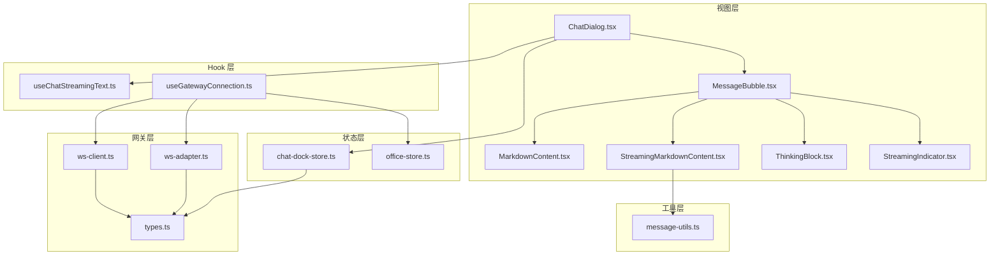
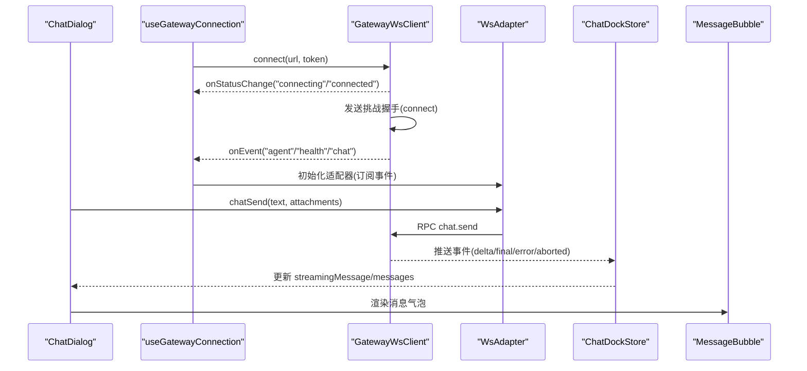
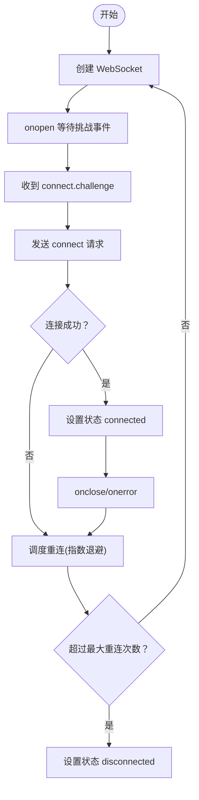
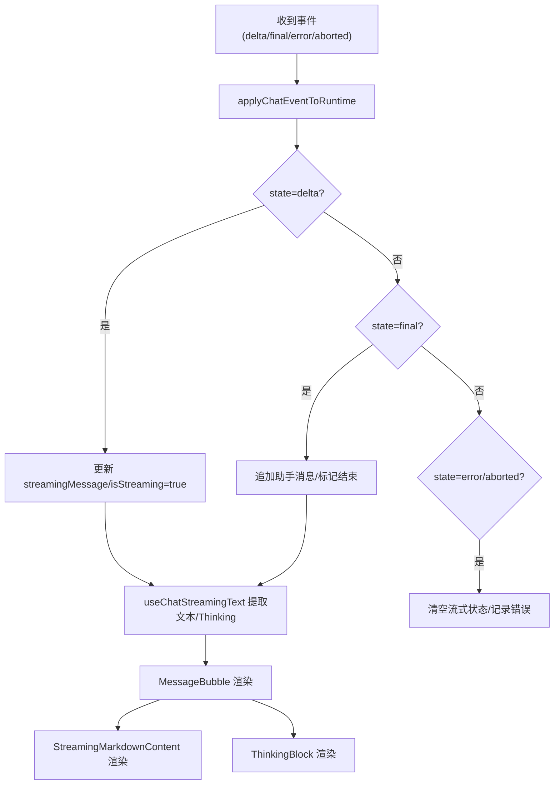
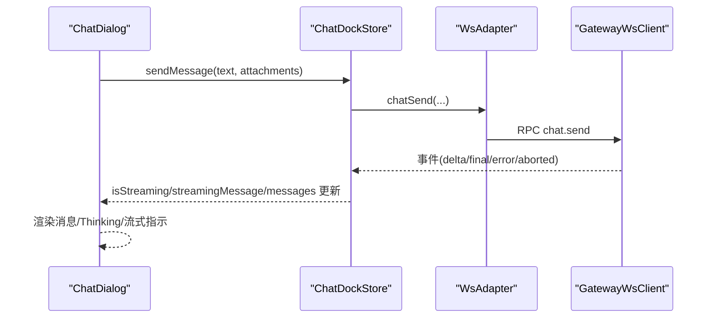
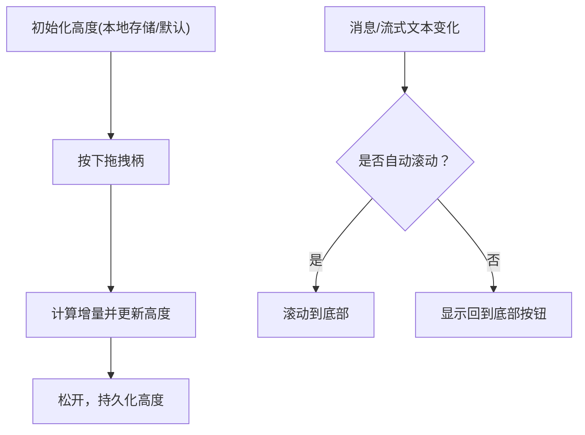
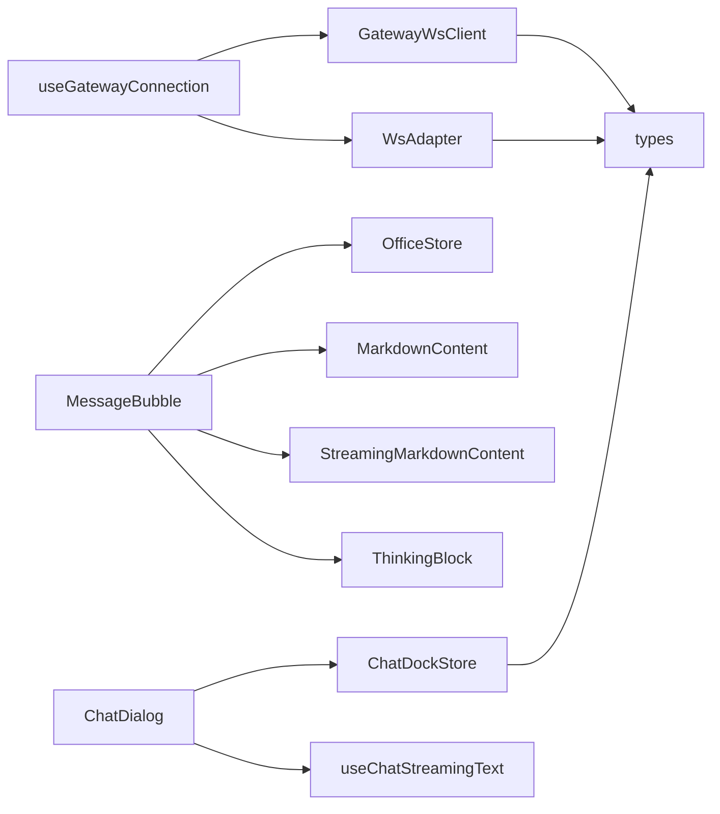

# 实时消息流处理

<cite>
**本文引用的文件**
- [src/components/chat/ChatDialog.tsx](file://src/components/chat/ChatDialog.tsx)
- [src/components/chat/MessageBubble.tsx](file://src/components/chat/MessageBubble.tsx)
- [src/components/chat/MarkdownContent.tsx](file://src/components/chat/MarkdownContent.tsx)
- [src/components/chat/StreamingMarkdownContent.tsx](file://src/components/chat/StreamingMarkdownContent.tsx)
- [src/components/chat/ThinkingBlock.tsx](file://src/components/chat/ThinkingBlock.tsx)
- [src/components/chat/StreamingIndicator.tsx](file://src/components/chat/StreamingIndicator.tsx)
- [src/hooks/useChatStreamingText.ts](file://src/hooks/useChatStreamingText.ts)
- [src/hooks/useGatewayConnection.ts](file://src/hooks/useGatewayConnection.ts)
- [src/gateway/ws-client.ts](file://src/gateway/ws-client.ts)
- [src/gateway/ws-adapter.ts](file://src/gateway/ws-adapter.ts)
- [src/gateway/types.ts](file://src/gateway/types.ts)
- [src/store/console-stores/chat-dock-store.ts](file://src/store/console-stores/chat-dock-store.ts)
- [src/store/office-store.ts](file://src/store/office-store.ts)
- [src/lib/message-utils.ts](file://src/lib/message-utils.ts)
</cite>

## 目录
1. [简介](#简介)
2. [项目结构](#项目结构)
3. [核心组件](#核心组件)
4. [架构总览](#架构总览)
5. [详细组件分析](#详细组件分析)
6. [依赖关系分析](#依赖关系分析)
7. [性能考虑](#性能考虑)
8. [故障排查指南](#故障排查指南)
9. [结论](#结论)
10. [附录](#附录)

## 简介
本文件面向实时消息流处理系统，聚焦以下能力：
- WebSocket 连接管理：连接建立、断线重连、错误处理与状态同步
- 流式消息接收处理：增量文本流解析、Markdown 渲染、Thinking 状态显示
- 消息状态同步：发送状态、接收确认、错误处理与队列推进
- 自动滚动与高度管理：消息区域自适应高度、滚动位置保持、拖拽调整大小
- 性能优化：渲染批处理、缓存策略、内存管理与错误恢复

## 项目结构
系统采用分层设计：
- 视图层：聊天对话框、消息气泡、Markdown 渲染组件
- Hook 层：流式文本提取、网关连接生命周期
- 网关层：WebSocket 客户端、适配器、RPC 客户端
- 状态层：聊天舱口状态、全局办公状态
- 工具层：消息工具函数、事件节流

图表来源
- [src/components/chat/ChatDialog.tsx](file://src/components/chat/ChatDialog.tsx)
- [src/components/chat/MessageBubble.tsx](file://src/components/chat/MessageBubble.tsx)
- [src/components/chat/MarkdownContent.tsx](file://src/components/chat/MarkdownContent.tsx)
- [src/components/chat/StreamingMarkdownContent.tsx](file://src/components/chat/StreamingMarkdownContent.tsx)
- [src/components/chat/ThinkingBlock.tsx](file://src/components/chat/ThinkingBlock.tsx)
- [src/components/chat/StreamingIndicator.tsx](file://src/components/chat/StreamingIndicator.tsx)
- [src/hooks/useChatStreamingText.ts](file://src/hooks/useChatStreamingText.ts)
- [src/hooks/useGatewayConnection.ts](file://src/hooks/useGatewayConnection.ts)
- [src/gateway/ws-client.ts](file://src/gateway/ws-client.ts)
- [src/gateway/ws-adapter.ts](file://src/gateway/ws-adapter.ts)
- [src/gateway/types.ts](file://src/gateway/types.ts)
- [src/store/console-stores/chat-dock-store.ts](file://src/store/console-stores/chat-dock-store.ts)
- [src/store/office-store.ts](file://src/store/office-store.ts)
- [src/lib/message-utils.ts](file://src/lib/message-utils.ts)

章节来源
- [src/components/chat/ChatDialog.tsx](file://src/components/chat/ChatDialog.tsx)
- [src/hooks/useGatewayConnection.ts](file://src/hooks/useGatewayConnection.ts)
- [src/gateway/ws-client.ts](file://src/gateway/ws-client.ts)
- [src/gateway/ws-adapter.ts](file://src/gateway/ws-adapter.ts)
- [src/store/console-stores/chat-dock-store.ts](file://src/store/console-stores/chat-dock-store.ts)
- [src/store/office-store.ts](file://src/store/office-store.ts)

## 核心组件
- ChatDialog：聊天对话框容器，负责消息区域滚动、拖拽调整高度、输入与发送、附件处理、连接状态展示与重试。
- MessageBubble：单条消息气泡渲染，区分用户/系统/助手，支持 Thinking 展示、工具调用活动气泡、图片附件。
- MarkdownContent/StreamingMarkdownContent：Markdown 渲染与流式增量渲染，支持 Mermaid 图表懒加载。
- ThinkingBlock：Thinking 内容折叠/展开交互。
- useChatStreamingText：从聊天舱口状态中提取可见文本与 Thinking 文本，剥离标签。
- useGatewayConnection：建立 WebSocket 连接，注册事件监听，初始化适配器与配置。
- GatewayWsClient：WebSocket 客户端，含指数退避重连、挑战-握手认证、事件/响应分发。
- WsAdapter：适配器封装 RPC 请求与事件转发，统一对外接口。
- ChatDockStore：聊天会话运行时状态，处理 delta/final/error/aborted 等事件，维护消息列表与流式内容。
- OfficeStore：全局状态，包括连接状态、主题、聊天舱口高度等。

章节来源
- [src/components/chat/ChatDialog.tsx](file://src/components/chat/ChatDialog.tsx)
- [src/components/chat/MessageBubble.tsx](file://src/components/chat/MessageBubble.tsx)
- [src/components/chat/MarkdownContent.tsx](file://src/components/chat/MarkdownContent.tsx)
- [src/components/chat/StreamingMarkdownContent.tsx](file://src/components/chat/StreamingMarkdownContent.tsx)
- [src/components/chat/ThinkingBlock.tsx](file://src/components/chat/ThinkingBlock.tsx)
- [src/hooks/useChatStreamingText.ts](file://src/hooks/useChatStreamingText.ts)
- [src/hooks/useGatewayConnection.ts](file://src/hooks/useGatewayConnection.ts)
- [src/gateway/ws-client.ts](file://src/gateway/ws-client.ts)
- [src/gateway/ws-adapter.ts](file://src/gateway/ws-adapter.ts)
- [src/store/console-stores/chat-dock-store.ts](file://src/store/console-stores/chat-dock-store.ts)
- [src/store/office-store.ts](file://src/store/office-store.ts)

## 架构总览
系统通过 WebSocket 与后端网关通信，使用适配器统一 RPC 与事件接口；前端通过聊天舱口状态机处理流式事件，驱动视图更新。

图表来源
- [src/hooks/useGatewayConnection.ts](file://src/hooks/useGatewayConnection.ts)
- [src/gateway/ws-client.ts](file://src/gateway/ws-client.ts)
- [src/gateway/ws-adapter.ts](file://src/gateway/ws-adapter.ts)
- [src/store/console-stores/chat-dock-store.ts](file://src/store/console-stores/chat-dock-store.ts)
- [src/components/chat/ChatDialog.tsx](file://src/components/chat/ChatDialog.tsx)

## 详细组件分析

### WebSocket 连接管理机制
- 连接建立：构造 WebSocket，等待服务端挑战事件，随后发送 connect 请求完成握手。
- 断线重连：指数退避 + 抖动，最大重连次数限制；关闭时清理定时器。
- 心跳检测：未在代码中直接实现心跳定时器，但可通过事件节流与状态变更感知连接健康。
- 错误处理：捕获 close/error，触发重连；响应帧错误设置状态与错误信息。

图表来源
- [src/gateway/ws-client.ts](file://src/gateway/ws-client.ts)
- [src/hooks/useGatewayConnection.ts](file://src/hooks/useGatewayConnection.ts)

章节来源
- [src/gateway/ws-client.ts](file://src/gateway/ws-client.ts)
- [src/hooks/useGatewayConnection.ts](file://src/hooks/useGatewayConnection.ts)

### 流式消息接收处理
- 增量文本解析：从事件中提取 content/text/thinking，支持数组块与标签形式。
- Markdown 渲染：普通与流式渲染分离，流式渲染使用 requestAnimationFrame 批处理与段落切分，避免闪烁。
- Thinking 展示：可折叠/展开，流式时默认展开，支持标签剥离以仅显示回复正文。

图表来源
- [src/store/console-stores/chat-dock-store.ts](file://src/store/console-stores/chat-dock-store.ts)
- [src/hooks/useChatStreamingText.ts](file://src/hooks/useChatStreamingText.ts)
- [src/components/chat/MessageBubble.tsx](file://src/components/chat/MessageBubble.tsx)
- [src/components/chat/StreamingMarkdownContent.tsx](file://src/components/chat/StreamingMarkdownContent.tsx)
- [src/components/chat/ThinkingBlock.tsx](file://src/components/chat/ThinkingBlock.tsx)

章节来源
- [src/store/console-stores/chat-dock-store.ts](file://src/store/console-stores/chat-dock-store.ts)
- [src/hooks/useChatStreamingText.ts](file://src/hooks/useChatStreamingText.ts)
- [src/components/chat/MessageBubble.tsx](file://src/components/chat/MessageBubble.tsx)
- [src/components/chat/StreamingMarkdownContent.tsx](file://src/components/chat/StreamingMarkdownContent.tsx)
- [src/components/chat/ThinkingBlock.tsx](file://src/components/chat/ThinkingBlock.tsx)

### 消息状态同步机制
- 发送状态：发送前禁用按钮，发送后进入流式状态；支持中止。
- 接收确认：根据事件状态推进消息列表；final 后持久化，error/aborted 清理流式状态。
- 错误处理：事件错误或响应错误均设置状态与错误信息；支持重试刷新页面。

图表来源
- [src/components/chat/ChatDialog.tsx](file://src/components/chat/ChatDialog.tsx)
- [src/store/console-stores/chat-dock-store.ts](file://src/store/console-stores/chat-dock-store.ts)
- [src/gateway/ws-adapter.ts](file://src/gateway/ws-adapter.ts)
- [src/gateway/ws-client.ts](file://src/gateway/ws-client.ts)

章节来源
- [src/components/chat/ChatDialog.tsx](file://src/components/chat/ChatDialog.tsx)
- [src/store/console-stores/chat-dock-store.ts](file://src/store/console-stores/chat-dock-store.ts)
- [src/gateway/ws-adapter.ts](file://src/gateway/ws-adapter.ts)
- [src/gateway/ws-client.ts](file://src/gateway/ws-client.ts)

### 自动滚动与高度管理
- 自动滚动：监听消息变化与流式文本变化，滚动到底部；滚动至底部时切换自动滚动标志。
- 滚动位置保持：当用户手动滚动时，停止自动滚动；到达底部时显示“回到底部”按钮。
- 拖拽调整高度：鼠标按下记录初始高度与 Y 坐标，移动时计算增量并限制最大高度，松开时持久化到本地存储。

图表来源
- [src/components/chat/ChatDialog.tsx](file://src/components/chat/ChatDialog.tsx)

章节来源
- [src/components/chat/ChatDialog.tsx](file://src/components/chat/ChatDialog.tsx)

### 流式渲染性能优化与内存管理
- 渲染批处理：流式渲染使用 requestAnimationFrame 将多次更新合并为一次渲染，减少抖动。
- 段落切分：按段落边界切分已完成部分与尾部，已完成部分进行缓存复用，避免重复解析。
- 懒加载：Mermaid 图表使用 Suspense 懒加载，失败回退为纯文本块。
- 内存管理：事件处理使用节流与去抖，避免高频事件导致的内存压力；流式状态在 final/error/aborted 后及时清理。

章节来源
- [src/components/chat/StreamingMarkdownContent.tsx](file://src/components/chat/StreamingMarkdownContent.tsx)
- [src/lib/message-utils.ts](file://src/lib/message-utils.ts)

## 依赖关系分析
- ChatDialog 依赖 ChatDockStore 与 useChatStreamingText，控制输入、发送、附件与滚动。
- MessageBubble 依赖 OfficeStore 获取代理信息，渲染 Markdown/Thinking/工具调用。
- useGatewayConnection 依赖 GatewayWsClient/WsAdapter，负责连接与事件分发。
- ChatDockStore 依赖 GatewayAdapter 与事件类型，处理消息状态机。
- OfficeStore 维护全局连接状态与 UI 设置。

图表来源
- [src/components/chat/ChatDialog.tsx](file://src/components/chat/ChatDialog.tsx)
- [src/components/chat/MessageBubble.tsx](file://src/components/chat/MessageBubble.tsx)
- [src/hooks/useChatStreamingText.ts](file://src/hooks/useChatStreamingText.ts)
- [src/hooks/useGatewayConnection.ts](file://src/hooks/useGatewayConnection.ts)
- [src/gateway/ws-client.ts](file://src/gateway/ws-client.ts)
- [src/gateway/ws-adapter.ts](file://src/gateway/ws-adapter.ts)
- [src/gateway/types.ts](file://src/gateway/types.ts)
- [src/store/console-stores/chat-dock-store.ts](file://src/store/console-stores/chat-dock-store.ts)
- [src/store/office-store.ts](file://src/store/office-store.ts)

章节来源
- [src/components/chat/ChatDialog.tsx](file://src/components/chat/ChatDialog.tsx)
- [src/components/chat/MessageBubble.tsx](file://src/components/chat/MessageBubble.tsx)
- [src/hooks/useChatStreamingText.ts](file://src/hooks/useChatStreamingText.ts)
- [src/hooks/useGatewayConnection.ts](file://src/hooks/useGatewayConnection.ts)
- [src/gateway/ws-client.ts](file://src/gateway/ws-client.ts)
- [src/gateway/ws-adapter.ts](file://src/gateway/ws-adapter.ts)
- [src/gateway/types.ts](file://src/gateway/types.ts)
- [src/store/console-stores/chat-dock-store.ts](file://src/store/console-stores/chat-dock-store.ts)
- [src/store/office-store.ts](file://src/store/office-store.ts)

## 性能考虑
- 渲染优化：流式渲染使用 RAF 批处理与段落切分，避免频繁重排；Markdown 解析结果缓存已完成部分。
- 事件处理：事件节流与去抖降低高频事件对 UI 的影响。
- 存储与缓存：聊天舱口高度与主题、代理名称缓存于本地存储，减少重复计算与请求。
- 错误恢复：断线重连与错误状态提示，支持用户主动刷新恢复。

## 故障排查指南
- 连接问题：检查连接状态与错误信息，必要时刷新页面重试；确认 WebSocket 地址与令牌正确。
- 流式渲染异常：确认事件状态为 delta/final，检查 Thinking 标签格式与内容块结构。
- 滚动异常：检查自动滚动标志与滚动容器高度，确保消息区域已渲染完成。
- 附件上传：确认文件类型与大小限制，检查数据 URL 生成与附件列表渲染。

章节来源
- [src/components/chat/ChatDialog.tsx](file://src/components/chat/ChatDialog.tsx)
- [src/gateway/ws-client.ts](file://src/gateway/ws-client.ts)
- [src/store/console-stores/chat-dock-store.ts](file://src/store/console-stores/chat-dock-store.ts)

## 结论
该系统通过清晰的分层架构与状态机，实现了可靠的 WebSocket 连接管理、健壮的流式消息处理与高效的渲染优化。结合自动滚动、高度管理与错误恢复机制，提供了良好的用户体验。后续可在心跳检测、事件去重与缓存策略方面进一步增强稳定性与性能。

## 附录
- API 接口
  - chatSend：发送消息，支持附件与幂等键
  - chat.history：获取历史消息
  - chat.abort：中止会话
  - sessions.*：会话列表、预览、删除、补丁、重置、压缩
  - channels.*：通道状态、登出、Web 登录
  - skills.*：技能状态、安装、更新
  - cron.*：定时任务列表、增删改查、执行
  - agents.*：代理列表、创建、更新、删除、文件读写
  - tools.catalog：工具目录
  - usage.status：用量状态
  - models.list：模型目录
  - config.*：配置获取/设置/应用/补丁/模式
  - logs.tail：日志尾随
  - update.run：更新运行

章节来源
- [src/gateway/ws-adapter.ts](file://src/gateway/ws-adapter.ts)
- [src/gateway/types.ts](file://src/gateway/types.ts)