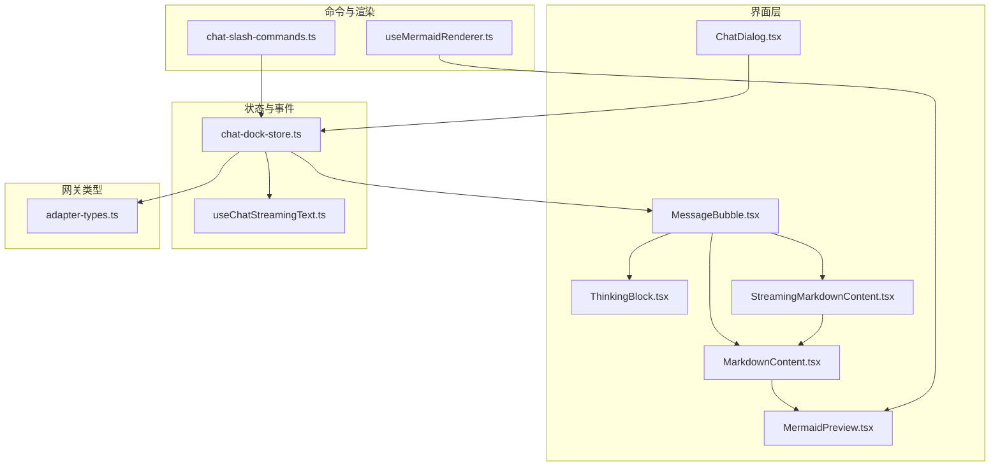
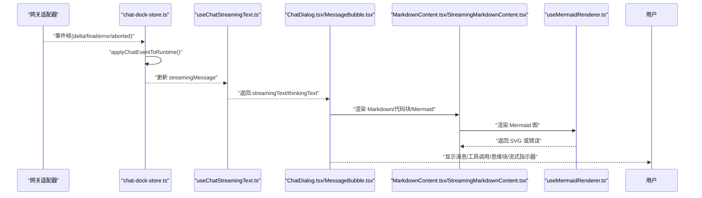
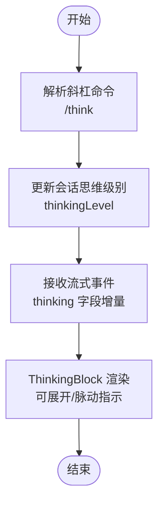
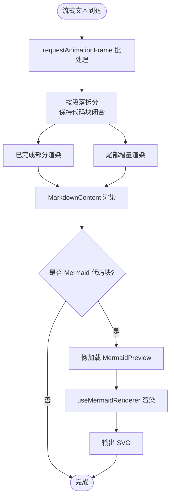
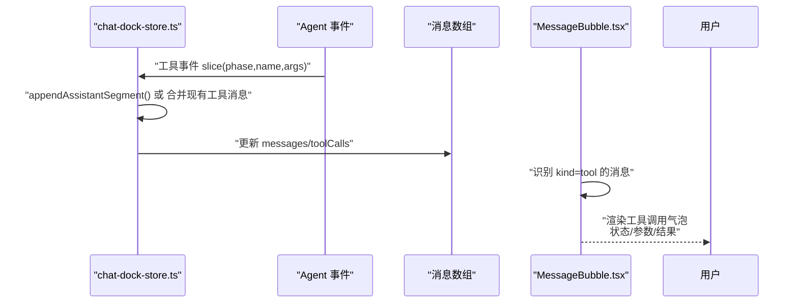
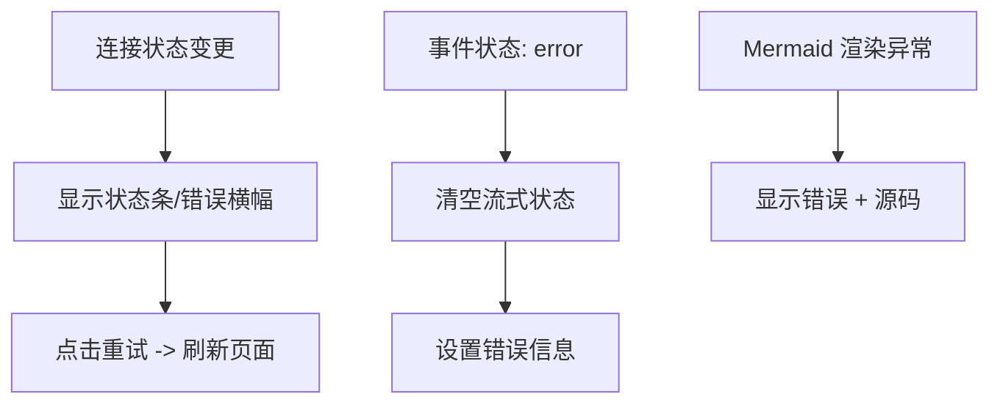
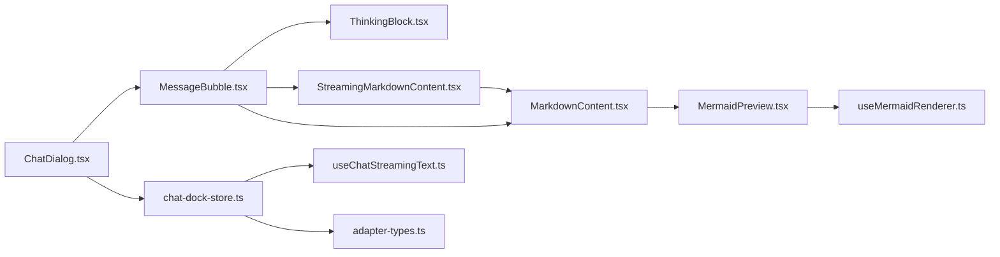

# 工具调用可视化

<cite>
**本文引用的文件**
- [ThinkingBlock.tsx](file://src/components/chat/ThinkingBlock.tsx)
- [MarkdownContent.tsx](file://src/components/chat/MarkdownContent.tsx)
- [StreamingMarkdownContent.tsx](file://src/components/chat/StreamingMarkdownContent.tsx)
- [MessageBubble.tsx](file://src/components/chat/MessageBubble.tsx)
- [ChatDialog.tsx](file://src/components/chat/ChatDialog.tsx)
- [useChatStreamingText.ts](file://src/hooks/useChatStreamingText.ts)
- [chat-slash-commands.ts](file://src/lib/chat-slash-commands.ts)
- [chat-dock-store.ts](file://src/store/console-stores/chat-dock-store.ts)
- [MermaidPreview.tsx](file://src/components/shared/MermaidPreview.tsx)
- [useMermaidRenderer.ts](file://src/hooks/useMermaidRenderer.ts)
- [adapter-types.ts](file://src/gateway/adapter-types.ts)
</cite>

## 目录
1. [简介](#简介)
2. [项目结构](#项目结构)
3. [核心组件](#核心组件)
4. [架构总览](#架构总览)
5. [详细组件分析](#详细组件分析)
6. [依赖分析](#依赖分析)
7. [性能考虑](#性能考虑)
8. [故障排查指南](#故障排查指南)
9. [结论](#结论)
10. [附录](#附录)

## 简介
本文件面向“工具调用可视化”系统，围绕以下目标展开：工具调用状态显示（执行进度、结果展示、错误状态）、思维过程展示（/think命令的Markdown渲染、分步骤显示、高亮标记）、流式内容渲染（Markdown增量渲染、代码块高亮、Mermaid图示支持）、工具调用链追踪（多工具串联、依赖关系、执行顺序可视化）、错误处理与重试机制（工具失败处理、自动重试、用户干预选项）、性能优化（虚拟滚动、懒加载、内存回收）以及工具调用API与最佳实践。

## 项目结构
该系统以React组件为核心，结合Zustand状态管理与网关适配器事件流，形成从“输入到渲染”的闭环。关键模块包括：
- 对话UI层：聊天对话框、消息气泡、思维块、流式Markdown渲染
- 渲染引擎：Markdown解析、Mermaid图示渲染、代码块高亮
- 状态与事件：聊天舱口状态、流式文本抽取、工具调用事件应用
- 命令系统：/think等斜杠命令解析与帮助文本生成

图表来源
- [ChatDialog.tsx:30-422](file://src/components/chat/ChatDialog.tsx#L30-L422)
- [MessageBubble.tsx:160-257](file://src/components/chat/MessageBubble.tsx#L160-L257)
- [ThinkingBlock.tsx:11-54](file://src/components/chat/ThinkingBlock.tsx#L11-L54)
- [StreamingMarkdownContent.tsx:198-260](file://src/components/chat/StreamingMarkdownContent.tsx#L198-L260)
- [MarkdownContent.tsx:22-133](file://src/components/chat/MarkdownContent.tsx#L22-L133)
- [MermaidPreview.tsx:9-66](file://src/components/shared/MermaidPreview.tsx#L9-L66)
- [chat-dock-store.ts:1-1703](file://src/store/console-stores/chat-dock-store.ts#L1-L1703)
- [useChatStreamingText.ts:78-88](file://src/hooks/useChatStreamingText.ts#L78-L88)
- [chat-slash-commands.ts:60-106](file://src/lib/chat-slash-commands.ts#L60-L106)
- [useMermaidRenderer.ts:19-52](file://src/hooks/useMermaidRenderer.ts#L19-L52)
- [adapter-types.ts:149-169](file://src/gateway/adapter-types.ts#L149-L169)

章节来源
- [ChatDialog.tsx:30-422](file://src/components/chat/ChatDialog.tsx#L30-L422)
- [MessageBubble.tsx:160-257](file://src/components/chat/MessageBubble.tsx#L160-L257)
- [chat-dock-store.ts:1-1703](file://src/store/console-stores/chat-dock-store.ts#L1-L1703)

## 核心组件
- 思维块（ThinkingBlock）：用于折叠/展开显示思维过程，支持流式状态下的自动展开与脉动指示。
- Markdown渲染（MarkdownContent/StreamingMarkdownContent）：统一的Markdown渲染入口，支持表格、代码块、链接、Mermaid图示；流式版本支持按段落拆分与增量渲染。
- 消息气泡（MessageBubble）：根据消息角色与类型渲染用户/助手/系统消息，支持工具调用活动气泡、思维块、流式指示器与图片附件。
- 聊天对话框（ChatDialog）：承载消息列表、输入区域、连接状态、错误横幅、拖拽调整高度等交互。
- 流式文本钩子（useChatStreamingText）：从聊天舱口状态中提取可见文本与思维文本，剥离思维标签，供UI使用。
- 斜杠命令（chat-slash-commands）：定义/parse/构建帮助文本，支持/ think、/verbose、/fast等命令。
- 状态与事件（chat-dock-store）：应用聊天事件（delta/final/error/aborted），维护消息队列、流式状态、工具调用信息、历史加载与会话切换。
- Mermaid渲染（MermaidPreview/useMermaidRenderer）：延迟加载Mermaid，主题感知渲染，错误兜底与加载占位。
- 网关类型（adapter-types）：定义工具调用信息、消息体、会话信息等数据契约。

章节来源
- [ThinkingBlock.tsx:11-54](file://src/components/chat/ThinkingBlock.tsx#L11-L54)
- [MarkdownContent.tsx:22-133](file://src/components/chat/MarkdownContent.tsx#L22-L133)
- [StreamingMarkdownContent.tsx:198-260](file://src/components/chat/StreamingMarkdownContent.tsx#L198-L260)
- [MessageBubble.tsx:160-257](file://src/components/chat/MessageBubble.tsx#L160-L257)
- [ChatDialog.tsx:30-422](file://src/components/chat/ChatDialog.tsx#L30-L422)
- [useChatStreamingText.ts:78-88](file://src/hooks/useChatStreamingText.ts#L78-L88)
- [chat-slash-commands.ts:60-106](file://src/lib/chat-slash-commands.ts#L60-L106)
- [chat-dock-store.ts:177-309](file://src/store/console-stores/chat-dock-store.ts#L177-L309)
- [MermaidPreview.tsx:9-66](file://src/components/shared/MermaidPreview.tsx#L9-L66)
- [useMermaidRenderer.ts:19-52](file://src/hooks/useMermaidRenderer.ts#L19-L52)
- [adapter-types.ts:149-169](file://src/gateway/adapter-types.ts#L149-L169)

## 架构总览
系统采用“事件驱动 + 状态管理 + 组件渲染”的架构：
- 网关适配器产生事件帧（delta/final/error/aborted），由chat-dock-store应用到运行时状态。
- useChatStreamingText从状态中抽取当前流式文本与思维文本，供ChatDialog与MessageBubble消费。
- MessageBubble根据消息类型渲染不同UI：普通消息、工具调用活动、思维块、流式指示器。
- MarkdownContent/StreamingMarkdownContent负责Markdown与Mermaid渲染；MermaidPreview通过useMermaidRenderer按需初始化并渲染。

图表来源
- [chat-dock-store.ts:177-309](file://src/store/console-stores/chat-dock-store.ts#L177-L309)
- [useChatStreamingText.ts:78-88](file://src/hooks/useChatStreamingText.ts#L78-L88)
- [ChatDialog.tsx:293-314](file://src/components/chat/ChatDialog.tsx#L293-L314)
- [MessageBubble.tsx:208-218](file://src/components/chat/MessageBubble.tsx#L208-L218)
- [MarkdownContent.tsx:22-133](file://src/components/chat/MarkdownContent.tsx#L22-L133)
- [useMermaidRenderer.ts:19-52](file://src/hooks/useMermaidRenderer.ts#L19-L52)

## 详细组件分析

### 思维过程展示（/think命令）
- 思维块组件支持展开/折叠、流式状态下自动展开、脉动指示，内部使用MarkdownContent渲染思维文本。
- 斜杠命令定义了/ think及其参数选项，帮助文本由构建函数生成。
- 流式文本钩子从消息中提取思维文本，支持结构化块与标签形式，剥离后用于主回复显示。

图表来源
- [chat-slash-commands.ts:37-57](file://src/lib/chat-slash-commands.ts#L37-L57)
- [chat-dock-store.ts:109-121](file://src/store/console-stores/chat-dock-store.ts#L109-L121)
- [ThinkingBlock.tsx:11-54](file://src/components/chat/ThinkingBlock.tsx#L11-L54)
- [useChatStreamingText.ts:38-64](file://src/hooks/useChatStreamingText.ts#L38-L64)

章节来源
- [chat-slash-commands.ts:37-57](file://src/lib/chat-slash-commands.ts#L37-L57)
- [ThinkingBlock.tsx:11-54](file://src/components/chat/ThinkingBlock.tsx#L11-L54)
- [useChatStreamingText.ts:38-64](file://src/hooks/useChatStreamingText.ts#L38-L64)

### 流式内容渲染（Markdown增量渲染、代码块高亮、Mermaid支持）
- StreamingMarkdownContent在流式场景下使用requestAnimationFrame批处理，避免频繁重绘；按段落拆分确保代码块闭合正确，优先渲染已完成部分，尾部增量渲染。
- MarkdownContent统一配置组件样式，支持内联/块级代码、表格、链接、Mermaid图示；Mermaid通过Suspense懒加载并在渲染错误时回退显示源码。
- useMermaidRenderer延迟初始化Mermaid，按主题设置安全渲染，错误时返回错误信息。

图表来源
- [StreamingMarkdownContent.tsx:198-260](file://src/components/chat/StreamingMarkdownContent.tsx#L198-L260)
- [MarkdownContent.tsx:22-133](file://src/components/chat/MarkdownContent.tsx#L22-L133)
- [MermaidPreview.tsx:9-66](file://src/components/shared/MermaidPreview.tsx#L9-L66)
- [useMermaidRenderer.ts:19-52](file://src/hooks/useMermaidRenderer.ts#L19-L52)

章节来源
- [StreamingMarkdownContent.tsx:27-61](file://src/components/chat/StreamingMarkdownContent.tsx#L27-L61)
- [MarkdownContent.tsx:96-115](file://src/components/chat/MarkdownContent.tsx#L96-L115)
- [MermaidPreview.tsx:15-41](file://src/components/shared/MermaidPreview.tsx#L15-L41)
- [useMermaidRenderer.ts:23-48](file://src/hooks/useMermaidRenderer.ts#L23-L48)

### 工具调用链追踪（多工具串联、依赖关系、执行顺序）
- chat-dock-store在收到工具代理事件时，构造或合并工具调用消息，记录状态（running/done/error），并维护消息中的toolCalls数组。
- MessageBubble针对kind为tool的消息渲染专用气泡，显示工具名、状态、参数与结果；支持展开查看详情。
- 网关类型定义了ToolCallInfo，包含id/name/args/result/status等字段，支撑前端可视化。

图表来源
- [chat-dock-store.ts:320-395](file://src/store/console-stores/chat-dock-store.ts#L320-L395)
- [MessageBubble.tsx:75-158](file://src/components/chat/MessageBubble.tsx#L75-L158)
- [adapter-types.ts:163-169](file://src/gateway/adapter-types.ts#L163-L169)

章节来源
- [chat-dock-store.ts:320-395](file://src/store/console-stores/chat-dock-store.ts#L320-L395)
- [MessageBubble.tsx:75-158](file://src/components/chat/MessageBubble.tsx#L75-L158)
- [adapter-types.ts:163-169](file://src/gateway/adapter-types.ts#L163-L169)

### 错误处理与重试机制
- 连接状态与错误横幅：当连接断开/重连/错误时，顶部显示状态条，提供重试按钮触发页面刷新。
- 事件错误分支：chat-dock-store在事件状态为error时清空流式状态并设置错误信息。
- Mermaid渲染错误：MermaidPreview捕获渲染异常，显示错误提示与原始源码，便于定位问题。
- 用户干预：支持停止流式发送、清除错误、拖拽调整对话框高度等操作。

图表来源
- [ChatDialog.tsx:243-268](file://src/components/chat/ChatDialog.tsx#L243-L268)
- [chat-dock-store.ts:261-275](file://src/store/console-stores/chat-dock-store.ts#L261-L275)
- [MermaidPreview.tsx:43-54](file://src/components/shared/MermaidPreview.tsx#L43-L54)

章节来源
- [ChatDialog.tsx:243-268](file://src/components/chat/ChatDialog.tsx#L243-L268)
- [chat-dock-store.ts:261-275](file://src/store/console-stores/chat-dock-store.ts#L261-L275)
- [MermaidPreview.tsx:43-54](file://src/components/shared/MermaidPreview.tsx#L43-L54)

### 工具调用API与最佳实践
- 发送消息：通过chat-dock-store的sendMessage接口，支持文本与附件；支持abort中断。
- 会话管理：loadSessions/loadHistory/newSession/switchSession等，维护会话键与最后选择。
- 历史与工具重建：normalizeHistoryMessages/reconstructToolMessages保证历史消息与工具调用显示一致。
- 斜杠命令：/think、/verbose、/fast等命令通过解析器与帮助文本生成，便于用户控制行为。

章节来源
- [chat-dock-store.ts:80-107](file://src/store/console-stores/chat-dock-store.ts#L80-L107)
- [chat-slash-commands.ts:60-106](file://src/lib/chat-slash-commands.ts#L60-L106)
- [adapter-types.ts:195-224](file://src/gateway/adapter-types.ts#L195-L224)

## 依赖分析
- 组件耦合
  - MessageBubble依赖ThinkingBlock、StreamingMarkdownContent、MarkdownContent、工具调用状态。
  - ChatDialog依赖useChatStreamingText、MessageBubble、连接状态与错误状态。
  - MarkdownContent/StreamingMarkdownContent共享组件映射，MermaidPreview通过useMermaidRenderer解耦。
- 外部依赖
  - react-markdown/remarkGfm：Markdown解析与GFM扩展。
  - mermaid：Mermaid图示渲染，懒加载与主题初始化。
  - Zustand：状态集中管理，事件应用与派发。

图表来源
- [MessageBubble.tsx:1-257](file://src/components/chat/MessageBubble.tsx#L1-L257)
- [ThinkingBlock.tsx:1-54](file://src/components/chat/ThinkingBlock.tsx#L1-L54)
- [StreamingMarkdownContent.tsx:1-260](file://src/components/chat/StreamingMarkdownContent.tsx#L1-L260)
- [MarkdownContent.tsx:1-133](file://src/components/chat/MarkdownContent.tsx#L1-L133)
- [MermaidPreview.tsx:1-66](file://src/components/shared/MermaidPreview.tsx#L1-L66)
- [useMermaidRenderer.ts:1-52](file://src/hooks/useMermaidRenderer.ts#L1-L52)
- [ChatDialog.tsx:1-432](file://src/components/chat/ChatDialog.tsx#L1-L432)
- [chat-dock-store.ts:1-1703](file://src/store/console-stores/chat-dock-store.ts#L1-L1703)
- [useChatStreamingText.ts:1-88](file://src/hooks/useChatStreamingText.ts#L1-L88)
- [adapter-types.ts:1-458](file://src/gateway/adapter-types.ts#L1-L458)

## 性能考虑
- 虚拟滚动与懒加载
  - 流式渲染通过requestAnimationFrame批处理，减少频繁重绘；按段落拆分避免不完整代码块渲染。
  - Mermaid图示懒加载，渲染错误时回退显示源码，避免阻塞主线程。
- 内存回收
  - 动画帧句柄在组件卸载时取消，防止内存泄漏。
  - Mermaid实例按主题变化重新初始化，避免重复初始化带来的资源浪费。
- 其他
  - 对话框高度持久化到localStorage，提升用户体验。
  - 自动滚动与滚动位置检测，避免不必要的重排。

章节来源
- [StreamingMarkdownContent.tsx:207-228](file://src/components/chat/StreamingMarkdownContent.tsx#L207-L228)
- [MermaidPreview.tsx:15-41](file://src/components/shared/MermaidPreview.tsx#L15-L41)
- [useMermaidRenderer.ts:23-48](file://src/hooks/useMermaidRenderer.ts#L23-L48)
- [ChatDialog.tsx:17-28](file://src/components/chat/ChatDialog.tsx#L17-L28)

## 故障排查指南
- 思维块不显示
  - 检查斜杠命令是否正确设置思维级别；确认useChatStreamingText是否提取到thinking文本。
- 流式渲染卡顿
  - 确认是否使用StreamingMarkdownContent；检查段落拆分逻辑是否导致频繁重渲染。
- Mermaid图不显示
  - 查看MermaidPreview错误提示与源码回退；确认useMermaidRenderer初始化与主题设置。
- 工具调用状态异常
  - 检查chat-dock-store的工具事件应用逻辑；确认toolCalls数组是否正确合并。
- 连接问题
  - 查看ChatDialog顶部状态条与错误横幅；点击重试刷新页面。

章节来源
- [ThinkingBlock.tsx:11-54](file://src/components/chat/ThinkingBlock.tsx#L11-L54)
- [StreamingMarkdownContent.tsx:232-235](file://src/components/chat/StreamingMarkdownContent.tsx#L232-L235)
- [MermaidPreview.tsx:43-54](file://src/components/shared/MermaidPreview.tsx#L43-L54)
- [chat-dock-store.ts:320-395](file://src/store/console-stores/chat-dock-store.ts#L320-L395)
- [ChatDialog.tsx:243-268](file://src/components/chat/ChatDialog.tsx#L243-L268)

## 结论
该系统通过清晰的组件边界与事件驱动的状态管理，实现了从“思维过程、流式内容、工具调用链”到“错误处理与性能优化”的完整可视化闭环。借助Markdown与Mermaid渲染、懒加载与批处理策略，既保证了交互体验，也兼顾了复杂场景下的稳定性与可维护性。

## 附录
- 最佳实践
  - 使用StreamingMarkdownContent进行长文本流式渲染，避免一次性渲染造成卡顿。
  - 在Mermaid图示渲染前进行语法校验，减少渲染错误。
  - 工具调用消息应保留完整的toolCalls信息，便于UI展示与回放。
  - 斜杠命令应提供明确的帮助文本与参数提示，降低用户学习成本。
  - 对话框高度与滚动位置应持久化，提升连续对话体验。