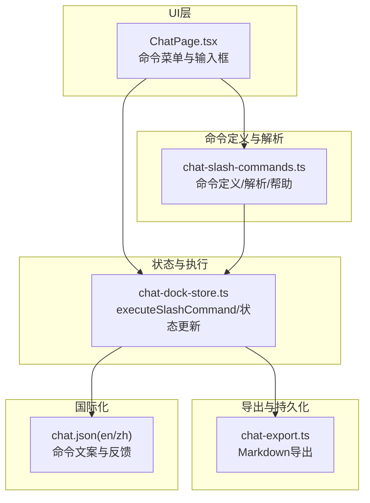
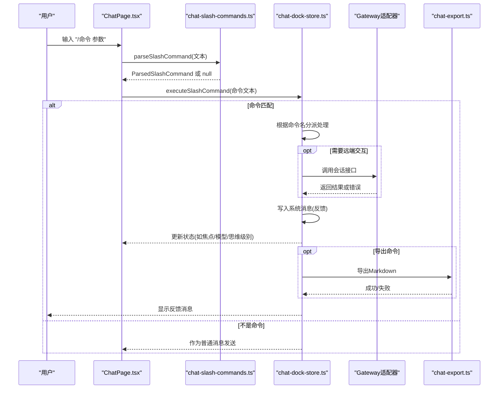
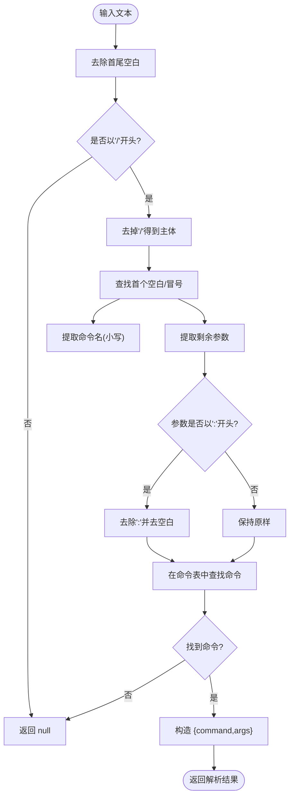
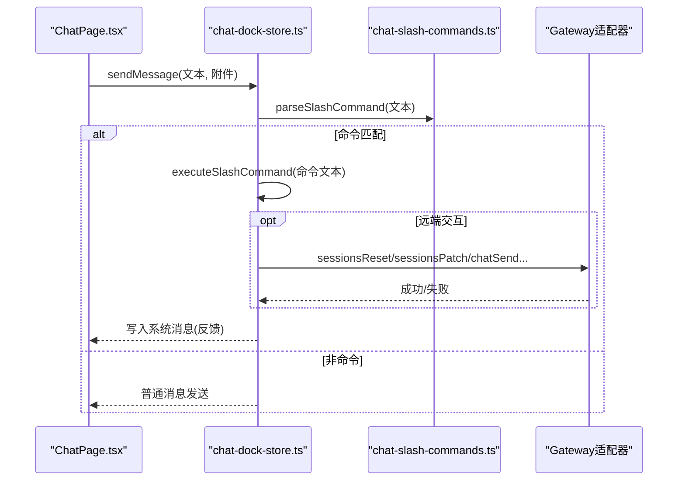
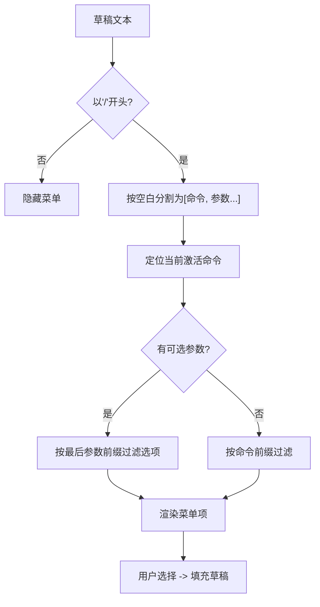
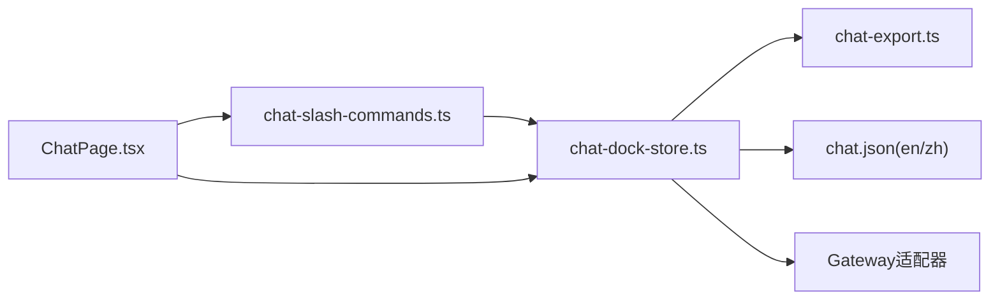

# 斜杠命令系统

<cite>
**本文档引用的文件**
- [chat-slash-commands.ts](file://src/lib/chat-slash-commands.ts)
- [chat-dock-store.ts](file://src/store/console-stores/chat-dock-store.ts)
- [ChatPage.tsx](file://src/components/pages/ChatPage.tsx)
- [chat.json（英文）](file://src/i18n/locales/en/chat.json)
- [chat.json（中文）](file://src/i18n/locales/zh/chat.json)
- [chat-export.ts](file://src/lib/chat-export.ts)
</cite>

## 目录
1. [简介](#简介)
2. [项目结构](#项目结构)
3. [核心组件](#核心组件)
4. [架构总览](#架构总览)
5. [详细组件分析](#详细组件分析)
6. [依赖关系分析](#依赖关系分析)
7. [性能考量](#性能考量)
8. [故障排查指南](#故障排查指南)
9. [结论](#结论)
10. [附录](#附录)

## 简介
本文件系统性地阐述 OpenClaw-Office 中的斜杠命令系统，覆盖命令解析机制、各命令的功能实现、执行流程、扩展机制、历史记录与智能提示等能力，并提供使用示例与最佳实践。该系统通过统一的命令定义与解析器，结合状态存储与国际化文案，为用户提供了高效、可扩展的命令交互体验。

## 项目结构
斜杠命令系统主要由以下模块构成：
- 命令定义与解析：位于 lib 层，负责命令元数据、参数解析与帮助文本生成
- 命令执行与状态管理：位于 store 层，负责根据命令名分派到具体业务逻辑并更新应用状态
- 用户界面与智能提示：位于 components 层，负责渲染命令菜单、自动补全与交互
- 导出与持久化：位于 lib 层，负责对话导出与本地/服务器持久化
- 国际化：位于 i18n 层，提供多语言支持

**图表来源**
- [ChatPage.tsx:126-153](file://src/components/pages/ChatPage.tsx#L126-L153)
- [chat-slash-commands.ts:3-58](file://src/lib/chat-slash-commands.ts#L3-L58)
- [chat-dock-store.ts:800-977](file://src/store/console-stores/chat-dock-store.ts#L800-L977)
- [chat-export.ts:1-44](file://src/lib/chat-export.ts#L1-L44)
- [chat.json（英文）:97-139](file://src/i18n/locales/en/chat.json#L97-L139)

**章节来源**
- [chat-slash-commands.ts:1-106](file://src/lib/chat-slash-commands.ts#L1-L106)
- [chat-dock-store.ts:800-977](file://src/store/console-stores/chat-dock-store.ts#L800-L977)
- [ChatPage.tsx:126-153](file://src/components/pages/ChatPage.tsx#L126-L153)
- [chat-export.ts:1-44](file://src/lib/chat-export.ts#L1-L44)
- [chat.json（英文）:97-139](file://src/i18n/locales/en/chat.json#L97-L139)
- [chat.json（中文）:94-135](file://src/i18n/locales/zh/chat.json#L94-L135)

## 核心组件
- 命令定义与枚举：集中声明可用命令名称、参数占位符与可选参数集合
- 命令解析器：从用户输入中识别命令、提取参数并校验合法性
- 命令执行器：根据命令名分派到具体业务逻辑，更新状态并生成系统消息反馈
- 命令帮助构建器：基于定义与国际化生成帮助列表
- 智能提示与菜单：在 UI 中按输入动态过滤与展示候选命令
- 导出与反馈：将对话导出为 Markdown 并以系统消息形式反馈结果

**章节来源**
- [chat-slash-commands.ts:3-58](file://src/lib/chat-slash-commands.ts#L3-L58)
- [chat-slash-commands.ts:72-94](file://src/lib/chat-slash-commands.ts#L72-L94)
- [chat-slash-commands.ts:96-105](file://src/lib/chat-slash-commands.ts#L96-L105)
- [chat-dock-store.ts:800-977](file://src/store/console-stores/chat-dock-store.ts#L800-L977)
- [ChatPage.tsx:126-153](file://src/components/pages/ChatPage.tsx#L126-L153)
- [chat-export.ts:25-43](file://src/lib/chat-export.ts#L25-L43)

## 架构总览
命令系统采用“定义-解析-执行-反馈”的分层架构：
- 定义层：命令元数据与参数约束
- 解析层：将原始文本解析为命令对象与参数
- 执行层：根据命令类型调用适配器或本地逻辑，更新状态并写入系统消息
- 反馈层：通过系统消息与国际化文案向用户呈现结果

**图表来源**
- [chat-slash-commands.ts:72-94](file://src/lib/chat-slash-commands.ts#L72-L94)
- [chat-dock-store.ts:800-977](file://src/store/console-stores/chat-dock-store.ts#L800-L977)
- [chat-export.ts:25-43](file://src/lib/chat-export.ts#L25-L43)

## 详细组件分析

### 命令解析机制
- 命令识别：要求以“/”开头，支持空格或冒号作为命令名与参数的分隔符
- 参数提取：命令名按首个分隔符截取，余下部分作为参数；若参数以“:”开头则去除冒号后继续
- 命令匹配：在预定义集合中查找同名命令，大小写不敏感
- 结果封装：返回命令定义与参数字符串

**图表来源**
- [chat-slash-commands.ts:72-94](file://src/lib/chat-slash-commands.ts#L72-L94)

**章节来源**
- [chat-slash-commands.ts:72-94](file://src/lib/chat-slash-commands.ts#L72-L94)

### 命令定义与帮助
- 命令清单：包含 help、new、reset、stop、clear、focus、export、agents、model、think、verbose、fast、compact 等
- 参数与选项：部分命令带参数占位符与可选参数集合，用于 UI 智能提示
- 帮助文本：基于命令定义与国际化键生成“可用命令”列表

**章节来源**
- [chat-slash-commands.ts:3-58](file://src/lib/chat-slash-commands.ts#L3-L58)
- [chat-slash-commands.ts:96-105](file://src/lib/chat-slash-commands.ts#L96-L105)
- [chat.json（英文）:97-113](file://src/i18n/locales/en/chat.json#L97-L113)
- [chat.json（中文）:94-109](file://src/i18n/locales/zh/chat.json#L94-L109)

### 命令执行流程
- 入口：sendMessage 在发送消息前先尝试执行斜杠命令
- 命令判定：parseSlashCommand 返回非空即视为命令
- 分派处理：根据命令名进入对应分支，执行业务逻辑并写入系统消息
- 反馈机制：通过系统消息展示成功或失败的国际化文案

**图表来源**
- [chat-dock-store.ts:1103-1177](file://src/store/console-stores/chat-dock-store.ts#L1103-L1177)
- [chat-dock-store.ts:800-977](file://src/store/console-stores/chat-dock-store.ts#L800-L977)
- [chat-slash-commands.ts:72-94](file://src/lib/chat-slash-commands.ts#L72-L94)

**章节来源**
- [chat-dock-store.ts:1103-1177](file://src/store/console-stores/chat-dock-store.ts#L1103-L1177)
- [chat-dock-store.ts:800-977](file://src/store/console-stores/chat-dock-store.ts#L800-L977)

### 命令功能实现

- /help
  - 功能：输出可用命令的帮助列表
  - 实现：构建帮助文本并以系统消息形式反馈
  - 关键路径：[buildSlashHelpText:96-105](file://src/lib/chat-slash-commands.ts#L96-L105)，[executeSlashCommand:820-823](file://src/store/console-stores/chat-dock-store.ts#L820-L823)

- /new
  - 功能：新建会话并提示反馈
  - 实现：调用会话创建逻辑，随后写入系统消息
  - 关键路径：[executeSlashCommand:824-827](file://src/store/console-stores/chat-dock-store.ts#L824-L827)

- /reset
  - 功能：重置当前会话上下文
  - 实现：尝试远端重置（兼容旧网关降级），随后清理本地状态并写入反馈
  - 关键路径：[executeSlashCommand:828-843](file://src/store/console-stores/chat-dock-store.ts#L828-L843)

- /stop
  - 功能：中断当前运行
  - 实现：调用中止逻辑并写入反馈
  - 关键路径：[executeSlashCommand:844-847](file://src/store/console-stores/chat-dock-store.ts#L844-L847)

- /clear
  - 功能：清空本地转录视图
  - 实现：清理消息并返回
  - 关键路径：[executeSlashCommand:848-850](file://src/store/console-stores/chat-dock-store.ts#L848-L850)

- /focus
  - 功能：切换专注模式
  - 实现：切换状态并在系统消息中反馈启用/禁用
  - 关键路径：[executeSlashCommand:851-856](file://src/store/console-stores/chat-dock-store.ts#L851-L856)

- /export
  - 功能：导出当前会话为 Markdown
  - 实现：调用导出函数，成功则反馈“已导出”，否则反馈“不可用”
  - 关键路径：[executeSlashCommand:857-863](file://src/store/console-stores/chat-dock-store.ts#L857-L863)，[exportChatTranscriptMarkdown:25-43](file://src/lib/chat-export.ts#L25-L43)

- /agents
  - 功能：列出可用智能体
  - 实现：调用适配器获取智能体列表，格式化为列表并反馈
  - 关键路径：[executeSlashCommand:864-875](file://src/store/console-stores/chat-dock-store.ts#L864-L875)

- /model
  - 功能：查看或设置当前会话模型
  - 实现：无参数时查询当前模型并反馈；有参数时尝试设置并更新状态
  - 关键路径：[executeSlashCommand:876-901](file://src/store/console-stores/chat-dock-store.ts#L876-L901)

- /think
  - 功能：查看或设置思维级别
  - 实现：无参数时查询当前级别；有参数时尝试设置并更新状态
  - 关键路径：[executeSlashCommand:902-921](file://src/store/console-stores/chat-dock-store.ts#L902-L921)

- /verbose
  - 功能：查看或设置冗长度
  - 实现：无参数时查询当前级别；有参数时尝试设置
  - 关键路径：[executeSlashCommand:922-941](file://src/store/console-stores/chat-dock-store.ts#L922-L941)

- /fast
  - 功能：查看或设置快速模式
  - 实现：无参数或参数为“status”时查询状态；参数为“on/off”时设置并反馈
  - 关键路径：[executeSlashCommand:942-965](file://src/store/console-stores/chat-dock-store.ts#L942-L965)

- /compact
  - 功能：压缩当前会话上下文
  - 实现：调用适配器压缩接口并反馈结果
  - 关键路径：[executeSlashCommand:966-973](file://src/store/console-stores/chat-dock-store.ts#L966-L973)

**章节来源**
- [chat-dock-store.ts:800-977](file://src/store/console-stores/chat-dock-store.ts#L800-L977)
- [chat-export.ts:25-43](file://src/lib/chat-export.ts#L25-L43)

### 智能提示与菜单
- 触发条件：当草稿以“/”开头时，显示命令菜单
- 命令过滤：按命令名前缀过滤
- 参数补全：对支持 argOptions 的命令，按最后分段的前缀过滤可选参数
- 选择填充：点击菜单项将完整命令填入草稿

**图表来源**
- [ChatPage.tsx:126-153](file://src/components/pages/ChatPage.tsx#L126-L153)

**章节来源**
- [ChatPage.tsx:126-153](file://src/components/pages/ChatPage.tsx#L126-L153)

### 历史记录与持久化
- 本地持久化：消息与会话列表分别保存至本地存储与服务器存储
- 历史加载：首次进入会话时拉取历史并归一化消息格式
- 队列机制：在流式响应期间将后续消息排队，待响应完成后顺序发送

**章节来源**
- [chat-dock-store.ts:504-507](file://src/store/console-stores/chat-dock-store.ts#L504-L507)
- [chat-dock-store.ts:1034-1060](file://src/store/console-stores/chat-dock-store.ts#L1034-L1060)
- [chat-dock-store.ts:1062-1078](file://src/store/console-stores/chat-dock-store.ts#L1062-L1078)

### 命令扩展机制
- 添加新命令
  - 在命令定义数组中新增条目，指定名称、描述键、参数占位符与可选参数
  - 如需 UI 智能提示，补充 argOptions
  - 在国际化文件中添加对应键值
- 命令分派
  - 在执行器中新增 case 分支，实现业务逻辑与反馈
- 冲突与优先级
  - 命令名大小写不敏感且按字典序匹配，建议避免命名冲突
  - 若存在同名命令，后者会覆盖前者（定义数组顺序决定）

**章节来源**
- [chat-slash-commands.ts:3-58](file://src/lib/chat-slash-commands.ts#L3-L58)
- [chat-slash-commands.ts:96-105](file://src/lib/chat-slash-commands.ts#L96-L105)
- [chat-dock-store.ts:800-977](file://src/store/console-stores/chat-dock-store.ts#L800-L977)

## 依赖关系分析

**图表来源**
- [chat-slash-commands.ts:1-106](file://src/lib/chat-slash-commands.ts#L1-L106)
- [chat-dock-store.ts:1-18](file://src/store/console-stores/chat-dock-store.ts#L1-L18)
- [ChatPage.tsx:1-25](file://src/components/pages/ChatPage.tsx#L1-L25)
- [chat-export.ts:1-44](file://src/lib/chat-export.ts#L1-L44)
- [chat.json（英文）:97-139](file://src/i18n/locales/en/chat.json#L97-L139)
- [chat.json（中文）:94-135](file://src/i18n/locales/zh/chat.json#L94-L135)

**章节来源**
- [chat-slash-commands.ts:1-106](file://src/lib/chat-slash-commands.ts#L1-L106)
- [chat-dock-store.ts:1-18](file://src/store/console-stores/chat-dock-store.ts#L1-L18)
- [ChatPage.tsx:1-25](file://src/components/pages/ChatPage.tsx#L1-L25)
- [chat-export.ts:1-44](file://src/lib/chat-export.ts#L1-L44)
- [chat.json（英文）:97-139](file://src/i18n/locales/en/chat.json#L97-L139)
- [chat.json（中文）:94-135](file://src/i18n/locales/zh/chat.json#L94-L135)

## 性能考量
- 解析复杂度：命令解析为 O(n) 字符串扫描，常量时间查找命令，整体开销极低
- 渲染优化：命令菜单按需计算，仅在草稿以“/”开头时触发
- 状态更新：执行器按需更新必要字段，避免不必要的重渲染
- 导出性能：导出为纯前端操作，大体量会话建议分批导出或在服务端处理

## 故障排查指南
- 命令未生效
  - 检查是否以“/”开头，参数分隔是否正确
  - 确认命令名大小写不敏感但必须匹配定义
- 设置类命令失败
  - 查看系统消息中的失败反馈，检查远端适配器是否支持相应接口
- 导出不可用
  - 确认运行环境具备 DOM 支持；在无浏览器环境将返回不可用
- 会话重置无效
  - 旧版本网关可能不支持远端重置，系统会进行本地重置降级

**章节来源**
- [chat-dock-store.ts:828-843](file://src/store/console-stores/chat-dock-store.ts#L828-L843)
- [chat-dock-store.ts:857-863](file://src/store/console-stores/chat-dock-store.ts#L857-L863)
- [chat-dock-store.ts:897-899](file://src/store/console-stores/chat-dock-store.ts#L897-L899)
- [chat-dock-store.ts:915-918](file://src/store/console-stores/chat-dock-store.ts#L915-L918)
- [chat-dock-store.ts:935-938](file://src/store/console-stores/chat-dock-store.ts#L935-L938)
- [chat-dock-store.ts:961-963](file://src/store/console-stores/chat-dock-store.ts#L961-L963)
- [chat-export.ts:29-31](file://src/lib/chat-export.ts#L29-L31)

## 结论
斜杠命令系统通过清晰的定义、解析与执行分层，结合智能提示与国际化反馈，实现了高可用、易扩展的命令交互体验。其设计兼顾了前端交互效率与后端适配灵活性，适合在复杂对话场景中提供一致的控制入口。

## 附录

### 命令使用示例
- 查看帮助：/help
- 新建会话：/new
- 重置会话：/reset
- 切换模型：/model gpt-4
- 设置思维级别：/think medium
- 设置冗长度：/verbose on
- 开启快速模式：/fast on
- 压缩上下文：/compact
- 列出智能体：/agents
- 导出对话：/export

### 最佳实践
- 命令参数尽量使用空格分隔，避免混用冒号导致歧义
- 使用智能提示时优先选择完整命令，减少拼写错误
- 对于远端设置类命令，建议先使用“status”查询当前状态再进行修改
- 导出前确保会话内容完整，避免遗漏中间态消息