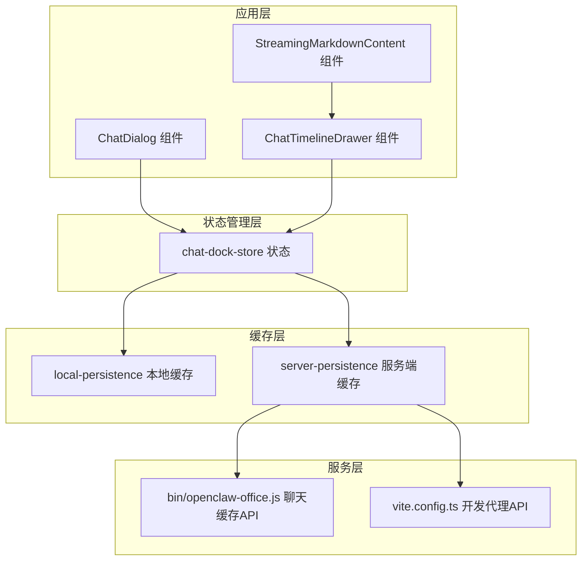
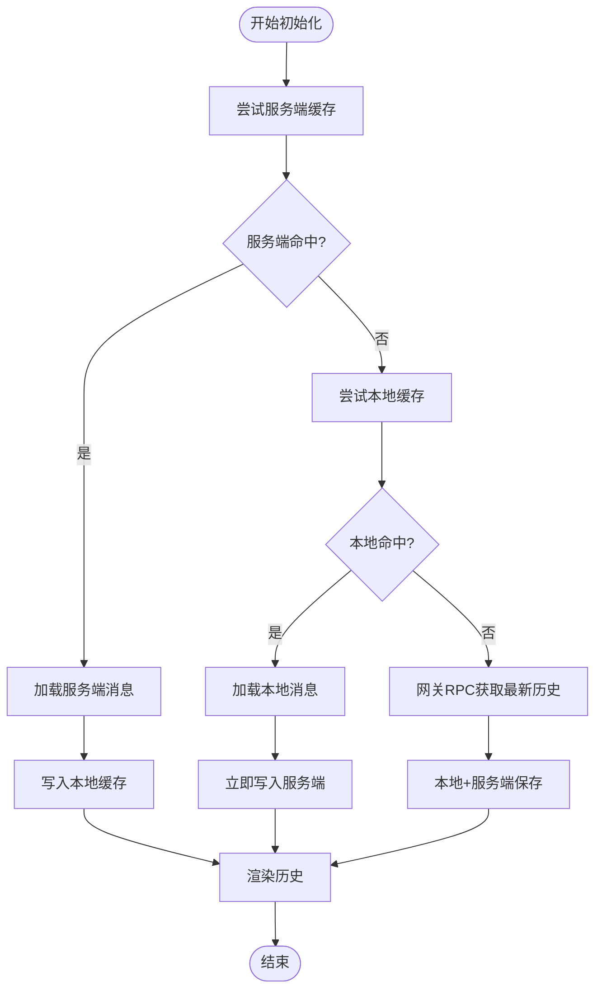
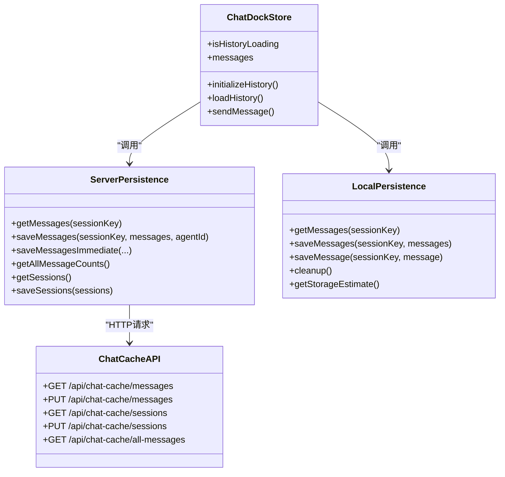
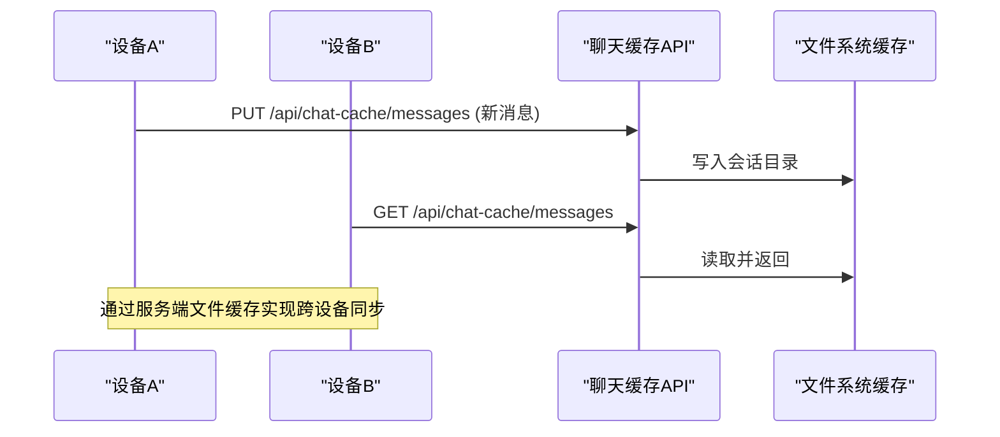
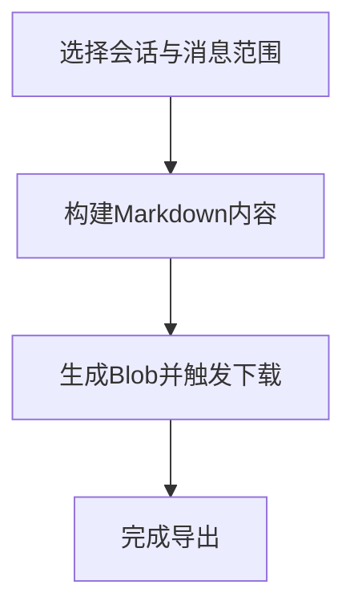
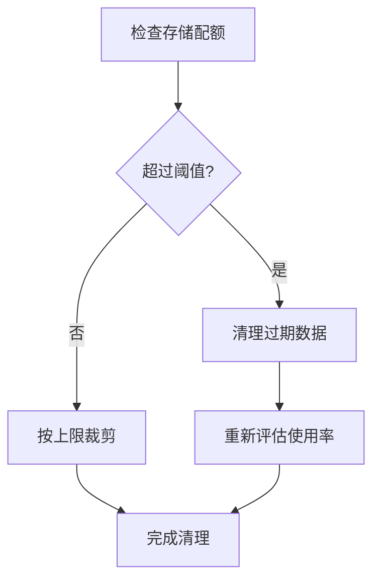
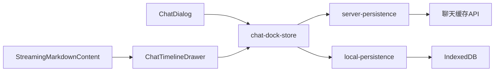

# 消息历史缓存

<cite>
**本文档引用的文件**
- [chat-dock-store.ts](file://src/store/console-stores/chat-dock-store.ts)
- [local-persistence.ts](file://src/lib/local-persistence.ts)
- [server-persistence.ts](file://src/lib/server-persistence.ts)
- [openclaw-office.js](file://bin/openclaw-office.js)
- [vite.config.ts](file://vite.config.ts)
- [chat-export.ts](file://src/lib/chat-export.ts)
- [ChatDialog.tsx](file://src/components/chat/ChatDialog.tsx)
- [ChatTimelineDrawer.tsx](file://src/components/chat/ChatTimelineDrawer.tsx)
- [StreamingMarkdownContent.tsx](file://src/components/chat/StreamingMarkdownContent.tsx)
- [message-utils.ts](file://src/lib/message-utils.ts)
</cite>

## 目录
1. [简介](#简介)
2. [项目结构](#项目结构)
3. [核心组件](#核心组件)
4. [架构总览](#架构总览)
5. [详细组件分析](#详细组件分析)
6. [依赖关系分析](#依赖关系分析)
7. [性能考虑](#性能考虑)
8. [故障排除指南](#故障排除指南)
9. [结论](#结论)
10. [附录](#附录)

## 简介
本技术文档围绕消息历史缓存系统进行深入解析，涵盖历史消息加载机制（按天分片缓存、增量加载、分页策略）、缓存策略设计（内存缓存、本地存储、服务端缓存的协调机制）、跨设备同步方案（消息ID唯一性、时间戳排序、冲突解决策略）、消息导出功能（Markdown格式导出、HTML渲染、批量导出）、缓存清理机制（过期删除、容量控制、手动清理）、离线模式支持、数据迁移与备份恢复，以及缓存API接口与性能优化建议。

## 项目结构
消息历史缓存系统主要由以下层次构成：
- 应用层：聊天对话组件与状态管理，负责触发历史加载、展示消息与流式内容。
- 状态管理层：聊天舱口状态存储，负责消息生命周期管理、历史初始化与事件处理。
- 缓存层：本地IndexedDB持久化与服务端文件缓存，提供多级缓存与跨设备同步能力。
- 服务层：内置HTTP服务器实现聊天缓存API，提供消息与会话缓存的增删改查。



**图表来源**
- [chat-dock-store.ts](file://src/store/console-stores/chat-dock-store.ts)
- [local-persistence.ts](file://src/lib/local-persistence.ts)
- [server-persistence.ts](file://src/lib/server-persistence.ts)
- [openclaw-office.js](file://bin/openclaw-office.js)
- [vite.config.ts](file://vite.config.ts)

**章节来源**
- [chat-dock-store.ts](file://src/store/console-stores/chat-dock-store.ts)
- [local-persistence.ts](file://src/lib/local-persistence.ts)
- [server-persistence.ts](file://src/lib/server-persistence.ts)
- [openclaw-office.js](file://bin/openclaw-office.js)
- [vite.config.ts](file://vite.config.ts)

## 核心组件
- 历史加载与增量更新：聊天舱口状态在初始化时按优先级从服务端缓存、本地缓存获取历史，并通过网关RPC确保最新数据；同时支持流式增量更新与工具事件后的重载。
- 多级缓存协调：服务端文件缓存（持久跨设备）、本地IndexedDB（快速回放与容量控制）、内存状态（当前会话消息）协同工作。
- 跨设备同步：通过服务端文件缓存统一存储，结合消息ID唯一性与时间戳排序，保证一致性与可恢复性。
- 导出与渲染：支持Markdown格式导出与HTML渲染，便于批量导出与分享。
- 清理与容量控制：基于过期时间与容量阈值的自动清理，以及手动清理接口。
- 离线与开发支持：内置HTTP服务器提供离线可用的聊天缓存API，开发环境通过Vite代理转发。

**章节来源**
- [chat-dock-store.ts](file://src/store/console-stores/chat-dock-store.ts)
- [local-persistence.ts](file://src/lib/local-persistence.ts)
- [server-persistence.ts](file://src/lib/server-persistence.ts)
- [chat-export.ts](file://src/lib/chat-export.ts)

## 架构总览
消息历史缓存采用“服务端文件缓存 + 本地IndexedDB + 内存状态”的三层架构，配合内置HTTP服务提供跨设备同步与离线支持。

```mermaid
sequenceDiagram
participant UI as "UI组件"
participant Store as "chat-dock-store"
participant Server as "server-persistence"
participant Local as "local-persistence"
participant API as "聊天缓存API"
UI->>Store : 初始化历史
Store->>Server : 获取服务端缓存(按会话)
Server->>API : GET /api/chat-cache/messages?sessionKey=...
API-->>Server : 返回消息列表
Server-->>Store : 消息数组
alt 命中服务端缓存
Store->>Local : 保存到本地缓存
Store-->>UI : 展示历史消息
else 未命中
Store->>Local : 读取本地缓存
Local-->>Store : 消息数组或空
opt 本地命中
Store->>Server : 立即保存到服务端
Store-->>UI : 展示历史消息
else 本地也无
Store->>API : 触发网关RPC拉取最新历史
API-->>Store : 返回最新消息
Store->>Local : 保存到本地
Store->>Server : 保存到服务端
Store-->>UI : 展示最新历史
end
end
```

**图表来源**
- [chat-dock-store.ts](file://src/store/console-stores/chat-dock-store.ts)
- [server-persistence.ts](file://src/lib/server-persistence.ts)
- [local-persistence.ts](file://src/lib/local-persistence.ts)
- [openclaw-office.js](file://bin/openclaw-office.js)

## 详细组件分析

### 历史消息加载机制
- 加载顺序与保护：优先尝试服务端文件缓存，失败则回退到本地IndexedDB，最后通过网关RPC获取最新数据；过程中使用并发保护，避免发送中的消息被覆盖。
- 分页与增量：当前实现以完整会话为单位加载，未见按天分片或分页参数的显式逻辑；可通过服务端API扩展支持分页查询。
- 时间戳与排序：消息按时间戳排序，确保展示顺序正确；工具消息在历史中默认折叠以便阅读。



**图表来源**
- [chat-dock-store.ts](file://src/store/console-stores/chat-dock-store.ts)
- [server-persistence.ts](file://src/lib/server-persistence.ts)
- [local-persistence.ts](file://src/lib/local-persistence.ts)

**章节来源**
- [chat-dock-store.ts](file://src/store/console-stores/chat-dock-store.ts)
- [ChatDialog.tsx](file://src/components/chat/ChatDialog.tsx)

### 缓存策略设计
- 服务端文件缓存：基于内置HTTP服务器的文件系统缓存，持久跨设备，适合长期保留与跨终端访问。
- 本地IndexedDB缓存：快速回放与容量控制，支持消息数量限制与过期清理。
- 内存状态缓存：当前会话的消息集合，响应式更新，支持流式增量渲染。



**图表来源**
- [chat-dock-store.ts](file://src/store/console-stores/chat-dock-store.ts)
- [server-persistence.ts](file://src/lib/server-persistence.ts)
- [local-persistence.ts](file://src/lib/local-persistence.ts)
- [openclaw-office.js](file://bin/openclaw-office.js)

**章节来源**
- [server-persistence.ts](file://src/lib/server-persistence.ts)
- [local-persistence.ts](file://src/lib/local-persistence.ts)

### 跨设备同步方案
- 消息ID唯一性：生成全局唯一的消息ID，避免重复与合并冲突。
- 时间戳排序：所有消息按时间戳排序，保证展示顺序一致。
- 冲突解决策略：服务端文件缓存作为权威源，本地缓存作为加速层；当网关RPC返回最新数据时，统一写入服务端与本地，确保最终一致。



**图表来源**
- [openclaw-office.js](file://bin/openclaw-office.js)
- [server-persistence.ts](file://src/lib/server-persistence.ts)

**章节来源**
- [message-utils.ts](file://src/lib/message-utils.ts)
- [openclaw-office.js](file://bin/openclaw-office.js)

### 消息导出功能
- Markdown格式导出：构建带标题、角色与时间戳的Markdown文本，支持下载为.md文件。
- HTML渲染：在流式渲染组件中对Markdown进行解析与渲染，提升阅读体验。
- 批量导出：可结合会话维度进行批量导出，便于归档与分享。



**图表来源**
- [chat-export.ts](file://src/lib/chat-export.ts)
- [StreamingMarkdownContent.tsx](file://src/components/chat/StreamingMarkdownContent.tsx)

**章节来源**
- [chat-export.ts](file://src/lib/chat-export.ts)
- [StreamingMarkdownContent.tsx](file://src/components/chat/StreamingMarkdownContent.tsx)

### 缓存清理机制
- 过期删除：按配置的过期天数清理过期消息与事件，定期执行以释放空间。
- 容量控制：当存储使用率超过阈值时触发清理，优先删除最早的数据。
- 手动清理：提供清除指定会话或全部数据的接口，便于用户主动管理。



**图表来源**
- [local-persistence.ts](file://src/lib/local-persistence.ts)

**章节来源**
- [local-persistence.ts](file://src/lib/local-persistence.ts)

### 离线模式支持、数据迁移与备份恢复
- 离线模式：内置HTTP服务器提供聊天缓存API，无需外部后端即可运行，满足离线场景。
- 数据迁移：通过服务端文件缓存的统一结构，可在不同版本间迁移数据；建议保留会话元数据与消息体结构。
- 备份恢复：将缓存目录整体备份，恢复时直接覆盖即可；注意保持会话键与时间戳一致性。

**章节来源**
- [openclaw-office.js](file://bin/openclaw-office.js)
- [vite.config.ts](file://vite.config.ts)

## 依赖关系分析
- chat-dock-store 依赖 server-persistence 与 local-persistence 实现历史加载与缓存写入。
- server-persistence 通过内置HTTP服务器提供REST接口，开发环境通过Vite代理转发。
- local-persistence 使用IndexedDB进行本地持久化，提供索引与事务操作。
- ChatDialog 与 ChatTimelineDrawer 负责UI交互与滚动行为，StreamingMarkdownContent 负责流式渲染。



**图表来源**
- [chat-dock-store.ts](file://src/store/console-stores/chat-dock-store.ts)
- [server-persistence.ts](file://src/lib/server-persistence.ts)
- [local-persistence.ts](file://src/lib/local-persistence.ts)
- [ChatDialog.tsx](file://src/components/chat/ChatDialog.tsx)
- [ChatTimelineDrawer.tsx](file://src/components/chat/ChatTimelineDrawer.tsx)
- [StreamingMarkdownContent.tsx](file://src/components/chat/StreamingMarkdownContent.tsx)

**章节来源**
- [chat-dock-store.ts](file://src/store/console-stores/chat-dock-store.ts)
- [server-persistence.ts](file://src/lib/server-persistence.ts)
- [local-persistence.ts](file://src/lib/local-persistence.ts)

## 性能考虑
- 缓存层级优化：优先命中服务端文件缓存，减少网关RPC调用频率；本地缓存用于快速回放与容量控制。
- 增量更新：流式渲染与批调度器减少UI抖动与重绘开销。
- 存储配额监控：定期清理过期数据，避免存储空间不足导致的性能下降。
- 分页与分片：当前未实现按天分片与分页参数，建议在服务端API增加分页查询与按日期切片，以降低单次加载数据量。

[本节为通用性能建议，不直接分析具体文件]

## 故障排除指南
- 历史加载失败：检查服务端缓存API是否可用，确认会话键是否存在；若服务端不可用，系统会回退到本地缓存与网关RPC。
- 本地缓存异常：确认IndexedDB可用且未被浏览器隐私模式限制；必要时清理缓存或调整容量阈值。
- 导出失败：确认浏览器支持Blob与下载API；若在非浏览器环境，导出会返回失败。
- 同步不一致：检查服务端文件缓存写入是否成功，确保消息ID唯一且时间戳正确。

**章节来源**
- [chat-dock-store.ts](file://src/store/console-stores/chat-dock-store.ts)
- [server-persistence.ts](file://src/lib/server-persistence.ts)
- [local-persistence.ts](file://src/lib/local-persistence.ts)
- [chat-export.ts](file://src/lib/chat-export.ts)

## 结论
该消息历史缓存系统通过服务端文件缓存、本地IndexedDB与内存状态的协同，实现了跨设备同步、高效加载与良好的用户体验。建议后续增强分页与按天分片能力，完善错误处理与监控告警，进一步提升稳定性与可维护性。

[本节为总结性内容，不直接分析具体文件]

## 附录

### 缓存API接口定义
- 获取会话消息
  - 方法：GET
  - 路径：/api/chat-cache/messages?sessionKey={sessionKey}
  - 成功响应：包含消息数组、会话键、作者代理ID、缓存时间
- 保存会话消息
  - 方法：PUT
  - 路径：/api/chat-cache/messages
  - 请求体：{ sessionKey, messages, agentId }
  - 成功响应：{ ok: true }
- 获取会话列表
  - 方法：GET
  - 路径：/api/chat-cache/sessions
  - 成功响应：{ sessions: SessionInfo[], cachedAt: number|null }
- 保存会话列表
  - 方法：PUT
  - 路径：/api/chat-cache/sessions
  - 请求体：{ sessions: SessionInfo[] }
  - 成功响应：{ ok: true }
- 获取所有消息计数
  - 方法：GET
  - 路径：/api/chat-cache/all-messages
  - 成功响应：{ sessions: [{ sessionKey, agentId, messageCount, cachedAt }] }

**章节来源**
- [openclaw-office.js](file://bin/openclaw-office.js)
- [vite.config.ts](file://vite.config.ts)