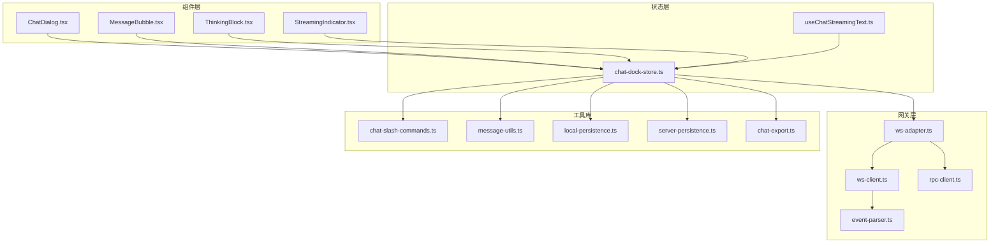
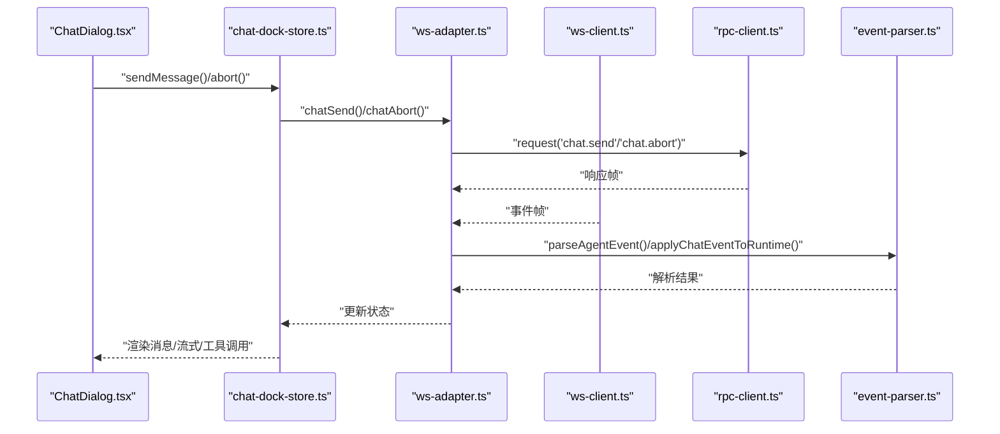
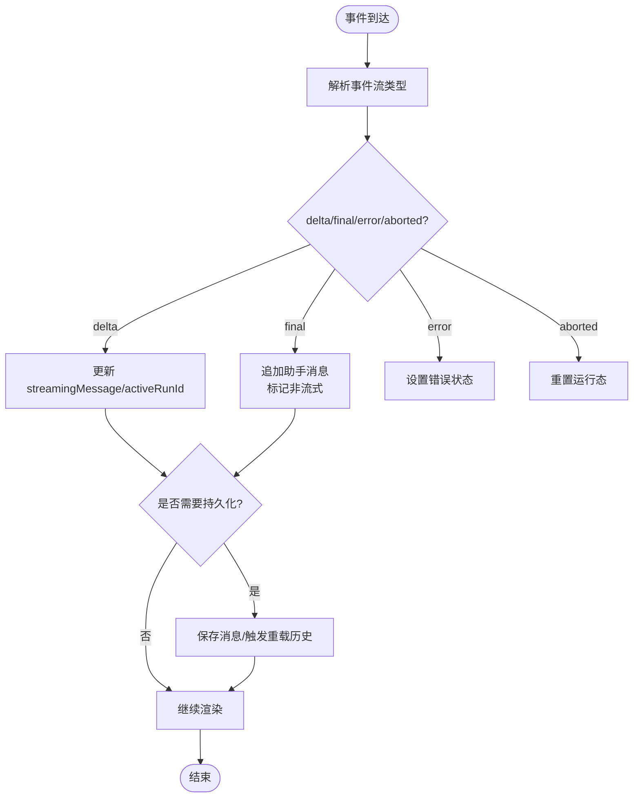
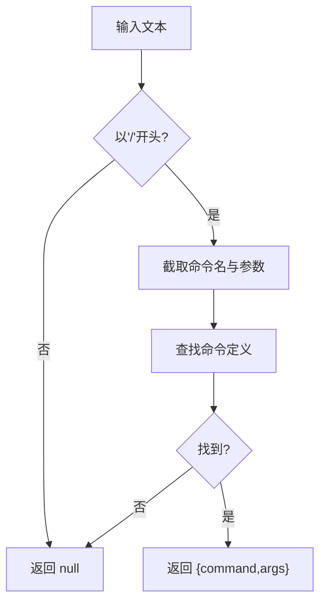
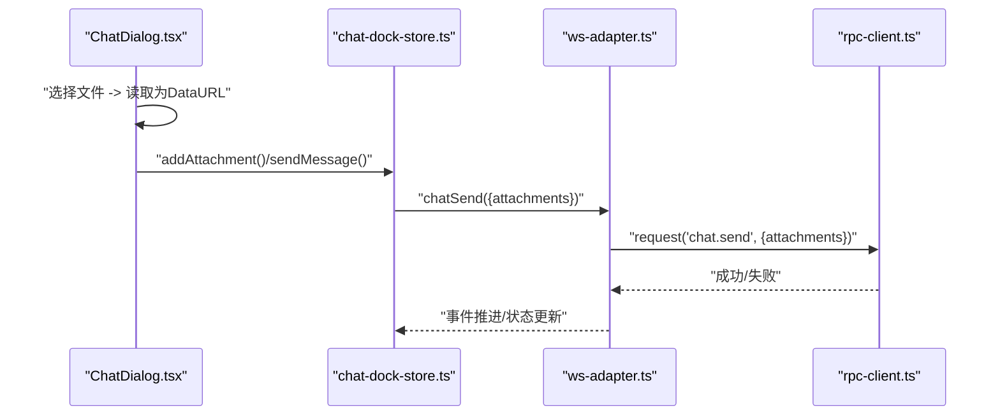
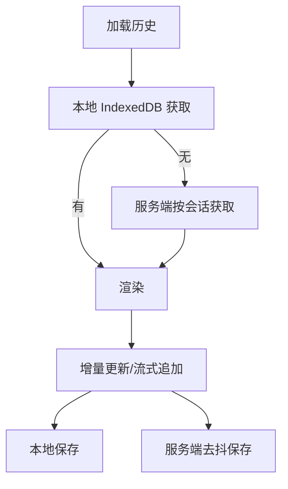
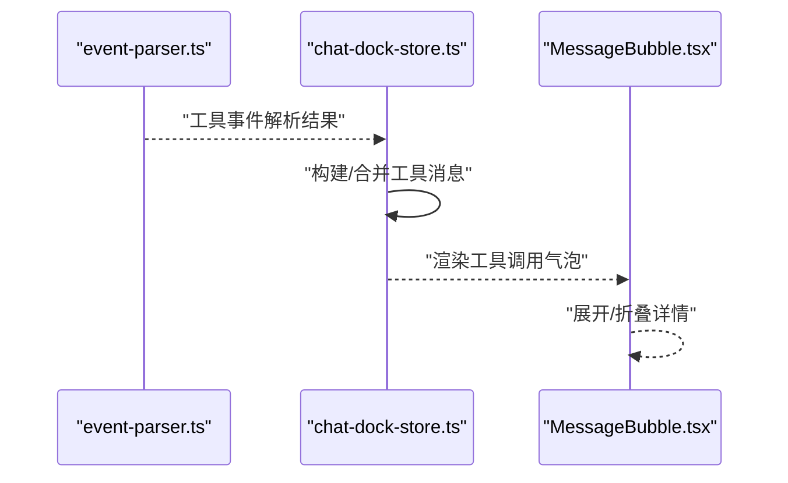
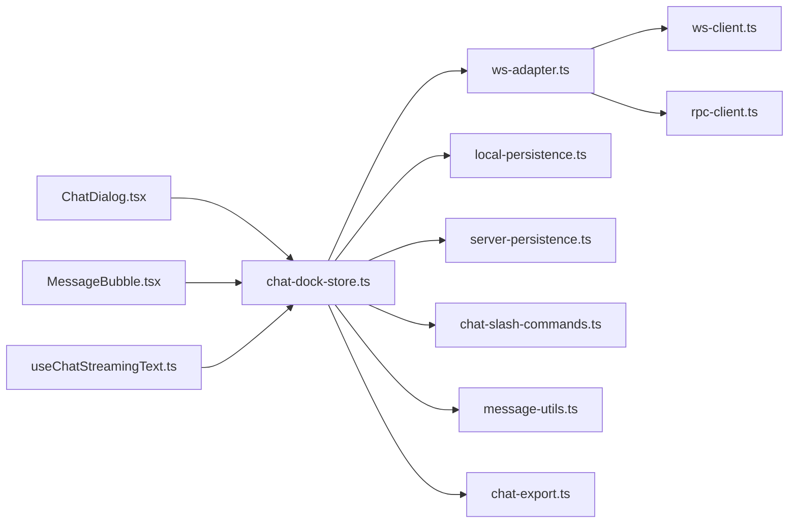

# 聊天工作区

<cite>
**本文引用的文件**
- [README.md](file://README.md)
- [chat-slash-commands.ts](file://src/lib/chat-slash-commands.ts)
- [message-utils.ts](file://src/lib/message-utils.ts)
- [local-persistence.ts](file://src/lib/local-persistence.ts)
- [server-persistence.ts](file://src/lib/server-persistence.ts)
- [ws-client.ts](file://src/gateway/ws-client.ts)
- [ws-adapter.ts](file://src/gateway/ws-adapter.ts)
- [event-parser.ts](file://src/gateway/event-parser.ts)
- [rpc-client.ts](file://src/gateway/rpc-client.ts)
- [ChatDialog.tsx](file://src/components/chat/ChatDialog.tsx)
- [MessageBubble.tsx](file://src/components/chat/MessageBubble.tsx)
- [ThinkingBlock.tsx](file://src/components/chat/ThinkingBlock.tsx)
- [StreamingIndicator.tsx](file://src/components/chat/StreamingIndicator.tsx)
- [useChatStreamingText.ts](file://src/hooks/useChatStreamingText.ts)
- [chat-dock-store.ts](file://src/store/console-stores/chat-dock-store.ts)
- [chat-export.ts](file://src/lib/chat-export.ts)
</cite>

## 目录
1. [简介](#简介)
2. [项目结构](#项目结构)
3. [核心组件](#核心组件)
4. [架构总览](#架构总览)
5. [详细组件分析](#详细组件分析)
6. [依赖关系分析](#依赖关系分析)
7. [性能考量](#性能考量)
8. [故障排查指南](#故障排查指南)
9. [结论](#结论)
10. [附录](#附录)

## 简介
本文件面向“聊天工作区”系统，围绕实时消息流处理、斜杠命令系统、附件支持、聊天历史持久化、工具调用可视化、消息缓存与性能优化、错误处理与 API 使用示例进行系统化技术说明。目标读者包括前端工程师、全栈开发者与产品/运营人员。

## 项目结构
聊天工作区位于前端工程中，采用模块化组织：
- 组件层：聊天对话、消息气泡、思考块、流式指示器等 UI 组件
- 状态层：Zustand 状态存储，负责会话、消息队列、流式内容、历史加载等
- 网关层：WebSocket 客户端、RPC 客户端、事件解析器、适配器
- 工具库：斜杠命令解析、消息合并与批调度、本地/服务端持久化
- 导出与附件：Markdown 导出、图片/文件上传与预览

图表来源
- [ChatDialog.tsx:30-432](file://src/components/chat/ChatDialog.tsx#L30-L432)
- [MessageBubble.tsx:160-257](file://src/components/chat/MessageBubble.tsx#L160-L257)
- [ThinkingBlock.tsx:11-54](file://src/components/chat/ThinkingBlock.tsx#L11-L54)
- [StreamingIndicator.tsx:1-6](file://src/components/chat/StreamingIndicator.tsx#L1-L6)
- [chat-dock-store.ts:1-1703](file://src/store/console-stores/chat-dock-store.ts#L1-L1703)
- [useChatStreamingText.ts:78-88](file://src/hooks/useChatStreamingText.ts#L78-L88)
- [ws-client.ts:22-304](file://src/gateway/ws-client.ts#L22-L304)
- [rpc-client.ts:17-63](file://src/gateway/rpc-client.ts#L17-L63)
- [ws-adapter.ts:40-353](file://src/gateway/ws-adapter.ts#L40-L353)
- [event-parser.ts:17-225](file://src/gateway/event-parser.ts#L17-L225)
- [chat-slash-commands.ts:60-106](file://src/lib/chat-slash-commands.ts#L60-L106)
- [message-utils.ts:55-112](file://src/lib/message-utils.ts#L55-L112)
- [local-persistence.ts:34-408](file://src/lib/local-persistence.ts#L34-L408)
- [server-persistence.ts:53-138](file://src/lib/server-persistence.ts#L53-L138)
- [chat-export.ts:25-44](file://src/lib/chat-export.ts#L25-L44)

章节来源
- [README.md:25-35](file://README.md#L25-L35)

## 核心组件
- 实时消息流处理：WebSocket 连接管理、事件解析、流式文本与思考内容提取、工具调用状态注入
- 斜杠命令系统：/help、/new、/reset、/model、/think、/export 等命令定义与解析
- 附件支持：图片/文件上传、DataURL 预览、发送时编码传输
- 历史持久化：IndexedDB 本地缓存与服务端按会话分片缓存
- 工具调用可视化：在对话流中插入工具调用状态消息，支持展开/折叠
- 性能优化：批调度、去抖保存、消息长度限制、配额清理
- 错误处理：连接状态、超时、RPC 错误、本地存储失败兜底

章节来源
- [ws-client.ts:22-304](file://src/gateway/ws-client.ts#L22-L304)
- [ws-adapter.ts:40-353](file://src/gateway/ws-adapter.ts#L40-L353)
- [event-parser.ts:17-225](file://src/gateway/event-parser.ts#L17-L225)
- [chat-slash-commands.ts:60-106](file://src/lib/chat-slash-commands.ts#L60-L106)
- [ChatDialog.tsx:172-193](file://src/components/chat/ChatDialog.tsx#L172-L193)
- [MessageBubble.tsx:160-257](file://src/components/chat/MessageBubble.tsx#L160-L257)
- [local-persistence.ts:34-408](file://src/lib/local-persistence.ts#L34-L408)
- [server-persistence.ts:53-138](file://src/lib/server-persistence.ts#L53-L138)
- [useChatStreamingText.ts:78-88](file://src/hooks/useChatStreamingText.ts#L78-L88)

## 架构总览
聊天工作区通过 WebSocket 与 Gateway 交互，RPC 用于请求会话历史与发送消息；事件经解析后进入 Zustand 状态，UI 组件订阅状态并渲染。

图表来源
- [ChatDialog.tsx:172-176](file://src/components/chat/ChatDialog.tsx#L172-L176)
- [chat-dock-store.ts:792-795](file://src/store/console-stores/chat-dock-store.ts#L792-L795)
- [ws-adapter.ts:98-127](file://src/gateway/ws-adapter.ts#L98-L127)
- [rpc-client.ts:20-62](file://src/gateway/rpc-client.ts#L20-L62)
- [ws-client.ts:132-147](file://src/gateway/ws-client.ts#L132-L147)
- [event-parser.ts:17-60](file://src/gateway/event-parser.ts#L17-L60)

## 详细组件分析

### 实时消息流处理机制
- WebSocket 连接管理
  - 自动重连、指数退避+抖动、最大尝试次数与延迟上限
  - 设备身份签名认证与令牌认证双通道
  - 状态回调与关闭事件处理
- 事件解析
  - lifecycle/tool/assistant/error/item/plan/approval/command_output/patch/thinking/compaction 等流类型解析
  - 生成 Agent 可视化状态、语音气泡、工具记录与摘要
- 流式消息接收
  - delta/final/error/aborted 状态机推进
  - 流式文本与思考内容提取、去除思考标签
  - 批量调度与最大延迟控制，避免频繁渲染
- 消息状态同步
  - 会话级运行时状态（activeRunId、isStreaming、streamingMessage）
  - 工具调用状态注入与合并，支持展开/折叠
  - 思考块可折叠/展开，流式时默认展开

图表来源
- [event-parser.ts:17-225](file://src/gateway/event-parser.ts#L17-L225)
- [chat-dock-store.ts:177-309](file://src/store/console-stores/chat-dock-store.ts#L177-L309)
- [useChatStreamingText.ts:12-88](file://src/hooks/useChatStreamingText.ts#L12-L88)
- [message-utils.ts:55-112](file://src/lib/message-utils.ts#L55-L112)

章节来源
- [ws-client.ts:104-130](file://src/gateway/ws-client.ts#L104-L130)
- [ws-client.ts:149-181](file://src/gateway/ws-client.ts#L149-L181)
- [ws-client.ts:270-295](file://src/gateway/ws-client.ts#L270-L295)
- [event-parser.ts:31-59](file://src/gateway/event-parser.ts#L31-L59)
- [chat-dock-store.ts:177-309](file://src/store/console-stores/chat-dock-store.ts#L177-L309)
- [useChatStreamingText.ts:12-88](file://src/hooks/useChatStreamingText.ts#L12-L88)
- [message-utils.ts:55-112](file://src/lib/message-utils.ts#L55-L112)

### 斜杠命令系统
- 命令定义
  - 命令名、描述键、参数占位符、可选参数集合、是否本地执行
  - 支持 /help、/new、/reset、/model、/think、/export 等
- 解析流程
  - 以 “/” 开头，首个空白/冒号分隔命令名与参数
  - 返回命令定义与参数字符串
- 帮助文本
  - 动态拼接帮助列表，包含命令与参数说明

图表来源
- [chat-slash-commands.ts:72-94](file://src/lib/chat-slash-commands.ts#L72-L94)
- [chat-slash-commands.ts:60-106](file://src/lib/chat-slash-commands.ts#L60-L106)

章节来源
- [chat-slash-commands.ts:18-58](file://src/lib/chat-slash-commands.ts#L18-L58)
- [chat-slash-commands.ts:72-94](file://src/lib/chat-slash-commands.ts#L72-L94)
- [chat-slash-commands.ts:96-106](file://src/lib/chat-slash-commands.ts#L96-L106)

### 附件支持功能
- 上传与预览
  - 选择图片文件，读取为 DataURL，显示在输入区域
  - 发送时将 DataURL 提取为 Base64 内容，区分 image 与 file 类型
- 下载与展示
  - 消息气泡中根据 dataUrl 渲染图片缩略图
- 发送流程
  - 通过 RPC chat.send，携带附件数组（含类型、mimeType、name、content）

图表来源
- [ChatDialog.tsx:177-193](file://src/components/chat/ChatDialog.tsx#L177-L193)
- [ChatDialog.tsx:424-432](file://src/components/chat/ChatDialog.tsx#L424-L432)
- [ws-adapter.ts:98-123](file://src/gateway/ws-adapter.ts#L98-L123)
- [rpc-client.ts:20-62](file://src/gateway/rpc-client.ts#L20-L62)

章节来源
- [ChatDialog.tsx:177-193](file://src/components/chat/ChatDialog.tsx#L177-L193)
- [ChatDialog.tsx:424-432](file://src/components/chat/ChatDialog.tsx#L424-L432)
- [ws-adapter.ts:98-123](file://src/gateway/ws-adapter.ts#L98-L123)

### 聊天历史持久化
- 本地持久化（IndexedDB）
  - 存储键：chat_messages、event_history、chat_sessions
  - 索引：按 sessionKey/timestamp/session_time 等
  - 限制：每会话最大消息数、事件总数、消息/事件过期天数
  - 维护：配额阈值检查、过期清理、批量写入与清空
- 服务端持久化（按会话分片缓存）
  - 接口：GET/PUT/DELETE /api/chat-cache/messages，PUT /api/chat-cache/sessions
  - 去抖保存：同会话消息保存合并，避免频繁网络请求
  - 获取计数：/api/chat-cache/all-messages 返回各会话消息数量提示

图表来源
- [local-persistence.ts:97-151](file://src/lib/local-persistence.ts#L97-L151)
- [local-persistence.ts:171-213](file://src/lib/local-persistence.ts#L171-L213)
- [local-persistence.ts:217-271](file://src/lib/local-persistence.ts#L217-L271)
- [local-persistence.ts:275-306](file://src/lib/local-persistence.ts#L275-L306)
- [server-persistence.ts:54-107](file://src/lib/server-persistence.ts#L54-L107)
- [server-persistence.ts:109-127](file://src/lib/server-persistence.ts#L109-L127)

章节来源
- [local-persistence.ts:34-408](file://src/lib/local-persistence.ts#L34-L408)
- [server-persistence.ts:53-138](file://src/lib/server-persistence.ts#L53-L138)

### 工具调用可视化
- 事件映射
  - agent.tool.start/end 映射为工具调用“调用中/已完成”
  - 生成系统消息（kind=tool），包含工具名、参数、结果、状态
- 渲染逻辑
  - 气泡状态：运行中/完成/错误，支持展开查看参数与结果
  - 与流式内容分离，避免覆盖思考块
- 合并策略
  - 同一 runId 与工具名的消息合并，避免重复

图表来源
- [event-parser.ts:90-111](file://src/gateway/event-parser.ts#L90-L111)
- [chat-dock-store.ts:320-395](file://src/store/console-stores/chat-dock-store.ts#L320-L395)
- [MessageBubble.tsx:75-158](file://src/components/chat/MessageBubble.tsx#L75-L158)

章节来源
- [event-parser.ts:90-111](file://src/gateway/event-parser.ts#L90-L111)
- [chat-dock-store.ts:320-395](file://src/store/console-stores/chat-dock-store.ts#L320-L395)
- [MessageBubble.tsx:75-158](file://src/components/chat/MessageBubble.tsx#L75-L158)

### 消息缓存策略与性能优化
- 批调度
  - 批次间隔与最大延迟，累积增量文本后统一 flush
- 去抖保存
  - 同一会话消息保存合并，减少网络与服务端压力
- 本地配额与清理
  - 使用率超过阈值自动清理过期与多余条目
- 限制与裁剪
  - 每会话最大消息数、事件总数、过期天数
- 渲染优化
  - 流式指示器、思考块折叠、图片缩略图懒加载

章节来源
- [message-utils.ts:55-112](file://src/lib/message-utils.ts#L55-L112)
- [server-persistence.ts:41-51](file://src/lib/server-persistence.ts#L41-L51)
- [local-persistence.ts:326-338](file://src/lib/local-persistence.ts#L326-L338)
- [local-persistence.ts:340-357](file://src/lib/local-persistence.ts#L340-L357)
- [local-persistence.ts:359-385](file://src/lib/local-persistence.ts#L359-L385)

### 错误处理
- 连接错误
  - 连接中/重连中/错误状态提示与重试按钮
- RPC 错误
  - 超时、未连接、服务端错误封装为 RpcError
- 本地存储失败
  - IndexedDB 打开失败、事务异常静默处理，不影响主流程

章节来源
- [ChatDialog.tsx:243-268](file://src/components/chat/ChatDialog.tsx#L243-L268)
- [rpc-client.ts:7-15](file://src/gateway/rpc-client.ts#L7-L15)
- [rpc-client.ts:20-62](file://src/gateway/rpc-client.ts#L20-L62)
- [local-persistence.ts:53-86](file://src/lib/local-persistence.ts#L53-L86)

### API 接口与使用示例
- 服务端聊天缓存接口
  - GET /api/chat-cache/messages?sessionKey=xxx
  - PUT /api/chat-cache/messages（body: {sessionKey, messages, agentId}）
  - DELETE /api/chat-cache/messages?sessionKey=xxx
  - PUT /api/chat-cache/sessions（body: {sessions}）
  - GET /api/chat-cache/all-messages（返回各会话计数）
- 使用示例
  - 获取某会话历史：GET /api/chat-cache/messages?sessionKey=agent:xxx:main
  - 保存会话消息：PUT /api/chat-cache/messages，携带 messages 数组
  - 清空会话：DELETE /api/chat-cache/messages?sessionKey=agent:xxx:main
  - 保存会话列表：PUT /api/chat-cache/sessions
  - 获取所有会话消息计数：GET /api/chat-cache/all-messages

章节来源
- [server-persistence.ts:54-107](file://src/lib/server-persistence.ts#L54-L107)
- [server-persistence.ts:109-127](file://src/lib/server-persistence.ts#L109-L127)

## 依赖关系分析
- 组件依赖
  - ChatDialog 依赖 Zustand 状态与 Hook 提取流式文本
  - MessageBubble 依赖 Office Store 获取 Agent 名称，渲染工具调用与思考块
- 网关依赖
  - WsAdapter 封装 WebSocket 事件与 RPC 请求
  - WsClient 管理连接生命周期与重连
  - RpcClient 提供请求-响应模型与超时控制
- 工具库依赖
  - Local/Server Persistence 与 Zustand Store 解耦，便于替换实现
  - Chat Export 仅依赖消息列表与会话键

图表来源
- [ChatDialog.tsx:30-50](file://src/components/chat/ChatDialog.tsx#L30-L50)
- [MessageBubble.tsx:1-11](file://src/components/chat/MessageBubble.tsx#L1-L11)
- [useChatStreamingText.ts:1-2](file://src/hooks/useChatStreamingText.ts#L1-L2)
- [chat-dock-store.ts:1-18](file://src/store/console-stores/chat-dock-store.ts#L1-L18)
- [ws-adapter.ts:40-47](file://src/gateway/ws-adapter.ts#L40-L47)
- [ws-client.ts:22-39](file://src/gateway/ws-client.ts#L22-L39)
- [rpc-client.ts:17-18](file://src/gateway/rpc-client.ts#L17-L18)
- [local-persistence.ts:404-408](file://src/lib/local-persistence.ts#L404-L408)
- [server-persistence.ts:25-26](file://src/lib/server-persistence.ts#L25-L26)
- [chat-slash-commands.ts:1-2](file://src/lib/chat-slash-commands.ts#L1-L2)
- [message-utils.ts:1-2](file://src/lib/message-utils.ts#L1-L2)
- [chat-export.ts:1-2](file://src/lib/chat-export.ts#L1-L2)

## 性能考量
- 渲染层面
  - 流式文本批调度，减少频繁 re-render
  - 思考块默认折叠，仅在流式时展开
  - 图片缩略图按需渲染，避免大图阻塞
- 网络与存储
  - 服务端保存去抖，合并多次写入
  - 本地配额阈值触发清理，避免无限增长
- 连接稳定性
  - 指数退避+抖动重连，最大延迟上限
  - 设备身份签名与令牌双重认证，提升握手成功率

## 故障排查指南
- 连接问题
  - 观察连接状态栏：断开/重连中/错误
  - 点击重试或刷新页面
- RPC 超时
  - 检查 Gateway 是否可用，确认 WebSocket 连通
  - 查看 RpcError 错误码与消息
- 本地存储异常
  - IndexedDB 打开失败或事务报错会被静默处理
  - 清理浏览器缓存或禁用无痕模式后重试
- 历史缺失
  - 首次加载优先读取本地缓存，若无则回退到服务端
  - 若仍缺，检查服务端接口与会话键

章节来源
- [ChatDialog.tsx:243-268](file://src/components/chat/ChatDialog.tsx#L243-L268)
- [rpc-client.ts:20-62](file://src/gateway/rpc-client.ts#L20-L62)
- [local-persistence.ts:53-86](file://src/lib/local-persistence.ts#L53-L86)

## 结论
聊天工作区通过清晰的分层设计与稳健的实时通信机制，实现了高可用的对话体验。其特性包括：
- 实时流式消息与工具调用可视化
- 本地与服务端双层持久化，保障跨设备一致性
- 可扩展的斜杠命令系统与附件支持
- 面向性能的批调度与配额清理策略
建议在生产环境中结合监控指标（连接成功率、RPC 超时率、本地存储使用率）持续优化。

## 附录
- 术语
  - RunId：一次对话运行标识
  - ToolCall：工具调用对象，包含 id/name/args/status/result
  - SessionKey：会话唯一键，形如 agent:{agentId}:{suffix}
- 常用路径参考
  - 斜杠命令定义与解析：[chat-slash-commands.ts:1-106](file://src/lib/chat-slash-commands.ts#L1-L106)
  - 流式文本提取与批调度：[useChatStreamingText.ts:1-88](file://src/hooks/useChatStreamingText.ts#L1-L88)、[message-utils.ts:55-112](file://src/lib/message-utils.ts#L55-L112)
  - 本地/服务端持久化：[local-persistence.ts:34-408](file://src/lib/local-persistence.ts#L34-L408)、[server-persistence.ts:53-138](file://src/lib/server-persistence.ts#L53-L138)
  - WebSocket/RPC：[ws-client.ts:22-304](file://src/gateway/ws-client.ts#L22-L304)、[rpc-client.ts:17-63](file://src/gateway/rpc-client.ts#L17-L63)
  - 事件解析与状态推进：[event-parser.ts:17-225](file://src/gateway/event-parser.ts#L17-L225)、[chat-dock-store.ts:177-309](file://src/store/console-stores/chat-dock-store.ts#L177-L309)
  - 附件与导出：[ChatDialog.tsx:177-193](file://src/components/chat/ChatDialog.tsx#L177-L193)、[chat-export.ts:25-44](file://src/lib/chat-export.ts#L25-L44)