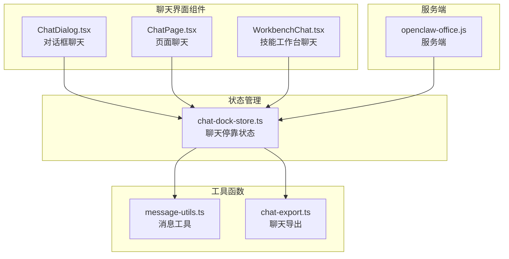
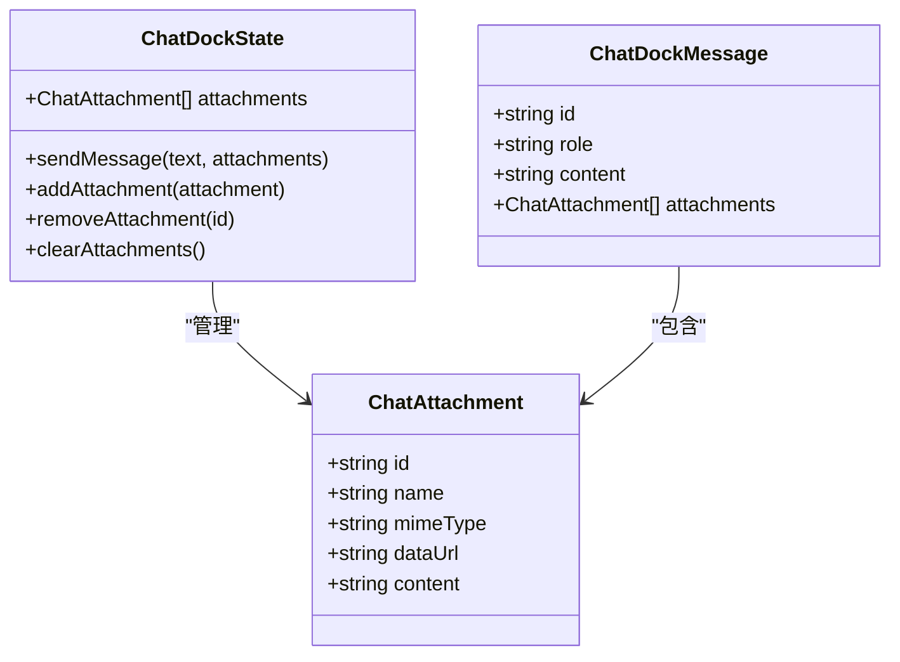
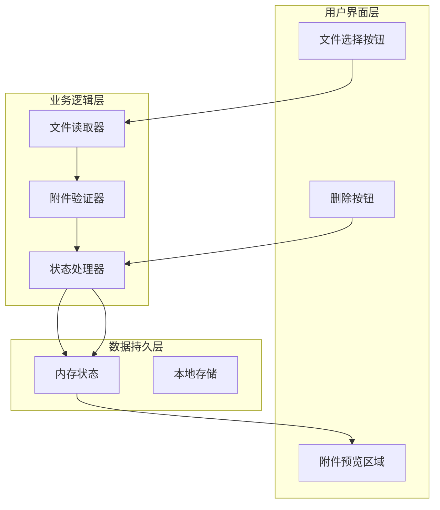
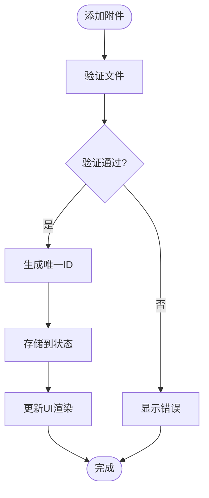
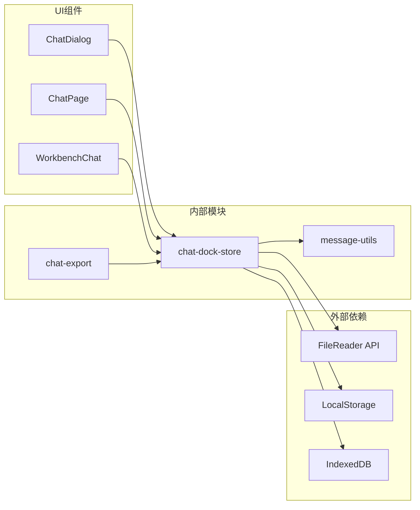

# 附件支持功能

<cite>
**本文档引用的文件**
- [ChatDialog.tsx](file://src/components/chat/ChatDialog.tsx)
- [ChatPage.tsx](file://src/components/pages/ChatPage.tsx)
- [WorkbenchChat.tsx](file://src/components/console/skills/WorkbenchChat.tsx)
- [chat-dock-store.ts](file://src/store/console-stores/chat-dock-store.ts)
- [message-utils.ts](file://src/lib/message-utils.ts)
- [chat-export.ts](file://src/lib/chat-export.ts)
- [openclaw-office.js](file://bin/openclaw-office.js)
</cite>

## 目录
1. [简介](#简介)
2. [项目结构](#项目结构)
3. [核心组件](#核心组件)
4. [架构概览](#架构概览)
5. [详细组件分析](#详细组件分析)
6. [依赖关系分析](#依赖关系分析)
7. [性能考虑](#性能考虑)
8. [故障排除指南](#故障排除指南)
9. [结论](#结论)

## 简介

附件支持功能是OpenClaw Office聊天系统的重要组成部分，为用户提供文件上传、预览和管理能力。该功能实现了完整的附件生命周期管理，包括文件选择、格式验证、大小限制、并发上传、图片预览、响应式显示和内存管理。

## 项目结构

附件支持功能主要分布在以下组件中：



**图表来源**
- [ChatDialog.tsx:1-432](file://src/components/chat/ChatDialog.tsx#L1-432)
- [ChatPage.tsx:1-553](file://src/components/pages/ChatPage.tsx#L1-553)
- [WorkbenchChat.tsx:1-252](file://src/components/console/skills/WorkbenchChat.tsx#L1-252)

## 核心组件

### 附件数据模型

附件系统基于统一的数据结构设计：



**图表来源**
- [chat-dock-store.ts:22-43](file://src/store/console-stores/chat-dock-store.ts#L22-L43)
- [chat-dock-store.ts:546-562](file://src/store/console-stores/chat-dock-store.ts#L546-L562)

### 文件读取机制

系统采用FileReader API实现文件到Base64的转换：

```mermaid
sequenceDiagram
participant U as 用户
participant C as 组件
participant F as FileReader
participant S as 状态管理
U->>C : 选择文件
C->>F : readAsDataURL(file)
F-->>C : Base64数据
C->>S : addAttachment({
id : filename-timestamp,
name : file.name,
mimeType : file.type,
dataUrl : base64
})
S-->>C : 更新附件列表
C-->>U : 显示预览
```

**图表来源**
- [ChatDialog.tsx:177-192](file://src/components/chat/ChatDialog.tsx#L177-L192)
- [ChatPage.tsx:187-202](file://src/components/pages/ChatPage.tsx#L187-L202)
- [WorkbenchChat.tsx:105-120](file://src/components/console/skills/WorkbenchChat.tsx#L105-L120)

**章节来源**
- [ChatDialog.tsx:177-192](file://src/components/chat/ChatDialog.tsx#L177-L192)
- [ChatPage.tsx:187-202](file://src/components/pages/ChatPage.tsx#L187-L202)
- [WorkbenchChat.tsx:105-120](file://src/components/console/skills/WorkbenchChat.tsx#L105-L120)

## 架构概览

附件支持功能采用分层架构设计：



**图表来源**
- [chat-dock-store.ts:99-101](file://src/store/console-stores/chat-dock-store.ts#L99-L101)

## 详细组件分析

### 聊天对话框附件功能

ChatDialog组件提供了完整的附件支持：

#### 文件选择与预览
- 支持多文件选择（multiple属性）
- 图片文件自动预览（dataUrl渲染）
- 文本文件图标显示（FileText图标）

#### 附件管理操作
- 实时预览显示
- 单个删除功能
- 批量清空功能

**章节来源**
- [ChatDialog.tsx:346-364](file://src/components/chat/ChatDialog.tsx#L346-L364)
- [ChatDialog.tsx:370-374](file://src/components/chat/ChatDialog.tsx#L370-L374)

### 页面级聊天附件功能

ChatPage组件实现了更丰富的附件管理：

#### 响应式预览布局
- 固定尺寸预览框（16x16像素）
- 智能内容识别（图片vs文本）
- 自动化文件类型检测

#### 用户交互优化
- 鼠标悬停效果
- 删除确认机制
- 清空批量操作

**章节来源**
- [ChatPage.tsx:414-457](file://src/components/pages/ChatPage.tsx#L414-L457)

### 技能工作台附件功能

WorkbenchChat组件针对开发场景优化：

#### 精简预览界面
- 紧凑的标签式预览
- 最大宽度限制（120px）
- 快速删除操作

#### 开发者友好特性
- 编辑模式特殊提示
- 流式生成状态指示
- 自动滚动优化

**章节来源**
- [WorkbenchChat.tsx:177-195](file://src/components/console/skills/WorkbenchChat.tsx#L177-L195)

### 状态管理架构

附件状态通过Zustand状态管理器集中控制：



**图表来源**
- [chat-dock-store.ts:554-562](file://src/store/console-stores/chat-dock-store.ts#L554-L562)

**章节来源**
- [chat-dock-store.ts:99-101](file://src/store/console-stores/chat-dock-store.ts#L99-L101)

### 文件类型处理机制

系统采用多层次的文件类型检测：

#### MIME类型检测
- 原生File.type属性
- 默认应用/octet-stream
- 类型前缀匹配（image/、text/）

#### 文件扩展名映射
```javascript
// 支持的图片格式
".png": "image/png",
".jpg": "image/jpeg",
".jpeg": "image/jpeg",
".gif": "image/gif",
".webp": "image/webp"

// 支持的字体格式
".woff": "font/woff",
".woff2": "font/woff2",
".ttf": "font/ttf"
```

**章节来源**
- [ChatDialog.tsx:370-371](file://src/components/chat/ChatDialog.tsx#L370-L371)
- [openclaw-office.js:22-39](file://bin/openclaw-office.js#L22-L39)

## 依赖关系分析

附件支持功能的依赖关系如下：



**图表来源**
- [chat-dock-store.ts:1-17](file://src/store/console-stores/chat-dock-store.ts#L1-L17)
- [ChatDialog.tsx:1-10](file://src/components/chat/ChatDialog.tsx#L1-L10)

**章节来源**
- [chat-dock-store.ts:1-17](file://src/store/console-stores/chat-dock-store.ts#L1-L17)

## 性能考虑

### 内存管理策略

系统采用以下内存管理策略：

#### Base64数据处理
- 文件读取后立即转换为Base64
- 避免重复读取同一文件
- 及时清理已删除附件的内存

#### 并发上传优化
- 逐个文件处理，避免内存峰值
- 异步读取不阻塞UI线程
- 大文件分块处理建议

### 响应式优化

#### 预览渲染优化
- 图片预览使用固定尺寸
- 条件渲染减少DOM节点
- 懒加载机制（按需渲染）

#### 存储策略
- 本地缓存最近会话
- IndexedDB持久化
- 自动清理过期数据

## 故障排除指南

### 常见问题及解决方案

#### 文件读取失败
**症状**: 附件无法添加或显示空白
**原因**: 文件过大或格式不受支持
**解决**: 
- 检查文件大小限制
- 验证文件格式兼容性
- 查看浏览器控制台错误信息

#### 内存使用过高
**症状**: 页面响应缓慢或崩溃
**原因**: 大量图片附件占用内存
**解决**:
- 及时清理不需要的附件
- 使用压缩后的图片
- 监控内存使用情况

#### 预览显示异常
**症状**: 图片预览不显示或显示错误
**原因**: Base64数据损坏或格式不正确
**解决**:
- 重新选择文件
- 检查文件完整性
- 清理浏览器缓存

**章节来源**
- [ChatDialog.tsx:177-192](file://src/components/chat/ChatDialog.tsx#L177-L192)
- [ChatPage.tsx:187-202](file://src/components/pages/ChatPage.tsx#L187-L202)

## 结论

附件支持功能通过精心设计的架构实现了完整的文件处理能力。系统采用响应式设计、内存优化和用户友好的交互界面，为不同使用场景提供了灵活的附件管理方案。

### 主要优势
- **多场景适配**: 对话框、页面和工作台三种界面风格
- **性能优化**: 智能内存管理和异步处理
- **用户体验**: 直观的预览和便捷的操作流程
- **扩展性强**: 模块化设计便于功能扩展

### 技术亮点
- 统一的附件数据模型
- 多层次的文件类型检测
- 完整的生命周期管理
- 响应式预览渲染

该功能为OpenClaw Office提供了强大的文件处理能力，满足了现代聊天应用对附件支持的需求。